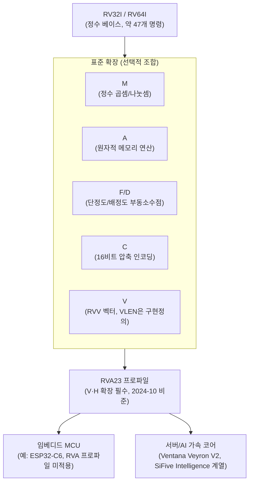

**RISC-V 아키텍처**란 UC Berkeley에서 시작된 개방형·로열형-프리(royalty-free) 명령어 집합 구조(ISA)로, 아주 작은 필수 베이스 위에 표준 확장을 조합해 마이크로컨트롤러부터 서버·AI 가속 코어까지 같은 설계 원리로 확장하는 방식을 말합니다. x86과 ARM은 각각 Intel/AMD, ARM Holdings라는 단일 소유자가 ISA를 통제하지만, RISC-V는 누구나 로열티 없이 구현할 수 있는 표준이라 커스텀 실리콘·임베디드·니치 워크로드에서 채택이 빠르게 늘고 있습니다. 이 장은 RISC-V "자체"의 성능 특성을 다루지 않습니다 — RISC-V는 CPU가 아니라 명세이므로, 실제 성능은 그 명세를 구현한 코어(저전력 마이크로컨트롤러부터 슈퍼스칼라 서버 코어까지)에 전적으로 달려 있습니다. 대신 이 장은 그 명세가 왜 그렇게 설계되었는지, 확장 조합이 어떤 트레이드오프를 만드는지, 그리고 언제 이 ISA를 선택하는 것이 실무적으로 타당한지를 다룹니다.

## 이 장을 읽기 전에

이 장은 [15장: μOp 캐시와 DSB](/post/cpu-optimization/uop-cache-decoded-stream-buffer/)에서 다룬 x86 프런트엔드 디코딩 비용, [01장: CPU 파이프라인 기초](/post/cpu-optimization/cpu-pipeline-fundamentals/)의 페치·디코드·실행 단계 구분, [08장: 현대 CPU 아키텍처 비교](/post/cpu-optimization/modern-cpu-architecture-comparison/)에서 다룬 Intel/AMD/ARM 비교 감각을 전제로 합니다. 이 장의 깊이는 <strong>전문(니치)</strong>입니다 — 일반적인 x86/ARM 서버·데스크톱 최적화 작업에는 직접 필요하지 않지만, 임베디드·커스텀 실리콘·RISC-V 기반 AI 가속기를 다루게 될 때 필요한 배경을 제공합니다. **다루지 않는 것**: RISC-V 코어의 분기 예측·비순차 실행 내부 구현 세부(→ 일반 원리는 [02장](/post/cpu-optimization/branch-prediction-mechanisms-cost/)·[06장](/post/cpu-optimization/out-of-order-execution-performance/)과 동일하게 적용되며 RISC-V 전용 차이는 벤더 구현 문서를 봐야 함), RVV 인트린식 API의 전체 목록(공식 명세 문서로 위임), 컴파일러의 자동 벡터화 전략 세부(→ [Tr.03: 컴파일러·빌드 최적화](/post/compiler-optimization/getting-started-compiler-build-performance-tuning/))입니다.

## 당신의 수준에 맞는 경로

| 수준 | 읽을 부분 | 핵심 목표 |
|------|---------|---------|
| **중급자** | "설계 철학과 역사" ~ "모듈형 ISA: 베이스와 확장" | RISC-V가 왜 "베이스+확장" 구조를 택했는지, x86/ARM과 무엇이 다른지 이해 |
| **심화** | "RVA 프로파일" ~ "RVV 벡터 확장의 메커니즘" | 프로파일이 파편화를 통제하는 방식과 vector-length-agnostic 모델의 동작 원리 이해 |
| **전문가** | "흔한 오개념" ~ "비판적 시각" | RISC-V 채택 여부를 워크로드·생태계 성숙도 기준으로 판단 |

---

## 설계 철학과 역사

RISC-V는 2010년 UC Berkeley에서 Krste Asanović 교수와 대학원생 Yunsup Lee, Andrew Waterman이 연구·교육용으로 쓸 "군더더기 없는" 명령어 집합이 필요해지면서 시작되었습니다. 당시 존재하던 ISA는 대부분 특정 기업이 소유한 독점 표준이거나, 수십 년간 쌓인 하위 호환 부담(legacy baggage)으로 명세 자체가 복잡했습니다. 이름의 "V"는 우연이 아니라 Berkeley가 1980년대부터 이어온 RISC 계열 연구(RISC-I, RISC-II, SOAR, SPUR)의 다섯 번째 세대라는 의미이며, David Patterson(원조 RISC 연구를 이끈 인물)이 설계에 참여했다는 점도 이 계보를 뒷받침합니다. 베이스 정수 ISA(RV32I/RV64I)는 2014년에 사실상 동결되었고, 사용자 수준(Unprivileged) ISA는 이후 표준화 절차를 거쳐 비준되었습니다. 표준화·거버넌스는 처음 RISC-V Foundation(2015년 결성)이 맡았다가, 이후 스위스에 본부를 둔 RISC-V International으로 재편되어 지금까지 사양을 관리하고 있습니다.

설계 철학은 세 가지로 요약됩니다. 첫째는 **단순성**으로, 베이스 ISA는 약 47개의 정수 명령만으로 구성되어 소규모 팀도 처음부터 구현·검증할 수 있는 크기를 유지합니다. 둘째는 **모듈성**으로, 필수 베이스는 극소화하고 나머지는 모두 선택적 확장으로 분리해 같은 ISA 계보가 마이크로컨트롤러부터 데이터센터 코어까지 스케일하도록 합니다. 셋째는 **개방성**으로, 명세 자체가 로열티 없이 공개되어 있어 누구나 구현·수정할 수 있습니다 — RISC-V International도 공식적으로 "로열티 없는 개방형 기본 구성 요소" 위에서 설계 자유·선택·유연성을 제공한다는 점을 핵심 가치로 밝히고 있습니다([RISC-V International: About](https://riscv.org/about/)). 이 세 원칙이 실무에 미치는 영향은, RISC-V 코어를 고른다는 것이 "하나의 성능 특성을 고른다"는 뜻이 아니라 "어떤 확장 조합을 고를지 결정하는 설계 문제를 떠안는다"는 뜻이 된다는 점입니다.

## 모듈형 ISA: 베이스와 확장

RISC-V의 베이스는 RV32I(32비트), RV64I(64비트), RV128I(128비트, 실험적) 정수 ISA와 레지스터 수를 절반(16개)으로 줄인 임베디드 변형 RV32E로 구성됩니다. 이 위에 표준 확장이 필요에 따라 조합됩니다 — **M**(정수 곱셈·나눗셈), **A**(원자적 메모리 연산, 락프리 자료구조에 필요), **F/D**(단정도·배정도 부동소수점), **C**(16비트 압축 인코딩), **V**(벡터 연산)가 대표적입니다. IMAFD 조합에 Zicsr(제어·상태 레지스터 접근)·Zifencei(명령어 페치 순서 보장)를 더한 조합을 관례적으로 "G"(General)로 줄여 부르며, 흔히 보는 "RV64GC"라는 표기는 "RV64I + G + C", 즉 범용 정수·부동소수점 연산에 압축 인코딩을 더한 조합을 뜻합니다.

이 구조가 x86과 근본적으로 다른 지점은 명령어 인코딩 자체에 있습니다. x86은 1바이트~15바이트까지 가변 길이 명령어를 쓰며, 이 가변성이 병렬 디코드를 어렵게 만들어 [15장](/post/cpu-optimization/uop-cache-decoded-stream-buffer/)에서 다룬 μOp 캐시·Decoded Stream Buffer 같은 보완 구조가 필요해졌습니다. RISC-V는 표준 명령어를 고정 32비트로 유지하고, C 확장을 켜면 자주 쓰이는 패턴만 16비트로 압축하는 방식을 택해, 명령어 경계를 찾는 문제 자체를 단순하게 만듭니다. 그 대가로 압축 여부를 판단하는 추가 디코드 단계가 필요하지만, 이는 x86의 완전 가변 길이 디코딩보다는 훨씬 예측 가능한 부담입니다. 이 차이는 고성능 RISC-V 코어가 상대적으로 적은 복잡도로 넓은 프런트엔드를 구현할 수 있는 배경이기도 합니다 — 벤더 발표 기준으로, SiFive P870은 6-wide 비순차 디코드·디스패치를 갖추면서도 압축 인코딩 덕분에 사이클당 최대 9개 명령 분량의 바이트를 페치한다고 알려져 있습니다([Chips and Cheese: Hot Chips 2023 - SiFive's P870 Takes RISC-V Further](https://chipsandcheese.com/2023/09/03/hot-chips-2023-sifives-p870-takes-risc-v-further/)).

## RVA 프로파일: 파편화를 통제하는 장치

확장을 자유롭게 조합할 수 있다는 것은 동시에 "어떤 조합이 실제 존재하는가"를 소프트웨어가 예측하기 어렵게 만드는 위험이기도 합니다. RISC-V International은 이 문제를 <strong>프로파일(Profile)</strong>로 대응합니다 — 특정 용도(예: 리치 OS를 구동하는 애플리케이션 프로세서)에 필요한 확장 조합을 표준으로 고정해, 소프트웨어 개발자가 "이 프로파일을 지원하는 칩이라면 이 명령들은 항상 있다"고 가정할 수 있게 하는 것입니다. RVA20에서 시작해 RVA22를 거쳐, 2024년 10월 21일 RVA23 프로파일이 비준되었습니다. RVA23의 핵심은 이전까지 선택 사항이던 벡터 확장(V)과 하이퍼바이저 확장(H)이 처음으로 필수(mandatory)가 되었다는 점입니다.

> "Vector and Hypervisor extensions are key mandatory components of the RVA23 Profile." — [RISC-V International, 2024](https://riscv.org/blog/risc-v-announces-ratification-of-the-rva23-profile-standard/)

이는 RVA23을 준수하는 모든 애플리케이션 코어가 벡터 연산과 가상화를 표준 기능으로 갖춘다는 뜻이며, 벡터·가상화에 의존하는 소프트웨어가 "이 명령이 있을 수도 없을 수도 있다"는 조건부 코드를 짤 필요를 줄여줍니다.



RVA23 이후 첫 실리콘이 시장에 나오는 시점은 2025~2026년입니다. 벤더 발표 기준으로, SpacemiT K3 SoC의 X100(범용 코어)/A100(AI 코어) 조합이 RVA23·RVV 1.0을 지원하는 초기 상용 칩으로 꼽히고([LinuxGizmos: SpacemiT K3 integrates 8-core RISC-V CPU cluster and 60 TOPS AI engine](https://linuxgizmos.com/spacemit-k3-integrates-8-core-risc-v-cpu-cluster-and-60-tops-ai-engine/)), 서버·AI 영역에서는 Ventana Micro의 Veyron V2가 RVA23을 준수하며 512비트 벡터 유닛과 AI 행렬 확장을 갖춘 코어로 2025년부터 하이퍼스케일러·HPC 고객에게 공급을 시작한다고 발표되었습니다([The Next Platform: Ventana Launches Veyron V2 RISC-V Into The Datacenter](https://www.nextplatform.com/2023/11/07/ventana-launches-veyron-v2-risc-v-into-the-datacenter/); [Ventana: 2025 Shipments of Veyron V2 Platform](https://www.prnewswire.com/news-releases/ventana-announces-2025-shipments-of-veyron-v2-platform-with-broad-market-adoption-302282035.html)). 다만 이 수치들은 대부분 벤더 발표 자료에 근거하므로, 뒤의 "비판적 시각"에서 다시 짚습니다. 반대편 극단인 저전력 임베디드에서는 RVA 프로파일 자체가 적용되지 않는 32비트 마이크로컨트롤러 코어가 이미 수억 대 단위로 출하되고 있으며, [Espressif ESP32-C6](https://www.espressif.com/en/products/socs/esp32-c6)처럼 160MHz 고성능 코어와 20MHz 저전력 코어를 함께 얹은 듀얼 RISC-V MCU가 대표적입니다.

## RVV 벡터 확장의 메커니즘

RVV(RISC-V Vector Extension)를 x86의 AVX2/AVX-512나 ARM NEON/SVE와 같은 종류의 SIMD로 이해하면 핵심을 놓칩니다. AVX2는 256비트, AVX-512는 512비트로 벡터 폭이 명령어 인코딩에 고정되어 있어, 더 넓은 벡터 폭을 쓰려면 다른 명령어 세트로 재컴파일해야 합니다. RVV는 대신 **vector-length-agnostic(VLA)** 모델을 택합니다 — 벡터 레지스터의 실제 폭(VLEN)은 구현마다 다르게 정의되며(예: 128비트짜리 저전력 코어부터 수 킬로비트짜리 서버 벡터 유닛까지), 소프트웨어는 `vsetvl` 계열 명령으로 "이번 반복에서 몇 개의 원소를 처리할 수 있는지"를 하드웨어에 물어본 뒤 그 값만큼만 처리하는 **스트립마이닝(strip-mining)** 루프를 씁니다. 이 방식의 실무적 의미는, 같은 바이너리가 VLEN 128비트 임베디드 코어와 VLEN 1024비트 서버 코어 양쪽에서 재컴파일 없이 동작하도록 설계되었다는 점입니다 — AVX2용 바이너리를 AVX-512 코어에서 그대로 최대 성능으로 돌릴 수 없는 x86의 제약과 대조적입니다. RVV는 여기에 더해 `LMUL`(레지스터 그룹핑 배수)과 `SEW`(선택된 원소 폭) 설정으로 레지스터 압박과 처리량 사이의 트레이드오프를 소프트웨어가 조정할 수 있게 합니다. 정확한 명령 인코딩과 `vsetvl` 계열의 의미론은 공식 명세 저장소([riscv/riscv-v-spec](https://github.com/riscv/riscv-v-spec))에 정의되어 있으며, 이 장에서는 그 전체를 다시 옮기지 않고 실무에 필요한 모델만 다룹니다.

아래는 이 모델을 잘못 적용한 코드와, 스트립마이닝으로 고친 버전입니다. C 표준 벡터 인트린식(GCC 14+/LLVM 17+가 따르는 RVV 인트린식 v1.0 명명 규칙 기준이며, 이전 버전 툴체인은 함수 이름이 다를 수 있는 구현 정의 영역입니다)을 사용합니다.

```c
#include <stddef.h>
#include <riscv_vector.h>

// 깨진 버전: SSE/AVX 시절 사고방식대로 "한 번에 4개"를 고정
// VLEN이 128비트보다 넓은 코어(예: 256비트 이상)에서는 매 반복 벡터 레인의
// 절반 이상이 놀게 되어 RVV를 쓰는 의미가 사라진다.
void axpy_broken(size_t n, float a, const float* x, float* y) {
  for (size_t i = 0; i + 4 <= n; i += 4) {
    vfloat32m1_t vx = __riscv_vle32_v_f32m1(&x[i], 4);
    vfloat32m1_t vy = __riscv_vle32_v_f32m1(&y[i], 4);
    vy = __riscv_vfmacc_vf_f32m1(vy, a, vx, 4);
    __riscv_vse32_v_f32m1(&y[i], vy, 4);
  }
}
```

원인은 `4`라는 상수를 요청 길이(AVL)로 고정해 버린 것입니다. RVV의 `__riscv_vle32_v_f32m1(ptr, avl)` 호출에서 마지막 인자는 "이번에 처리하고 싶은 원소 수"일 뿐 실제 처리 개수를 보장하지 않으며, 하드웨어가 그보다 넓은 벡터 레지스터를 갖고 있어도 코드가 4개로 자르는 순간 나머지 레인은 그냥 놀게 됩니다. 올바른 구현은 매 반복 시작에서 `vsetvl`로 하드웨어가 실제로 처리 가능한 개수(`vl`)를 먼저 얻고, 그 값을 이후 모든 연산과 인덱스 증가에 그대로 사용합니다.

```c
#include <stddef.h>
#include <riscv_vector.h>

// 올바른 구현: vsetvl로 이번 반복에 처리 가능한 원소 수(vl)를 하드웨어에 묻고
// 그 값만큼만 처리한다. VLEN이 얼마든 재컴파일 없이 같은 바이너리로 동작한다.
void axpy_good(size_t n, float a, const float* x, float* y) {
  for (size_t i = 0; i < n; ) {
    size_t vl = __riscv_vsetvl_e32m1(n - i);
    vfloat32m1_t vx = __riscv_vle32_v_f32m1(&x[i], vl);
    vfloat32m1_t vy = __riscv_vle32_v_f32m1(&y[i], vl);
    vy = __riscv_vfmacc_vf_f32m1(vy, a, vx, vl);
    __riscv_vse32_v_f32m1(&y[i], vy, vl);
    i += vl;
  }
}
```

검증은 컴파일 가능 여부와 실제 실리콘·시뮬레이터에서의 사이클 비교 두 단계로 나눕니다. 아래는 그 골격입니다(플랫폼·컴파일러·플래그를 명시하며, 실제 배율은 대상 실리콘의 VLEN·메모리 대역폭에 따라 달라지므로 반드시 직접 재현해야 합니다).

```bash
# 컴파일 확인: Clang 18 / GCC 14 기준, RVA23 대응(rv64gcv) 타깃
clang --target=riscv64-linux-gnu -march=rv64gcv -O2 -c axpy_good.c -o axpy_good.o

# 실행/측정: QEMU riscv64 사용자 모드 또는 실제 RVA23 실리콘
# (SiFive P870 계열, Ventana Veyron V2 등)에서 perf stat로 사이클·명령 수 비교
perf stat -e cycles,instructions ./axpy_bench --mode=scalar
perf stat -e cycles,instructions ./axpy_bench --mode=rvv
```

## 흔한 오개념

<strong>"RISC-V는 하나의 CPU다"</strong>는 가장 흔한 오해입니다. RISC-V는 명령어 집합 표준일 뿐 구현이 아니므로, 저전력 in-order 마이크로컨트롤러 코어부터 슈퍼스칼라 비순차 실행 서버 코어(SiFive P870, Ventana Veyron V2, Tenstorrent Ascalon 등)까지 성능 스펙트럼이 완전히 다릅니다. "RISC-V가 x86보다 빠르다/느리다"라는 문장은 비교 대상 구현을 명시하지 않으면 의미가 없습니다.

<strong>"RISC-V는 임베디드·니치 전용이다"</strong>도 더 이상 정확하지 않습니다. Ventana Veyron V2가 RVA23을 준수하며 하이퍼스케일러·HPC 고객에게 실리콘을 공급하기 시작했고, SiFive의 Intelligence 라인은 AI 추론 가속기 시장을 정면으로 겨냥하고 있습니다. 다만 이 확장은 여전히 AI 가속기·커스텀 실리콘 영역에 집중되어 있고, 범용 서버 시장에서 x86/ARM을 대체하는 수준의 소프트웨어 생태계 성숙도에는 아직 도달하지 못했다는 점은 구분해야 합니다.

<strong>"RVV 벡터 확장은 AVX/NEON과 같은 개념이다"</strong>는 앞서 다룬 대로 부정확합니다. AVX/NEON은 고정 폭 SIMD로 폭이 바뀌면 재컴파일이 필요하지만, RVV는 vector-length-agnostic 모델로 같은 바이너리가 다른 VLEN의 구현에서도 동작하도록 설계되었습니다. 이 차이를 모르고 SSE/AVX식으로 벡터 폭을 코드에 하드코딩하면 위의 `axpy_broken` 예시처럼 RVV를 쓰는 의미 자체가 사라집니다.

## 판단 기준

| 상황 | 권장 | 비권장 |
|------|------|--------|
| 커스텀 실리콘·ASIC에 로열티 없는 ISA·명령어 커스터마이징이 필요할 때 | RISC-V 채택 검토(확장 커스터마이징 포함) | 라이선스 비용이 있는 독점 ISA 고집 |
| 저전력 IoT/MCU, 코드 밀도(플래시 용량)가 중요할 때 | RISC-V + C(압축) 확장 임베디드 코어 | 압축 인코딩 없는 32비트 전용 ISA |
| 검증된 상용 SW 생태계(컴파일러 최적화, ISV 라이브러리)가 최우선일 때 | x86/ARM 유지 | 생태계 성숙도 확인 없이 RISC-V 전환 |
| AI 추론·벡터 커널이 핫패스이고 RVA23 이후 표준 벡터 API가 필요할 때 | RVA23 준수 RISC-V 벡터 코어 검토(단, 실리콘 성숙도 재확인) | 벤더 발표 수치만으로 채택 확정 |
| 레거시 바이너리를 즉시 이식해야 할 때 | x86/ARM 유지(RISC-V는 재컴파일 전제) | 재컴파일·툴체인 검증 없이 RISC-V로 이전 |

## 비판적 시각: 개방성의 대가

모듈형 확장 구조는 파편화 위험을 항상 안고 있습니다. RVA 프로파일이 "이 조합은 항상 있다"는 보장을 제공하지만, 벤더별 커스텀 확장(예: 특정 벡터 가속 명령)은 프로파일 밖에 남아 있어 "RISC-V 호환"이라는 말이 곧 "이 벤더의 모든 코어에서 같은 바이너리가 최고 성능으로 동작한다"는 뜻은 아닙니다. 소프트웨어 생태계도 여전히 격차가 있습니다 — GCC/LLVM의 RVA 타깃 지원과 Linux 커널의 RISC-V 포트는 빠르게 성숙했지만, 특정 수학 라이브러리·프로파일러·상용 디버거의 RISC-V 지원은 x86/ARM 대비 좁은 편이라, 실제 프로젝트에서는 툴체인 버전별로 직접 확인해야 합니다. 벤더가 공개하는 TeraFLOPS/코어, IPC 향상률 같은 수치는 대개 초기 실리콘이나 시뮬레이션 기준이므로, Ventana나 SiFive의 발표 자료를 그대로 채택 근거로 쓰기보다 독립 벤치마크나 자체 재현으로 재확인하는 것이 안전합니다. 마지막으로 2026년 현재 RVA23 실리콘은 아직 초기 단계입니다 — 서버·데이터센터 채택은 하이퍼스케일러의 파일럿·AI 가속기 통합 수준에 머물러 있고, 범용 워크로드에서 x86/ARM을 대체할 만큼 배포 사례가 누적되지는 않았습니다.

## 마무리

- RISC-V가 ISA 표준이지 특정 CPU 구현이 아니라는 것을 설명하고, "RISC-V 성능"을 논할 때 반드시 구현을 명시할 수 있다.
- 베이스(RV32I/RV64I)와 표준 확장(M/A/F/D/C/V)의 모듈형 구조, 그리고 RVA23 프로파일이 파편화를 통제하는 방식을 설명할 수 있다.
- RVV의 vector-length-agnostic 모델이 AVX/NEON류 고정 폭 SIMD와 근본적으로 다르다는 것을 스트립마이닝 코드로 보여줄 수 있다.
- 임베디드 코드 밀도, 커스텀 실리콘, AI 가속기 통합처럼 RISC-V가 실무적으로 유리한 상황과, 생태계 성숙도가 우선인 상황을 구분해 판단할 수 있다.
- 벤더가 공개하는 RISC-V 성능 수치를 초기 실리콘/시뮬레이션 기반 주장으로 받아들이고 독립 검증이 필요함을 안다.

**이전 장**: [μOp 캐시와 DSB](/post/cpu-optimization/uop-cache-decoded-stream-buffer/) (챕터 15)

다음 장에서는 지금까지 다룬 파이프라인·캐시·ISA 관점을 하나의 분석 언어로 묶는 **TopDown 방법론의 기초 직관**을 다룹니다. Frontend Bound와 Backend Bound를 구분하는 최소한의 틀을 세우면, 01장의 파이프라인부터 이 장의 RISC-V 확장 조합까지 서로 다른 원인들이 왜 결국 같은 카운터 언어로 수렴하는지 이해할 수 있습니다.

→ [Frontend vs Backend Bound 개념](/post/cpu-optimization/frontend-backend-bound-topdown-basics/) (챕터 17)
