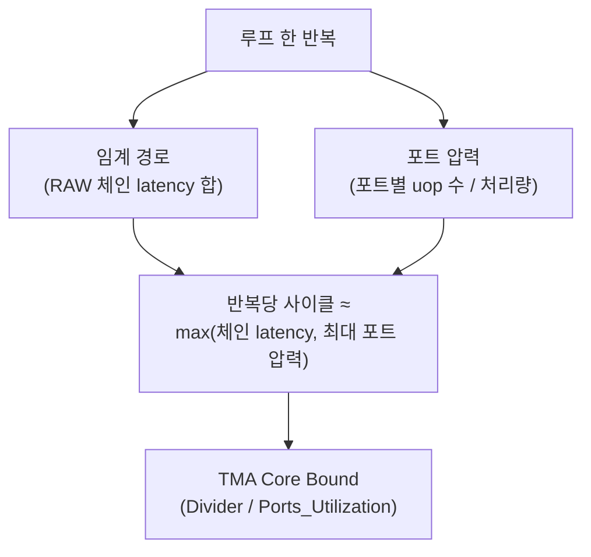

**의존성 체인·포트 압력 분석**이란 한 루프 반복이 실제로 몇 사이클에 끝나는지를 "명령이 몇 개인가"가 아니라 두 개의 서로 다른 물리량 — 데이터 의존성이 강제하는 **임계 경로(critical path) 지연시간**과, 실행 포트가 감당할 수 있는 **처리량(throughput)** — 중 어느 쪽이 더 큰지로 계산하는 작업을 말합니다. [05장](/post/cpu-optimization/instruction-level-parallelism-fundamentals/)은 RAW 의존 체인이 병렬성의 상한을 정한다는 것을, [06장](/post/cpu-optimization/out-of-order-execution-performance/)은 Out-of-Order 엔진이 그 상한 안에서 독립 명령을 어떻게 앞당겨 실행하는지를 다뤘습니다. 그런데 실무에서는 "의존 체인을 다 끊었는데도 코드가 안 빨라지는" 경우가 흔히 나오는데, 그 이유는 대개 체인이 아니라 **실행 포트 자체가 병목**이기 때문입니다. 서로 완전히 독립적인 명령이라도 같은 종류의 실행 유닛을 두고 경쟁하면, ROB와 reservation station이 아무리 크고 여유 있어도 그 포트가 한 사이클에 처리할 수 있는 개수 이상은 나갈 수 없습니다. 이 장은 체인 길이를 실제 지연시간(사이클)으로 환산하는 방법과, 포트 압력을 정량적으로 계산해 두 병목을 구분하는 방법을 함께 다룹니다.

## 이 장을 읽기 전에

**전제 지식**: 이 장은 [05장: 명령 수준 병렬성(ILP) 기초](/post/cpu-optimization/instruction-level-parallelism-fundamentals/)에서 다룬 RAW/WAR/WAW 하자드 구분과 "의존 체인 길이가 병렬성을 제약한다"는 결론, [06장: Out-of-Order 실행과 성능](/post/cpu-optimization/out-of-order-execution-performance/)에서 다룬 ROB·reservation station의 동작, [17장: Frontend vs Backend Bound 개념](/post/cpu-optimization/frontend-backend-bound-topdown-basics/)에서 다룬 TopDown 분석의 최소 분류(Core Bound가 Backend Bound의 하위 범주라는 것)를 전제로 합니다. 이 셋 중 하나라도 낯설다면 먼저 해당 장을 읽는 편이 좋습니다.

**이 장의 깊이**: **중급**입니다. 체인 latency와 명령 처리량(reciprocal throughput)이라는 두 숫자를 구분하고, 그 둘을 이용해 한 루프 반복이 latency-bound인지 port-bound인지 스스로 계산하는 것이 목표입니다. **다루지 않는 것**: RAW/WAR/WAW 하자드 자체의 정의(→ 05장), ROB·reservation station·레지스터 리네이밍의 내부 동작(→ 06장), TMA의 4대 카테고리와 PMU 카운터 읽는 법 자체(→ [Tr.01 하드웨어 성능 카운터](/post/profiling-analysis/hardware-performance-counters/), [09장](/post/cpu-optimization/cpu-hardware-performance-counters/)), 그리고 μop 캐시가 프런트엔드 대역폭에 미치는 영향(→ [15장](/post/cpu-optimization/uop-cache-decoded-stream-buffer/))입니다.

## 당신의 수준에 맞는 경로

| 수준 | 읽을 부분 | 핵심 목표 |
|------|---------|---------|
| **초보자** | "임계 경로 개념의 등장" ~ "의존 체인 길이와 임계 경로 지연시간" | latency와 reciprocal throughput이 서로 다른 숫자라는 것 이해 |
| **중급자** | "실행 포트와 포트 압력" ~ "체인과 포트가 함께 만드는 실제 병목" | 포트 압력을 계산하고 체인 병목과 구분하는 방법 습득 |
| **전문가** | "판단 기준" ~ "비판적 시각" | llvm-mca·perf 카운터로 실측하고 모델의 한계를 판단 |

---

## 임계 경로 개념의 등장 (역사·배경)

"임계 경로(critical path)"라는 용어 자체는 CPU 설계보다 훨씬 오래전인 1950년대 프로젝트 일정 관리 기법(PERT/CPM)에서 왔습니다 — 여러 작업이 서로 선후 관계로 얽혀 있을 때, 전체 완료 시간을 결정하는 것은 "가장 긴 의존 사슬"이지 작업 개수의 합이 아니라는 통찰입니다. 명령어 수준에서 이 개념을 정량적으로 쓰려면 명령 하나하나의 **지연시간(latency)**과 **처리량의 역수(reciprocal throughput)**를 알아야 하는데, 이 두 숫자를 인텔이 공식 매뉴얼에 촘촘히 공개하지 않던 시절에는 개별 연구자가 직접 측정해야 했습니다. 덴마크의 Agner Fog는 1990년대 후반부터 여러 세대의 x86 CPU를 손수 마이크로벤치마킹해 명령별 latency·throughput·포트 사용 정보를 표로 정리해 왔고, 이 [명령어 지연시간·처리량 표](https://www.agner.org/optimize/)는 지금도 매년 갱신되며 업계 표준 참고 자료로 쓰입니다. 2019년에는 자를란트 대학의 Andreas Abel과 Jan Reineke가 이 측정을 자동화한 [uops.info](https://uops.info/table.html) 데이터베이스를 공개해, 명령어의 포트 매핑을 수작업 없이 대규모로 검증할 수 있게 되었습니다. 이 두 자료 위에 LLVM 프로젝트가 만든 정적 분석 도구 **llvm-mca**가 명령어 시퀀스의 예상 처리량과 포트 압력을 시뮬레이션해 보여주는데, 이는 한때 Intel이 배포하다가 2019년경 중단한 IACA(Intel Architecture Code Analyzer)의 역할을 사실상 이어받은 도구입니다.

## 의존 체인 길이와 임계 경로 지연시간

명령어 하나는 두 개의 서로 다른 숫자를 가집니다. **latency**는 그 명령어가 입력을 받아 결과를 내놓기까지 걸리는 사이클 수이고, **reciprocal throughput**은 같은 명령어를 연속으로 몇 개 발행할 수 있는지의 역수, 즉 완전히 독립적인 같은 명령어를 파이프라인에 채워 넣을 때 한 개당 평균 몇 사이클이 걸리는지를 나타냅니다. 이 둘이 다른 이유는 실행 유닛 대부분이 **파이프라인화(pipelined)**되어 있기 때문입니다 — 곱셈기가 결과를 내는 데 3사이클이 걸려도, 그 3단계 각각에 매 사이클 새 입력을 밀어 넣을 수 있다면 처리량은 1사이클에 하나입니다. 문제는 **의존 체인으로 묶인 명령들은 파이프라인화의 이득을 받지 못한다**는 점입니다. 다음 곱셈이 이전 곱셈의 결과를 그대로 입력으로 써야 한다면, 파이프라인이 아무리 깊어도 두 번째 곱셈은 첫 번째 곱셈의 latency가 다 지나야 시작할 수 있습니다. 따라서 한 루프 반복의 **임계 경로 지연시간**은 그 반복 안에서 가장 긴 RAW 체인을 따라간 명령들의 latency 합이며, 서로 독립된 여러 체인이 동시에 진행된다면 반복당 실제 시간은 그 체인들의 latency 합이 아니라 **가장 긴 체인 하나의 latency**로 수렴합니다.

아래는 이 차이를 극단적으로 드러내는 예입니다. `lcg_chain`은 각 반복이 이전 반복의 상태에 그대로 의존하는 선형 합동 생성기(LCG)이고, `lcg_streams`는 서로 다른 시드로 시작하는 4개의 독립된 스트림을 한 루프 안에서 나란히 갱신합니다.

```cpp
#include <cstdint>
#include <cstddef>

// 의존 체인: x(i)는 x(i-1)이 계산된 뒤에만 갱신 가능하다.
// 반복당 비용은 (곱셈 latency + 덧셈 latency)로 정해지며, 반복 횟수만큼 그대로 누적된다.
std::uint64_t lcg_chain(std::uint64_t seed, std::size_t n) {
  std::uint64_t x = seed;
  for (std::size_t i = 0; i < n; ++i) {
    x = x * 6364136223846793005ULL + 1442695040888963407ULL;  // PCG 계열 LCG 상수
  }
  return x;
}

// 독립 스트림 4개: state[0..3]은 서로 다른 시드에서 출발해 반복 간 RAW 의존이 전혀 없다.
// 각 스트림 내부는 여전히 체인이지만, 네 체인이 동시에 진행되므로 곱셈기의 reciprocal
// throughput만큼만 사이클을 쓴다(단, 4개가 모두 같은 포트를 요구하면 포트 압력이 새 병목이 될 수 있다).
void lcg_streams(std::uint64_t* state, std::size_t n) {
  for (std::size_t i = 0; i < n; ++i) {
    for (int s = 0; s < 4; ++s) {
      state[s] = state[s] * 6364136223846793005ULL + 1442695040888963407ULL;
    }
  }
}
```

`lcg_chain`의 반복당 비용은 곱셈 latency와 덧셈 latency의 합으로 고정되고(예: 곱셈 3사이클, 덧셈 1사이클이라면 반복당 약 4사이클 — 정확한 값은 마이크로아키텍처마다 다르므로 uops.info로 확인해야 합니다), 아무리 넓은 ROB를 가진 코어에서 실행해도 이 합을 밑돌 수 없습니다. `lcg_streams`는 네 체인이 서로를 기다리지 않으므로, 곱셈기가 파이프라인화되어 있다면 반복당 비용이 4사이클보다 곱셈의 reciprocal throughput 쪽에 훨씬 가깝게 붙습니다. 아래는 두 함수를 같은 반복 횟수로 격리 측정하는 Google Benchmark 스켈레톤입니다(x86-64, GCC 13, `-O2` 기준).

```cpp
#include <benchmark/benchmark.h>
#include <cstdint>
#include <vector>

std::uint64_t lcg_chain(std::uint64_t seed, std::size_t n) {
  std::uint64_t x = seed;
  for (std::size_t i = 0; i < n; ++i) {
    x = x * 6364136223846793005ULL + 1442695040888963407ULL;
  }
  return x;
}

void lcg_streams(std::uint64_t* state, std::size_t n) {
  for (std::size_t i = 0; i < n; ++i) {
    for (int s = 0; s < 4; ++s) {
      state[s] = state[s] * 6364136223846793005ULL + 1442695040888963407ULL;
    }
  }
}

static void BM_LcgChain(benchmark::State& state) {
  std::uint64_t seed = 12345;
  for (auto _ : state) {
    seed = lcg_chain(seed, 1 << 16);
    benchmark::DoNotOptimize(seed);
  }
}
BENCHMARK(BM_LcgChain);

static void BM_LcgStreams(benchmark::State& state) {
  std::vector<std::uint64_t> streams = {1, 2, 3, 4};
  for (auto _ : state) {
    lcg_streams(streams.data(), 1 << 16);
    benchmark::DoNotOptimize(streams.data());
  }
}
BENCHMARK(BM_LcgStreams);

BENCHMARK_MAIN();
```

`g++ -O2 bench.cpp -lbenchmark -lpthread`로 빌드해 `perf stat`과 함께 실행하면(수치는 코어의 곱셈 latency·throughput과 컴파일러 최적화에 따라 크게 달라지므로 직접 재현해 확인합니다), `BM_LcgChain`은 처리한 원소 하나당 사이클 수가 곱셈+덧셈 latency 합에 가깝게 붙고, `BM_LcgStreams`는 스트림 4개로 나눈 만큼 원소당 사이클 수가 그보다 여러 배 낮게 나오는 경향이 흔합니다.

```text
# perf stat -e cycles,instructions -- ./bench (예시 형태, 실제 수치는 환경마다 다름)
BM_LcgChain     원소당 ~4 cycles   # 곱셈 latency + 덧셈 latency에 근접(체인 지배)
BM_LcgStreams   원소당 ~1.2 cycles # 곱셈 reciprocal throughput에 근접(4-way로 체인 은닉)
```

두 수치의 절대값은 대상 코어의 곱셈 latency·reciprocal throughput에 좌우되므로 이 예시 배율을 다른 플랫폼에 그대로 가정하면 안 되고, 항상 대상 환경에서 `perf stat`으로 재현해 확인해야 합니다.

## 실행 포트와 포트 압력(port pressure)

슈퍼스칼라 백엔드는 디코드된 μop을 몇 개의 **실행 포트(execution port)**에 나눠 보내는데, 각 μop이 어떤 포트로 갈 수 있는지는 명령어 종류에 따라 하드웨어에 고정되어 있습니다. 예를 들어 초기 Ivy Bridge류 6포트 설계에서는 정수 ALU 연산이 포트 0·1·5로, 메모리 로드가 포트 2·3으로, 메모리 스토어 데이터가 포트 4로 배정되었다는 것이 잘 알려진 예시입니다([easyperf의 포트 경합 설명](https://easyperf.net/blog/2018/03/21/port-contention) 참고). **포트 압력**이란 어떤 포트가 한 반복 동안 처리해야 하는 μop 수의 합을 그 포트가 한 사이클에 처리할 수 있는 개수로 나눈 값이며, 여러 포트 중 이 값이 가장 큰 포트가 그 반복의 처리량 하한을 결정합니다. 중요한 점은 이 계산에 **의존성이 전혀 등장하지 않는다**는 것입니다 — 아래 네 개의 `imul`은 서로 다른 레지스터를 쓰므로 RAW 의존이 전혀 없지만, 다수의 x86 마이크로아키텍처에서 정수 곱셈기는 포트 1개(또는 소수의 포트)에만 배정되어 있어(정확한 개수·번호는 세대·벤더마다 다르므로 uops.info로 대상 코어를 직접 확인해야 합니다), 네 개를 동시에 발행하려 해도 그 포트가 한 사이클에 하나씩만 받아들이면 나머지는 그대로 대기합니다.

```asm
; 서로 완전히 독립적인 네 개의 32비트 곱셈 — RAW 의존 없음
imul eax, ebx
imul ecx, edx
imul r8d, r9d
imul r10d, r11d
```

ROB와 reservation station이 이 네 명령을 모두 "실행 준비 완료" 상태로 표시해도, 정수 곱셈기를 가진 포트가 하나뿐이라면 실제로는 한 사이클에 하나씩만 그 포트로 나가고 나머지 셋은 포트가 빌 때까지 기다립니다. 이것이 [05장](/post/cpu-optimization/instruction-level-parallelism-fundamentals/)에서 본 "독립 연산은 슈퍼스칼라 이슈 폭 안에서 동시에 실행을 시작할 수 있다"는 설명의 예외 조건입니다 — **이슈 폭 안에서 동시에 실행을 시작하려면 그 명령들이 필요로 하는 포트도 서로 겹치지 않아야 합니다.** 이 포트 배정과 압력을 직접 계산해 주는 도구가 llvm-mca입니다.

```bash
# 목표 마이크로아키텍처를 지정해 정적으로 처리량·포트 압력을 시뮬레이션
llvm-mca -mtriple=x86_64-unknown-unknown -mcpu=skylake -iterations=200 -timeline loop.s
```

`-mcpu`로 지정한 대상 코어를 기준으로, llvm-mca는 위 네 `imul`이 각 실행 포트를 평균 몇 사이클씩 점유하는지를 "Resource pressure by instruction" 표로 출력합니다.

```text
# llvm-mca 출력 형태 예시(요약, 실제 포트 배정·수치는 -mcpu 대상과 LLVM 버전마다 다름)
Resource pressure by instruction:
[0]    [1]    [5]    [6]    Instructions
0.98   0.01   0.00   0.01   imul   eax, ebx
0.01   0.97   0.00   0.02   imul   ecx, edx
0.97   0.02   0.00   0.01   imul   r8d, r9d
0.02   0.96   0.00   0.02   imul   r10d, r11d
```

이 표는 각 명령이 각 포트를 평균 몇 사이클씩 점유하는지를 보여주며, 위 예시처럼 네 곱셈이 포트 0과 1에만 몰려 있다면(포트 5·6은 거의 놀고 있음) 실제 병목은 "포트 0·1 두 개가 초당 감당할 수 있는 곱셈 개수"이지 ROB 크기나 발행 폭이 아닙니다. `perf`로 실측할 때는 `UOPS_DISPATCHED_PORT.PORT_x` 계열 카운터(Intel 한정, AMD는 이름이 다르며 구현마다 지원 여부가 갈립니다)로 포트별 실제 발행 횟수를 확인할 수 있습니다.

```bash
# 포트별 실제 발행 횟수 확인 (Intel, 이벤트 이름은 세대별로 다를 수 있음)
perf stat -e uops_dispatched_port.port_0,uops_dispatched_port.port_1,uops_dispatched_port.port_5 -- ./bench
```

이벤트 이름과 지원 포트 개수는 세대마다 바뀌므로, 위 명령을 그대로 복사하지 말고 `perf list | grep uops_dispatched_port`로 대상 코어가 실제로 지원하는 이벤트 이름을 먼저 확인하는 편이 안전합니다.

## 체인과 포트가 함께 만드는 실제 병목

두 계산을 합치면 한 루프 반복의 실제 사이클 수를 근사하는 단순한 모델을 얻습니다 — **반복당 사이클 ≈ max(임계 경로 latency 합, 가장 압력이 높은 포트의 압력 합)**. 체인이 짧고 명령이 여러 포트에 고르게 퍼져 있다면 이 값은 낮게 유지되지만, 체인을 아무리 짧게 잘라도 특정 포트에 명령이 몰려 있다면 포트 압력이 하한을 결정하고, 반대로 포트에 여유가 있어도 체인이 길면 체인 latency가 하한을 결정합니다. 이 둘 중 무엇이 지배적인지 구분하지 못하면 엉뚱한 최적화에 시간을 씁니다 — 포트가 병목인 코드에 체인 분할을 적용하면 컴파일 결과만 복잡해질 뿐 사이클 수는 그대로일 수 있습니다.



이 구분은 [09장](/post/cpu-optimization/cpu-hardware-performance-counters/)에서 소개한 TMA의 Core Bound 범주가 왜 다시 **Divider**(나눗셈·제곱근 유닛 대기)와 **Ports_Utilization**(포트 포화)으로 나뉘는지를 설명해 줍니다 — 두 하위 범주는 정확히 이 장에서 다룬 "체인이 병목인가, 포트가 병목인가"라는 질문을 카운터 트리로 자동화한 것입니다. Ports_Utilization은 세부적으로 한 사이클에 동시에 활성화된 포트 개수의 분포로 계산되므로, 이 값이 높다면 앞서 llvm-mca 표에서 본 것과 같은 포트 쏠림을 실측으로 확인한 셈이 됩니다.

## 흔한 오개념

**"의존 체인만 짧게 하면 코드는 항상 빨라진다."** 포트가 이미 병목인 코드에서는 체인을 더 짧게 잘라도 반복당 사이클이 줄지 않습니다. 위 모델에서 체인 latency가 이미 포트 압력보다 작다면, 체인을 더 줄여도 `max()`의 값은 포트 압력에 그대로 머뭅니다. 체인 분할에 들어가기 전에 llvm-mca나 포트 카운터로 어느 쪽이 실제 하한인지부터 확인해야 합니다.

**"실행 포트 수가 많으면 특정 포트에 병목이 몰릴 리 없다."** 포트 총 개수와 무관하게, 특정 명령어 종류(정수 곱셈, 나눗셈, 셔플·퍼뮤트 계열 벡터 연산 등)는 흔히 소수의 포트에만 배정됩니다. 코드가 우연히 그 소수 포트에만 몰리는 명령어 종류로 채워져 있다면, 전체 포트가 8개든 10개든 그 코드의 처리량은 그 소수 포트의 용량으로 결정됩니다.

**"llvm-mca나 uiCA의 사이클 예측은 실제 실행과 같다."** 이런 도구는 명령어 시퀀스만 보고 캐시 상태·분기 결과·메모리 주소 충돌 없이 정적으로 시뮬레이션하는 모델입니다. 여러 정적 처리량 예측 도구(IACA, llvm-mca, OSACA 등)를 실제 하드웨어 측정과 비교한 연구는 도구별로 평균 오차가 9%에서 36% 사이로 벌어진다고 보고했습니다([uiCA 논문](https://arxiv.org/abs/2107.14210) 참고). 모델은 "어느 쪽이 병목인지"를 가늠하는 출발점으로 쓰고, 최종 판단은 항상 `perf`로 실측해 검증해야 합니다.

## 판단 기준

| 상황 | 권장 | 비권장 |
|------|------|--------|
| 체인 latency 합이 포트 압력보다 훨씬 큼 | 다중 누산기·독립 스트림으로 체인 분할 | 포트 재배치·명령어 종류 변경에 시간 소모 |
| 특정 포트의 압력이 체인 latency보다 훨씬 큼 | 다른 포트로 갈 수 있는 명령어로 대체하거나 알고리즘 자체의 연산 종류를 재검토 | 체인만 계속 나누기(효과 없음) |
| 둘 다 낮은데도 루프가 느림 | 캐시 미스([03](/post/cpu-optimization/cache-hierarchy-l1-l2-l3/)·[04장](/post/cpu-optimization/cache-miss-analysis-hint-instructions/))·분기 예측 실패([02장](/post/cpu-optimization/branch-prediction-mechanisms-cost/)) 의심 | ILP·포트 모델만 계속 붙잡고 있기 |
| 대상 마이크로아키텍처를 아직 특정하지 않음 | uops.info·llvm-mca `-mcpu`로 먼저 확인 | 다른 세대의 알려진 수치를 그대로 가정 |
| 짧은 1회성 루프·핫패스가 아닌 코드 | 실측 없이 재구성하지 않음 | 벤치마크 없이 프로덕션에 바로 반영 |

## 비판적 시각: 한계와 트레이드오프

포트 매핑 데이터 자체가 완전히 공식적이지 않다는 점이 이 분석의 가장 큰 한계입니다. Intel·AMD는 포트 개수는 문서화하지만 명령어별 세부 배정표를 항상 완전하게 공개하지는 않으며, Agner Fog의 표와 uops.info는 모두 실제 하드웨어를 마이크로벤치마킹해 **역공학**으로 얻은 값입니다. 이 값은 세대가 바뀌면(같은 벤더 안에서도) 달라지고, 신형 코어가 출시된 직후에는 아직 측정되지 않은 명령어·포트 조합이 남아 있을 수 있습니다. TMA의 `Ports_Utilization` 메트릭도 완벽한 인과 증명이 아니라 휴리스틱입니다 — "한 사이클에 활성 포트가 몇 개였는가"의 분포로 포트 포화를 추정할 뿐, 그 포화가 정말 알고리즘 개선으로 해소 가능한지는 별도로 판단해야 합니다. llvm-mca·uiCA 같은 정적 모델은 반복적이고 분기 없는 짧은 코드 조각에는 유용하지만, 실제 애플리케이션의 분기 패턴·캐시 상태·시스템 노이즈까지 반영하지는 못하므로 최종 검증은 항상 대상 플랫폼에서 `perf`로 확인해야 합니다.

## 마무리

- [ ] 명령어의 latency와 reciprocal throughput이 서로 다른 숫자이며, 의존 체인은 latency를, 독립 연산은 throughput을 따른다는 것을 설명할 수 있다.
- [ ] 한 루프 반복의 임계 경로 지연시간을 그 반복 안 가장 긴 RAW 체인의 latency 합으로 계산할 수 있다.
- [ ] 포트 압력을 "포트별 uop 수 / 처리량"으로 계산하고, 의존성이 없는 코드도 포트 압력으로 병목이 될 수 있음을 설명할 수 있다.
- [ ] 반복당 사이클을 `max(체인 latency, 최대 포트 압력)`으로 근사하고, 이 값을 TMA의 Core Bound(Divider/Ports_Utilization) 분류와 연결할 수 있다.
- [ ] llvm-mca·perf 포트 카운터로 체인 병목과 포트 병목을 구분해 실측하고, 정적 모델의 오차 한계를 인지한 채 판단할 수 있다.

**이전 장**: [Frontend vs Backend Bound 개념](/post/cpu-optimization/frontend-backend-bound-topdown-basics/)

이 장으로 CPU 마이크로아키텍처 트랙의 18개 챕터를 모두 마쳤습니다. 여기서 계산한 체인 latency와 포트 압력은 코드 형태가 이미 정해진 다음의 진단 도구이므로, 그 형태 자체를 바꾸는 다음 단계로는 데이터 레이아웃과 할당 전략을 다루는 **[Tr.04: 메모리·할당·레이아웃](/post/memory-optimization/getting-started-memory-allocation-data-layout-tuning/)**이나, intrinsics·SIMD 수준에서 명령어 선택 자체를 바꾸는 **[Tr.08: 극한 최적화 특수기술](/post/extreme-optimization/getting-started-extreme-performance-optimization-techniques/)**로 이어가는 것을 권합니다. 트랙 전체를 다시 훑어보려면 **[Tr.05 Introduction](/post/cpu-optimization/getting-started-cpu-microarchitecture-performance-tuning/)**을, 12개 트랙 전체 로드맵은 **[Low-latency 최적화 시리즈 개요](/post/low-latency-optimization-series/getting-started-low-latency-optimization-series-overview/)**를 참고하세요.
