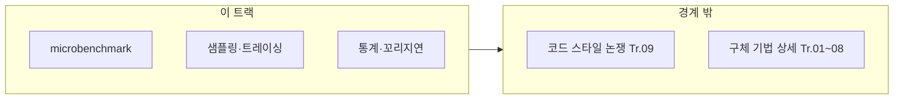

이 트랙은 모든 트랙의 공통 기반입니다. µs 단위 최적화는 "측정→가설→변경→검증→회귀 방지" 루프가 없으면 재현 불가능한 우연이 되기 때문에, 분석 역량을 표준화합니다.

다른 트랙이 "무엇을 바꿀지"를 가르친다면, 이 트랙은 **바꿨다고 주장할 근거를 만드는 법**을 가르칩니다. 마이크로벤치마크는 추상화 한 덩어리의 비용을 분리하고, 샘플링·트레이싱은 프로덕션에 가까운 맥락에서 핫패스를 찾으며, 통계·꼬리 지연 분석은 "평균은 좋은데 느린 요청이 있다"는 현상을 다룹니다. 이 세 가지가 맞물려야 Tr.01~08의 권장사항이 **우연한 이득**이 아니라 **검증된 변경**이 됩니다.

## 이 트랙이 책임지는 범위

- microbenchmark 설계/작성(노이즈 통제, 반복 가능성)
- 프로파일링으로 hot path 식별(샘플링/트레이싱)
- 성능 수치 해석(분포/꼬리 지연시간, p95/p99)
- 회귀 감지 자동화(벤치마크/성능 테스트를 CI에 연결)

## 이 트랙이 다루지 않는 것 (경계)

- "어떤 추상화가 좋은가" 같은 코드 스타일/철학 논쟁 (→ 성능 설계·의사결정 트랙)
- 구체적인 언어/컴파일러/CPU/OS 최적화 기법의 상세 (→ 각 전문 트랙)

## 커리큘럼

**난이도 범례**: **기초**(입문) · **중급**(실무 핵심) · **심화**(깊은 분석·전문 주제) · **전문**(극한·니치). **Tr.NN**은 `optimization-NN-*` 트랙을 가리킵니다.

이 트랙은 다른 트랙보다 **표 순서와 첫 학습 순서가 거의 일치**하는 편입니다. 다만 표는 어디까지나 도구·주제 지도를 겸하는 **참조 기준**이고, 실전에서는 01~03으로 측정의 바닥을 익힌 뒤 18~20을 함께 보면서 `Tr.10`의 회귀 게이트까지 연결하는 식으로 읽는 편이 효과적입니다.

| 챕터 | 제목 | 난이도 | 핵심 내용 |
|------|------|--------|-----------|
| 01 | Microbenchmark 설계 | 기초 | 설계 원칙, 노이즈 통제, 반복 가능성 |
| 02 | Google Benchmark | 기초 | Google Benchmark 실전 활용 |
| 03 | 샘플링 프로파일링 | 기초 | 샘플링 프로파일러 원리와 활용 (perf, VTune) |
| 04 | 트레이싱 프로파일링 | 중급 | 트레이싱 프로파일러 (Perfetto, Tracy) |
| 05 | Flame Graph 분석 | 중급 | Flame Graph 해석과 병목 추적 |
| 06 | Intel VTune 심화 | 심화 | Intel VTune 심화 활용 |
| 07 | Linux perf 고급 | 심화 | Linux perf 고급 사용법 |
| 08 | 하드웨어 카운터 | 심화 | 하드웨어 성능 카운터 활용 |
| 09 | Tail Latency 분석 | 심화 | 꼬리 지연시간(p95/p99/p999) 분석 |
| 10 | 통계적 벤치마킹 | 심화 | 벤치마크 통계 분석 (신뢰 구간, 유의성) |
| 11 | 지속적 프로파일링 | 심화 | 지속적 프로파일링 (production profiling) |
| 12 | 성능 A/B 테스트 | 중급 | 성능 A/B 테스트 방법론 |
| 13 | AMD μProf 활용 | 심화 | AMD μProf 프로파일러 활용과 AMD CPU 분석 |
| 14 | Windows ETW | 심화 | Event Tracing for Windows 기반 성능 분석 |
| 15 | Valgrind/Callgrind | 기초 | 메모리 프로파일링, 캐시 시뮬레이션, 호출 그래프 분석 |
| 16 | BPF 기반 프로파일링 | 전문 | bpftrace, BCC를 활용한 동적 프로파일링 |
| 17 | 분산 트레이싱 오버헤드 | 심화 | OpenTelemetry 기반 µs 단위 분산 트레이싱과 꼬리 지연 탐지 |
| 18 | 프로파일링 워크플로우 가이드 | 중급 | 측정→가설→변경→검증 루프 실전 적용과 팀 표준화 |
| 19 | 프로파일러 출력 해석 실전 | 중급 | 샘플링·트레이싱 리포트를 병목 후보로 연결하는 해석 패턴 |
| 20 | 메모리 프로파일링 (힙 분석) | 중급 | 힙 스냅샷·할당 추적·라이프타임 분석과 핫패스 할당 제거 연계 |

## 측정과 검증 (이 트랙 기준)

- 동일 조건 재현(고정 입력, 반복, 워밍업, 변동성 기록)
- 변경 단위 최소화(한 번에 한 가설만 검증)
- 성능 회귀를 PR 단위로 차단하는 기준선 설정

## 추천 선행/병행 트랙

- **병행**: 나머지 모든 트랙의 **공통 도구**로 간주합니다.

> **이 트랙을 가능한 한 먼저 익히는 것을 권장합니다.** 측정 없는 최적화는 재현하기 어렵습니다.

특히 이 문서의 표는 이후 다른 트랙에서 “어떤 도구로 다시 확인할지”를 역참조하는 기준점 역할을 합니다. 그래서 장 번호 순서는 유지하고, 본문에서만 “지금 당장 먼저 읽을 축”을 설명하는 방식이 가장 안정적입니다.

## Phase별 학습 궤적

**Phase A — 벤치마크 기초 (챕터 01~02)** 설계 원칙과 도구를 익히지 않으면 노이즈에 휘둘리는 숫자만 쌓입니다.

**Phase B — 프로파일링·워크플로우 (챕터 03~05, 13~15, 18~20)** 샘플링·트레이싱·플레임 그래프로 “어디가 느린지”를 본 뒤, 플랫폼별 도구(VTune, perf, ETW)로 내려갑니다. 챕터 18~20의 워크플로우 가이드·출력 해석·메모리 프로파일링은 Phase A에서 만든 벤치마크 역량을 **팀 표준 프로세스**로 연결합니다.

**Phase C — 하드웨어·운영 (챕터 06~12, 16~17)** 하드웨어 카운터, 꼬리 지연, 지속적 프로파일링, BPF, 분산 트레이싱은 **심화~전문**에 가깝습니다. Tr.06·Tr.07과 같이 읽으면 이벤트 의미가 정리되고, Tr.10과 함께 보면 이 측정을 어떤 게이트로 고정할지까지 이어집니다.

## 이 트랙을 마친 후 달성할 목표

- **설계**: 한 가지 가설만 검증하는 마이크로벤치마크를 짤 수 있다.
- **해석**: 샘플링 결과와 트레이스를 연결해 병목 후보를 설명할 수 있다.
- **워크플로우**: 측정→가설→변경→검증 루프를 팀 표준으로 운영할 수 있다.
- **메모리**: 힙 스냅샷·할당 추적으로 핫패스 할당 비용을 진단할 수 있다.
- **운영**: p95/p99와 변동성을 보고 “개선이 유의미한지” 판단할 수 있다.
- **자동화**: CI에 성능 회귀 검증을 붙일 위치를 Tr.10과 함께 설계할 수 있다.

## 평가 기준과 이 장을 읽은 후 확인

- [ ] 마이크로벤치마크와 프로덕션 프로파일링의 **역할 차이**를 말할 수 있는가?
- [ ] 커리큘럼에서 **기초→심화**로 갈수록 어떤 질문에 답하는지 짝지을 수 있는가?
- [ ] 다른 트랙을 읽을 때 “무엇을 재측정할지”를 스스로 정할 수 있는가?

## 범위와 경계

## 심화·전문가 확장 궤적

BPF·일부 플랫폼 전용 도구는 **전문** 난이도입니다. 팀 표준 도구(perf, 벤더 프로파일러)로 병목을 좁힌 뒤, 필요한 환경에서만 확장하는 편이 학습 대비 효과가 큽니다.

## 시리즈 전체 로드맵

12개 트랙의 권장 순서·심화 진입 조건은 **[Low-latency 최적화 시리즈 개요](/post/low-latency-optimization-series/getting-started-low-latency-optimization-series-overview/)**를 참고하세요.

## 지금 바로 이어 읽을 곳

이 트랙의 본챕터가 아직 공개되기 전에는, **무엇을 측정할지**가 궁금하면 `Tr.01`로, **측정을 어떻게 운영에 고정할지**가 궁금하면 `Tr.10`으로 이어 가면 흐름이 자연스럽습니다.

- [Tr.01 Introduction: Low-latency C++ 언어 최적화](/post/cpp-optimization/getting-started-cpp-language-performance-tuning/)
- [Tr.10 Introduction: Low-latency 성능 회귀 방지·유지보수](/post/regression-prevention/getting-started-performance-regression-prevention-strategies/)
