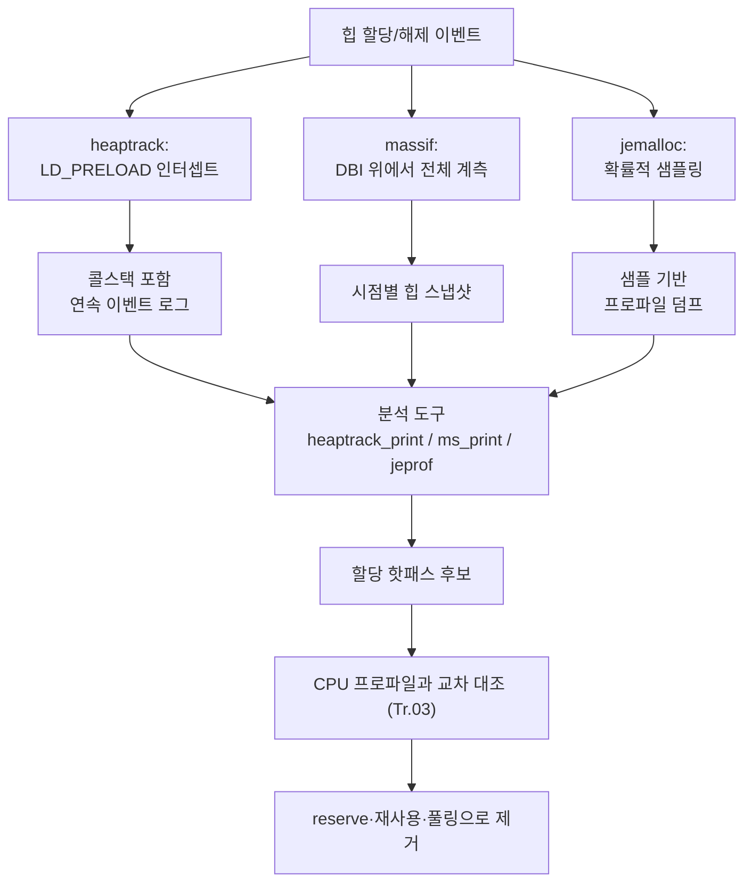

**메모리 프로파일링(memory profiling)은 프로그램이 언제, 어디서, 얼마나 많은 힙(heap) 메모리를 할당·해제하는지를 콜스택 단위로 기록하고, 그 기록을 스냅샷·라이프타임 관점에서 해석하는 작업**입니다. CPU 프로파일러가 "시간이 어디서 쓰였는가"를 보여준다면, 힙 프로파일러는 "할당이 어디서 얼마나 자주 일어났는가"를 보여줍니다. 두 질문은 종종 같은 곳을 가리킵니다. 반복문 안에서 벡터가 매번 재할당되거나, 파싱 경로에서 임시 문자열이 계속 생성되는 코드는 `malloc`/`free` 호출 자체의 비용과, 그 할당이 유발하는 캐시 미스·페이지 폴트 비용을 동시에 지불하기 때문입니다. 이 장에서는 heaptrack·massif·jemalloc 세 가지 힙 프로파일러가 같은 문제(할당 위치와 빈도 추적)를 서로 다른 계측 방식으로 푸는 과정을 비교하고, 그 결과를 실제 코드 수정과 CPU 프로파일 대조로 연결하는 워크플로우를 정리합니다.

## 이 장을 읽기 전에

**선행 챕터**: [19장 프로파일러 출력 해석 실전](/post/profiling-analysis/profiler-output-interpretation-practice/)에서 샘플링·트레이싱 리포트를 병목 후보로 연결하는 해석 패턴을 다뤘다면, 이 장은 그 해석 대상을 "CPU 시간"에서 "힙 할당"으로 좁힙니다. [Tr.01의 STL 컨테이너 비용](/post/cpp-optimization/stl-container-cost/)에서 다룬 "재할당과 캐시 효율" 개념, [15장 Valgrind·Callgrind](/post/profiling-analysis/valgrind-callgrind-cache-simulation/)에서 다룬 "Valgrind가 바이너리를 계측해 실행한다"는 동적 바이너리 계측(DBI)의 기본 원리를 알고 있으면 massif 절이 더 매끄럽게 읽힙니다.

**이 장의 깊이**: 난이도는 **중급**입니다. 세 도구를 설치·실행하고 출력을 읽어 "어느 할당이 문제인가"를 판단하는 실무 워크플로우까지 다루되, jemalloc 아레나(arena) 내부 구조나 heaptrack의 ELF 심볼 해석 구현 같은 소스 수준 내부는 다루지 않습니다.

**다루지 않는 것**: Valgrind의 동적 바이너리 계측 자체와 cachegrind/callgrind의 캐시 시뮬레이션은 [15장](/post/profiling-analysis/valgrind-callgrind-cache-simulation/)에 위임합니다. CPU 샘플링·하드웨어 카운터의 원리는 각각 [03장](/post/profiling-analysis/sampling-profiling-perf-vtune/)과 [08장](/post/profiling-analysis/hardware-performance-counters/)에서 다뤘으므로 여기서는 "힙 프로파일과 어떻게 대조하는가"만 다룹니다. 프로덕션에서 상시 실행하는 지속적 프로파일링의 인프라 구성은 [11장](/post/profiling-analysis/continuous-profiling-production/)의 몫입니다.

## 당신의 수준에 맞는 경로

| 수준 | 읽을 부분 | 핵심 목표 |
|------|---------|---------|
| **초보자** | "힙 프로파일러의 계보" ~ "세 가지 계측 방식" | 세 도구가 같은 문제를 다른 방식으로 푸는 이유 이해 |
| **중급자** | "heaptrack 실전" ~ "할당 핫패스 식별과 제거" | 콜스택 기반으로 핫패스를 찾아 코드로 수정 |
| **전문가** | "판단 기준" ~ "비판적 시각" | 상황별 도구 선택과 각 도구의 통계적·구조적 한계 판단 |

---

## 힙 프로파일러의 계보 (역사·배경)

힙 프로파일링 도구는 "할당 위치를 기록하는 비용을 어떻게 최소화할 것인가"라는 질문에 대해 세 시대에 걸쳐 서로 다른 답을 내놓았습니다. Valgrind의 **massif**는 Nicholas Nethercote가 2003년에 작성했으며, Valgrind의 동적 바이너리 계측(DBI) 코어 위에 얹혀 모든 힙 연산을 가로채는 방식을 택했습니다. 계측 정확도는 높지만 프로그램 전체를 가상 CPU 위에서 재실행하므로 실행 시간이 수 배에서 수십 배까지 늘어나는 대가를 치릅니다. 이 오버헤드 문제를 해결하기 위해 KDE/KDAB의 Milian Wolff가 2014년경 **heaptrack**을 공개했습니다. `LD_PRELOAD`로 `malloc`/`free` 심볼만 가로채는 방식이라 CPU 연산 자체는 느려지지 않고, 할당이 실제로 일어날 때만 콜스택을 기록해 비용을 지불합니다. 한편 **jemalloc**은 2004~2005년 Jason Evans가 FreeBSD의 SMP 확장성 있는 allocator로 설계했고, 2009년 이후 Facebook이 대규모 트래픽 환경에 맞게 개선을 이어가면서 2010년경 힙 프로파일링 기능(`--enable-prof`)이 추가되었습니다. jemalloc 프로파일은 모든 할당을 추적하는 대신 **확률적 샘플링**으로 오버헤드를 상수에 가깝게 눌러, 상시 켜둔 채로 운영하는 프로덕션 환경을 겨냥합니다. Valgrind 계열에는 massif 외에도 **DHAT**(Dynamic Heap Analysis Tool)이라는 자매 도구가 있는데, 크기·수명뿐 아니라 각 블록의 읽기/쓰기 횟수까지 기록해 "할당은 됐지만 거의 쓰이지 않은" 블록을 잡아내는 데 특화되어 있습니다.

## 세 가지 계측 방식과 힙 스냅샷

세 도구는 "언제 기록할 것인가"와 "무엇을 기록할 것인가"라는 두 축에서 갈립니다. massif는 힙 크기가 바뀔 때마다(초반에는 촘촘히, 프로그램이 길어질수록 성기게) **스냅샷(snapshot)**을 찍고, 각 스냅샷을 "정상"(크기만), "상세"(할당 트리 포함), "피크"(최대 사용량 시점)로 분류해 기록합니다. heaptrack은 스냅샷이라는 시점 개념 대신 **모든 malloc/free 이벤트를 콜스택과 함께 연속 로그**로 남기고, 분석 시점에 원하는 시간 구간을 골라 재구성합니다. jemalloc은 `lg_prof_sample`로 정한 확률에 따라 일부 할당만 표본으로 뽑아 콜스택을 남기고, `lg_prof_interval` 바이트마다 또는 `prof.dump` 호출 시점에 힙 프로파일을 파일로 덤프합니다.



> "Massif measures how much heap memory your program uses. This includes both the useful space, and the extra bytes allocated for book-keeping and alignment purposes." — [Valgrind Documentation: 9. Massif: a heap profiler](https://valgrind.org/docs/manual/ms-manual.html)

이 정의에서 중요한 것은 massif가 "크기"를 측정한다는 점입니다. 할당 **횟수**나 **빈도**가 아니라 특정 시점의 점유량을 기준으로 하기 때문에, 피크 메모리가 낮게 나와도 초당 수만 번의 작은 `malloc`/`free`가 지연을 갉아먹는 상황은 별도로 확인해야 합니다.

## heaptrack 실전: 콜스택 기반 할당 추적

[heaptrack](https://github.com/KDE/heaptrack)은 별도 재컴파일 없이 기존 바이너리에 그대로 적용할 수 있습니다. 아래 명령으로 프로그램을 실행하면 `/tmp/heaptrack.<앱이름>.<PID>.gz` 파일에 이벤트 로그가 쌓이고, `heaptrack_print`로 텍스트 리포트를, `heaptrack --analyze`로 GUI 분석을 열 수 있습니다.

```bash
# 프로그램을 heaptrack으로 감싸 실행 (LD_PRELOAD 기반, 재컴파일 불필요)
heaptrack ./my_app --input data.bin

# 실행 중인 프로세스에 나중에 붙는 것도 가능
heaptrack --pid "$(pidof my_app)"

# 텍스트 리포트: 콜스택별 할당 횟수·피크 소비자·임시 할당 순위
heaptrack_print heaptrack.my_app.48213.gz | less

# Qt 기반 GUI(플레임 그래프·타임라인 포함)로 분석
heaptrack --analyze heaptrack.my_app.48213.gz
```

`heaptrack_print`의 출력은 "MOST CALLS TO ALLOCATION FUNCTIONS"(할당 함수 호출 횟수 상위), "PEAK MEMORY CONSUMERS"(피크 시점 점유 상위), "MOST TEMPORARY ALLOCATIONS"(할당 직후 곧바로 해제된 임시 할당 상위) 세 구간으로 나뉜 텍스트 리포트를 냅니다. 대략적인 형태는 다음과 같습니다(버전에 따라 열 구성은 달라질 수 있습니다).

```text
MOST TEMPORARY ALLOCATIONS
120000 temporary allocations of 4390000 bytes from:
  collect_events_bad(int)
    at events.cpp:12
    97% of all temporary allocations
```

이 구간이 두드러진다는 것은 "할당한 뒤 거의 곧바로 해제되는" 패턴이 핫패스에 있다는 신호입니다. 반복문 안에서 임시 `std::string`이나 `std::vector`를 만들었다가 함수가 끝나기도 전에 버리는 코드가 전형적인 원인이며, `reserve`로 재할당 자체를 없애거나 루프 밖으로 버퍼를 끌어올리는 식으로 대응합니다.

## massif와 DHAT: 시점별 점유량과 블록 수명

massif는 `--tool=massif`로 실행하며, 기본 단위는 실행된 명령어 수이지만 벽시계 시간에 가까운 감각이 필요하면 `--time-unit=ms`로 바꿀 수 있습니다. `--pages-as-heap=yes`를 주면 `malloc` 수준이 아니라 `mmap` 등 커널이 실제로 매핑한 페이지 단위까지 내려가 코드·데이터 세그먼트까지 포함한 전체 그림을 볼 수 있습니다.

```bash
# 힙 크기를 명령어 실행 수 기준으로 스냅샷 (기본값)
valgrind --tool=massif ./my_app

# 시간 축을 밀리초로, 스택까지 포함해 계측 (오버헤드는 더 커짐)
valgrind --tool=massif --time-unit=ms --stacks=yes ./my_app

# 사람이 읽을 수 있는 그래프+상세 트리로 변환
ms_print massif.out.51204 > massif_report.txt
```

`ms_print`의 결과는 시간 축을 x, 힙 크기를 y로 하는 ASCII 그래프와, 피크 시점을 포함한 각 상세 스냅샷의 할당 트리(어느 호출 경로가 몇 바이트를 차지하는지)로 구성됩니다. [**DHAT**](https://valgrind.org/docs/manual/dh-manual.html)은 같은 Valgrind 코어 위에서 다른 질문에 답하는 자매 도구입니다. `valgrind --tool=dhat ./my_app`으로 실행하면 각 할당 지점(program point)마다 크기·수명·읽기/쓰기 횟수를 집계해, "할당은 됐지만 한 번도 읽거나 쓰지 않은" 블록이나 "수명 대부분을 아무 접근 없이 흘려보낸" 블록을 짚어줍니다. massif가 "언제 얼마나 컸는가"에 집중한다면, DHAT은 "그 메모리가 실제로 쓸모 있게 쓰였는가"를 봅니다.

## jemalloc 프로파일: 상시 관찰을 위한 확률적 샘플링

[jemalloc 프로파일](https://github.com/jemalloc/jemalloc/wiki/Use-Case:-Heap-Profiling)은 애플리케이션이 jemalloc을 실제 allocator로 쓰고 있을 때만 동작합니다. `MALLOC_CONF` 환경 변수로 활성화하며, `lg_prof_sample`(2의 거듭제곱 단위 샘플링 간격)로 정확도와 오버헤드를 맞바꿉니다.

```bash
# 힙 프로파일 활성화, 샘플링 간격 2^19바이트, 결과 파일 접두어 지정
MALLOC_CONF="prof:true,lg_prof_sample:19,prof_prefix:/tmp/jeprof.out" ./my_app

# 초기화 이후에만 상시 관찰하고 싶다면 비활성 상태로 시작한 뒤
# mallctl("prof.active", ...)로 코드에서 켜고 끌 수 있음
MALLOC_CONF="prof:true,prof_active:false,prof_prefix:/tmp/jeprof.out" ./my_app

# 텍스트 리포트: 누적 프로파일에서 할당 위치별 표본 비중
jeprof --text ./my_app /tmp/jeprof.out.12345.0.f.heap
```

`prof.active`를 애플리케이션 초기화가 끝난 뒤에 켜면, 워밍업 단계의 대량 할당(캐시 채우기 등)을 제외하고 정상 트래픽 처리 구간만 골라 관찰할 수 있습니다. `jeprof`는 두 덤프 사이의 차이를 비교하는 `--base` 옵션도 지원해, "이 구간 동안 새로 늘어난 할당이 어디서 왔는가"를 짚어낼 수 있습니다. 샘플링이므로 표본에 걸리지 않은 드문 대형 할당은 과소 대표될 수 있다는 점은 감안해야 합니다.

## 할당 핫패스 식별과 제거

세 도구가 공통으로 가리키는 신호는 "특정 콜스택에서 반복적으로 일어나는 할당"입니다. 아래는 이벤트를 모으는 흔한 코드에서 반복마다 임시 `std::string`을 만들고 `reserve` 없이 `push_back`하는 패턴이며, 이런 코드는 heaptrack의 "MOST CALLS TO ALLOCATION FUNCTIONS"나 jemalloc 프로파일의 상위 표본에 그대로 드러납니다.

```cpp
#include <string>
#include <vector>

struct Event {
  std::string name;
  double value;
};

// 문제: n번 반복 동안 push_back이 벡터 용량을 넘길 때마다 재할당하고,
// "evt_" + to_string(i)마다 임시 std::string이 추가로 생성된다.
std::vector<Event> collect_events_bad(int n) {
  std::vector<Event> events;
  for (int i = 0; i < n; ++i) {
    events.push_back(Event{"evt_" + std::to_string(i), static_cast<double>(i)});
  }
  return events;
}
```

heaptrack이나 jemalloc 리포트가 `collect_events_bad`를 할당 상위권으로 지목했다면, 원인은 두 곳입니다. 벡터가 예상 크기를 모른 채 커지면서 여러 번 재할당한다는 점과, 문자열 연결이 매번 임시 버퍼를 만든다는 점입니다. `reserve`로 벡터 재할당 횟수를 1회로 줄이는 수정은 다음과 같습니다.

```cpp
// 수정: 반복 전에 최종 크기를 알 수 있으므로 reserve로 재할당을 1회로 제한한다.
// 문자열 연결 자체의 임시 할당은 여전히 남아 있으므로, 완전히 없애려면
// (Tr.01 문자열 최적화의) 경량 정수→문자열 변환 경로가 추가로 필요하다.
std::vector<Event> collect_events_good(int n) {
  std::vector<Event> events;
  events.reserve(n);
  for (int i = 0; i < n; ++i) {
    events.push_back(Event{"evt_" + std::to_string(i), static_cast<double>(i)});
  }
  return events;
}
```

수정이 실제로 할당 횟수를 줄였는지는 힙 프로파일러를 다시 돌려 확인하는 것이 정석이지만, 개발 루프 안에서 빠르게 숫자를 보려면 `operator new`를 임시로 계측해 벤치마크 카운터로 뽑아낼 수도 있습니다. 아래는 `g++ -O2 -std=c++17 bench.cpp -lbenchmark -lpthread`로 빌드하는 예시입니다.

```cpp
#include <benchmark/benchmark.h>
#include <atomic>
#include <cstdlib>

std::atomic<long long> g_alloc_count{0};

void* operator new(std::size_t size) {
  ++g_alloc_count;
  return std::malloc(size);
}
void operator delete(void* p) noexcept { std::free(p); }

static void BM_CollectBad(benchmark::State& state) {
  for (auto _ : state) {
    g_alloc_count = 0;
    auto v = collect_events_bad(1000);
    benchmark::DoNotOptimize(v);
    state.counters["allocs_per_call"] = static_cast<double>(g_alloc_count.load());
  }
}
BENCHMARK(BM_CollectBad);

static void BM_CollectGood(benchmark::State& state) {
  for (auto _ : state) {
    g_alloc_count = 0;
    auto v = collect_events_good(1000);
    benchmark::DoNotOptimize(v);
    state.counters["allocs_per_call"] = static_cast<double>(g_alloc_count.load());
  }
}
BENCHMARK(BM_CollectGood);

BENCHMARK_MAIN();
```

전역 `operator new`/`delete`를 오버라이드하는 방식은 콜스택 정보 없이 총 호출 횟수만 세는 단순한 대체 수단일 뿐이며, 실제 운영 코드에 상시 넣어둘 것은 아닙니다. `reserve`를 적용하면 `allocs_per_call` 카운터가 벡터 재할당 횟수만큼 줄어드는 것을 확인할 수 있고, 정확한 절대 수치와 콜스택 귀속은 heaptrack이나 jemalloc 프로파일로 재확인합니다. 이렇게 찾은 할당 핫패스가 실제 지연에 기여하는지는 [03장의 샘플링 프로파일링](/post/profiling-analysis/sampling-profiling-perf-vtune/)으로 CPU 시간 관점에서 같은 콜스택이 상위에 뜨는지 대조해야 합니다. 힙 할당 횟수가 줄었는데 CPU 프로파일에서 그 함수의 비중이 그대로라면, 애초에 할당이 지연의 주된 원인이 아니었을 수 있습니다.

## 흔한 오개념

**"피크 힙 크기가 낮으면 할당 비용도 낮다"**는 오개념이 흔합니다. massif가 보여주는 피크는 특정 시점의 점유량일 뿐, 초당 수만 번씩 반복되는 작은 `malloc`/`free`의 누적 비용과는 다른 축입니다. 피크는 낮아도 할당 함수 호출 자체가 지연을 갉아먹는 코드는 heaptrack의 "MOST CALLS TO ALLOCATION FUNCTIONS" 구간이나 jemalloc 프로파일의 표본 밀도로 따로 확인해야 합니다.

**"heaptrack·massif·DHAT은 메모리 누수(leak)만 찾는 도구다"**도 흔한 오해입니다. 세 도구 모두 누수가 전혀 없는 프로그램에서도 유용합니다. 프로그램 종료 전에 모든 메모리를 정상적으로 해제하더라도, 할당·해제가 지나치게 자주 반복되는 핫패스나 거의 쓰이지 않고 버려지는 블록은 여전히 성능 문제이며, 이는 "PEAK MEMORY CONSUMERS"·"MOST TEMPORARY ALLOCATIONS"·DHAT의 읽기/쓰기 집계가 각각 짚어내는 영역입니다.

**"jemalloc 프로파일은 샘플링이니 오버헤드가 없다"**는 것도 부정확합니다. 샘플링은 오버헤드를 낮추지만 없애지는 않습니다. 표본으로 뽑힌 할당마다 여전히 콜스택을 풀어 기록해야 하고, `lg_prof_sample`을 작게 잡을수록(더 자주 샘플링) 정확도는 올라가지만 오버헤드도 함께 커집니다. 또한 jemalloc 프로파일을 쓰려면 애플리케이션의 allocator 자체를 jemalloc으로 맞춰야 하므로, 다른 allocator(tcmalloc, 시스템 기본 glibc malloc 등)를 쓰는 프로젝트에는 그대로 적용할 수 없습니다.

## 판단 기준

| 상황 | 권장 | 비권장 |
|------|------|--------|
| 개발 환경에서 콜스택까지 정밀 진단 | heaptrack (Linux) | massif만으로 콜스택 없이 크기만 추정 |
| CPU 연산이 많은 코드에서 느려짐 최소화 | heaptrack (malloc에만 비용 부과) | massif (프로그램 전체가 가상 CPU에서 실행) |
| "할당됐지만 거의 안 쓰인 블록" 탐지 | DHAT (읽기/쓰기 집계) | massif만으로 수명·활용도 추정 |
| 프로덕션 상시 관찰(지속적 프로파일링) | jemalloc 샘플링, `prof.active`로 구간 제어 | massif·heaptrack 상시 실행(오버헤드 과다) |
| jemalloc이 아닌 allocator를 쓰는 프로젝트 | heaptrack 또는 massif (allocator 무관) | jemalloc 프로파일(allocator 교체 필요) |
| Windows 환경에서 힙 이벤트 확인 | [Windows ETW 힙 이벤트](/post/profiling-analysis/windows-etw-performance-analysis/) | Linux 전용 heaptrack/massif를 그대로 이식 |

## 비판적 시각: 한계와 트레이드오프

세 도구 모두 완결된 답을 주지 않습니다. **heaptrack과 massif는 Linux 중심**입니다. heaptrack은 `LD_PRELOAD`와 ELF 심볼 해석에 의존하고 massif는 Valgrind의 DBI 코어 위에서 동작하므로, 두 도구 모두 Windows에서는 사실상 쓸 수 없고 macOS 지원도 제한적입니다. **massif와 DHAT의 정밀도는 실행 속도와 맞바꾼 것**입니다. 전체 프로그램을 가상 CPU 위에서 재실행하기 때문에 CPU 연산이 무거운 코드에서는 실행 시간이 수 배로 늘어날 수 있고, 이는 프로덕션은커녕 통합 테스트 환경에서도 상시 켜두기 어려운 수준입니다. **jemalloc 프로파일은 allocator 종속적**입니다. 샘플링 기반이라 드문 대형 할당이 과소 대표될 수 있고, 멀티스레드 환경에서 공유 할당의 귀속을 스레드별로 세밀하게 나누려면 추가 설정이 필요합니다. 마지막으로, 세 도구 모두 **힙만** 봅니다. 스택 할당, 정적/전역 변수, 커널이 관리하는 페이지 캐시는 범위 밖이며, 실제 RSS(Resident Set Size)와 힙 사용량 사이에는 단편화(fragmentation) 때문에 차이가 생길 수 있습니다. 이런 한계 때문에 힙 프로파일 하나만으로 "이 코드가 느리다"고 단정하기보다는, CPU 샘플링 프로파일과 교차 대조해 같은 콜스택이 양쪽에서 모두 상위에 뜨는지 확인하는 습관이 안전합니다.

## 마무리

- [ ] heaptrack·massif·jemalloc 프로파일이 각각 어떤 계측 시점(연속 로그/스냅샷/확률적 샘플링)을 쓰는지 설명할 수 있다.
- [ ] heaptrack의 "임시 할당"과 DHAT의 "읽기/쓰기 집계"가 각각 어떤 패턴을 잡아내는지 구분할 수 있다.
- [ ] 콜스택 상위에 뜬 함수를 `reserve` 등으로 수정한 뒤, 힙 프로파일 재측정으로 할당 횟수 감소를 검증할 수 있다.
- [ ] 힙 프로파일에서 찾은 핫패스를 CPU 샘플링 프로파일과 대조해, 실제 지연 기여도를 판단할 수 있다.
- [ ] 프로덕션 상시 관찰과 개발 중 정밀 진단 중 어느 도구를 쓸지, 오버헤드·allocator 제약을 근거로 선택할 수 있다.

이 장으로 **Tr.05 프로파일링·성능 분석 트랙의 20개 챕터가 모두 마무리**됩니다. 이 트랙에서 익힌 마이크로벤치마크·샘플링/트레이싱·통계·힙 분석은 특정 언어나 하드웨어에 묶이지 않는 공통 도구이므로, 이제부터는 [Tr.01 C++ 언어 최적화](/post/cpp-optimization/getting-started-cpp-language-performance-tuning/)나 [Tr.02 컴파일러·빌드 최적화](/post/compiler-optimization/getting-started-compiler-build-performance-tuning/)처럼 구체적인 기법을 다루는 트랙에서 "무엇을 바꿨는지"를 이 트랙의 도구로 직접 검증해보길 권합니다. 전체 시리즈의 12개 트랙 구성과 권장 학습 순서는 [Low-latency 최적화 시리즈 개요](/post/low-latency-optimization-series/getting-started-low-latency-optimization-series-overview/)에, 이 트랙 자체의 커리큘럼 지도는 [Tr.05 인트로](/post/profiling-analysis/getting-started-profiling-performance-analysis-fundamentals/)에 정리되어 있습니다.
