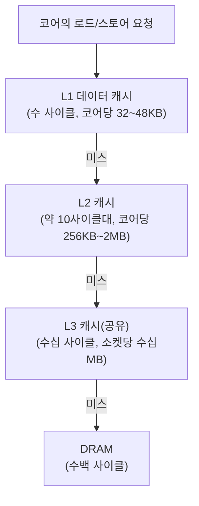
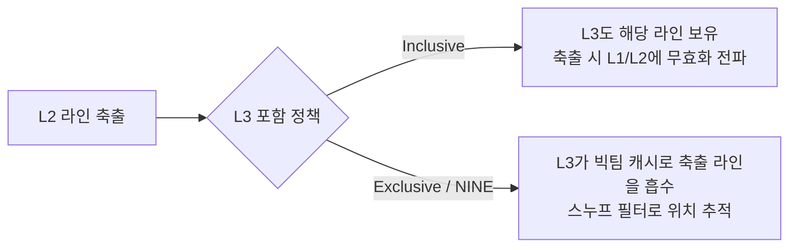

**캐시 계층 구조**란 코어에 가까운 순서로 L1 → L2 → L3(경우에 따라 L4) → DRAM을 배치해, 작고 빠른 저장 공간과 크고 느린 저장 공간 사이의 물리적 트레이드오프를 다층으로 완화하는 설계를 말합니다. 이 장에서는 각 계층의 지연시간·용량이 왜 그런 비율로 정해지는지, 그리고 상위 계층 데이터를 하위 계층에도 둘지 말지를 정하는 **인클루시브(inclusive)**, **익스클루시브(exclusive)**, **NINE(non-inclusive non-exclusive)** 포함 정책이 실제로 무엇을 트레이드오프하는지를 다룹니다. µs 예산을 다루는 입장에서 이 구조를 이해해야 하는 이유는 단순합니다 — 같은 "캐시 히트"라도 어느 계층에서 히트했는지에 따라 지연시간이 한 자릿수 이상 차이 나고, 이 차이가 누적되면 p99 지연을 좌우하기 때문입니다.

## 이 장을 읽기 전에

**완전한 초보자?** 이 장은 [01장: CPU 파이프라인 기초](/post/cpu-optimization/cpu-pipeline-fundamentals/)에서 다룬 "메모리 접근이 파이프라인을 멈출 수 있다"는 개념과, [02장: 분기 예측 메커니즘과 비용](/post/cpu-optimization/branch-prediction-mechanisms-cost/)에서 다룬 "예측 실패가 프런트엔드를 멈춘다"는 감각을 전제로 합니다. 캐시 라인이 보통 64바이트라는 사실과, 클럭 사이클이 시간 단위라는 정도만 알면 충분합니다.

**이 장의 깊이**: 이 장은 **중급**을 목표로 합니다. L1/L2/L3 각 계층의 역할과 용량·지연시간 트레이드오프, 포함 정책(inclusive/exclusive/NINE)의 내부 동작 원리, 그리고 계층 구조를 설계·코드에 반영할 때의 판단 기준까지 다룹니다. **다루지 않는 것**: 캐시 미스가 실제로 발생했을 때의 분석 절차와 `CLDEMOTE`/`PREFETCHRST2` 같은 캐시 힌트 명령 활용은 [04장](/post/cpu-optimization/cache-miss-analysis-hint-instructions/)에서, TLB와 페이지 테이블 캐싱은 [07장](/post/cpu-optimization/tlb-miss-optimization/)에서, 데이터 구조·접근 패턴을 캐시 친화적으로 바꾸는 구체적 기법은 [Tr.03 6장: 캐시 친화적 접근 패턴](/post/memory-optimization/cache-friendly-access-patterns/)에서 각각 다룹니다. 하드웨어 카운터로 캐시 미스를 정량 측정하는 절차는 [09장](/post/cpu-optimization/cpu-hardware-performance-counters/)과 [Tr.05 8장](/post/profiling-analysis/hardware-performance-counters/)에 맡깁니다.

## 당신의 수준에 맞는 경로

| 수준 | 읽을 부분 | 핵심 목표 |
|------|---------|---------|
| **초보자** | "캐시 계층의 등장 배경" ~ "L1/L2/L3의 역할과 트레이드오프" | 계층마다 지연시간·용량이 왜 다른지 이해 |
| **중급자** | "포함 정책" ~ "흔한 오개념 바로잡기" | inclusive/exclusive/NINE의 실제 동작과 대가 이해 |
| **전문가** | "판단 기준" ~ "비판적 시각" | 벤더별 캐시 설계 차이를 코드·용량 계획에 반영 |

## 캐시 계층의 등장 배경

캐시라는 개념 자체는 1965년 Maurice Wilkes가 제안한 "slave memory"로 거슬러 올라갑니다. 느린 주기억장치와 빠른 프로세서 사이의 속도 차이를 메우기 위해 작고 빠른 버퍼를 두고, 최근 접근한 데이터를 자동으로 그 버퍼에 유지한다는 발상이었습니다. 이 아이디어는 이후 수십 년간 계속 세분화되었습니다. 1990년대 중반 Intel Pentium Pro가 코어와 같은 패키지에 온-패키지 L2를 탑재하면서 "L2가 코어 클럭에 가깝게 동작하는 두 번째 계층"이라는 구도가 자리 잡았고, 2000년대 들어 일부 고성능 데스크톱·서버 프로세서에 L3가 추가되기 시작했습니다. 멀티코어가 보편화된 2000년대 후반부터는 L3가 여러 코어가 공유하는 "코어 간 완충 계층"으로 재정의되었고, 이때부터 L3를 어떻게 채우고 비울지가 설계 논쟁거리가 됐습니다.

이 논쟁의 핵심은 **포함 정책**입니다. 오랫동안 Intel의 L3는 인클루시브였습니다 — L1·L2에 있는 모든 라인이 L3에도 반드시 존재하도록 강제해, L3 미스만으로 "이 데이터는 어느 코어의 사설 캐시에도 없다"를 즉시 판단할 수 있었습니다. 그러나 Intel은 2017년 서버용 Skylake-X(및 이후 Cascade Lake)부터 L3를 논-인클루시브(non-inclusive)로 전환했습니다. AMD는 Zen 아키텍처를 내놓은 이후 줄곧 L3를 코어 사설 캐시의 익스클루시브 빅팀(victim) 캐시로 설계해 왔고, 이 방향은 Zen5까지 이어지고 있습니다. 이 전환들은 "캐시 계층 설계가 고정된 정답이 아니라 워크로드·용량·검색 비용 사이의 계속되는 저울질"이라는 것을 보여줍니다.

## 캐시 계층 구조: L1/L2/L3의 역할과 트레이드오프

캐시 계층이 여러 단으로 나뉘는 근본 이유는 **용량과 지연시간이 물리적으로 반비례**하기 때문입니다. 저장 공간을 늘리면 접근 대상 후보가 늘어나 태그 비교·배선 지연이 커지고, 결과적으로 접근 시간이 늘어납니다. 그래서 프로세서는 코어에 가장 가까운 곳에 아주 작고 빠른 L1을 두고, 그다음으로 조금 크고 조금 느린 L2를, 마지막으로 여러 코어가 공유하는 크고 느린 L3를 둔 뒤 그 뒤에 DRAM을 연결합니다. L1은 보통 코어당 32~48KB(데이터)·32KB(명령어) 수준, L2는 코어당 256KB~2MB 수준, L3는 소켓당 수 MB에서 수십 MB 수준으로 설계되며, 정확한 값은 세대·벤더마다 다릅니다.

지연시간도 계층마다 자릿수가 다릅니다. 예컨대 Intel Haswell 세대(i7-4770, 3.4GHz)를 실측한 참고 자료에 따르면 L1 접근은 약 4~5사이클, L2는 약 12사이클, L3는 약 36사이클이 걸립니다. DRAM 접근은 여기에 메모리 컨트롤러·버스 지연이 더해져 수백 사이클(수십~수백 나노초) 단위로 늘어나는 것이 일반적입니다. 이 수치는 세대·벤더·클럭에 따라 달라지는 예시일 뿐이며, 실제 목표 플랫폼에서는 직접 측정해야 합니다 — 측정 절차 자체는 다음 장(04장)과 하드웨어 카운터 장(09장)에서 다룹니다. 여기서 중요한 것은 절대값이 아니라 **비율**입니다: L1 대비 L2는 대략 3배, L2 대비 L3는 대략 3배, L3 대비 DRAM은 다시 한 자릿수 이상 느려지는 계단식 구조라는 감각입니다.



이 계단식 구조에서 실제로 얼마나 느려지는지는 직접 재보는 것이 가장 정확합니다. 아래는 **포인터 체이싱(pointer chasing)** 기법으로 작업집합 크기를 바꿔 가며 평균 접근 지연시간을 재는 벤치마크 스켈레톤입니다. 무작위로 섞은 인덱스로 연결 리스트를 순회하게 만들어 하드웨어 프리페처가 다음 접근 위치를 예측하지 못하게 하는 것이 핵심이며, 배열 크기를 L1/L2/L3/DRAM 각 용량 경계 안팎으로 바꿔 가며 실행하면 계단 형태의 지연시간 그래프를 얻을 수 있습니다.

```cpp
#include <algorithm>
#include <chrono>
#include <cstdint>
#include <cstdio>
#include <random>
#include <vector>

// x86-64 Linux, GCC/Clang -O2 기준 예시. -O3나 LTO가 순회 루프를
// 과도하게 재배열하지 않도록 결과는 반드시 사용(누적)해야 한다.
std::vector<uint32_t> build_chase(size_t n) {
  std::vector<uint32_t> next(n);
  std::vector<uint32_t> order(n);
  for (size_t i = 0; i < n; ++i) order[i] = static_cast<uint32_t>(i);
  std::mt19937 rng(12345);
  std::shuffle(order.begin(), order.end(), rng);  // 프리페처 무력화용 무작위 순서
  for (size_t i = 0; i < n; ++i) next[order[i]] = order[(i + 1) % n];
  return next;
}

double measure_latency_ns(size_t n, int iterations) {
  auto next = build_chase(n);
  uint32_t idx = 0;
  auto start = std::chrono::steady_clock::now();
  for (int i = 0; i < iterations; ++i) idx = next[idx];  // 진짜 의존성 체인: 예측 불가
  auto end = std::chrono::steady_clock::now();
  volatile uint32_t sink = idx;  // 컴파일러가 루프를 통째로 제거하지 못하게 고정
  (void)sink;
  return std::chrono::duration<double, std::nano>(end - start).count() / iterations;
}

int main() {
  // 원소 크기(4바이트)를 감안해 L1/L2/L3 경계 안팎 크기를 바꿔 가며 호출한다.
  for (size_t n : {size_t(4 * 1024 / 4), size_t(256 * 1024 / 4), size_t(16 * 1024 * 1024 / 4)}) {
    printf("n=%zu elems, latency=%.2f ns/access\n", n, measure_latency_ns(n, 20'000'000 / (n > 1000000 ? 20 : 1)));
  }
}
```

이 스켈레톤은 어디까지나 상대적인 경향(계층 경계에서 지연시간이 계단식으로 뛰는 것)을 눈으로 확인하기 위한 것이며, 절대 나노초 값은 CPU 세대·주파수·NUMA 배치·동시 실행 중인 다른 프로세스에 따라 크게 흔들립니다. 실제 캐시 크기는 가정하지 말고 `lscpu`나 `/sys/devices/system/cpu/cpu0/cache/` 하위 파일로 확인한 뒤 경계값을 정하는 것이 안전합니다.

```bash
# Linux에서 실제 L1/L2/L3 크기와 공유 범위를 확인
lscpu | grep -i cache
# 계층별 상세(레벨, 크기, 공유 CPU 목록)를 개별적으로 확인
for d in /sys/devices/system/cpu/cpu0/cache/index*; do
  echo "$(cat "$d/level"):$(cat "$d/type") size=$(cat "$d/size") shared_cpu_list=$(cat "$d/shared_cpu_list")"
done
```

두 예시 모두 "코드가 가정한 캐시 크기"와 "실제 배포 대상 하드웨어의 캐시 크기"가 다를 수 있다는 사실을 확인하기 위한 도구입니다. 하드코딩된 캐시 크기 상수로 블로킹(tiling) 크기를 정하는 코드는 이식 시 조용히 성능이 나빠질 수 있으므로, 가능하면 빌드·배포 시점에 실제 값을 조회하는 편이 안전합니다.

## 포함 정책: 인클루시브·익스클루시브·NINE

L3(또는 마지막 레벨 캐시)를 설계할 때 반드시 정해야 하는 것이 **포함 정책(inclusion policy)**입니다. 이는 "상위 계층(L1/L2)에 있는 데이터를 L3에도 반드시 유지할 것인가"에 대한 규칙이며, 크게 세 가지로 나뉩니다.

- **인클루시브(Inclusive)**: L1·L2에 있는 모든 라인이 L3에도 존재하도록 강제합니다. 장점은 검색이 단순해진다는 것입니다 — 다른 코어가 어떤 라인을 갖고 있는지 확인(스누핑)할 때 L3만 보면 되고, L3에 없으면 어느 사설 캐시에도 없다고 바로 결론 낼 수 있습니다. 대가는 L2에 있는 라인의 복사본을 L3에도 중복 보관해야 하므로 L3의 실질 유효 용량이 줄어들고, L3에서 라인을 축출할 때 그 라인을 갖고 있는 모든 L1/L2에도 무효화(백-인밸리데이션, back-invalidation)를 전파해야 한다는 점입니다. 이 백-인밸리데이션은 해당 라인이 아직 활발히 쓰이고 있어도 강제로 쫓아내므로, 인클루시브 정책 자체가 불필요한 상위 계층 미스를 유발할 수 있다는 것이 캐시 관리 연구에서 지적되어 온 문제입니다.
- **익스클루시브(Exclusive)**: 어떤 라인이든 L2와 L3에 동시에 존재하지 않습니다. L2에서 라인이 축출될 때만 그 라인이 L3로 옮겨지므로, L3는 사실상 L2의 **빅팀 캐시(victim cache)**로 동작합니다. 중복이 없으므로 같은 다이 면적에서 실질 용량이 커진다는 것이 가장 큰 이점입니다. 대가는 어떤 코어가 어떤 라인을 갖고 있는지 L3만으로는 알 수 없다는 것이며, 이를 보완하려면 별도의 **스누프 필터(snoop filter)** 나 태그 복제 구조를 둬야 합니다.
- **NINE(non-inclusive non-exclusive)**: 인클루전도 익스클루전도 강제하지 않습니다. 어떤 라인은 L2와 L3에 동시에 있을 수도, L3에만 있을 수도 있습니다. Intel이 Skylake-X 이후 서버 제품에서 택한 방향이 이에 가깝습니다 — L3는 주로 L2에서 축출된 라인을 담는 용도로 동작하되(즉 대체로 익스클루시브에 가깝게 행동하되), 이를 엄격히 강제하지는 않습니다.



AMD Zen 계열은 익스클루시브/NINE에 가까운 빅팀 L3를 채택해 왔고, Zen5는 CCX(코어 컴플렉스) 단위로 L2 태그를 L3에 복제해 프로브(스누프) 비용을 줄이면서도 L3 용량은 그대로 활용하는 방향을 취하고 있습니다. 이런 구조에서는 같은 CCX 안의 코어끼리는 L3 공유 효과를 온전히 누리지만, 다른 CCX나 다른 다이(CCD)에 있는 코어의 캐시에 접근하려면 Infinity Fabric 같은 온-패키지 인터커넥트를 거쳐야 해서 지연시간이 늘어납니다. 이런 **불균일 캐시 접근(NUCA, Non-Uniform Cache Access)** 특성은 벤더·세대별 구체적인 아키텍처 비교는 [08장](/post/cpu-optimization/modern-cpu-architecture-comparison/)에서, Apple Silicon의 통합 메모리·클러스터 캐시 구조는 [13장](/post/cpu-optimization/apple-silicon-m-series-architecture/)에서 각각 더 다룹니다.

## 흔한 오개념 바로잡기

**"L3가 크면 무조건 빠르다"**는 잘못된 생각입니다. 용량과 지연시간은 같은 다이 예산 안에서 서로를 깎아 먹는 관계이며, L3가 커질수록 태그 검색·배선 지연이 늘어 접근 사이클 수도 늘어나는 경향이 있습니다. "크다"는 것은 "덜 자주 미스가 난다"는 뜻이지 "히트가 빠르다"는 뜻이 아닙니다.

**"인클루시브는 무조건 나쁘고 익스클루시브가 항상 낫다"**도 과도한 단순화입니다. 인클루시브는 스누핑 로직을 단순하게 만들어 코어 수가 늘어날 때 코히런스 트래픽을 줄이는 이점이 있고, 익스클루시브/NINE은 별도의 스누프 필터·태그 복제라는 하드웨어 비용을 추가로 치릅니다. 두 방향 모두 실질적인 대가가 있는 설계 선택이며, Intel과 AMD가 시기에 따라 서로 다른 방향으로 움직여 온 것 자체가 "정답이 하나가 아니다"라는 증거입니다.

**"L2/L3 히트면 사실상 공짜다"**도 위험한 가정입니다. L2 히트도 수십 사이클에 가까운 값이 걸릴 수 있고, L3 히트는 그보다 더 걸립니다. 나노초 단위로는 작아 보여도, 요청 하나에 이런 히트가 수백~수천 번 누적되는 핫패스라면 캐시 계층 안에서의 "빠른 히트" 차이만으로도 p99 예산이 흔들릴 수 있습니다. 또한 SMT/Hyper-Threading으로 두 논리 코어가 L1·L2를 공유하는 경우([14장](/post/cpu-optimization/smt-hyperthreading-performance/) 참고) 이웃 스레드의 접근 패턴이 내 히트율에 영향을 줄 수 있다는 점도 "히트는 항상 안정적"이라는 가정을 깨뜨립니다.

## 판단 기준

| 상황 | 확인·조치 | 비고 |
|------|-----------|------|
| 루프의 작업집합이 L2 경계를 넘나드는지 의심될 때 | `lscpu`/sysfs로 실제 L2 크기 확인 후 블로킹(tiling) 검토 | 구체적 접근 패턴 기법은 [Tr.03 6장](/post/memory-optimization/cache-friendly-access-patterns/) |
| 멀티코어에서 공유 L3 경합이 성능을 흔드는지 확인할 때 | 코어별 L3 occupancy·미스율을 하드웨어 카운터로 측정 | [09장](/post/cpu-optimization/cpu-hardware-performance-counters/), [Tr.05 8장](/post/profiling-analysis/hardware-performance-counters/) |
| 캐시 미스가 실제로 왜 나는지 더 깊이 파고들어야 할 때 | 미스 유형(강제/용량/충돌)별 대응 전략으로 이동 | [04장: 캐시 미스 분석과 대응](/post/cpu-optimization/cache-miss-analysis-hint-instructions/) |
| CCX/CCD 경계나 소켓을 넘는 접근 지연이 의심될 때 | NUMA 토폴로지 확인, 벤더별 구조 비교 | [08장](/post/cpu-optimization/modern-cpu-architecture-comparison/), 코어 피닝 자체는 OS/런타임 트랙 소관 |
| 이식 가능한 코드에서 캐시 크기를 상수로 박아 넣고 싶을 때 | 하드코딩 대신 런타임 조회(sysfs/CPUID) 또는 보수적 하한값 사용 | 벤더·세대별 값이 계속 바뀜 |

## 비판적 시각: 한계와 트레이드오프

캐시 계층 설계는 여전히 진행형 논쟁입니다. 인클루시브 대 익스클루시브/NINE 논쟁은 "검색 단순성과 코히런스 비용을 줄일 것인가, 유효 용량을 늘릴 것인가"라는 근본적인 저울질이며, 어느 한쪽이 절대적으로 우월하다는 합의는 없습니다. 칩렛(chiplet) 기반 설계가 보편화되면서 "L3 용량"이라는 스펙 숫자 하나만으로는 실제 지연시간을 예측하기 어려워졌다는 점도 짚어야 합니다 — 같은 소켓 안에서도 CCX/CCD 경계를 넘는 접근은 NUCA 특성 때문에 스펙상 "공유 L3"라는 표현이 주는 인상보다 훨씬 느릴 수 있습니다. 이 장에서 제시한 사이클 수·용량 수치는 특정 세대(Haswell 등)의 예시일 뿐이며, Intel·AMD·ARM은 세대마다 정책과 수치를 계속 바꾸고 있으므로 이 장의 숫자를 다른 플랫폼에 그대로 대입해서는 안 됩니다. "지표(캐시 미스율)가 좋아졌는데 p99는 그대로"인 경우도 흔한데, 이는 캐시 계층 최적화가 다른 병목(포트 압력, 메모리 대역폭 포화, 락 경합)에 가려질 수 있기 때문이며, 이런 경우의 재확인은 Tr.05의 프로파일링 절차로 넘어가야 합니다.

## 마무리

이 장을 읽은 뒤 다음을 스스로 점검해 보세요.

- [ ] L1/L2/L3가 용량·지연시간에서 왜 계단식 트레이드오프를 이루는지 설명할 수 있다.
- [ ] 인클루시브·익스클루시브·NINE 포함 정책 각각의 동작 방식과 대가(백-인밸리데이션 vs 스누프 필터)를 설명할 수 있다.
- [ ] "L3가 크면 무조건 빠르다"류의 오개념을 근거를 들어 반박할 수 있다.
- [ ] 실제 배포 대상 하드웨어의 캐시 크기를 `lscpu`/sysfs로 확인하는 방법을 안다.
- [ ] 캐시 계층 관점의 개선이 p99 지연 개선으로 이어지는지 검증이 필요하다는 것을 인지한다.

**이전 장**: [분기 예측 메커니즘과 비용](/post/cpu-optimization/branch-prediction-mechanisms-cost/) (챕터 02)

다음 장에서는 캐시 미스가 실제로 발생했을 때 이를 강제·용량·충돌 미스로 분류해 원인을 좁히는 방법과, `CLDEMOTE`·`PREFETCHRST2`·`MOVRS` 같은 최신 캐시 힌트 명령을 활용해 미스 비용을 줄이는 기법을 다룹니다.

→ [캐시 미스 분석과 대응](/post/cpu-optimization/cache-miss-analysis-hint-instructions/) (챕터 04)

### 참고 자료

- [Intel 64 and IA-32 Architectures Optimization Reference Manual](https://cdrdv2-public.intel.com/814199/356477-Optimization-Reference-Manual-V2-002.pdf) — 캐시 계층·지연시간·마이크로아키텍처별 튜닝 지침을 담은 Intel 공식 문서
- [Software Optimization Guide for the AMD Zen5 Microarchitecture (58455)](https://docs.amd.com/v/u/en-US/58455_1.00) — Zen5의 L1/L2/L3 구성과 명령 지연·처리량을 담은 AMD 공식 문서
- [Cornell Virtual Workshop: Last Level Cache](https://cvw.cac.cornell.edu/clusterarch/memory-cache-interconnects/last-level-cache) — 인클루시브/논-인클루시브 L3와 스누프 필터의 관계를 설명하는 자료
- [7-cpu.com: Intel Haswell](https://www.7-cpu.com/cpu/Haswell.html) — 특정 세대 CPU의 L1/L2/L3 실측 지연시간·용량 예시
