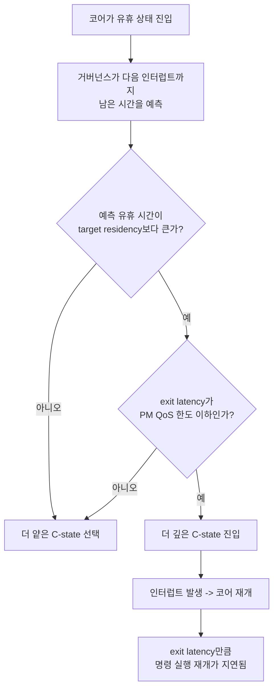

**전력 관리(power management)**란 CPU가 유휴 구간과 부하 구간을 오가며 소비 전력을 줄이기 위해 코어·패키지 단위로 진입하는 **C-state**와, 동작 중 전압·주파수 조합을 바꾸는 **P-state**를 운영체제와 하드웨어가 함께 제어하는 메커니즘입니다. 서버 전력비와 노트북 배터리 수명을 기준으로 설계된 이 메커니즘은 코어가 "얼마나 깊이 잠드는가"에 따라 다시 깨어나는 데 걸리는 시간이 수 마이크로초에서 수백 마이크로초까지 달라지며, 이 탈출 지연(exit latency)이 µs 단위 응답 예산을 다투는 워크로드에서는 무시할 수 없는 지연 성분이 됩니다. 이 장에서는 C-state가 실제로 무엇을 절전하는지, 커널이 어떤 상태를 고를지 어떻게 판단하는지, 그리고 그 판단이 틀렸을 때 p99 지연이 왜 갑자기 튀는지를 다룹니다.

## 이 장을 읽기 전에

이 장은 [11장: CPU 주파수 스케일링과 성능](/post/cpu-optimization/cpu-frequency-scaling-performance/)에서 다룬 DVFS와 주파수 거버넌스, [01장: CPU 파이프라인 기초](/post/cpu-optimization/cpu-pipeline-fundamentals/)에서 다룬 클럭·파이프라인 개념을 전제로 합니다. 코어가 클럭당 하나 이상의 명령을 처리한다는 것과, 주파수가 전압에 종속적이라는 정도만 알면 충분합니다.

**이 장의 깊이**: **중급**입니다. C-state의 계층(core C-state와 package C-state), ACPI/cpuidle이 유휴 상태를 선택하는 알고리즘, 그리고 그 선택이 지연시간에 미치는 영향을 실무 튜닝 수준까지 다룹니다. **다루지 않는 것**: P-state·Turbo Boost·거버넌스별 주파수 결정 알고리즘의 세부 동작(→ 11장), NUMA·CPU pinning·스케줄러 정책(→ OS/런타임 트랙), Apple Silicon의 P/E 코어별 전력 관리 특이성(→ [13장: Apple Silicon 아키텍처](/post/cpu-optimization/apple-silicon-m-series-architecture/))입니다.

## 당신의 수준에 맞는 경로

| 수준 | 읽을 부분 | 핵심 목표 |
|------|---------|---------|
| **초보자** | "ACPI와 전력 상태의 표준화" ~ "C-state: 유휴 상태의 계층" | C-state가 무엇을 절전하고 무엇을 희생하는지 이해 |
| **중급자** | "cpuidle: 커널이 유휴 상태를 고르는 방법" ~ "측정: 지연을 직접 재보기" | 유휴 상태 선택 로직과 지연 측정 방법 파악 |
| **전문가** | "판단 기준" ~ "비판적 시각" | 저지연 워크로드에서 C-state 정책을 설계하고 트레이드오프 판단 |

---

## ACPI와 전력 상태의 표준화 (역사·배경)

C-state와 P-state라는 이름은 특정 CPU 벤더가 만든 것이 아니라 **ACPI(Advanced Configuration and Power Interface)** 표준에서 정의됩니다. ACPI는 1996년 12월 Intel, Microsoft, Toshiba가 주도해 처음 발표했고, 이후 Compaq·Phoenix Technologies가 합류해 개정을 이어갔습니다. 이 표준이 만들어지기 전에는 APM(Advanced Power Management)과 Plug and Play BIOS가 각자 다른 방식으로 전력을 제어했고, 운영체제가 하드웨어의 전력 상태를 일관되게 파악할 방법이 없었습니다. ACPI는 이 문제를 "OS가 직접 전력 정책을 소유하고, 하드웨어는 상태 테이블만 제공한다"는 모델로 정리했으며, C0~C3을 표준 상태로 정의하고 그 이상(C4, C6 등)은 벤더 확장으로 남겨두었습니다. P-state는 이와 별개로 "코어가 동작 중일 때의 전압·주파수 조합"을 가리키며, P0가 항상 최고 성능 상태이고 P1부터는 순차적으로 낮은 성능·전력 상태를 뜻합니다. P-state의 전환 메커니즘과 거버넌스별 선택 기준은 11장에서 이미 다뤘으므로, 이 장에서는 C-state에 집중합니다.

## C-state: 유휴 상태의 계층

**C-state**는 코어(또는 패키지)가 실행할 명령이 없을 때 진입하는 절전 단계이며, 단계가 깊어질수록 꺼지는 회로가 많아져 절전 효과는 커지지만 다시 깨어나 첫 명령을 실행하기까지 걸리는 **탈출 지연(exit latency)**도 함께 늘어납니다. C0는 명령을 실제로 실행하는 활성 상태이고, C1은 클럭 게이팅만 적용해 파이프라인을 멈추는 가장 얕은 유휴 상태이며, 인텔 계열에서 C1E는 C1보다 한 단계 더 주파수를 낮춘 확장 상태로, [MWAIT 힌트 값과 package C-state의 대응 관계](https://docs.kernel.org/admin-guide/pm/intel_idle.html)를 통해서만 진입합니다. C6는 코어의 아키텍처 상태(레지스터 파일 등)를 SRAM 리텐션 영역에 저장한 뒤 코어 전원 자체를 차단하는 깊은 상태로, 재개 시 저장된 상태를 복원하고 위상 동기 루프(PLL)를 다시 잠가야 하므로 탈출 지연이 크게 늘어납니다. 현대 x86 CPU는 이 상태를 **core C-state**와 **package C-state**로 나누어 관리하는데, 코어 하나가 깊은 상태에 들어가도 다른 코어가 활성 상태면 패키지 전체는 깊은 절전에 들어가지 못합니다. AMD Zen 계열은 이를 CC1/CC6(코어 단위)와 PC6(패키지 단위)로 부르며, 모든 코어가 동시에 idle이어야 PC6의 전력 이득을 온전히 얻습니다.

실제 탈출 지연 수치는 세대·SKU·BIOS 설정에 따라 크게 달라지지만, [Lenovo가 정리한 Intel Xeon 서버 예시](https://lenovopress.lenovo.com/lp1945-using-processor-idle-c-states-with-linux-on-thinksystem-servers) 기준으로 C1은 약 1µs, C1E는 약 4µs, C6는 약 170µs의 탈출 지연을 갖습니다. 이 수치 자체를 외우기보다 "얕은 상태는 µs 이하, 깊은 상태는 수백 µs"라는 상대적 크기 감각이 중요합니다. 아래 표는 이 계층을 정리한 것입니다.

| 상태 | 절전 메커니즘 | 상대적 탈출 지연 | 비고 |
|------|--------------|-----------------|------|
| C0 | 없음(활성 실행) | - | 실제 명령 처리 |
| C1 | 클럭 게이팅 | 약 1µs 수준 | 표준 HLT/MWAIT로 진입, 캐시 유지 |
| C1E | C1 + 저주파수 강제 | 약 수 µs 수준 | 벤더 확장, MWAIT 힌트 필요 |
| C6 (core/package) | 상태 저장 + 전원 차단 | 약 수백 µs 수준 | PLL 재동기화·상태 복원 필요 |

## cpuidle: 커널이 유휴 상태를 고르는 방법

리눅스 커널은 [**cpuidle**](https://docs.kernel.org/admin-guide/pm/cpuidle.html) 서브시스템을 통해 어떤 C-state에 들어갈지 결정하며, 이 결정을 실제로 담당하는 것은 **거버넌스(governor)** 코드입니다. 기본값인 menu 거버넌스와 최근 tickless 시스템을 위해 추가된 TEO(Timer Events Oriented) 거버넌스는 모두 같은 전략을 따릅니다. 다음 타이머 인터럽트까지 남은 시간과 과거 깨어난 패턴을 근거로 "이번에 얼마나 오래 쉴지"를 예측한 뒤, 각 후보 상태의 **목표 잔류시간(target residency)**과 **탈출 지연**을 이 예측치와 비교해 가장 깊으면서도 조건을 만족하는 상태를 고릅니다. 목표 잔류시간은 그 상태에 머물러야 얕은 상태보다 실제로 이득이 나는 최소 시간이고, 탈출 지연은 웨이크업 신호가 온 뒤 첫 명령을 실행하기까지 걸리는 최대 시간입니다. 이 두 값을 비교하는 로직 위에 **PM QoS(Quality of Service)** 계층이 하나 더 있는데, `/dev/cpu_dma_latency`에 쓰인 전역 지연 한도와 `/sys/devices/system/cpu/cpu<N>/power/pm_qos_resume_latency_us`에 설정된 CPU별 한도 중 더 낮은 값이 "이 한도를 넘는 탈출 지연을 가진 상태는 아예 후보에서 제외"하는 제약으로 작동합니다.



`idle=poll` 커널 파라미터를 주면 이 판단 자체를 건너뛰고 acpi_idle·intel_idle 드라이버를 비활성화해, 유휴 코어가 C0에서 가벼운 폴링 루프를 도는 방식으로 바꿀 수 있습니다. 탈출 지연을 사실상 0에 가깝게 만들지만 그 대가로 유휴 코어도 전력을 계속 소비하고 발열이 늘어나므로, 시스템 전체가 아니라 특정 코어에만 적용하는 것이 일반적입니다.

## 저전력 상태의 진입·탈출 지연이 µs 응답성에 미치는 영향

C6 같은 깊은 상태에서 실제로 무엇이 지연을 만드는지 뜯어보면, 단순히 "클럭이 멈췄다 다시 돈다"는 정도가 아닙니다. 코어 전원이 차단되면 레지스터 파일과 일부 캐시 상태를 SRAM 리텐션 영역에 저장해야 하고, 재개 시에는 이 상태를 복원한 뒤 PLL이 목표 주파수에 다시 잠길 때까지 기다려야 합니다. Barroso 등이 정리한 ["killer microseconds" 논의](https://www.barroso.org/publications/AttackoftheKillerMicroseconds.pdf)처럼, 프로세서 웨이크업과 커널 스케줄러 개입은 나노초·밀리초 단위 최적화 기법으로는 가려지지 않는 마이크로초 단위의 독자적인 지연 구간을 만들며, 요청 처리 경로에 코어가 유휴 상태로 빠졌다가 깨어나는 구간이 하나만 끼어도 p99 지연 예산의 상당 부분을 그 구간이 잠식할 수 있습니다. 문제는 이 지연이 코드 경로 어디에도 보이지 않는다는 점입니다. 애플리케이션 입장에서는 소켓에서 이벤트를 기다리다가 깨어나는 것뿐이지만, 그 사이 코어가 C6에 있었다면 인터럽트가 도착한 시점과 실제로 첫 명령을 실행하는 시점 사이에 수백 µs의 하드웨어 지연이 숨어 있습니다. 패키지 C-state는 이 문제를 더 키우는데, 한 코어가 요청을 처리하려고 깨어나도 패키지 전체가 깊은 절전에서 정상 클럭으로 돌아오는 데 걸리는 시간이 코어 단위 지연 위에 추가로 얹히기 때문입니다. Intel 프로세서의 **자동 강등(autonomous demotion)** 기능은 최근 웨이크업 빈도가 높으면 깊은 상태 진입을 자동으로 억제해 이 비용을 줄이려 하지만, 이 판단은 하드웨어 내부 카운터 기준으로 이루어지므로 애플리케이션이 직접 제어할 수는 없습니다.

## P-state와의 관계

P-state는 C-state와 별개의 축입니다. C-state가 "쉴 때 얼마나 깊이 쉬는가"를 다룬다면 P-state는 "일할 때 어떤 전압·주파수로 일하는가"를 다루며, 이 둘은 서로 다른 하드웨어 경로와 서로 다른 커널 서브시스템(cpuidle vs cpufreq)이 관리합니다. 다만 두 축은 상호작용합니다. 짧게 자주 깨어나는 워크로드는 깊은 C-state에 들어갈 시간이 없어 얕은 상태에만 머물지만, 그 대신 P-state 거버넌스가 부스트 주파수를 유지하기 쉬워지는 경향이 있습니다. 반대로 깊은 C-state를 자주 오가면 코어가 열적으로 여유를 얻어 다른 코어의 부스트 주파수 예산이 늘어나기도 합니다. DVFS 전환 지연, 거버넌스별 주파수 선택 알고리즘, Turbo Boost·Precision Boost의 세부 동작은 이 장의 범위가 아니므로 [11장: CPU 주파수 스케일링과 성능](/post/cpu-optimization/cpu-frequency-scaling-performance/)을 참고하기 바랍니다.

## 흔한 오개념 교정

**"C-state를 다 끄면 무조건 빨라진다"는 절반만 맞습니다.** 탈출 지연은 확실히 사라지지만, 유휴 코어가 계속 전력을 소비하면서 발열이 늘어나고, 그 발열이 인접 코어의 Turbo Boost 여유를 깎아 정작 부하가 걸린 코어의 지속 주파수를 낮출 수 있습니다. C-state 비활성화는 "지연 변동성을 줄이는" 효과가 크고 "평균 처리 속도를 높이는" 효과는 보장되지 않는다는 점을 구분해야 합니다.

**"C-state는 코어마다 독립적으로 결정된다"는 core C-state에만 해당합니다.** package C-state는 그 패키지에 속한 모든 코어가 동시에 idle이어야 진입하고, 코어 하나만 계속 깨어 있으면 다른 코어가 아무리 오래 쉬어도 패키지는 깊은 절전에 들어가지 못합니다. 멀티코어 서버에서 "일부 코어만 바쁜" 워크로드는 이 사실 때문에 예상보다 전력을 더 씁니다.

**"가상머신 안에서 설정한 C-state 정책이 그대로 적용된다"는 보장되지 않습니다.** 클라우드 게스트 OS가 보는 cpuidle 상태는 하이퍼바이저가 노출한 가상 상태일 뿐이며, 실제 물리 코어의 C-state 진입 여부는 호스트의 스케줄링과 다른 테넌트의 워크로드에 함께 좌우됩니다. 완전한 제어가 필요한 저지연 워크로드는 베어메탈이나 CPU pinning이 보장된 인스턴스 유형을 선택해야 합니다.

## 측정: 지연을 직접 재보기

C-state 관련 지표는 `cpupower idle-info`로 플랫폼이 노출하는 상태 목록과 탈출 지연을 확인하는 것에서 시작합니다. 아래는 대표적인 출력 형태의 예시이며, 상태 이름·개수·지연 값은 프로세서 세대와 BIOS 설정에 따라 달라집니다.

```text
$ cpupower idle-info
CPUidle driver: intel_idle
CPUidle governor: menu
analyzing CPU 0:

Number of idle states: 4
Available idle states: POLL C1 C1E C6
C1:
  Flags/Description: MWAIT 0x00
  Latency: 2
  Usage: 88213
C1E:
  Flags/Description: MWAIT 0x01
  Latency: 10
  Usage: 152044
C6:
  Flags/Description: MWAIT 0x20
  Latency: 133
  Usage: 402911
```

실제 워크로드에서 어느 상태에 얼마나 머무는지는 `turbostat`으로 확인합니다. 아래 출력 예시는 백그라운드 유휴 구간이 섞인 워크로드에서 C1E와 C6 잔류율이 함께 높게 나오는 경우입니다(열·컬럼 구성은 turbostat 버전에 따라 다릅니다).

```text
$ sudo turbostat --interval 1 --quiet -- sleep 1
Core CPU  Avg_MHz  Busy%  Bzy_MHz  C1%   C1E%   C6%   PkgWatt
   0   0      42   1.10     3800  4.20  61.30  33.40    8.62
   1   2      39   0.98     3800  3.85  58.90  36.27    8.62
```

지표 확인 다음 단계는 실제 웨이크업 지연을 애플리케이션 관점에서 재는 것입니다. 아래 벤치마크는 조건 변수로 유휴 대기를 만든 뒤 신호를 보내고 실제로 깨어나기까지 걸린 시간을 마이크로초 단위로 누적해 p50/p99를 계산합니다. 500µs 슬립을 넣어 코어가 얕은 유휴 상태 이상으로 빠질 여유를 준 뒤, `cpupower idle-set -d <상태번호>`로 깊은 상태를 비활성화한 실행과 기본 설정 실행의 분포를 비교하는 용도로 씁니다.

```cpp
// wakeup_latency_bench.cpp
// 빌드: g++ -O2 -pthread wakeup_latency_bench.cpp -o bench
#include <algorithm>
#include <atomic>
#include <chrono>
#include <condition_variable>
#include <cstdio>
#include <mutex>
#include <thread>
#include <vector>

using Clock = std::chrono::steady_clock;

int main() {
  constexpr int kIters = 20000;
  std::mutex mtx;
  std::condition_variable cv;
  bool ready = false;
  std::vector<double> latency_us;
  latency_us.reserve(kIters);
  Clock::time_point signal_tp;

  std::thread waiter([&] {
    for (int i = 0; i < kIters; ++i) {
      std::unique_lock<std::mutex> lk(mtx);
      cv.wait(lk, [&] { return ready; });
      auto wake_tp = Clock::now();
      auto sig_tp = signal_tp;  // 잠금을 쥔 채로 읽어 다음 반복의 덮어쓰기와 경쟁하지 않음
      ready = false;
      lk.unlock();
      latency_us.push_back(std::chrono::duration<double, std::micro>(wake_tp - sig_tp).count());
    }
  });

  for (int i = 0; i < kIters; ++i) {
    std::this_thread::sleep_for(std::chrono::microseconds(500));  // 유휴 구간 확보 -> 깊은 C-state 유도
    std::lock_guard<std::mutex> lk(mtx);
    signal_tp = Clock::now();
    ready = true;
    cv.notify_one();
  }
  waiter.join();

  std::sort(latency_us.begin(), latency_us.end());
  auto pct = [&](double p) { return latency_us[size_t(latency_us.size() * p)]; };
  std::printf("p50=%.2fus p99=%.2fus max=%.2fus\n", pct(0.50), pct(0.99), latency_us.back());
}
```

이 스켈레톤은 조건 변수 웨이크업 경로만 격리할 뿐, 스케줄러 지연이나 다른 코어의 간섭까지 배제하지는 못합니다. `taskset`으로 대기 스레드를 특정 코어에 고정하고, 신호를 보내는 스레드는 다른 코어에 두어야 C-state 전환 비용과 스케줄러 지연을 분리해서 볼 수 있습니다. [AgileWatts 연구](https://arxiv.org/abs/2203.02550)에서도 깊은 유휴 상태에서 캐시 플러시에만 수십 µs가 걸릴 수 있다고 보고하므로, 측정치가 예상보다 크게 나와도 놀랄 일은 아닙니다.

## 판단 기준

| 상황 | 권장 | 비권장 |
|------|------|--------|
| 코어 단위 p99가 수십 µs 이내여야 하는 저지연 코어 | 해당 코어에서 깊은 C-state 비활성화(`cpupower idle-set -d`) 또는 `idle=poll` | 기본 cpuidle 정책 그대로 사용 |
| 배치 처리·처리량 중심 워크로드 | 기본 cpuidle 정책 유지 | 전 코어 C-state 강제 비활성화(전력·발열 낭비) |
| 멀티테넌트 클라우드에서 지연 보장이 필요한 경우 | CPU pinning·전용 인스턴스 유형 확인 후 적용 | 게스트 OS 설정만으로 충분하다고 가정 |
| 지연 변동성(jitter)이 문제인 경우 | C-state 범위를 좁혀 재현성 확보 후 A/B 측정 | 측정 없이 "깊은 상태가 원인"이라고 단정 |
| 배터리 수명이 우선인 임베디드·모바일 기기 | 기본 정책 유지, 필요한 코어만 예외 처리 | 전역 C-state 비활성화 |

## 비판적 시각: 한계와 트레이드오프

C-state 튜닝은 전력과 지연을 맞바꾸는 문제이며, 어느 쪽이 옳은지는 SLA와 전기요금·발열 예산에 따라 달라지므로 "항상 이렇게 하라"는 규칙이 성립하지 않습니다. 자동 강등(autonomous demotion) 같은 하드웨어 내부 로직은 문서화가 제한적이고 세대마다 동작이 달라, 같은 커널 설정이라도 CPU 세대가 바뀌면 지연 분포가 달라질 수 있습니다. 벤치마크 재현성도 문제인데, BIOS의 C-state 관련 옵션(C1E 활성화 여부, 패키지 C-state 상한 등)이 커널 설정과 별개로 존재해 같은 리눅스 커맨드라인을 써도 서버마다 결과가 다를 수 있습니다. 마지막으로, 클라우드 환경에서는 호스트 레벨 정책을 사용자가 통제할 수 없는 경우가 많아 이 장에서 다룬 튜닝의 상당 부분이 베어메탈이나 전용 인스턴스에서만 온전히 적용됩니다.

## 마무리

이 장을 읽고 나면 다음을 확인할 수 있어야 합니다.

- [ ] C-state가 core 단위와 package 단위로 나뉘고, 패키지 절전에는 모든 코어의 동시 idle이 필요하다는 것을 설명할 수 있다.
- [ ] cpuidle 거버넌스가 target residency와 exit latency, PM QoS 한도를 어떻게 비교해 상태를 고르는지 설명할 수 있다.
- [ ] 깊은 C-state의 탈출 지연이 p99 응답 시간에 어떻게 숨어드는지 이유를 들어 설명할 수 있다.
- [ ] `cpupower idle-info`/`turbostat`으로 현재 C-state 설정과 잔류율을 확인할 수 있다.
- [ ] 저지연 코어와 처리량 중심 코어에 서로 다른 C-state 정책을 적용해야 하는 이유를 판단 기준에 따라 설명할 수 있다.

**이전 장**: [CPU 주파수 스케일링과 성능](/post/cpu-optimization/cpu-frequency-scaling-performance/) (11장)

**다음 장에서는** Apple Silicon M 시리즈의 아키텍처를 다룹니다. P/E 코어 비대칭 구조와 Unified Memory Architecture가 이 장에서 다룬 전력 관리 개념과 어떻게 다른 방식으로 결합되는지, 그리고 x86 계열의 C-state/P-state 모델이 그대로 적용되지 않는 이유를 살펴봅니다.

→ [Apple Silicon 아키텍처](/post/cpu-optimization/apple-silicon-m-series-architecture/) (13장)
