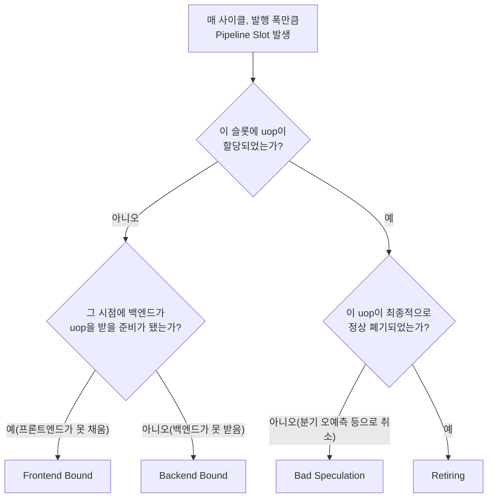

**Frontend Bound / Backend Bound / Bad Speculation / Retiring**은 CPU가 매 사이클 처리할 수 있는 명령어 자리(pipeline slot)를 무엇이 차지했는지를 네 가지 배타적 범주로 분류하는, TopDown Microarchitecture Analysis(TMA) 방법론의 최상위 분류 체계입니다. `perf stat`이나 VTune에서 캐시 미스율·분기 예측 실패율 같은 개별 카운터를 하나씩 들여다보면 숫자는 쌓이는데 "그래서 이 코드는 왜 느린가"라는 질문에 답하기 어려운 경우가 흔합니다. TMA는 그 개별 카운터들을 보기 전에, 먼저 "명령어가 아예 안 나왔는가(Frontend)", "나온 명령어가 실행을 못 기다렸는가(Backend)", "나와서 실행까지 했는데 버려졌는가(Bad Speculation)", "제대로 완료됐는가(Retiring)"라는 하나의 큰 질문으로 병목을 분류하게 해 줍니다. 이 장은 이 트랙에서 캐시·분기·ILP·OoO 각 챕터를 개별로 읽기 전에, 그 챕터들이 TopDown 트리의 어느 가지에 해당하는지 미리 매핑해 두는 **분류 지도** 역할을 합니다.

## 이 장을 읽기 전에

이 장은 [01장: CPU 파이프라인 기초](/post/cpu-optimization/cpu-pipeline-fundamentals/)에서 정의한 fetch·decode·execute·writeback 단계와 구조적·데이터·제어 해저드 개념을 전제로 합니다. 파이프라인이 왜 "비는 사이클(버블)"을 만드는지 이해하고 있다면, 이 장은 그 버블들을 원인별로 이름 붙이는 작업이라고 보면 됩니다. 트랙 인트로에서도 언급하듯 이 장(챕터 17)은 번호상 뒤에 있지만 개념적으로는 01장 바로 다음에 읽어도 무방하며, 오히려 02(분기 예측)·03(캐시)·05(ILP)를 읽기 전에 먼저 훑어 두면 각 챕터가 "Bad Speculation" 또는 "Backend Bound"의 어느 하위 항목을 설명하는지 미리 감을 잡을 수 있습니다. **이 장의 깊이**는 **기초**이며, TopDown Level 1의 네 범주와 그 분류 기준만 다룹니다. **다루지 않는 것**: Level 2 이하의 세부 드릴다운(Memory Bound의 L1/L2/L3/DRAM 세분화, Core Bound의 포트별 압력)은 [04장](/post/cpu-optimization/cache-miss-analysis-hint-instructions/)·[07장](/post/cpu-optimization/tlb-miss-optimization/)·[18장](/post/cpu-optimization/dependency-chain-port-pressure-analysis/)에서, 분기 예측기 내부 동작은 [02장](/post/cpu-optimization/branch-prediction-mechanisms-cost/)에서, VTune GUI로 TMA 트리를 시각적으로 드릴다운하는 절차는 [Tr.05 ch06: Intel VTune 심화](/post/profiling-analysis/intel-vtune-deep-dive/)에서 다룹니다.

## 당신의 수준에 맞는 경로

| 수준 | 읽을 부분 | 핵심 목표 |
|------|---------|---------|
| **초보자** | "TopDown 방법론의 등장 배경" ~ "Pipeline Slot이라는 공통 단위" | 왜 개별 카운터 대신 슬롯 분류가 필요한지 이해 |
| **중급자** | "네 가지 최상위 범주" ~ "perf로 Level 1 실측하기" | 네 범주의 분류 기준을 코드·카운터와 연결 |
| **전문가** | "판단 기준" ~ "비판적 시각" | Level 1 결과를 다음 어느 챕터·카운터로 드릴다운할지 판단 |

---

## TopDown 방법론의 등장 배경

**TopDown Microarchitecture Analysis(TMA)**는 Intel 연구원 Ahmad Yasin이 2014년 ISPASS(International Symposium on Performance Analysis of Systems and Software)에서 발표한 "A Top-Down Method for Performance Analysis and Counters Architecture" 논문에서 제안한 방법론입니다. 기존에는 캐시 미스율·분기 예측 실패율·IPC 같은 카운터를 경험적으로 조합해 병목을 추측했지만, TMA는 파이프라인의 issue 단계(슈퍼스칼라 폭만큼 매 사이클 생기는 "자리")를 기준으로 네 범주가 서로 겹치지 않고 합이 100%가 되도록 분류 규칙을 세웠다는 점이 다릅니다. 이 방법론은 이후 Linux `perf`에 `--topdown` 옵션과 `-M TopdownL1` 메트릭 그룹으로, Intel VTune Profiler에 "Microarchitecture Exploration" 분석으로 흡수되었습니다. Intel Ice Lake 세대부터는 전용 고정 카운터(Fixed Counter 3, `TOPDOWN.SLOTS`)와 `PERF_METRICS` MSR이 하드웨어에 추가되어, 이전 세대처럼 여러 범용 카운터를 번갈아 멀티플렉싱하며 발생하던 측정 노이즈 없이 Level 1 네 범주를 한 번의 실행으로 얻을 수 있습니다. TMA는 Intel이 설계했지만 Intel 전용 개념은 아닙니다 — Arm도 Neoverse 코어에서 동일한 4범주 1단계 분류를 채택하고 있으며, 이는 뒤에서 다시 다룹니다.

## Pipeline Slot이라는 공통 단위

TMA를 이해하는 핵심은 "슬롯(slot)"이라는 단위를 받아들이는 것입니다. 슈퍼스칼라 CPU가 한 사이클에 최대 N개의 μop을 발행(issue)할 수 있다면, 매 사이클마다 N개의 슬롯이 생겨나고, 프로그램 실행 전체에서 슬롯의 총합은 "사이클 수 × 발행 폭"으로 정의됩니다. TMA의 네 범주는 바로 이 슬롯 하나하나가 어떻게 소비되었는지에 대한 배타적 분류이며, 네 범주의 비율을 모두 더하면 이론상 100%가 됩니다. 이 분류는 [01장](/post/cpu-optimization/cpu-pipeline-fundamentals/)에서 다룬 "IPC가 발행 폭보다 낮은 이유"라는 질문에 대해, "낮은 이유가 프론트엔드 문제인지, 백엔드 문제인지, 아니면 애초에 버려질 일을 했기 때문인지"까지 구분해 답해 줍니다. 슬롯을 분류하는 순서는 다음과 같습니다. 먼저 그 사이클의 그 슬롯에 실제로 μop이 할당(allocate)되었는지를 봅니다. 할당되지 않았다면, 그 시점에 백엔드가 μop을 받아들일 준비가 되어 있었는지를 확인합니다. 백엔드가 준비되어 있었는데도 프론트엔드가 채워 넣지 못했다면 **Frontend Bound**로, 백엔드 자체가 꽉 차서 받을 수 없었다면 **Backend Bound**로 분류합니다. 반대로 슬롯에 μop이 할당되었다면, 그 μop이 최종적으로 정상 폐기(retire)되었는지 아니면 분기 오예측 등으로 취소되었는지를 봅니다. 정상 폐기되었으면 **Retiring**, 취소되었으면 **Bad Speculation**입니다.



## 네 가지 최상위 범주

**Retiring**은 슬롯이 실제로 유용한 작업(정상적으로 완료되어 결과가 남는 μop)에 쓰인 비율입니다. Retiring이 높다는 것은 "이 코드가 빠르다"는 뜻이 아니라 "CPU가 하드웨어 자원을 낭비하지 않고 명령어를 흘려보내고 있다"는 뜻이며, 실제로 그 명령어들이 알고리즘적으로 불필요한 일을 하고 있을 수도 있다는 점은 이 범주가 답하지 않습니다. **Frontend Bound**는 백엔드가 처리할 준비가 되어 있는데도 프론트엔드(명령어 캐시 접근, 디코드, μop 캐시/DSB 공급)가 μop을 충분히 채워 넣지 못하는 상황을 가리키며, 다시 지연(latency) 원인(명령어 캐시 미스, ITLB 미스, 분기 목표 예측 실패로 인한 재인출)과 대역폭(bandwidth) 원인(디코더 폭 한계, μop 캐시 적중 실패)으로 나뉩니다 — 이 세분화는 [15장: μOp 캐시와 DSB](/post/cpu-optimization/uop-cache-decoded-stream-buffer/)의 몫입니다. **Bad Speculation**은 분기를 잘못 예측했거나 다른 이유로 파이프라인을 플러시해서, 실행까지 됐지만 결과가 버려진 μop이 차지한 슬롯이며, 이 비율이 높을 때는 [02장: 분기 예측 메커니즘과 비용](/post/cpu-optimization/branch-prediction-mechanisms-cost/)과 [10장: 추측 실행과 보안 영향](/post/cpu-optimization/speculative-execution-security-impact/)이 원인을 설명합니다. **Backend Bound**는 프론트엔드가 μop을 충분히 공급했는데도 실행 유닛이나 메모리 시스템이 이를 소화하지 못해 슬롯이 비는 경우이며, 메모리 지연·대역폭 때문인 **Memory Bound**와 실행 포트 경합·명령어 의존성 체인 때문인 **Core Bound**로 나뉩니다. Memory Bound의 세부는 [03장](/post/cpu-optimization/cache-hierarchy-l1-l2-l3/)·[04장](/post/cpu-optimization/cache-miss-analysis-hint-instructions/)·[07장](/post/cpu-optimization/tlb-miss-optimization/)이, Core Bound의 세부는 [05장: ILP 기초](/post/cpu-optimization/instruction-level-parallelism-fundamentals/)·[06장: Out-of-Order 실행과 성능](/post/cpu-optimization/out-of-order-execution-performance/)·[18장: 의존성 체인·포트 압력 분석](/post/cpu-optimization/dependency-chain-port-pressure-analysis/)이 전담합니다.

## perf로 Level 1 실측하기

Level 1 분류가 추상적으로 느껴지지 않도록, 분기 예측이 구조적으로 불가능한 코드를 하나 만들어 실제로 Bad Speculation이 지배적으로 나오는지 확인해 보겠습니다. 아래 코드는 난수로 채운 배열을 순회하며 그 값에 따라 분기하는데, 데이터가 무작위이므로 어떤 분기 예측기도 절반 이상을 맞히기 어렵습니다.

```cpp
// topdown_demo.cpp — 빌드: g++ -O2 -march=native -o topdown_demo topdown_demo.cpp
#include <cstdint>
#include <cstdio>
#include <random>
#include <vector>

int main() {
  constexpr size_t N = 50'000'000;
  std::vector<uint8_t> data(N);
  std::mt19937 rng(42);
  std::uniform_int_distribution<int> coin(0, 1);
  for (auto& v : data) v = static_cast<uint8_t>(coin(rng));  // 무작위 0/1로 예측 불가능한 분기 유도

  int64_t sum = 0;
  for (size_t i = 0; i < N; ++i) {
    if (data[i]) sum += static_cast<int64_t>(i);   // 데이터가 무작위라 분기 예측기가 맞히지 못함
    else         sum -= static_cast<int64_t>(i);
  }
  std::printf("%lld\n", static_cast<long long>(sum));
  return 0;
}
```

이 프로그램을 `perf stat -M TopdownL1`로 실행하면 네 범주의 비율을 백분율로 얻을 수 있습니다.

```text
$ perf stat -M TopdownL1 ./topdown_demo
# Linux 6.x, GCC 13, x86-64(Ice Lake 이후 세대, 고정 카운터 SLOTS 지원) 기준 예시 값.
# 마이크로아키텍처 세대·컴파일러·난수 시드에 따라 절대 수치는 달라짐.

 Performance counter stats for './topdown_demo':

            58.4 %  tma_bad_speculation
            11.7 %  tma_frontend_bound
            21.6 %  tma_backend_bound
             8.3 %  tma_retiring

       0.841923651 seconds time elapsed
```

`tma_bad_speculation`이 절반을 훌쩍 넘는다는 것은, 발행된 슬롯의 상당수가 실행까지 갔다가 분기 오예측으로 버려졌다는 뜻입니다. 이는 코드를 처음 보고 세운 가설 — "무작위 분기니까 예측 실패가 병목일 것" — 과 정확히 들어맞으며, 다음으로 볼 곳은 [02장](/post/cpu-optimization/branch-prediction-mechanisms-cost/)의 분기 예측기 내부 동작과 오답 비용 실측입니다. 하이브리드 코어(P-core/E-core)가 섞인 CPU에서는 코어 종류마다 프론트엔드·백엔드 폭이 달라 Level 1 비율이 코어별로 다르게 나올 수 있으며, 이 경우 코어를 구분해 측정하는 `perf --cpu-type` 옵션은 [09장: CPU 하드웨어 카운터 활용](/post/cpu-optimization/cpu-hardware-performance-counters/)에서 다룹니다.

## 흔한 오개념

**"Backend Bound는 곧 캐시 미스다"**는 자주 보이는 단순화입니다. Backend Bound는 Memory Bound와 Core Bound를 모두 포함하며, 캐시·메모리와 무관하게 실행 포트가 부족하거나 명령어 의존성 체인이 길어서 생기는 Core Bound도 상당한 비중을 차지할 수 있습니다. Level 1에서 Backend Bound가 높게 나왔다고 곧바로 캐시 최적화로 달려가기보다, Level 2 드릴다운으로 Memory Bound인지 Core Bound인지부터 구분해야 합니다.

**"Level 1 백분율만 보면 원인을 알 수 있다"**도 흔한 오해입니다. Level 1은 "어느 범주가 문제인지"를 알려줄 뿐, "왜 그런지"는 알려주지 않습니다. Frontend Bound 30%라는 숫자만으로는 명령어 캐시 미스 때문인지 디코더 폭 한계 때문인지 구분이 안 되며, 실제 원인은 Level 2·3의 하위 메트릭(`tma_fetch_latency`, `tma_fetch_bandwidth` 등)까지 내려가야 드러납니다. 이 장은 그 드릴다운의 출발점을 제공할 뿐, 드릴다운 자체는 뒤 챕터들의 몫입니다.

**"IPC가 낮으면 무조건 Backend Bound다"**라는 인식도 정확하지 않습니다. IPC가 낮은 이유는 네 범주 중 어느 것이든 될 수 있습니다 — Bad Speculation이 지배적이어도 폐기되는 μop이 많아 정상 완료되는 μop 수(그리고 IPC)는 낮게 나오며, 위 실측 예시가 바로 그 사례입니다. IPC 하나만으로는 Bad Speculation과 Backend Bound를 구분할 수 없다는 점이 TopDown이 IPC 단일 지표보다 유용한 이유입니다.

## 판단 기준: Level 1 결과에서 다음에 볼 곳

| Level 1에서 지배적인 범주 | 의심할 원인 | 다음 확인 챕터 |
|------|------|------|
| Frontend Bound (지연 우세) | 명령어/ITLB 캐시 미스, 분기 목표 재인출 | [15장](/post/cpu-optimization/uop-cache-decoded-stream-buffer/), [02장](/post/cpu-optimization/branch-prediction-mechanisms-cost/) |
| Frontend Bound (대역폭 우세) | 디코더 폭 한계, μop 캐시 미적중 | [15장](/post/cpu-optimization/uop-cache-decoded-stream-buffer/) |
| Bad Speculation | 분기 예측 실패, 추측 실행 플러시 | [02장](/post/cpu-optimization/branch-prediction-mechanisms-cost/), [10장](/post/cpu-optimization/speculative-execution-security-impact/) |
| Backend Bound (Memory) | 캐시 미스, TLB 미스 | [03장](/post/cpu-optimization/cache-hierarchy-l1-l2-l3/), [04장](/post/cpu-optimization/cache-miss-analysis-hint-instructions/), [07장](/post/cpu-optimization/tlb-miss-optimization/) |
| Backend Bound (Core) | 포트 경합, 긴 의존성 체인 | [05장](/post/cpu-optimization/instruction-level-parallelism-fundamentals/), [06장](/post/cpu-optimization/out-of-order-execution-performance/), [18장](/post/cpu-optimization/dependency-chain-port-pressure-analysis/) |
| Retiring이 높은데 p99가 나쁨 | 카운터가 못 보는 OS·스케줄링 요인 | Tr.05 프로파일링, Tr.07 OS 트랙 |

## 비판적 시각: TMA의 한계와 논란

TMA의 슬롯 귀속은 인과관계의 완전한 증명이 아니라 **정교한 발견적(heuristic) 분류**임을 염두에 둬야 합니다. 분기 오예측 직후처럼 파이프라인 플러시와 프론트엔드 재충전이 겹치는 경계 구간(원 논문이 "skid"라 부르는 현상)에서는 슬롯이 실제 원인과 다른 범주로 잘못 귀속될 수 있고, 이런 근사 오차는 특히 Level 1 비율이 서로 비슷비슷하게 나뉜 애매한 케이스에서 결론을 흐릴 수 있습니다. 측정 인프라 자체도 세대에 따라 신뢰도가 다릅니다 — Ice Lake 이전 세대는 여러 범용 카운터를 번갈아 측정(멀티플렉싱)해야 해서 짧게 실행되는 코드에는 노이즈가 크고, Ice Lake부터의 전용 고정 카운터·`PERF_METRICS` MSR을 쓸 수 있을 때 신뢰도가 크게 올라갑니다. 하이브리드 코어에서는 P-core와 E-core의 발행 폭·파이프라인 구조가 달라 코어를 구분하지 않고 집계하면 왜곡된 평균이 나오므로 코어별 측정이 필요합니다. AMD는 `uProf`에서 유사한 개념을 제공하지만 세부 메트릭 이름과 분류 경계는 Intel TMA와 동일하지 않으며, Arm은 Neoverse 코어에서 같은 4범주 1단계 분류를 채택하면서도 2단계부터는 Cycle Accounting 등 별도 체계로 갈라집니다. 즉 TMA는 Intel이 만들었지만 Intel 전용은 아니고, 그렇다고 벤더 간에 완전히 호환되는 표준도 아닙니다. 실무에서는 Level 1을 "어디를 더 팔지" 정하는 나침반으로만 쓰고, 실제 결론은 Level 2·3 드릴다운과 코드 수준 실험으로 재확인하는 습관이 필요합니다.

## 더 읽을 거리

- [perf wiki: Top-Down Analysis](https://perfwiki.github.io/main/top-down-analysis/) — `perf stat -M TopdownL1`의 네 범주 정의와 드릴다운 절차를 정리한 공식 perf 문서
- [man7.org: perf-stat(1)](https://man7.org/linux/man-pages/man1/perf-stat.1.html) — `--topdown`·`-M` 옵션의 공식 매뉴얼 페이지
- [Linux kernel: tools/perf/Documentation/topdown.txt](https://github.com/torvalds/linux/blob/master/tools/perf/Documentation/topdown.txt) — pipeline slot 정의와 Ice Lake 고정 카운터 지원을 설명하는 커널 문서
- [Arm Learning Paths: Compare Arm Neoverse and Intel x86 top-down performance analysis](https://learn.arm.com/learning-paths/cross-platform/topdown-compare/2-code-examples/) — 동일한 4범주 분류가 Arm Neoverse에서도 쓰이는 사례 비교

## 마무리

- [ ] Pipeline Slot이 무엇이고, 네 범주의 분류가 왜 서로 배타적이며 합이 100%가 되는지 설명할 수 있다.
- [ ] Frontend Bound·Bad Speculation·Backend Bound·Retiring 각각의 정의를 슬롯 귀속 기준으로 구분할 수 있다.
- [ ] `perf stat -M TopdownL1` 출력에서 지배적인 범주를 읽고, 그에 맞는 드릴다운 챕터(02·03·04·05·06·07·15·18)로 연결할 수 있다.
- [ ] "Backend Bound=캐시 미스", "Level 1만으로 원인을 안다", "IPC만으로 충분하다" 같은 오개념을 스스로 교정할 수 있다.
- [ ] TMA가 인과 증명이 아닌 발견적 분류이며, 세대·벤더에 따라 측정 신뢰도와 메트릭 체계가 다르다는 점을 인식한다.

**이전 장**: [RISC-V 아키텍처 기초](/post/cpu-optimization/risc-v-architecture-performance-fundamentals/) (챕터 16)

**다음 장에서는** 이 장에서 Backend Bound의 하위 범주로만 짚고 넘어간 Core Bound를 본격적으로 파고듭니다. 실행 포트 경합과 명령어 의존성 체인 길이가 어떻게 슬롯을 비우는지, 그리고 이를 실측하고 완화하는 구체적인 방법을 다룹니다.

→ [의존성 체인·포트 압력 분석](/post/cpu-optimization/dependency-chain-port-pressure-analysis/) (다음 장)
