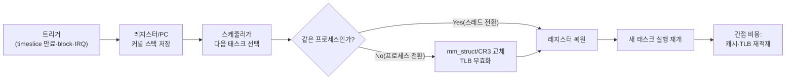

<strong>Context Switch(컨텍스트 스위치)</strong>란 CPU 코어가 하나의 실행 흐름(프로세스 또는 스레드)을 멈추고 다른 실행 흐름을 재개하기 위해 레지스터·프로그램 카운터·주소 공간 매핑 등 실행 상태를 저장하고 복원하는 커널 동작을 말합니다. 애플리케이션 코드와 알고리즘을 아무리 다듬어도, 스레드 수가 코어 수보다 많거나 락 경합이 잦으면 스케줄러가 개입하는 횟수 자체가 지연 시간의 바닥을 결정합니다. 이 장에서는 컨텍스트 스위치의 직접 비용과 간접 비용을 구조적으로 나누어 살펴보고, 자발적(voluntary) 스위치와 비자발적(involuntary) 스위치를 구분해 측정하는 도구를 익힌 뒤, 스위치 횟수 자체를 줄이는 설계 전략을 정리합니다.

## 이 장을 읽기 전에

**완전한 초보자?** 이 장은 [트랙 인트로](/post/os-optimization/getting-started-os-runtime-performance-tuning/)에서 설명한 "스케줄링·시스템 콜·코어 배치가 지연시간의 바닥을 결정한다"는 전제를 출발점으로 삼습니다. 프로세스와 스레드가 커널이 관리하는 실행 단위라는 점, CPU 코어는 한 순간에 하나의 실행 흐름만 실제로 돌릴 수 있다는 점만 알면 충분합니다.

**이 장의 깊이**: 이 장은 **중급**을 대상으로 하며, 컨텍스트 스위치가 왜 비용을 발생시키는지(직접 비용)와 그 여파가 왜 더 클 수 있는지(간접 비용, 캐시·TLB 오염)를 실행 경로 수준에서 설명합니다. 측정 도구(`getrusage`, `/proc/[pid]/status`, `perf sched`)의 사용법과, 설계 단계에서 스위치 횟수를 줄이는 일반 전략까지 다룹니다.

**다루지 않는 것**: CPU affinity/pinning의 구체적인 API와 전략은 [CPU Pinning/Affinity 전략](/post/os-optimization/cpu-pinning-affinity-strategy/)(3장), NUMA 환경에서의 스레드 배치는 [NUMA CPU Affinity·스레드 배치](/post/os-optimization/numa-cpu-affinity-thread-placement/)(4장), 스케줄링 정책 자체(sched_ext, EEVDF)는 [Realtime 스케줄링](/post/os-optimization/realtime-scheduling-sched-ext-eevdf/)(5장), 정밀 타이밍 측정 도구는 [정밀 시간 측정](/post/os-optimization/precise-time-measurement-rdtsc-clock-gettime/)(6장), 시스템 콜 경로 자체의 비용은 [Syscall 비용과 최소화 기법](/post/os-optimization/syscall-cost-minimization/)(2장)에서 다룹니다. 이 장은 그 앞에서 "컨텍스트 스위치란 무엇이고 얼마나 비싼가"라는 공통 바닥을 놓는 역할을 합니다.

## 당신의 수준에 맞는 경로

| 수준 | 읽을 부분 | 핵심 목표 |
|------|---------|---------|
| **초보자** | "컨텍스트 스위치의 역사" ~ "직접 비용과 간접 비용" | 컨텍스트 스위치가 무엇을 저장·복원하는지, 비용이 왜 두 층으로 나뉘는지 이해 |
| **중급자** | "자발적 스위치와 비자발적 스위치" ~ "설계로 스위치 횟수 줄이기" | 실측 도구로 스위치 원인을 진단하고 설계 전략을 적용 |
| **전문가** | "판단 기준" ~ "비판적 시각" | 언제 스위치 감소가 의미 있는 투자인지, 하드웨어·커널 버전 의존성을 판단 |

---

## 컨텍스트 스위치의 역사와 배경

멀티태스킹 운영체제의 컨텍스트 스위치 개념은 1960년대 초 시분할(time-sharing) 시스템에서 등장했습니다. MIT의 CTSS(Compatible Time-Sharing System, 1961)와 그 뒤를 이은 Multics 프로젝트는 한 CPU를 여러 사용자가 번갈아 쓰도록 실행 상태를 저장·전환하는 메커니즘을 처음으로 실용화했고, 이 아이디어가 이후 Unix 계열 커널의 프로세스 스케줄러로 이어졌습니다. Linux 커널에서는 스케줄러 구현 자체가 여러 차례 바뀌었지만(2.6대의 O(1) 스케줄러, 2007년 Ingo Molnar가 도입한 CFS, 그리고 2023~2024년 머지되어 2026년 기준 배포판 커널에 자리 잡은 EEVDF), 컨텍스트 스위치의 "레지스터 저장 → 다음 태스크 선택 → 주소 공간 전환 → 레지스터 복원"이라는 기본 골격 자체는 스케줄러 알고리즘 교체와 별개로 유지되어 왔습니다. 스케줄링 정책이 "누구를 다음에 실행할지"를 결정하는 문제라면, 이 장에서 다루는 컨텍스트 스위치 비용은 "그 결정을 실행에 옮기는 데 드는 고정 비용과 여파"에 관한 문제입니다.

## 컨텍스트 스위치란 무엇인가

컨텍스트 스위치는 크게 두 종류로 나뉩니다. 같은 프로세스 안의 스레드 사이를 전환하는 경우와, 서로 다른 프로세스 사이를 전환하는 경우입니다. 스레드 전환은 커널 스택·레지스터·FPU/SIMD 상태(`XSAVE`/`XRSTOR`로 저장되는 벡터 레지스터 등)만 바꾸면 되지만, 프로세스 전환은 여기에 더해 **주소 공간 전환**이 추가로 필요합니다. x86-64에서는 `CR3` 레지스터를 새 프로세스의 페이지 테이블 베이스로 교체하는데, 이 교체는 원칙적으로 TLB(Translation Lookaside Buffer)를 무효화시켜 이후 메모리 접근마다 페이지 테이블을 다시 워크(walk)하게 만듭니다. 즉 스레드 전환보다 프로세스 전환이 구조적으로 더 비쌉니다. 커널이 관여하는 다른 상황(시스템 콜, 인터럽트, 페이지 폴트 처리)도 커널/사용자 모드를 오가는 <strong>모드 전환(mode switch)</strong>을 일으키지만, 실행 흐름 자체는 그대로 유지되므로 컨텍스트 스위치와는 구분됩니다. 모드 전환만으로는 스케줄러가 개입하지 않고 레지스터 일부만 저장하면 되므로 비용이 훨씬 낮습니다.



## 직접 비용과 간접 비용

<strong>직접 비용(direct cost)</strong>은 스위치 자체가 CPU 사이클을 소비하는 부분입니다. 레지스터 저장/복원, 커널 스택 전환, 스케줄러가 다음 태스크를 고르는 데 걸리는 시간, 프로세스 전환이라면 페이지 테이블 베이스 교체까지 포함합니다. 개인 벤치마크와 공개 측정 사례를 보면 현대 x86-64 서버 CPU 기준으로 직접 비용은 대략 **1~4마이크로초** 범위에서 관측되는 경우가 흔하지만, 이는 CPU 세대·커널 버전·측정 방법론에 따라 달라지므로 절대값으로 암기하지 말고 자신의 환경에서 재현해야 합니다.

<strong>간접 비용(indirect cost)</strong>은 스위치가 끝난 뒤 새로 실행되는 태스크가 예전 태스크가 채워 놓았던 L1/L2/L3 캐시와 TLB를 다시 채우면서 발생하는 지연입니다. 이 비용은 작업 세트(working set) 크기에 크게 좌우됩니다. Tsuna의 잘 알려진 벤치마크 분석에 따르면, 작업 세트가 L1 캐시(수십 KB)를 넘어서는 순간 스위치당 비용이 두 배 이상으로 뛰고, L2 캐시 절반을 넘어서면 수 배에서 수십 배까지 늘어날 수 있습니다. 같은 코어에 스레드를 고정(pinning)해 마이그레이션을 없앤 경우와 코어를 옮겨 다니게 방치한 경우를 비교하면, 저자는 고정 시 스위치당 비용이 절반 이하로 줄어드는 사례를 보고합니다. 즉 "컨텍스트 스위치는 Xµs"라는 단일 숫자는 존재하지 않고, 직접 비용은 상대적으로 작고 예측 가능한 반면 간접 비용은 워크로드의 메모리 접근 패턴에 좌우되는 변동 폭이 훨씬 큰 항목입니다.

x86-64 프로세서의 PCID(Process-Context Identifier)와 이를 활용하는 커널의 TLB 태깅은 컨텍스트 스위치마다 TLB 전체를 비우는 대신 주소 공간별로 태그를 구분해 일부 엔트리를 재사용하도록 완화할 수 있습니다. 다만 이 완화의 실제 효과는 CPU 세대(INVPCID 지원 여부), 커널 버전, KPTI(Meltdown 완화) 활성화 여부에 따라 달라지는 **구현 정의** 영역이므로, "PCID가 있으니 TLB 플러시 비용은 무시해도 된다"고 단정하지 않는 것이 안전합니다.

## 자발적 스위치와 비자발적 스위치

리눅스는 컨텍스트 스위치를 원인 기준으로 두 가지로 집계합니다. `getrusage(2)` man 페이지는 이를 다음과 같이 정의합니다.

> "The number of times a context switch resulted due to a process voluntarily giving up the processor before its time slice was completed (usually to await availability of a resource)" (`ru_nvcsw`, 자발적) 그리고 "The number of times a context switch resulted due to a higher priority process becoming runnable or because the current process exceeded its time slice" (`ru_nivcsw`, 비자발적). — [man7.org: getrusage(2)](https://man7.org/linux/man-pages/man2/getrusage.2.html)

**자발적(voluntary) 스위치**는 태스크가 락, I/O, 조건 변수 등 자원을 기다리며 스스로 CPU를 내놓는 경우입니다. 비동기 I/O 대기나 뮤텍스 블로킹처럼 설계상 자연스러운 흐름에서도 발생하므로, 자발적 스위치 수가 많다고 그 자체가 문제인 것은 아닙니다. **비자발적(involuntary) 스위치**는 타임 슬라이스가 만료되었거나 더 높은 우선순위 태스크가 실행 가능해져 스케줄러가 강제로 선점한 경우입니다. 지연에 민감한 워크로드에서는 비자발적 스위치가 예측 불가능한 시점에 실행을 끊기 때문에 더 큰 골칫거리가 됩니다. 두 값은 `/proc/[pid]/status`의 `voluntary_ctxt_switches`, `nonvoluntary_ctxt_switches` 필드(리눅스 2.6.23 이후)로도 프로세스 단위로 확인할 수 있습니다.

## 측정하기

**프로세스/스레드 단위 누적치**는 `getrusage(2)`를 코드에서 직접 호출하거나, 실행 중인 프로세스라면 `/proc/[pid]/status`를 읽어 확인합니다.

```c
#include <stdio.h>
#include <sys/resource.h>

int main(void) {
  struct rusage ru;
  getrusage(RUSAGE_SELF, &ru);
  printf("voluntary (ru_nvcsw):    %ld\n", ru.ru_nvcsw);
  printf("involuntary (ru_nivcsw): %ld\n", ru.ru_nivcsw);
  return 0;
}
```

이미 실행 중인 프로세스라면 코드를 수정하지 않고도 `/proc` 인터페이스로 같은 값을 바로 확인할 수 있습니다.

```bash
# 실행 중인 프로세스의 누적 자발적/비자발적 스위치 횟수
grep ctxt_switches /proc/$(pgrep -n myapp)/status
# voluntary_ctxt_switches:    1204
# nonvoluntary_ctxt_switches: 37

# 시스템 전체 초당 컨텍스트 스위치 수(cs 컬럼)
vmstat 1 5
```

`getrusage`는 누적 카운터만 주기 때문에 "누가 언제 왜" 스위치를 유발했는지는 알려주지 않습니다. 원인 분석에는 `perf sched`가 더 적합합니다.

```bash
perf sched record -- ./myapp     # 스케줄링 이벤트 기록
perf sched latency                # 태스크별 평균/최대 스케줄 지연 요약
perf sched timehist                # 개별 스위치 이벤트의 대기 시간·실행 시간
```

`perf sched`는 "Tool to trace/measure scheduler properties (latencies)"로 문서화되어 있으며, `latency`·`timehist`·`map` 서브커맨드로 태스크별 지연과 개별 스위치 이벤트를 시간순으로 분해해 보여줍니다 ([man7.org: perf-sched(1)](https://man7.org/linux/man-pages/man1/perf-sched.1.html)).

**스위치 자체의 순수 비용**을 격리해 측정하려면, lmbench의 `lat_ctx`가 오래 써온 것과 같은 방식인 "핑퐁(ping-pong)" 벤치마크가 유용합니다. 두 실행 흐름이 서로를 블로킹 I/O로 깨우게 만들면 왕복마다 최소 두 번의 강제 컨텍스트 스위치가 발생합니다. 아래는 파이프 기반의 최소 재현 코드입니다.

```cpp
// ctxsw_bench.cpp
// 빌드: g++ -O2 -std=c++17 -pthread ctxsw_bench.cpp -o ctxsw_bench
// 실행: taskset -c 2,3 ./ctxsw_bench   (두 논리 코어에 한정해 마이그레이션 배제)
#include <cstdio>
#include <pthread.h>
#include <sched.h>
#include <time.h>
#include <unistd.h>

int pipe_a[2], pipe_b[2];  // a: main->peer, b: peer->main
constexpr int kRounds = 100000;

void pin_to(int cpu) {
  cpu_set_t set;
  CPU_ZERO(&set);
  CPU_SET(cpu, &set);
  pthread_setaffinity_np(pthread_self(), sizeof(set), &set);
}

void* peer_thread(void*) {
  pin_to(1);
  char buf;
  for (int i = 0; i < kRounds; ++i) {
    read(pipe_a[0], &buf, 1);
    write(pipe_b[1], &buf, 1);
  }
  return nullptr;
}

int main() {
  pipe(pipe_a);
  pipe(pipe_b);
  pin_to(0);
  pthread_t t;
  pthread_create(&t, nullptr, peer_thread, nullptr);

  char buf = 'x';
  timespec t0, t1;
  clock_gettime(CLOCK_MONOTONIC, &t0);
  for (int i = 0; i < kRounds; ++i) {
    write(pipe_a[1], &buf, 1);
    read(pipe_b[0], &buf, 1);
  }
  clock_gettime(CLOCK_MONOTONIC, &t1);
  pthread_join(t, nullptr);

  double total_ns = (t1.tv_sec - t0.tv_sec) * 1e9 + (t1.tv_nsec - t0.tv_nsec);
  // 왕복 1회 = 최소 2회의 context switch(main -> peer -> main)
  printf("switch당 평균: %.1f ns\n", total_ns / (kRounds * 2));
  return 0;
}
```

이 코드는 파이프 두 개를 오가는 1바이트 핑퐁만 측정하므로 **직접 비용에 가까운 하한선**을 보여줍니다. 실제 서비스의 스위치 비용은 여기에 작업 세트 크기에 비례하는 간접 비용이 더해지므로, 이 벤치마크 결과를 그대로 서비스 전체 오버헤드로 환산하지 말고 `perf sched timehist`로 실제 워크로드의 스위치 빈도와 대기 시간을 함께 확인해야 합니다.

## 흔한 오개념

<strong>"컨텍스트 스위치 비용은 항상 일정하다"</strong>는 오개념입니다. 직접 비용은 CPU 세대·커널 버전에서 비교적 안정적이지만, 간접 비용은 작업 세트 크기와 캐시 상태에 따라 같은 시스템에서도 수 배에서 수십 배까지 달라집니다. 벤치마크로 얻은 숫자 하나를 다른 워크로드에 그대로 적용하면 안 됩니다.

<strong>"스레드 전환과 프로세스 전환은 비용이 같다"</strong>도 흔한 오해입니다. 같은 프로세스의 스레드끼리는 `mm_struct`(주소 공간)를 공유하므로 페이지 테이블 베이스 교체와 그에 따른 TLB 무효화가 필요 없습니다. 프로세스 사이의 전환만 이 비용을 추가로 지불합니다. 아키텍처를 스레드 기반으로 설계하면 이 차이만으로도 스위치 비용을 줄일 수 있습니다(선택 기준은 [Process vs Thread 아키텍처 선택](/post/os-optimization/process-vs-thread-architecture-choice/), 16장 참고).

<strong>"컨텍스트 스위치 횟수가 많으면 무조건 나쁘다"</strong>는 것도 과장입니다. 자발적 스위치는 I/O 대기, 락 해제 대기처럼 정상적인 흐름에서도 자연스럽게 발생합니다. 문제 삼아야 할 대상은 스레드 오버서브스크립션이나 불필요한 락 경합으로 생기는 **과도한 비자발적 스위치**와 코어 간 마이그레이션이지, 스위치 총량 자체가 아닙니다. `ru_nvcsw`/`ru_nivcsw`를 나눠서 보고 무엇이 늘고 있는지부터 진단해야 합니다.

## 설계로 스위치 횟수 줄이기

**스레드 오버서브스크립션 피하기**: 스레드 수가 사용 가능한 코어 수를 크게 넘으면 스케줄러가 타임 슬라이스를 잘게 쪼개 돌아가며 배정하므로 비자발적 스위치가 늘어납니다. CPU 바운드 워커 풀은 코어 수(또는 이보다 약간 적은 수)에 맞추는 것이 기본 원칙입니다.

**락 경합 축소**: 뮤텍스 대기로 블로킹되면 자발적 스위치가 발생하고, 대기 스레드가 다시 깨어날 때 또 한 번의 스위치가 필요합니다. 락을 잘게 쪼개거나(샤딩) lock-free/wait-free 자료구조로 대체하면 스위치를 유발하는 대기 자체를 줄일 수 있습니다.

**불필요한 wakeup 억제**: 조건 변수를 broadcast로 깨우거나 이벤트를 과도하게 브로드캐스트하면 실제로 진행할 수 없는 스레드까지 깨어났다가 다시 잠들면서 스위치가 낭비됩니다. 필요한 스레드만 정확히 깨우는 `notify_one`/타깃 지정 웨이크업이 스위치 낭비를 줄입니다.

**코어 배치와 우선순위**: 지연에 민감한 스레드를 특정 코어에 고정하고 다른 워크로드와 코어를 공유하지 않게 하면 비자발적 스위치의 원인 자체(다른 태스크의 실행 가능화)를 줄일 수 있습니다. 구체적인 API와 절차는 [CPU Pinning/Affinity 전략](/post/os-optimization/cpu-pinning-affinity-strategy/)(3장)에서 다룹니다.

**시스템 콜 배치**: 시스템 콜 자체는 모드 전환이지 컨텍스트 스위치가 아니지만, 블로킹 시스템 콜(예: 동기 `read`)은 자발적 스위치의 흔한 트리거입니다. 폴링 배치나 비동기 I/O로 블로킹 지점을 줄이는 기법은 [Syscall 비용과 최소화 기법](/post/os-optimization/syscall-cost-minimization/)(2장)에서 이어집니다.

## 판단 기준

| 상황 | 권장 | 비권장/주의 |
|------|------|--------|
| CPU 바운드 워커 스레드 수 설계 | 코어 수에 맞춘 고정 크기 풀 | 요청마다 스레드 생성, 무제한 확장 |
| 락 경합으로 자발적 스위치 다수 발생 | 락 샤딩·lock-free 구조로 대기 자체 축소 | 스위치 수만 관찰하고 원인 방치 |
| 지연 민감 스레드가 비자발적 스위치로 자주 끊김 | 전용 코어 pinning + isolcpus (3장 연계) | 범용 코어 풀과 계속 공유 |
| 스위치 비용을 벤치마크로 정량화하려 함 | 직접 비용(핑퐁) + 간접 비용(perf sched timehist)을 분리 측정 | 단일 벤치마크 수치를 모든 워크로드에 일반화 |
| 스위치 감소를 위해 바쁜 대기(busy-poll) 도입 검토 | CPU/전력 예산과 지연 목표를 함께 저울질 | 무조건 블로킹 제거만 추구 |

## 비판적 시각: 한계와 트레이드오프

컨텍스트 스위치를 줄이는 가장 손쉬운 방법 중 하나는 블로킹 대신 바쁜 대기(busy-polling)로 전환하는 것이지만, 이는 스위치 비용을 CPU 사이클 소비와 전력 비용으로 바꾸는 트레이드오프일 뿐입니다. 코어를 100% 점유하는 폴링 루프는 다른 워크로드와 공존하기 어렵고 클라우드·컨테이너 환경에서는 비용으로 직결되므로, 지연 목표가 그 대가를 정당화하는지 먼저 따져야 합니다(폴링 기반 I/O의 구체적 트레이드오프는 8장에서 다시 다룹니다).

CPU pinning으로 비자발적 스위치를 줄이는 전략도 공짜가 아닙니다. 특정 코어를 특정 스레드에 고정하면 스케줄러가 부하를 다른 유휴 코어로 재분배할 여지가 줄어들어, 워크로드 패턴이 바뀌면 오히려 코어별 불균형이 고착될 수 있습니다. PCID 기반 TLB 태깅처럼 하드웨어·커널이 제공하는 완화책도 CPU 세대와 커널 버전에 따라 실제 효과가 달라지므로, "최신 하드웨어니까 TLB 플러시 비용은 무시할 만하다"는 가정은 반드시 자신의 환경에서 재검증해야 합니다. 마지막으로, 스위치 횟수라는 단일 지표만으로 성능 문제를 진단하는 것도 위험합니다. 같은 횟수라도 어떤 스위치는 워밍업된 캐시로 돌아오고 어떤 스위치는 완전히 식은 캐시로 돌아오므로, `perf sched timehist`처럼 개별 이벤트의 대기·실행 시간을 함께 보지 않으면 지표가 실제 지연 분포를 오도할 수 있습니다.

## 마무리

이 장을 읽은 뒤 다음을 스스로 점검해 보십시오.

- [ ] 직접 비용(레지스터/스택 저장, 주소 공간 전환)과 간접 비용(캐시·TLB 재적재)을 구분해 설명할 수 있는가?
- [ ] 스레드 전환이 프로세스 전환보다 구조적으로 저렴한 이유(`mm_struct` 공유)를 말할 수 있는가?
- [ ] `ru_nvcsw`/`ru_nivcsw`, `/proc/[pid]/status`, `perf sched`로 자발적/비자발적 스위치를 구분해 측정할 수 있는가?
- [ ] 스위치 횟수 자체가 아니라 원인(오버서브스크립션, 락 경합, 불필요한 wakeup)을 진단 대상으로 삼을 수 있는가?
- [ ] busy-polling·pinning처럼 스위치를 줄이는 전략이 CPU/전력/유연성 측면에서 어떤 대가를 요구하는지 설명할 수 있는가?

다음 장에서는 **시스템 콜 비용**을 다룹니다. 컨텍스트 스위치가 "실행 흐름을 바꾸는" 비용이라면, 시스템 콜은 그 흐름을 유지한 채 커널 모드를 오가는 더 자주 발생하는 비용입니다. 블로킹 시스템 콜이 자발적 컨텍스트 스위치의 흔한 트리거라는 이 장의 논의는 다음 장에서 시스템 콜 경로 자체를 줄이는 기법으로 이어집니다.

→ [Syscall 비용과 최소화 기법](/post/os-optimization/syscall-cost-minimization/)
