**Syscall 비용**이란 사용자 공간 코드가 커널 기능을 요청할 때 발생하는 모드 전환(user→kernel→user) 비용과, 그 위에 보안 완화 기법(KPTI)이 얹는 추가 비용을 합친 것을 말합니다. µs 단위 지연을 다루는 서비스에서는 개별 syscall 하나가 수백 ns라도, 초당 수만~수십만 번 호출되면 그 총합이 CPU 시간의 눈에 띄는 비중을 차지합니다. 이 장에서는 syscall 진입·탈출이 왜 비용을 수반하는지, Meltdown 완화(KPTI)가 그 위에 무엇을 더했는지, 그리고 **vDSO**로 일부 syscall을 완전히 우회하거나 **batching**으로 호출 횟수 자체를 줄이는 방법을 다룹니다.

## 이 장을 읽기 전에

**선행 챕터**: [Context Switch 비용 분석과 회피](/post/os-optimization/context-switch-cost-avoidance/) (챕터 01)에서 스레드/프로세스 간 전환 비용을 다뤘습니다. 이 장은 그것과 다른 층위입니다 — syscall 진입·탈출은 같은 스레드가 커널 모드로 들어갔다 나오는 것이고, 컨텍스트 스위치는 실행 중인 스레드 자체가 바뀌는 것입니다. 하나의 syscall이 반드시 컨텍스트 스위치를 유발하지는 않습니다(예: 블로킹 없이 즉시 반환하는 `getpid`).

**전제 지식**: user mode/kernel mode 구분, 가상 메모리와 페이지 테이블의 기본 개념(주소를 물리 메모리로 매핑하는 표라는 정도), C에서 syscall을 감싸는 라이브러리 함수(`read`, `write` 등)를 사용해 본 경험이면 충분합니다.

**이 장의 깊이**: **중급**입니다. syscall 진입·탈출의 모드 전환 메커니즘, KPTI(Kernel Page Table Isolation)가 왜 도입되었고 비용이 어디서 오는지, vDSO가 우회하는 범위, writev/sendmmsg로 호출 횟수를 줄이는 패턴을 실측 가능한 수준까지 다룹니다.

**다루지 않는 것**: 스레드/프로세스 전환 자체의 비용 분석은 [챕터 01](/post/os-optimization/context-switch-cost-avoidance/), CPU 코어 배치·affinity는 [챕터 03](/post/os-optimization/cpu-pinning-affinity-strategy/), io_uring의 내부 구조와 심화 사용법은 챕터 08, DPDK 등 커널 완전 우회 아키텍처는 챕터 07에서 각각 개요·경계를 다룹니다. 이 장은 "syscall 자체의 비용을 줄이는 방법"까지만 다루고, io_uring/DPDK로 넘어가는 시점의 판단만 짧게 짚습니다.

## 당신의 수준에 맞는 경로

| 수준 | 읽을 부분 | 핵심 목표 |
|------|---------|---------|
| **입문** | "Syscall과 Meltdown/KPTI" ~ "KPTI 오버헤드" | syscall 진입·탈출 비용과 KPTI가 더한 비용의 출처 이해 |
| **중급자** | "vDSO로 커널 진입 우회하기" ~ "batching으로 syscall 횟수 줄이기" | vDSO·writev·sendmmsg를 실제 코드에 적용 |
| **전문가** | "판단 기준" ~ "비판적 시각" | KPTI를 끄거나 io_uring으로 넘어갈 시점을 판단 |

---

## Syscall과 Meltdown/KPTI (역사·배경)

x86 초기에는 `int 0x80` 소프트웨어 인터럽트로 syscall을 구현했고, 2000년대 들어 인텔·AMD가 각각 `SYSENTER`/`SYSCALL` 전용 명령을 추가해 진입 비용을 낮췄습니다. 이 명령들은 여전히 링(ring) 전환과 레지스터 저장·복원을 수반하지만, 소프트웨어 인터럽트보다 훨씬 적은 사이클로 커널에 진입합니다. 2018년 1월 공개된 **Meltdown**(CVE-2017-5754)은 사용자 프로세스가 특정 조건에서 커널 메모리를 추측 실행(speculative execution)을 통해 읽어낼 수 있음을 보였고, 이에 대한 완화책으로 <strong>KPTI(Kernel Page Table Isolation, 이전 명칭 KAISER)</strong>가 리눅스 4.15(2018-01)에 긴급 병합되었습니다. KPTI는 사용자 모드와 커널 모드의 페이지 테이블을 분리해, 사용자 프로세스가 커널 주소 공간을 매핑조차 하지 못하게 만듭니다. 이 분리가 이 장에서 다루는 "syscall 비용"의 핵심 변수 하나입니다 — syscall 진입·탈출마다 페이지 테이블을 교체하는 비용이 추가되었기 때문입니다.

## Syscall 진입·탈출 비용 (모드 전환)

**syscall 진입**은 사용자 프로그램이 `syscall` 명령(x86-64)을 실행하는 순간 시작됩니다. CPU는 현재 레지스터 일부를 저장하고, 권한 링을 3(사용자)에서 0(커널)으로 올리고, 미리 등록된 커널 진입점으로 점프합니다. 커널은 인자를 검증하고 실제 작업을 수행한 뒤, `sysret` 유사 명령으로 사용자 모드로 복귀합니다. 이 과정 자체는 (KPTI 없이도) 함수 호출보다 훨씬 비싼데, 링 전환과 레지스터 저장·복원, 커널 진입점의 인자 검증 코드 실행이 모두 최소 수십~수백 ns의 고정 비용을 만들기 때문입니다. 중요한 점은 이것이 **컨텍스트 스위치와는 다른 비용**이라는 것입니다 — 실행 중인 스레드는 그대로이고 같은 주소 공간에 머무르므로, TLB를 통째로 무효화할 필요는 원래 없습니다(그 무효화를 강제로 유발한 것이 바로 다음 절의 KPTI입니다). 스레드 자체가 교체되는 비용과의 구분·회피 전략은 [챕터 01](/post/os-optimization/context-switch-cost-avoidance/)에서 다뤘으므로 이 장에서는 반복하지 않습니다.

## KPTI 오버헤드

KPTI는 커널에 진입할 때마다 사용자용 페이지 테이블에서 커널용 페이지 테이블로 `CR3` 레지스터를 교체하고, 복귀할 때 다시 사용자용으로 되돌립니다. [리눅스 커널 문서](https://www.kernel.org/doc/html/next/x86/pti.html)는 이 교체 비용을 커널 진입·탈출마다 수백 CPU 사이클 수준으로 설명하며, `PCID`(Process Context IDentifier)가 없는 CPU에서는 페이지 테이블 교체 시 TLB 전체를 비워야 해 비용이 더 커진다고 밝히고 있습니다. PCID가 있는 CPU는 페이지 테이블을 바꿀 때도 TLB 전체를 무효화하지 않고 선택적으로만 비울 수 있어, 커널 진입·탈출(그리고 컨텍스트 스위치)의 실질 비용을 낮춰 줍니다.

실측치는 **syscall 발생 빈도에 크게 좌우**됩니다. Netflix의 Brendan Gregg는 KPTI 도입 직후 CPU당 초당 syscall 수를 기준으로, 5만 회/초 부근에서는 약 2%, 1만 회/초 미만에서는 0.5% 미만의 손실을 관측했다고 보고했습니다. syscall이 극단적으로 잦은 스트레스 테스트(초당 21만 회 + 컨텍스트 스위치 초당 2.7만 회)에서는 TLB 민감도 때문에 예상(12% 미만)보다 큰 25% 손실이 측정되기도 했습니다. PostgreSQL 읽기 전용 벤치마크에서는 PCID 활성 시 7~17%, 비활성 시 16~23%의 손실이 보고된 사례도 있습니다. 이 수치들은 커널 버전·CPU 세대·워크로드에 따라 달라지므로 절대값으로 받아들이지 말고, 자신의 환경에서 syscall 비율을 먼저 측정한 뒤 참고치로만 사용해야 합니다.

```bash
# 현재 커널이 Meltdown에 취약한지, KPTI로 완화됐는지 확인
cat /sys/devices/system/cpu/vulnerabilities/meltdown
# 예: "Mitigation: PTI" 또는 "Not affected" (CPU 세대에 따라 다름)

# PCID 지원 여부 확인 (플래그에 pcid가 있으면 CR3 교체 비용이 완화됨)
grep -o 'pcid' /proc/cpuinfo | head -1
```

이 출력이 "Not affected"라면 해당 CPU는 애초에 Meltdown에 취약하지 않아(예: 일부 최신 세대) KPTI로 인한 추가 비용이 없다는 뜻이고, "Mitigation: PTI"라면 CR3 교체 비용을 감수하고 있다는 뜻입니다. `mitigations=off` 커널 부팅 옵션으로 KPTI를 끌 수는 있지만, 이는 보안 트레이드오프이므로 뒤의 "비판적 시각"에서 별도로 다룹니다.

## vDSO로 커널 진입 우회하기

<strong>vDSO(virtual dynamic shared object)</strong>는 커널이 모든 사용자 프로세스의 주소 공간에 자동으로 매핑해 주는 작은 공유 라이브러리로, 몇몇 syscall을 실제 진입 없이 사용자 공간 함수 호출로 바꿔줍니다. x86-64 리눅스에서 대표적으로 가속되는 대상은 `clock_gettime`, `gettimeofday`, `time`, `getcpu`입니다 — 이들은 커널이 주기적으로 갱신해 vDSO 페이지에 써두는 시간·CPU 정보를 사용자 공간에서 그대로 읽기만 하면 되므로, 링 전환 없이 응답할 수 있습니다.

> "Now a call to gettimeofday(2) changes from a system call to a normal function call and a few memory accesses." — [man7.org: vdso(7)](https://man7.org/linux/man-pages/man7/vdso.7.html) 문서.

```cpp
#include <cstdio>
#include <cstdint>
#include <ctime>
#include <unistd.h>
#include <sys/syscall.h>

// clock_gettime 자체로 시간을 재므로, 측정 대상(syscall)과 측정 도구(타이머)가
// 같은 함수라는 점에 주의 — 상대 비교(두 반복문의 차이)를 보는 용도로만 쓴다.
static inline uint64_t now_ns() {
  struct timespec ts;
  clock_gettime(CLOCK_MONOTONIC, &ts);
  return static_cast<uint64_t>(ts.tv_sec) * 1'000'000'000ull + ts.tv_nsec;
}

int main() {
  constexpr int N = 1'000'000;
  struct timespec dummy;

  // 1) glibc 래퍼를 우회해 매번 실제 syscall 진입을 강제 (getpid는 인자가 없어
  //    진입/탈출 자체의 순수 비용만 보기에 적합)
  uint64_t t0 = now_ns();
  for (int i = 0; i < N; ++i) syscall(SYS_getpid);
  uint64_t t1 = now_ns();

  // 2) clock_gettime: 플랫폼·커널 설정에 따라 vDSO 경로로 처리되는 경우가 많음
  for (int i = 0; i < N; ++i) clock_gettime(CLOCK_MONOTONIC, &dummy);
  uint64_t t2 = now_ns();

  printf("syscall(getpid): %.1f ns/call\n", double(t1 - t0) / N);
  printf("clock_gettime:   %.1f ns/call\n", double(t2 - t1) / N);
  return 0;
}
```

`g++ -O2 -std=c++17 bench_syscall.cpp -o bench_syscall`로 빌드해(x86-64 Linux 기준) 실행하면, `clock_gettime`이 `syscall(getpid)`보다 눈에 띄게 빠르게 나오는 경우가 흔합니다. 다만 이 차이는 커널이 vDSO를 어떻게 구성했는지, 가상화 계층이 vDSO 매핑을 그대로 넘기는지에 따라 달라지므로, 실행 환경(베어메탈/VM/컨테이너)마다 직접 재현해 확인해야 합니다. vDSO는 위 소수의 syscall에만 적용되고, `read`/`write`/`epoll_wait` 같은 대부분의 I/O·프로세스 제어 syscall은 여전히 실제 커널 진입이 필요합니다.

## Batching으로 syscall 횟수 줄이기

vDSO로 우회할 수 없는 syscall이라면, 남은 전략은 **호출 횟수 자체를 줄이는 것**입니다. 여러 개의 버퍼를 순서대로 같은 파일 디스크립터에 쓸 때 `write`를 반복하는 대신 **`writev`**로 iovec 배열을 한 번에 넘기면 진입·탈출이 한 번으로 끝납니다. 소켓으로 다건의 메시지를 주고받을 때도 `send`/`recv`를 반복하는 대신 **`sendmmsg`/`recvmmsg`**로 배치 처리하면 같은 효과를 얻습니다. `sendmmsg`는 리눅스 3.0(2011)부터, glibc 2.14부터 제공되며 man 페이지는 이를 "한 번의 syscall로 여러 메시지를 전송하는" 확장으로 설명합니다.

배치 API를 도입할 때 가장 흔히 저지르는 실수는 반환값을 제대로 검사하지 않는 것입니다. 다음은 그 실수를 보여주는 코드입니다.

```cpp
// 깨진 코드: writev의 반환값을 검사하지 않고 "전부 다 쓰였다"고 가정
ssize_t n = writev(fd, iov, iovcnt);
// n이 iovec 전체 길이의 합보다 작을 수 있다는 사실을 무시하면,
// 넌블로킹 소켓이나 시그널 인터럽트(EINTR) 상황에서 데이터 일부가 조용히 누락된다.
```

**원인**은 `writev`도 일반 `write`와 마찬가지로 "부분 쓰기(partial write)"를 반환할 수 있다는 점입니다. batching은 syscall 횟수를 줄여줄 뿐, "한 번에 전부 완료됨을 보장"하지는 않습니다. 올바른 구현은 반환값을 확인해 아직 쓰이지 않은 부분만 남겨 재시도하는 루프입니다.

```cpp
#include <sys/uio.h>
#include <unistd.h>
#include <cstddef>

// 부분 쓰기 발생 시 남은 iovec을 재구성해 재시도한다.
// EINTR 등 세부 에러 처리는 실제 코드에서 추가로 필요하다.
bool writev_all(int fd, iovec* iov, int iovcnt) {
  while (iovcnt > 0) {
    ssize_t n = writev(fd, iov, iovcnt);
    if (n < 0) return false;
    while (n > 0 && iovcnt > 0) {
      if (static_cast<size_t>(n) < iov[0].iov_len) {
        iov[0].iov_base = static_cast<char*>(iov[0].iov_base) + n;
        iov[0].iov_len -= static_cast<size_t>(n);
        break;
      }
      n -= static_cast<ssize_t>(iov[0].iov_len);
      ++iov;
      --iovcnt;
    }
  }
  return true;
}
```

**검증**은 `strace -c ./binary`로 write 계열 syscall 호출 횟수를 batching 적용 전후로 비교하거나, `perf stat -e raw_syscalls:sys_enter ./binary`로 초당 syscall 수를 실측해 확인합니다. batching으로 syscall 수가 줄었는데도 지연이 개선되지 않는다면, 병목이 애초에 syscall 진입 비용이 아니라 다른 곳(예: 네트워크 스택 처리 시간)에 있다는 신호입니다.

syscall을 배치하는 것의 논리적 극단은 "커널 진입 자체를 거의 없애는 것"입니다. io_uring은 제출/완료 큐를 공유 메모리로 커널과 주고받아 다건의 I/O를 매우 적은 syscall로 처리하고(챕터 08에서 개요를, 파일 I/O 심화는 별도 트랙에서 다룹니다), DPDK 같은 완전한 커널 바이패스는 데이터 경로에서 syscall 자체를 제거합니다(챕터 07 개요 참고). 이 장의 writev/sendmmsg는 "기존 syscall 기반 코드에서 호출 횟수를 줄이는" 실용적 중간 단계로 이해하면 됩니다.

```mermaid
flowchart TB
  subgraph normalPath ["일반 syscall 경로(KPTI 활성)"]
    userA["user mode"] --> trapA["syscall 명령(트랩)"]
    trapA --> ptiIn["KPTI: CR3 교체(사용자 → 커널 페이지 테이블)"]
    ptiIn --> kernelA["커널 진입점: 인자 검증·처리"]
    kernelA --> ptiOut["KPTI: CR3 복귀(커널 → 사용자 페이지 테이블)"]
    ptiOut --> userA2["user mode 복귀"]
  end
  subgraph vdsoPath ["vDSO 경로(clock_gettime 등 일부만)"]
    userB["user mode"] --> vdsoCall["vDSO 매핑 페이지의 함수 호출"]
    vdsoCall --> userB2["user mode(트랩 없음)"]
  end
  subgraph batchPath ["batching 경로(writev/sendmmsg)"]
    userC["user mode: N개 버퍼/메시지 준비"] --> trapC["syscall 1회(트랩 1회)"]
    trapC --> kernelC["커널: N개 항목 반복 처리"]
    kernelC --> userC2["user mode 복귀(트랩 1회로 N건 처리)"]
  end
```



## 흔한 오개념

- **"syscall은 곧 컨텍스트 스위치다"**: 아닙니다. syscall 진입·탈출은 같은 스레드가 커널 모드로 들어갔다 나오는 것이고, 컨텍스트 스위치는 실행 중인 스레드 자체가 교체되는 것입니다. 블로킹 없이 즉시 반환하는 syscall은 스레드 교체 없이 끝납니다(자세한 구분은 [챕터 01](/post/os-optimization/context-switch-cost-avoidance/)).
- **"vDSO가 대부분의 syscall을 대체한다"**: 아닙니다. vDSO는 `clock_gettime`, `gettimeofday`, `time`, `getcpu` 등 커널이 이미 알고 있는 값을 읽기만 하면 되는 소수의 syscall에만 적용됩니다. `read`/`write`/`epoll_wait` 등 실제 I/O나 상태 변경이 필요한 syscall은 여전히 커널 진입이 필요합니다.
- **"writev/sendmmsg는 원자적이라 부분 완료가 없다"**: 아닙니다. 배치 API는 syscall 횟수만 줄여줄 뿐, 반환값이 요청한 전체 길이·개수보다 작을 수 있다는 점은 그대로입니다. 반환값을 확인하지 않으면 데이터가 조용히 누락됩니다.

## 판단 기준 (언제 쓰고 언제 피할지)

| 상황 | 권장 | 비권장 |
|------|------|--------|
| 반복적으로 시각을 조회(로깅 타임스탬프 등) | `clock_gettime` 등 vDSO 지원 함수 그대로 사용 | 직접 `syscall()`로 우회 호출 |
| 다건의 소켓 메시지 송수신 | `sendmmsg`/`recvmmsg`로 배치 | 메시지마다 `send`/`recv` 반복 |
| 다건의 버퍼를 한 fd에 순서대로 씀 | `writev`(반환값 검사 포함)로 단일 syscall | 버퍼마다 `write` 반복 |
| 초당 수만~수십만 syscall인 지연-critical 서비스 | KPTI 상태·PCID 지원부터 확인, 정책은 보안팀과 합의 | 근거 없이 `mitigations=off` |
| syscall 자체를 거의 없애야 하는 초저지연 네트워크 경로 | io_uring/커널 바이패스 검토(챕터 07·08 개요 참고) | 이 장 범위의 batching만으로 버티기 |

## 비판적 시각: 한계와 트레이드오프

KPTI는 선택 가능한 최적화가 아니라 보안 완화책이므로, 성능만 보고 끄는 결정은 위험합니다. `mitigations=off`로 KPTI를 비활성화하면 CR3 교체 비용은 사라지지만 Meltdown 계열 취약점에 그대로 노출되며, 이는 신뢰 경계가 명확히 격리된(예: 단일 테넌트, 외부 입력을 전혀 실행하지 않는) 환경에서만 보안팀과 합의 후 예외적으로 검토할 사안입니다. PCID는 대부분의 최신 CPU에 있지만 클라우드 인스턴스 유형이나 가상화 계층에 따라 게스트에 노출되지 않을 수 있어, "PCID가 있으니 비용이 작다"는 가정은 실행 환경에서 직접 확인해야 합니다. batching은 코드 복잡도를 늘립니다 — 배치 중 몇 번째 항목에서 에러가 났는지, 부분 완료된 항목을 어떻게 재시도할지를 호출자가 직접 관리해야 합니다. vDSO의 적용 범위는 애초에 좁아서, syscall 비용이 문제인 워크로드 대부분에는 batching이나 아키텍처 전환(io_uring 등)이 더 실질적인 답입니다. 그리고 이 장에서 인용한 오버헤드 수치들은 모두 특정 커널 버전·CPU 세대에서 측정된 것이므로, 자신의 환경에서 `strace -c`나 `perf stat`으로 재현하지 않은 수치를 그대로 용량 계획에 쓰는 것은 피해야 합니다.

## 마무리

- [ ] syscall 진입·탈출이 왜 비용(링 전환, 레지스터 저장·복원)을 수반하는지, 컨텍스트 스위치와 어떻게 다른지 설명할 수 있다.
- [ ] KPTI가 왜 도입되었고 CR3 교체 비용이 어디서 오는지, PCID가 무엇을 완화하는지 설명할 수 있다.
- [ ] vDSO가 가속하는 syscall의 범위와 한계를 알고 있다.
- [ ] `writev`/`sendmmsg`로 syscall 횟수를 줄이되, 부분 완료를 올바르게 처리하는 코드를 작성할 수 있다.
- [ ] `strace -c`/`perf stat`으로 syscall 비용과 배치 효과를 실측할 수 있다.
- [ ] 이 장(syscall 자체 비용)과 챕터 01(컨텍스트 스위치)·챕터 07/08(커널 바이패스·io_uring)의 경계를 구분할 수 있다.

**참고 문서**: [kernel.org: Page Table Isolation (PTI)](https://www.kernel.org/doc/html/next/x86/pti.html), [man7.org: vdso(7)](https://man7.org/linux/man-pages/man7/vdso.7.html), [man7.org: sendmmsg(2)](https://man7.org/linux/man-pages/man2/sendmmsg.2.html), [Brendan Gregg: KPTI/KAISER Meltdown Initial Performance Regressions](https://www.brendangregg.com/blog/2018-02-09/kpti-kaiser-meltdown-performance.html).

다음 장에서는 **CPU Pinning/Affinity 전략**을 다룹니다. syscall 비용을 줄인 뒤에는 그 syscall이 어느 코어에서 실행되는지, 그리고 스레드가 코어 사이를 옮겨 다니며 캐시를 잃는 비용을 어떻게 막을지가 다음 병목이 됩니다.

→ [CPU Pinning/Affinity 전략](/post/os-optimization/cpu-pinning-affinity-strategy/) (챕터 03)
