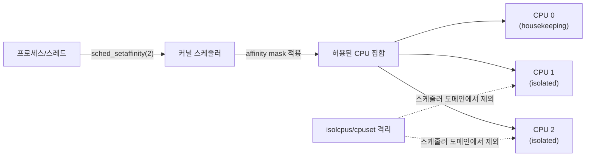

**CPU pinning/affinity**란 스레드나 프로세스가 실행될 수 있는 논리 CPU 집합을 커널 스케줄러에 명시적으로 제약해, 코어 간 마이그레이션이 유발하는 캐시 재적재와 지연 변동성(jitter)을 줄이는 기법이다. [이전 장](/post/os-optimization/context-switch-cost-avoidance/)에서 확인했듯 컨텍스트 스위치 자체의 비용도 문제지만, 스케줄러가 태스크를 다른 코어로 옮기는 마이그레이션은 L1/L2 캐시를 통째로 버리고 다시 채우는 추가 비용을 얹는다. affinity는 "이 스레드는 이 코어에서만 돈다"고 커널에 선언해 그 이동 자체를 없애는, 저지연 스레드 배치의 첫 번째 손잡이다. 다만 affinity 설정 한 줄이 지연 변동성을 없애 주는 것은 아니며, 격리(isolation)·인터럽트 라우팅·NUMA 배치와 맞물려야 실제 효과가 난다는 점이 이 장의 핵심이다.

## 이 장을 읽기 전에

**선행 장**: [Context Switch 비용 분석과 회피](/post/os-optimization/context-switch-cost-avoidance/)(01장)에서 컨텍스트 스위치·마이그레이션 비용의 정체를, [Syscall 비용과 최소화 기법](/post/os-optimization/syscall-cost-minimization/)(02장)에서 커널 진입 비용의 구조를 다뤘다. 이 장은 그 위에서 "어느 코어에서 돌게 할 것인가"를 다룬다.

**전제 지식**: 논리 CPU(logical CPU, 하이퍼스레딩 포함)와 코어의 구분, 리눅스 스케줄러가 부하 분산을 위해 태스크를 임의로 재배치할 수 있다는 사실만 알면 충분하다.

**이 장의 깊이**: 중급. `sched_setaffinity`/`taskset`/`pthread_setaffinity_np` 같은 API·도구 수준에서 시작해, `isolcpus`·`nohz_full`·`cpuset` 격리 파라미터와 pinning의 관계, 그리고 저지연 스레드 배치 전략까지 다룬다.

**다루지 않는 것**: NUMA 노드 간 메모리 배치와 `numactl`/`mbind`는 [다음 장](/post/os-optimization/numa-cpu-affinity-thread-placement/)(04장)의 몫이다. `SCHED_FIFO`/`SCHED_RR` 같은 실시간 스케줄링 정책 자체는 [05장](/post/os-optimization/realtime-scheduling-sched-ext-eevdf/)에서, IRQ를 특정 코어로 몰아 격리 코어를 인터럽트에서 완전히 비우는 절차는 [12장](/post/os-optimization/irq-interrupt-optimization/)에서, `cpuset` cgroup의 세부 계층 구조와 리소스 제어는 [13장](/post/os-optimization/cgroups-v2-resource-control-performance/)에서, 컨테이너 환경의 CPU limit과 격리는 [11장](/post/os-optimization/container-virtualization-performance-considerations/)에서 각각 이어받는다. 이 장은 그 챕터들이 공유하는 "affinity mask와 격리 파라미터가 무엇을 제약하는가"라는 공통 기반을 정리한다.

## 당신의 수준에 맞는 경로

| 수준 | 읽을 부분 | 핵심 목표 |
|------|---------|---------|
| **초보자** | "CPU affinity의 등장 배경" ~ "affinity API와 도구" | affinity mask가 스케줄러의 어떤 자유도를 제약하는지 이해 |
| **중급자** | "isolcpus·nohz_full·cpuset의 관계" ~ "저지연 스레드 배치 전략" | 격리와 pinning을 결합해 지연 변동성을 낮추는 절차 습득 |
| **전문가** | "판단 기준" ~ "비판적 시각" | pinning이 실패하는 상황과 대체·보완 수단을 판단 |

---

## CPU affinity의 등장 배경 (역사·배경)

CPU affinity를 커널에 요청하는 `sched_setaffinity`/`sched_getaffinity` 시스템 콜은 SMP(대칭형 다중 프로세싱) 머신이 흔해지던 시기인 **리눅스 커널 2.5.8**(2002년)에 도입되었고, glibc는 버전 2.3부터 이를 감싸는 래퍼를 제공했다. 이 도입 배경 자체가 목적을 보여준다 — 여러 코어에 걸쳐 캐시를 데우고 식히며 태스크가 떠도는 비용을 사용자 공간에서 직접 통제하려는 요구였다. 이 시스템 콜 위에 만들어진 `taskset` 명령은 util-linux 패키지에 포함되어 있으며, Robert Love가 작성해 `sched_setaffinity`/`sched_getaffinity`를 그대로 감싼 CLI 도구다. 이후 pthreads 라이브러리는 스레드 단위로 직접 affinity를 거는 `pthread_setaffinity_np`(POSIX 비표준 확장, `_np`는 "non-portable")를 추가해, 프로세스 전체가 아니라 개별 스레드마다 다른 코어를 지정할 수 있게 했다.



## affinity mask와 API·도구

**CPU affinity mask**는 프로세스나 스레드가 스케줄될 수 있는 논리 CPU의 비트마스크다. 최하위 비트가 CPU 0, 그다음 비트가 CPU 1을 가리키는 식이며, 마스크에 없는 CPU로는 스케줄러가 절대 태스크를 옮기지 않는다. 이 마스크는 세 가지 층위에서 다룰 수 있다 — 셸에서 즉시 적용하는 `taskset`, 프로세스 단위로 시스템 콜을 직접 호출하는 `sched_setaffinity`, 그리고 멀티스레드 프로그램에서 스레드별로 다르게 지정하는 `pthread_setaffinity_np`다. 세 방법 모두 결국 같은 커널 자료구조(태스크의 `cpus_allowed` 마스크)를 수정하므로, 어떤 계층에서 설정하든 스케줄러가 보는 제약은 동일하다.

[`taskset(1)`](https://man7.org/linux/man-pages/man1/taskset.1.html)은 새 프로세스를 특정 코어에 고정해 실행하거나, 실행 중인 프로세스의 마스크를 조회·변경한다. 자신이 소유한 프로세스는 별도 권한 없이 조정할 수 있지만, 다른 사용자 소유 프로세스의 affinity를 바꾸려면 `CAP_SYS_NICE` capability가 필요하다.

```bash
# 새 프로세스를 CPU 2, 3에만 고정해 실행
taskset -c 2,3 ./trading_engine

# 실행 중인 PID 1234의 현재 affinity 조회 (CPU 리스트 형식)
taskset -pc 1234

# 실행 중인 PID 1234를 CPU 4로 재배치
taskset -pc 4 1234
```

시스템 콜 수준에서는 `cpu_set_t`와 `CPU_ZERO`/`CPU_SET` 매크로로 마스크를 구성한 뒤 [`sched_setaffinity(2)`](https://man7.org/linux/man-pages/man2/sched_setaffinity.2.html)에 넘긴다. 아래는 현재 프로세스를 CPU 2에 고정하는 예제로, 그대로 컴파일할 수 있다(`g++ -std=c++17 pin.cpp`).

```cpp
#include <sched.h>
#include <unistd.h>
#include <cstdio>
#include <cstring>

bool pin_to_cpu(int cpu_id) {
  cpu_set_t mask;
  CPU_ZERO(&mask);
  CPU_SET(cpu_id, &mask);
  // pid 0은 "호출한 프로세스 자신"을 의미한다.
  if (sched_setaffinity(0, sizeof(mask), &mask) != 0) {
    std::perror("sched_setaffinity");
    return false;
  }
  return true;
}

int main() {
  if (!pin_to_cpu(2)) {
    return 1;
  }
  std::printf("CPU 2에 고정됨\n");
  // 이후 이 프로세스의 모든 스레드는 기본적으로 CPU 2만 사용 가능
  return 0;
}
```

`sched_setaffinity`는 성공 시 0, 실패 시 -1과 `errno`를 반환한다. 흔한 에러는 마스크가 잘못됐거나 `cpusetsize`가 너무 작은 `EINVAL`, 다른 사용자 소유 태스크에 권한 없이 접근한 `EPERM`, 대상 스레드를 찾지 못한 `ESRCH`다. 멀티스레드 프로그램에서 스레드마다 다른 코어를 배정하려면 `pthread_setaffinity_np(pthread_t thread, size_t cpusetsize, const cpu_set_t *cpuset)`을 쓴다 — 이 함수는 내부적으로 `sched_setaffinity` 위에 구현된 스레드 레벨 래퍼이므로, 대상이 pid가 아니라 `pthread_t`라는 점만 다르다.

```cpp
#include <pthread.h>
#include <sched.h>
#include <vector>
#include <cstdio>

void* worker(void* arg) {
  int cpu_id = *static_cast<int*>(arg);
  std::printf("worker on CPU %d\n", cpu_id);
  return nullptr;
}

int main() {
  const int n = 4;
  std::vector<pthread_t> threads(n);
  std::vector<int> cpu_ids(n);

  for (int i = 0; i < n; ++i) {
    cpu_ids[i] = i + 1;  // CPU 1~4에 하나씩 배정
    pthread_create(&threads[i], nullptr, worker, &cpu_ids[i]);

    cpu_set_t mask;
    CPU_ZERO(&mask);
    CPU_SET(cpu_ids[i], &mask);
    pthread_setaffinity_np(threads[i], sizeof(mask), &mask);
  }
  for (auto& t : threads) pthread_join(t, nullptr);
  return 0;
}
```

affinity 설정 순서(스레드 생성 전/후)와 실제 실행 코어가 즉시 일치하지 않을 수 있다는 점에 주의한다. `pthread_setaffinity_np`는 스레드가 이미 실행 중이어도 다음 스케줄링 시점부터 마스크를 적용하므로, 생성 직후 바로 값을 검증하려면 `pthread_getaffinity_np`나 `/proc/[tid]/status`의 `Cpus_allowed` 필드로 확인하는 편이 안전하다.

## isolcpus·nohz_full·cpuset의 관계

affinity mask는 "이 태스크가 어디로 갈 수 있는가"만 정한다. 그런데 마스크에 넣지 않은 다른 프로세스들이 여전히 그 코어에 스케줄될 수 있다면, 저지연 스레드는 다른 태스크와 코어를 공유하며 예상 밖의 지연을 겪는다. 이 문제를 막으려면 **격리(isolation)** 파라미터로 코어 자체를 일반 스케줄러의 부하 분산 대상에서 빼야 하고, 여기서 `isolcpus`·`cpuset`·`nohz_full`이 등장한다.

**`isolcpus`**는 부팅 커맨드라인 파라미터로, 지정한 CPU를 커널 스케줄러 도메인에서 제외해 일반 태스크가 자동 배정되지 않도록 한다. 문제는 이 값이 부팅 시 고정되어 런타임에 바꾸려면 재부팅이 필요하다는 점이다. 리눅스 커널 공식 문서([CPU Isolation](https://docs.kernel.org/admin-guide/cpu-isolation.html))는 이 때문에 `isolcpus`를 "덜 유연한 대안"으로 규정하고, 런타임에 파티션을 재구성할 수 있는 `cpuset` cgroup의 **isolated partition** 기능을 더 유연한 대안으로 제시한다. `cpuset`의 세부 사용법(계층 구조, 파티션 타입)은 [13장](/post/os-optimization/cgroups-v2-resource-control-performance/)에서 다루므로 여기서는 "affinity로 pinning한 코어가 다른 태스크로부터도 보호되려면 이 격리 계층이 함께 필요하다"는 관계만 짚는다.

**`nohz_full`**은 지정한 CPU에서 주기적인 타이머 틱(scheduling-clock interrupt)을 멈춘다. 리눅스 커널 문서는 이를 "가장 침습적인 격리 기능"으로 표현하는데, 틱을 완전히 세우려면 해당 CPU가 유휴 상태일 때뿐 아니라 사용자 공간에서 단일 태스크를 실행하는 동안에도 틱이 필요 없어야 하기 때문이다. 이 대가로 **housekeeping CPU**(격리되지 않은 코어)가 격리된 CPU를 대신해 1Hz 잔여 스케줄러 틱과 RCU 콜백 처리를 떠맡는다. `rcu_nocbs`는 `nohz_full`이 지정되면 자동으로 함께 적용되어, RCU 콜백을 격리 코어가 아닌 비격리 코어의 언바운드 커널 스레드에서 처리하게 한다. 세 파라미터를 함께 쓰는 이유는 하나만으로는 격리가 완결되지 않기 때문이다 — `isolcpus`만 걸면 스케줄러 배정은 막히지만 틱과 RCU 콜백은 여전히 그 코어에서 돈다.

```text
# 부팅 커맨드라인 예시 (GRUB 설정 등에 추가): CPU 2, 3을 격리
isolcpus=2,3 nohz_full=2,3 rcu_nocbs=2,3

# 격리 결과 확인 (실행 중 커널에서)
$ cat /sys/devices/system/cpu/isolated
2-3
$ cat /proc/cmdline | grep -o 'nohz_full=[0-9,]*'
nohz_full=2,3
```

housekeeping CPU와 isolated CPU를 나누는 기본 원칙은 명확하다. **housekeeping CPU**는 인터럽트·타이머 틱·RCU 콜백처럼 커널이 서비스를 유지하기 위한 잡무를 몰아 받는 코어이므로 지연 변동을 어느 정도 허용할 수 있어야 하고, 시스템에는 최소 한 개 이상이 필요하다. **isolated CPU**는 저지연 스레드 전용으로 비워 두는 코어이며, 리눅스 커널 문서는 격리된 CPU가 완전한 이점을 보려면 사용자 공간에서 단일 태스크만 실행해야 한다고 명시한다 — 같은 격리 코어에 두 개 이상의 태스크를 올리면 선점(preemption)을 관리할 틱이 없어 오히려 예측 불가능해질 수 있다.

## 저지연 스레드 배치 전략

실전 배치는 보통 다음 절차를 따른다. 먼저 물리 코어 목록에서 hyperthread 형제 관계와 NUMA 노드 소속을 확인한다(이 두 정보는 `/sys/devices/system/cpu/cpu*/topology/`에서 얻을 수 있고, NUMA 노드별 배치는 [04장](/post/os-optimization/numa-cpu-affinity-thread-placement/)에서 이어 다룬다). 그다음 인터럽트가 많이 몰리는 NIC 큐·디스크 큐의 IRQ를 housekeeping 코어로 몰아 격리 코어에서 완전히 빼내는데, 이 절차는 [12장](/post/os-optimization/irq-interrupt-optimization/)의 범위다. 마지막으로 저지연 워커 스레드를 격리 코어 하나에 하나씩 배정하고, 로깅·모니터링·GC 같은 부수 작업은 housekeeping 코어에만 두어 격리 코어를 절대 침범하지 않게 한다.

이 배치에서 코어 수보다 스레드 수가 많아지는 오버서브스크립션(oversubscription)은 반드시 피한다. 격리 코어 하나에 태스크가 둘 이상 배정되면 그 코어는 사실상 격리 효과를 잃고, 두 태스크가 번갈아 실행되며 컨텍스트 스위치 비용이 다시 발생한다. 또한 pinning만으로는 코어의 클럭이 항상 최고 부스트 상태를 유지한다고 보장하지 않는다 — 전력 관리 거버너나 터보 부스트 정책이 별도로 작동하므로, 진짜로 예측 가능한 클럭이 필요하면 CPU 거버너 설정과 C-state 진입 억제를 함께 검토해야 한다.

## 흔한 오개념

- **"affinity만 걸면 지연 변동이 사라진다"**: 마스크는 "다른 곳으로 못 간다"만 보장하지, "다른 태스크가 못 들어온다"는 보장하지 않는다. 같은 코어에 housekeeping 작업이나 다른 프로세스가 여전히 스케줄될 수 있으므로, 진짜 배타적 사용에는 `isolcpus`/`cpuset` 격리가 함께 필요하다.
- **"isolcpus 하나면 완전한 격리다"**: 리눅스 커널 문서가 지적하듯 `isolcpus`는 스케줄러 도메인 배정만 막을 뿐, 타이머 틱과 RCU 콜백 처리는 `nohz_full`·`rcu_nocbs`가 따로 맡아야 한다. 셋 중 하나만 걸고 "격리됐다"고 판단하면 잔여 틱으로 인한 지연 스파이크를 놓치기 쉽다.
- **"pinning은 무조건 빠르다"**: 코어가 부족한 환경에서 여러 저지연 스레드를 한 코어에 몰아 pinning하면 오히려 컨텍스트 스위치가 늘어난다. 또한 격리 코어에 배정된 스레드가 블로킹 syscall이나 락 대기로 자주 잠들면, pinning의 이점(캐시 온기 유지)보다 유휴 코어 낭비가 더 클 수 있다.

## 판단 기준

| 상황 | 권장 | 비권장 |
|------|------|--------|
| 저지연 워커를 특정 코어에 못박기 | `sched_setaffinity`/`pthread_setaffinity_np`로 코어별 배정 + 격리 코어 사용 | affinity 없이 스케줄러 자동 배치에 맡김 |
| 셸/운영 스크립트에서 즉시 적용 | `taskset -c`로 실행 또는 재배치 | 매번 커스텀 바이너리 작성 |
| 다른 태스크의 침범을 원천 차단 | `isolcpus`+`nohz_full`+`rcu_nocbs` (또는 cpuset isolated partition) | affinity mask만 설정 |
| 실행 중 격리 코어 구성을 자주 바꿈 | cpuset isolated partition (재부팅 불필요, [13장](/post/os-optimization/cgroups-v2-resource-control-performance/)) | 매번 재부팅이 필요한 `isolcpus` |
| 코어 수가 스레드 수보다 적음 | 스레드 수를 줄이거나 배치 재설계 | 오버서브스크립션한 채 pinning 강행 |
| 다른 사용자 소유 프로세스 affinity 변경 | `CAP_SYS_NICE` 확보 후 변경 | 권한 없이 강제 시도(EPERM) |

## 비판적 시각: 한계와 트레이드오프

pinning과 격리는 만능이 아니다. **isolcpus의 정적 특성**은 워크로드가 바뀔 때마다 재부팅을 요구하므로 운영 유연성을 떨어뜨리고, 이 때문에 최신 커널 커뮤니티는 cpuset 기반 isolated partition 쪽으로 무게를 옮기는 중이다(관련 논의는 2025년에도 이어지고 있으며, HK_TYPE_DOMAIN처럼 `isolcpus`와 cpuset 격리를 한 표현으로 통합하려는 커널 패치가 진행되고 있다). **nohz_full의 침습성**은 트레이드오프를 동반한다 — 격리 코어의 틱을 없애는 대신 housekeeping 코어가 그 잔여 부담(1Hz 틱, RCU 콜백)을 떠안으므로, housekeeping 코어 자체가 부족하거나 과부하 상태면 오히려 전체 시스템의 지연 분포가 나빠질 수 있다. **컨테이너·가상화 환경**에서는 호스트가 노출하는 논리 CPU가 실제 물리 코어와 다르게 매핑될 수 있어 affinity의 의미가 흐려지며, 이 문제는 [11장](/post/os-optimization/container-virtualization-performance-considerations/)에서 더 다룬다. 마지막으로 pinning은 **단일 머신의 스케줄링 계층**에서만 작동하는 도구이므로, NUMA 원격 접근 지연이나 인터럽트 라우팅 문제까지 pinning 하나로 해결하려 하면 잘못된 진단으로 이어지기 쉽다 — 항상 04장(NUMA)·12장(IRQ)과 함께 판단해야 한다.

## 마무리

이 장을 읽은 뒤 다음을 스스로 점검할 수 있어야 한다.

- [ ] CPU affinity mask가 "허용된 CPU 집합"만 제약하고 "배타적 사용"은 보장하지 않는다는 점을 설명할 수 있다.
- [ ] `taskset`, `sched_setaffinity`, `pthread_setaffinity_np`의 계층 차이(CLI/프로세스/스레드)를 구분할 수 있다.
- [ ] `isolcpus`·`nohz_full`·`rcu_nocbs`가 각각 무엇을 막고, 왜 셋을 함께 써야 하는지 설명할 수 있다.
- [ ] housekeeping CPU와 isolated CPU의 역할 차이를 말할 수 있다.
- [ ] 오버서브스크립션이 pinning의 이점을 어떻게 상쇄하는지 사례로 설명할 수 있다.
- [ ] pinning만으로 해결할 수 없는 문제(NUMA 원격 접근, IRQ 라우팅, 컨테이너 CPU 매핑)를 구분해 다음 장으로 넘길 수 있다.

**다음 장에서는** 여러 NUMA 노드를 가진 머신에서 CPU affinity와 메모리 배치를 함께 고려하는 방법을 다룬다. 코어를 잘 고정해도 그 코어가 접근하는 메모리가 다른 NUMA 노드에 있으면 원격 접근 지연이 새로운 병목이 되므로, 이 장의 pinning 전략 위에 메모리 지역성 판단 기준을 쌓는다.

→ [NUMA CPU Affinity·스레드 배치](/post/os-optimization/numa-cpu-affinity-thread-placement/)
