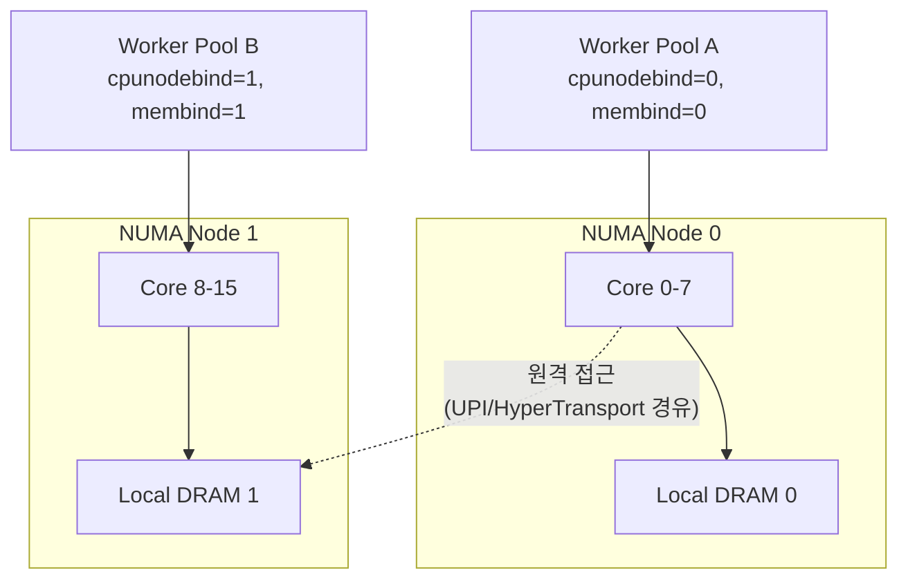

**NUMA CPU Affinity·스레드 배치**란 스레드를 실행할 코어를 고를 때 그 코어가 어느 NUMA(Non-Uniform Memory Access) 노드에 속하는지, 그리고 그 스레드가 접근할 메모리가 물리적으로 어느 노드에 있는지를 함께 결정하는 문제를 말합니다. [이전 장: CPU Pinning/Affinity 전략](/post/os-optimization/cpu-pinning-affinity-strategy/)에서 스레드를 특정 코어에 고정하면 캐시 지역성과 스케줄러 지터를 줄일 수 있다는 점을 다뤘다면, 이 장은 한 걸음 더 들어가 "어느 코어에" 고정할지를 NUMA 토폴로지 관점에서 결정하는 문제를 다룹니다. 멀티소켓 서버는 물론이고, 요즘은 단일 소켓 안에서도 다이(die)가 여러 개로 쪼개지면서 코어와 메모리 컨트롤러 사이의 거리가 균일하지 않은 경우가 흔해졌고, 이 비균일성을 무시하면 CPU affinity를 아무리 잘 잡아도 메모리 접근 지연이 꼬리 분포를 지배하게 됩니다.

## 이 장을 읽기 전에

**전제 지식**: [CPU Pinning/Affinity 전략](/post/os-optimization/cpu-pinning-affinity-strategy/)에서 다룬 `sched_setaffinity`/`pthread_setaffinity_np`와 `cpu_set_t`의 기본 사용법을 이미 안다고 가정합니다. [Process vs Thread 아키텍처 선택](/post/os-optimization/process-vs-thread-architecture-choice/)에서 다룬 프로세스·스레드 모델에 대한 감각도 도움이 됩니다.

**이 장의 깊이**: 이 장은 **심화** 난이도로, NUMA 토폴로지를 읽는 법, `numactl`과 `libnuma`로 노드 단위 CPU·메모리 정책을 지정하는 실무, sub-NUMA clustering(SNC)·NPS(Nodes Per Socket)처럼 단일 소켓 내부에서도 NUMA 도메인이 여러 개로 쪼개지는 최신 하드웨어에서의 배치 전략, 그리고 커널의 자동 NUMA 밸런싱과 수동 배치가 충돌하는 지점을 다룹니다.

**다루지 않는 것**: 메모리 할당자 내부의 first-touch 정책, `numa_alloc_onnode` 세부 튜닝, 페이지 마이그레이션 비용의 정량 분석은 [Tr.04: NUMA 메모리 할당·지역성](/post/memory-optimization/numa-memory-allocation-locality/)으로 위임합니다. 컨테이너·Kubernetes 환경에서 `cpuset.mems`로 NUMA 노드를 제한하는 문제는 [cgroups v2 리소스 제어](/post/os-optimization/cgroups-v2-resource-control-performance/)와 [컨테이너/가상화 성능 고려사항](/post/os-optimization/container-virtualization-performance-considerations/)으로, huge page의 노드별 할당은 [Huge TLB Pages 활용](/post/os-optimization/huge-tlb-pages-utilization/)으로 위임합니다.

## 당신의 수준에 맞는 경로

| 수준 | 읽을 부분 | 핵심 목표 |
|------|---------|---------|
| **초보자** | "NUMA의 등장과 발전" ~ "numactl로 노드 단위 정책 지정" | NUMA 노드·거리 개념과 numactl로 정책을 지정하는 법 이해 |
| **중급자** | "libnuma로 스레드 배치 코드 작성" ~ "자동 NUMA 밸런싱과의 상호작용" | 배치 코드를 작성하고 자동 밸런싱과 충돌하지 않게 조정 |
| **전문가** | "판단 기준" ~ "비판적 시각" | sub-NUMA clustering 환경에서 배치 전략을 선택하고 한계를 판단 |

---

## NUMA의 등장과 발전 (역사·배경)

**NUMA**는 코어 수가 늘어나면서 모든 CPU가 하나의 메모리 버스를 공유하는 SMP(대칭형 멀티프로세싱) 구조가 대역폭 병목에 부딪히자 등장한 설계입니다. 각 CPU(또는 CPU 그룹)에 로컬 메모리 컨트롤러를 붙이고, 다른 CPU의 메모리에 접근할 때는 상호 연결망(interconnect)을 거치도록 해 로컬 접근은 빠르고 원격 접근은 느린 비대칭 구조를 감수하는 대신 전체 대역폭을 확장하는 방식입니다. 캐시 일관성을 유지하는 ccNUMA(cache-coherent NUMA)는 1996년 SGI Origin 2000 같은 대형 서버에서 먼저 상용화되었고, x86 서버 시장에는 2003년 AMD Opteron이 다이 내부에 메모리 컨트롤러를 통합하고 HyperTransport로 소켓 간을 연결하면서 본격적으로 들어왔습니다. 인텔은 2008~2010년 Nehalem 세대부터 QPI(QuickPath Interconnect)로, 이후 UPI(Ultra Path Interconnect)로 대응했습니다. 커널이 노드 간 상대적 접근 비용을 아는 것은 ACPI 2.0(2000년)에서 정의된 **SLIT(System Locality Information Table)** 덕분으로, 펌웨어가 이 테이블에 노드 간 거리를 채워 넣으면 커널과 `numactl`이 이를 그대로 읽어 표시합니다.

최근 흐름은 "멀티소켓이라야 NUMA"라는 통념을 깨고 있습니다. 칩렛(chiplet) 설계가 보편화되면서 **단일 소켓 내부에서도 여러 NUMA 도메인**이 나타납니다. AMD EPYC는 NPS(Nodes Per Socket) 설정으로 하나의 소켓을 NPS1(단일 노드)부터 NPS4(4분할)까지 나눌 수 있고, 세대별로 지원하는 NPS 값이 다릅니다. 인텔은 Sub-NUMA Clustering(SNC)이라는 이름으로 같은 일을 하며, Xeon 6 세대에서는 SNC2·SNC3 옵션을 제공합니다. 이런 분할은 같은 다이의 코어·L3·메모리 컨트롤러 사이의 지역성을 높여 로컬 접근 지연을 줄이는 대신, 애플리케이션이 신경 써야 할 NUMA 노드 수를 늘립니다. 정확한 지연 배율은 세대·BIOS 설정·워크로드에 따라 달라지므로, 도입 전 대상 하드웨어에서 직접 측정하는 것을 권장합니다.

## NUMA 토폴로지 파악: 노드, 코어, 거리

배치를 결정하기 전에 먼저 시스템이 실제로 몇 개의 NUMA 노드로 나뉘어 있고, 각 노드에 어떤 코어와 얼마의 메모리가 붙어 있는지 확인해야 합니다. `numactl --hardware`(또는 `-H`)는 이 정보를 노드별 CPU 목록·메모리 용량과 함께 **노드 거리 행렬**로 보여줍니다.

```text
available: 2 nodes (0-1)
node 0 cpus: 0 1 2 3 4 5 6 7
node 0 size: 64220 MB
node 0 free: 58012 MB
node 1 cpus: 8 9 10 11 12 13 14 15
node 1 size: 64506 MB
node 1 free: 61230 MB
node distances:
node   0   1
  0:  10  21
  1:  21  10
```

거리 행렬의 대각선(노드가 자기 자신에 대한 거리)은 관례적으로 10으로 정규화되어 있고, 나머지 값은 그에 대한 상대 비율입니다. 위 예에서 노드 0이 노드 1의 메모리에 접근하는 상대 비용은 로컬 접근의 2.1배(21/10)라는 뜻이며, 소켓이 3개 이상이거나 sub-NUMA clustering이 켜진 시스템에서는 행렬이 더 커지고 값도 더 세분됩니다. 이 숫자는 SLIT 테이블에서 나온 **상대적** 비율일 뿐 실측 나노초 지연이 아니므로, 절대 수치가 필요하면 Intel MLC 같은 도구나 직접 만든 포인터 체이싱 벤치마크로 실측해야 합니다. `lscpu -e`나 `/sys/devices/system/node/node*/cpulist`로도 같은 정보를 다른 형태로 볼 수 있습니다.

## numactl로 노드 단위 정책 지정

`numactl`은 프로세스를 새로 실행할 때 CPU 노드와 메모리 정책을 함께 지정하는 명령행 도구입니다. **`--cpunodebind=nodes`**(`-N`)는 지정한 노드에 속한 CPU에서만 실행되도록 강제하고, **`--membind=nodes`**(`-m`)는 지정한 노드에서만 메모리를 할당하도록 강제하며 해당 노드에 여유 메모리가 없으면 할당이 실패합니다. **`--preferred=node`**(`-p`)는 가능하면 그 노드에서 할당하되 실패 시 다른 노드로 넘어가는 유연한 버전이고, **`--interleave=nodes`**(`-i`)는 여러 노드에 라운드로빈으로 페이지를 분산합니다. 더 세밀하게 특정 논리 CPU 번호를 직접 지정하려면 **`--physcpubind=cpus`**(`-C`)를 씁니다.

```bash
# 노드 0의 CPU에서만 실행하고, 메모리도 노드 0에서만 할당(부족하면 실패)
numactl --cpunodebind=0 --membind=0 ./worker

# CPU는 노드 0에 고정하되, 메모리는 노드 0과 1에 걸쳐 할당 허용
numactl --cpunodebind=0 --membind=0,1 ./worker

# 대용량 읽기 전용 테이블을 여러 노드 대역폭으로 나눠 읽고 싶을 때
numactl --interleave=all ./readonly_scan
```

`--cpunodebind`와 `--membind`를 같은 노드로 함께 지정하는 조합이 저지연 워크로드의 기본형입니다. CPU만 고정하고 메모리 정책을 지정하지 않으면 리눅스의 기본 정책인 first-touch(처음 그 페이지에 쓰기가 일어난 스레드의 노드에 물리 페이지를 배치)를 따르는데, 초기화를 담당한 스레드와 실제로 그 데이터를 핫패스에서 쓰는 스레드가 다른 노드에 있으면 조용히 원격 접근이 굳어집니다. first-touch의 세부 동작과 이를 고려한 할당자 설계는 [Tr.04: NUMA 메모리 할당·지역성](/post/memory-optimization/numa-memory-allocation-locality/)에서 다룹니다.

## libnuma로 프로그램 안에서 배치하기

명령행 대신 프로그램 내부에서 스레드별로 다른 노드를 배정해야 할 때는 `libnuma`를 사용합니다. `numa_available()`로 NUMA 지원 여부를 확인하고, `numa_node_of_cpu(cpu)`로 특정 논리 CPU가 속한 노드를 조회하며, `numa_run_on_node(node)`로 호출 스레드를 그 노드의 CPU 집합에 고정할 수 있습니다. 메모리 쪽은 `numa_alloc_onnode(size, node)`로 특정 노드에서 직접 할당받거나, `numa_alloc_local(size)`로 "현재 실행 중인 노드"에서 할당받을 수 있습니다.

다음은 스레드 풀을 만들 때 흔히 발생하는 버그를 재현한 코드입니다. 메인 스레드가 버퍼를 미리 `malloc`으로 준비해 두고, 워커 스레드는 나중에 특정 코어 목록에 고정되는 구조입니다.

```c
#include <numa.h>
#include <pthread.h>
#include <stdlib.h>

struct worker_ctx {
  double *buf;
  size_t n;
  int cpu;
};

static void *worker_broken(void *arg) {
  struct worker_ctx *ctx = (struct worker_ctx *)arg;
  numa_run_on_node(numa_node_of_cpu(ctx->cpu));  // 실행 노드만 뒤늦게 고정
  double sum = 0;
  for (size_t i = 0; i < ctx->n; i++) sum += ctx->buf[i];  // buf는 이미 다른 노드에 배치됨
  (void)sum;
  return NULL;
}

int main(void) {
  struct worker_ctx ctx = {.buf = malloc(64 * 1024 * 1024), .n = 8 * 1024 * 1024, .cpu = 8};
  for (size_t i = 0; i < ctx.n; i++) ctx.buf[i] = 1.0;  // main 스레드(노드 0)가 first-touch
  pthread_t t;
  pthread_create(&t, NULL, worker_broken, &ctx);
  pthread_join(t, NULL);
  return 0;
}
```

**원인**: `malloc` 뒤에 이어지는 초기화 루프(`for` 문으로 `1.0`을 채우는 부분)는 메인 스레드가 실행 중인 노드(대개 노드 0)에서 first-touch로 물리 페이지를 배치합니다. 워커 스레드는 CPU 8번(노드 1)에 고정되지만 데이터는 이미 노드 0에 굳어 있으므로, 이후 모든 순회가 원격 접근입니다. `numa_run_on_node`를 워커 안에서 호출한 것만으로는 이 문제를 고치지 못합니다 — 실행 위치와 데이터 위치가 애초에 다른 시점에 독립적으로 결정됐기 때문입니다.

```c
static void *worker_fixed(void *arg) {
  struct worker_ctx *ctx = (struct worker_ctx *)arg;
  int node = numa_node_of_cpu(ctx->cpu);
  numa_run_on_node(node);                       // 1. 먼저 실행 노드를 고정
  ctx->buf = numa_alloc_onnode(ctx->n * sizeof(double), node);  // 2. 그 노드에서 직접 할당
  for (size_t i = 0; i < ctx->n; i++) ctx->buf[i] = 1.0;        // 3. 같은 스레드가 first-touch
  double sum = 0;
  for (size_t i = 0; i < ctx->n; i++) sum += ctx->buf[i];
  (void)sum;
  numa_free(ctx->buf, ctx->n * sizeof(double));
  return NULL;
}
```

고친 버전은 "실행 노드 고정 → 그 노드에서 할당 → 같은 스레드가 초기화"의 순서를 지켜, 실행 위치와 데이터 위치를 일치시킵니다. 이렇게 노드별로 독립된 버퍼를 두는 패턴은 뒤에서 다룰 "노드별 샤딩" 아키텍처의 기본 단위이기도 합니다.

**검증**: 코드를 고쳤다고 믿는 것과 실제로 원격 접근이 사라졌는지 확인하는 것은 다릅니다. `numastat -p <pid>`는 프로세스별 `numa_hit`(로컬 정책대로 할당된 횟수)과 `numa_miss`/`other_node`(의도한 노드가 아닌 곳에서 할당된 횟수)를 보여주므로 배치가 실제로 의도대로 됐는지 사후 확인할 수 있고, `/proc/<pid>/numa_maps`는 가상 메모리 영역별로 어느 노드에 몇 페이지가 실제로 올라갔는지까지 보여줍니다.

```text
$ numastat -p 12345
Per-node process memory usage (in MBs)
                  Node 0  Node 1  Total
Numa_Hit            2.31   64.05  66.36
Numa_Miss            0.00    0.00   0.00
Numa_Foreign         0.00    0.00   0.00
```

## 로컬 대 원격 접근 지연을 직접 재보기

행렬에 적힌 거리 값이나 백서의 배율을 그대로 믿기보다, 대상 하드웨어에서 직접 재보는 것이 안전합니다. 아래는 포인터 체이싱으로 캐시 효과를 배제하고 순수 메모리 접근 지연을 비교하는 벤치마크 뼈대입니다. `numa_alloc_onnode`로 같은 크기의 버퍼를 로컬 노드와 원격 노드에 각각 만들고, 같은 스레드가 두 버퍼를 순서대로 순회하며 걸린 시간을 비교합니다(x86-64, GCC 13, `gcc -O2 numa_bench.c -lnuma -o numa_bench` 기준 예시 골격이며, 실제 배율은 하드웨어·NPS/SNC 설정에 따라 달라집니다).

```c
#include <numa.h>
#include <stdint.h>
#include <stdio.h>
#include <time.h>

static double now_ns(void) {
  struct timespec ts;
  clock_gettime(CLOCK_MONOTONIC, &ts);  // 정밀 타이밍 원리는 06장에서 다룸
  return (double)ts.tv_sec * 1e9 + ts.tv_nsec;
}

static double chase(uint64_t *buf, size_t n, size_t iters) {
  for (size_t i = 0; i + 1 < n; i++) buf[i] = i + 1;  // 무작위 접근을 흉내 내는 순환 링크
  buf[n - 1] = 0;
  double t0 = now_ns();
  uint64_t idx = 0;
  for (size_t k = 0; k < iters; k++) idx = buf[idx];
  double t1 = now_ns();
  (void)idx;
  return (t1 - t0) / (double)iters;
}

int main(void) {
  size_t n = 4 * 1024 * 1024;  // TLB/캐시보다 훨씬 큰 영역
  int local = numa_node_of_cpu(sched_getcpu());
  int remote = (local == 0) ? 1 : 0;
  uint64_t *local_buf = numa_alloc_onnode(n * sizeof(uint64_t), local);
  uint64_t *remote_buf = numa_alloc_onnode(n * sizeof(uint64_t), remote);
  printf("local:  %.2f ns/access\n", chase(local_buf, n, 10 * 1000 * 1000));
  printf("remote: %.2f ns/access\n", chase(remote_buf, n, 10 * 1000 * 1000));
  numa_free(local_buf, n * sizeof(uint64_t));
  numa_free(remote_buf, n * sizeof(uint64_t));
  return 0;
}
```

이 골격은 워밍업·반복 횟수·노드 자동 판별 같은 실무적 디테일을 단순화했으므로, 실제 회귀 테스트에는 반복 실행과 분산(꼬리 지연 포함) 보고를 추가해야 합니다. 정밀한 타이밍 측정 자체의 함정(캐시 워밍업, `rdtsc` 대 `clock_gettime` 선택)은 [정밀 시간 측정](/post/os-optimization/precise-time-measurement-rdtsc-clock-gettime/)에서 다룹니다.

## 스레드 배치 패턴: 노드별 샤딩

지연에 민감한 서버에서 가장 흔히 쓰는 패턴은 **노드별로 완전히 독립된 워커 풀**을 두는 것입니다. 각 노드마다 워커 스레드 그룹을 만들고, 그 그룹이 처리할 데이터도 같은 노드에 할당해, 스레드 사이의 작업 훔치기(work-stealing)나 공유 큐를 노드 경계 너머로 확장하지 않습니다. 노드 간 통신이 꼭 필요하면(예: 로드 밸런싱, 집계) 개별 요청 단위가 아니라 배치 단위로 묶어 원격 접근 횟수 자체를 줄이는 것이 일반적입니다. 네트워크 카드가 특정 PCIe 슬롯에 물려 있다면 그 카드가 어느 노드에 가까운지도 `/sys/class/net/<if>/device/numa_node`로 확인해, NIC이 물린 노드에서 수신 처리 워커를 실행하는 편이 인터럽트 후 처리 경로 전체의 지역성을 지킵니다. IRQ 자체의 코어 배치는 [IRQ 최적화](/post/os-optimization/irq-interrupt-optimization/)에서 별도로 다룹니다.



## 자동 NUMA 밸런싱과 수동 배치의 상호작용

커널은 **자동 NUMA 밸런싱**(`kernel.numa_balancing` sysctl)이라는 기능으로, 주기적으로 페이지 매핑을 해제한 뒤 다음 접근에서 발생하는 폴트를 관찰해 어느 스레드가 어느 페이지를 자주 쓰는지 추정하고, 필요하면 그 페이지를 접근이 많은 노드로 옮깁니다. 이 기능은 애플리케이션이 아무런 NUMA 정책을 지정하지 않아도 어느 정도의 지역성을 스스로 찾아준다는 점에서 유용하지만, 언매핑·폴트·마이그레이션 자체에 오버헤드가 있고 그 이득이 항상 오버헤드를 상쇄한다는 보장은 없습니다. 이미 `--cpunodebind`와 `--membind`(또는 `numa_alloc_onnode`)로 배치를 명시적으로 확정한 워크로드에서는 커널이 같은 목적으로 페이지를 계속 재검사·재배치하려 드는 것이 순수 오버헤드로만 남을 수 있으므로, 이런 경우 `sysctl kernel.numa_balancing=0`으로 꺼서 스캔 비용을 제거하는 것이 일반적인 실무 관행입니다. 반대로 배치를 아직 확정하지 않은 탐색 단계이거나 스레드가 실행 중 동적으로 재배치되는 워크로드라면 기본값(켜짐)을 유지하고 `numastat`으로 효과를 관찰하는 편이 낫습니다.

## 흔한 오개념 바로잡기

<strong>"CPU affinity만 지정하면 NUMA 지역성이 저절로 보장된다"</strong>는 잘못된 생각입니다. CPU affinity는 스레드가 어디서 도는지만 정하고, 메모리가 어느 노드에 물리적으로 올라가는지는 first-touch 시점이나 명시적 메모리 정책이 별도로 결정합니다. 위 코드 예시에서 본 것처럼 실행 위치와 초기화 위치가 어긋나면 CPU affinity가 완벽해도 매 접근이 원격입니다.

<strong>"NUMA는 멀티소켓 서버에서만 신경 쓰면 된다"</strong>도 최신 하드웨어에서는 틀리기 쉽습니다. AMD의 NPS나 인텔의 SNC처럼 단일 소켓도 여러 NUMA 도메인으로 쪼개질 수 있고, 클라우드 인스턴스에서도 vCPU가 여러 노드에 걸쳐 배정되는 경우가 있습니다. 소켓이 하나뿐인 환경이라도 `numactl --hardware`로 노드 수를 먼저 확인하는 습관이 필요합니다.

<strong>"interleave가 항상 안전한 기본값이다"</strong>도 워크로드에 따라 틀립니다. `--interleave`는 여러 노드의 메모리 대역폭을 고르게 쓰고 싶은 대용량 읽기 전용 공유 데이터에는 잘 맞지만, 한 스레드가 독점적으로 자주 쓰는 뜨거운 자료구조를 여러 노드에 흩어 놓으면 오히려 그 스레드 입장에서는 접근의 절반가량이 불필요하게 원격이 됩니다. 데이터의 접근 패턴(공유 읽기 전용 vs 스레드 전용)에 따라 정책을 구분해야 합니다.

## 판단 기준

| 상황 | 권장 | 비권장 |
|------|------|--------|
| 지연 최우선, 스레드 전용 데이터 | `cpunodebind`+`membind`(또는 `numa_alloc_onnode`)로 완전 고정, 자동 밸런싱 끄기 | interleave, 자동 밸런싱 방치 |
| 대용량 읽기 전용 공유 데이터를 여러 스레드가 다른 노드에서 접근 | `interleave`/`weighted-interleave`로 대역폭 분산 | 단일 노드 `membind`로 강제해 그 노드만 과부하 |
| 배치 전략이 아직 불확실한 탐색·프로토타입 단계 | 기본 정책 유지 + 자동 NUMA 밸런싱 켜둔 채 `numastat`로 관찰 | 근거 없이 성급하게 수동 고정 |
| 컨테이너·Kubernetes 환경 | `cpuset.mems`(cgroups v2)와 오케스트레이터의 토폴로지 정책 병행 | 컨테이너 밖에서만 `numactl` 적용하고 격리 무시 |
| 단일 소켓 클라우드 VM | `numactl --hardware`로 실제 vNUMA 노드 수 먼저 확인 | "소켓이 하나니 NUMA 무관" 가정 |

## 비판적 시각: 한계와 트레이드오프

sub-NUMA clustering·NPS로 노드 수 자체가 늘어나면서, 애플리케이션이 고려해야 할 "스레드-데이터-노드" 조합이 조합적으로 늘어납니다. 모든 자료구조를 노드별로 완벽하게 샤딩하는 것은 설계·유지보수 비용이 크고, 실제로는 핫패스 자료구조 몇 개만 선별해 적용하는 것이 현실적입니다. 가상화 환경에서는 하이퍼바이저가 노출하는 vNUMA 토폴로지가 실제 물리 토폴로지와 다를 수 있고, 라이브 마이그레이션이나 오버커밋이 일어나면 `numactl --hardware`가 보여주는 값이 시점에 따라 신뢰도가 달라질 수 있습니다. 자동 NUMA 밸런싱을 끄는 것도 만능은 아닙니다 — 스레드 풀이 동적으로 재배치되거나 부하가 시간에 따라 노드 간에 옮겨 다니는 워크로드에서는 수동 고정이 오히려 유연성을 잃게 만들 수 있으므로, 정적 배치가 맞는 워크로드인지 먼저 판단해야 합니다. 또한 `numactl`/`libnuma`는 리눅스 전용 인터페이스이며, Windows에서는 `GetNumaNodeProcessorMaskEx` 등 별도 API 계열을 써야 하므로 크로스 플랫폼 코드에서는 추상화 계층이 필요합니다.

## 마무리

- [ ] `numactl --hardware`로 노드 수·CPU 목록·거리 행렬을 읽고 해석할 수 있다.
- [ ] `--cpunodebind`/`--membind`/`--interleave`/`--preferred`의 차이와 조합 방법을 설명할 수 있다.
- [ ] first-touch로 인해 CPU affinity와 실제 메모리 위치가 어긋날 수 있다는 것을 코드로 재현·수정할 수 있다.
- [ ] `numastat`/`numa_maps`로 배치가 의도대로 됐는지 검증할 수 있다.
- [ ] 자동 NUMA 밸런싱을 언제 켜두고 언제 꺼야 하는지 판단 기준을 말할 수 있다.
- [ ] sub-NUMA clustering/NPS 환경에서 노드 수가 늘어난 것이 배치 전략에 어떤 영향을 주는지 설명할 수 있다.

CPU와 메모리를 노드 단위로 맞춰 놓아도, 그 스레드를 스케줄러가 다른 코어로 옮기거나 우선순위를 낮추면 지역성은 다시 흔들립니다. 다음 장에서는 **Realtime 스케줄링**을 다룹니다. `sched_ext` 기반 BPF 스케줄러, EEVDF 전환, cache-aware scheduling처럼 스케줄러가 스레드를 어디에 얼마나 오래 둘지를 결정하는 정책을 살펴보고, 이 장에서 고정한 배치가 스케줄러 정책과 충돌하지 않도록 맞추는 방법을 정리합니다.

→ [Realtime 스케줄링](/post/os-optimization/realtime-scheduling-sched-ext-eevdf/)
