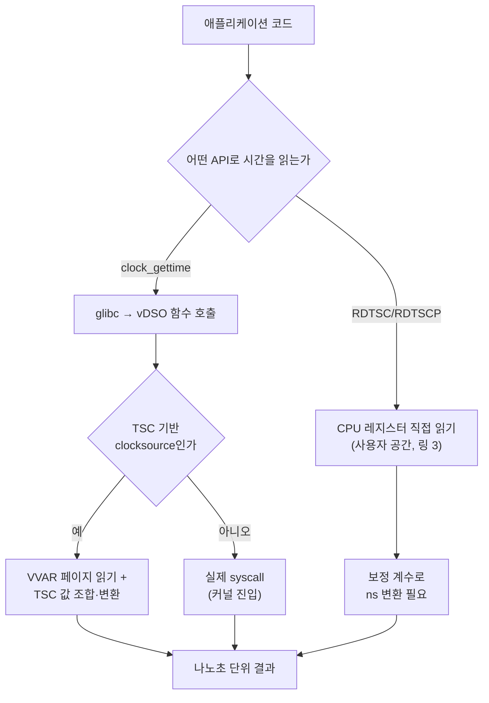

**정밀 시간 측정(precise time measurement)**이란 코드 구간의 실행 시간을 나노초, 필요하다면 CPU 사이클 단위까지 재현 가능하게 재는 기법을 말합니다. µs 단위 최적화를 다루는 작업에서는 이 측정 자체가 흔들리면 그 위에서 내리는 모든 판단이 흔들립니다. 측정 도구의 오버헤드가 측정 대상보다 크거나, 시계 소스가 코어 이동이나 주파수 변화에 영향을 받는다는 사실을 모르고 결과를 해석하면, 실제로는 존재하지 않는 회귀나 개선을 "발견"하게 됩니다. 이 장은 **RDTSC/RDTSCP**로 사이클을 직접 읽는 방법과 **clock_gettime**으로 대표되는 OS 표준 시계 API를 나란히 놓고, 어떤 상황에 어떤 도구를 쓰고 무엇을 주의해야 하는지를 정리합니다.

## 이 장을 읽기 전에

**선행 챕터**: 이 장은 [Realtime 스케줄링](/post/os-optimization/realtime-scheduling-sched-ext-eevdf/)(챕터 05)에서 다룬 "스케줄링 정책이 지연 분포를 바꾼다"는 관점을 전제로, 이번에는 그 변화를 **어떻게 정확히 잴 것인가**로 초점을 옮깁니다. CPU 클럭·사이클이라는 개념과 시스템 콜이 사용자 공간과 커널 공간을 오간다는 사실만 알면 충분하고, syscall 자체의 비용 구조는 [챕터 02: Syscall 비용과 최소화 기법](/post/os-optimization/syscall-cost-minimization/)에서 이미 다뤘으므로 여기서는 반복하지 않습니다.

**이 장의 깊이**: 중급 수준으로, RDTSC/RDTSCP의 동작 원리와 직렬화 문제, clock_gettime의 clock id별 의미와 vDSO 경로, invariant TSC와 코어 간 동기화, 그리고 이 셋을 섞어 쓸 때 생기는 함정을 다룹니다. **다루지 않는 것**: 스레드를 특정 코어에 고정하는 방법 자체는 [챕터 03: CPU Pinning/Affinity 전략](/post/os-optimization/cpu-pinning-affinity-strategy/)에, NUMA 환경에서의 스레드 배치는 [챕터 04: NUMA CPU Affinity·스레드 배치](/post/os-optimization/numa-cpu-affinity-thread-placement/)에 위임합니다. out-of-order 실행이 명령어 순서를 어떻게 재배치하는지의 마이크로아키텍처 내부 동작은 [Tr.05 CPU 파이프라인 기초](/post/cpu-optimization/cpu-pipeline-fundamentals/)를 참고하고, 퍼블릭 클라우드에서 TSC가 신뢰할 수 없어지는 상황(steal time, live migration)은 [챕터 18: 클라우드 환경 꼬리 지연](/post/os-optimization/cloud-noisy-neighbor-cpu-steal-time/)에서 별도로 다룹니다.

## 당신의 수준에 맞는 경로

| 수준 | 읽을 부분 | 핵심 목표 |
|------|---------|---------|
| **초보자** | "RDTSC의 등장과 clock_gettime의 표준화" ~ "clock_gettime과 CLOCK_MONOTONIC 계열" | 두 측정 수단이 왜 나뉘어 존재하는지, 기본 API가 무엇인지 이해 |
| **중급자** | "Invariant TSC와 TSC 동기화" ~ "흔한 오개념 교정" | 코어 간 TSC 동기화 조건과 자주 틀리는 지점을 구분 |
| **전문가** | "판단 기준" ~ "비판적 시각" | 상황별 시계 선택과 크로스 플랫폼·가상화 환경의 한계 판단 |

---

## RDTSC의 등장과 clock_gettime의 표준화 (역사·배경)

**RDTSC**(Read Time-Stamp Counter)는 Intel Pentium 세대부터 모든 x86 프로세서에 존재해 온 명령어로, 프로세서가 리셋된 이후 누적된 클럭 사이클 수를 64비트 값으로 반환합니다. 초기 TSC는 실제 코어 클럭에 그대로 연동되어 있었기 때문에, SpeedStep 같은 전력 관리 기능으로 클럭이 바뀌면 "사이클 수 = 경과 시간"이라는 전제가 깨졌습니다. Intel은 Nehalem(2008년)부터, AMD는 Family 10h(Barcelona/Phenom, 2008년경)부터 P-state·C-state와 무관하게 일정한 속도로 증가하는 **invariant TSC**를 도입해 이 문제를 해결했습니다. 같은 2008년, 측정 도중 스레드가 다른 코어로 이주했는지 원자적으로 감지할 수 있도록 **RDTSCP**가 Intel Nehalem과 AMD Barcelona에 함께 추가되었습니다. 반면 **clock_gettime**은 CPU 세대와 무관하게 OS가 제공하는 표준 API입니다. IEEE POSIX 실시간 확장에서 유래해 리눅스에서는 커널 2.6대에 정착했고, 이후 vDSO(virtual dynamic shared object) 경로가 추가되면서 대부분의 clock id에서 실제 시스템 콜 없이 값을 반환할 수 있게 되었습니다. 즉 RDTSC 계열은 "하드웨어 카운터를 직접 읽는" 접근이고, clock_gettime은 "OS가 여러 시계 소스를 추상화해 표준 단위(초·나노초)로 돌려주는" 접근이라는 점에서 출발선이 다릅니다.

## RDTSC와 RDTSCP: 사이클 단위로 시간을 읽는다는 것

RDTSC는 [**비직렬화(non-serializing) 명령어**](https://www.felixcloutier.com/x86/rdtsc)입니다. CPU는 이전 명령어들이 모두 실행 완료되기를 기다리지 않고, RDTSC 자체도 이후 명령어보다 먼저 실행된다는 보장이 없습니다. out-of-order 실행 엔진 입장에서는 RDTSC도 그저 재배치 가능한 명령어 중 하나이기 때문에, 측정 구간 앞뒤에 아무 조치도 하지 않으면 실제로 측정하려던 코드보다 먼저 혹은 나중에 카운터를 읽어버릴 수 있습니다. 이를 막으려면 RDTSC 앞에 `LFENCE`를 두어 이전 명령어의 로드가 끝난 뒤에만 읽게 하거나, [`RDTSCP`](https://www.felixcloutier.com/x86/rdtscp)를 쓰면 됩니다. RDTSCP는 완전한 직렬화 명령어는 아니지만 "이전의 모든 명령어가 실행되고 이전의 모든 로드가 전역적으로 보이게 될 때까지" 대기한 뒤에 카운터를 읽으므로, 측정 시작·종료 지점에서 순서를 지키는 용도로는 충분합니다. RDTSCP는 여기에 더해 `IA32_TSC_AUX` 레지스터 값을 함께 반환하는데, OS가 이 레지스터에 코어 또는 소켓 식별자를 넣어 두면 측정 시작과 종료 시점의 aux 값을 비교해 그 사이 스레드가 다른 코어로 이주했는지 알 수 있습니다. 코어가 바뀌었다면 그 측정값은 버리는 것이 안전한데, 코어마다 TSC 오프셋이 미세하게 다를 수 있기 때문입니다.

```cpp
#include <x86intrin.h>  // GCC/Clang: __rdtsc, __rdtscp (MSVC는 <intrin.h>)
#include <cstdint>

// RDTSCP로 사이클을 읽고, aux에 코어/소켓 식별자(IA32_TSC_AUX 하위 32비트)를 받는다.
// 두 시점의 aux가 다르면 측정 도중 코어 이주가 있었다는 뜻이므로 값을 버린다.
inline uint64_t read_tsc_serialized(uint32_t& aux) {
  return __rdtscp(&aux);
}

template <typename Fn>
uint64_t measure_cycles(Fn&& work) {
  uint32_t aux_start = 0, aux_end = 0;
  uint64_t start = read_tsc_serialized(aux_start);
  work();
  uint64_t end = read_tsc_serialized(aux_end);
  if (aux_start != aux_end) return 0;  // 코어 이주: 무효 측정 (고정은 3장 참고)
  return end - start;
}
```

이렇게 얻은 값은 "사이클 수"이지 "시간"이 아닙니다. 사이클을 나노초로 바꾸려면 TSC 주파수를 알아야 하는데, invariant TSC가 있는 CPU에서도 이 주파수는 CPUID나 모델별 MSR에서 직접 구하거나, 아래처럼 `clock_gettime`을 기준 삼아 한 번 보정(calibration)해서 얻는 경우가 흔합니다.

```cpp
#include <x86intrin.h>
#include <time.h>
#include <cstdint>

// TSC 증가 속도를 clock_gettime(CLOCK_MONOTONIC) 대비로 보정한다(GHz 단위, cycles/ns).
// invariant TSC가 없는 구형/저전력 CPU에서는 이 값이 시점마다 달라질 수 있으므로
// 프로세스 시작 시 한 번만 계산해 영구히 재사용하는 것을 기본값으로 삼지 않는다.
double calibrate_tsc_ghz(long wait_ms) {
  struct timespec t0, t1;
  clock_gettime(CLOCK_MONOTONIC, &t0);
  uint64_t c0 = __rdtsc();

  struct timespec req{0, wait_ms * 1000000L};
  nanosleep(&req, nullptr);

  clock_gettime(CLOCK_MONOTONIC, &t1);
  uint64_t c1 = __rdtsc();

  double elapsed_ns = (t1.tv_sec - t0.tv_sec) * 1e9 + (double)(t1.tv_nsec - t0.tv_nsec);
  return (double)(c1 - c0) / elapsed_ns;
}
```

보정 대기 시간이 너무 짧으면(수 ms 이하) `clock_gettime` 자체의 해상도·잡음이 보정 오차로 그대로 들어가므로, 실무에서는 수백 ms 이상 대기하거나 여러 번 측정해 중앙값을 쓰는 편이 안전합니다. "RDTSCP가 clock_gettime보다 빠르다"는 주장을 그대로 받아들이기보다, 대상 환경에서 두 방식의 호출 자체에 드는 비용을 직접 격리해 재는 것이 안전합니다. 아래는 Google Benchmark로 두 호출의 순수 오버헤드만 비교하는 스켈레톤입니다.

```cpp
#include <benchmark/benchmark.h>
#include <x86intrin.h>
#include <time.h>
#include <cstdint>

static void BM_Rdtscp(benchmark::State& state) {
  uint32_t aux;
  for (auto _ : state) {
    uint64_t t = __rdtscp(&aux);
    benchmark::DoNotOptimize(t);
  }
}
BENCHMARK(BM_Rdtscp);

static void BM_ClockGettimeMonotonic(benchmark::State& state) {
  struct timespec ts;
  for (auto _ : state) {
    clock_gettime(CLOCK_MONOTONIC, &ts);
    benchmark::DoNotOptimize(ts);
  }
}
BENCHMARK(BM_ClockGettimeMonotonic);

BENCHMARK_MAIN();
```

`g++ -O2 bench.cpp -lbenchmark -lpthread`로 빌드해 x86-64 Linux, GCC 13 환경에서 돌리면(TSC clocksource가 활성화된 경우) `BM_Rdtscp`가 `BM_ClockGettimeMonotonic`보다 대체로 몇 배 빠르게 나오는 경우가 흔하지만, VVAR 읽기·시퀀스 락 검증 비용이 더해지는 `clock_gettime` 쪽도 진짜 시스템 콜과는 자릿수가 다르게 작습니다. 정확한 배율은 CPU 세대·커널 버전·가상화 여부에 따라 달라지므로 반드시 대상 환경에서 재현합니다.

## clock_gettime과 CLOCK_MONOTONIC 계열

[`clock_gettime(clockid_t clk_id, struct timespec *tp)`](https://man7.org/linux/man-pages/man2/clock_gettime.2.html)는 초·나노초 두 필드로 이루어진 `timespec`을 채워 반환하는 POSIX 표준 API입니다. 자주 쓰는 clock id 중 **CLOCK_REALTIME**은 벽시계 시간이라 시스템 시각이 조정되면 값이 앞뒤로 튈 수 있고, **CLOCK_MONOTONIC**은 임의의 시작점부터 단조 증가하지만 NTP가 시스템 클럭 속도를 미세 조정(slewing)하는 영향은 받을 수 있어 완전히 "생 하드웨어" 값은 아닙니다. **CLOCK_MONOTONIC_RAW**는 이 주파수 보정의 영향을 받지 않는 하드웨어 기반 값을 제공하는 리눅스 전용 clock id로, 리눅스 2.6.28부터 존재했지만 vDSO 경로로 가속된 것은 리눅스 5.3부터입니다. 즉 그 이전 커널에서 `CLOCK_MONOTONIC_RAW`를 쓰면 매 호출이 실제 시스템 콜로 빠졌다는 뜻이므로, 커널 버전이 낮은 환경에서는 `CLOCK_MONOTONIC`보다 훨씬 느릴 수 있습니다. 구간 실행 시간 측정에는 대체로 `CLOCK_MONOTONIC`이 기본 선택이고, 스레드·프로세스별 CPU 점유 시간이 필요하면 `CLOCK_THREAD_CPUTIME_ID`/`CLOCK_PROCESS_CPUTIME_ID`를 쓰되 이 값들은 대개 vDSO 경로가 없어 진짜 시스템 콜입니다.

```c
#include <time.h>
#include <stdint.h>
#include <stdio.h>

static uint64_t now_ns(clockid_t clk) {
  struct timespec ts;
  clock_gettime(clk, &ts);
  return (uint64_t)ts.tv_sec * 1000000000ULL + (uint64_t)ts.tv_nsec;
}

int main(void) {
  uint64_t t0 = now_ns(CLOCK_MONOTONIC);
  // 측정 대상 구간
  uint64_t t1 = now_ns(CLOCK_MONOTONIC);
  printf("elapsed_ns=%llu\n", (unsigned long long)(t1 - t0));
  return 0;
}
```

리눅스에서 `clock_gettime(CLOCK_MONOTONIC, ...)`을 호출하면 glibc는 대부분 실제 시스템 콜로 커널에 진입하지 않고, 커널이 매 프로세스에 매핑해 둔 읽기 전용 **VVAR** 페이지에서 시퀀스 카운터와 배율·오프셋을 읽은 뒤 TSC 값을 조합해 나노초로 변환합니다. TSC 기반 clocksource를 쓸 수 없는 상황(오래된 하드웨어, 일부 가상화 환경)에서만 이 vDSO 경로가 진짜 시스템 콜로 폴백합니다.



## Invariant TSC와 TSC 동기화

**invariant TSC**는 CPUID.80000007H:EDX 비트 8로 광고되며, 리눅스는 이를 확인해 `X86_FEATURE_CONSTANT_TSC`·`X86_FEATURE_NONSTOP_TSC` 기능 플래그를 켜고 `/proc/cpuinfo`에 `constant_tsc`, `nonstop_tsc` 문자열로 노출합니다. 이 플래그가 있다는 것은 "이 코어의 TSC가 P-state·C-state와 무관하게 일정한 속도로 증가한다"는 뜻일 뿐, **다른 코어·다른 소켓의 TSC와 값이 맞춰져 있다는 뜻은 아닙니다**. 여러 CPU의 TSC가 동기화되어 있으리라는 구조적 보장은 원래 없으며, 부팅 시점에 BIOS/펌웨어가 각 코어의 카운터를 리셋해 맞추고 리눅스 커널이 `check_tsc_sync_source`류 검사로 코어 간 오프셋을 확인하는 절차를 거칩니다. 이 검사에서 허용 범위를 넘는 skew가 발견되면 커널은 TSC를 신뢰할 수 없는 clocksource로 표시하고 HPET 등으로 대체합니다. 현재 시스템이 어떤 clocksource를 쓰고 있는지는 다음처럼 직접 확인할 수 있습니다.

```text
$ grep -o 'constant_tsc\|nonstop_tsc' /proc/cpuinfo | sort -u
constant_tsc
nonstop_tsc

$ cat /sys/devices/system/clocksource/clocksource0/current_clocksource
tsc

$ cat /sys/devices/system/clocksource/clocksource0/available_clocksource
tsc hpet acpi_pm
```

현재 clocksource가 `tsc`가 아니라면(예: `hpet`), 그 시스템에서는 `clock_gettime`의 vDSO 고속 경로 자체가 비활성화되어 있다는 뜻이고, RDTSC를 직접 읽는 값도 코어 간 비교에 안전하지 않다는 신호로 받아들여야 합니다. 가상화 환경에서는 [하이퍼바이저가 RDTSC/RDTSCP 트래핑 여부와 오프셋 필드를 별도로 관리](https://www.kernel.org/doc/html/latest/virt/kvm/x86/timekeeping.html)하며, 라이브 마이그레이션처럼 물리적으로 다른 머신으로 옮겨가는 상황까지 얽히면 문제가 한층 복잡해지는데, 이 클라우드 특유의 조건은 [챕터 18](/post/os-optimization/cloud-noisy-neighbor-cpu-steal-time/)에서 다룹니다.

## 흔한 오개념 교정

**"invariant TSC가 있으면 모든 코어의 TSC 값을 그냥 빼서 비교해도 된다"**는 틀린 전제입니다. invariant는 "이 코어에서 속도가 일정하다"는 보장이지 "모든 코어가 같은 원점에서 같은 속도로 간다"는 보장이 아닙니다. 단일 소켓 최신 서버에서는 실무적으로 잘 맞는 경우가 많지만, 멀티소켓 구성이나 오래된 하드웨어, 일부 가상화 환경에서는 코어 간 오프셋이 벌어질 수 있으므로 RDTSCP의 aux 값으로 코어 이주를 감지하거나 애초에 스레드를 한 코어에 고정하는 편이 안전합니다.

**"clock_gettime은 시스템 콜이니 RDTSC보다 훨씬 느리다"**도 절반만 맞습니다. TSC 기반 clocksource가 활성화된 현대 리눅스에서 `CLOCK_MONOTONIC`은 vDSO 경로를 타므로 실제 커널 진입 없이 사용자 공간에서 끝납니다. VVAR 페이지 읽기와 시퀀스 락 검증 때문에 RDTSCP 단독 호출보다는 비용이 더 들지만, 컨텍스트 스위치를 동반하는 진짜 시스템 콜과는 성격이 다릅니다. 다만 `CLOCK_MONOTONIC_RAW`는 리눅스 5.3 이전 커널에서, 혹은 TSC를 신뢰할 수 없는 환경에서는 실제로 시스템 콜로 떨어질 수 있다는 점은 구분해야 합니다.

**"std::chrono::high_resolution_clock을 쓰면 가장 정밀하고 항상 단조롭다"**는 표준이 보장하지 않는 내용입니다. C++ 표준은 이 시계를 "구현체가 제공하는 가장 짧은 틱 주기의 시계"로만 정의할 뿐, `system_clock`의 별칭이어도 되고 `steady_clock`의 별칭이어도 됩니다. 실제로 libstdc++ 계열은 `high_resolution_clock`을 `system_clock`에 별칭 지정하는 경우가 흔해 `is_steady`가 `false`가 될 수 있고, 이 경우 시스템 시각 조정에 따라 측정값이 거꾸로 갈 수도 있습니다. 구간 측정 목적이라면 이름의 인상과 무관하게 [`std::chrono::steady_clock`](https://en.cppreference.com/w/cpp/chrono/steady_clock)을 기본으로 선택하는 편이 안전합니다.

## 판단 기준: 언제 어떤 시계를 쓸 것인가

| 상황 | 권장 | 비권장 |
|------|------|--------|
| 수십~수백 사이클 단위의 초미세 구간 측정 | RDTSCP + 보정 계수 + 코어 고정 | 보정 없는 RDTSC 값을 시간처럼 취급 |
| 일반적인 함수/구간 실행 시간 측정 | `clock_gettime(CLOCK_MONOTONIC)` 또는 `std::chrono::steady_clock` | `high_resolution_clock`을 무조건 신뢰 |
| 로그에 남길 실제 시각(벽시계) | `CLOCK_REALTIME` / `std::chrono::system_clock` | 시각 조정 영향을 받는 걸 모르고 구간 계산에 사용 |
| NTP 주파수 보정 영향까지 배제하려는 정밀 비교 | `CLOCK_MONOTONIC_RAW` (커널 5.3+ 확인 후) | 구형 커널에서 그대로 사용해 매번 syscall 유발 |
| 스레드·프로세스별 CPU 점유 시간 | `CLOCK_THREAD_CPUTIME_ID`/`CLOCK_PROCESS_CPUTIME_ID` | 벽시계 델타로 CPU 사용량을 추정 |
| 멀티소켓·가상화·구형 하드웨어 | 코어 이주 감지(RDTSCP aux) 또는 clock_gettime로 폴백 | invariant TSC만 믿고 코어 간 직접 비교 |

### 자주 하는 실수

- **RDTSC 앞뒤에 직렬화 장치 없이 값을 읽는 것**: out-of-order 실행이 측정 구간 경계를 흐트러뜨립니다. `RDTSCP`를 쓰거나 `LFENCE`를 명시적으로 넣습니다.
- **워밍업 없이 첫 호출을 측정에 포함하는 것**: vDSO 매핑이나 캐시가 아직 데워지지 않은 첫 호출은 이상치가 되기 쉬우므로 버립니다.
- **보정 계수를 한 번 구해 영구 상수로 박아 두는 것**: invariant TSC가 없는 CPU나 가상화 환경에서는 이 값이 바뀔 수 있으므로 장시간 실행되는 프로세스라면 주기적으로 재보정합니다.
- **디버그 빌드나 최적화가 꺼진 바이너리로 오버헤드를 측정하는 것**: 컴파일러 플래그가 다르면 인라인 여부와 함께 오버헤드 수치 자체가 달라집니다.

## 비판적 시각: 한계와 트레이드오프

RDTSC/RDTSCP를 직접 읽는 접근은 x86 계열에 강하게 종속적입니다. ARM에는 `CNTVCT_EL0` 같은 유사한 카운터가 있지만 레지스터 이름과 접근 방식, 직렬화 규칙이 다르므로 x86 코드를 그대로 재사용할 수 없고, 이식성을 조금이라도 신경 쓴다면 그 대가로 OS 표준 API를 우회한 만큼의 유지보수 부담을 떠안게 됩니다. 코어 고정과 invariant TSC 확인 같은 전제 조건을 매번 검증하지 않으면, 클라우드 인스턴스를 옮기거나 커널을 업그레이드했을 때 조용히 잘못된 결과를 내는 코드가 되기 쉽습니다. 반대로 `clock_gettime`/`std::chrono`만 고집하면 이식성과 안전성은 얻지만, vDSO 경로가 비활성화된 환경(오래된 커널, 일부 가상화·컨테이너 설정)에서는 매 호출이 진짜 시스템 콜이 되어 나노초 단위보다 미세한 구간을 측정하려는 목적 자체가 무너질 수 있습니다. 실무에서는 "평상시에는 OS 표준 API로 충분한지 먼저 확인하고, 프로파일링으로 그 오버헤드 자체가 병목이라는 근거가 나온 뒤에만 RDTSC 직접 접근으로 내려간다"는 순서가 합리적이라는 시각이 우세하지만, 이 판단 기준 자체도 하드웨어 세대와 커널 버전에 따라 달라지므로 대상 환경에서 반드시 재검증해야 합니다.

## 마무리

- [ ] RDTSC가 비직렬화 명령어라는 점과, `RDTSCP`/`LFENCE`로 순서를 강제하는 이유를 설명할 수 있다.
- [ ] `CLOCK_REALTIME`, `CLOCK_MONOTONIC`, `CLOCK_MONOTONIC_RAW`의 차이와 NTP 보정의 영향 범위를 구분할 수 있다.
- [ ] invariant TSC가 "속도 일정"을 보장할 뿐 "코어 간 동기화"를 보장하지 않는다는 점을 설명할 수 있다.
- [ ] `high_resolution_clock`이 항상 steady하지 않을 수 있다는 점을 알고 구간 측정에는 `steady_clock`을 우선 고려할 수 있다.
- [ ] 상황별로 RDTSCP·clock_gettime·std::chrono 중 무엇을 선택할지 판단 기준 표로 결정할 수 있다.

**이전 장**: [Realtime 스케줄링](/post/os-optimization/realtime-scheduling-sched-ext-eevdf/) (챕터 05)

다음 장에서는 **커널 바이패스**를 다룹니다. 정밀하게 측정하는 법을 갖췄으니, 이제 그 측정으로 확인할 대상 중 하나인 "커널을 거치지 않고 데이터 경로를 단축한다"는 접근의 범위와 한계를 개요 수준에서 살펴봅니다.

→ [커널 바이패스 개요](/post/os-optimization/kernel-bypass-overview/) (챕터 07)
