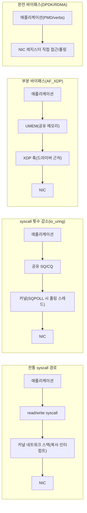

<strong>커널 바이패스(kernel bypass)</strong>란 네트워크·스토리지 I/O 경로에서 커널의 개입(시스템 콜 진입, 데이터 복사, 인터럽트 처리)을 줄이거나 제거해 애플리케이션이 하드웨어에 더 가까운 곳에서 데이터를 주고받도록 만드는 일련의 기법을 말합니다. 10GbE를 넘어 40/100GbE, 그리고 AI 클러스터의 수백 Gbps급 인터커넥트가 일반화되면서, 패킷 한 개를 처리하는 데 걸리는 시간 예산은 마이크로초 이하로 좁아졌고, 그 예산 안에서 커널 네트워크 스택의 고정 비용(소켓 버퍼 복사, 인터럽트 처리, 스케줄링)이 상대적으로 점점 커졌습니다. 이 장에서는 왜 이런 우회가 필요해졌는지, DPDK와 RDMA 같은 완전 바이패스와 io_uring·AF_XDP 같은 부분 바이패스가 커널 개입을 얼마나·어떻게 줄이는지, 그리고 그 대가로 무엇을 잃는지를 개요 수준에서 정리합니다.

## 이 장을 읽기 전에

**선행 챕터**: [Syscall 비용과 최소화 기법](/post/os-optimization/syscall-cost-minimization/) (챕터 02)에서 syscall 진입·탈출의 모드 전환 비용과 KPTI가 더한 오버헤드, vDSO·batching으로 syscall 횟수를 줄이는 방법을 다뤘습니다. 이 장은 그 연장선에 있습니다 — batching이 "syscall 횟수를 줄이는" 전략이라면, 커널 바이패스는 "애초에 커널에 들어가지 않거나 커널의 데이터 복사·인터럽트 처리 자체를 없애는" 더 급진적인 전략입니다. [정밀 시간 측정](/post/os-optimization/precise-time-measurement-rdtsc-clock-gettime/) (챕터 06)에서 다룬 타이밍 도구는 이 장에서 소개하는 접근 방식들의 효과를 검증할 때 그대로 쓸 수 있습니다.

**전제 지식**: user/kernel mode 구분과 syscall 진입 비용(챕터 02), 소켓 프로그래밍의 기본(`send`/`recv`, 버퍼)에 대한 감이면 충분합니다. NIC 드라이버 내부 구조나 인피니밴드 하드웨어 세부 사항까지는 필요하지 않습니다.

**이 장의 깊이**: **중급**입니다. 이 장은 DPDK·RDMA·io_uring·AF_XDP가 각각 커널 개입을 어느 지점에서 얼마나 줄이는지 구분하고, 그 대가로 어떤 운영 비용이 따르는지 판단할 수 있는 수준까지 다룹니다. **다루지 않는 것**: DPDK의 실제 애플리케이션 작성법, RDMA 큐 페어의 상세 프로그래밍, io_uring의 SQE/CQE 구조와 링크드 오퍼레이션(→ 챕터 08), AF_XDP·XDP 프로그램 작성과 eBPF 검증기 세부 사항(→ 챕터 09), 그리고 이 기술들을 실제 파일 I/O·네트워크 스택에 적용하는 심화 아키텍처(→ Tr.09 I/O, Tr.10 네트워크)입니다. 이 장은 "무엇이 있고 언제 그 방향으로 넘어갈지"를 판단하는 개요이지, 각 기술의 구현 매뉴얼이 아닙니다.

## 당신의 수준에 맞는 경로

| 수준 | 읽을 부분 | 핵심 목표 |
|------|---------|---------|
| **입문** | "커널 바이패스의 등장 배경" ~ "왜 커널을 우회하는가" | 커널 개입 비용의 구성 요소와 바이패스가 필요해진 이유 이해 |
| **중급자** | "완전 바이패스: DPDK와 Poll Mode Driver" ~ "부분 바이패스: io_uring과 AF_XDP" | 네 가지 접근 방식이 커널을 우회하는 지점과 정도의 차이 구분 |
| **전문가** | "판단 기준" ~ "비판적 시각" | 워크로드·운영 조건에 맞는 접근 방식 선택과 트레이드오프 판단 |

---

## 커널 바이패스의 등장 배경

커널 네트워크 스택은 원래 범용성을 목표로 설계되었습니다 — 임의의 프로토콜, 임의의 애플리케이션, 다중 사용자 환경을 안전하게 중재해야 했고, 그 대가로 소켓 버퍼 복사·인터럽트 기반 이벤트 처리·스케줄러 개입 같은 고정 비용을 감수했습니다. 1999년 InfiniBand Trade Association(IBTA)이 결성되고 2000년 InfiniBand Architecture Specification 1.0이 공개되면서([IBTA 공식 연혁](https://www.infinibandta.org/about-us/)), HPC 클러스터는 이미 "커널을 거치지 않고 하드웨어가 직접 메모리를 주고받는" RDMA(Remote Direct Memory Access) 모델을 채택하기 시작했습니다. 이더넷 진영은 한참 뒤인 2010년경 RoCE(RDMA over Converged Ethernet)로 같은 아이디어를 이더넷 위에 얹었습니다. 네트워킹 쪽에서는 인텔이 2010년경 DPDK(Data Plane Development Kit)를 공개해, NIC 드라이버 자체를 유저 공간으로 끌어올리고 인터럽트 대신 폴링으로 패킷을 처리하는 방식을 telecom·NFV 업계에 보급했습니다. 커널 자체도 이 흐름에 대응해 왔습니다 — XDP(eXpress Data Path)는 리눅스 4.8(2016)에서 도입되어 드라이버 근처에서 패킷을 조기 처리할 수 있는 훅을 제공했고, io_uring은 Jens Axboe가 설계해 리눅스 5.1(2019)에 병합되면서 커널을 완전히 우회하지는 않되 syscall 횟수 자체를 극적으로 줄이는 제3의 길을 열었습니다. 이 배경을 알면 이후 절에서 다루는 네 기술이 "하나의 기법"이 아니라 서로 다른 시기·다른 동기에서 나온, 커널 개입을 줄이는 서로 다른 지점의 해법이라는 점이 명확해집니다.

## 왜 커널을 우회하는가: 패킷 하나의 비용 구조

전통적인 `recv`/`send` 경로에서 패킷 하나가 애플리케이션에 도달하기까지는 여러 단계의 고정 비용이 쌓입니다. NIC가 패킷을 수신하면 인터럽트를 발생시키고, 커널은 인터럽트 핸들러에서 소프트IRQ로 처리를 넘기며, 프로토콜 스택(이더넷 → IP → TCP/UDP)을 거치며 헤더를 파싱하고, 데이터를 커널 버퍼에서 소켓 버퍼로, 다시 유저 공간 버퍼로 복사한 뒤에야 애플리케이션의 `recv` 호출이 반환됩니다. 이 경로에는 챕터 02에서 다룬 syscall 진입·탈출 비용, 인터럽트 처리로 인한 컨텍스트 스위치 가능성, 그리고 최소 한 번(많으면 두세 번)의 메모리 복사가 들어 있습니다. 패킷 처리량이 초당 수백만 건에 이르면 이 고정 비용의 합이 CPU 시간을 지배하게 되고, 이때부터는 "코드를 더 빠르게 만드는" 최적화보다 "이 경로 자체를 짧게 만드는" 구조적 변화가 더 큰 효과를 냅니다. 커널 바이패스 기술들은 이 비용 구조 중 서로 다른 부분(인터럽트, 복사, syscall 횟수)을 겨냥한다는 점에서 서로 대체재라기보다는 스펙트럼 위의 서로 다른 지점입니다.

## 완전 바이패스: DPDK와 Poll Mode Driver

**DPDK**는 NIC 드라이버 자체를 유저 공간으로 옮기는 접근입니다. 커널의 표준 NIC 드라이버 대신 UIO(Userspace I/O) 또는 VFIO(Virtual Function I/O)를 통해 디바이스 레지스터와 DMA 링을 유저 공간 프로세스에 매핑하고, 애플리케이션은 <strong>PMD(Poll Mode Driver)</strong>를 통해 수신 링을 끊임없이 폴링하며 패킷을 가져옵니다. 인터럽트를 아예 쓰지 않으므로 인터럽트 처리·컨텍스트 스위치 비용이 사라지지만, 그 대가로 폴링을 담당하는 코어는 패킷이 없을 때도 CPU를 100% 사용합니다. 아래는 이 폴링 루프의 개념을 보여주는 의사 코드입니다 — 실제 DPDK 애플리케이션은 `rte_eal_init`으로 환경을 초기화하고 `rte_eth_rx_burst`로 배치 수신하는 식의 실제 API를 쓰지만, 여기서는 "왜 인터럽트가 필요 없는가"라는 구조만 보여주기 위해 개념만 남겼습니다.

```text
// 개념 스케치: DPDK PMD의 폴링 루프 (실제 DPDK API는 rte_* 함수를 사용)
초기화: hugepage 기반 메모리 풀 할당, NIC를 UIO/VFIO로 유저 공간에 매핑
반복(전용 코어에서):
    burst = NIC_수신링에서_패킷_뭉치_가져오기()   // 인터럽트 없이 폴링
    if burst가 비어있음: 계속 반복                // 코어는 계속 CPU를 점유
    각 패킷에 대해 처리 로직 실행
    처리 결과를 NIC_송신링에_쓰기()
```

DPDK는 또한 **huge page**(2MB/1GB 페이지)를 필수로 사용해 TLB 미스를 줄이고 DMA 버퍼가 물리적으로 연속된 영역에 놓이도록 보장합니다 — huge page 설정과 장단점은 [챕터 10: Huge TLB Pages 활용](/post/os-optimization/huge-tlb-pages-utilization/)에서 다루므로 여기서는 반복하지 않습니다. [DPDK 공식 문서](https://doc.dpdk.org/guides/prog_guide/overview.html)는 PMD를 "인터럽트 기반 신호 메커니즘 없이" 동작하도록 설계된 드라이버로 설명합니다. 폴링 코어를 전용으로 격리하려면 챕터 03의 CPU pinning과 챕터 11(예정)의 컨테이너 CPU 격리가 함께 필요하므로, DPDK 도입은 이 트랙의 다른 여러 챕터와 동시에 고려해야 하는 결정입니다.

## 완전 바이패스: RDMA와 Verbs

**RDMA**는 DPDK와는 다른 지점을 겨냥합니다 — 패킷 처리 자체가 아니라 **원격 메모리 접근**을 하드웨어가 직접 수행하게 만듭니다. 애플리케이션은 **ibverbs**(`libibverbs`) API로 메모리 영역을 등록(`ibv_reg_mr`)하고 <strong>큐 페어(Queue Pair)</strong>를 생성한 뒤, 그 큐 페어에 작업 요청을 올리면 NIC(HCA)가 원격 노드의 등록된 메모리에 CPU 개입 없이 직접 읽고 씁니다. 자원 생성·등록 같은 "느린 경로"는 `/dev/infiniband/uverbsN` 장치를 통해 커널과 상호작용하지만, 실제 데이터 전송이 일어나는 "빠른 경로"는 유저 공간에 mmap된 하드웨어 레지스터에 직접 쓰는 방식으로 처리되어 syscall도 컨텍스트 스위치도 발생하지 않습니다. [리눅스 커널 공식 문서](https://docs.kernel.org/infiniband/user_verbs.html)는 이 빠른 경로가 유저 공간에 mmap된 하드웨어 레지스터에 직접 기록되며 시스템 콜이나 커널로의 컨텍스트 스위치가 없다고 설명합니다. 아래는 메모리 등록과 큐 페어 개념을 보여주는 골격 코드입니다 — 실제로 컴파일하려면 `libibverbs-dev`(또는 배포판의 동등 패키지)와 RDMA 지원 NIC(또는 소프트웨어 RDMA 드라이버인 `rxe`)가 필요합니다.

```c
#include <infiniband/verbs.h>
#include <stdio.h>
#include <stdlib.h>

// 실제 전송 로직은 생략하고, "메모리 등록 -> 큐 페어 생성" 두 단계만 보여주는 골격.
// ibv_post_send/ibv_post_recv로 작업을 올린 뒤에는 하드웨어가 큐 페어를 통해
// CPU 개입 없이 데이터를 이동시킨다(빠른 경로).
int setup_rdma_resources(struct ibv_pd* pd, struct ibv_cq* cq, void* buf, size_t len) {
  // 1) 데이터가 오갈 메모리를 하드웨어가 직접 접근할 수 있도록 등록
  struct ibv_mr* mr = ibv_reg_mr(pd, buf, len,
                                  IBV_ACCESS_LOCAL_WRITE | IBV_ACCESS_REMOTE_WRITE);
  if (!mr) return -1;

  // 2) 데이터 전송 단위인 큐 페어(송신/수신 큐 묶음) 생성
  struct ibv_qp_init_attr qp_attr = {0};
  qp_attr.send_cq = cq;
  qp_attr.recv_cq = cq;
  qp_attr.qp_type = IBV_QPT_RC;  // Reliable Connection
  qp_attr.cap.max_send_wr = 16;
  qp_attr.cap.max_recv_wr = 16;
  qp_attr.cap.max_send_sge = 1;
  qp_attr.cap.max_recv_sge = 1;

  struct ibv_qp* qp = ibv_create_qp(pd, &qp_attr);
  if (!qp) { ibv_dereg_mr(mr); return -1; }

  // qp가 RTR/RTS 상태로 전이된 뒤에야 ibv_post_send/recv로 실제 전송이 가능하다(생략).
  return 0;
}
```

이 골격 코드가 보여주지 않는 부분(큐 페어의 상태 전이, 완료 큐 폴링, 원격 주소·rkey 교환)이 RDMA 프로그래밍의 실제 복잡도 대부분을 차지합니다. RDMA는 손실 없는 네트워크(PFC, ECN/DCQCN 같은 혼잡 제어)를 전제로 설계된 경우가 많아, 일반 이더넷 환경에 RoCEv2를 올리려면 스위치·NIC 설정까지 함께 손봐야 하며, 2025~2026년 GPU 클러스터에서 GPUDirect RDMA를 통한 NIC-HBM 직접 DMA가 확산되면서 이 설정 부담은 AI 인프라 쪽에서도 중요한 화두가 되었습니다.

## 부분 바이패스: io_uring과 AF_XDP (개요)

DPDK·RDMA가 커널을 사실상 완전히 우회한다면, **io_uring**과 **AF_XDP**는 커널의 참여를 남겨 둔 채 그 개입 방식을 바꾸는 절충안입니다. io_uring은 제출 큐(SQ)와 완료 큐(CQ)를 애플리케이션과 커널이 공유 메모리로 주고받게 해, 다건의 I/O 요청을 syscall 한 번(또는 SQPOLL 모드에서는 그마저 생략)으로 제출할 수 있게 합니다 — 하지만 실제 I/O 처리는 여전히 커널 내부에서 일어나므로, "syscall 횟수를 없애는" 기법이지 "커널을 우회하는" 기법은 아닙니다. 이 구분이 흔한 오개념의 첫 번째 항목이며, io_uring의 SQE/CQE 구조와 링크드 오퍼레이션 같은 심화 내용은 [챕터 08: io_uring 개요](/post/os-optimization/io-uring-overview-fundamentals/)에서 다룹니다. **AF_XDP**는 XDP 훅이 드라이버 근처에서 패킷을 가로채 커널 네트워크 스택을 건너뛰고 **UMEM**(애플리케이션과 커널이 공유하는 고정 크기 청크 메모리 영역)으로 직접 리다이렉트하는 방식입니다 — [리눅스 커널 공식 문서](https://www.kernel.org/doc/html/latest/networking/af_xdp.html)는 zero-copy 모드가 지원되지 않으면 복사 모드로 자동 폴백한다고 밝히고 있어, 실제로 얻는 이득이 NIC 드라이버의 zero-copy 지원 여부에 좌우됩니다. AF_XDP·XDP 프로그램 작성과 eBPF 검증기 관련 세부 사항은 [챕터 09: XDP/eBPF 개요](/post/os-optimization/xdp-ebpf-overview-fundamentals/)로, eBPF를 커널 훅으로 쓰는 운영·보안 리스크는 이미 게시된 [챕터 17: eBPF·커널 경계와 성능·안전](/post/os-optimization/ebpf-xdp-kernel-boundary-performance-safety-expert/)으로 각각 위임합니다.

네 접근 방식을 "커널이 경로에서 얼마나 빠지는가"라는 한 축 위에 놓으면 다음과 같습니다.



## 흔한 오개념

- **"io_uring과 AF_XDP도 DPDK·RDMA처럼 커널을 완전히 우회한다"**: 아닙니다. io_uring은 syscall 횟수를 줄일 뿐 I/O 처리 자체는 커널 안에서 일어나고, AF_XDP는 드라이버 근처에서 가로채지만 여전히 커널의 XDP 훅과 소켓 계층을 거칩니다. 완전 바이패스는 DPDK·RDMA처럼 커널이 데이터 경로에서 아예 빠지는 경우에만 해당합니다.
- **"커널 바이패스는 무조건 더 빠르다"**: 아닙니다. DPDK의 폴링 루프는 패킷이 없어도 코어를 100% 점유하므로, 트래픽이 간헐적인 워크로드에서는 유휴 전력·코어 낭비가 오히려 손해입니다. 처리량이 충분히 높고 지속적일 때만 폴링의 이득이 인터럽트 방식을 앞섭니다.
- **"바이패스해도 기존 네트워크 도구를 그대로 쓸 수 있다"**: 아닙니다. `iptables`, `tc`, `tcpdump`, 커널 라우팅 테이블은 커널 네트워크 스택을 전제로 동작합니다. DPDK·RDMA로 우회한 경로는 이 도구들의 관측·제어 범위 밖에 있으므로, 방화벽 규칙이나 트래픽 쉐이핑을 애플리케이션이 직접 구현하거나 별도 관측 파이프라인을 마련해야 합니다.

## 판단 기준: 언제 어떤 접근을 쓰는가

| 상황 | 권장 | 비권장 |
|------|------|--------|
| 초당 수백만 패킷급 지속적 처리량, 전용 코어 확보 가능 | DPDK(PMD) | 인터럽트 기반 표준 소켓 |
| 노드 간 대용량 메모리 전송(HPC, 스토리지 클러스터, AI 클러스터) | RDMA(RoCEv2/InfiniBand) | 소켓 기반 복사 전송 |
| 다건의 파일/소켓 I/O, syscall 횟수 자체가 병목 | io_uring | 반복적인 개별 syscall |
| 패킷 필터링·조기 드롭·커스텀 로드밸런싱 | AF_XDP 또는 XDP/eBPF(챕터 09) | 유저 공간에서 모든 패킷 수신 후 필터링 |
| 트래픽이 간헐적이거나 예측 불가능 | 인터럽트 기반 표준 경로 유지 | 상시 폴링(코어 낭비) |
| 기존 iptables/tc 기반 운영 도구에 강하게 의존 | 표준 경로 유지 또는 병행 관측 파이프라인 구축 후 도입 | 관측 공백을 감수한 채 전면 전환 |

## 비판적 시각: 한계와 트레이드오프

커널 바이패스가 지연·처리량 지표를 개선하는 것은 사실이지만, 그 대가는 숫자 밖에 있습니다. DPDK·RDMA는 커널의 관측·보안·자원 관리 인프라(`iptables`, cgroups 기반 네트워크 대역폭 제한, 표준 패킷 캡처)를 우회하므로, 이 기능들을 애플리케이션 계층에서 다시 구현하거나 포기해야 합니다 — 팀의 온콜 도구가 `tcpdump`와 커널 네트워크 통계에 의존한다면, 바이패스 도입은 장애 대응 절차 전체를 다시 설계하는 일이 됩니다. 폴링 기반 접근(DPDK)은 코어를 상시 점유하므로 클라우드 과금·전력·코어 배치 계획에 반영되어야 하고, 트래픽이 뜸한 시간대에도 동일한 비용을 치릅니다. RDMA는 손실 없는 네트워크 구성(PFC, ECN)에 의존하는 경우가 많아, 이 설정이 어긋나면 헤드 오브 라인 블로킹이나 데드락에 가까운 정체가 발생할 수 있다는 보고가 있어 왔습니다. 그리고 이 모든 기술은 커널 표준 경로보다 이식성이 낮습니다 — NIC 드라이버·펌웨어·커널 버전 조합에 따라 zero-copy 지원 여부나 오프로드 기능이 달라지므로, 한 환경에서 검증한 설정이 다른 환경에서 그대로 재현된다고 가정해서는 안 됩니다. 결국 커널 바이패스는 "측정된 병목이 커널 개입 비용 자체"라는 확실한 증거가 있을 때 도입할 카드이지, 기본값으로 깔고 시작할 선택은 아닙니다.

## 이 트랙에서의 범위와 다음 단계

이 장은 네 기술의 존재와 위치를 지도로 그리는 개요이며, 실전 구현은 이어지는 장과 다른 트랙에 의도적으로 넘깁니다. io_uring의 SQE/CQE 구조·SQPOLL·링크드 오퍼레이션은 챕터 08에서, AF_XDP·XDP 프로그램 작성과 eBPF 검증기는 챕터 09에서 각각 이 트랙 안의 "개요" 수준으로 이어집니다. DPDK·RDMA를 실제 파일 I/O·스토리지 경로에 적용하는 심화 아키텍처는 Tr.09(I/O)에서, 네트워크 프로토콜·소켓 계층과 결합한 심화 적용은 Tr.10(네트워크)에서 다룰 예정이므로, 이 장에서 다룬 개념을 실전 코드로 옮기고 싶다면 해당 트랙의 심화 챕터를 기다리거나 각 기술의 공식 문서(DPDK Programmer's Guide, `rdma-core`)를 함께 참고하는 것이 좋습니다.

## 마무리

- [ ] 커널 바이패스가 겨냥하는 비용(syscall, 데이터 복사, 인터럽트)을 구분해 설명할 수 있다.
- [ ] DPDK(PMD·폴링)와 RDMA(verbs·큐 페어)가 커널을 우회하는 지점과 방식의 차이를 설명할 수 있다.
- [ ] io_uring·AF_XDP가 "완전 바이패스"가 아니라 "커널 개입 방식의 절충"이라는 점을 구분할 수 있다.
- [ ] 폴링 기반 접근의 코어 점유 비용과 이식성·관측성 손실을 판단 기준에 포함할 수 있다.
- [ ] 이 장의 개요와 챕터 08(io_uring)·챕터 09(XDP/eBPF)·Tr.09·Tr.10 심화의 역할 분담을 구분할 수 있다.

**참고 문서**: [DPDK Programmer's Guide: Overview](https://doc.dpdk.org/guides/prog_guide/overview.html), [리눅스 커널 문서: AF_XDP](https://www.kernel.org/doc/html/latest/networking/af_xdp.html), [man7.org: io_uring(7)](https://man7.org/linux/man-pages/man7/io_uring.7.html), [리눅스 커널 문서: Userspace verbs access](https://docs.kernel.org/infiniband/user_verbs.html).

다음 장에서는 **io_uring 개요**를 다룹니다. 이 장에서 "부분 바이패스"로 소개한 io_uring의 제출/완료 큐 구조, SQPOLL, 그리고 파일 I/O 심화(Tr.09)로 넘어가는 경계를 자세히 살펴봅니다.

→ [io_uring 개요](/post/os-optimization/io-uring-overview-fundamentals/) (챕터 08)
