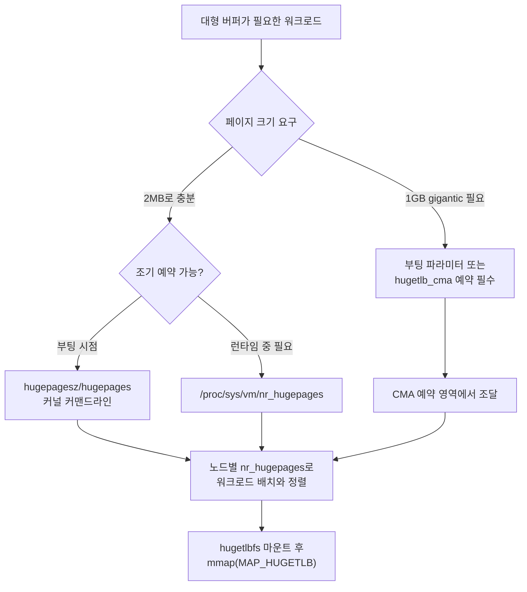

**Huge TLB Pages 활용**이란 관리자가 부팅 시점 또는 런타임에 미리 예약해 둔 대형 페이지 풀(HugeTLB pool)을 NUMA 토폴로지·권한·페이지 크기 관점에서 실제로 운영하는 문제를 말합니다. [이전 장](/post/os-optimization/xdp-ebpf-overview-fundamentals/)에서는 커널 바이패스 계열인 XDP/eBPF의 개요와 이 트랙이 어디까지 다루고 어디를 위임하는지를 정리했습니다. 이 장은 다시 메모리·페이지 테이블 축으로 돌아와, 데이터베이스 버퍼 풀·JVM 힙·RDMA 등록 영역·DPDK 패킷 버퍼처럼 크기가 예측 가능하고 스왑되면 안 되는 메모리에 **정적으로 예약된 대형 페이지**를 어떻게 확보하고, 어느 NUMA 노드에 배치하며, 어떤 권한으로 애플리케이션에 노출할지를 다룹니다. TLB(Translation Lookaside Buffer)가 커버하는 주소 범위는 4KB 페이지 하나당 극히 좁기 때문에, 수백 메가바이트 이상의 워킹셋을 핫패스에서 반복 접근하는 서비스는 페이지 워크(page walk) 비용이 누적되어 꼬리 지연을 갉아먹습니다. HugeTLB는 이 문제를 애플리케이션 코드 한 줄이 아니라 **운영 설정**으로 해결하는 축이며, 이 장은 그 설정을 정확히 예약·검증·트러블슈팅하는 방법에 집중합니다.

## 이 장을 읽기 전에

**전제 지식**: [Tr.04: Large Pages·Huge Pages](/post/memory-optimization/huge-pages-large-pages-mthp/)에서 다룬 HugeTLB·THP·mTHP의 개념적 차이와 `mmap(MAP_HUGETLB)` 기본 사용법, TLB 미스를 `perf stat`으로 측정하는 벤치마크 방법론을 이미 안다고 가정합니다. NUMA 노드·거리 행렬을 읽는 법과 `numactl`/`libnuma`의 기본 사용법은 [NUMA CPU Affinity·스레드 배치](/post/os-optimization/numa-cpu-affinity-thread-placement/)에서 다뤘으므로, 이 장에서는 반복하지 않습니다.

**이 장의 깊이**: 이 장은 **심화** 난이도로, HugeTLB 정적 풀을 부팅 시점·런타임에 예약하는 두 경로의 차이, NUMA 노드별 풀 배치, `hugetlbfs` 마운트 옵션과 권한 모델, 1GB gigantic page와 CMA(Contiguous Memory Allocator)의 관계, 그리고 예약 성공 여부를 실제로 검증하는 절차를 다룹니다.

**다루지 않는 것**: HugeTLB·THP·mTHP의 개념적 정의와 `madvise` 기반 THP 힌트, `mmap` 기본 코드는 [Tr.04: Large Pages·Huge Pages](/post/memory-optimization/huge-pages-large-pages-mthp/)로 위임합니다. NUMA CPU affinity 전략 일반과 first-touch 정책은 [NUMA CPU Affinity·스레드 배치](/post/os-optimization/numa-cpu-affinity-thread-placement/)로, 컨테이너·cgroup v2 환경에서의 HugeTLB 계정·제한(`hugetlb.<size>.max` 등)은 [cgroups v2 리소스 제어](/post/os-optimization/cgroups-v2-resource-control-performance/)와 [컨테이너/가상화 성능 고려사항](/post/os-optimization/container-virtualization-performance-considerations/)으로 위임합니다.

## 당신의 수준에 맞는 경로

| 수준 | 읽을 부분 | 핵심 목표 |
|------|---------|---------|
| **초보자** | "정적 풀 모델의 발전" ~ "예약 모델: nr_hugepages와 부팅 파라미터" | 정적 예약이 무엇이고 왜 필요한지, `/proc/meminfo` 필드의 의미 이해 |
| **중급자** | "NUMA 노드별 HugeTLB 풀 배치" ~ "hugetlbfs 마운트와 권한 관리" | 노드별 풀을 배치하고 애플리케이션에 안전하게 노출하는 법 습득 |
| **전문가** | "gigantic page와 CMA" ~ "비판적 시각" | 1GB 페이지의 운영 제약과 예약 실패 원인을 진단하는 능력 |

---

## 정적 풀 모델의 발전 (역사·배경)

HugeTLB 자체의 기원과 THP·mTHP와의 관계는 [Tr.04: Large Pages·Huge Pages](/post/memory-optimization/huge-pages-large-pages-mthp/)에서 다뤘으므로, 이 장에서는 **운영 관점에서 중요한 후속 변화**만 짚습니다. x86-64에서 2MB 페이지는 오래전부터 지원되었지만, 1GB **gigantic page**는 물리적으로 완전히 연속된 1GB 블록을 요구하기 때문에 부팅 직후가 아니면 메모리 단편화로 확보가 거의 불가능했습니다. 이 문제를 겨냥해 CMA(Contiguous Memory Allocator) 기반으로 gigantic page를 런타임에도 조달할 수 있게 하는 `hugetlb_cma` 기능이 2020년경 커널에 추가되었고, 이후 노드별 CMA 영역 지정 등 세부 개선이 이어졌습니다. 2025년에는 Frank van der Linden(Google)이 주도한 "hugetlb/CMA improvements for large systems" 패치 시리즈가 Linux 6.15에 병합되며, 수 테라바이트급 메모리를 가진 서버에서 대량의 `hugepages=`를 부팅 커맨드라인으로 요청할 때 vmemmap 페이지 할당 때문에 부팅 자체가 실패하던 문제와, CMA 영역이 물리 주소 공간의 빈틈(low BIOS DMA 영역 등) 때문에 실패하는 문제를 다뤘습니다. 같은 배경에서 도입된 `hugepage_alloc_threads` 부팅 파라미터는 대형 페이지 할당을 여러 스레드로 병렬화해, 대용량 메모리 서버의 부팅 시간을 단축합니다. 이 변화들은 "대형 메모리 서버에서 HugeTLB를 대량으로 예약하는 일" 자체가 여전히 커널 개발이 진행 중인 영역이라는 점을 보여줍니다.

## 예약 모델: nr_hugepages와 부팅 파라미터

HugeTLB 페이지는 **부팅 시점 예약**과 **런타임 예약**이라는 두 경로로 확보할 수 있으며, 이 둘은 성공 확률이 크게 다릅니다. 런타임에는 `/proc/sys/vm/nr_hugepages`에 원하는 개수를 쓰면 커널이 그만큼의 연속 물리 페이지를 즉시 찾아 pool로 편입합니다. 부팅 시점에는 커널 커맨드라인에 `hugepagesz=<크기> hugepages=<개수>`를 지정해, 메모리가 아직 단편화되기 전인 부팅 초기 단계에서 페이지를 확보합니다.

```bash
# 부팅 커맨드라인(GRUB 등)에 추가: 기본 크기를 2MB로 하고 512개(1GiB) 예약,
# 1GB 크기도 별도로 8개 예약. 부팅 파라미터 순서가 각 크기의 개수에 영향을 준다.
default_hugepagesz=2M hugepagesz=2M hugepages=512 hugepagesz=1G hugepages=8

# 런타임에 2MB 기본 크기 풀을 20개로 조정(이미 실행 중인 시스템, 단편화 위험 있음)
echo 20 > /proc/sys/vm/nr_hugepages

# 커널이 필요 시 pool 밖에서 추가로 확보할 수 있는 surplus 상한(0이면 오버커밋 없음)
echo 10 > /proc/sys/vm/nr_overcommit_hugepages
```

런타임 `echo`는 시스템이 오래 켜져 있어 메모리가 단편화된 상태라면 요청한 개수보다 적게 확보되거나 아예 실패할 수 있습니다. 예약 결과는 반드시 확인해야 하며, `/proc/meminfo`가 그 창구입니다.

```text
HugePages_Total:     512
HugePages_Free:      488
HugePages_Rsvd:        4
HugePages_Surp:        2
Hugepagesize:       2048 kB
Hugetlb:         1048576 kB
```

`HugePages_Total`은 pool에 실제로 편입된 페이지 수이고, `HugePages_Free`는 아직 어떤 매핑에도 쓰이지 않은 페이지 수입니다. `HugePages_Rsvd`는 `mmap`은 됐지만 아직 첫 접근(page fault)이 일어나지 않아 물리 페이지 배정이 유예된 상태를 가리키며, 이 값이 있다는 것은 "이미 약속된 페이지라 다른 프로세스가 가로챌 수 없다"는 뜻입니다. `HugePages_Surp`는 `nr_overcommit_hugepages`를 통해 기본 pool 크기를 넘어 임시로 확보된 surplus 페이지 수로, 메모리 압박이 오면 반환될 수 있는 페이지입니다. `HugePages_Total`이 요청한 값보다 작다면 단편화나 오버커밋 설정 부족이 원인이므로, 부팅 파라미터로 전환하거나 뒤에서 다룰 CMA를 검토해야 합니다.

## NUMA 노드별 HugeTLB 풀 배치

`/proc/sys/vm/nr_hugepages`에 값을 쓰면 커널이 전체 시스템에서 페이지를 확보하되 어느 노드에서 가져올지는 커널의 판단에 맡깁니다. 지연에 민감한 서버에서는 이 배치를 명시적으로 통제해야 하며, 그 창구가 노드별 sysfs 속성입니다.

```bash
# 노드 0과 노드 1에 각각 2MB 페이지 256개(512MiB)씩 독립적으로 예약
echo 256 > /sys/devices/system/node/node0/hugepages/hugepages-2048kB/nr_hugepages
echo 256 > /sys/devices/system/node/node1/hugepages/hugepages-2048kB/nr_hugepages

# 특정 노드 집합에만 할당되도록 멤폴리시를 지정한 뒤 전역 nr_hugepages를 조정하는 방법도 있다
numactl -m 0 sh -c 'echo 256 > /proc/sys/vm/nr_hugepages_mempolicy'
```

이 절차는 [NUMA CPU Affinity·스레드 배치](/post/os-optimization/numa-cpu-affinity-thread-placement/)에서 다룬 "노드별 샤딩" 패턴과 정확히 짝을 이룹니다. 워커 풀을 노드 0의 CPU에 고정하고 데이터도 노드 0에서 `numa_alloc_onnode`로 할당했다면, 그 데이터가 HugeTLB 버퍼라는 이유만으로 노드 0의 HugeTLB pool이 비어 있으면 원격 노드의 페이지를 받아 지역성이 깨집니다. 즉 CPU affinity·메모리 정책·HugeTLB 풀 배치는 세 요소가 같은 노드로 맞춰져야 완결됩니다. 배치가 의도대로 됐는지는 각 노드의 `free_hugepages`가 실제 사용량과 맞는지 주기적으로 확인해야 하며, `numastat -m`은 노드별 `HugePages_Total`/`HugePages_Free`를 한 화면에 모아 보여 줍니다.

## hugetlbfs 마운트와 권한 관리

애플리케이션이 특정 크기의 HugeTLB 페이지를 명시적으로 골라 쓰려면, 그 크기 전용으로 마운트된 `hugetlbfs` 위에 파일을 만들고 `mmap`해야 합니다. 하나의 `hugetlbfs` 마운트는 원칙적으로 하나의 페이지 크기만 담당하므로, 2MB와 1GB를 함께 쓰는 시스템은 마운트를 두 개 이상 준비합니다.

```bash
mkdir -p /mnt/huge2m /mnt/huge1g

# 2MB 전용 마운트: 그룹 hugeusers만 쓰기 가능, 최대 512MiB까지 예약 허용
mount -t hugetlbfs -o pagesize=2M,size=512M,mode=0770,gid=hugeusers none /mnt/huge2m

# 1GB 전용 마운트: 최소 8GiB는 항상 확보되도록 min_size로 보장
mount -t hugetlbfs -o pagesize=1G,size=32G,min_size=8G none /mnt/huge1g
```

`mode`·`uid`·`gid`는 일반 파일시스템처럼 파일 생성 권한을 통제하고, 공유 메모리 경로(`shmget` + `SHM_HUGETLB`)를 쓰는 프로세스는 별도로 `/proc/sys/vm/hugetlb_shm_group`에 등록된 supplementary group에 속해야 합니다. `size`는 이 마운트가 pool에서 가져갈 수 있는 상한이고, `min_size`는 그만큼을 항상 예약해 다른 마운트나 프로세스가 가로채지 못하게 보장합니다. 애플리케이션 쪽에서는 페이지 크기를 명시적으로 골라야 하는 상황(같은 프로세스가 2MB와 1GB를 모두 쓰는 경우)에서 `MAP_HUGE_SHIFT` 기반 인코딩을 사용합니다.

```cpp
#include <sys/mman.h>
#include <cstdio>
#include <cstdlib>

int main() {
  constexpr size_t kSize = 1ull << 30;  // 1GiB: gigantic page 한 장
  // MAP_HUGE_1GB = (30 << MAP_HUGE_SHIFT): 시스템에 여러 hugetlb 크기가
  // 있을 때 기본 크기(Hugepagesize)가 아닌 1GB를 명시적으로 선택한다.
  void* p = mmap(nullptr, kSize, PROT_READ | PROT_WRITE,
                 MAP_PRIVATE | MAP_ANONYMOUS | MAP_HUGETLB | MAP_HUGE_1GB, -1, 0);
  if (p == MAP_FAILED) {
    perror("mmap(MAP_HUGE_1GB)");  // hugetlb_cma 또는 부팅 예약이 없으면 여기서 실패
    return EXIT_FAILURE;
  }
  munmap(p, kSize);
  return EXIT_SUCCESS;
}
```

이 코드는 `nr_hugepages`(1G 크기)가 이미 예약되어 있거나 `hugetlb_cma` 영역이 준비되어 있어야만 성공합니다. `MAP_HUGE_2MB`도 같은 방식으로 크기만 바꿔 쓸 수 있으며, 크기를 지정하지 않으면 커널은 `Hugepagesize`에 표시된 기본 크기를 가정합니다.

## gigantic page(1GB)와 CMA: 왜 부팅 시 예약이 안전한가

1GB gigantic page는 물리적으로 완전히 연속된 262,144개의 4KB 프레임을 요구하므로, 시스템이 켜진 채 시간이 지나 이동 불가능(non-movable) 페이지들이 여기저기 자리 잡으면 그만한 크기의 빈 연속 구간을 찾을 확률이 사실상 0에 가까워집니다. 가장 확실한 회피책은 메모리가 아직 단편화되지 않은 **부팅 직후**에 `hugepages=` 파라미터로 필요한 만큼을 미리 확보해 두는 것입니다. 이것이 어렵거나 필요량이 운영 중 바뀌어야 하는 환경에서는 `hugetlb_cma=<크기>` 부팅 파라미터로 전용 CMA 영역을 따로 떼어 두는 방법을 씁니다. CMA 영역은 gigantic page로 쓰이지 않는 동안에는 페이지 캐시나 익명 메모리, THP 등 다른 용도로 재활용되므로 완전히 낭비되지는 않지만, 실제로 gigantic page가 필요해지는 순간 이 영역에서 회수(migrate out)하는 데 추가 지연이 든다는 점은 감안해야 합니다. 커널은 반대 방향의 유연성도 제공하는데, `demote` sysfs 파일에 값을 쓰면 이미 확보한 1GB 페이지 한 장을 512개의 2MB 페이지로 분할할 수 있어 gigantic page를 과다 예약했을 때 2MB 워크로드로 재배분하는 통로가 됩니다.



## TLB 미스 감소 효과를 운영 관점에서 확인하기

TLB 미스·페이지 폴트를 `perf stat`으로 측정하는 벤치마크 방법론 자체는 [Tr.04: Large Pages·Huge Pages](/post/memory-optimization/huge-pages-large-pages-mthp/)에서 이미 다뤘으므로 반복하지 않습니다. 이 장에서 추가로 확인해야 할 것은 "그 벤치마크가 관측한 이득이 실제 운영 환경의 풀 배치에서도 재현되는가"입니다. TLB 엔트리 하나가 커버하는 주소 범위(TLB reach)는 페이지 크기에 정확히 비례하므로, 같은 개수의 TLB 엔트리라도 4KB 대신 2MB나 1GB 페이지를 쓰면 커버 범위가 수백~수십만 배 늘어난다는 점은 마이크로아키텍처에 상관없이 성립하는 구조적 사실입니다. 다만 구체적인 TLB 엔트리 개수와 계층(L1 dTLB, STLB 등)은 CPU 세대마다 다르므로, "N배 빨라진다"는 절대 수치는 대상 하드웨어에서 직접 재현해야 합니다.

```bash
# 노드별 실제 사용량이 예약과 일치하는지 확인 (예약만 하고 실제로 안 쓰이면 낭비)
numastat -m | grep -A3 'HugePages'

# 프로세스가 hugetlb VMA를 실제로 사용 중인지, 어느 노드 페이지인지 확인
grep -B1 -A2 'KernelPageSize:    2048 kB' /proc/<pid>/smaps
```

`HugePages_Total`은 충분한데 애플리케이션의 `smaps`에 `hugetlbfs` VMA가 보이지 않는다면 `mmap` 자체가 일반 페이지로 폴백했을 가능성이 크고, 이 경우 앞서 다룬 벤치마크가 보여주는 TLB 미스 감소 효과는 애초에 적용되지 않은 상태입니다. 예약 확인과 실제 매핑 확인을 분리해서 점검하는 습관이 "설정은 했는데 효과가 없다"는 흔한 운영 사고를 막습니다.

## 흔한 오개념

<strong>"`nr_hugepages`에 값을 쓰면 항상 그 개수만큼 확보된다"</strong>는 흔한 오해입니다. 커널은 요청을 최선을 다해 시도할 뿐이며, 특히 시스템이 오래 켜져 있어 단편화된 상태라면 `HugePages_Total`이 요청보다 적게 늘어나거나 아예 변하지 않을 수 있습니다. 확실한 확보가 필요하면 부팅 파라미터를 쓰거나, gigantic page라면 `hugetlb_cma`를 함께 검토해야 합니다.

<strong>"HugeTLB 예약은 THP처럼 필요할 때만 물리 메모리를 쓴다"</strong>도 정확하지 않습니다. `nr_hugepages`로 확보된 페이지는 실제로 어떤 프로세스도 쓰지 않아도 pool에 편입된 순간 물리 메모리를 점유하며, 이 메모리는 다른 용도로 회수되지 않습니다(pinned). 반대로 gigantic page용 CMA 영역은 미사용 시 다른 용도로 재활용될 수 있다는 점에서 이 둘의 낭비 양상이 다릅니다.

<strong>"HugeTLB 풀 개수만 노드 합계로 맞추면 충분하다"</strong>는 배치를 소홀히 하는 실수로 이어집니다. 전체 시스템 기준으로 512개를 예약했더라도 그 절반이 워커가 실행되는 노드가 아닌 다른 노드에 쏠려 있으면, [NUMA CPU Affinity·스레드 배치](/post/os-optimization/numa-cpu-affinity-thread-placement/)에서 다룬 first-touch 문제와 똑같은 방식으로 원격 접근이 굳어집니다. 노드별 sysfs 경로로 직접 배치를 확인해야 합니다.

## 판단 기준

| 상황 | 권장 | 비권장 |
|------|------|--------|
| 서비스 기동 시점에 필요량이 확정된 대형 버퍼 | 부팅 커맨드라인 `hugepagesz`/`hugepages`로 조기 예약 | 런타임 `echo`에만 의존 |
| 1GB gigantic page가 필요하지만 필요량이 운영 중 변할 수 있음 | `hugetlb_cma=`로 전용 CMA 영역 확보 | 단편화된 시스템에서 런타임 예약 시도 |
| NUMA 서버, 워커가 노드별로 고정됨 | 노드별 sysfs(`node*/hugepages/.../nr_hugepages`)로 개별 예약 | 전역 `nr_hugepages`만 맞추고 배치 방치 |
| 여러 페이지 크기를 함께 쓰는 애플리케이션 | 크기별 `hugetlbfs` 마운트 분리 + `MAP_HUGE_SHIFT` 명시 | 마운트 하나로 모든 크기 처리 시도 |
| 컨테이너·멀티테넌트 환경 | cgroup v2 `hugetlb.<size>.max`로 테넌트별 상한(13장) | 컨테이너 밖에서만 pool 관리, 테넌트 간 격리 없음 |
| 예약 성공 여부가 불확실 | 예약 직후 `/proc/meminfo`·`smaps`로 즉시 검증 | 설정만 하고 실제 매핑 여부 미확인 |

## 비판적 시각: 한계와 트레이드오프

HugeTLB의 정적 예약 모델은 예측 가능성을 얻는 대신 유연성을 크게 희생합니다. 한 번 pool에 편입된 페이지는 다른 어떤 목적으로도 회수되지 않으므로, 예약량을 넉넉하게 잡으면 실제로 쓰이지 않는 페이지가 다른 프로세스가 쓸 수 있었던 메모리를 그대로 잠가 버립니다. gigantic page는 이 문제가 더 심해서, 부팅 시점 예약이 아니면 성공을 장담하기 어렵고 CMA로 우회해도 회수 지연이라는 대가가 남습니다. 자동 NUMA 밸런싱이 HugeTLB 페이지를 재배치 대상으로 삼는지는 커널 버전과 페이지 크기에 따라 달라지는 구현 정의 영역이므로, "한 번 노드별로 예약해 두면 커널이 알아서 최적으로 옮겨 준다"는 기대는 대상 커널에서 직접 확인하지 않고는 성립하지 않는다고 보는 편이 안전합니다. 가상화·컨테이너 환경에서는 하이퍼바이저나 오케스트레이터가 HugeTLB 예약을 게스트에 그대로 노출하지 않거나 별도 설정을 요구하는 경우가 있어, 베어메탈에서 검증한 예약 절차가 클라우드 인스턴스에서 그대로 재현된다고 가정하면 안 됩니다. 이런 환경별 제약은 [컨테이너/가상화 성능 고려사항](/post/os-optimization/container-virtualization-performance-considerations/)에서 이어서 다룹니다.

## 마무리

- [ ] 부팅 시점 예약과 런타임 예약(`nr_hugepages`)의 성공률 차이와 그 이유를 설명할 수 있다.
- [ ] `/proc/meminfo`의 `HugePages_Total`/`Free`/`Rsvd`/`Surp`가 각각 무엇을 뜻하는지 구분할 수 있다.
- [ ] 노드별 sysfs 경로로 HugeTLB 풀을 NUMA 배치와 맞출 수 있다.
- [ ] 여러 페이지 크기를 위한 `hugetlbfs` 마운트 분리와 `MAP_HUGE_SHIFT` 기반 크기 선택을 적용할 수 있다.
- [ ] gigantic page가 부팅 시점 예약이나 `hugetlb_cma`를 필요로 하는 이유를 설명할 수 있다.
- [ ] 예약 성공 여부를 `/proc/meminfo`와 `smaps`로 실제 매핑까지 검증할 수 있다.

다음 장에서는 **컨테이너/가상화 성능 고려사항**을 다룹니다. 이 장에서 베어메탈 기준으로 예약한 HugeTLB pool이 컨테이너·가상 머신 경계를 넘을 때 어떻게 노출되고 제한되는지, cgroup v2의 `hugetlb.<size>.max`가 이 장의 정적 pool과 어떻게 맞물리는지를 이어서 살펴봅니다.

→ [컨테이너/가상화 성능 고려사항](/post/os-optimization/container-virtualization-performance-considerations/)
