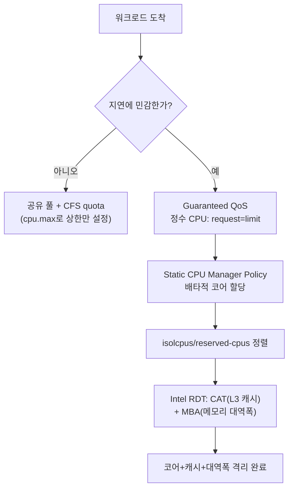

**컨테이너/가상화 성능 고려사항**이란 워크로드를 격리하는 계층(namespace·cgroup·하이퍼바이저)이 실제로 어디에 어떤 비용을 남기는지 이해하고, 그 비용이 지연 분포에 미치는 영향을 관리 가능한 설정으로 바꾸는 것을 말합니다. "컨테이너는 가볍다"는 말은 스케줄링·부팅 비용 관점에서는 대체로 맞지만, 지연에 민감한 서비스를 Kubernetes 위에 올리는 순간 CPU 자원 관리 정책 하나가 꼬리 지연을 좌우하는 경우가 많습니다. 이 장은 그 정책의 대표 사례인 **CPU limit(CFS quota)의 함정**과, 실무에서 이를 대체·보완하는 **isolcpus + Intel RDT(CAT·MBA)** 조합을 다룹니다.

## 이 장을 읽기 전에

이 장은 [03장: CPU Pinning/Affinity 전략](/post/os-optimization/cpu-pinning-affinity-strategy/)에서 다룬 코어 배치의 동기를 전제로 합니다. cgroup·namespace가 "커널이 자원을 나누는 방식"이라는 것과, 스케줄러가 프로세스를 어떤 코어에 둘지 결정한다는 정도만 알면 충분하며, 프로세스 격리 개념은 이후 [16장: Process vs Thread 아키텍처 선택](/post/os-optimization/process-vs-thread-architecture-choice/)에서 더 깊이 다룹니다.

**이 장의 깊이**는 **기초~중급**입니다. 컨테이너·VM 오버헤드가 어디서 오는지, Kubernetes의 CPU limit이 왜 저지연 워크로드에서 문제가 되는지, 그리고 그 대안이 무엇인지를 개념과 명령어 수준에서 정리합니다. **다루지 않는 것**: cgroups v2의 전체 컨트롤러(memory, io 등)와 리소스 제어 세부 메커니즘은 [13장: cgroups v2 리소스 제어](/post/os-optimization/cgroups-v2-resource-control-performance/)로, NUMA 노드 간 배치는 [04장: NUMA CPU Affinity](/post/os-optimization/numa-cpu-affinity-thread-placement/)로, 퍼블릭 클라우드의 CPU steal time·noisy neighbor 심화 분석은 [18장: 클라우드 환경 꼬리 지연](/post/os-optimization/cloud-noisy-neighbor-cpu-steal-time/)으로 위임합니다. 이 장은 그 사이에서 "컨테이너·Kubernetes 계층에서 무엇을 먼저 의심해야 하는가"에 집중합니다.

## 당신의 수준에 맞는 경로

| 수준 | 읽을 부분 | 핵심 목표 |
|------|---------|---------|
| **초보자** | 도입 ~ "컨테이너·가상화 오버헤드의 실체" | 컨테이너·VM·microVM이 격리 비용을 어디에 남기는지 이해 |
| **중급자** | "Kubernetes CPU Limit의 함정" ~ "흔한 오개념" | CFS quota 스로틀링의 발생 조건과 대안을 이해 |
| **전문가** | "판단 기준" ~ "비판적 시각" | static policy·isolcpus·RDT 조합의 설계와 한계를 판단 |

---

## 컨테이너·가상화 오버헤드의 역사와 배경

리눅스 컨테이너의 자원 격리는 두 커널 기능의 조합에서 나옵니다. **namespace**는 mount(2002년경 도입)를 시작으로 PID, network, UTS, IPC, user, cgroup까지 점진적으로 늘어나 프로세스가 "보는" 자원의 뷰를 분리합니다. **cgroups**는 구글 엔지니어 Paul Menage와 Rohit Seth가 시작해 2008년 리눅스 2.6.24에 병합되었고, 프로세스가 "쓸 수 있는" 자원의 양을 통제합니다. LXC(2008)가 이 둘을 조합해 최초의 실용적 컨테이너 런타임을 만들었고, Docker(2013)가 이미지·레이어 개념을 더해 대중화했으며, Kubernetes(2014)가 다수 노드에 걸친 스케줄링·오케스트레이션을 표준화했습니다. cgroup v2 통합 계층구조는 2016년 커널에 병합된 뒤 여러 배포판에서 기본값으로 자리잡았고, 이 장에서 다루는 `cpu.max`·`cpu.stat` 인터페이스도 v2 기준입니다.

가상화 쪽에서는 전가상화 하이퍼바이저(KVM, Xen)가 오래전부터 "완전히 다른 커널"을 격리 단위로 제공해 왔습니다. 컨테이너보다 격리 경계가 강한 대신 게스트 커널 부팅과 하드웨어 에뮬레이션 비용이 따라붙습니다. 이 격차를 줄이려는 시도가 **microVM**(Firecracker, 2018년 AWS 공개)이며, 불필요한 에뮬레이션 장치를 제거해 VM 수준 격리를 컨테이너에 가까운 부팅 속도로 제공합니다. 같은 목표를 다른 방식으로 푸는 것이 **사용자 공간 커널 샌드박스**(gVisor, Kata Containers)로, 게스트 커널 전체를 띄우는 대신 syscall을 가로채거나 경량 VM 안에 표준 런타임을 넣어 컨테이너 인터페이스를 유지하면서 격리를 강화합니다.

## 컨테이너·가상화 오버헤드의 실체

컨테이너의 정상 상태(steady state) 실행 오버헤드는 namespace 뷰 분리와 cgroup 계정 처리 비용뿐이라 VM보다 훨씬 작습니다. 컨테이너는 호스트 커널을 그대로 공유하므로 시스템 콜이 게스트→호스트 전환(VM exit) 없이 직접 처리되고, 별도의 게스트 커널을 부팅할 필요도 없습니다. 반면 전가상화 VM은 하이퍼바이저가 CPU·메모리·디바이스를 에뮬레이션하는 비용과, 중첩 페이지 테이블(EPT/NPT) 변환에 따르는 TLB 미스 증가를 감수해야 합니다. 이 격리 경계의 강도 차이는 그대로 성능과 보안의 트레이드오프로 이어집니다.

이 스펙트럼 위에서 런타임을 고를 때 중요한 것은 "이 워크로드가 신뢰할 수 없는 코드를 실행하는가"와 "콜드스타트가 얼마나 자주 발생하는가"입니다. 일반 `runc` 컨테이너는 오버헤드가 가장 낮지만 커널을 그대로 공유하므로 커널 취약점이 곧 격리 붕괴로 이어질 수 있습니다. gVisor 같은 syscall 가로채기 방식은 격리를 강화하는 대신 syscall이 많은 워크로드에서 상당한 오버헤드를 추가하는 경향이 있고, Kata Containers·Firecracker 같은 경량 VM 방식은 격리는 강하지만 컨테이너보다 부팅 지연이 크며, 정확한 배율은 커널 버전·게스트 이미지 크기·워크로드 특성에 따라 편차가 커서 자체 환경에서 직접 측정해야 합니다. 지연이 마이크로초 단위로 중요한 서비스라면 이 선택 자체가 이미 큰 성능 결정이라는 점을 인지하고, 신뢰 경계가 명확하지 않은 멀티테넌트 환경에서만 강한 격리 런타임을 검토하는 편이 합리적입니다.

## Kubernetes CPU Limit의 함정: CFS Quota와 스로틀링

Kubernetes가 기본으로 사용하는 CPU 제한 메커니즘은 리눅스 **CFS(Completely Fair Scheduler) 대역폭 제어**입니다. cgroup v2의 `cpu.max` 파일은 `"$MAX $PERIOD"` 형식으로 "이 그룹은 매 $PERIOD 동안 최대 $MAX만큼만 CPU 시간을 쓸 수 있다"는 상한을 지정하며, 기본 주기는 100ms입니다. 문제는 이 상한이 **평균**이 아니라 **주기 단위**로 강제된다는 점입니다. 컨테이너가 평균 사용률은 20%여도 요청이 몰리는 짧은 구간에서 주기 할당량을 다 써버리면, 그 주기의 나머지 시간 동안 스케줄러가 해당 프로세스를 강제로 재운(throttle) 뒤 다음 주기까지 실행을 미룹니다. 이 스로틀링은 평균 사용률 지표에는 거의 드러나지 않으면서 p99 지연을 튀게 만드는 대표적인 원인입니다.

**두 방식의 차이를 직접 재현**하려면 cgroup v2 unified hierarchy가 마운트된 리눅스(커널 5.15 이상 권장)에서 아래 스크립트로 확인할 수 있습니다.

```bash
#!/usr/bin/env bash
# 환경: Linux, cgroup v2 unified hierarchy 마운트 필수 (예: Ubuntu 22.04+, 커널 5.15+)
# 실행: sudo bash cfs_throttle_demo.sh
set -euo pipefail
CG=/sys/fs/cgroup/throttle_demo
mkdir -p "$CG"
echo "20000 100000" > "$CG/cpu.max"   # 100ms 주기 중 20ms(20%)만 허용
echo $$ > "$CG/cgroup.procs"

# 평균은 낮지만 순간적으로 몰아 쓰는 버스트 패턴
for i in $(seq 1 5); do
  timeout 0.03 yes > /dev/null || true
  sleep 0.07
done

grep -E 'nr_periods|nr_throttled|throttled_usec' "$CG/cpu.stat"
```

이 스크립트를 실행하면 `nr_throttled`와 `throttled_usec`가 0보다 큰 값으로 나타나는 것을 흔히 볼 수 있습니다. `cpu.max`·`cpu.stat` 필드의 정확한 의미는 [커널 공식 문서: cgroup v2](https://docs.kernel.org/admin-guide/cgroup-v2.html)에 정의되어 있으며, 스로틀 발생 여부는 워크로드의 버스트 패턴과 주기 길이 조합에 따라 달라지므로 자체 환경에서 재현하는 것이 좋습니다. `cpu.max`를 비롯한 cgroups v2 컨트롤러의 나머지 필드와 계층 구조는 [13장: cgroups v2 리소스 제어](/post/os-optimization/cgroups-v2-resource-control-performance/)에서 다룹니다.

## 실무 전환: CPU Limit 지양 + isolcpus·Intel RDT 병행

이런 배경에서 최근 실무 논의는 "지연 민감 워크로드에는 분수(fractional) CPU limit을 아예 걸지 않는다"는 방향으로 수렴하는 경우가 많습니다. 대신 Kubernetes의 [Static CPU Manager Policy](https://kubernetes.io/docs/tasks/administer-cluster/cpu-management-policies/)를 사용해 Guaranteed QoS 클래스(요청=제한, 정수 CPU)로 선언된 컨테이너에는 코어를 **배타적으로** 할당합니다. 배타적으로 할당된 코어의 quota는 주기 최대치와 같게 설정되므로 애초에 CFS 스로틀링 대상이 되지 않고, 다른 컨테이너도 그 코어로 마이그레이션되지 않아 캐시 지역성이 유지됩니다.

Static Policy만으로는 부족한 부분이 두 가지 남습니다. 첫째, Kubernetes CPU Manager는 리눅스 부팅 파라미터인 `isolcpus`(또는 최근 커널의 cgroup v2 `cpuset.cpus.partition=isolated` 방식)를 스스로 인식하지 않으므로, 격리 코어 목록을 `--reserved-cpus`나 `kube-reserved` 설정과 운영자가 직접 맞춰야 합니다. 둘째, 코어를 배타적으로 줘도 같은 소켓의 다른 코어가 L3 캐시와 메모리 대역폭을 두고 여전히 경쟁합니다. 이 두 번째 문제를 해결하는 것이 <strong>Intel RDT(Resource Director Technology)</strong>의 <strong>CAT(Cache Allocation Technology)</strong>와 <strong>MBA(Memory Bandwidth Allocation)</strong>입니다. CAT는 L3 캐시를 비트마스크(CBM) 단위로 나눠 특정 클래스에 전용 구간을 배정하고, MBA는 클래스별 메모리 대역폭 상한을 걸어 "시끄러운 이웃"이 대역폭을 독점하지 못하게 합니다. resctrl 파일시스템을 통해 설정하며, [Red Hat의 엣지 실측 사례](https://www.redhat.com/en/blog/performance-tuning-at-the-edge)에서는 CAT 적용 전 평균 지터가 약 9,000~9,500사이클 수준이었고, 적용 후에는 그래프상 대략 2,000사이클 이하로 크게 줄어든 것으로 관측됩니다.

```bash
# resctrl 인터페이스 마운트 (RDT 설정 창구; 루트 권한 필요, CPU가 CAT/MBA를 지원해야 함)
mount -t resctrl resctrl /sys/fs/resctrl

# 지연 민감 워크로드 전용 클래스(CLOS) 생성
mkdir /sys/fs/resctrl/latency_sensitive

# L3 캐시 비트마스크(CBM)로 전용 구간 배정 (예: 하위 4비트를 이 클래스에 할당)
echo "L3:0=0xf" > /sys/fs/resctrl/latency_sensitive/schemata

# 메모리 대역폭 상한 추가 (예: 전체 대역폭의 30%로 제한)
echo "MB:0=30" >> /sys/fs/resctrl/latency_sensitive/schemata

# 대상 프로세스를 해당 클래스에 배정
echo <PID> > /sys/fs/resctrl/latency_sensitive/tasks
```

CBM의 최소 연속 비트 수, 사용 가능한 클래스(CLOS) 개수, MBA 값의 해석 방식(선형·비선형)은 프로세서 세대마다 다른 **구현 정의** 영역이므로, 실제 운영 전에 대상 하드웨어의 `/sys/fs/resctrl/info`를 확인해야 합니다. 코어 배치 자체(affinity 설정 코드)는 [03장: CPU Pinning/Affinity 전략](/post/os-optimization/cpu-pinning-affinity-strategy/)에서 다루므로 여기서는 반복하지 않습니다.

지금까지 설명한 판단 흐름을 하나로 모으면, 워크로드의 지연 민감도에 따라 CFS quota만으로 충분한지 아니면 static policy·isolcpus·RDT까지 쌓아야 하는지가 갈립니다.



## 흔한 오개념

<strong>"CPU limit을 걸면 그 성능이 보장된다"</strong>는 오해가 가장 흔합니다. 분수 CPU limit은 CFS quota로 구현되며, 평균 사용률이 낮아도 짧은 버스트 구간에서 주기 할당량을 다 쓰면 스로틀링이 걸립니다. limit은 "상한"이지 "보장"이 아니며, 지연 민감 워크로드에는 오히려 역효과를 낼 수 있습니다.

<strong>"컨테이너는 가상화가 아니므로 오버헤드가 전혀 없다"</strong>도 과장입니다. namespace·cgroup 오버헤드는 전가상화 대비 작을 뿐이지 0은 아니며, 어떤 컨테이너 런타임을 쓰느냐(runc vs gVisor vs Kata)에 따라 오버헤드 프로파일이 크게 달라집니다. "컨테이너=오버헤드 없음"이라는 단순화는 런타임 선택을 소홀히 하게 만듭니다.

<strong>"isolcpus만 설정하면 코어 격리가 끝난다"</strong>는 것도 틀렸습니다. `isolcpus`는 일반 스케줄러의 부하 분산 대상에서 코어를 빼는 것일 뿐, 같은 소켓의 다른 코어가 L3 캐시나 메모리 대역폭을 두고 경쟁하는 것까지 막지는 못합니다. 캐시·대역폭 경합까지 통제하려면 Intel RDT(CAT·MBA) 같은 별도 메커니즘이 필요합니다.

## 판단 기준

| 상황 | 권장 | 비권장 |
|------|------|--------|
| 지연 민감·실시간에 가까운 워크로드 | Guaranteed + Static Policy(정수 코어), limit 미설정 | 분수 CPU limit(CFS quota)만 설정 |
| 배치·베스트에포트 워크로드 | request만 설정하거나 느슨한 limit | 필요 이상으로 낮은 limit로 스로틀 유발 |
| 멀티테넌트 노드에서 캐시·대역폭 경합 우려 | isolcpus/static policy + Intel RDT(CAT·MBA) 병행 | 코어만 격리하고 캐시·대역폭은 방치 |
| 미신뢰 코드를 실행하는 멀티테넌트 환경 | gVisor·Kata 등 강한 격리 런타임 검토 | 기본 runc만으로 충분하다고 가정 |
| 콜드스타트가 잦은 서버리스형 워크로드 | 컨테이너 또는 Firecracker류 microVM | 전가상화 VM을 그대로 재사용 |

## 비판적 시각: 한계와 트레이드오프

"CPU limit을 지양하라"는 조언이 모든 환경에 맞는 정답은 아닙니다. 신뢰할 수 없는 다중 테넌트 클러스터에서 limit을 완전히 없애면 한 워크로드가 노드 CPU를 독점해 다른 테넌트에 피해를 줄 수 있으므로, 이 조언은 "지연 민감 워크로드 + 어느 정도 신뢰 가능한 환경"이라는 전제 위에서 성립합니다. Static CPU Manager Policy도 만능은 아닙니다. 정수 코어 단위로만 배타적 할당이 가능해 요청이 애매한 크기일 때 코어가 파편화되고 전체 활용률이 떨어질 수 있으며, 정책을 static에서 none으로 되돌리려면 노드를 드레인하고 상태 파일을 지운 뒤 kubelet을 재시작해야 하는 등 운영 부담이 있습니다. Intel RDT는 하드웨어 의존도가 높아 Intel Xeon Scalable 계열 등 지원 프로세서가 제한적이고, AMD도 유사한 QoS 확장을 제공하지만 세부 동작이 다르므로 이식성이 낮습니다. `isolcpus` 부팅 파라미터는 정적이라 재부팅 없이 격리 코어 집합을 바꿀 수 없다는 한계도 있어, 최근 커널은 cgroup v2의 `cpuset.cpus.partition` 같은 동적 격리 기능으로 점차 옮겨가는 중입니다. 이런 전환 자체가 성능을 해친다는 반론도 있는데, [2025년 발표된 한 학술 논문](https://arxiv.org/abs/2510.10747)은 CPU limit이 백그라운드 작업을 제외하면 오히려 자원 관리·과금 모델 전체를 재검토해야 할 만큼 해롭다는 주장을 펴며, 이 장에서 다룬 방향 전환이 업계에서 아직 논쟁 중임을 보여줍니다.

## 마무리

- CFS quota 기반 CPU limit이 평균 사용률과 무관하게 버스트 구간에서 스로틀링을 유발하는 원리를 설명할 수 있다.
- 컨테이너·microVM·전가상화 VM·샌드박스 런타임의 오버헤드 원인과 격리 강도 차이를 구분할 수 있다.
- Kubernetes Static CPU Manager Policy가 배타적 코어 할당으로 스로틀링을 회피하는 원리를 설명할 수 있다.
- isolcpus만으로는 캐시·메모리 대역폭 경합을 막지 못한다는 점과, Intel RDT(CAT·MBA)가 이를 보완하는 방식을 설명할 수 있다.
- CPU limit 지양 전략이 성립하는 전제(신뢰 가능한 환경, 지연 민감 워크로드)와 한계를 판단할 수 있다.

**이전 장**: [Huge TLB Pages 활용](/post/os-optimization/huge-tlb-pages-utilization/) (챕터 10)

다음 장에서는 **IRQ·인터럽트 최적화**를 다룹니다. 인터럽트 처리도 컨테이너·CPU 격리 정책과 마찬가지로 "어느 코어가 무엇을 처리하는가"의 문제이며, 이 장에서 격리해 둔 지연 민감 코어에 네트워크 인터럽트가 다시 몰리면 지금까지의 격리 효과가 무너질 수 있습니다.

→ [IRQ 최적화](/post/os-optimization/irq-interrupt-optimization/) (챕터 12)
