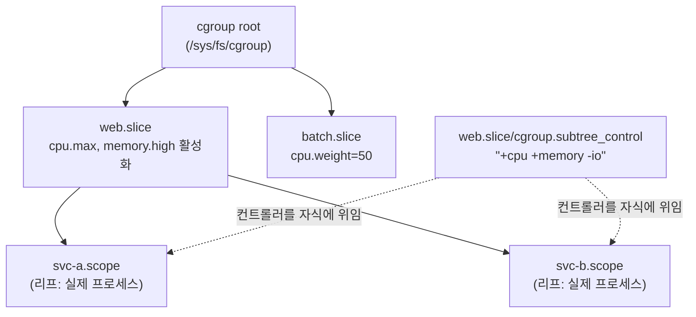

**cgroups v2 리소스 제어**란 리눅스 커널이 프로세스 그룹 단위로 CPU·메모리·블록 I/O 사용량을 하나의 통합 계층(unified hierarchy)에서 배분·제한·관측하는 메커니즘이다. [이전 장](/post/os-optimization/irq-interrupt-optimization/)에서 인터럽트를 특정 코어로 몰아 격리 코어를 인터럽트로부터 비웠다면, 이 장은 그렇게 확보한 코어·메모리·I/O 대역폭을 여러 워크로드 사이에서 어떻게 나눌지를 다룬다. 문제는 리소스 제어가 "숫자를 하나 정하면 끝"이 아니라는 데 있다 — CPU 사용량을 제한하는 `cpu.max` 값 하나만 워크로드 특성과 안 맞아도, 평균 사용률이 한계의 절반에 불과한 서비스가 100ms 주기마다 강제로 멈춰 서는 지연 스파이크를 겪을 수 있다. 이 장은 cgroups v2의 통합 계층 구조가 v1의 무엇을 고쳤는지, `cpu`·`memory`·`io` 컨트롤러 각각이 지연시간에 어떤 방식으로 개입하는지, 그리고 "CPU limit"이라는 이름의 함정이 왜 저지연 워크로드에 특히 위험한지를 정리한다.

## 이 장을 읽기 전에

**선행 장**: [Context Switch 비용 분석과 회피](/post/os-optimization/context-switch-cost-avoidance/)(01장)에서 스케줄러가 시간을 배분하는 단위를, [CPU Pinning/Affinity 전략](/post/os-optimization/cpu-pinning-affinity-strategy/)(03장)에서 `cpuset`과 affinity mask의 관계를, [IRQ 최적화](/post/os-optimization/irq-interrupt-optimization/)(12장)에서 인터럽트 격리를 다뤘다. 이 장은 그 위에서 "얼마나 쓰게 허용할 것인가"를 다룬다.

**전제 지식**: 프로세스/스레드가 커널 스케줄러로부터 시간 조각을 배분받는다는 사실과, 리눅스에서 `/sys/fs/cgroup` 아래가 파일시스템처럼 보이는 인터페이스라는 정도만 알면 충분하다. 세부 조작법은 본문에서 처음부터 설명한다.

**이 장의 깊이**: 중급. 통합 계층(unified hierarchy)과 `cgroup.subtree_control`의 동작 원리부터 시작해, `cpu`·`memory`·`io` 세 컨트롤러의 파라미터가 지연시간 분포에 개입하는 구체적 메커니즘, 그중에서도 CFS bandwidth throttling이 만드는 함정까지 다룬다.

**다루지 않는 것**: 코어 목록을 골라 스레드를 못박는 절차와 NUMA 노드 배치는 각각 [03장](/post/os-optimization/cpu-pinning-affinity-strategy/)·[04장](/post/os-optimization/numa-cpu-affinity-thread-placement/)의 몫이다. 컨테이너 런타임과 Kubernetes가 이 인터페이스를 자동화하는 방식, 그리고 "CPU limit을 걸지 않는 편이 낫다"는 최신 운영 정책은 [11장](/post/os-optimization/container-virtualization-performance-considerations/)에서 이어받는다. IRQ 라우팅 자체는 [12장](/post/os-optimization/irq-interrupt-optimization/)에서 이미 다뤘고, 메모리 페이지를 스왑 후보에서 완전히 빼는 `mlock`/`mlockall`은 [다음 장](/post/os-optimization/memory-locking-mlock-mlockall/)(14장)의 몫이다.

## 당신의 수준에 맞는 경로

| 수준 | 읽을 부분 | 핵심 목표 |
|------|---------|---------|
| **초보자** | "cgroups v2의 등장 배경" ~ "통합 계층 구조와 컨트롤러 활성화" | v1에서 v2로 바뀐 이유와 unified hierarchy 조작법 이해 |
| **중급자** | "cpu 컨트롤러와 CFS bandwidth throttling" ~ "io 컨트롤러" | 컨트롤러별 파라미터가 지연시간에 개입하는 방식 습득 |
| **전문가** | "판단 기준" ~ "비판적 시각" | 컨트롤러 선택과 throttling 함정을 진단·회피하는 판단 |

---

## cgroups v2의 등장 배경 (역사·배경)

cgroups는 2006~2007년 Google 엔지니어 Paul Menage와 Rohit Seth가 "process containers"라는 이름으로 시작해 리눅스 커널 2.6.24(2008년)에 병합됐다. 초기 구조(현재의 cgroups v1)는 `cpu`, `memory`, `blkio` 같은 컨트롤러마다 별도의 계층(hierarchy)을 마운트할 수 있게 했는데, 이 유연성이 실제로는 복잡성으로 돌아왔다 — 프로세스가 컨트롤러별로 서로 다른 트리에 속할 수 있어 "이 프로세스가 지금 어떤 제약 아래 있는가"를 추적하기 어려웠고, 상태 변화를 알리는 `release_agent` 메커니즘은 알림마다 새 프로세스를 fork해야 해서 이벤트가 잦은 환경에서 비용이 누적됐다. cgroups v2는 이 문제를 정면으로 겨냥해 **모든 컨트롤러가 하나의 통합 계층(single unified hierarchy)에 참여**하도록 재설계됐고, 리눅스 커널 4.5(2016년)에서 공식 안정 인터페이스로 릴리스됐다. 이후 systemd·containerd·Docker 같은 상위 도구들이 v2를 기본값으로 채택하면서, 최신 배포판에서는 v2가 사실상 표준 인터페이스가 됐다.

## 통합 계층 구조와 컨트롤러 활성화

v2에서는 `/sys/fs/cgroup`이 유일한 마운트 지점이고, 그 아래 디렉터리 트리가 곧 cgroup 계층이다. 각 디렉터리는 `cgroup.procs`(그 cgroup에 속한 프로세스 목록), `cgroup.subtree_control`(자식에게 넘겨줄 컨트롤러 목록), 그리고 `cpu.max`·`memory.high`처럼 활성화된 컨트롤러가 노출하는 파일들을 갖는다. 컨트롤러는 기본적으로 꺼져 있으며, 부모 cgroup의 `cgroup.subtree_control`에 `+cpu`처럼 써 넣어야 그 컨트롤러가 **자식들에게** 적용된다 — 이 한 단계가 v2의 핵심 규칙인 <strong>"no internal process constraint"</strong>로 이어진다. 즉 어떤 cgroup이 자식에게 리소스를 분배하려면 그 cgroup 자신은 프로세스를 직접 가지고 있으면 안 된다(리프 노드만 프로세스를 담당). 이 제약 때문에 실무에서는 프로세스를 항상 트리의 말단(leaf) cgroup에 배정하고, 중간 노드는 순수하게 분배 정책만 담당하도록 설계한다. 이 규칙과 컨트롤러 파일 각각의 정확한 의미는 커널 공식 문서인 [Control Group v2](https://docs.kernel.org/admin-guide/cgroup-v2.html)에 정리돼 있다.



아래는 그대로 실행할 수 있는 조작 순서다(v2가 마운트된 리눅스, root 권한 필요). `mkdir`만으로 새 cgroup이 생기고, 삭제는 `rmdir`로 한다 — 별도 시스템 콜 래퍼 없이 파일시스템 연산이 곧 API다.

```bash
# web.slice cgroup 생성 후 자식에게 cpu·memory 컨트롤러 위임
mkdir -p /sys/fs/cgroup/web.slice
echo "+cpu +memory" > /sys/fs/cgroup/web.slice/cgroup.subtree_control

# 실제 프로세스를 담을 리프 cgroup 생성
mkdir -p /sys/fs/cgroup/web.slice/svc-a.scope

# 현재 셸(그리고 이후 자식 프로세스)을 리프 cgroup으로 이동
echo $$ > /sys/fs/cgroup/web.slice/svc-a.scope/cgroup.procs
```

## cpu 컨트롤러와 CFS bandwidth throttling

`cpu` 컨트롤러는 두 가지 서로 다른 제어 방식을 제공한다. **`cpu.weight`**는 `[1, 10000]` 범위의 값(기본 100)으로 코어가 부족할 때 cgroup들 사이의 **비례 배분**만 정하며, 다른 cgroup이 쉬고 있으면 남는 시간을 자유롭게 더 쓸 수 있다. **`cpu.max`**는 `"$MAX $PERIOD"` 형식의 절대 상한으로, 예를 들어 `"50000 100000"`은 100ms(`$PERIOD`) 주기마다 최대 50ms(`$MAX`)만 쓸 수 있다는 뜻이다. 이 상한은 CFS(Completely Fair Scheduler)의 **bandwidth control** 서브시스템이 강제하며, 한 주기 안에서 quota를 다 쓴 태스크 그룹은 그 주기가 끝날 때까지 실행 자체가 보류된다.

문제는 이 throttling이 **평균 사용률과 무관하게** 발생할 수 있다는 점이다. 대부분의 서비스는 할당된 코어 수보다 훨씬 많은 스레드 풀을 유지하는데("논리 코어의 2배" 같은 관행이 흔하다), 순간적으로 요청이 몰려 스레드들이 동시에 깨어나면 짧은 시간에 quota를 소진하고 나머지 주기 동안 강제로 잠들었다가 다음 주기에 다시 깨어난다. Dan Luu가 정리한 사례([The container throttling problem](https://danluu.com/cgroup-throttling/))에서는 평균 CPU 사용률이 한계의 40% 수준인 컨테이너가, 100ms 주기 내의 짧은 병렬성 폭발 때문에 반복적으로 throttle되어 지연시간 히스토그램에 "빠른 봉우리 + ~100ms 지연된 봉우리"라는 이중 분포가 나타나는 현상을 보고한다. 이 문제를 완화하기 위해 리눅스 5.14(2021년)부터 **`cpu.max.burst`**가 추가됐는데, 이전 주기에 남은 미사용 quota를 누적해 두었다가 순간적인 초과 사용을 흡수하는 방식이다. 커널 문서는 이를 "미래의 부족분을 미리 당겨 쓰는" 기능으로 설명하며, 그 대가로 다른 사용자와의 간섭(interference)이 늘어날 수 있음을 명시한다([CFS Bandwidth Control](https://docs.kernel.org/scheduler/sched-bwc.html)).

throttling이 실제로 일어나고 있는지는 각 cgroup의 `cpu.stat` 파일로 확인한다.

```text
$ cat /sys/fs/cgroup/web.slice/svc-a.scope/cpu.stat
usage_usec 8734521
user_usec 7021044
system_usec 1713477
nr_periods 92104
nr_throttled 41823
throttled_usec 2107345
```

여기서 `nr_periods` 대비 `nr_throttled`의 비율이 throttling 빈도를, `throttled_usec` 누적값이 총 지연 손실을 보여준다. 위 예시는 약 45%의 주기에서 throttle이 걸렸다는 뜻이며, `usage_usec`만 보면 평균 사용률이 낮아 보여도 이 비율이 높다면 지연 스파이크를 의심해야 한다. 아래는 이 값을 코드에서 직접 읽어 throttle 비율을 계산하는 예제로, 그대로 컴파일할 수 있다(`g++ -std=c++17 cpu_stat.cpp`, 실행에는 대상 cgroup 경로에 대한 읽기 권한이 필요하다).

```cpp
#include <fstream>
#include <string>
#include <unordered_map>
#include <iostream>

// cpu.stat은 "key value" 형식의 줄이 반복되는 단순 텍스트 파일이다.
std::unordered_map<std::string, long long> parse_cpu_stat(const std::string& path) {
  std::unordered_map<std::string, long long> stats;
  std::ifstream file(path);
  std::string key;
  long long value;
  while (file >> key >> value) {
    stats[key] = value;
  }
  return stats;
}

int main() {
  auto stats = parse_cpu_stat("/sys/fs/cgroup/web.slice/svc-a.scope/cpu.stat");
  if (stats["nr_periods"] == 0) {
    std::cout << "관측된 period가 아직 없음\n";
    return 0;
  }
  double throttle_pct = 100.0 * stats["nr_throttled"] / stats["nr_periods"];
  std::cout << "throttled periods: " << throttle_pct << "%\n";
  std::cout << "throttled_usec 누적: " << stats["throttled_usec"] << " us\n";
}
```

이 수치는 커널 버전·`cpu.max.burst` 설정·워크로드의 스레드 수에 따라 크게 달라지므로, 절대치를 외우기보다는 배포 환경에서 부하 시험 중 `cpu.stat`을 주기적으로 스크래이핑해 회귀를 감시하는 용도로 쓴다.

## memory 컨트롤러: memory.max·memory.high·memory.low

`memory` 컨트롤러는 세 단계의 서로 다른 압력 수준을 제공한다. **`memory.high`**는 소프트 스로틀링 한계로, 사용량이 이 값을 넘으면 커널이 해당 cgroup에 회수 압력(reclaim pressure)을 걸어 할당 속도를 늦추지만 OOM(Out-Of-Memory) kill로 이어지지는 않는다. **`memory.max`**는 하드 리밋으로, 회수를 시도해도 사용량을 이 값 아래로 낮추지 못하면 그때 비로소 OOM killer가 개입해 해당 cgroup 안의 프로세스를 종료한다. **`memory.low`**는 "best-effort" 보호 한계로, 다른 보호 장치가 없는 cgroup들이 메모리 압박을 받을 때 우선적으로 회수 대상이 되도록 만들어 이 값 이하의 사용량은 상대적으로 보호받는다. 세 값의 관계를 요약하면, `memory.low`는 "남들보다 늦게 뺏긴다", `memory.high`는 "넘으면 숨쉬기 힘들어진다", `memory.max`는 "넘으면 죽는다"에 가깝다.

지연시간 관점에서 중요한 것은 `memory.high` 도달 시 발생하는 회수 압력 자체가 지연 스파이크의 원인이 될 수 있다는 점이다. 페이지 회수는 동기적으로 개입할 수 있어, 저지연 경로에서 메모리 할당이 갑자기 느려지는 형태로 나타난다. 이 압력과 OOM 이벤트는 `memory.events` 파일로 관측한다.

```bash
# 소프트 한계: 넘으면 회수 압력, OOM은 없음
echo "500M" > memory.high

# 하드 한계: 회수해도 못 낮추면 OOM killer 발동
echo "600M" > memory.max

# low/high/max/oom/oom_kill 이벤트 발생 횟수 확인
cat memory.events
```

`memory.events`의 `high` 카운터가 계속 증가한다면 `memory.high`가 실제 작업 세트(working set)보다 낮게 잡혀 있다는 신호이고, `oom_kill` 카운터가 하나라도 늘었다면 `memory.max`가 이미 한 번은 프로세스를 죽였다는 뜻이다. 메모리 페이지를 아예 스왑 후보에서 빼내 회수 압력의 영향권 밖에 두는 방법은 [다음 장](/post/os-optimization/memory-locking-mlock-mlockall/)에서 `mlock`/`mlockall`로 다룬다.

## io 컨트롤러: io.max·io.weight·io.latency

`io` 컨트롤러도 `cpu`와 비슷하게 절대 상한과 비례 배분 두 축을 갖는다. **`io.max`**는 특정 블록 디바이스에 대해 최대 BPS(byte per second)·IOPS를 지정하는 하드 리밋이고, **`io.weight`**는 디바이스 대역폭이 경합 상태일 때 cgroup들 사이에서 비례적으로 나누는 값이다. 여기에 v2에서 추가된 **`io.latency`**는 방향이 다르다 — 특정 목표 지연시간(target latency)을 지정해 두면, 그 cgroup의 I/O 지연이 목표를 넘어설 때 우선순위가 낮은 다른 cgroup의 I/O를 제한해 지연 민감 cgroup을 보호하는 방식으로 동작한다. 즉 `io.max`/`io.weight`가 "얼마나 쓸 수 있는가"를 정한다면, `io.latency`는 "이 cgroup은 지연이 이 정도를 넘지 않아야 한다"는 서비스 수준 목표를 스케줄링 정책으로 바꾼다.

```bash
# 디바이스 8:0에 대해 읽기 대역폭을 50MB/s로 제한(배치 작업용 cgroup)
echo "8:0 rbps=52428800" > io.max

# 디바이스 8:0에서 이 cgroup의 목표 지연을 4ms로 선언(지연 민감 cgroup용)
echo "8:0 target=4000" > io.latency
```

블록 I/O 경로 자체의 큐잉·스케줄러 선택·파일시스템별 차이 같은 심화 주제는 이 트랙의 범위를 넘어서며, I/O 트랙(Tr.09)에서 이어받는다. 이 장에서는 "cgroups v2가 I/O 대역폭과 지연을 어떤 손잡이로 제어하는가"까지만 다룬다.

## 흔한 오개념

- **"CPU limit을 걸면 지연이 안정된다"**: `cpu.max`는 평균 사용률을 낮추는 데는 효과가 있지만, 멀티스레드 워크로드에서는 순간적인 병렬성 폭발이 짧은 시간에 quota를 소진시켜 오히려 100ms 단위의 throttling 스파이크를 만든다. 평균이 한계보다 훨씬 낮아도 꼬리 지연은 악화될 수 있다.
- **"memory.max를 넘으면 즉시 죽는다"**: 실제로는 커널이 먼저 회수(reclaim)를 시도하고, 그래도 한계 아래로 못 내리는 경우에만 OOM killer가 개입한다. 회수 자체가 이미 지연에 영향을 주므로, OOM이 뜨기 전 단계인 `memory.high` 압력을 `memory.events`로 먼저 관찰하는 것이 진단에 유리하다.
- **"cgroups의 cpu 컨트롤러 하나로 코어 격리가 끝난다"**: `cpu.weight`/`cpu.max`는 "시간을 얼마나 배분받는가"를 정할 뿐, "어느 물리 코어에서 도는가"는 정하지 않는다. 특정 코어에 배타적으로 묶는 작업은 `cpuset` 컨트롤러나 [03장](/post/os-optimization/cpu-pinning-affinity-strategy/)의 affinity API가 맡고, NUMA 노드 배치는 [04장](/post/os-optimization/numa-cpu-affinity-thread-placement/)이 맡는다.

## 판단 기준

| 상황 | 권장 | 비권장 |
|------|------|--------|
| 저지연 워크로드의 CPU 제한 | `cpu.weight`로 비례 배분, 상한이 꼭 필요하면 `cpu.max.burst` 병행 | 빠듯한 `cpu.max` quota로 100ms 주기 throttling 유발 |
| 멀티스레드 풀 크기 설계 | 스레드 풀 크기를 `cpu.max` 코어 수에 맞춰 축소하거나 IO/CPU 스레드 풀 분리 | "논리 코어의 2배" 관행을 cgroup 제한 환경에 그대로 적용 |
| 메모리 사용량 조기 경보 | `memory.high`로 회수 압력을 먼저 걸고 `memory.events`로 추세 관찰 | `memory.max`만 걸고 OOM 발생으로 뒤늦게 알아차림 |
| 배치 작업과 지연 민감 서비스 공존 | `io.latency`로 지연 민감 cgroup을 보호, 배치는 `io.weight`를 낮게 | 모든 cgroup에 동일한 `io.max`만 적용 |
| 특정 코어·NUMA 노드 격리 | `cpuset` 또는 03·04장의 affinity 절차 사용 | `cpu` 컨트롤러만으로 코어 격리가 끝났다고 가정 |
| 컨테이너 오케스트레이터 환경 운용 | [11장](/post/os-optimization/container-virtualization-performance-considerations/)의 정책(요청 중심, limit 지양)과 병행 판단 | 오케스트레이터를 우회해 cgroup 파일을 직접 수정 |

## 비판적 시각: 한계와 트레이드오프

CFS bandwidth control의 **100ms 기본 주기**는 근본적으로 시간을 뭉텅이로 나누는 방식이라, 그 안에서 일어나는 순간적 병렬성 폭발을 세밀하게 제어하지 못한다. `cpu.max.burst`는 이 문제를 완화하지만 해결하지는 않는다 — 미사용 quota를 빌려 쓰는 대신 다른 워크로드와의 간섭이 늘어나는 트레이드오프를 그대로 안고 있으며, 커널 문서 스스로 이를 "미래의 부족분을 미리 당겨 쓰는" 기능으로 규정한다. 근본적인 해결에는 애플리케이션 쪽에서 스레드 풀 크기를 할당된 코어 수에 맞추거나, I/O 대기와 CPU 연산을 분리된 풀로 나누는 구조적 변경이 필요한 경우가 많다. **`memory.high`의 회수 압력** 역시 공짜가 아니다 — 회수 자체가 페이지 스캔·swap-out을 동반하므로, 저지연 경로에서 예측 못한 지연으로 나타날 수 있다. **cgroups v1과 v2가 혼재하는 배포 환경**(구버전 커널이나 일부 레거시 도구가 여전히 v1을 기대하는 경우)에서는 같은 컨트롤러 이름이라도 인터페이스와 의미가 달라 혼란을 유발할 수 있으므로, 배포 대상 커널·배포판의 기본 계층이 v2인지 먼저 확인해야 한다. 마지막으로, cgroups v2는 **단일 머신 안에서의 배분 도구**이므로 여러 머신에 걸친 용량 계획이나 오토스케일링 정책까지 대체하지 않으며, 오케스트레이터 레벨의 정책 판단은 [11장](/post/os-optimization/container-virtualization-performance-considerations/)과 함께 봐야 한다.

## 마무리

이 장을 읽은 뒤 다음을 스스로 점검할 수 있어야 한다.

- [ ] cgroups v1의 다중 계층 구조가 어떤 문제를 낳았고, v2의 unified hierarchy가 이를 어떻게 고쳤는지 설명할 수 있다.
- [ ] `cgroup.subtree_control`과 "no internal process constraint"가 왜 프로세스를 리프 cgroup에만 두게 만드는지 이해했다.
- [ ] `cpu.weight`와 `cpu.max`의 차이, 그리고 CFS bandwidth throttling이 평균 사용률과 무관하게 발생할 수 있는 이유를 설명할 수 있다.
- [ ] `cpu.stat`의 `nr_throttled`/`throttled_usec`로 throttling을 실제로 관측할 수 있다.
- [ ] `memory.low`/`memory.high`/`memory.max`가 각각 무엇을 보호하고 무엇을 막는지 구분할 수 있다.
- [ ] `io.max`(상한)와 `io.latency`(목표 지연 보호)의 방향이 다르다는 점과, 코어/NUMA 격리는 03·04장의 몫이라는 경계를 구분할 수 있다.

**다음 장에서는** 메모리 페이지를 스왑 후보에서 완전히 제외해 회수 압력 자체의 영향을 받지 않게 만드는 `mlock`/`mlockall`을 다룬다. 이 장에서 본 `memory.high`의 회수 압력이 지연 스파이크의 원인이 될 수 있다면, 다음 장은 애초에 회수 대상에서 빠지는 메모리 고정 전략으로 그 문제에 접근한다.

→ [Memory Locking](/post/os-optimization/memory-locking-mlock-mlockall/)
