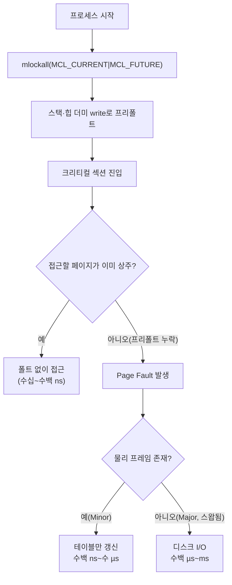

**Memory Locking**이란 `mlock`/`mlockall` 계열 시스템 콜로 프로세스 가상 주소 공간의 특정 페이지를 물리 메모리(RAM)에 고정해, 커널의 페이지 회수(reclaim) 대상에서 제외시키는 기법을 말합니다. 지연시간을 µs 단위로 관리하는 프로세스에서는 실행 중 어느 순간이든 예상치 못한 **major page fault**(디스크·스왑 I/O를 동반하는 폴트)가 끼어드는 것이 치명적입니다. 평소에는 수십~수백 ns로 끝나던 메모리 접근이, 한 번의 스왑 인(swap-in)만으로 수백 µs에서 수 ms까지 늘어질 수 있기 때문입니다. 이 장은 이런 폴트를 원천 차단하기 위해 메모리를 RAM에 못박는 전략과, 그 대가로 지는 책임(과다 커밋 위험, OOM 노출, 운영 복잡도)을 함께 다룹니다.

## 이 장을 읽기 전에

**전제 지식**: [cgroups v2 리소스 제어](/post/os-optimization/cgroups-v2-resource-control-performance/)에서 다룬 메모리 컨트롤러의 회수·제한 개념과, 가상 메모리에서 페이지가 필요할 때만 물리 프레임에 매핑된다는 demand paging의 기본 그림을 이미 안다고 가정합니다. 스왑(swap)이 "물리 메모리가 부족할 때 페이지를 디스크로 내보내는 메커니즘"이라는 것 정도만 알면 충분합니다.

**이 장의 깊이**: 이 장은 **심화** 난이도로, `mlock`/`mlockall`/`mlock2`의 정확한 의미론, `RLIMIT_MEMLOCK`이 막는 것과 막지 않는 것, 실시간 프로세스가 크리티컬 섹션 진입 전에 스택·힙을 미리 건드려 두는 프리폴트(pre-fault) 패턴, 그리고 메모리 고정이 시스템 전체 메모리 압박에 미치는 부작용을 다룹니다.

**다루지 않는 것**: NUMA 노드별로 어디에 메모리를 배치할지는 [NUMA CPU Affinity·스레드 배치](/post/os-optimization/numa-cpu-affinity-thread-placement/)와 [Tr.04: NUMA 메모리 할당·지역성](/post/memory-optimization/numa-memory-allocation-locality/)으로, huge page 자체의 TLB 이점과 설정법은 [Huge TLB Pages 활용](/post/os-optimization/huge-tlb-pages-utilization/)과 [Tr.04: Huge Pages·Large Pages](/post/memory-optimization/huge-pages-large-pages-mthp/)로, SCHED_FIFO 등 실시간 스케줄링 정책 자체는 [Realtime 스케줄링](/post/os-optimization/realtime-scheduling-sched-ext-eevdf/)으로 위임합니다. 이 장은 "메모리를 어떻게 고정해 폴트를 없애는가"에 집중합니다.

## 당신의 수준에 맞는 경로

| 수준 | 읽을 부분 | 핵심 목표 |
|------|---------|---------|
| **초보자** | "메모리 고정의 배경" ~ "Page Fault: Minor와 Major" | 페이지 폴트 두 종류와 mlock이 무엇을 막는지 이해 |
| **중급자** | "mlock 계열 API" ~ "스택·힙 프리폴트 패턴" | RLIMIT_MEMLOCK 제약 안에서 mlockall을 올바르게 적용 |
| **전문가** | "판단 기준" ~ "비판적 시각" | 메모리 고정의 OOM·과다 커밋 위험을 평가하고 도입 여부 판단 |

---

## 메모리 고정의 배경 (역사·배경)

메모리를 스왑에서 보호하는 요구는 실시간(real-time) 시스템에서 먼저 불거졌습니다. POSIX.1b(IEEE Std 1003.1b-1993)는 실시간 확장의 일부로 `mlock`/`munlock`/`mlockall`/`munlockall`을 표준화했고, 목적은 "실시간 프로세스가 페이지 폴트로 인한 예측 불가능한 지연을 겪지 않도록" 하는 것이었습니다. Linux는 이 API를 오래전부터 구현해 왔고, 이후 사용 편의를 넓히는 확장이 이어졌습니다. Linux 2.6.9(2004)는 `RLIMIT_MEMLOCK` 제한을 도입해 비특권 프로세스가 잠글 수 있는 메모리량에 상한을 두었고, 특권 프로세스(`CAP_IPC_LOCK`)는 이 제한에서 예외로 두었습니다. Linux 4.4(2016)는 `mlock2`와 `MCL_ONFAULT` 플래그를 추가해, 매핑 전체를 즉시 물리 메모리에 채우지 않고 실제로 접근하는 시점에만 잠그는 지연 잠금(lazy locking)을 가능하게 했습니다. 이 기능은 대형 매핑 중 일부만 실제로 쓰는 애플리케이션에서 mlockall의 초기 비용을 크게 줄여 줍니다 — [man7.org: mlock(2)](https://man7.org/linux/man-pages/man2/mlock.2.html) 문서에 정리되어 있듯, `MCL_ONFAULT`는 mlockall(MCL_CURRENT)의 즉시 populate 동작과 달리 폴트 시점까지 잠금을 미룹니다.

이 기능은 실시간 커널(RT 커널) 계열의 레퍼런스 문서에서 오래 권장되어 온 관용구이기도 합니다. NTP 동기화 데몬 chrony는 `chronyd -m` 옵션으로 자기 자신을 mlockall로 고정하는데, 공식 문서는 이 옵션을 "chronyd를 RAM에 고정해 절대 페이징되지 않도록 한다"고 설명하며, `-P`(SCHED_FIFO 실시간 스케줄러 우선순위) 옵션과 함께 쓰는 것을 전제로 합니다 — [man.archlinux.org: chronyd(8)](https://man.archlinux.org/man/chronyd.8.en). 시각 동기화처럼 지터(jitter)가 정확도에 직결되는 데몬조차 메모리 고정과 실시간 스케줄링을 묶어서 쓴다는 점은, 이 두 기법이 원래 한 세트로 설계되었다는 것을 보여줍니다.

## Page Fault: Minor와 Major

페이지 폴트는 프로세스가 접근하려는 가상 주소가 아직 물리 프레임에 매핑되어 있지 않을 때 커널이 개입하는 이벤트입니다. **Minor fault**는 물리 프레임 자체는 이미 존재하지만(예: 다른 매핑이나 페이지 캐시에 있음) 현재 프로세스의 페이지 테이블에만 아직 연결되지 않은 경우로, 커널이 테이블 엔트리만 채우면 되므로 대개 수백 ns~수 µs 안에 끝납니다. **Major fault**는 데이터가 디스크(스왑 영역이나 파일 백업 매핑)에만 있어 실제 I/O가 필요한 경우로, 스토리지 지연이 그대로 더해져 수백 µs에서 수 ms까지 늘어질 수 있습니다. 저지연 애플리케이션의 목표는 크리티컬 패스에서 major fault는 물론, 빈번한 minor fault조차 만들지 않는 것입니다.

`mlock`/`mlockall`이 하는 일은 정확히 "이 페이지들을 스왑 후보에서 제외하고, unevictable 리스트로 옮겨 회수 대상에서 뺀다"는 것입니다. 한 번 매핑되고 잠긴 페이지는 그 이후로는 스왑 아웃되지 않으므로 major fault의 원인 하나가 구조적으로 사라집니다. 다만 잠금은 "이미 매핑된" 페이지에만 의미가 있고, 애초에 한 번도 건드리지 않은 가상 주소(예: 아직 커밋되지 않은 스택 영역)는 잠금 호출과 별개로 처음 접근할 때 여전히 폴트가 발생한다는 점을 뒤에서 다시 다룹니다.

## mlock 계열 API

`mlock(addr, len)`은 지정한 주소 범위를 잠그고, `munlock`은 해제합니다. `mlockall(flags)`는 프로세스의 **모든** 매핑을 대상으로 하며 두 플래그를 조합합니다: `MCL_CURRENT`는 호출 시점에 이미 존재하는 매핑을 잠그고 즉시 물리 프레임에 채워 넣고(populate), `MCL_FUTURE`는 이후에 새로 생성되는 매핑(추가 `mmap`, 스택/힙 확장 등)에도 잠금을 자동으로 적용합니다. `mlock2(addr, len, MLOCK_ONFAULT)`와 `mlockall(MCL_CURRENT|MCL_FUTURE|MCL_ONFAULT)`는 즉시 채우는 대신 "접근하는 순간 잠근다"로 동작을 바꿔, 실제로는 쓰지 않을 넓은 매핑을 통째로 선점하는 비용을 줄입니다.

```c
#include <sys/mman.h>
#include <sys/resource.h>
#include <stdio.h>
#include <errno.h>
#include <string.h>

int lock_process_memory(void) {
  // 특권(CAP_IPC_LOCK) 없이는 RLIMIT_MEMLOCK을 넘는 잠금 요청이 실패한다.
  if (mlockall(MCL_CURRENT | MCL_FUTURE) != 0) {
    fprintf(stderr, "mlockall failed: %s\n", strerror(errno));
    return -1;
  }
  return 0;
}

void unlock_process_memory(void) {
  munlockall();
}
```

잠긴 메모리량은 `/proc/[pid]/status`의 **VmLck** 필드로 확인할 수 있고, 시스템 전체 잠금량은 `/proc/meminfo`의 **Mlocked**/**Unevictable** 항목으로 볼 수 있습니다. 잠금 자체는 프로세스가 종료되거나 `execve`를 호출하면 자동으로 풀리며, `fork()`로 만들어진 자식 프로세스는 부모의 잠금 상태를 물려받지 않습니다 — 자식에서도 고정이 필요하면 자식 프로세스에서 다시 `mlockall`을 호출해야 합니다.

`RLIMIT_MEMLOCK`은 비특권 프로세스가 잠글 수 있는 최대 바이트 수를 제한하며, 이 상한을 넘는 `mlock`/`mlockall` 호출은 실패합니다. `CAP_IPC_LOCK` capability를 가진 프로세스는 이 제한에서 예외입니다 — [man7.org: mlock(2)](https://man7.org/linux/man-pages/man2/mlock.2.html). 배포판 기본값은 흔히 64KB 수준으로 작게 잡혀 있어(정확한 기본값은 배포판·PAM 설정에 따라 다르므로 "구현 정의"로 취급합니다), 실전에서 mlockall을 쓰려면 `/etc/security/limits.conf`나 systemd 유닛의 `LimitMEMLOCK=`으로 상한을 올리거나, 컨테이너라면 `--ulimit memlock=`으로 지정하거나, 아예 `CAP_IPC_LOCK`을 부여해야 합니다. 컨테이너 런타임에서 이 제한을 올리는 절차는 오케스트레이터·이미지마다 달라, [컨테이너/가상화 성능 고려사항](/post/os-optimization/container-virtualization-performance-considerations/)에서 다루는 CPU 자원 제어 정책과 마찬가지로 배포 전 스테이징에서 직접 검증해야 하는 항목입니다.

## 스택·힙 프리폴트 패턴

`mlockall(MCL_CURRENT|MCL_FUTURE)`를 호출해도, 아직 한 번도 접근하지 않은 스택 영역(현재 스택 포인터보다 아래쪽, 아직 커밋되지 않은 가드 영역 너머)은 잠금과 무관하게 **최초 접근 시 폴트**가 발생합니다. 크리티컬 섹션 안에서 깊은 함수 호출이나 큰 지역 배열이 스택을 확장시키면, "메모리를 다 잠갔는데도" 그 순간 폴트가 발생하는 이유가 바로 이것입니다. 실시간 애플리케이션 커뮤니티에서 오래 정리되어 온 해법은 크리티컬 섹션에 들어가기 **전에** 충분히 큰 지역 배열을 스택에 만들고 그 전체를 한 번 써서(dummy write) 스택 페이지를 미리 매핑해 두는 것입니다. 이렇게 하면 이후 크리티컬 섹션에서 발생할 수 있는 스택 확장 폴트와, copy-on-write로 인한 폴트까지 사전에 없앨 수 있습니다.

```c
#include <string.h>
#include <sys/mman.h>

#define STACK_RESERVE_BYTES (256 * 1024)  // 크리티컬 섹션에서 예상되는 최대 스택 사용량 여유분

static void touch_stack_pages(void) {
  // 재귀·최적화로 사라지지 않도록 volatile로 표시하고 실제로 씀
  volatile char buf[STACK_RESERVE_BYTES];
  memset((void*)buf, 0, STACK_RESERVE_BYTES);
}

void prepare_realtime_thread(void) {
  mlockall(MCL_CURRENT | MCL_FUTURE);
  touch_stack_pages();   // 크리티컬 섹션 진입 전에 스택 페이지를 미리 물리화
  // 이 지점부터 크리티컬 섹션: 추가 힙 할당·깊은 재귀를 피한다
}
```

이 패턴은 스택에만 적용되는 것이 아니라, 힙에서도 크리티컬 섹션에서 새로 `malloc`할 계획이라면 그 크기만큼을 미리 할당해 두고 한 번 써서 populate하는 동일한 논리를 따릅니다. `mlockall` 호출은 프로세스 생명주기 초반, 실시간 활동을 시작하기 **전에** 해 두어야 하며, `fork()`는 mlockall 이후에 호출하지 않는 것이 안전합니다 — 자식이 잠금을 물려받지 못하는 문제와는 별개로, `fork()` 자체가 페이지 테이블 복제 비용과 예기치 못한 폴트를 만들 수 있기 때문입니다.



## 깨진 사용 패턴: 프리폴트 없는 mlockall

`mlockall`만 호출하고 프리폴트를 생략하면, 잠금 자체는 성공했다는 반환값을 받고도 여전히 크리티컬 섹션에서 폴트를 겪는 코드가 만들어집니다. 아래는 그런 흔한 실수입니다.

```c
// 깨진 코드: mlockall만 호출하고 스택을 미리 건드리지 않음
void run_critical_loop_broken(void) {
  mlockall(MCL_CURRENT | MCL_FUTURE);
  for (int i = 0; i < 1000000; i++) {
    process_one_event();   // 내부에서 깊은 호출·큰 지역 변수를 쓰면
                           // 아직 매핑되지 않은 스택 영역에서 폴트 발생 가능
  }
}
```

**원인**: `MCL_CURRENT`는 호출 "그 순간" 매핑된 페이지만 잠그고 채웁니다. 스택은 커널이 필요할 때 자동으로 확장하는 특수 매핑이라, 호출 시점의 스택 포인터보다 아래쪽은 아직 "존재하지 않는" 페이지로 남아 있고, 이후 함수 호출로 그 영역을 처음 건드리는 순간 잠금과 무관하게 폴트가 발생합니다. **올바른 구현**은 앞 절의 `touch_stack_pages`처럼 예상 최대 스택 사용량만큼을 미리 써서 프리폴트한 뒤 루프에 들어가는 것입니다. **검증 도구**로는 `perf stat -e page-faults,minor-faults,major-faults ./binary`로 루프 구간 전후의 폴트 수를 비교하거나, `/proc/[pid]/status`의 `VmLck`(잠긴 양)와 `getrusage(RUSAGE_SELF, &ru).ru_minflt/ru_majflt`(누적 폴트 수)를 크리티컬 섹션 진입 전후로 스냅샷 비교하면 프리폴트 누락 여부를 직접 확인할 수 있습니다.

## 흔한 오개념

**"mlock하면 그 프로세스는 스왑의 영향을 전혀 안 받는다"는 절반만 맞습니다.** mlock은 잠근 "그 페이지들"만 회수 대상에서 제외할 뿐, 같은 프로세스의 잠그지 않은 다른 페이지나 다른 프로세스의 페이지는 여전히 스왑 후보입니다. 시스템 전체의 스왑 정책(`vm.swappiness` 등)과는 별개의 메커니즘입니다.

**"MCL_FUTURE만 걸어 두면 이후 할당은 폴트 없이 바로 쓸 수 있다"도 정확하지 않습니다.** `MCL_ONFAULT` 없이 `MCL_FUTURE`를 쓰면 새 매핑이 생성되는 즉시 populate되어 최초 접근 폴트는 줄어들지만, 앞서 본 스택 확장처럼 "매핑은 이미 있으나 아직 커밋 안 된" 영역은 이 규칙의 사각지대에 남습니다. 스택처럼 커널이 관리하는 특수 매핑은 별도의 프리폴트 조치가 필요합니다.

**"mlockall을 걸면 OOM killer로부터 안전하다"는 잘못된 믿음입니다.** mlock은 페이지 회수(스왑)를 막을 뿐, 커널 OOM killer의 대상 선정 로직이나 cgroup 메모리 상한(`memory.max`)과는 무관합니다. 오히려 잠긴 메모리는 회수할 수 없으므로, 시스템 전체가 메모리 압박을 받을 때 커널의 선택지를 줄여 다른 프로세스나 그 프로세스 자신이 OOM killer에 걸릴 위험을 **높이는** 방향으로 작용할 수 있습니다.

## 판단 기준

| 상황 | mlockall 도입 | 근거 |
|------|--------------|------|
| RT 우선순위(SCHED_FIFO 등)로 도는 크리티컬 패스 | 권장 | 스왑으로 인한 major fault가 데드라인을 깨뜨림 |
| GC 없는 저지연 서비스(주문 매칭, 시계열 집계 등) | 권장(프리폴트와 함께) | 폴트로 인한 꼬리 지연을 구조적으로 제거 |
| 스왑이 이미 꺼져 있는 노드(예: `swapoff -a`, 일부 컨테이너 기본값) | 이득 제한적 | 스왑 아웃 자체가 없으므로 mlock의 핵심 효과가 무의미해짐(단, minor fault·페이지 캐시 회수 방지 효과는 남을 수 있음) |
| 메모리 오버커밋이 심한 멀티테넌트 노드 | 신중히 | 잠긴 메모리가 커지면 다른 테넌트나 커널이 회수할 여유가 줄어 OOM 위험 상승 |
| 컨테이너·k8s 환경에서 `CAP_IPC_LOCK` 부여가 어려운 경우 | 재검토 | RLIMIT_MEMLOCK 상한 내에서만 동작, 별도 권한 협상 필요 |

## 비판적 시각: 한계와 트레이드오프

메모리 고정은 "폴트를 없앤다"는 이득과 "회수 가능한 메모리를 줄인다"는 비용을 교환하는 전략입니다. 잠긴 페이지가 늘어날수록 커널이 메모리 압박 상황에서 움직일 수 있는 여지가 줄어들고, 이는 잠금을 건 프로세스 자신뿐 아니라 같은 노드의 다른 프로세스에도 영향을 줍니다. 특히 클라우드·컨테이너 환경처럼 물리 메모리가 여러 워크로드에 오버커밋되어 있는 경우, 한 프로세스의 공격적인 mlockall이 노드 전체의 메모리 여유를 잠식해 예상치 못한 OOM을 유발할 수 있습니다. 또한 `RLIMIT_MEMLOCK`을 올리거나 `CAP_IPC_LOCK`을 부여하는 것은 운영·보안 관점에서 별도의 승인 절차를 필요로 하는 경우가 많아, 단순히 "코드 한 줄 추가"로 끝나는 최적화가 아닙니다. 실무에서는 스테이징 환경에서 잠금 대상 크기를 정확히 산정하고, `VmLck`·`Mlocked`·`perf stat -e major-faults`로 실제 효과를 확인한 뒤, 잠금 범위를 크리티컬 패스에 필요한 최소한으로 좁혀 도입하는 접근이 안전합니다.

## 마무리

- [ ] Minor fault와 major fault의 차이를 설명하고, mlock이 정확히 무엇을 막는지 말할 수 있다.
- [ ] `mlockall(MCL_CURRENT|MCL_FUTURE)`와 `MCL_ONFAULT`(또는 `mlock2`)의 동작 차이를 구분할 수 있다.
- [ ] `RLIMIT_MEMLOCK`과 `CAP_IPC_LOCK`의 관계, 그리고 잠금이 fork로 상속되지 않는다는 점을 설명할 수 있다.
- [ ] 스택·힙 프리폴트 패턴이 왜 필요한지, 그리고 이를 생략했을 때 어떤 문제가 생기는지 코드로 설명할 수 있다.
- [ ] mlockall이 시스템 전체 메모리 압박과 OOM 위험에 미치는 부작용을 판단 기준으로 제시할 수 있다.

**다음 장**에서는 [Signal Handling 오버헤드](/post/os-optimization/signal-handling-overhead-avoidance/)를 다룹니다. 메모리를 고정해 폴트를 없앤 크리티컬 패스라도, 비동기 시그널 핸들러가 예기치 않은 순간에 끼어들면 같은 종류의 지연 지터가 다시 발생할 수 있습니다. 그 장에서는 시그널 전달·핸들러 실행의 비용 구조와 회피 전략을 다룹니다.

→ [Signal Handling 오버헤드](/post/os-optimization/signal-handling-overhead-avoidance/) (챕터 15)
