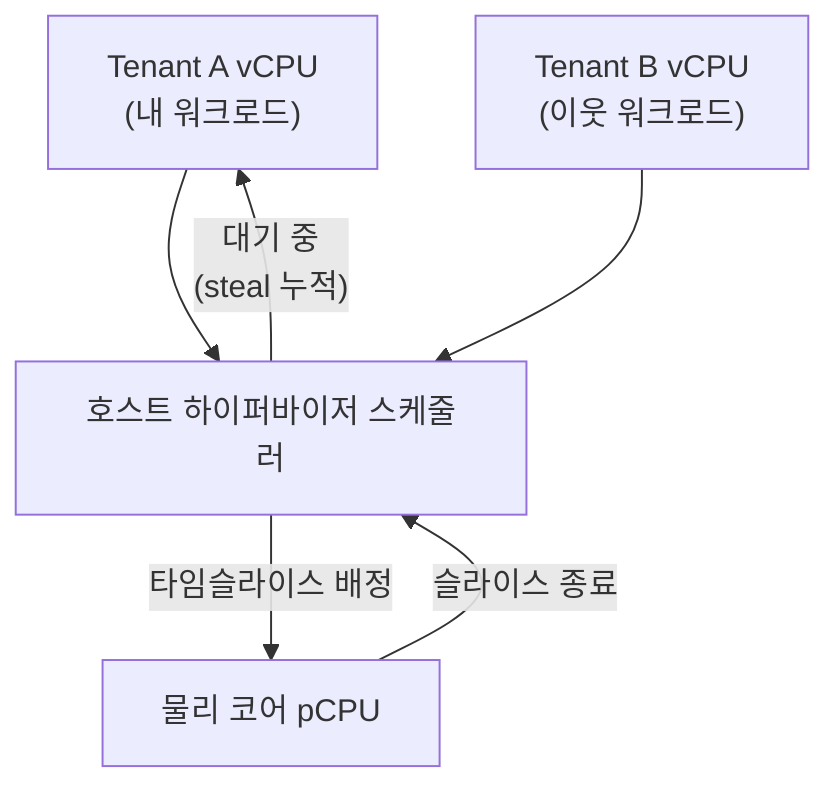

**클라우드 환경 꼬리 지연**이란 퍼블릭 클라우드의 공유 물리 하드웨어 위에서 다른 테넌트(입주자)의 워크로드가 내 인스턴스의 CPU·캐시·메모리 대역폭·I/O 자원을 잠식해, 평균 지연은 그대로인데 p99·p999 같은 꼬리 지연만 튀는 현상을 말합니다. 코드와 컴파일 플래그를 아무리 다듬어도, 내 vCPU가 물리 코어를 실제로 배정받지 못하고 하이퍼바이저 대기열에서 기다리는 시간(**CPU Steal Time**)이 늘어나면 그 위의 모든 최적화가 잡음에 묻힙니다. 이 장은 이 트랙에서 다룬 스케줄링·affinity·컨테이너 자원 제어가 "내 프로세스 안"의 문제였다면, 그 경계를 넘어 "내가 통제할 수 없는 이웃"이 만드는 지연을 어떻게 관측하고 방어하는지를 다룹니다.

## 이 장을 읽기 전에

이 장은 트랙 인트로인 [Introduction: OS·런타임 Low-latency 운영환경](/post/os-optimization/getting-started-os-runtime-performance-tuning/)에서 정리한 "운영환경이 지연 분포를 결정한다"는 관점과, [03장: CPU Pinning/Affinity 전략](/post/os-optimization/cpu-pinning-affinity-strategy/)·[04장: NUMA CPU Affinity·스레드 배치](/post/os-optimization/numa-cpu-affinity-thread-placement/)에서 다룬 "코어를 명시적으로 통제한다"는 개념을 전제로 합니다. 정밀한 지연 측정 방법은 [06장: 정밀 시간 측정](/post/os-optimization/precise-time-measurement-rdtsc-clock-gettime/)에서 다룬 `clock_gettime`·RDTSC를 그대로 사용합니다. **이 장의 깊이**는 **심화**입니다. CPU Steal Time의 측정 원리, Noisy Neighbor가 발생하는 구조, 인스턴스 타입·전용 호스트 선택 전략을 다루되, 통계적으로 엄밀한 SLA 산정이나 특정 클라우드 벤더의 과금 세부사항은 다루지 않습니다. **다루지 않는 것**: Kubernetes 노드 내부의 CFS quota·isolcpus·Intel RDT 조합은 [11장: 컨테이너/가상화 성능 고려사항](/post/os-optimization/container-virtualization-performance-considerations/)에서, cgroups v2 컨트롤러 세부 메커니즘은 [13장: cgroups v2 리소스 제어](/post/os-optimization/cgroups-v2-resource-control-performance/)에서 이미 다뤘으므로 여기서는 반복하지 않고 링크로 위임합니다.

## 당신의 수준에 맞는 경로

| 수준 | 읽을 부분 | 핵심 목표 |
|------|---------|---------|
| **중급자** | 도입 ~ "CPU Steal Time이 보여주는 것" | steal time이 무엇을 측정하고 무엇을 측정하지 않는지 이해 |
| **심화 학습자** | "Noisy Neighbor가 발생하는 구조" ~ "흔한 오개념" | 오버커밋·버스터블 크레딧·SMT 경합의 메커니즘 파악 |
| **전문가** | "방어 전략" ~ "비판적 시각" | 인스턴스·격리 옵션 선택과 전용 호스트의 한계를 판단 |

---

## Noisy Neighbor와 CPU Steal Time의 등장 배경

**Noisy Neighbor**라는 용어 자체는 특정 발명가나 발표 논문이 있는 개념이라기보다, 멀티테넌트 인프라가 상용화되면서 운영자들 사이에서 자연스럽게 굳어진 표현입니다. 하드웨어 하나를 여러 고객에게 나눠 파는 모델은 메인프레임의 타임셰어링 시절부터 있었지만, 이것이 지연시간 문제로 본격적으로 불거진 것은 2006년 전후 Amazon EC2 같은 퍼블릭 클라우드가 등장하면서부터입니다. 서로 신뢰 관계가 없는 여러 회사의 VM이 같은 물리 서버 위에서 동시에 실행되기 시작하자, 한 테넌트의 부하 급증이 물리적으로 인접한 다른 테넌트의 성능을 갉아먹는 현상이 운영 이슈로 떠올랐습니다.

이 현상을 게스트 OS 관점에서 정량화한 지표가 **CPU Steal Time**입니다. Xen 같은 반가상화(paravirtualization) 하이퍼바이저는 게스트 커널이 "내 vCPU가 실행 가능한 상태인데도 하이퍼바이저가 다른 손님을 서비스하느라 나를 스케줄링하지 않은 시간"을 스스로 알 수 있도록 커널에 훅을 심었습니다. 리눅스는 이런 반가상화 시대(2000년대 중반, Xen DomU 지원이 메인라인에 들어온 시점 전후)에 `/proc/stat`의 CPU 통계 줄에 **steal** 필드를 추가했고, 이후 KVM을 포함한 대부분의 주류 하이퍼바이저가 같은 관례를 따라 이 필드를 채우게 되었습니다. `mpstat`·`top`·`vmstat` 같은 표준 도구의 `%st`(steal) 컬럼은 모두 이 필드를 읽어 표시하는 것이며, [Linux man-pages 프로젝트의 mpstat(1) 문서](https://man7.org/linux/man-pages/man1/mpstat.1.html)는 이를 "가상 CPU가 하이퍼바이저가 다른 가상 프로세서를 서비스하는 동안 비자발적으로 대기한 시간의 비율"로 정의합니다.

## CPU Steal Time이 보여주는 것: 하이퍼바이저 스케줄링의 그림자

Steal time을 정확히 이해하려면 하이퍼바이저가 무엇을 스케줄링하는지부터 봐야 합니다. 물리 코어(pCPU) 하나 위에 여러 테넌트의 vCPU가 시분할로 얹히는 오버커밋(overcommit) 환경에서, 호스트 스케줄러는 각 vCPU에게 타임슬라이스를 순서대로 배정합니다. 내 vCPU가 실행 대기열(run queue)에서 실행 가능한 상태로 남아 있는데도 다른 테넌트의 vCPU가 슬라이스를 쓰는 중이라면, 그 대기 시간이 게스트 커널 입장에서는 steal time으로 누적됩니다. 즉 steal time은 "내가 유휴(idle)해서 안 쓴 시간"이 아니라 "쓰고 싶었는데 못 쓴 시간"이라는 점이 핵심이며, 이 구분이 idle time과 steal time을 나누는 이유입니다.

이 값이 실제로 어떻게 계산되는지는 `/proc/stat`을 직접 읽어보면 가장 분명해집니다. 아래 프로그램은 `mpstat`이 내부적으로 하는 일과 동일하게, 두 시점 사이의 누적 CPU 시간 델타에서 steal 비율을 계산합니다.

```c
#include <stdio.h>
#include <unistd.h>

// /proc/stat 첫 줄 형식: cpu user nice system idle iowait irq softirq steal ...
typedef struct {
  unsigned long long user, nice, system, idle, iowait, irq, softirq, steal;
} CpuTimes;

static int read_cpu_times(CpuTimes *t) {
  FILE *f = fopen("/proc/stat", "r");
  if (!f) return -1;
  int n = fscanf(f, "cpu %llu %llu %llu %llu %llu %llu %llu %llu",
                 &t->user, &t->nice, &t->system, &t->idle,
                 &t->iowait, &t->irq, &t->softirq, &t->steal);
  fclose(f);
  return (n == 8) ? 0 : -1;
}

static unsigned long long total(const CpuTimes *t) {
  return t->user + t->nice + t->system + t->idle + t->iowait + t->irq + t->softirq + t->steal;
}

int main(void) {
  CpuTimes prev, cur;
  if (read_cpu_times(&prev) != 0) { fprintf(stderr, "read failed\n"); return 1; }
  for (;;) {
    sleep(1);
    if (read_cpu_times(&cur) != 0) break;
    unsigned long long dt = total(&cur) - total(&prev);
    unsigned long long dsteal = cur.steal - prev.steal;
    double pct = dt ? (100.0 * (double)dsteal / (double)dt) : 0.0;
    printf("steal: %.2f%%\n", pct);
    prev = cur;
  }
  return 0;
}
```

`gcc -O2 -o steal_monitor steal_monitor.c`(Linux x86-64/ARM64 공통, 커널 버전 무관하게 `/proc/stat`에 steal 필드가 있으면 동작)로 빌드해 실행하면 1초 간격으로 steal 비율이 출력됩니다. 팀마다 기준은 다르지만, steal time이 낮은 한 자릿수 percent를 넘어 지속적으로 관측되면 인스턴스 배치나 타입을 재검토하는 경험적 관행이 널리 쓰입니다. 다만 컨테이너 안에서 이 프로그램을 돌리면 namespace가 `/proc/stat`을 완전히 격리하지 않는 경우가 많아 호스트 전체의 steal 값이 보일 수 있다는 점은 주의해야 합니다 — 컨테이너 스코프의 CPU 자원 통제는 [11장](/post/os-optimization/container-virtualization-performance-considerations/)에서 다룬 cgroup 계정 방식과는 별개의 문제입니다.

## Noisy Neighbor가 발생하는 구조: 오버커밋과 버스터블 크레딧

CPU steal time이 관측되는 근본 원인은 클라우드 사업자가 물리 코어 수보다 많은 vCPU를 판매하는 **오버커밋**에 있습니다. 오버커밋 자체는 나쁜 설계가 아닙니다 — 대부분의 워크로드가 항상 CPU를 100% 쓰지 않는다는 통계적 사실 위에서 비용 효율을 높이는 정상적인 자원 관리 기법입니다. 문제는 오버커밋 비율이 클수록, 그리고 같은 물리 호스트에 배치된 이웃 테넌트의 부하 패턴이 예측 불가능할수록, 내 vCPU가 대기열에서 기다리는 시간의 분산이 커진다는 데 있습니다.

이 구조가 가장 두드러지는 것이 **버스터블(burstable) 인스턴스 계열**(AWS T 시리즈, Azure B 시리즈 등)입니다. 이 계열은 평상시 낮은 기준 성능만 보장하고, CPU 크레딧을 적립해 두었다가 순간적인 버스트에 그 크레딧을 소모하는 방식으로 가격을 낮춥니다. 크레딧이 소진되면 성능이 기준선으로 강제로 떨어지는데, 이 강제 저하와 이웃 테넌트로 인한 steal time 증가가 동시에 나타나면 어느 쪽이 원인인지 게스트 지표만으로는 구분하기 어렵습니다. 반대로 컴퓨팅 최적화·범용 계열의 "고정 성능(fixed performance)" 인스턴스는 오버커밋 비율을 낮게 유지하거나 아예 1:1에 가깝게 운영해 이 변동성을 줄입니다. 물리 코어 하나를 SMT(Simultaneous Multi-Threading)로 둘로 쪼갠 논리 코어를 서로 다른 테넌트에게 배정하는 구성에서는, steal time에 잡히지 않는 또 다른 경합도 남습니다 — 같은 물리 코어를 공유하는 형제(sibling) 논리 코어가 L1/L2 캐시와 실행 유닛을 두고 경쟁하기 때문입니다. 이 경합은 스케줄링 대기가 아니라 명령어 처리량 저하로 나타나므로 `%steal`에는 반영되지 않습니다.

이 관계를 하나의 그림으로 정리하면 다음과 같습니다. 호스트 하이퍼바이저 스케줄러가 물리 코어 하나를 여러 테넌트의 vCPU에 시분할로 배정하는 동안, 대기 중인 테넌트의 게스트 커널에는 그 대기 시간이 steal time으로 누적됩니다.



## 재현과 관찰: 로컬에서 경합 만들어보기

실제 하이퍼바이저 수준의 steal time은 다른 고객의 워크로드에 의존하므로 온전히 재현할 수 없지만, 같은 물리 호스트 안에서 코어를 공유할 때 벌어지는 경합의 **효과**는 단일 VM 안에서도 근사적으로 관찰할 수 있습니다. 아래 스크립트는 논리 코어 하나를 측정 대상으로 비워 두고 나머지 코어에 인위적인 부하를 걸어, "이웃"이 있을 때와 없을 때 반복 작업의 완료 시간이 어떻게 달라지는지 비교합니다.

```bash
#!/usr/bin/env bash
# 환경: Linux x86-64, kernel 5.15+, stress-ng 0.17+ (apt install stress-ng), coreutils
# 목적: 논리 코어 하나(TARGET_CPU)를 비워 측정하고 나머지 코어에 부하를 걸어
#       "이웃 부하"가 측정 대상 스레드의 완료 시간에 주는 영향을 근사 재현
set -euo pipefail
TARGET_CPU=0
NEIGHBOR_CPUS="1-$(( $(nproc) - 1 ))"

echo "=== 이웃 부하 없음 ==="
taskset -c "$TARGET_CPU" bash -c \
  'start=$(date +%s%N); for i in $(seq 1 2000000); do :; done; \
   echo "elapsed_ns=$(( $(date +%s%N) - start ))"'

stress-ng --taskset "$NEIGHBOR_CPUS" --cpu $(( $(nproc) - 1 )) --cpu-load 100 --timeout 15s &
NEIGHBOR_PID=$!
sleep 1  # 이웃 부하 안정화 대기

echo "=== 이웃 부하 있음 ==="
taskset -c "$TARGET_CPU" bash -c \
  'start=$(date +%s%N); for i in $(seq 1 2000000); do :; done; \
   echo "elapsed_ns=$(( $(date +%s%N) - start ))"'
wait "$NEIGHBOR_PID" 2>/dev/null || true
```

이 스크립트는 **동일 게스트 안에서의 코어 오버커밋**을 흉내 낼 뿐, 실제 클라우드의 크로스 테넌트 steal time과 완전히 같지는 않다는 점을 분명히 해 두어야 합니다. 그럼에도 "옆 코어의 부하가 내 완료 시간의 분산을 키운다"는 핵심 메커니즘은 동일하게 관찰되므로, 프로덕션에 적용하기 전 팀 내에서 이 효과를 체감하는 용도로는 충분합니다. 나노초 단위로 더 정밀하게 측정하려면 `date +%s%N` 대신 [06장에서 다룬 `clock_gettime(CLOCK_MONOTONIC)`](/post/os-optimization/precise-time-measurement-rdtsc-clock-gettime/) 기반 계측으로 바꾸는 것이 좋습니다.

## 흔한 오개념

**"steal time이 0%면 내 성능 문제는 100% 내 코드 탓이다"**는 절반만 맞습니다. steal time은 하이퍼바이저 스케줄러가 vCPU를 대기시킨 시간만 잡을 뿐, SMT 형제 코어의 캐시·실행 유닛 경합이나 같은 소켓의 다른 테넌트가 유발하는 L3 캐시·메모리 대역폭 경합은 반영하지 않습니다. steal이 0이어도 명령어당 사이클 수(IPC)가 이유 없이 튄다면 이런 "steal에 안 잡히는" 경합을 의심해야 합니다.

**"전용 호스트(Dedicated Host)나 격리 인스턴스를 쓰면 steal time이 완전히 사라진다"**도 과장입니다. 다른 고객과의 경합은 제거되지만, 같은 호스트 위에 내 조직의 다른 VM 여러 개를 올려 두면 그들끼리 경합할 수 있고, [GCP의 sole-tenant 노드는 CPU 오버커밋 기능을 정식 지원](https://docs.cloud.google.com/compute/docs/nodes/sole-tenant-nodes)하므로 설정에 따라 "내 워크로드끼리의" 오버커밋이 여전히 발생할 수 있습니다. 전용 호스트는 **테넌트 간** 경합을 없애는 것이지, 오버커밋이라는 메커니즘 자체를 없애는 것이 아닙니다.

**"steal time 수치는 어느 클라우드에서나 똑같이 신뢰할 수 있다"**는 것도 조심해야 합니다. steal time 계정 방식은 하이퍼바이저 구현에 종속적입니다. [AWS Nitro System](https://aws.amazon.com/ec2/nitro/)처럼 네트워크·스토리지 컨트롤러를 전용 하드웨어 카드로 오프로드하고 하이퍼바이저가 오직 CPU·메모리 배정만 담당하는 구조에서는, I/O 관련 경합이 애초에 steal time으로 나타날 여지가 줄어듭니다. 즉 "이 클라우드는 항상 steal이 낮다/높다"를 다른 클라우드와 절대값으로 직접 비교하는 것은 하이퍼바이저 아키텍처 차이를 무시하는 것입니다.

## 방어 전략: 인스턴스 선택과 전용 호스트

Noisy Neighbor를 완전히 제거할 수는 없지만, 테넌트 간 경합의 **범위**를 좁히는 선택지는 주요 클라우드마다 마련되어 있습니다. 어느 선택지를 쓸지는 격리 강도와 비용·운영 복잡도의 트레이드오프 문제입니다.

| 옵션 | 격리 수준 | 대표 제공사 | 비용·운영 특성 |
|------|---------|-----------|--------------|
| 범용 온디맨드 인스턴스 | 낮음(멀티테넌트 공유) | 전 클라우드 공통 | 가장 저렴, steal time 변동 가능성 가장 큼 |
| 고정 성능·컴퓨팅 최적화 계열 | 중간 | 전 클라우드 공통 | 버스터블 계열보다 변동성 낮음, 비용은 다소 높음 |
| [AWS Dedicated Instance/Host](https://docs.aws.amazon.com/AWSEC2/latest/UserGuide/dedicated-hosts-overview.html) | 높음(물리 서버 단위 전용) | AWS | Host는 소켓·코어 가시성 제공, per-host 과금 |
| [Azure 격리(Isolated) VM 크기](https://learn.microsoft.com/en-us/azure/virtual-machines/isolation) | 높음(물리 서버 단위 전용) | Azure | 비격리 대비 약 10% 프리미엄, 하드웨어 세대에 수명 종속 |
| [GCP Sole-Tenant 노드](https://docs.cloud.google.com/compute/docs/nodes/sole-tenant-nodes) | 높음(물리 서버 단위 전용) | GCP | 자체 CPU 오버커밋 설정 가능, 노드 단위 과금 |

전용 호스트·격리 인스턴스를 도입하기 전에 실제로 steal time과 지연 분포가 상관관계를 보이는지부터 확인하는 것이 순서입니다. 앞서의 `steal_monitor`를 배포 환경에 상시 배치해 애플리케이션의 p99 지연 시계열과 나란히 두면, steal time 스파이크와 지연 스파이크가 같은 시각에 겹치는지 눈으로 확인할 수 있습니다. 상관관계가 뚜렷하다면 우선 컴퓨팅 최적화 계열로 인스턴스 타입을 바꿔 저비용으로 재현되는지 보고, 그래도 남는 변동성이 SLA를 위협하는 수준이면 전용 호스트로 격상하는 단계적 접근이 비용 대비 효과적입니다. 컨테이너·Kubernetes 위에서 이 경합을 완화하는 노드 내부 수단(Static CPU Manager Policy, isolcpus, Intel RDT)은 [11장](/post/os-optimization/container-virtualization-performance-considerations/)에서 다뤘으므로, 그 위에 노드 풀 자체를 전용 호스트로 올릴지 말지가 이 장에서 추가되는 결정입니다.

## 판단 기준

| 상황 | 권장 | 비권장 |
|------|------|--------|
| p99 지연이 간헐적으로 튀고 steal time과 시간대가 겹침 | 인스턴스 타입 변경(고정 성능 계열) 우선 검토 후 전용 호스트 검토 | steal time 확인 없이 애플리케이션 코드만 반복 프로파일링 |
| 규제·컴플라이언스로 물리적 테넌트 분리가 요구됨 | Dedicated Host/Isolated VM/Sole-tenant 노드 | 소프트웨어 격리(cgroup)만으로 대체 시도 |
| 상시 부하가 낮고 가끔 버스트하는 워크로드 | 버스터블 계열 + 크레딧 소진 모니터링 | 버스터블 계열에 상시 높은 부하를 걸어 크레딧 고갈 방치 |
| steal은 낮은데 IPC·지연이 불안정 | SMT 형제 경합·LLC 경합 의심, 코어 배치 재검토([03장](/post/os-optimization/cpu-pinning-affinity-strategy/)) | steal time만 보고 "이웃 문제 아님"으로 단정 |
| 멀티테넌트 K8s 노드 풀 운영 | 신뢰 경계에 따라 노드 풀 분리 + 필요 시 전용 호스트 위에 노드 배치 | 신뢰 불가 배치 워크로드와 지연 민감 워크로드를 같은 노드 풀에 무제한 혼재 |

## 비판적 시각: 한계와 트레이드오프

전용 호스트·격리 인스턴스가 만능 해법은 아닙니다. 비용 프리미엄이 뒤따르고(Azure 격리 VM 크기는 비격리 대비 약 10% 높은 가격), Dedicated Host는 소켓·코어 단위로 통째로 구매해야 하므로 활용률이 낮은 워크로드에는 오히려 비효율적입니다. 더 근본적인 한계는, steal time이라는 지표 자체가 CPU 스케줄링 대기라는 **한 가지 차원**만 보여준다는 점입니다. 네트워크 대역폭·스토리지 IOPS·L3 캐시처럼 물리적으로 공유되는 다른 자원의 경합은 클라우드 사업자가 게스트에 노출하는 지표에 따로 잡히지 않는 경우가 많아, "steal time이 정상이니 이웃 문제는 없다"는 결론은 성급할 수 있습니다. AWS Nitro System처럼 I/O 컨트롤러를 하드웨어로 분리하는 아키텍처는 이 사각지대를 줄이는 방향이지만, 이는 벤더별 아키텍처 선택이지 이용자가 직접 통제할 수 있는 변수가 아닙니다.

또한 대부분의 클라우드 사업자 SLA는 가용성(uptime)을 다룰 뿐, 특정 백분위수 지연을 보장하지 않습니다. 즉 Noisy Neighbor로 인한 꼬리 지연 저하는 계약상 보상 대상이 아닌 경우가 대부분이며, 방어는 전적으로 이용자의 운영 책임입니다. 마지막으로, 로컬에서 재현하는 경합 실험은 실제 이웃 테넌트의 부하 패턴을 통제할 수 없다는 근본적 한계가 있습니다 — 이 장에서 다룬 재현 스크립트는 메커니즘을 이해하고 모니터링 코드를 검증하는 용도로는 유효하지만, 특정 클라우드·특정 시점의 실제 steal time 수준을 예측하는 도구는 아닙니다.

## 마무리

- CPU Steal Time이 하이퍼바이저 스케줄링 대기를 측정하는 지표이며, `/proc/stat`의 steal 필드에서 계산되는 원리를 설명할 수 있다.
- 오버커밋·버스터블 크레딧·SMT 형제 경합이 각각 어떻게 Noisy Neighbor를 만드는지 구분할 수 있다.
- steal time이 낮아도 캐시·메모리 대역폭·네트워크 경합은 별도로 존재할 수 있다는 점을 설명할 수 있다.
- 인스턴스 타입 변경과 전용 호스트/격리 인스턴스/sole-tenant 노드 중 상황에 맞는 방어 전략을 선택할 수 있다.
- 전용 호스트가 테넌트 간 경합만 제거할 뿐 오버커밋 메커니즘 자체를 없애지 않는다는 한계를 판단할 수 있다.

이 장으로 [OS·런타임 Low-latency 운영환경 트랙](/post/os-optimization/getting-started-os-runtime-performance-tuning/)의 18개 챕터가 마무리됩니다. 파일·블록 I/O 경로의 병목이 남아 있다면 **Tr.09 I/O 최적화**로, 패킷·프로토콜 경로가 문제라면 **Tr.10 네트워크 최적화**로 이어 가고, 이 트랙 전체를 다른 11개 트랙과 함께 어떤 순서로 읽을지는 [Low-latency 최적화 시리즈 개요](/post/low-latency-optimization-series/getting-started-low-latency-optimization-series-overview/)에서 확인할 수 있습니다. 클라우드·컨테이너 경계의 보안·성능 트레이드오프를 더 깊이 보고 싶다면 이미 게시된 [17장: eBPF·커널 경계와 성능 안전](/post/os-optimization/ebpf-xdp-kernel-boundary-performance-safety-expert/)이 이어서 읽기 좋은 주제입니다.
