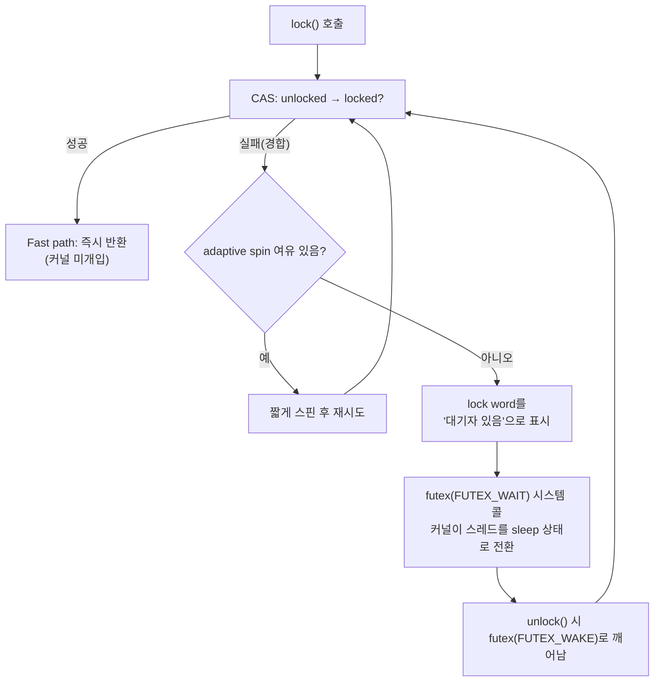

**동기화 비용 정량 분석**이란 mutex·spinlock·atomic 연산이 실제로 얼마의 CPU 사이클, 캐시 코히런시 트래픽, 커널 개입 비용을 지불하는지 숫자로 뜯어보는 작업을 말합니다. µs 단위 지연을 다루는 시스템에서는 "락은 느리다"거나 "atomic은 공짜다" 같은 직관만으로 설계하면 두 방향으로 틀리기 쉽습니다. 필요 없는 곳에서 lock-free로 도망치느라 복잡도만 늘리거나, 반대로 경합이 실제로 존재하는 곳에서 mutex 하나로 병목을 방치하는 식입니다. 이 장은 mutex·spinlock·atomic이 **경합이 없을 때(uncontended)**와 **경합이 있을 때(contended)** 서로 다른 코드 경로를 타며, 그 갈림길에서 커널의 futex 시스템 콜이 정확히 언제 끼어드는지를 정량적으로 이해하는 것을 목표로 합니다.

## 이 장을 읽기 전에

이 장은 이 트랙의 **첫 번째 본챕터**이며, 선행 지식은 트랙 인트로인 [Introduction: 동시성·멀티스레드 성능 튜닝](/post/concurrency-optimization/getting-started-concurrency-multithreading-performance-tuning/)에서 다룬 문제의식(경합·가시성·레이아웃 구분)이면 충분합니다. 스레드/프로세스의 기본 개념, C++ 기본 문법, "캐시 라인은 여러 코어가 공유하는 메모리 단위"라는 정도의 사전 지식만 있으면 됩니다.

**이 장의 깊이**는 **기초**입니다. mutex·spinlock·atomic 연산이 uncontended일 때와 contended일 때 각각 무슨 일이 벌어지는지, futex 시스템 콜이 정확히 어느 시점에 개입하는지를 다룹니다. **다루지 않는 것**은 다음과 같습니다. 어떤 상황에 어떤 프리미티브를 골라야 하는지의 종합 판단 기준은 [Lock 선택 기준](/post/concurrency-optimization/lock-selection-criteria-guide/)(챕터 02)에서, false sharing의 탐지·회피는 [False Sharing 탐지와 회피](/post/concurrency-optimization/false-sharing-detection-avoidance/)(챕터 03)에서, `memory_order`의 acquire/release/seq_cst 의미론은 [C++ 메모리 모델 실무 해석](/post/concurrency-optimization/cpp-memory-model-acquire-release-seqcst/)(챕터 04)에서, C++20 `atomic::wait`/`notify`의 실전 활용은 [C++20 Atomics 실전](/post/concurrency-optimization/cpp20-atomic-wait-notify/)(챕터 09)에서 각각 깊이 다룹니다. 이 장은 그 판단과 구현의 **기반이 되는 비용 감각**만 세웁니다.

## 당신의 수준에 맞는 경로

| 수준 | 읽을 부분 | 핵심 목표 |
|------|---------|---------|
| **기초** | "역사와 배경" ~ "atomic 연산과 캐시 코히런시 비용" | uncontended·contended의 차이와 futex 개입 시점 이해 |
| **중급** | "벤치마크와 perf로 직접 측정하기" | 직접 측정하고 커널 개입 여부를 도구로 확인 |
| **전문가** | "비판적 시각" | 벤치마크의 함정과 플랫폼별 차이 판단 |

---

## 역사와 배경: futex 이전과 이후

리눅스에서 스레드 동기화가 항상 커널 시스템 콜을 거쳤던 것은 아닙니다. futex(Fast Userspace Mutex)가 등장하기 전에는 세마포어 계열 IPC가 잠금·해제마다 커널에 진입해야 했고, 경합이 전혀 없는 상황에서도 시스템 콜 오버헤드를 피할 수 없었습니다. 이 문제를 해결한 것이 Hubertus Franke, Rusty Russell, Matthew Kirkwood가 2002년 Ottawa Linux Symposium에서 발표한 논문 "Fuss, Futexes and Furwocks: Fast Userlevel Locking in Linux"이며, 이 설계는 이후 리눅스 커널에 futex 시스템 콜로 채택되어 glibc의 NPTL(Native POSIX Thread Library) 스레드 구현과 `pthread_mutex`, 그리고 그 위에 얹힌 `std::mutex`의 기반이 되었습니다.

futex의 핵심 통찰은 "잠금 연산 대부분은 경합이 없다"는 관찰입니다. 커널 개입은 **오직 실제로 대기해야 할 때만** 필요하다고 재정의하면, 경합이 없는 대다수의 lock/unlock은 사용자 공간의 원자적 명령어 한두 개로 끝낼 수 있습니다. 리눅스 매뉴얼 페이지는 이 설계를 다음과 같이 요약합니다.

> "When using futexes, the majority of the synchronization operations are performed in user space." — [man7.org: futex(2)](https://man7.org/linux/man-pages/man2/futex.2.html)

Windows 계열도 유사한 결로 진화했습니다. `CRITICAL_SECTION`은 오래전부터 스핀 후 커널 이벤트로 전환하는 하이브리드 구조였고, Windows Vista 이후 도입된 **SRW(Slim Reader/Writer) Lock**은 포인터 하나 크기의 상태만으로 동작해 커널 오브젝트 없이 사용자 모드에서 대부분을 처리하도록 설계되었습니다(공식 문서: [Slim Reader/Writer (SRW) Locks](https://learn.microsoft.com/en-us/windows/win32/sync/slim-reader-writer--srw--locks)). 플랫폼마다 구현 세부는 다르지만 "경합 없는 경로는 사용자 공간에서, 경합 있는 경로만 커널로"라는 원칙은 공통적입니다.

## 핵심 개념: uncontended와 contended 경로

### mutex 내부 동작: 상태 기계와 futex 개입

futex 기반 mutex는 대개 잠금 상태를 정수 하나로 표현합니다. glibc NPTL의 일반적인 구현 패턴을 단순화하면 상태는 "unlocked(0)", "locked, 대기자 없음(1)", "locked, 대기자 있음(2)" 세 가지로 나뉩니다. `lock()`은 먼저 CAS(Compare-And-Swap)로 0→1 전환을 시도합니다. 이 CAS가 성공하면 그것으로 끝이며, 시스템 콜은 전혀 발생하지 않습니다. 이것이 **uncontended fast path**입니다. CAS가 실패했다는 것은 다른 스레드가 이미 락을 쥐고 있다는 뜻이고, 이때부터 **contended 경로**로 들어갑니다. `PTHREAD_MUTEX_ADAPTIVE_NP` 확장을 쓰는 경우 커널로 넘어가기 전에 짧게 스핀하며 재시도하는데, glibc는 `glibc.pthread.mutex_spin_count` 튜너블로 이 최대 스핀 횟수를 제어하고 기본값은 100회입니다. 스핀으로도 획득하지 못하면 락 상태를 "대기자 있음(2)"으로 표시한 뒤 `futex(FUTEX_WAIT, ...)`를 호출해 커널이 해당 스레드를 대기 큐에 넣고 재우며, `unlock()`이 대기자가 있음을 확인하면 `futex(FUTEX_WAKE, ...)`로 깨웁니다. 기본 `std::mutex`(POSIX의 `PTHREAD_MUTEX_TIMED_NP` 계열에 대응)가 스핀을 거치는지, 곧바로 대기로 넘어가는지는 표준이 정한 바가 없는 **구현 정의(implementation-defined)** 영역이므로, 정확한 동작은 사용 중인 libc 버전에서 직접 확인해야 합니다.

아래 그림은 이 갈림길을 정리한 것입니다. 굵게 표시한 것처럼, 커널이 실제로 개입하는 지점은 스핀도 실패한 뒤의 `futex` 호출 하나뿐입니다.



### spinlock 내부 동작: busy-wait와 TTAS

spinlock은 이 그림에서 "스핀"만 무한정 반복하고 futex 자체를 아예 두지 않는 구조입니다. 커널을 절대 호출하지 않으므로 컨텍스트 스위치 비용이 없지만, 그 대가로 락을 기다리는 동안 CPU 사이클을 실제로 소비합니다. 순진하게 매 반복마다 CAS(또는 `exchange`)를 시도하면, 실패하는 시도조차 캐시 라인 소유권을 요구하는 RFO(Read-For-Ownership) 트래픽을 발생시켜 락을 쥔 스레드의 캐시 접근까지 방해합니다. 이를 완화하는 표준적인 패턴이 **TTAS(Test-and-Test-And-Set)**로, 획득을 시도하기 전에 먼저 일반 `load()`로 상태를 관찰해 여러 코어가 캐시 라인을 Shared 상태로 공유하게 하고, 잠금이 풀린 것처럼 보일 때만 실제 `exchange()`를 시도합니다.

```cpp
#include <atomic>
#include <immintrin.h>  // _mm_pause (x86); 다른 아키텍처는 해당 ISA의 대응 명령으로 교체

class TtasSpinlock {
 public:
  void lock() noexcept {
    for (;;) {
      // 1단계(Test): 읽기 전용 load만 반복 — 캐시 라인을 Shared로 유지해 RFO 트래픽을 줄임
      while (locked_.load(std::memory_order_relaxed)) {
        _mm_pause();  // x86 PAUSE: 스핀 대기 중 파이프라인 부담과 전력 소모를 완화
      }
      // 2단계(Test-And-Set): 잠금이 풀린 듯 보일 때만 실제 획득 시도
      if (!locked_.exchange(true, std::memory_order_acquire)) {
        return;
      }
    }
  }

  void unlock() noexcept {
    locked_.store(false, std::memory_order_release);
  }

 private:
  std::atomic<bool> locked_{false};
};
```

TTAS는 실패할 스핀의 상당수를 로컬 캐시 읽기로 대체해 코히런시 트래픽을 줄이지만, 임계 구역이 길거나 스레드 수가 코어 수보다 많아지면 스핀 자체가 순수한 낭비가 됩니다. 이 경우 스핀 중인 스레드가 스케줄러에게서 CPU를 계속 붙잡아 정작 락을 쥔 스레드가 실행될 기회를 늦추는 "convoying" 현상으로 이어질 수 있으므로, 스핀락은 짧은 임계 구역과 코어 여유가 함께 보장될 때만 이점이 있습니다.

### atomic 연산과 캐시 코히런시 비용

`std::atomic`의 `fetch_add`, `compare_exchange` 같은 연산은 x86에서 `LOCK` 접두사가 붙은 명령어로 컴파일되며, uncontended 상황에서도 파이프라인을 부분적으로 직렬화하는 비용이 있어 일반 명령어보다는 느립니다. 진짜 비용은 경합이 걸릴 때 나타납니다. 여러 코어가 같은 캐시 라인을 동시에 갱신하려 하면 MESI(Modified-Exclusive-Shared-Invalid) 계열 캐시 코히런시 프로토콜이 그 라인의 소유권을 코어 사이에서 계속 이전시켜야 하고, 이 캐시 라인 핑퐁이 atomic 연산의 실질적인 지연을 지배합니다. 이는 [False Sharing 탐지와 회피](/post/concurrency-optimization/false-sharing-detection-avoidance/)(챕터 03)에서 다루는 문제와 근본적으로 같은 하드웨어 메커니즘이며, 서로 무관한 변수가 한 캐시 라인에 우연히 묶여도 같은 비용이 발생합니다. `memory_order`를 `relaxed`로 낮춘다고 이 코히런시 비용 자체가 사라지지는 않는다는 점도 기억해 둘 필요가 있습니다. `relaxed`가 없애는 것은 컴파일러·CPU의 명령어 재정렬 제약이지, 캐시 라인 소유권 이전 비용이 아닙니다. 메모리 순서 자체의 의미론은 이 장에서 더 파고들지 않고 [C++ 메모리 모델 실무 해석](/post/concurrency-optimization/cpp-memory-model-acquire-release-seqcst/)(챕터 04)에 넘깁니다.

## 벤치마크와 perf로 직접 측정하기

지금까지의 설명을 "우리 환경에서" 확인하려면 uncontended와 contended를 스레드 수로 직접 갈라 측정해야 합니다. 아래는 Google Benchmark로 mutex·TTAS spinlock·atomic 증가 연산을 스레드 수 1/2/4/8에서 비교하는 스켈레톤입니다. 위에서 정의한 `TtasSpinlock`이 같은 번역 단위에 있다고 가정합니다.

```cpp
#include <benchmark/benchmark.h>
#include <atomic>
#include <mutex>

static std::mutex g_mutex;
static TtasSpinlock g_spin;
static std::atomic<long> g_counter{0};

static void BM_MutexIncrement(benchmark::State& state) {
  for (auto _ : state) {
    std::lock_guard<std::mutex> lk(g_mutex);
    benchmark::DoNotOptimize(++g_counter);
  }
}
BENCHMARK(BM_MutexIncrement)->Threads(1)->Threads(4)->Threads(8);

static void BM_SpinlockIncrement(benchmark::State& state) {
  for (auto _ : state) {
    g_spin.lock();
    benchmark::DoNotOptimize(++g_counter);
    g_spin.unlock();
  }
}
BENCHMARK(BM_SpinlockIncrement)->Threads(1)->Threads(4)->Threads(8);

static void BM_AtomicIncrement(benchmark::State& state) {
  for (auto _ : state) {
    g_counter.fetch_add(1, std::memory_order_relaxed);
  }
}
BENCHMARK(BM_AtomicIncrement)->Threads(1)->Threads(4)->Threads(8);

BENCHMARK_MAIN();
```

`g++ -O2 -std=c++20 sync_cost_bench.cpp -lbenchmark -lpthread -o sync_cost_bench`(Linux, GCC 기준)로 빌드합니다. 읽는 방법은 각 프리미티브별로 `Threads(1)`(uncontended 기준선)과 `Threads(8)`(contended)의 `real_time`을 나란히 비교하는 것입니다. 세 프리미티브 모두 스레드가 늘수록 느려지지만, 늦어지는 배율과 그 원인은 서로 다릅니다. 정확한 배율은 코어 수, 터보 부스트, 스케줄러, adaptive spin 활성화 여부에 따라 환경마다 달라지므로 이 글은 특정 수치를 단정하지 않습니다. 재현성을 높이려면 `taskset`으로 스레드를 코어에 고정하고 동일 조건에서 반복 측정합니다.

수치 비교만으로는 "정말 futex가 경합에서만 개입하는가"를 확인할 수 없으므로, `perf`로 시스템 콜 자체를 세어 봅니다.

```bash
perf stat -e syscalls:sys_enter_futex,context-switches \
  -- ./sync_cost_bench --benchmark_filter='BM_MutexIncrement/threads:1'

perf stat -e syscalls:sys_enter_futex,context-switches \
  -- ./sync_cost_bench --benchmark_filter='BM_MutexIncrement/threads:8'
```

기대되는 관찰은, `threads:1`(다른 스레드가 없어 사실상 uncontended)에서는 `sys_enter_futex` 카운트가 0에 가깝고, `threads:8`(경합 발생)에서는 그 카운트가 컨텍스트 스위치 수와 함께 뚜렷이 올라간다는 것입니다. 이 상관관계가 확인되면 "futex는 경합할 때만 호출된다"는 주장이 추측이 아니라 이 환경에서 실측된 사실이 됩니다. 손으로 짠 `TtasSpinlock`처럼 동기화를 직접 구현한 코드는 `g++ -fsanitize=thread -std=c++20 ...`로 빌드한 ThreadSanitizer 빌드를 최소 한 번은 통과시켜, 벤치마크 수치를 믿기 전에 데이터 레이스가 없는지부터 확인하는 것이 안전합니다.

## 자주 하는 오해

**"atomic 연산은 공짜다."** 락을 걸지 않으니 비용이 없다고 생각하기 쉽지만, `LOCK` 접두사 명령어는 uncontended에서도 파이프라인 일부를 직렬화하는 비용을 지불하고, 경합 시에는 캐시 라인 소유권 이전 비용이 더해집니다. "락이 없다"와 "비용이 없다"는 다른 말입니다.

**"spinlock은 항상 mutex보다 빠르다."** 짧은 임계 구역과 코어 여유라는 조건에서만 성립하는 이야기입니다. 스레드 수가 코어 수를 넘거나 임계 구역이 길어지면 스핀은 순수한 CPU 낭비가 되고, 락을 쥔 스레드가 스케줄되기를 오히려 늦추는 convoying으로 번질 수 있습니다.

**"mutex를 쓰면 항상 시스템 콜이 발생한다."** futex 기반 mutex의 설계 목적 자체가 이 통념을 깨는 데 있습니다. 경합이 없으면 CAS 한 번으로 사용자 공간에서 끝나고, 시스템 콜은 스핀까지 실패한 뒤의 대기 상황에서만 발생합니다. 이 장의 perf 실습이 바로 이 지점을 직접 확인하기 위한 것입니다.

## 판단 기준: 언제 무엇을 쓸까

| 상황 | 권장 | 이유 |
|------|------|------|
| 임계 구역이 매우 짧고 코어 여유가 있으며 경합이 드묾 | spinlock(TTAS) 또는 adaptive mutex | 스핀 비용이 컨텍스트 스위치 비용보다 작음 |
| 임계 구역이 길거나 경합이 잦음 | futex 기반 mutex | 대기 스레드를 재워 CPU 낭비를 줄임 |
| 단일 값의 갱신·읽기만 필요 | atomic 연산 | 락 자체의 오버헤드를 제거 |
| 스레드 수가 코어 수보다 많음 | mutex 계열(스핀 지양) | 스핀락이 스케줄러와 경합해 지연이 오히려 증폭됨 |
| "어떤 프리미티브를 고를지" 종합 판단이 필요 | [Lock 선택 기준](/post/concurrency-optimization/lock-selection-criteria-guide/)로 이동 | 이 장은 비용 정량화까지만 다룸 |

## 비판적 시각: 벤치마크와 숫자의 함정

마이크로벤치마크로 얻은 숫자는 캐시 온도, NUMA 배치, 터보 부스트, 백그라운드 프로세스 같은 잡음에 민감해 재현성이 낮습니다. 한 번 측정한 배율을 "이 프리미티브는 항상 N배 느리다"로 일반화하면, 다른 하드웨어나 다른 커널 버전에서는 다른 이야기가 됩니다. 벤치마크 결과는 그 자체로 결론이 아니라, 실제 워크로드에서 같은 경향이 재현되는지 확인하기 위한 가설로 다루는 편이 안전합니다.

futex라는 개념 자체도 리눅스에 한정됩니다. Windows는 SRW Lock·`WaitOnAddress`, macOS는 `os_unfair_lock` 계열로 유사한 "경합 시에만 커널 개입" 원칙을 구현하지만 세부 동작과 스핀 정책은 다릅니다. 배포 대상 플랫폼이 다르면 이 장의 수치 감각을 그대로 옮기지 말고 해당 플랫폼에서 다시 측정해야 합니다.

glibc의 adaptive spin 횟수 기본값(100회)도 `glibc.pthread.mutex_spin_count` 튜너블로 바뀔 수 있는 구현 정의 값입니다. "우리 서버의 숫자"가 다른 배포판·다른 glibc 버전에서도 같으리라고 가정하지 않는 것이 좋습니다. 그리고 이 장이 다루는 것은 어디까지나 개별 프리미티브의 미시적 비용입니다. 락의 범위를 얼마나 넓게 잡을지, 애초에 공유 상태를 얼마나 줄일 수 있을지 같은 더 큰 설계 질문은 프리미티브 선택만으로는 풀리지 않으며, 이 트랙의 뒤쪽 챕터들이 그 질문을 이어받습니다.

## 더 읽을 거리

- [man7.org: futex(2)](https://man7.org/linux/man-pages/man2/futex.2.html) — futex 시스템 콜의 공식 매뉴얼 페이지, user-space fast path와 커널 개입 조건을 정의
- [Fuss, Futexes and Furwocks (2002 OLS)](https://www.kernel.org/doc/ols/2002/ols2002-pages-479-495.pdf) — futex를 처음 제안한 원 논문(kernel.org 공식 문서 아카이브)
- [GNU C Library: POSIX Thread Tunables](https://sourceware.org/glibc/manual/latest/html_node/POSIX-Thread-Tunables.html) — `glibc.pthread.mutex_spin_count` 등 adaptive mutex 튜너블 공식 문서
- [Microsoft Learn: Slim Reader/Writer (SRW) Locks](https://learn.microsoft.com/en-us/windows/win32/sync/slim-reader-writer--srw--locks) — Windows의 경량 락 설계와 커널 오브젝트를 최소화하는 방식

## 이 장을 마치며

- uncontended와 contended 경로가 mutex 내부에서 정확히 어디서 갈리는지 설명할 수 있다.
- futex 시스템 콜이 언제 개입하고 언제 개입하지 않는지 설명할 수 있다.
- TTAS spinlock이 순진한 스핀락보다 캐시 코히런시 트래픽을 줄이는 이유를 설명할 수 있다.
- Google Benchmark로 mutex·spinlock·atomic의 uncontended·contended 비용을 직접 측정할 수 있다.
- `perf stat`으로 futex 시스템 콜·컨텍스트 스위치 횟수를 세어 벤치마크 해석을 검증할 수 있다.
- 스핀락이 항상 유리하지 않은 이유(코어 초과, 긴 임계 구역, convoying)를 설명할 수 있다.

이 장이 세운 비용 감각을 바탕으로, 다음 장에서는 **어떤 상황에 mutex·spinlock·atomic 중 무엇을 선택해야 하는지**를 다룹니다. 워크로드의 임계 구역 길이, 경합 빈도, 코어 여유를 기준으로 정리한 의사결정 체계를 제시합니다.

→ [Lock 선택 기준](/post/concurrency-optimization/lock-selection-criteria-guide/) (챕터 02)
