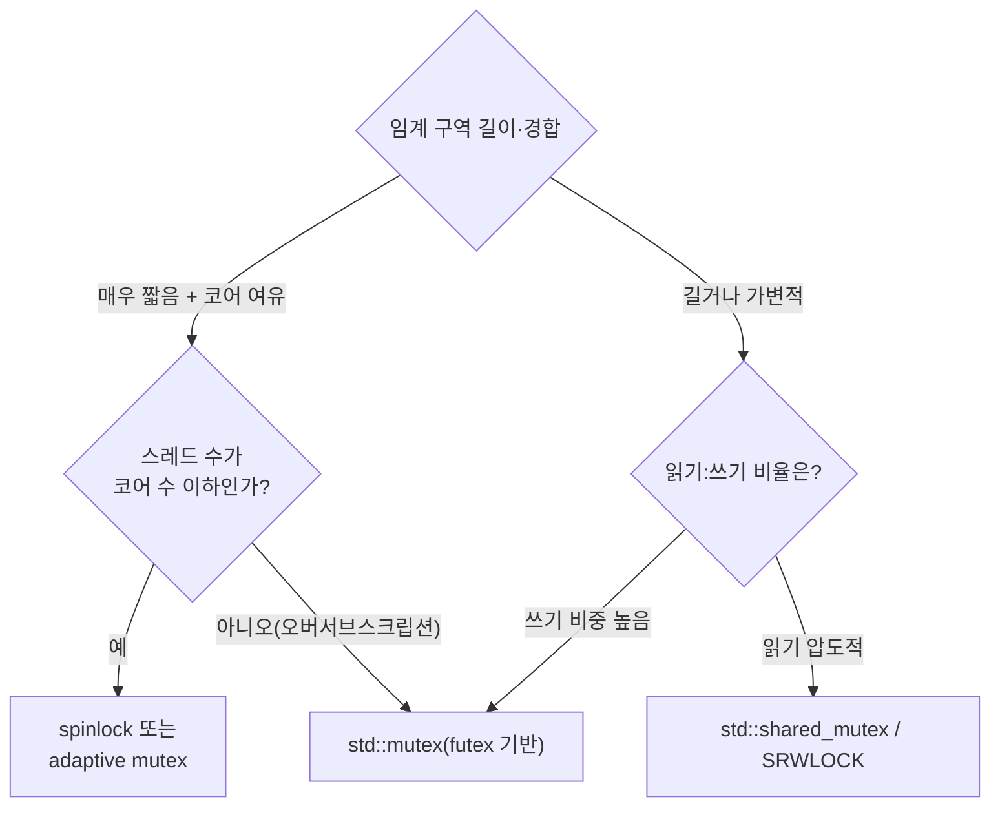

**Lock 선택 기준**이란 임계 구역의 길이·경합 빈도·읽기 대 쓰기 비율 같은 워크로드 특성을 근거로 mutex, spinlock, shared_mutex, futex 기반 프리미티브 중 무엇을 쓸지 판단하는 체계를 말합니다. 실무에서는 "일단 mutex로 감싸고 느리면 spinlock으로 바꾼다"는 식의 시행착오가 흔한데, 이는 워크로드마다 최적 선택이 달라 매번 재현되는 비효율입니다. 이 장은 [이전 장에서 정량화한 동기화 비용](/post/concurrency-optimization/synchronization-primitive-cost-analysis/)을 근거로, 어떤 신호를 보고 어떤 프리미티브를 고를지에 대한 재사용 가능한 기준을 세우는 데 목적이 있습니다.

## 이 장을 읽기 전에

이 장은 [01장: 동기화 비용 정량 분석](/post/concurrency-optimization/synchronization-primitive-cost-analysis/)에서 측정한 "락 획득/해제·경합·컨텍스트 스위치 비용"의 크기를 전제로 합니다. mutex와 atomic 연산의 비용 차이, 그리고 경합이 왜 꼬리 지연(p99)을 악화시키는지를 먼저 이해하고 오면 이 장의 판단 기준이 훨씬 빠르게 와닿습니다. **이 장의 깊이**는 기초 수준입니다 — mutex·spinlock·shared_mutex·futex의 동작 원리를 이해하고, 워크로드 신호(임계 구역 길이, 경합도, 읽기/쓰기 비율)로 프리미티브를 고르는 기준을 세우는 것이 목표입니다. **다루지 않는 것**: cache line 배치와 false sharing 회피 기법은 [03장](/post/concurrency-optimization/false-sharing-detection-avoidance/), acquire/release 등 메모리 순서의 정확한 의미론은 [04장](/post/concurrency-optimization/cpp-memory-model-acquire-release-seqcst/), 락 없는 자료구조 설계는 [05장](/post/concurrency-optimization/lock-free-design-fundamentals/), condition_variable의 성능 패턴은 [19장](/post/concurrency-optimization/condition-variable-performance-patterns/), C++20 `std::atomic::wait/notify`의 futex 기반 구현 세부는 [09장](/post/concurrency-optimization/cpp20-atomic-wait-notify/)에서 각각 다룹니다.

## 당신의 수준에 맞는 경로

| 수준 | 읽을 부분 | 핵심 목표 |
|------|---------|---------|
| **초보자** | "락의 계보" ~ "mutex의 내부 동작" | mutex가 futex 위에서 어떻게 동작하는지 이해 |
| **중급자** | "spinlock" ~ "shared_mutex" | 워크로드별로 spinlock·shared_mutex를 언제 쓸지 판단 |
| **실무 적용** | "흔한 오개념" ~ "판단 기준" | 자신의 코드에서 잘못 고른 락을 식별하고 교체 |

---

## 락의 계보: mutex에서 futex까지 (역사·배경)

POSIX 스레드 표준(IEEE Std 1003.1c, 1995)은 `pthread_mutex_t`를 정의했지만 구현 방식은 규정하지 않았습니다. 초기 Linux의 LinuxThreads 구현은 시그널 기반으로 스레드를 깨웠는데, 스레드 수가 늘어날수록 시그널 전달 비용이 커져 확장성이 나빴습니다. 2003년 Ulrich Drepper와 Ingo Molnar가 주도한 <strong>NPTL(Native POSIX Thread Library)</strong>이 리눅스 2.6 커널과 함께 도입되면서 **futex(fast userspace mutex)** 기반 구현으로 교체되었고, 이때부터 "무경합 상태에서는 커널에 진입하지 않는다"는 지금의 mutex 설계 원칙이 자리 잡았습니다. C++11(2011)은 이 플랫폼별 프리미티브를 `std::mutex`/`std::lock_guard`로 표준화해 이식 가능한 인터페이스를 제공했고, C++14는 `std::shared_timed_mutex`를, C++17은 타임아웃 기능을 뺀 경량 `std::shared_mutex`를 추가해 읽기 중심 워크로드를 표준 라이브러리만으로 다룰 수 있게 했습니다.

스핀락의 역사에는 반면교사 사례가 있습니다. Apple은 오랫동안 `OSSpinLock`을 저비용 락으로 제공했지만, 2015년경 커뮤니티에서 "높은 우선순위 스레드가 낮은 우선순위 스레드를 계속 선점해 스핀 중인 스레드가 영원히 락을 못 얻는" 우선순위 역전 문제가 널리 알려졌습니다. iOS의 스케줄러는 우선순위가 낮은 스레드에 실행 시간을 거의 배정하지 않을 수 있어, 스핀 중인 고우선순위 스레드가 그 낮은 스레드를 기다리며 사실상 멈추는 상황이 발생했습니다. 결국 `OSSpinLock`은 iOS 10(2016)에서 공식적으로 deprecated 처리되었고, 스핀하지 않고 커널에서 우선순위 역전을 방지하며 대기하는 `os_unfair_lock`으로 대체되었습니다. 이 사례는 "스핀락이 항상 더 빠르다"는 직관이 스케줄러·우선순위 조건에서 깨질 수 있음을 보여줍니다.

## mutex의 내부 동작: futex 기반 fast/slow path

리눅스에서 `std::mutex`는 결국 `pthread_mutex_t`로, 이는 다시 [futex(2)](https://man7.org/linux/man-pages/man2/futex.2.html) 시스템 콜 위에서 동작합니다. futex의 핵심 아이디어는 "무경합 구간은 전부 사용자 공간에서 원자적 연산만으로 끝내고, 실제로 대기가 필요한 경우에만 커널에 진입한다"는 것입니다. 락 상태를 나타내는 정수 하나를 원자적으로 조작해 성공하면 시스템 콜이 전혀 없고, 이미 잠겨 있어 실패한 스레드만 `FUTEX_WAIT`로 커널에 재워달라고 요청합니다. 아래는 이 로직을 단순화한 개념 스케치이며, 실제 glibc 구현은 재시도 횟수·스핀 등 추가 상태를 가진 3-상태 머신에 가깝습니다.

```text
lock():
  if compare_exchange(state, UNLOCKED, LOCKED):
    return                        // fast path: 원자적 CAS 성공, 시스템 콜 없음
  state = LOCKED_CONTENDED         // 경합 발생을 표시
  while not compare_exchange(state, UNLOCKED, LOCKED_CONTENDED):
    futex_wait(&state, LOCKED_CONTENDED)   // 값이 바뀔 때까지 커널이 재움(slow path)

unlock():
  if fetch_and_set(state, UNLOCKED) == LOCKED_CONTENDED:
    futex_wake(&state, 1)          // 대기자가 있었을 때만 한 명을 깨움(시스템 콜)
```

이 설계 덕분에 무경합 mutex의 lock/unlock은 원자적 CAS 한두 번에 그치고, 시스템 콜은 실제로 대기자가 있을 때만 발생합니다. 표준 `std::mutex` 자체는 어떤 재시도·스핀 전략을 쓸지 강제하지 않는 **구현 정의(implementation-defined)** 동작이며, Windows에서는 futex가 아니라 `WaitOnAddress`/`SRWLOCK` 계열 커널 프리미티브 위에서, macOS(libc++)에서는 `os_unfair_lock` 위에서 유사한 원칙으로 구현됩니다.

```cpp
#include <mutex>

class Counter {
 public:
  void increment() {
    std::lock_guard<std::mutex> lock(mutex_);  // RAII: 예외 발생 시에도 해제 보장
    ++value_;
  }
  long value() const {
    std::lock_guard<std::mutex> lock(mutex_);
    return value_;
  }

 private:
  mutable std::mutex mutex_;
  long value_ = 0;
};
```

`std::lock_guard`는 생성자에서 잠그고 소멸자에서 해제하므로 예외가 발생해도 락이 풀립니다. 다만 락을 쥔 채로 값비싼 연산(I/O, 다른 락 획득)을 하지 않도록 임계 구역을 최소화하는 것이 우선이며, 그 판단은 [01장](/post/concurrency-optimization/synchronization-primitive-cost-analysis/)의 비용 측정과 짝을 이룹니다.

## spinlock: 언제 유리한가

**spinlock**은 락을 못 얻으면 커널에 넘기지 않고 사용자 공간에서 원자적 연산을 반복(busy-wait)하며 재시도하는 방식입니다. 컨텍스트 스위치 비용(커널 진입, 스케줄러 큐 조작, 캐시 워밍업 재현)을 아예 지불하지 않으므로, **임계 구역이 매우 짧고(수십~수백 ns) 다른 코어가 곧 락을 풀어줄 것이 거의 확실할 때** mutex보다 유리할 수 있습니다. 반대로 대기 시간이 길어질 조건(선점, 단일 코어, 코어보다 스레드가 많은 상황)에서는 CPU 사이클만 태우고 아무 진전이 없으므로 손해가 큽니다.

```cpp
#include <atomic>
#include <thread>

class SpinLock {
 public:
  void lock() noexcept {
    while (flag_.test_and_set(std::memory_order_acquire)) {
      while (flag_.test(std::memory_order_relaxed)) {  // C++20: test로 캐시 라인만 폴링
        std::this_thread::yield();  // 과도한 스핀 시 스케줄러에 양보
      }
    }
  }
  void unlock() noexcept { flag_.clear(std::memory_order_release); }

 private:
  std::atomic_flag flag_ = ATOMIC_FLAG_INIT;
};
```

`test_and_set` 자체가 캐시 라인을 배타적으로 가져오는(RFO) 연산이므로, 안쪽 루프에서 매번 `test_and_set`을 재시도하면 코어 간 캐시 라인 핑퐁이 심해집니다. 그래서 바깥은 `test_and_set`, 안쪽 재시도는 읽기 전용 `test`(또는 C++20 이전이라면 `load`)로 폴링하는 test-and-test-and-set 패턴을 씁니다 — 캐시 라인 경합과 정렬 문제는 [03장](/post/concurrency-optimization/false-sharing-detection-avoidance/)에서 더 깊이 다룹니다. glibc는 이 절충을 표준 mutex 안에도 부분적으로 들여왔습니다: `PTHREAD_MUTEX_ADAPTIVE_NP` 확장으로 만든 mutex는 즉시 잠들지 않고 `glibc.pthread.mutex_spin_count` 튜너블(기본값 100회)만큼 먼저 스핀한 뒤에야 futex로 블로킹합니다. 단, 이는 GNU 확장이며 표준 `std::mutex`가 자동으로 적용하는 동작이 아닙니다.

## shared_mutex와 읽기 중심 워크로드

**`std::shared_mutex`**(C++17)는 읽기(shared) 잠금과 쓰기(exclusive) 잠금을 구분합니다. 여러 리더가 동시에 shared 잠금을 보유할 수 있고, 라이터가 exclusive 잠금을 요청하면 모든 리더가 빠질 때까지 기다립니다. 읽기가 압도적으로 많고 쓰기가 드문 캐시·설정 테이블 같은 자료구조에서, 순수 mutex는 리더끼리도 서로 직렬화시켜 처리량을 깎아 먹지만 shared_mutex는 리더들을 병렬로 흘려보낼 수 있습니다. Windows의 대응물인 `SRWLOCK`도 같은 shared/exclusive 모드를 제공하며 공식 문서는 "읽기가 쓰기보다 많으면 이 동시성이 critical section 대비 성능·처리량을 높인다"고 설명합니다.

```cpp
#include <shared_mutex>
#include <string>
#include <unordered_map>

class ConfigCache {
 public:
  std::string get(const std::string& key) const {
    std::shared_lock lock(mutex_);        // 여러 리더가 동시에 보유 가능
    auto it = map_.find(key);
    return it != map_.end() ? it->second : std::string{};
  }
  void set(std::string key, std::string value) {
    std::unique_lock lock(mutex_);        // 단독 라이터, 모든 리더 배제
    map_[std::move(key)] = std::move(value);
  }

 private:
  mutable std::shared_mutex mutex_;
  std::unordered_map<std::string, std::string> map_;
};
```

shared_mutex는 리더 수 관리를 위한 추가 상태(리더 카운트, 대기 큐)를 가지므로 무경합 상태에서도 순수 mutex보다 lock/unlock 오버헤드가 크며, 구현에 따라 라이터가 계속 도착하면 리더가 굶거나(reader starvation) 반대로 리더가 몰리면 라이터가 굶는(writer starvation) 정책 차이가 있습니다. 읽기 비율이 낮거나 임계 구역이 매우 짧다면 이 오버헤드가 병렬성 이득을 상쇄해 순수 mutex보다 오히려 느려질 수 있으므로, "읽기/쓰기 비율이 실제로 리더 편중인가"를 먼저 확인해야 합니다.

## 흔한 오개념

<strong>"spinlock은 항상 mutex보다 빠르다"</strong>는 임계 구역이 짧고 코어가 남아돌며 스레드 수가 코어 수를 넘지 않는다는 전제가 있을 때만 성립합니다. 스레드가 코어보다 많거나 스핀 중에 선점되면, 락을 쥔 스레드가 실행되지 못하는 동안 다른 스레드들은 CPU만 태우며 아무 진전도 만들지 못합니다 — `OSSpinLock`이 결국 폐기된 이유가 이 실패 모드였습니다.

<strong>"`std::mutex`는 기본적으로 adaptive spin을 쓴다"</strong>도 흔한 오해입니다. glibc의 adaptive spin은 `PTHREAD_MUTEX_ADAPTIVE_NP` 타입으로 명시적으로 만든 mutex에만 적용되는 비표준 GNU 확장이며, `std::mutex`가 내부적으로 사용하는 pthread mutex 타입은 이 확장을 자동으로 켜지 않습니다. 스핀 후 블로킹 전환을 원한다면 라이브러리가 직접 그렇게 구현했는지 표준 문서가 아니라 구현 소스로 확인해야 합니다.

<strong>"shared_mutex로 바꾸면 항상 이득"</strong>이라는 가정도 위험합니다. 앞서 본 것처럼 무경합 lock/unlock 자체의 오버헤드가 순수 mutex보다 크고, 쓰기가 자주 섞이거나 임계 구역이 짧으면 병렬 읽기의 이득보다 관리 비용이 커질 수 있습니다. 바꾸기 전에 실제 읽기/쓰기 비율과 임계 구역 길이를 먼저 측정하는 것이 순서입니다.

## 판단 기준

아래 표는 워크로드 신호별 1차 권장안입니다. 정확한 임계값(예: "몇 ns 이하면 스핀")은 코어 수, 스케줄러, 컴파일러·플래그에 따라 달라지므로, 표는 출발점으로 삼고 실제 결정은 자신의 워크로드에서 측정한 뒤에 내려야 합니다.

| 워크로드 신호 | 권장 | 비권장인 이유 |
|------|------|--------|
| 임계 구역 매우 짧음(수십~수백 ns) + 코어 여유 있음 + 스레드 수 ≤ 코어 수 | spinlock 또는 adaptive mutex | 순수 mutex는 블로킹 전환(커널 진입) 오버헤드가 상대적으로 큼 |
| 임계 구역 길거나 가변적, 또는 대기 시간이 길어질 수 있음 | `std::mutex`(futex 기반) | spinlock은 대기 중 CPU만 소비하고 진전이 없음 |
| 읽기 압도적, 쓰기 드묾 | `std::shared_mutex`/`SRWLOCK` | 순수 mutex는 리더끼리도 직렬화되어 처리량 손실 |
| 쓰기 비중이 높거나 임계 구역이 매우 짧음 | `std::mutex` | shared_mutex의 리더 카운트 관리 오버헤드가 병렬 이득을 상쇄 |
| 스레드 수가 코어 수를 초과(오버서브스크립션) | `std::mutex`(블로킹) | spinlock은 선점된 락 보유자를 기다리며 다른 스레드까지 낭비 |
| 실시간·우선순위 역전에 민감 | 우선순위 상속 지원 mutex(`PTHREAD_PRIO_INHERIT`) 또는 재설계 | 일반 spinlock·adaptive mutex는 우선순위 역전에 취약 |

경합·대기 시간이 실제로 지배항인지 확신이 서지 않으면, 락 종류를 바꾸기 전에 [01장](/post/concurrency-optimization/synchronization-primitive-cost-analysis/)에서 다룬 방식으로 먼저 측정해야 합니다. 아래는 임계 구역 보유 시간을 직접 계측해 후보 락을 좁히는 최소 벤치마크 스켈레톤입니다(x86-64 Linux, GCC 13, `g++ -O2 -std=c++20 bench.cpp -lbenchmark -lpthread -o bench`로 빌드).

```cpp
#include <benchmark/benchmark.h>
#include <mutex>

std::mutex g_mutex;
long g_counter = 0;

static void BM_MutexIncrement(benchmark::State& state) {
  for (auto _ : state) {
    std::lock_guard<std::mutex> lock(g_mutex);
    ++g_counter;                       // 실제 임계 구역과 비슷한 작업으로 교체해 측정
  }
}
BENCHMARK(BM_MutexIncrement)->Threads(1)->Threads(4)->Threads(16);

BENCHMARK_MAIN();
```

`--benchmark_repetitions=5 --benchmark_report_aggregates_only=true` 옵션으로 스레드 수를 늘려가며 반복 실행하면, 스레드 수 증가에 따라 처리량이 어디서 꺾이는지가 드러납니다. 같은 스켈레톤에서 `std::mutex`를 위의 `SpinLock`으로 교체해 비교하면 자신의 코어 수·워크로드에서 어느 쪽이 유리한지 직접 확인할 수 있습니다.



## 비판적 시각: 한계와 트레이드오프

C++ 표준은 `std::mutex`·`std::shared_mutex`의 내부 알고리즘(스핀 여부, 페어니스, 우선순위 처리)을 규정하지 않으므로, 같은 코드라도 libstdc++·libc++·MSVC STL에서 서로 다른 성능 특성을 보일 수 있습니다. glibc의 `mutex_spin_count` 같은 튜너블은 Linux에서만 존재하는 비표준 확장이라 이식성이 없고, 컨테이너·가상화 환경에서는 코어 수 인식 자체가 달라져 스핀 전략의 효과가 베어메탈과 다르게 나타날 수 있습니다. shared_mutex/SRWLOCK의 리더-라이터 공정성 정책도 구현마다 달라, "리더 편중 워크로드에는 무조건 유리하다"는 가정은 라이터 기아 현상이 실제로 문제가 되는 시스템에서는 성립하지 않을 수 있습니다. 이런 이유로 이 장의 판단표는 출발점일 뿐이며, 실제 배포 전에는 대상 플랫폼·컴파일러·코어 구성에서 재현 가능한 벤치마크로 확인하는 절차가 필요합니다.

## 마무리

- [ ] futex 기반 mutex의 fast path(무경합, 시스템 콜 없음)와 slow path(대기, `FUTEX_WAIT`/`FUTEX_WAKE`)를 구분해 설명할 수 있다.
- [ ] spinlock이 유리한 조건(짧은 임계 구역, 코어 여유, 오버서브스크립션 없음)과 위험한 조건(선점, 단일 코어, 우선순위 역전)을 구분할 수 있다.
- [ ] `std::shared_mutex`/`SRWLOCK`이 읽기 중심 워크로드에서 이득을 주는 조건과, 오히려 손해가 되는 조건을 설명할 수 있다.
- [ ] "spinlock이 항상 빠르다", "std::mutex는 기본으로 adaptive spin을 쓴다", "shared_mutex는 항상 이득"이라는 세 가지 오개념을 교정할 수 있다.
- [ ] 자신의 워크로드에서 임계 구역 길이·경합도·읽기/쓰기 비율을 근거로 mutex·spinlock·shared_mutex 중 하나를 선택하고, 벤치마크로 그 선택을 검증할 수 있다.

다음 장에서는 이번 장에서 다룬 spinlock의 test-and-test-and-set 패턴이 왜 캐시 라인 배치에 민감한지를 더 깊이 파고듭니다. 여러 스레드가 논리적으로 무관한 변수를 같은 캐시 라인에서 공유할 때 생기는 **false sharing**을 탐지하는 도구와, 이를 회피하는 정렬·패딩 기법을 다룹니다.

→ [False Sharing 탐지와 회피](/post/concurrency-optimization/false-sharing-detection-avoidance/)
