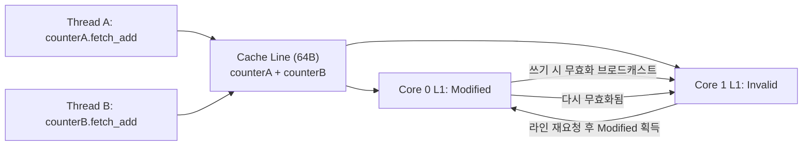

<strong>False sharing(거짓 공유)</strong>란 서로 다른 스레드가 논리적으로는 완전히 무관한 변수를 각자 수정할 뿐인데도, 그 변수들이 우연히 같은 캐시 라인(cache line)에 배치되어 있어서 하드웨어의 캐시 일관성 프로토콜이 실제로는 필요 없는 무효화(invalidation)와 캐시 라인 이동을 반복하며 지연시간과 처리량을 갉아먹는 현상이다. 락도 걸지 않고 스레드마다 독립된 `atomic` 카운터를 하나씩 쓰게 나눴는데도 스레드를 늘릴수록 오히려 초당 처리량이 줄어드는 경험을 했다면, 원인은 대개 알고리즘이 아니라 구조체 멤버가 메모리에 놓인 순서다. 이 장은 그 원인을 하드웨어 수준에서 설명하고, `perf c2c`로 실제 코드에서 문제가 되는 캐시 라인을 짚어낸 뒤, `alignas(std::hardware_destructive_interference_size)`로 회피하는 순서를 다룬다.

## 이 장을 읽기 전에

**선행 지식**: [Lock 선택 기준](/post/concurrency-optimization/lock-selection-criteria-guide/)(이 트랙 02장)에서 다룬 동기화 프리미티브 선택 감각과, [동기화 비용 정량 분석](/post/concurrency-optimization/synchronization-primitive-cost-analysis/)(01장)에서 언급한 캐시 라인 단위 접근 비용을 전제로 한다. `std::atomic`의 기본 사용법(`load`/`store`/`fetch_add`)과 캐시가 메모리를 라인 단위로 다룬다는 사실만 알고 있으면 충분하다.

**이 장의 깊이**: 이 장은 **중급**을 목표로 한다. false sharing이 왜 발생하는지(MESI 프로토콜 수준의 메커니즘), `perf c2c`로 어떻게 실증하는지, `alignas`로 어떻게 고치는지에 집중한다. **다루지 않는 것**: L1/L2/L3 캐시 계층 구조 자체의 하드웨어 분석은 [Tr.05 캐시 계층 구조](/post/cpu-optimization/cache-hierarchy-l1-l2-l3/)로, `acquire`/`release`/`seq_cst` 같은 메모리 순서 의미론은 다음 장인 [C++ 메모리 모델 실무 해석](/post/concurrency-optimization/cpp-memory-model-acquire-release-seqcst/)(04장)으로 넘긴다. 이 장에서 다루는 정렬은 "값이 틀리게 나오는 문제"가 아니라 "값은 맞는데 느린 문제"에 대한 것이라는 점을 먼저 분명히 해 둔다.

## 당신의 수준에 맞는 경로

| 수준 | 읽을 부분 | 핵심 목표 |
|------|---------|---------|
| **입문** | 도입 ~ "캐시 일관성과 false sharing의 메커니즘" | cache line·MESI가 false sharing을 만드는 원리 이해 |
| **중급자** | "perf c2c로 탐지하기" ~ "판단 기준" | 실제 코드에서 공유 캐시 라인을 찾아 정렬로 고치기 |
| **숙련자** | "비판적 시각" | 패딩의 트레이드오프와 도구별 한계 판단 |

---

## 역사와 배경: 캐시 일관성 프로토콜과 표준화

캐시 일관성(cache coherence) 문제는 멀티프로세서가 각자 로컬 캐시를 갖게 된 순간부터 존재했다. 여러 코어가 같은 물리 메모리 주소를 각자의 캐시에 복사해 두면, 한 코어가 값을 바꿨을 때 다른 코어의 사본을 무효화하거나 갱신해야 한다는 문제가 생기고, 이를 해결하기 위해 1980년대에 MESI(Modified-Exclusive-Shared-Invalid) 계열 프로토콜이 정립되었다. false sharing은 이 프로토콜이 "바이트 단위"가 아니라 "캐시 라인 단위"로 동작하기 때문에 생기는 부작용으로, 멀티프로세서 성능 연구 초기부터 알려진 문제였다(대표적으로 Torrellas 등의 1994년 IEEE Transactions on Computers 논문 "False Sharing and Spatial Locality in Multiprocessor Caches"가 이 현상을 정식으로 명명하고 정량화했다).

C++ 표준은 오랫동안 캐시 라인 크기를 포터블하게 알아낼 방법을 제공하지 않았고, 개발자들은 각 플랫폼에서 `64`라는 매직 넘버를 하드코딩하는 관행에 의존해 왔다. 이 공백은 C++17의 P0154R1(JF Bastien, Olivier Giroux, "Hardware Interference Size")로 메워졌다. 이 제안은 `<new>` 헤더에 `std::hardware_destructive_interference_size`와 `std::hardware_constructive_interference_size`라는 두 개의 `constexpr` 값을 추가했다. 전자는 "false sharing을 피하려면 이 값 이상 떨어뜨려라", 후자는 "함께 접근하는 데이터를 한 캐시 라인에 묶으려면 이 값 이하로 배치해라"는 의미로, 서로 반대 목적을 가진 상수다. 다만 이 값들의 실제 도입은 순탄치 않았는데, libc++는 이 상수가 ABI(Application Binary Interface)에 노출되는 문제 때문에 컴파일러가 타깃별 캐시 라인 크기를 컴파일 타임에 알려주는 내장 함수(`__builtin_hardware_destructive_interference_size` 계열)를 갖추기 전까지 오랫동안 이 기능을 비활성 상태로 두었다. 즉 이 상수는 표준에는 C++17부터 있었지만, 실제로 어떤 컴파일러·표준 라이브러리 조합에서 활성화되어 있는지는 여전히 확인이 필요한 사안이다. 컴파일 전에 `__cpp_lib_hardware_interference_size` feature-test 매크로를 확인하는 습관을 들이는 편이 안전하다.

## 캐시 일관성과 false sharing의 메커니즘

현대 x86-64 CPU는 메모리를 보통 64바이트 단위의 캐시 라인으로 L1/L2/L3에 올린다(ARM 서버 코어 일부는 128바이트인 경우도 있어, "64바이트"는 흔한 값일 뿐 보장된 값이 아니다). 코어가 메모리 주소를 읽거나 쓸 때 CPU는 그 주소가 속한 캐시 라인 전체를 가져오고, 그 라인의 상태를 MESI 상태 중 하나로 관리한다. 어떤 코어가 라인을 `Modified` 상태로 갖고 있다는 것은 "이 데이터의 최신 값은 이 코어의 캐시에만 있다"는 뜻이고, 다른 코어가 같은 라인을 읽거나 쓰려면 캐시 간 전송(cache-to-cache transfer)과 무효화가 발생한다.

문제는 이 무효화가 "실제로 겹치는 바이트"가 아니라 "라인 전체"를 기준으로 일어난다는 데 있다. 스레드 A가 구조체의 첫 8바이트를, 스레드 B가 그다음 8바이트를 각각 갱신하더라도, 두 필드가 같은 64바이트 라인 안에 있으면 하드웨어 입장에서는 "같은 캐시 라인을 두 코어가 번갈아 수정한다"는 것 이상을 구분하지 못한다. 그 결과 두 코어의 L1 캐시 사이에서 해당 라인이 `Modified` → `Invalid` → `Modified`를 반복하며 핑퐁(cache line ping-pong)하고, 매 갱신마다 라인 전체를 다시 가져오는 비용이 실제 연산 비용을 압도하게 된다. 이 비용은 논리적으로는 각 스레드가 독립된 변수만 건드리므로 데이터 레이스가 전혀 아니며, 프로그램이 계산하는 값은 항상 정확하다 — 오직 실행 속도만 나빠질 뿐이다.



다음 코드는 두 개의 `atomic<uint64_t>`가 같은 캐시 라인에 인접 배치되어 false sharing이 일어나는 전형적인 구조와, `alignas`로 각 필드를 별도 캐시 라인에 떨어뜨린 수정본을 함께 보여준다. 두 구조체를 같은 벤치마크 루프에 넣어 실행 시간 차이를 직접 재현할 수 있다.

```cpp
// false_sharing_bench.cpp
// 컴파일: g++ -O2 -std=c++20 -pthread false_sharing_bench.cpp -o bench
#include <atomic>
#include <chrono>
#include <cstdio>
#include <cstdint>
#include <new>
#include <thread>

// 문제: a와 b가 인접해 있어 대부분의 플랫폼에서 같은 64바이트 캐시 라인에 놓인다.
struct UnpaddedCounters {
  std::atomic<uint64_t> a{0};
  std::atomic<uint64_t> b{0};
};

// 해결: 각 필드를 hardware_destructive_interference_size 배수 경계로 정렬해
// a와 b가 서로 다른 캐시 라인에 놓이도록 강제한다.
struct PaddedCounters {
  alignas(std::hardware_destructive_interference_size) std::atomic<uint64_t> a{0};
  alignas(std::hardware_destructive_interference_size) std::atomic<uint64_t> b{0};
};

template <typename Counters>
long long run(int iterations) {
  Counters counters;
  auto worker = [&](std::atomic<uint64_t>& target) {
    for (int i = 0; i < iterations; ++i) {
      target.fetch_add(1, std::memory_order_relaxed);
    }
  };
  auto start = std::chrono::steady_clock::now();
  std::thread t1(worker, std::ref(counters.a));
  std::thread t2(worker, std::ref(counters.b));
  t1.join();
  t2.join();
  auto end = std::chrono::steady_clock::now();
  return std::chrono::duration_cast<std::chrono::milliseconds>(end - start).count();
}

int main() {
  constexpr int iterations = 200'000'000;
  std::printf("unpadded (false sharing): %lld ms\n", run<UnpaddedCounters>(iterations));
  std::printf("padded   (aligned):       %lld ms\n", run<PaddedCounters>(iterations));
}
```

x86-64 Linux, GCC 13, `-O2`, 같은 소켓의 서로 다른 물리 코어 두 개에 스레드를 배치한 조건에서는 `UnpaddedCounters`가 `PaddedCounters`보다 대략 3~10배 느리게 나오는 경우가 흔하다. 다만 이 배율은 코어 토폴로지(같은 소켓 vs 다른 소켓 vs 다른 NUMA 노드), 캐시 라인 크기, 컴파일러·최적화 옵션에 따라 크게 달라지므로 절대 수치로 인용하지 말고 자신의 하드웨어에서 직접 재현해야 한다. 또한 이 문제는 데이터 레이스가 아니므로 `-fsanitize=thread`(ThreadSanitizer)로는 잡히지 않는다 — TSan은 "동기화되지 않은 동시 접근"을 탐지하는 도구이지, "정확하지만 느린 메모리 배치"를 탐지하는 도구가 아니다. false sharing 여부를 확인하는 올바른 도구는 실행 시간 측정과 다음 절의 `perf c2c`다.

## perf c2c로 탐지하기

`perf c2c`("cache-2-cache")는 Linux `perf` 도구에 포함된 서브커맨드로, CPU의 하드웨어 이벤트 샘플링을 이용해 어떤 캐시 라인에서 코어 간 캐시 전송(HITM, Hit In Modified)이 자주 일어나는지, 그 라인의 어느 오프셋을 어떤 스레드·명령어·소스 라인이 건드렸는지까지 보여준다. 이 도구는 원래 리눅스 커널과 대형 서버 애플리케이션에서 실제 false sharing 버그를 찾아내며 만들어졌고, 코드를 눈으로 훑어서는 찾기 어려운 "우연히 인접 배치된" 케이스를 통계적으로 짚어낸다는 점에서 유용하다.

```bash
# 위에서 컴파일한 bench 바이너리를 대상으로 기록
perf c2c record -F 60000 -a --all-user -- ./bench

# 리포트 생성 (Shared Data Cache Line Table을 확인)
perf c2c report --stdio
```

리포트 상단의 "Trace Event" 요약에서 `LLC Load Hitm` 비율을 먼저 본다. 이 값이 0에 가깝지 않다면 코어 간 캐시 라인 전송이 실제로 병목이라는 뜻이다. 그 아래 "Shared Data Cache Line Table"에는 문제가 되는 캐시 라인이 HITM 횟수 순으로 정렬되어 나열되고, 대개 상위 한두 줄이 핵심 원인이다. 해당 줄을 선택해 상세 보기로 들어가면 그 라인의 어느 오프셋을 어떤 함수·스레드가 읽고 쓰는지가 나오는데, `UnpaddedCounters` 예제라면 오프셋 `0x0`과 `0x8`을 서로 다른 스레드가 반복해서 쓰고 있다는 것이 그대로 드러난다. `perf_event_paranoid` 커널 설정이 제한적이면 `perf c2c record`가 권한 오류를 낼 수 있으므로, 컨테이너·CI 환경에서는 `sysctl kernel.perf_event_paranoid` 값과 `CAP_PERFMON`(또는 `CAP_SYS_ADMIN`) 권한을 먼저 확인한다. 리눅스 환경이 아니라면(Windows, macOS) 동일한 목적의 하드웨어 카운터 기반 분석은 이 트랙 밖의 주제이므로 [Tr.01 프로파일링·성능 분석](/post/profiling-analysis/getting-started-profiling-performance-analysis-fundamentals/)에서 플랫폼별 대안을 참고한다.

## alignas(std::hardware_destructive_interference_size)로 회피하기

탐지된 캐시 라인을 고치는 표준적인 방법은 문제가 되는 필드를 `alignas(std::hardware_destructive_interference_size)`로 정렬해, 컴파일러가 그 필드를 캐시 라인 경계에 맞춰 배치하고 그 앞뒤에 패딩을 자동으로 넣도록 강제하는 것이다. 위 벤치마크의 `PaddedCounters`가 이 패턴이다. 이 값은 `<new>` 헤더에 정의된 `inline constexpr std::size_t`로, "이 값 이상 떨어뜨리면 서로 다른 캐시 라인에 놓인다고 구현체가 보장한다"는 의미의 하한값이며 구현체마다 다를 수 있다(대부분의 x86-64 구현에서는 64를 반환하지만, 이는 구현 정의(implementation-defined)이지 표준이 못박은 값이 아니다).

패딩을 적용할 때는 반대 방향의 상수인 `std::hardware_constructive_interference_size`도 함께 기억해 둘 필요가 있다. false sharing 회피가 "서로 다른 스레드가 쓰는 데이터를 떨어뜨리는" 것이라면, constructive interference는 "같은 스레드(또는 같은 읽기 그룹)가 함께 접근하는 필드를 오히려 한 캐시 라인 안에 뭉치는" 것을 가리킨다. 예를 들어 통계 카운터의 여러 필드를 한 스레드만 순차적으로 읽고 쓴다면, 그 필드들을 굳이 떨어뜨릴 이유가 없고 오히려 한 라인에 모아 두는 편이 캐시 적중률에 유리하다. 정렬은 "무조건 떨어뜨리는 것"이 아니라 "접근 패턴에 맞게 뭉치거나 떨어뜨리는 것"이라는 관점으로 접근해야 한다.

```cpp
#include <new>
#include <atomic>

// per-thread 카운터 배열: 각 원소를 독립된 캐시 라인에 정렬해
// 서로 다른 스레드가 자신의 원소만 갱신할 때 false sharing을 없앤다.
struct alignas(std::hardware_destructive_interference_size) PerThreadCounter {
  std::atomic<std::uint64_t> value{0};
};

// 스레드 수만큼 배열을 두면 원소 간 false sharing이 사라진다.
// (배열 전체 크기는 스레드 수 * hardware_destructive_interference_size로 커진다.)
inline constexpr int kMaxThreads = 8;
PerThreadCounter counters[kMaxThreads];
```

이 패턴은 스레드별 카운터 배열, MPMC 큐의 헤드/테일 인덱스 분리([SPSC/MPMC 큐와 링버퍼](/post/concurrency-optimization/spsc-mpmc-ring-buffer-queues/)에서 이 문제를 큐 구현 관점으로 더 다룬다), 통계 수집기의 스레드별 슬롯에서 반복적으로 나타난다. 원인이 "여러 스레드가 하나의 공유 변수를 갱신"하는 경합이 아니라 "각자 독립된 변수인데 배치가 우연히 겹치는" 것이라는 점에서, 스레드 로컬 저장소로 아예 변수를 분리하는 대안도 있다 — 이 경우의 비용과 패턴은 [Thread-local Storage 비용과 패턴](/post/concurrency-optimization/thread-local-storage-cost-patterns/)(15장)에서 별도로 다룬다.

## 흔한 오개념 교정

**"false sharing은 결과 값이 틀리게 나오는 버그다"**: 아니다. false sharing은 동기화 실패나 데이터 레이스가 아니라 성능 문제다. 각 스레드가 자신의 변수만 정확하게 갱신하며, 프로그램의 계산 결과는 항상 옳다. 다만 하드웨어가 캐시 라인 단위로 무효화를 반복하느라 그 계산이 느려질 뿐이다. 이 때문에 ThreadSanitizer나 단위 테스트로는 절대 드러나지 않고, 실행 시간 측정이나 `perf c2c` 같은 캐시 이벤트 분석으로만 드러난다.

**"패딩을 넣을수록 무조건 빨라진다"**: 과도한 패딩은 구조체 크기를 불필요하게 키워 캐시에 올라가는 유효 데이터 밀도를 낮추고, 배열을 순회하는 코드에서는 오히려 캐시 미스를 늘릴 수 있다. false sharing 회피는 "쓰기 경합이 실제로 있는 필드"에만 적용해야 하며, 읽기 전용이거나 한 스레드만 접근하는 필드까지 습관적으로 정렬하면 메모리 대역폭과 캐시 공간을 낭비한다.

**"hardware_destructive_interference_size는 항상 64다"**: 이 값은 구현 정의이며, ARM 서버 코어 일부처럼 캐시 라인이 64바이트가 아닌 플랫폼에서는 다른 값을 반환할 수 있다. 또한 이 상수 자체가 모든 컴파일러·표준 라이브러리 조합에서 오랫동안 활성화되어 있지 않았던 이력이 있다(위 "역사와 배경" 참고). 크로스 플랫폼 코드에서는 `__cpp_lib_hardware_interference_size` 매크로로 지원 여부를 확인하고, 지원되지 않는 환경을 위한 폴백(예: 고정값 64 또는 `std::max_align_t` 기반 추정)을 함께 준비한다.

## 판단 기준

| 상황 | 권장 | 비권장 |
|------|------|--------|
| 여러 스레드가 각자 다른 카운터/플래그를 자주 갱신 | `alignas(hardware_destructive_interference_size)`로 필드 분리 | 구조체에 그대로 인접 배치 |
| 한 스레드(또는 읽기 전용)가 여러 필드를 함께 접근 | 오히려 한 캐시 라인에 뭉치기(constructive interference) | 무분별하게 모든 필드에 패딩 적용 |
| MPMC 큐의 head/tail 인덱스처럼 다른 스레드가 다른 인덱스를 갱신 | 인덱스별로 캐시 라인 분리 | 인덱스를 나란히 선언 |
| 의심되지만 확실하지 않은 성능 저하 | 먼저 `perf c2c`나 실행 시간 측정으로 확인 | 추측만으로 정렬 추가 |
| 정적 배열이 아니라 힙에 할당하는 구조체 | 정렬을 만족하는 할당자(`std::aligned_alloc`, `operator new(size, align)`) 사용 | 기본 `new`로 할당 후 정렬 가정 |

## 비판적 시각: 한계와 트레이드오프

`perf c2c`는 Linux 전용이며 하드웨어 성능 카운터(PMU)와 커널 `perf_event` 서브시스템에 의존하므로, 가상화 환경이나 컨테이너에서는 권한·가시성 제약으로 샘플링이 아예 동작하지 않거나 신뢰도가 낮아질 수 있다. Windows나 macOS에서 동등한 원인 분석을 하려면 다른 프로파일러의 메모리 접근 분석 기능에 의존해야 하는데, 이는 이 트랙이 아니라 [Tr.01 프로파일링 트랙](/post/profiling-analysis/getting-started-profiling-performance-analysis-fundamentals/)의 범위다. 샘플링 기반 도구라는 한계도 있다 — 짧게 실행되고 끝나는 코드나 샘플링 주기보다 드물게 발생하는 경합은 놓칠 수 있으므로, `perf c2c`의 "깨끗한" 리포트가 "false sharing이 없다"를 보장하지는 않는다.

패딩 기반 회피 자체도 공짜가 아니다. 캐시 라인 경계로 정렬된 필드마다 최대 `hardware_destructive_interference_size - 1`바이트의 패딩이 추가되므로, 스레드 수나 카운터 종류가 많아지면 메모리 사용량이 눈에 띄게 늘고, 이 늘어난 메모리 자체가 L2/L3 캐시 점유율을 높여 다른 코드 경로의 성능에 간접적으로 영향을 줄 수 있다. 또한 이 상수의 값과 지원 여부가 구현체마다 달라 온 이력 때문에, 정말 이식성이 중요한 코드베이스에서는 표준 상수에만 의존하기보다 대상 플랫폼에서 `perf c2c`(또는 동등 도구)로 실측하는 검증 단계를 항상 거치는 편이 안전하다. 마지막으로, false sharing 회피는 국소적인 레이아웃 최적화이지 알고리즘 차원의 해법이 아니다 — 근본적으로 여러 스레드가 하나의 자원을 놓고 경쟁하는 설계라면, 정렬보다 먼저 [Lock 선택 기준](/post/concurrency-optimization/lock-selection-criteria-guide/)에서 다룬 것처럼 자원 분할이나 알고리즘 자체의 재설계를 검토해야 한다.

## 마무리

- false sharing이 "값이 틀린 버그"가 아니라 "캐시 라인 단위 무효화로 인한 성능 저하"임을 설명할 수 있다.
- MESI 프로토콜이 캐시 라인 단위로 동작하기 때문에 인접한 무관 변수가 서로의 성능을 갉아먹는 메커니즘을 설명할 수 있다.
- `perf c2c record`/`report`로 실제 코드에서 문제 캐시 라인과 HITM 지표를 찾아낼 수 있다.
- `alignas(std::hardware_destructive_interference_size)`로 필드를 분리하고, 그 대가(메모리 증가)와 반대 개념인 constructive interference를 함께 고려해 적용 여부를 판단할 수 있다.
- ThreadSanitizer가 false sharing을 탐지하지 못하는 이유와, 이 문제를 검증하는 올바른 도구(실행 시간 측정, `perf c2c`)를 구분할 수 있다.

**다음 장에서는** false sharing 회피로 레이아웃 문제를 다뤘던 이 장에 이어, C++ 메모리 모델을 실무 관점에서 다룬다. `memory_order_relaxed`/`acquire`/`release`/`seq_cst`가 실제로 무엇을 보장하고 무엇을 보장하지 않는지, 그리고 잘못된 메모리 순서 선택이 어떻게 미묘한 가시성 버그로 이어지는지를 살펴본다. → [C++ 메모리 모델 실무 해석](/post/concurrency-optimization/cpp-memory-model-acquire-release-seqcst/)
