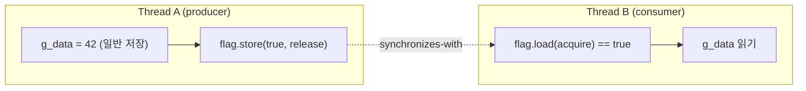

**C++ 메모리 모델**이란 여러 스레드가 원자적 연산을 통해 서로의 메모리 변경을 언제, 어떤 순서로 관찰할 수 있는지를 규정하는 표준의 규칙 집합입니다. `std::atomic`은 "값이 찢어지지 않는다(원자성)"만 보장하는 타입이 아니라, `memory_order` 인자를 통해 "이 연산 주변의 다른 메모리 접근이 다른 스레드에 어떤 순서로 보이는가"까지 함께 규정하는 도구입니다. 이 구분을 흐리게 알고 있으면 `memory_order_relaxed`를 "원자적이니까 안전하겠지"라는 직관으로 쓰다가, 특정 컴파일러 버전이나 ARM 계열 하드웨어에서만 재현되는 데이터 레이스를 만들게 됩니다. 이 장은 relaxed/acquire/release/acq_rel/seq_cst 다섯 가지 순서를 이론적으로 정리하고, 실무에서 반복적으로 나오는 버그 패턴을 깨진 코드로 재현한 뒤 ThreadSanitizer로 검증하는 절차까지 다룹니다.

## 이 장을 읽기 전에

이 장은 [03장: False Sharing 탐지와 회피](/post/concurrency-optimization/false-sharing-detection-avoidance/)에서 다룬 "캐시 라인 단위 가시성" 감각과, `std::atomic`의 기본 사용법(load/store/compare_exchange 시그니처)을 전제로 합니다. `std::mutex`가 왜 필요한지, 어셈블리 수준까지는 몰라도 "두 스레드가 같은 메모리를 동시에 건드리면 문제가 생긴다"는 감각이 있으면 충분합니다.

**이 장의 깊이**: 중급자를 위한 relaxed/acquire/release/seq_cst의 실무적 구분부터, 전문가 구간에서는 happens-before의 형식적 정의, x86/ARM 하드웨어 매핑, 표준 자체의 논쟁까지 다룹니다. **다루지 않는 것**: lock-free 자료구조 설계 자체는 [05장: Lock-free 설계 기초](/post/concurrency-optimization/lock-free-design-fundamentals/)와 [06장: Lock-free 자료구조 구현](/post/concurrency-optimization/lock-free-queue-stack-hashmap/)에서, hazard pointer·RCU는 [07장](/post/concurrency-optimization/hazard-pointer-rcu-cpp26/)에서, `atomic::wait`/`notify` API는 [09장](/post/concurrency-optimization/cpp20-atomic-wait-notify/)에서, seqlock 패턴은 [14장](/post/concurrency-optimization/seqlock-reader-writer-pattern/)에서 각각 다룹니다. 이 장은 그 챕터들이 공통으로 전제하는 "메모리 순서를 해석하는 기준"을 세우는 것이 목표입니다.

## 당신의 수준에 맞는 경로

| 수준 | 읽을 부분 | 핵심 목표 |
|------|---------|---------|
| **중급자** | "메모리 모델의 역사와 배경" ~ "네 가지 순서" | relaxed/acquire/release/seq_cst의 차이와 happens-before 개념 이해 |
| **전문가(정확성)** | "깨진 코드에서 배우는 relaxed의 함정" ~ "흔한 오개념" | 잘못된 relaxed 사용이 만드는 실제 버그와 검증 절차 습득 |
| **전문가(설계)** | "판단 기준" ~ "비판적 시각" | 어떤 순서를 언제 쓸지 판단하고 표준 자체의 한계를 인식 |

---

## 메모리 모델의 역사와 배경

C++ 이전의 멀티스레드 C/C++ 코드는 사실상 컴파일러·하드웨어 벤더의 관행에 기대어 동작했습니다. 표준에는 스레드 개념 자체가 없었기 때문에, `volatile`을 동기화에 쓰거나 특정 컴파일러의 재배치 관행을 신뢰하는 코드가 흔했습니다. 이 공백을 형식화한 것이 **Hans-J. Boehm**과 **Sarita Adve**가 2007~2008년에 발표한 작업으로, 이들은 2007년 WG21 제안서 N2429("A Less Formal Explanation of the Proposed C++ Concurrency Memory Model")와 2008년 PLDI 논문 "Foundations of the C++ Concurrency Memory Model"을 통해 지금 표준에 있는 `memory_order` 체계의 기틀을 놓았습니다. 이 모델은 스레드 개념과 순서 보장을 이미 정의해 둔 **Java Memory Model(JSR-133, 2004)**의 설계 경험을 참고했지만, C++는 최적화 여지가 더 큰 언어이므로 relaxed부터 seq_cst까지 세분화된 순서 옵션을 별도로 두는 방향을 택했습니다. 이 체계는 2011년 C++11 표준(ISO/IEC 14882:2011)에 `<atomic>`으로 채택되었고, 이후 C++20에서 `std::atomic_ref`와 `wait`/`notify`가, C++26에서 `fetch_max`/`fetch_min`이 추가되는 식으로 확장되어 왔습니다. 순서 옵션 중 `memory_order_consume`만은 예외적인 길을 걸었는데, 표준이 정의한 "데이터 의존성 추적" 의미론을 어떤 컴파일러도 실용적 성능으로 구현하지 못해 WG21은 2016년 제안서 P0371로 이를 "당분간 비권장(discourage)"으로 명시했고, 현재 GCC·Clang 등 주요 컴파일러는 `consume`을 그대로 `acquire`로 승격해 처리합니다([WG21 P0371R1](https://www.open-std.org/jtc1/sc22/wg21/docs/papers/2016/p0371r1.html) 참고).

## 네 가지 순서와 happens-before

`std::atomic`의 각 연산에 넘기는 [`memory_order`](https://en.cppreference.com/w/cpp/atomic/memory_order)는 크게 네 가지 실무적 범주로 나뉩니다. **relaxed**는 해당 원자적 연산 자체의 원자성만 보장하고, 그 연산 전후의 다른 메모리 접근과의 순서에는 아무 제약을 걸지 않습니다. **acquire/release**는 한 쌍의 연산 사이에 "release가 acquire보다 먼저 일어났다"는 관계를 세워, release 이전에 그 스레드가 수행한 모든 메모리 접근이 acquire 이후 다른 스레드에서 안전하게 보이도록 만듭니다. **acq_rel**은 하나의 read-modify-write 연산(예: `fetch_add`)이 읽기 측면에서는 acquire처럼, 쓰기 측면에서는 release처럼 동작하도록 두 성질을 합친 것입니다. **seq_cst**(기본값)는 acquire/release의 성질에 더해, 프로그램에 등장하는 모든 seq_cst 연산들이 "모든 스레드가 동의하는 하나의 전역 순서(single total order)"에 속하도록 강제합니다.

이 순서들을 실무적으로 이해하는 열쇠는 **happens-before** 관계입니다. 한 스레드 안에서 앞선 문장은 뒤 문장보다 항상 먼저 일어난 것으로 취급되며(sequenced-before), 서로 다른 스레드 사이에서는 release 연산이 그 값을 읽는 acquire 연산과 짝을 이룰 때만 "synchronizes-with" 관계가 성립합니다. happens-before는 sequenced-before와 synchronizes-with를 계속 이어 붙인(전이적) 관계이며, 두 스레드의 두 메모리 접근 사이에 happens-before 경로가 없으면서 둘 중 하나라도 쓰기라면 그것이 바로 **데이터 레이스**이고 표준상 정의되지 않은 동작(UB)입니다. relaxed만 쓴 연산은 이 synchronizes-with 관계를 만들지 않으므로, 원자적 변수 자체는 안전해도 그 주변의 일반 변수 접근은 여전히 레이스에 노출됩니다. read-modify-write 연산이 release를 여러 번 이어받는 "release sequence" 같은 세부 규칙도 있지만, 실무에서는 "release-acquire 쌍이 성립해야 happens-before가 생긴다"는 원칙만 기억해도 대부분의 판단에 충분합니다.



seq_cst의 "전역 순서" 보장은 acquire/release만으로는 잡히지 않는 미묘한 사례를 막기 위한 장치입니다. 대표적으로 **IRIW(Independent Reads of Independent Writes)** 패턴에서는, 서로 다른 변수에 대한 두 스레드의 쓰기를 관찰하는 다른 두 스레드가 acquire/release만 쓰면 서로 다른 순서로 그 쓰기들을 관찰할 수 있습니다. seq_cst는 이런 경우까지 "모든 스레드가 같은 순서에 동의"하도록 만들지만, 그 대가로 하드웨어에 추가 펜스를 요구합니다. x86-64에서는 TSO(Total Store Order) 덕분에 relaxed/acquire/release load·store가 모두 평범한 `MOV`로 컴파일되고 컴파일러 배리어만 있으면 되는 반면, seq_cst 저장에는 `LOCK XCHG` 또는 `MOV` 뒤에 `MFENCE`가 추가로 필요합니다. ARMv8 AArch64에서는 acquire load가 `LDAR`, release store가 `STLR`로 매핑되어 relaxed보다 이미 한 단계 무겁고, seq_cst는 여기에 `DMB ISH` 펜스가 더 붙습니다. 이 매핑은 컴파일러·ISA 버전에 따라 달라지는 구현 정의 영역이므로, 정확한 명령어는 케임브리지대 연구팀이 정리한 [C/C++11 매핑 표](https://www.cl.cam.ac.uk/~pes20/cpp/cpp0xmappings.html)를 참고하는 것이 좋습니다.

## 깨진 코드에서 배우는 relaxed의 함정

가장 흔한 relaxed 오용은 "플래그 하나로 데이터를 발행(publish)하는" 생산자-소비자 패턴에서 나옵니다. 아래 코드는 겉보기에 멀쩡해 보이지만 표준상 데이터 레이스를 포함합니다.

```cpp
// 깨진 코드: relaxed로는 g_data의 가시성을 보장하지 못한다
#include <atomic>
#include <thread>
#include <cassert>

int g_data = 0;
std::atomic<bool> g_ready{false};

void producer() {
  g_data = 42;                                     // (1) 일반 저장
  g_ready.store(true, std::memory_order_relaxed);   // (2) relaxed 저장
}

void consumer() {
  while (!g_ready.load(std::memory_order_relaxed)) {
    // (3) relaxed 로드로 스핀 대기
  }
  assert(g_data == 42);                             // (4) 정의되지 않은 동작 위험
}

int main() {
  std::thread t1(producer), t2(consumer);
  t1.join();
  t2.join();
}
```

**원인**: relaxed 저장·로드는 `g_ready` 자체의 원자성만 보장할 뿐, (1)과 (2) 사이 또는 (3)과 (4) 사이에 happens-before 관계를 만들지 않습니다. 즉 consumer가 `g_ready == true`를 relaxed로 관찰했다고 해서 (1)의 `g_data = 42`가 (4) 시점에 보인다는 보장이 표준에 없습니다. 컴파일러는 (1)과 (2)가 서로 다른 변수를 건드린다는 이유로 최적화 과정에서 순서를 바꿀 수 있고, ARM처럼 메모리 모델이 약한 하드웨어에서는 코어 사이에 쓰기가 전파되는 순서 자체가 뒤집힐 수 있습니다. 이 버그의 성가신 특징은 재현성이 낮다는 점입니다. x86-64는 TSO 덕분에 같은 스레드 안의 저장-저장, 적재-적재 순서가 하드웨어 차원에서 이미 유지되므로 이 특정 패턴은 x86 CI에서 몇 년을 통과하다가, ARM 서버(AWS Graviton, Azure Cobalt 계열)나 애플 실리콘으로 옮긴 뒤에야 실패하는 사례가 실무에서 드물지 않습니다.

**올바른 구현**은 producer의 저장에 `memory_order_release`를, consumer의 로드에 `memory_order_acquire`를 지정해 두 연산 사이에 synchronizes-with 관계를 명시적으로 세우는 것입니다. 이렇게 하면 producer가 `g_ready`를 release로 쓰기 전에 수행한 모든 메모리 접근이, 그 값을 acquire로 읽은 consumer 시점 이후에는 반드시 보이도록 표준이 강제합니다.

```cpp
// 수정: release-acquire 쌍으로 happens-before를 성립시킨다
#include <atomic>
#include <thread>
#include <cassert>

int g_data = 0;
std::atomic<bool> g_ready{false};

void producer() {
  g_data = 42;
  g_ready.store(true, std::memory_order_release);   // release: 이전 쓰기를 "발행"
}

void consumer() {
  while (!g_ready.load(std::memory_order_acquire)) {
    // acquire: release와 짝지어질 때 g_data 쓰기가 반드시 보임
  }
  assert(g_data == 42);                             // 항상 성립
}

int main() {
  std::thread t1(producer), t2(consumer);
  t1.join();
  t2.join();
}
```

**검증 도구**: 이 차이는 [ThreadSanitizer(TSan)](https://clang.llvm.org/docs/ThreadSanitizer.html)로 재현·확인할 수 있습니다. TSan은 happens-before 그래프를 벡터 시계로 추적하는 방식이라, relaxed 버전은 스케줄에 크게 좌우되지 않고 안정적으로 레이스를 잡아냅니다.

```bash
g++ -std=c++20 -fsanitize=thread -g -O1 relaxed_bug.cpp -o relaxed_bug
./relaxed_bug
# ==================
# WARNING: ThreadSanitizer: data race
#   Write of size 4 at ... by thread T1 (g_data = 42)
#   Previous read of size 4 at ... by main thread (assert(g_data == 42))
# ==================
```

release-acquire로 고친 버전은 같은 명령으로 빌드해도 경고가 사라집니다. TSan은 실행 중 실제로 지나간 경로만 검사하는 동적 도구이므로, 이번처럼 두 스레드가 항상 같은 문장을 실행하는 단순한 흐름에서는 신뢰도가 높지만, 조건부로만 레이스 경로를 타는 코드에서는 그 경로가 실행되지 않으면 놓칠 수 있다는 한계는 기억해 둘 필요가 있습니다. TSan의 표준 오버헤드는 실행 속도 5~15배, 메모리 5~10배 수준이므로 프로덕션이 아니라 CI·개발 단계에서 상시 돌리는 용도로 씁니다.

## 흔한 오개념

**"원자적이니까 순서도 안전하다"**는 가장 널리 퍼진 오해입니다. `std::atomic<T>`는 찢어짐(tearing) 없는 읽기·쓰기만 보장하며, 순서 보장은 오직 `memory_order` 인자가 결정합니다. relaxed 카운터는 값 자체는 항상 정상이지만, 그 카운터 변화와 동시에 있었던 다른 메모리 접근의 가시성 순서는 전혀 보장하지 않습니다.

**"acquire/release가 항상 mutex보다 빠르다"**도 과도한 일반화입니다. 짧은 임계 구역에서 mutex는 futex 시스템 콜 없이 사용자 공간에서 CAS 한두 번으로 끝나는 경우가 많고, acquire/release로 직접 짠 코드는 잘못 짜면 정확성 버그를 추가하면서도 실측 성능은 큰 차이가 없는 경우가 흔합니다. 순서 완화는 프로파일링으로 병목이 확인된 후에만 검토합니다.

**"seq_cst면 무조건 안전하고 relaxed면 무조건 위험하다"**는 이분법도 정확하지 않습니다. seq_cst는 IRIW류의 전역 순서 문제를 막아 주지만 out-of-thin-air 값(어떤 스레드도 실제로 쓴 적 없는 값이 순환적 추론으로 나타나는 현상) 문제까지 규범적으로 배제하지는 못합니다. 표준은 구현이 이런 결과를 피해야 한다는 비규범적 요구만 명시할 뿐, 이를 형식적으로 금지하는 정의는 아직 없습니다. 반대로 relaxed도 "다른 데이터와 무관하게 오직 그 값 자체의 누적만 필요한" 카운터·통계 용도에서는 정확하고 효율적인 선택입니다.

## 판단 기준

| 상황 | 권장 순서 | 이유 |
|------|-----------|------|
| 통계·카운터 누적(다른 데이터 전달 없음) | `relaxed` | 값의 원자성만 필요, 가시성 순서 무관 |
| 플래그로 데이터 발행(producer-consumer) | 쓰기 `release` / 읽기 `acquire` | happens-before로 동반 데이터의 가시성 확보 |
| 여러 원자적 변수 간 전역 순서가 중요 | `seq_cst`(기본값 유지) | 스레드마다 다른 관찰 순서를 보는 미묘한 버그 방지 |
| 순서를 완화하려는 모든 경우 | 프로파일링으로 병목 확인 후에만 완화 | 검증 없는 완화는 버그 위험 대비 이득이 불확실 |
| lock-free 자료구조의 복잡한 다중 연산 상호작용 | [05장](/post/concurrency-optimization/lock-free-design-fundamentals/)·[06장](/post/concurrency-optimization/lock-free-queue-stack-hashmap/)의 검증된 패턴 사용 | 직접 설계는 이 장의 범위를 넘는 위험 부담 |

## 비판적 시각: 한계와 논쟁

C++ 메모리 모델은 세밀한 만큼 대다수의 실무 엔지니어가 정확히 추론하기 어려운 영역으로 남아 있습니다. Boehm과 Adve가 형식화한 지 15년이 넘었지만 out-of-thin-air 문제처럼 학계에서도 완전히 합의된 규범적 해법이 없는 코너 케이스가 존재하고, `memory_order_consume`은 구현 가능한 형태로 표준화하지 못해 사실상 폐기 수순을 밟았습니다. 실무 도구의 한계도 분명합니다. ThreadSanitizer는 동적 분석이라 실행된 스케줄만 검사하며, CDSChecker·GenMC 같은 형식적 모델 체커는 존재하지만 일반적인 CI 파이프라인에 상시 통합되어 있지는 않습니다. 또한 x86 데이터센터가 압도적이던 시절에는 relaxed 오용이 하드웨어 TSO 덕분에 가려지는 경우가 많았지만, ARM 기반 서버(AWS Graviton, Azure Cobalt 등)가 확대되는 흐름에서는 이런 은폐 효과가 줄어들어, 예전에는 "몇 년간 문제없던" 코드가 새 아키텍처로 이전하면서 갑자기 실패하는 사례가 늘어날 수 있습니다. 결론적으로 seq_cst를 기본값으로 유지하고 relaxed·acquire/release로의 완화는 측정된 병목에 대해서만, 검증 도구와 함께 적용하는 보수적 태도가 여전히 합리적입니다.

## 마무리

- happens-before가 sequenced-before와 synchronizes-with의 전이적 결합이라는 것을 설명할 수 있다.
- relaxed/acquire/release/acq_rel/seq_cst 각각이 무엇을 보장하고 무엇을 보장하지 않는지 구분할 수 있다.
- relaxed만으로 데이터를 발행하는 코드가 왜 데이터 레이스인지, release-acquire로 어떻게 고치는지 설명할 수 있다.
- ThreadSanitizer로 이런 레이스를 재현·검증하는 빌드·실행 절차를 수행할 수 있다.
- seq_cst를 기본값으로 유지하고, 완화는 측정된 병목에 대해서만 적용한다는 판단 기준을 적용할 수 있다.

**이전 장**: [False Sharing 탐지와 회피](/post/concurrency-optimization/false-sharing-detection-avoidance/) (챕터 03)

**다음 장에서는** 이 장에서 다진 메모리 순서 감각을 바탕으로 **lock-free 설계**를 다룹니다. CAS 루프의 ABA 문제, HTM/Intel TSX가 2021년부터 기본 비활성화되어 사실상 폐기된 배경, 그리고 "정말 lock-free가 필요한가"를 판단하는 기준을 정리합니다.

→ [Lock-free 설계 기초와 적용 판단](/post/concurrency-optimization/lock-free-design-fundamentals/) (챕터 05)
