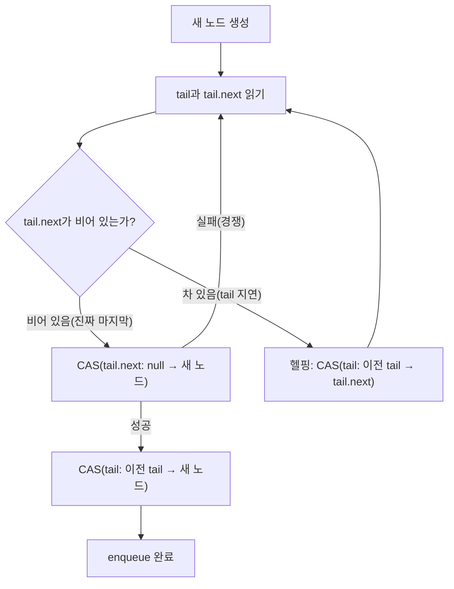

**Lock-free 자료구조 구현**이란 뮤텍스 없이 compare-and-swap(CAS) 등 원자적 연산만으로 큐·스택·해시맵 같은 컨테이너의 삽입·삭제·탐색을 여러 스레드가 동시에 안전하게 수행하도록 만드는 구체적인 알고리즘 패턴을 말합니다. 이전 장에서 "언제 lock-free를 도입할지"를 위험·이득 관점에서 판단했다면, 이 장은 그 판단이 내려진 뒤 실제로 손에 쥐게 되는 문제, 즉 CAS 재시도 루프를 어떻게 설계하고, 뒤처진 포인터를 다른 스레드가 어떻게 대신 밀어주며("헬핑"), 삭제된 노드의 메모리를 언제 돌려줘도 안전한지를 다룹니다. 세 자료구조 각각은 서로 다른 방식으로 이 문제를 풀며, 그 차이를 아는 것이 "왜 lock-free 코드가 겉보기보다 훨씬 어려운가"에 대한 실질적인 답이 됩니다.

## 이 장을 읽기 전에

이 장은 [Lock-free 설계 기초와 적용 판단](/post/concurrency-optimization/lock-free-design-fundamentals/)에서 다룬 CAS 루프의 기본 형태, ABA 문제의 존재, 그리고 "언제 lock-free를 검토할 가치가 있는가"라는 판단 기준을 이미 알고 있다고 전제합니다. 또한 [C++ 메모리 모델 실무 해석](/post/concurrency-optimization/cpp-memory-model-acquire-release-seqcst/)에서 다룬 `memory_order`의 의미(acquire/release가 어떤 재정렬을 막는지)를 안다는 전제하에, 여기서는 그 어휘를 이미 아는 독자를 대상으로 코드를 작성합니다.

**이 장의 깊이**: 전문가 수준입니다. Michael-Scott 큐, Treiber 스택, split-ordered list 기반 해시맵의 구현 패턴을 실제로 컴파일되는 코드로 보이고, 각 구조가 공통으로 마주치는 메모리 회수 문제를 정의합니다. **다루지 않는 것**: ABA 문제의 일반론과 CAS 자체의 문법(선행 장인 [05장](/post/concurrency-optimization/lock-free-design-fundamentals/)에서 다룸), 안전한 메모리 회수의 정식 해법인 hazard pointer·RCU의 구체적인 구현(다음 장인 [07장](/post/concurrency-optimization/hazard-pointer-rcu-cpp26/)에서 다룸), 고정 크기 SPSC/MPMC 링버퍼(별도 자료구조로 [08장](/post/concurrency-optimization/spsc-mpmc-ring-buffer-queues/)에서 다룸), wait-free 보장의 이론적 정의([12장](/post/concurrency-optimization/wait-free-programming-fundamentals/))입니다.

## 당신의 수준에 맞는 경로

| 수준 | 읽을 부분 | 핵심 목표 |
|------|---------|---------|
| **자료구조 배경 지식이 있는 실무자** | "역사와 설계 배경" ~ "Treiber 스택" | CAS 재시도 루프와 즉시 delete가 use-after-free로 이어지는 이유 이해 |
| **lock-free 코드를 리뷰해야 하는 엔지니어** | "Michael-Scott 큐" ~ "흔한 오개념 교정" | 헬핑 메커니즘, 해시맵 점진적 리사이즈 원리, 흔한 오해 구분 |
| **직접 구현·도입을 결정하는 전문가** | "판단 기준" ~ "비판적 시각" | 직접 구현 대 라이브러리 선택, 한계와 검증 비용 판단 |

---

## 역사와 설계 배경

lock-free 큐와 스택의 원형은 놀랍도록 오래되었습니다. **R. Kent Treiber**는 1986년 IBM Almaden 연구소 기술 보고서 "Systems Programming: Coping with Parallelism"에서 CAS 하나로 push/pop을 구현하는 스택 알고리즘을 처음 발표했습니다. 락을 전혀 쓰지 않는 최초의 동시성 스택 구현으로 알려져 있으며, 오늘날 "Treiber stack"이라는 이름 자체가 그의 것입니다. 10년 뒤인 1996년, **Maged Michael과 Michael Scott**은 PODC(Principles of Distributed Computing) 학회에 "Simple, Fast, and Practical Non-Blocking and Blocking Concurrent Queue Algorithms" 논문을 발표하며 단일 CAS로 동작하는 실용적인 non-blocking 큐 알고리즘을 제시했습니다. 이 논문의 큐는 성능이 기존 대안들을 꾸준히 앞서는 것으로 보고되었고, 이후 자바의 `ConcurrentLinkedQueue` 구현의 기반이 되었을 만큼 실무에 안착했습니다. 해시맵 쪽은 조금 늦게, 2006년 **Ori Shalev와 Nir Shavit**이 Journal of the ACM에 발표한 "Split-Ordered Lists: Lock-Free Extensible Hash Tables"에서 처음으로 삽입·삭제·탐색이 모두 O(1) 기대 비용을 가지면서 점진적으로 리사이즈되는 lock-free 해시맵 구조를 제시했습니다. 세 논문 모두 CAS라는 단일 원자적 연산만으로 복잡한 자료구조의 정확성을 증명했다는 공통점이 있습니다.

## 핵심 메커니즘: CAS 재시도, 헬핑, 메모리 회수

세 자료구조는 겉모습이 다르지만 구현 난이도의 원천은 같습니다. 단일 CAS는 "한 워드"만 원자적으로 바꿀 수 있는데, 큐·스택·해시맵의 삽입/삭제는 대개 두 개 이상의 포인터(head와 next, 혹은 tail과 next)를 논리적으로 동시에 갱신해야 합니다. 이 간극을 메우는 방법이 알고리즘마다 다르고, 그 차이가 곧 구현 패턴의 차이입니다.

### Treiber 스택: push와 pop, 그리고 use-after-free 함정

Treiber 스택은 `head`라는 단일 원자적 포인터 하나만 갖는 단일 연결 리스트입니다. push는 새 노드의 `next`를 현재 `head`로 설정한 뒤 CAS로 `head`를 새 노드로 바꾸는 것으로 끝나므로 구현이 짧고 직관적입니다. 문제는 pop입니다. pop은 `head`를 읽고, CAS로 `head`를 `head->next`로 옮긴 뒤, 꺼낸 노드를 반환하고 메모리를 해제해야 하는데, "메모리를 해제해야 한다"는 마지막 한 걸음이 lock-free 스택에서 가장 흔한 버그의 원인입니다. 아래 코드는 그 함정을 그대로 보여줍니다(`-std=c++20` 기준으로 컴파일됩니다).

```cpp
#include <atomic>

struct Node {
  int value;
  Node* next;
};

class BrokenStack {
 public:
  void push(int v) {
    Node* n = new Node{v, nullptr};
    n->next = head_.load(std::memory_order_relaxed);
    while (!head_.compare_exchange_weak(n->next, n,
                                         std::memory_order_release,
                                         std::memory_order_relaxed)) {
    }
  }

  bool pop(int& out) {
    Node* old_head = head_.load(std::memory_order_acquire);
    while (old_head &&
           !head_.compare_exchange_weak(old_head, old_head->next,
                                         std::memory_order_acq_rel,
                                         std::memory_order_acquire)) {
    }
    if (!old_head) return false;
    out = old_head->value;
    delete old_head;  // 위험: 다른 스레드가 아직 old_head를 참조 중일 수 있음
    return true;
  }

 private:
  std::atomic<Node*> head_{nullptr};
};
```

스레드 A가 pop을 시작해 `old_head`를 읽고 CAS 재시도 루프에 진입한 사이, 스레드 B가 같은 노드를 먼저 꺼내 `delete`해 버리면 A는 곧이어 `old_head->next`를 읽는 순간 이미 해제된 메모리에 접근합니다. 더 나쁜 경우는 그 메모리가 다른 할당에 재사용되어 우연히 같은 주소가 다시 등장하면, A의 CAS가 "성공"해 버려 스택이 조용히 손상됩니다. 이는 05장에서 다룬 ABA 문제가 실제 구현에서 구체적으로 어떻게 재현되는지 보여주는 사례이며, 근본 원인은 CAS 로직이 아니라 **"아직 참조 중일 수 있는 메모리를 즉시 해제했다"**는 데 있습니다.

이 문제의 정식 해법은 다음 장에서 다룰 hazard pointer·RCU처럼 "이 노드를 지금 누가 읽고 있는지"를 명시적으로 추적하는 것입니다. 여기서는 C++20이 표준으로 제공하는 더 단순한 대안으로 문제를 해결합니다. 원시 포인터 대신 `std::atomic<std::shared_ptr<Node>>`를 쓰면, `pop`이 반환한 `old_head`가 참조 카운트를 하나 쥔 `shared_ptr`이 되므로 다른 어떤 스레드도 그 노드를 참조하는 동안은 실제 메모리 해제가 미뤄집니다.

```cpp
#include <atomic>
#include <memory>

struct SNode {
  int value;
  std::shared_ptr<SNode> next;
};

class SharedPtrStack {
 public:
  void push(int v) {
    auto n = std::make_shared<SNode>(SNode{v, nullptr});
    n->next = head_.load(std::memory_order_relaxed);
    while (!head_.compare_exchange_weak(n->next, n,
                                         std::memory_order_release,
                                         std::memory_order_relaxed)) {
    }
  }

  bool pop(int& out) {
    std::shared_ptr<SNode> old_head = head_.load(std::memory_order_acquire);
    while (old_head &&
           !head_.compare_exchange_weak(old_head, old_head->next,
                                         std::memory_order_acq_rel,
                                         std::memory_order_acquire)) {
    }
    if (!old_head) return false;
    out = old_head->value;  // old_head가 참조 카운트를 쥐고 있어 여기서 안전하게 접근 가능
    return true;
  }  // old_head 소멸 시 참조 카운트가 0이 되어야만 실제 해제가 일어남

 private:
  std::atomic<std::shared_ptr<SNode>> head_{nullptr};
};
```

이 버전은 use-after-free를 원천적으로 없애지만 공짜가 아닙니다. GCC libstdc++ 구현은 `atomic<shared_ptr<T>>`를 제어 블록 포인터의 최하위 비트를 스핀락으로 쓰는 방식으로 구현하고 있어, `is_lock_free()`가 `false`를 반환하는 경우가 흔합니다. 즉 use-after-free는 해결했지만 "완전한 lock-free"라는 원래 목표는 부분적으로 후퇴한 셈이며, 이 절충을 받아들일 수 없다면 다음 장의 hazard pointer가 대안이 됩니다. 아래 명령으로 두 버전 모두 ThreadSanitizer로 검증할 수 있습니다.

```bash
# BrokenStack: 데이터 레이스는 안 보여도, 여러 스레드가 push/pop을 반복하면
# heap-use-after-free는 AddressSanitizer 쪽에서 더 잘 드러남 (둘은 한 바이너리에 섞을 수 없음)
g++ -std=c++20 -fsanitize=address -g -O1 stack_test.cpp -o stack_asan
./stack_asan   # BrokenStack 경로에서 heap-use-after-free 보고를 기대

g++ -std=c++20 -fsanitize=thread -g -O1 stack_test.cpp -o stack_tsan
./stack_tsan   # SharedPtrStack 경로에서 data race 보고가 없어야 함
```

TSAN과 ASan은 대부분의 컴파일러에서 같은 바이너리에 함께 켤 수 없으므로 따로 빌드해야 하며, 두 검증 모두 타이밍에 의존하는 레이스를 다루는 만큼 스레드 수와 반복 횟수를 충분히 늘려 여러 번 실행해야 신뢰도가 올라갑니다.

### Michael-Scott 큐: 더미 노드와 헬핑

큐는 스택과 달리 `head`(꺼내는 쪽)와 `tail`(넣는 쪽)이라는 두 개의 원자적 포인터를 다뤄야 하는데, 이 둘을 하나의 CAS로 동시에 갱신할 방법이 없다는 것이 근본적인 어려움입니다. Michael-Scott 큐는 이를 두 가지 아이디어로 풉니다. 첫째, 큐가 절대 완전히 비지 않도록 항상 값이 없는 **더미 노드** 하나를 유지합니다. 둘째, `tail`이 실제 마지막 노드보다 한 칸 뒤처져 있는 상태를 정상적인 중간 상태로 인정하고, 그 상태를 발견한 스레드는 자신의 작업을 하기 전에 뒤처진 `tail`을 대신 밀어줍니다. 이 "**헬핑**(helping)"이 있어야 한 스레드가 스케줄링에서 밀려나도 다른 스레드가 전체 진행을 막지 않습니다.



`enqueue`는 다이어그램 그대로 구현됩니다. 메모리 회수는 스택과 동일한 문제이므로 여기서도 `std::atomic<std::shared_ptr<QNode>>`를 재사용해 use-after-free를 막습니다.

```cpp
#include <atomic>
#include <memory>

struct QNode {
  int value{};
  std::atomic<std::shared_ptr<QNode>> next{nullptr};
};

class MSQueue {
 public:
  MSQueue() {
    auto dummy = std::make_shared<QNode>();
    head_.store(dummy, std::memory_order_relaxed);
    tail_.store(dummy, std::memory_order_relaxed);
  }

  void enqueue(int v) {
    auto n = std::make_shared<QNode>();
    n->value = v;
    while (true) {
      auto tail = tail_.load(std::memory_order_acquire);
      auto next = tail->next.load(std::memory_order_acquire);
      if (!next) {
        if (tail->next.compare_exchange_weak(next, n,
                                              std::memory_order_release,
                                              std::memory_order_relaxed)) {
          tail_.compare_exchange_strong(tail, n, std::memory_order_release,
                                         std::memory_order_relaxed);
          return;
        }
      } else {
        // tail이 뒤처짐: 내가 대신 한 칸 밀어주고 처음부터 다시 시도
        tail_.compare_exchange_strong(tail, next, std::memory_order_release,
                                       std::memory_order_relaxed);
      }
    }
  }

 private:
  std::atomic<std::shared_ptr<QNode>> head_;
  std::atomic<std::shared_ptr<QNode>> tail_;
};
```

`dequeue`는 상대적으로 단순합니다. `head`가 가리키는 더미 노드의 `next`가 실제 첫 값이므로, `head->next`가 비어 있으면 큐가 빈 것이고, 그렇지 않으면 그 값을 읽은 뒤 CAS로 `head`를 `head->next`로 옮겨 방금 읽은 노드를 새로운 더미로 승격시키면 됩니다. `head`와 `tail`이 같은 노드를 가리키면서 `next`가 비어 있지 않은 경우는 `enqueue`가 노드를 연결했지만 아직 `tail`을 밀지 못한 과도 상태이므로, `dequeue` 쪽에서도 헬핑으로 `tail`을 먼저 밀어준 뒤 재시도합니다. 두 함수 모두 CAS 실패 시 처음부터 다시 읽는 재시도 루프라는 점에서 Treiber 스택과 근본 패턴이 같습니다.

### Lock-free 해시맵: split-ordered list 개념

해시맵은 큐·스택과 다른 종류의 어려움을 가집니다. 버킷 배열 자체를 리사이즈해야 하는데, "배열을 통째로 교체"하는 순간이 있으면 그 자체가 전역 동기화 지점이 되어 lock-free라는 목표를 무너뜨립니다. Shalev와 Shavit의 split-ordered list는 이 문제를 "버킷 배열을 아예 없앤다"는 발상으로 풉니다. 모든 노드는 처음부터 **하나의 정렬된 연결 리스트**에 들어가며, 정렬 기준은 원래 해시값이 아니라 그 해시값의 **비트를 거꾸로 뒤집은 값**(reversed-bit order)입니다. 버킷 배열의 각 칸은 실제 데이터를 담지 않고, 이 하나의 리스트 안에서 "이 지점부터 이 지점까지가 버킷 k에 해당한다"는 것을 가리키는 **센티넬(더미) 노드**로만 구성됩니다.

```text
list:    sentinel(0) -> node -> node -> sentinel(2) -> node -> sentinel(1) -> node -> ...
buckets: [0]->sentinel(0)   [1]->sentinel(1)   [2]->sentinel(2)   ...
```

리사이즈, 즉 버킷 개수를 두 배로 늘리는 작업은 이 리스트에 새로운 센티넬 노드 몇 개를 CAS로 끼워 넣는 것으로 끝납니다. 실제 데이터 노드는 단 하나도 이동하거나 재해시되지 않으며, 리사이즈 도중에도 다른 스레드의 삽입·삭제·탐색은 계속 진행됩니다. 이 리스트 자체는 실질적으로 정렬된 연결 리스트이므로, 노드를 물리적으로 제거하기 전에 포인터의 최하위 비트를 표시(mark)해 "논리적으로 이미 삭제됨"을 알리는 Harris의 기법과 함께 구현되는 경우가 많습니다. 삽입 중인 스레드가 마킹된 노드 뒤에 새 노드를 이어 붙이려는 CAS는 실패하도록 만들어, 삭제와 삽입이 동시에 같은 지점에서 충돌해도 리스트 구조가 깨지지 않게 하는 것이 핵심입니다. 이 챕터는 이 구조를 완전히 처음부터 구현하는 대신 개념과 CAS가 쓰이는 지점을 보이는 데 집중하며, 프로덕션에서는 뒤에 나올 판단 기준에 따라 검증된 라이브러리를 우선 검토할 것을 권합니다.

## 흔한 오개념 교정

**"CAS 루프만 잘 돌리면 lock-free 자료구조가 완성된다"**는 가장 흔한 오해입니다. 위 세 구현이 보여주듯, CAS는 단일 포인터 갱신의 원자성만 보장할 뿐 헬핑(진행 보장)과 메모리 회수(안전성 보장)는 별도로 설계해야 하며, 이 둘을 빠뜨린 "CAS만 있는" 구현은 겉보기에 동작해도 저경합 테스트를 통과한 뒤 실제 운영 환경의 고경합 상황에서 뒤늦게 깨지는 경우가 많습니다.

**"ABA 문제는 포인터에 태그나 카운터를 붙이면 완전히 사라진다"**는 것도 절반만 맞습니다. 태그 붙이기는 같은 주소가 짧은 시간 안에 재사용될 확률을 줄여줄 뿐이며, 카운터가 오버플로우하거나 재사용 간격이 태그 범위보다 길어지면 여전히 재현될 수 있습니다. 이 장의 `SharedPtrStack`처럼 노드 자체의 생존을 참조 카운트나 hazard pointer로 보장하는 것이 근본적인 해법이고, 07장에서 이를 정식으로 다룹니다.

**"lock-free 자료구조는 항상 mutex 버전보다 빠르다"**도 조건부로만 참입니다. 헬핑과 재시도는 경합이 심할수록 스레드들이 서로의 작업을 대신하거나 반복하며 낭비하는 연산("retry storm")을 늘리고, `head`·`tail` 같은 원자적 변수는 모든 스레드가 같은 캐시 라인을 두고 경쟁하므로 03장에서 다룬 false sharing과 본질적으로 같은 성격의 캐시 라인 핑퐁을 일으킵니다. 아래는 스레드 수를 늘려가며 이 경향을 직접 재현하는 Google Benchmark 스켈레톤입니다(`g++ -O2 -std=c++20 -lbenchmark -lpthread`, x86-64 기준 예시이며 실제 배율은 코어 수·NUMA 토폴로지·컴파일러에 따라 달라집니다).

```cpp
#include <benchmark/benchmark.h>
#include <mutex>
#include <thread>
// SharedPtrStack, MutexStack(직접 정의한 std::mutex + std::vector 래퍼)이 있다고 가정

static void BM_LockFreeStackContention(benchmark::State& state) {
  static SharedPtrStack s;
  for (auto _ : state) {
    s.push(1);
    int out;
    s.pop(out);
  }
}
BENCHMARK(BM_LockFreeStackContention)->Threads(1)->Threads(4)->Threads(16);

static void BM_MutexStackContention(benchmark::State& state) {
  static MutexStack s;
  for (auto _ : state) {
    s.push(1);
    int out;
    s.pop(out);
  }
}
BENCHMARK(BM_MutexStackContention)->Threads(1)->Threads(4)->Threads(16);

BENCHMARK_MAIN();
```

스레드 수를 1에서 16으로 늘려가며 두 곡선의 교차점을 직접 확인하는 것이 "항상 빠르다"는 가정보다 신뢰할 수 있는 근거이며, 이 교차점의 위치가 곧 다음 절의 판단 기준에서 말하는 "경합 수준"입니다.

## 판단 기준: 언제 직접 구현하고 언제 라이브러리를 쓸지

세 자료구조를 직접 구현할 수 있다는 것과 프로덕션에 직접 구현을 투입해야 한다는 것은 다른 문제입니다. 아래 기준은 그 경계를 정하는 데 씁니다.

| 상황 | 권장 | 비권장 |
|------|------|--------|
| 프로덕션에 lock-free 큐/스택이 필요 | 검증된 라이브러리(Boost.Lockfree, moodycamel::ConcurrentQueue 등) | 검증 없이 직접 구현한 코드를 바로 투입 |
| 메모리 회수 전략 없이 구현을 시작 | 07장의 hazard pointer/RCU 또는 `atomic<shared_ptr>`과 함께 설계 | 즉시 `delete`/`free` |
| 스레드 1~2개, 저경합 워크로드 | mutex 기반 큐(01·02장 기준으로 선택) | 복잡한 lock-free 구현 도입 |
| 크기 상한이 있고 SPSC/MPMC로 충분 | 08장의 링버퍼 큐 | 범용 연결 리스트 기반 큐 |
| 해시맵에 반드시 lock-free가 필요 | 검증된 라이브러리 또는 샤딩된 mutex 해시맵 | 직접 split-ordered list 구현 |

이 표의 공통된 결론은 "직접 구현은 학습과 극단적 성능 요구를 위한 것이고, 대부분의 실무는 이미 검증된 구현으로 해결된다"는 것입니다. 직접 구현이 불가피하다면 최소한 회수 전략과 검증 절차(TSAN/ASan, 가능하면 모델 검사)를 설계 단계에 포함해야 합니다.

## 비판적 시각: 한계와 트레이드오프

Michael-Scott 큐와 Treiber 스택의 원 논문은 순차 일관성(sequential consistency)에 가까운 가정 위에서 정확성을 증명하지만, 실제 C++ 구현은 그 증명을 acquire/release라는 더 약한 모델로 옮겨야 합니다. x86처럼 상대적으로 강한 메모리 모델에서는 잘못된 `memory_order`도 우연히 동작하는 경우가 많아 버그가 숨어 있다가, ARM처럼 더 약한 아키텍처에서야 드러나는 일이 드물지 않습니다. 04장에서 다룬 acquire/release의 정확한 의미를 대충 넘기고 이 장의 코드를 그대로 복사하면 바로 이 함정에 빠집니다.

`atomic<shared_ptr>`로 메모리 회수를 해결하는 접근도 무비용이 아닙니다. 앞서 보였듯 GCC libstdc++는 내부적으로 스핀락 비트를 사용해 `is_lock_free()`가 `false`인 경우가 흔하고, 컴파일러·표준 라이브러리 구현에 따라 지원 여부와 성능 특성이 달라지므로 이는 "구현 정의"로 취급하고 대상 플랫폼에서 반드시 직접 확인해야 합니다. 완전한 lock-free 회수가 꼭 필요하다면 다음 장의 hazard pointer가 유일한 정답에 가깝습니다.

마지막으로, lock-free 코드의 정확성은 타이밍에 의존하는 레이스를 다루기 때문에 사람의 코드 리뷰나 몇 차례의 TSAN 실행만으로는 완전히 보증되지 않습니다. Michael-Scott 큐 같은 잘 알려진 알고리즘조차 학술적으로 트레이스 축소(trace reduction)나 분리 논리(separation logic) 기반 모델 검사로 재검증하는 연구가 나오는 이유가 여기에 있습니다. 팀에 이런 검증 인프라가 없다면, 직접 구현의 "이론적으로 맞다"는 확신과 실제 운영 환경에서의 안전성 사이에는 여전히 간극이 남습니다.

## 마무리

- [ ] Treiber 스택의 push/pop이 CAS로 어떻게 동작하는지, 즉시 `delete`가 왜 use-after-free로 이어지는지 설명할 수 있다.
- [ ] Michael-Scott 큐의 더미 노드 구조와 헬핑 메커니즘이 `tail` 지연 문제를 어떻게 해결하는지 설명할 수 있다.
- [ ] split-ordered list 기반 lock-free 해시맵이 버킷 배열 대신 하나의 리스트로 점진적 리사이즈를 가능하게 하는 원리를 설명할 수 있다.
- [ ] `std::atomic<std::shared_ptr<T>>`로 메모리 회수를 해결할 때의 이점과 "완전한 lock-free가 아닐 수 있다"는 한계를 구분할 수 있다.
- [ ] 직접 구현 대신 검증된 라이브러리를 선택해야 하는 기준을 판단 기준 표로 적용할 수 있다.
- [ ] ThreadSanitizer/AddressSanitizer로 lock-free 구현의 정확성을 검증하는 절차를 실행할 수 있다.

이 장에서 세 자료구조 모두가 결국 "메모리를 언제 돌려줘도 안전한가"라는 같은 질문에 부딪힌다는 것을 확인했습니다. 다음 장에서는 이 질문에 대한 정식 해법인 **Hazard Pointer**와 **RCU(Read-Copy-Update)**를 다루며, C++26에 표준화된 `std::hazard_pointer`(P2530)와 `std::rcu`(P2545)가 정작 GCC·Clang·MSVC 세 주요 컴파일러 어디에도 아직 구현되지 않은 현실과, 이 트랙에서 종종 언급되는 "Bloomberg Clang 구현"이라는 통념의 실체까지 확인합니다.

→ [Hazard Pointers·RCU](/post/concurrency-optimization/hazard-pointer-rcu-cpp26/)

### 더 읽을 거리

- [Michael & Scott, "Simple, Fast, and Practical Non-Blocking and Blocking Concurrent Queue Algorithms" (PODC 1996)](https://www.cs.rochester.edu/~scott/papers/1996_PODC_queues.pdf) — 원 논문 PDF
- [Wikipedia: Treiber stack](https://en.wikipedia.org/wiki/Treiber_stack) — Treiber 스택의 배경과 동작 원리
- [Shalev & Shavit, "Split-Ordered Lists: Lock-Free Extensible Hash Tables"](https://ldhulipala.github.io/readings/split_ordered_lists.pdf) — split-ordered list 원 논문 PDF
- [Clang: ThreadSanitizer](https://clang.llvm.org/docs/ThreadSanitizer.html) — `-fsanitize=thread` 사용법과 탐지 범위
- [Raymond Chen, "Inside STL: The atomic shared_ptr"](https://devblogs.microsoft.com/oldnewthing/20241219-00/?p=110663) — `atomic<shared_ptr>`의 내부 구현과 lock-free 여부에 대한 분석
