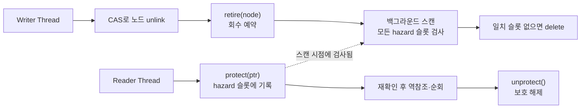

**Hazard Pointers**와 **RCU(Read-Copy-Update)**는 lock-free 자료구조에서 "unlink한 노드를 언제 안전하게 `delete`해도 되는가"라는 **안전한 메모리 회수(safe memory reclamation)** 문제를 푸는 두 가지 대표 기법이다. CAS로 노드를 리스트·큐에서 떼어내는 것 자체는 어렵지 않지만, 그 순간 다른 리더 스레드가 이미 그 노드를 역참조하고 있을 수 있다는 사실이 문제를 만든다. 가비지 컬렉터가 없는 C++에서 이 문제를 해결하지 못하면 lock-free 자료구조는 use-after-free로 귀결되고, 이는 디버깅이 극도로 어려운 간헐적 크래시로 나타난다. 이 장은 이 회수 문제의 두 해법을 원리 수준에서 다루고, C++26에 `hazard_pointer`(P2530)와 `rcu`(P2545)가 표준 헤더로 확정된 사실과 2026년 7월 현재 실제 컴파일러 구현 현황을 함께 짚는다.

## 이 장을 읽기 전에

이 장은 [Lock-free 자료구조 구현](/post/concurrency-optimization/lock-free-queue-stack-hashmap/)에서 CAS 기반 unlink까지는 다뤘지만 "떼어낸 노드를 언제 지울지"는 미뤄둔 지점에서 시작한다. [Lock-free 설계 기초](/post/concurrency-optimization/lock-free-design-fundamentals/)의 진행 보장 개념과 [C++ 메모리 모델 실무 해석](/post/concurrency-optimization/cpp-memory-model-acquire-release-seqcst/)의 acquire/release를 전제로 한다. **이 장의 깊이**는 전문가 구간이다 — hazard pointer·RCU의 내부 메커니즘, C++26 표준 API 형태, 컴파일러별 구현 현황, 그리고 실무 도입 판단 기준까지 다룬다. **다루지 않는 것**: lock-free 큐/스택/해시맵 자체의 구현(→ 이전 장), wait-free 보장의 이론적 조건(→ [Wait-free 프로그래밍 기초](/post/concurrency-optimization/wait-free-programming-fundamentals/)), SPSC/MPMC 큐의 실전 구현(→ 다음 장)이다.

## 당신의 수준에 맞는 경로

| 수준 | 읽을 부분 | 핵심 목표 |
|------|---------|---------|
| **중급자** | "안전한 메모리 회수 문제" ~ "Hazard Pointer 메커니즘" | unlink만으로 왜 충분하지 않은지, hazard pointer의 protect/retire 동작 이해 |
| **심화** | "RCU 메커니즘" ~ "C++26 표준화와 구현 현황" | grace period 개념과 표준 API 형태, 컴파일러 지원 현황 파악 |
| **전문가** | "판단 기준" ~ "비판적 시각" | hazard pointer vs RCU 선택, 표준 대기 vs 서드파티 라이브러리 도입 판단 |

## 역사와 배경

**Hazard pointer**는 Maged M. Michael이 2004년 IEEE Transactions on Parallel and Distributed Systems에 발표한 "Hazard Pointers: Safe Memory Reclamation for Lock-Free Objects" 논문에서 제안한 기법으로, 스레드마다 "지금 역참조 중이라 안전하지 않은(hazardous) 포인터" 슬롯을 두고 회수 전에 검사하는 방식이다. Facebook의 Folly 라이브러리는 이 기법을 `hazptr`로 구현해 2017년부터 프로덕션에서 사용해 왔고, 이 구현이 P2530 제안서의 실증 근거로 쓰였다. **RCU**는 Paul McKenney가 발전시킨 기법으로 Linux 커널에 2002년부터 채택되어 라우팅 테이블·프로세스 목록처럼 읽기가 압도적으로 많은 자료구조에 광범위하게 쓰였고, 이후 liburcu 같은 유저스페이스 포팅이 나왔다. C++ 표준화 작업은 P2530(hazard pointer), P2545(RCU) 두 논문이 SG1(동시성 스터디 그룹)을 거치며 여러 리비전을 거쳤고, 2026년 3월 28일 Croydon 회의에서 C++26 표준 자체가 최종 확정(shipped)되면서 두 기법 모두 `<hazard_pointer>`·`<rcu>` 헤더로 표준 라이브러리에 포함됐다.

## 안전한 메모리 회수 문제

lock-free 자료구조에서 노드를 리스트·큐에서 CAS로 떼어내는 시점과, 그 노드가 실제로 더 이상 아무도 참조하지 않아 안전하게 메모리를 돌려줄 수 있는 시점 사이에는 간극이 있다. 이 간극 동안 다른 리더 스레드가 이미 그 노드의 포인터를 로드해 두고 역참조하려는 중일 수 있으므로, unlink 직후 바로 `delete`하면 use-after-free가 된다. 참조 카운팅(원자적 refcount)으로 이 문제를 풀 수도 있지만, 매 역참조마다 원자적 증감이 필요해 캐시 라인 경합이 커지고, 순환 참조나 ABA 변형 문제까지 겹치면 설계가 급격히 복잡해진다. Hazard pointer와 RCU는 둘 다 "회수를 뒤로 미루고, 미룬 것을 안전하게 판단할 시점을 정의"하는 접근이라는 점에서 같은 문제의식을 공유하지만, "안전을 어떤 단위로 추적하는가"가 근본적으로 다르다.

## Hazard Pointer 메커니즘

Hazard pointer는 **개별 포인터 단위**로 안전을 추적한다. 리더 스레드는 공유 포인터를 역참조하기 전에 자신의 hazard 슬롯에 그 값을 기록(protect)하고, 슬롯에 기록한 값과 원본이 아직 같은지 재확인한 뒤에야 역참조를 시작한다. 다 쓰고 나면 슬롯을 비운다(unprotect). 노드를 회수하고 싶은 스레드는 즉시 `delete`하는 대신 **retire 목록**에 넣어 두고, 주기적으로 모든 스레드의 hazard 슬롯을 스캔해 어떤 슬롯도 가리키지 않는 노드만 실제로 `delete`한다. C++26의 `hazard_pointer_obj_base<T>`는 회수 대상 타입이 상속해 "hazard-protectable"하게 만드는 기반 클래스이고, `hazard_pointer`는 `make_hazard_pointer()`로 얻는 단일-writer 다중-reader 보호 슬롯 하나에 해당한다.

```text
// C++26 표준 초안(P2530R3) 기준 API 형태 요약 — 개념 스케치
// 2026년 7월 현재 GCC/Clang/MSVC 어느 표준 라이브러리도 이 헤더를
// 완전히 구현해 배포하지 않았으므로 아래는 실제로 #include 가능한
// 코드가 아니라 인터페이스 형태를 보여주는 요약이다.
namespace std {
  template<class T, class D = default_delete<T>>
  class hazard_pointer_obj_base;      // 회수 대상 객체가 상속

  class hazard_pointer {
    bool try_protect(T*& ptr, const atomic<T*>& src);  // protect + 재확인
    void reset_protection(T* ptr);                       // 이미 아는 포인터 보호
    void reset_protection();                             // unprotect
  };

  hazard_pointer make_hazard_pointer();
}
```

표준 헤더가 아직 없는 환경에서도 메커니즘 자체는 재현할 수 있다. 아래는 스레드당 hazard 슬롯 하나만 두는 **교육용 최소 구현**으로, `g++ -std=c++20`으로 그대로 컴파일된다. Folly의 `hazptr`이나 향후 libstdc++ 구현은 스레드별 retire 목록·배치 스캔·슬롯 재사용 같은 최적화를 추가로 갖추지만, protect-재확인-retire-scan이라는 뼈대는 동일하다.

```cpp
#include <atomic>
#include <vector>
#include <algorithm>

struct Node { int value; Node* next; };

constexpr int kMaxThreads = 8;
inline std::atomic<Node*> hazard_slots[kMaxThreads]{};
inline std::atomic<int> next_slot{0};
inline thread_local int slot_index = -1;

int my_slot() {
  if (slot_index < 0)
    slot_index = next_slot.fetch_add(1, std::memory_order_relaxed);
  return slot_index;
}

// protect: source가 가리키는 노드를 읽는 동안 안전하다고 표시
Node* protect(std::atomic<Node*>& source) {
  Node* p;
  do {
    p = source.load(std::memory_order_acquire);
    hazard_slots[my_slot()].store(p, std::memory_order_release);
    // p를 슬롯에 기록한 뒤에도 그 사이 source가 바뀌었을 수 있으므로 재확인
  } while (p != source.load(std::memory_order_acquire));
  return p;
}

void unprotect() {
  hazard_slots[my_slot()].store(nullptr, std::memory_order_release);
}

// retire: 실제 프로덕션 구현은 스레드별 목록·배치 스캔을 쓰지만
// 여기서는 뼈대만 남긴 단순화 버전(스레드 안전성 보장 없음, 교육용).
std::vector<Node*> retired;

void retire(Node* node) {
  retired.push_back(node);
  retired.erase(std::remove_if(retired.begin(), retired.end(), [](Node* n) {
    for (auto& slot : hazard_slots)
      if (slot.load(std::memory_order_acquire) == n) return false;
    delete n;
    return true;
  }), retired.end());
}
```

이 구현은 원리를 보여주기 위한 것이며 그대로 프로덕션에 쓰면 안 된다. `retired` 벡터를 여러 스레드가 동시에 `push_back`·`erase`하면 데이터 경쟁이 나므로, 실전에서는 스레드별 retire 목록과 락 없는 배치 스캔이 필요하다. 이 protect/retire 상호작용의 정확성은 `g++ -std=c++20 -fsanitize=thread -g`로 빌드한 뒤 여러 리더·라이터 스레드를 동시에 돌려 race를 재현·검증하는 것이 실무에서 최소한의 확인 절차다.

## RCU 메커니즘

RCU는 **구간(critical section) 단위**로 안전을 추적한다는 점에서 hazard pointer와 근본적으로 다르다. 리더는 `rcu_domain::lock()`으로 read-side critical section에 들어가 락 없이 자유롭게 구조를 순회·역참조하고 `unlock()`으로 나온다. 라이터는 구조를 갱신(예: 링크를 새 버전으로 교체)한 뒤 옛 버전을 즉시 지우지 않고 `rcu_retire()`로 회수를 예약하며, 이 회수는 **grace period**—현재 진행 중인 모든 read-side critical section이 끝나는 시점—가 지난 뒤에야 실행된다. `rcu_synchronize()`를 호출하면 이 grace period가 끝날 때까지 블록한다. read-side가 원자적 증감조차 없이 매우 저렴하다는 것이 RCU의 핵심 장점이지만, 그 대가로 회수가 "가장 오래 걸리는 현재 리더가 끝날 때까지" 지연된다.

```cpp
#include <atomic>
#include <thread>
#include <cstdint>
#include <limits>

// 교육용 epoch 기반 RCU 스타일 데모: grace period를 "모든 활성 epoch가
// 현재 전역 epoch로 갱신됨"으로 근사한 단순화 버전(표준 rcu_domain이 아님).
// 위 hazard pointer 예제와 독립적인, 별도의 최소 재현이다.
constexpr int kMaxReaders = 8;
inline std::atomic<uint64_t> global_epoch{0};
inline std::atomic<uint64_t> reader_epoch[kMaxReaders]{};
inline std::atomic<int> next_reader_slot{0};
inline thread_local int reader_slot = -1;

int my_reader_slot() {
  if (reader_slot < 0)
    reader_slot = next_reader_slot.fetch_add(1, std::memory_order_relaxed);
  return reader_slot;
}

void rcu_read_lock() {
  reader_epoch[my_reader_slot()].store(
      global_epoch.load(std::memory_order_acquire), std::memory_order_release);
}

void rcu_read_unlock() {
  reader_epoch[my_reader_slot()].store(
      std::numeric_limits<uint64_t>::max(), std::memory_order_release);  // 비활성 표시
}

// writer: 갱신 후 이 함수가 반환하면 grace period가 지난 것으로 간주
void rcu_synchronize_demo() {
  uint64_t target = global_epoch.fetch_add(1, std::memory_order_acq_rel) + 1;
  for (auto& e : reader_epoch) {
    while (e.load(std::memory_order_acquire) < target) {
      std::this_thread::yield();  // 실제 구현은 조건변수·타임아웃 등을 씀
    }
  }
}
```

이 데모는 grace period가 "왜" 존재하는지 감을 주기 위한 것이지 표준 `rcu_domain`의 대체물이 아니다. 실전 RCU 구현(liburcu, Linux 커널)은 스핀 대기 대신 배치 처리와 그레이스 기간 합치기(batching)로 writer 지연을 크게 줄이며, 여러 writer가 동시에 갱신을 예약할 때 grace period를 공유해 전체 대기 시간을 상각한다.

## C++26 표준화와 구현 현황

C++26 표준 자체는 확정됐지만, 표준 확정과 컴파일러의 실제 구현 사이에는 늘 시차가 있다. 2025년 10월 GCC 버그 트래커([libstdc++/121979](https://www.mail-archive.com/gcc-bugs@gcc.gnu.org/msg880961.html))에서 담당 개발자 Jonathan Wakely는 "hazard pointer 부분에 대한 의견이 아직 없는 이유는 아마 아무도 구현을 시도하지 않았기 때문일 것"이라고 언급했고, 이후 스레드에서 기여자 한 명이 구현 착수 의사를 밝힌 정도가 2026년 7월 현재 확인 가능한 진행 상황이다. 2026년 4월 출시된 GCC 16.1은 P2996(Reflection), P2900(Contracts) 등 다른 C++26 기능을 추가했지만 `<hazard_pointer>`·`<rcu>` 구현은 포함하지 않았다. libc++(LLVM/Clang) 쪽도 공개된 상태 문서에서 두 제안에 대한 완료 표시를 확인할 수 없었고, MSVC STL 팀은 C++23 기능 작업을 먼저 마무리한 뒤에야 C++26 라이브러리 기능 PR을 받는다는 방침을 밝혀 왔다. 이 트랙 커리큘럼에서 종종 언급되는 "Bloomberg의 실험적 Clang 구현"은 실제로는 P2996(Reflection)을 위한 `bloomberg/clang-p2996` 실험 포크를 가리키는 것으로 보이며, hazard_pointer·rcu에 대한 별도의 Bloomberg Clang 구현체는 이번 조사에서 확인되지 않았다 — 즉 세 주요 컴파일러 모두 두 헤더를 아직 배포하지 않은 상태로 이해하는 것이 안전하다.



## 자주 하는 오해

**"C++26에 들어갔으니 지금 바로 프로덕션에 쓸 수 있다"**는 표준 확정과 라이브러리 구현을 혼동한 것이다. 2026년 7월 현재 GCC·Clang·MSVC 어느 표준 라이브러리도 `<hazard_pointer>`·`<rcu>`를 완성해 배포하지 않았으므로, 지금 필요하다면 Folly의 `hazptr`이나 liburcu 같은 검증된 서드파티 구현을 쓰는 것이 현실적인 선택이다. **"hazard pointer/RCU는 항상 mutex보다 빠르다"**도 과도한 일반화다. hazard pointer는 매 protect마다 재확인 로드가 필요하고 retire 스캔 비용은 스레드 수·retire 목록 크기에 비례해 커지며, RCU는 read-side가 저렴한 대신 grace period 동안 회수가 지연되어 메모리 사용량이 순간적으로 늘 수 있다 — 실제로 어느 쪽이 더 유리한지는 읽기/쓰기 비율과 지연 허용치에 달려 있고 직접 측정해야 한다. **"RCU는 Linux 커널 전용 기법"**이라는 오해도 흔하지만, liburcu 같은 유저스페이스 포팅이 이미 널리 쓰이고 있고 C++26이 이를 언어 표준 수준으로 끌어올렸을 뿐 개념 자체는 커널에 국한되지 않는다.

## 판단 기준

| 기준 | Hazard Pointer | RCU |
|------|-----------------|-----|
| 안전 추적 단위 | 개별 포인터(슬롯) | read-side critical section 전체 |
| reader 비용 | protect마다 원자적 저장 + 재확인 로드 | 매우 낮음(카운터/epoch 갱신 수준) |
| 회수 지연 | 스캔 주기에 의존, 상대적으로 짧게 조절 가능 | grace period(가장 느린 reader) 만큼 지연 |
| 메모리 오버헤드 | 스레드 수 × 슬롯 수에 비례, 예측 가능 | writer가 몰리면 retire 목록이 순간적으로 급증 가능 |
| 적합 워크로드 | 개별 노드 단위 lock-free 자료구조(큐·스택·해시맵) | read-mostly 대규모 구조(라우팅 테이블, 설정 스냅샷) |
| 오늘 당장 도입 | Folly `hazptr` 등 검증된 라이브러리 | liburcu, 또는 자체 epoch 기반 구현 |
| 표준 API 도입 시점 | 세 주요 컴파일러 모두 미구현(2026-07 기준) | 세 주요 컴파일러 모두 미구현(2026-07 기준) |

읽기·쓰기 비율이 극단적으로 읽기 쪽에 치우치고 갱신이 드물다면 RCU의 read-side 저비용이 유리하고, 개별 노드가 자주 삽입·삭제되는 lock-free 큐·스택이라면 hazard pointer의 노드 단위 추적이 더 자연스럽다. 두 경우 모두 지금 시점에는 표준 헤더가 아니라 검증된 서드파티 구현(Folly, liburcu)이나 [이전 장](/post/concurrency-optimization/lock-free-queue-stack-hashmap/)에서 다룬 자체 구현을 실제 선택지로 두어야 한다.

## 벤치마크 스켈레톤

hazard pointer 기반 읽기와 mutex 기반 읽기의 지연시간 차이는 하드웨어·스레드 수·경합 정도에 따라 크게 갈리므로 단정적인 배율을 제시하기보다 직접 측정하는 것이 안전하다. 아래는 앞서 "Hazard Pointer 메커니즘" 절의 `protect`/`unprotect`/`hazard_slots` 정의(같은 번역 단위에 그대로 포함)에 이어붙여 컴파일하는 것을 전제로, hazard pointer 읽기와 단순 `std::mutex` 보호 읽기를 비교하는 Google Benchmark 골격이다(x86-64, GCC 13 이상, `-O2` 가정).

```cpp
#include <benchmark/benchmark.h>
#include <mutex>
// 이 파일 상단에는 "Hazard Pointer 메커니즘" 절의 Node, hazard_slots,
// protect(), unprotect() 정의가 그대로 포함되어 있다고 가정한다.

static std::atomic<Node*> shared_ptr_hp{new Node{1, nullptr}};
static Node* shared_ptr_mutex_target = new Node{1, nullptr};
static std::mutex g_mutex;

static void BM_HazardPointerRead(benchmark::State& state) {
  for (auto _ : state) {
    Node* p = protect(shared_ptr_hp);
    benchmark::DoNotOptimize(p->value);
    unprotect();
  }
}
BENCHMARK(BM_HazardPointerRead)->Threads(4);

static void BM_MutexRead(benchmark::State& state) {
  for (auto _ : state) {
    std::lock_guard<std::mutex> lock(g_mutex);
    benchmark::DoNotOptimize(shared_ptr_mutex_target->value);
  }
}
BENCHMARK(BM_MutexRead)->Threads(4);

BENCHMARK_MAIN();
```

`g++ -O2 bench.cpp -lbenchmark -lpthread -o bench`로 빌드하고 스레드 수를 늘려 가며 실행하면, mutex 쪽은 스레드 수가 늘수록 대기 시간이 급격히 늘어나는 반면 hazard pointer 쪽은 재확인 로드 비용만큼만 증가하는 경향이 흔히 관찰된다. 다만 정확한 배율은 캐시 구조·컴파일러·경합 패턴에 따라 달라지므로, 자신의 타깃 하드웨어에서 재현하지 않은 수치를 그대로 인용하지 않는다.

## 비판적 시각: 한계와 논란

표준화와 구현 사이의 격차는 이 두 기능만의 문제는 아니지만, 유독 이 영역에서는 논쟁적이다. 표준에 오르기 전부터 Folly `hazptr`과 liburcu라는 검증된 산업용 구현이 이미 존재했고, 표준 API가 이들 대비 실질적으로 어떤 이점을 주는지(이식성 이외에) 회의적인 시각도 있다 — 결국 API 표준화가 구현 성숙도를 자동으로 보장하지는 않는다. Hazard pointer는 스레드 수가 늘어날수록 스캔해야 할 슬롯 수가 선형으로 늘어 대규모 스레드 풀에서는 배치·상각 전략 없이는 회수 비용이 무시할 수 없는 수준이 될 수 있다. RCU는 read-side critical section을 오래 붙잡는 버그 하나가 grace period를 무한정 늘려 회수가 밀리고 메모리가 계속 쌓이는 실패 모드를 만들 수 있어, 코드 리뷰에서 "critical section 안에서 블로킹 호출을 하지 않는다"는 규율이 반드시 필요하다. 실무에서는 표준 헤더가 배포되기를 기다리기보다, 이미 프로덕션 검증을 마친 서드파티 구현으로 먼저 도입하고 표준 API로의 전환은 컴파일러 지원이 성숙한 뒤로 미루는 편이 리스크가 낮다.

## 마무리

- [ ] unlink와 delete 사이의 안전한 회수 문제를 스스로의 말로 설명할 수 있다.
- [ ] hazard pointer의 protect-재확인-retire-scan 흐름을 그림 없이도 설명할 수 있다.
- [ ] RCU의 read-side critical section과 grace period 개념, 그리고 grace period가 지연되는 실패 모드를 설명할 수 있다.
- [ ] 2026년 7월 기준 GCC·Clang·MSVC 어디에도 `<hazard_pointer>`·`<rcu>`가 완성 배포되지 않았다는 사실과, 그 상황에서 실무적으로 무엇을 대신 쓸지 판단할 수 있다.
- [ ] 읽기/쓰기 비율과 지연 허용치를 기준으로 hazard pointer와 RCU 중 어느 쪽이 더 맞는 워크로드인지 고를 수 있다.

**이전 장**: [Lock-free 자료구조 구현](/post/concurrency-optimization/lock-free-queue-stack-hashmap/) (챕터 06)

**다음 장에서는** SPSC/MPMC 큐와 링버퍼를 다룬다. 이 장에서 다룬 안전한 회수 문제는 큐 내부 노드가 동적으로 할당·해제되는 설계에서 특히 중요한데, 다음 장은 고정 크기 링버퍼로 애초에 동적 할당 자체를 없애 회수 문제를 우회하는 접근을 함께 보여준다.

→ [SPSC/MPMC 큐와 링버퍼](/post/concurrency-optimization/spsc-mpmc-ring-buffer-queues/) (챕터 08)
