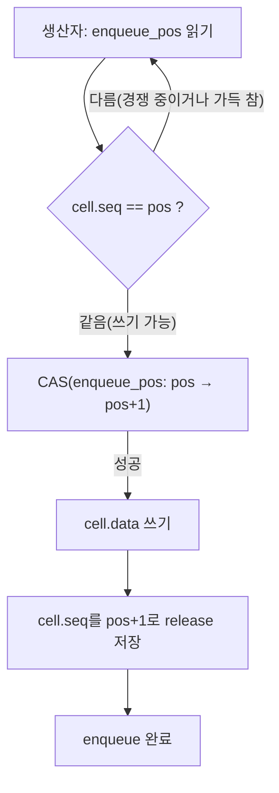

**SPSC/MPMC 큐와 링버퍼**란 고정 크기 배열을 원형으로 재사용하며 생산자·소비자 사이에 값을 전달하는 큐를 말하며, 참여 가능한 생산자·소비자 수(단일 대 다수)에 따라 내부 동기화 방식이 근본적으로 달라지는 자료구조다. 이전 장에서 다룬 Michael-Scott 큐나 Treiber 스택은 크기 제한이 없는 연결 리스트 기반이라 노드마다 동적 할당과 메모리 회수 문제를 떠안는 반면, 이 장이 다루는 링버퍼 큐는 크기를 미리 고정하는 대신 할당을 완전히 없애고 인덱스 두 개만 원자적으로 관리하면 되므로 지연시간이 훨씬 예측 가능하다. 그래서 실시간 로깅 파이프라인, 오디오/네트워크 패킷 처리, 스레드 간 작업 전달처럼 처리량과 꼬리 지연이 동시에 중요한 코드에서는 범용 lock-free 큐보다 이 장의 링버퍼가 실제로 더 많이 쓰인다. 하지만 "생산자가 하나뿐인가, 여럿인가"라는 질문 하나가 구현 난이도를 완전히 다른 수준으로 바꿔 놓는다는 점이 이 장의 핵심 주제다.

## 이 장을 읽기 전에

이 장은 [Lock-free 자료구조 구현](/post/concurrency-optimization/lock-free-queue-stack-hashmap/)(06장)에서 다룬 CAS 재시도 루프의 개념과, [C++ 메모리 모델 실무 해석](/post/concurrency-optimization/cpp-memory-model-acquire-release-seqcst/)(04장)에서 다룬 `acquire`/`release`가 정확히 어떤 재정렬을 막는지를 이미 안다고 전제한다. 또한 [False Sharing 탐지와 회피](/post/concurrency-optimization/false-sharing-detection-avoidance/)(03장)에서 다룬 `std::hardware_destructive_interference_size`와 `alignas`를 이용한 패딩 기법도 여기서 그대로 재사용하므로, 그 장을 읽지 않았다면 먼저 확인하는 것이 좋다.

**이 장의 깊이**: 심화 수준이다. SPSC 큐가 왜 CAS 없이도 정확할 수 있는지, MPMC로 확장할 때 왜 단일 CAS로는 부족해서 셀(cell)마다 별도의 시퀀스 번호가 필요한지를 컴파일 가능한 코드로 보인다. **다루지 않는 것**: 무제한 크기의 연결 리스트 기반 큐(06장에서 다룸), 메모리 회수를 위한 hazard pointer·RCU 자체([07장](/post/concurrency-optimization/hazard-pointer-rcu-cpp26/)에서 다룸), reader-writer 시나리오에 특화된 seqlock 패턴([14장](/post/concurrency-optimization/seqlock-reader-writer-pattern/)에서 다룸), C++20 `atomic::wait`/`notify`를 이용한 블로킹 대기 구현 세부([09장](/post/concurrency-optimization/cpp20-atomic-wait-notify/)에서 다룸)이다.

## 당신의 수준에 맞는 경로

| 수준 | 읽을 부분 | 핵심 목표 |
|------|---------|---------|
| **큐를 처음 직접 구현해 보는 사람** | 도입 ~ "SPSC와 MPMC의 근본적 차이" | 생산자·소비자 수가 왜 구현 난이도를 바꾸는지 이해 |
| **SPSC는 알지만 MPMC 확장을 고민하는 실무자** | "SPSC 링버퍼 구현" ~ "MPMC 링버퍼 구현" | 캐시 라인 패딩·로컬 인덱스 캐싱, per-cell 시퀀스 번호 원리 습득 |
| **큐 종류를 직접 선택·검증해야 하는 전문가** | "판단 기준" ~ "비판적 시각" | 상황별 큐 선택과 용량·정렬 트레이드오프 판단 |

---

## 역사와 배경: 링버퍼 큐가 정착되기까지

스레드 간에 값을 안전하게 전달하는 문제의 이론적 뿌리는 락 없는 동시 읽기/쓰기 자체를 다룬 <strong>레슬리 램포트(Leslie Lamport)</strong>의 1977년 논문 "Concurrent Reading and Writing"(Communications of the ACM)으로 거슬러 올라간다. 이 논문은 뮤텍스 없이도 읽기와 쓰기가 순서대로 관찰되도록 만드는 조건을 처음으로 정식화했고, 오늘날 SPSC 링버퍼가 CAS 없이 인덱스 두 개만으로 정확성을 보장할 수 있는 이유의 이론적 배경이 되었다. 다만 이 논문 자체가 "배열 기반 링버퍼"라는 구체적 자료구조를 제시한 것은 아니며, 인덱스 두 개로 배열을 원형으로 순환시키는 SPSC 큐 패턴은 이후 수십 년에 걸쳐 실무 구현체들이 정착시킨 관용구에 가깝다.

MPMC로 확장하는 문제는 훨씬 늦게, 그리고 다른 경로로 실무에 자리 잡았다. <strong>드미트리 뷰코프(Dmitry Vyukov)</strong>는 2010년 3월 lock-free 알고리즘 메일링 리스트에 셀마다 독립된 시퀀스 번호를 두는 bounded MPMC 큐 알고리즘을 공개했고, 이후 자신의 사이트 1024cores에도 같은 설계를 정리해 두었다. 이 알고리즘은 셀 하나마다 원자적 카운터 하나만 두면 되므로 구현이 비교적 짧으면서도 셀 단위 CAS 재시도만으로 다중 생산자·다중 소비자를 모두 지원한다는 점에서 이후 여러 언어의 표준 라이브러리·오픈소스 큐 구현(예: `rigtorp::MPMCQueue`)에 사실상의 참조 설계로 자리 잡았다. 비슷한 시기 금융 거래소 **LMAX**는 2011년 백서 "Disruptor: High performance alternative to bounded queues for exchanging data between concurrent threads"에서, 인덱스 기반 링버퍼에 시퀀스 배리어(sequence barrier)라는 개념을 얹어 여러 소비자가 서로 다른 처리 단계를 동시에 밟는 파이프라인 구조까지 표준 큐 인터페이스 없이 구현할 수 있음을 보였다. 이 둘은 "인덱스로 링버퍼를 순환시킨다"는 같은 뼈대 위에서, 하나는 범용 MPMC 큐를, 다른 하나는 파이프라인형 이벤트 처리에 특화된 구조를 만들었다는 차이가 있다.

SPSC 쪽에서는 이론이 정착된 뒤에도 실전 성능은 별개의 문제였다. Facebook의 `folly::ProducerConsumerQueue`는 읽기/쓰기 인덱스를 캐시 라인 단위로 패딩해 false sharing을 없앴고, 이후 Erik Rigtorp는 자신의 `rigtorp::SPSCQueue` 벤치마크에서 "패딩만으로는 부족하고, 각 스레드가 상대방의 인덱스를 매번 다시 읽지 않고 로컬에 캐싱해야" 초당 처리량이 한 자릿수 배 이상 뛴다는 것을 실측으로 보였다. 이 장의 SPSC 구현은 이 계보, 즉 패딩과 로컬 인덱스 캐싱이라는 두 개선을 그대로 따른다.

## SPSC와 MPMC의 근본적 차이

SPSC 큐가 CAS 없이도 정확할 수 있는 이유는 각 인덱스를 "쓰는 쪽"이 정확히 하나뿐이기 때문이다. `tail`(쓰기 위치)은 생산자만 갱신하고 소비자는 읽기만 하며, `head`(읽기 위치)는 반대로 소비자만 갱신하고 생산자는 읽기만 한다. 두 스레드가 같은 변수를 동시에 갱신하려고 경쟁하는 상황 자체가 존재하지 않으므로, 필요한 것은 CAS가 아니라 "쓴 값이 상대방에게 보이는 순서"를 보장하는 적절한 `memory_order`뿐이다.

MPMC로 넘어가면 이 전제가 무너진다. 생산자가 둘 이상이면 `tail`을 두 스레드가 동시에 증가시키려는 경쟁이 생기고, 소비자가 둘 이상이면 `head`도 마찬가지다. 이제는 "내가 예약한 슬롯이 진짜 내 것인지"를 CAS로 확정해야 하며, 한 스레드가 슬롯을 예약해 놓고 아직 데이터를 다 쓰지 못한 상태에서 다른 스레드가 그 슬롯을 읽으려 하는 경우까지 구분해야 한다. Vyukov의 해법은 이 구분을 위해 인덱스 하나로는 부족하다고 보고, **슬롯마다 독립된 시퀀스 번호**를 추가한다. 즉 SPSC는 "인덱스 두 개"로 끝나지만 MPMC는 "인덱스 두 개 더하기 슬롯 수만큼의 시퀀스 번호"가 필요하다는 것이 두 설계의 근본적인 차이다.

## SPSC 링버퍼 구현: 깨진 코드에서 검증까지

아래는 겉보기에는 그럴듯하지만 약한 메모리 모델(ARM 등)에서 소비자가 아직 쓰이지 않은 값을 읽을 수 있는 버전이다(`-std=c++20` 기준으로 컴파일된다).

```cpp
#include <atomic>
#include <cstddef>

template <typename T, size_t Capacity>
class BrokenSpscQueue {
 public:
  bool push(const T& value) {
    size_t tail = tail_.load(std::memory_order_relaxed);
    size_t next = (tail + 1) % Capacity;
    if (next == head_.load(std::memory_order_relaxed)) return false;  // 가득 참
    buffer_[tail] = value;
    tail_.store(next, std::memory_order_relaxed);  // 문제: release가 아님
    return true;
  }

  bool pop(T& out) {
    size_t head = head_.load(std::memory_order_relaxed);
    if (head == tail_.load(std::memory_order_relaxed)) return false;  // 비어 있음
    out = buffer_[head];  // 문제: buffer_[head] 쓰기가 아직 안 보일 수 있음
    head_.store((head + 1) % Capacity, std::memory_order_relaxed);
    return true;
  }

 private:
  T buffer_[Capacity]{};
  std::atomic<size_t> head_{0};
  std::atomic<size_t> tail_{0};
};
```

문제는 `tail_.store`가 `memory_order_relaxed`라는 데 있다. x86처럼 저장 순서가 강한 아키텍처에서는 `buffer_[tail] = value`가 `tail_.store`보다 먼저 메모리에 반영되는 경우가 흔해 우연히 잘 동작하지만, 표준이 보장하는 것은 그것이 아니다. `relaxed`는 "다른 스레드가 이 스토어를 관찰했다고 해서 그 이전의 다른 쓰기까지 함께 보인다"는 보장을 만들지 않으므로, 컴파일러 재정렬이나 약한 메모리 모델 CPU에서는 소비자가 갱신된 `tail_`은 보면서 `buffer_[tail]`의 새 값은 아직 못 보는 상황이 이론적으로 가능하다. 04장에서 다룬 것처럼 이 간극을 메우는 것이 정확히 `release`/`acquire` 쌍의 역할이다.

```cpp
#include <atomic>
#include <cstddef>
#include <new>

template <typename T, size_t Capacity>
class SpscQueue {
  static_assert((Capacity & (Capacity - 1)) == 0, "Capacity는 2의 거듭제곱이어야 함");

 public:
  // push는 생산자 스레드만 호출한다고 가정(그렇지 않으면 이 클래스는 안전하지 않음)
  bool push(const T& value) {
    size_t tail = producer_tail_;
    size_t next = (tail + 1) & kMask;
    if (next == producer_cached_head_) {
      producer_cached_head_ = head_.load(std::memory_order_acquire);  // 상대 인덱스 다시 읽기
      if (next == producer_cached_head_) return false;                // 진짜로 가득 참
    }
    buffer_[tail] = value;
    tail_.store(next, std::memory_order_release);  // buffer_ 쓰기 이후 관찰되도록 release
    producer_tail_ = next;
    return true;
  }

  // pop은 소비자 스레드만 호출한다고 가정(그렇지 않으면 이 클래스는 안전하지 않음)
  bool pop(T& out) {
    size_t head = consumer_head_;
    if (head == consumer_cached_tail_) {
      consumer_cached_tail_ = tail_.load(std::memory_order_acquire);  // release와 짝을 이룸
      if (head == consumer_cached_tail_) return false;
    }
    out = buffer_[head];  // release-acquire 쌍 덕분에 안전하게 관찰됨
    head_.store((head + 1) & kMask, std::memory_order_release);
    consumer_head_ = (head + 1) & kMask;
    return true;
  }

 private:
  static constexpr size_t kMask = Capacity - 1;
  alignas(std::hardware_destructive_interference_size) std::atomic<size_t> head_{0};
  alignas(std::hardware_destructive_interference_size) std::atomic<size_t> tail_{0};
  T buffer_[Capacity]{};
  // 아래 두 쌍은 각각 생산자·소비자 스레드만 접근하는 로컬 캐시(원자적일 필요 없음)
  size_t producer_tail_{0};         // 생산자 자신의 현재 tail(유일한 작성자이므로 non-atomic으로 충분)
  size_t producer_cached_head_{0};  // 생산자가 마지막으로 관찰한 head_ 사본
  size_t consumer_head_{0};         // 소비자 자신의 현재 head(유일한 작성자이므로 non-atomic으로 충분)
  size_t consumer_cached_tail_{0};  // 소비자가 마지막으로 관찰한 tail_ 사본
};
```

바뀐 부분은 세 가지다. 첫째, `head_`와 `tail_`을 `alignas(std::hardware_destructive_interference_size)`로 각각 별도 캐시 라인에 고정해 03장에서 다룬 false sharing을 없앴다. 둘째, `tail_.store`/`head_.store`를 `release`로, 상대방 인덱스를 읽는 `load`를 `acquire`로 바꿔 버퍼 쓰기와 인덱스 갱신 사이의 happens-before 관계를 명시했다. 셋째, `producer_cached_head_`·`consumer_cached_tail_` 같은 순수 로컬 변수를 두어, 큐가 가득 차거나 비어 있지 않은 한 상대방의 원자적 인덱스를 매번 다시 읽지 않도록 했다 — 이것이 rigtorp의 실측에서 처리량을 크게 끌어올린 최적화다. 용량을 2의 거듭제곱으로 강제한 것도 우연이 아니다. 나머지(`%`) 연산 대신 비트 마스크(`& kMask`)로 인덱스를 순환시키면 나눗셈 명령 없이 순환 위치를 계산할 수 있다.

```bash
# g++ 13 이상, x86-64 기준. 데이터 레이스나 memory_order 관련 동기화 누락을 검증한다.
g++ -std=c++20 -fsanitize=thread -g -O1 spsc_test.cpp -o spsc_tsan
./spsc_tsan   # 생산자 1개·소비자 1개 스레드로 반복 push/pop 후 data race 보고가 없어야 함
```

TSAN은 `memory_order`가 만드는 happens-before 관계까지 추적하므로, 위 `BrokenSpscQueue`처럼 `release`/`acquire` 쌍이 빠진 상태로 같은 테스트를 돌리면 `buffer_`에 대한 데이터 레이스로 보고될 수 있다(재현 여부는 스케줄링에 따라 달라지므로 여러 번 반복 실행해 확인한다).

## MPMC 링버퍼 구현: per-cell 시퀀스 번호

MPMC 큐는 인덱스 하나로 슬롯 소유권을 확정할 수 없으므로, Vyukov의 설계는 각 슬롯에 **자신의 상태를 나타내는 시퀀스 번호**를 붙인다. 슬롯의 시퀀스가 "쓰기 가능"을 뜻하는 값과 같으면 생산자가 CAS로 그 슬롯을 예약하고, 다 쓴 뒤 시퀀스를 "읽기 가능"으로 한 칸 전진시킨다. 소비자도 대칭적으로 동작한다.



```cpp
#include <atomic>
#include <cstddef>
#include <cstdint>
#include <new>

template <typename T, size_t Capacity>
class VyukovMpmcQueue {
  static_assert((Capacity & (Capacity - 1)) == 0, "Capacity는 2의 거듭제곱이어야 함");

  struct Cell {
    std::atomic<size_t> seq;
    T data;
  };

 public:
  VyukovMpmcQueue() {
    for (size_t i = 0; i < Capacity; ++i) cells_[i].seq.store(i, std::memory_order_relaxed);
  }

  bool push(const T& value) {
    size_t pos = enqueue_pos_.load(std::memory_order_relaxed);
    for (;;) {
      Cell& cell = cells_[pos & kMask];
      size_t seq = cell.seq.load(std::memory_order_acquire);
      intptr_t diff = static_cast<intptr_t>(seq) - static_cast<intptr_t>(pos);
      if (diff == 0) {
        if (enqueue_pos_.compare_exchange_weak(pos, pos + 1, std::memory_order_relaxed)) {
          cell.data = value;
          cell.seq.store(pos + 1, std::memory_order_release);  // 소비자에게 "읽기 가능" 알림
          return true;
        }
      } else if (diff < 0) {
        return false;  // 큐가 가득 참
      } else {
        pos = enqueue_pos_.load(std::memory_order_relaxed);  // 다른 생산자가 앞서감: 재시도
      }
    }
  }

  bool pop(T& out) {
    size_t pos = dequeue_pos_.load(std::memory_order_relaxed);
    for (;;) {
      Cell& cell = cells_[pos & kMask];
      size_t seq = cell.seq.load(std::memory_order_acquire);
      intptr_t diff = static_cast<intptr_t>(seq) - static_cast<intptr_t>(pos + 1);
      if (diff == 0) {
        if (dequeue_pos_.compare_exchange_weak(pos, pos + 1, std::memory_order_relaxed)) {
          out = cell.data;
          cell.seq.store(pos + Capacity, std::memory_order_release);  // 다음 랩에서 재사용 가능
          return true;
        }
      } else if (diff < 0) {
        return false;  // 큐가 비어 있음
      } else {
        pos = dequeue_pos_.load(std::memory_order_relaxed);
      }
    }
  }

 private:
  static constexpr size_t kMask = Capacity - 1;
  Cell cells_[Capacity];
  alignas(std::hardware_destructive_interference_size) std::atomic<size_t> enqueue_pos_{0};
  alignas(std::hardware_destructive_interference_size) std::atomic<size_t> dequeue_pos_{0};
};
```

`diff`가 0이면 그 슬롯이 정확히 지금 필요한 상태(생산자에게는 "비어 있음", 소비자에게는 "값이 있음")라는 뜻이고, CAS로 `enqueue_pos_`/`dequeue_pos_`만 원자적으로 전진시키면 슬롯 소유권이 확정된다. `diff`가 음수면 아직 그 랩(lap)의 데이터가 준비되지 않았거나 소비되지 않은 것이므로 큐가 가득 찼거나 비었다는 뜻이고, 양수면 다른 스레드가 이미 그 위치를 지나갔다는 뜻이라 최신 위치를 다시 읽고 재시도한다. 슬롯당 CAS는 `enqueue_pos_`/`dequeue_pos_` 자체에 대해서만 걸리고 `cell.data` 쓰기는 소유권을 확정한 스레드만 수행하므로, 여러 생산자가 동시에 호출해도 같은 슬롯에 두 번 쓰는 일은 일어나지 않는다. 이 구현도 여러 생산자·소비자 스레드로 `-fsanitize=thread` 빌드를 반복 실행해 데이터 레이스가 없는지 확인해야 하며, 특히 `compare_exchange_weak`에 `relaxed`를 쓴 부분은 실패 시 재시도만 하므로 안전하지만 성공 이후의 `cell.data` 접근과 `cell.seq` release 저장 사이의 순서가 어긋나지 않는지는 반드시 TSAN으로 재확인한다.

## 흔한 오개념 교정

<strong>"SPSC에서 잘 동작하던 큐에 락만 안 걸면 MPMC로도 쓸 수 있다"</strong>는 이 장에서 다룬 것 중 가장 위험한 오해다. SPSC 코드를 그대로 두고 생산자·소비자 스레드 수만 늘리면, `tail_`이나 `head_`를 두 스레드가 동시에 갱신하려는 경쟁이 곧바로 생겨 값이 겹쳐 쓰이거나 유실된다. MPMC로 확장하려면 이 장에서 본 것처럼 슬롯 단위 시퀀스 번호나 최소한 인덱스 자체의 CAS 재시도 루프가 반드시 추가되어야 한다.

<strong>"용량은 아무 정수나 되고, 나머지 연산으로 인덱스를 순환시키면 그만이다"</strong>도 흔한 생략이다. 용량이 2의 거듭제곱이 아니면 `%`를 비트 마스크(`&`)로 대체할 수 없어 매 push/pop마다 나눗셈 명령이 들어가고, 컴파일러가 상수 폴딩으로 최적화해 주지 못하는 런타임 크기라면 그 비용이 그대로 남는다. 위 두 구현이 `static_assert`로 2의 거듭제곱을 강제하는 이유가 여기에 있다.

<strong>"패딩만 해두면 SPSC 큐 성능은 다 나온다"</strong>는 절반만 맞는다. `head_`·`tail_`을 캐시 라인으로 분리하는 것은 false sharing을 없애는 필요조건이지만, 이 장의 `cached_tail_`/`cached_head_`처럼 상대방의 원자적 인덱스를 매 연산마다 다시 읽지 않고 로컬에 캐싱하는 것까지 더해야 rigtorp가 실측한 수준의 처리량 향상이 나온다. 패딩과 로컬 인덱스 캐싱은 서로 다른 문제(라인 경합 대 원자적 로드 빈도)를 해결하므로 하나만 적용하고 멈추면 개선 폭이 제한적이다.

## 판단 기준: 언제 SPSC, 언제 MPMC를 쓸지

| 상황 | 권장 | 비권장 |
|------|------|--------|
| 생산자·소비자가 각각 정확히 하나 | 이 장의 SPSC 링버퍼(락·CAS 불필요) | MPMC 큐를 그대로 축소 사용 |
| 다수 생산자 또는 다수 소비자가 실제로 필요 | Vyukov 계열 per-cell 시퀀스 MPMC 또는 검증된 라이브러리(`moodycamel::ConcurrentQueue`, `rigtorp::MPMCQueue`) | SPSC 큐에 락만 얹어 확장 |
| 크기 상한을 미리 알 수 있는 파이프라인 | 고정 용량 링버퍼(2의 거듭제곱) | 무제한 연결 리스트 큐(06장) 남용 |
| 여러 소비자가 서로 다른 처리 단계를 밟는 파이프라인 | LMAX Disruptor류 시퀀스 배리어 구조 | 단순 큐를 단계마다 중첩 |
| 프로덕션에 직접 구현을 투입 | 회귀 벤치마크 + TSAN 검증 후 도입 | 검증 없이 커스텀 MPMC를 바로 배포 |

## 비판적 시각: 한계와 트레이드오프

SPSC 큐의 가장 큰 제약은 이름 그대로다. 생산자나 소비자가 둘 이상으로 늘어나는 순간 이 장의 첫 번째 구현은 정의상 안전하지 않으며, "일단 스레드 하나 더 붙여서 확장"하는 임시방편은 앞서 다룬 오개념 그대로 값 유실이나 손상으로 이어진다. 확장이 예상된다면 처음부터 MPMC 설계로 시작하는 편이 나중에 재작성하는 것보다 싸다.

Vyukov MPMC 큐도 무비용은 아니다. 셀마다 시퀀스 번호를 위한 추가 공간이 들고, 경합이 심한 구간에서는 `compare_exchange_weak` 재시도가 늘어나는 retry storm이 06장에서 다룬 것과 같은 성격으로 나타난다. 또한 이 큐는 **bounded**(고정 용량)라서 가득 찬 상태에서의 정책(블로킹 대기, 실패 반환, 오버라이트)을 호출자가 별도로 설계해야 하며, 이 장의 구현은 실패를 반환하는 가장 단순한 정책만 보였다는 점도 분명히 해 둔다.

용량을 얼마나 크게 잡을지도 트레이드오프다. 너무 작으면 순간적인 부하 스파이크에서 생산자가 자주 막히고, 너무 크게 잡으면 캐시에 올라가는 데이터 영역이 넓어져 오히려 지역성이 떨어지고 대기 중인 항목의 꼬리 지연이 늘어난다. 이 값은 이론으로 정할 수 없고, 실제 워크로드의 도착률·처리율 분포를 프로파일링해 정하는 것이 유일하게 신뢰할 수 있는 방법이다.

## 마무리

- [ ] SPSC 큐가 CAS 없이도 정확한 이유(인덱스마다 쓰는 스레드가 하나뿐이라는 것)를 설명할 수 있다.
- [ ] `release`/`acquire` 쌍이 빠진 인덱스 갱신이 왜 버퍼 쓰기의 가시성 문제로 이어지는지 설명할 수 있다.
- [ ] 캐시 라인 패딩과 로컬 인덱스 캐싱이 각각 어떤 성능 문제를 해결하는지 구분할 수 있다.
- [ ] Vyukov MPMC 큐의 per-cell 시퀀스 번호가 슬롯 소유권을 어떻게 확정하는지 설명할 수 있다.
- [ ] SPSC를 MPMC로 함부로 확장하면 안 되는 이유와, 용량을 2의 거듭제곱으로 강제하는 이유를 말할 수 있다.
- [ ] 상황별로 SPSC·MPMC·Disruptor류 구조 중 무엇을 선택할지 판단 기준 표로 적용할 수 있다.

이 장에서 링버퍼 큐가 인덱스(SPSC) 또는 인덱스와 셀별 시퀀스 번호(MPMC)만으로 할당 없이 스레드 간 값을 전달하는 원리를 확인했다. 다음 장에서는 이 장의 예제 전반에서 반복해 등장한 `load`/`store`/`compare_exchange` 패턴을 표준이 어떻게 더 다듬었는지, 즉 **C++20의 `atomic::wait`/`notify`**로 스핀 대신 효율적으로 대기하는 방법을 다룬다.

→ [C++20 Atomics 실전](/post/concurrency-optimization/cpp20-atomic-wait-notify/) (09장)

### 더 읽을 거리

- [Dmitry Vyukov, "Bounded MPMC queue"](https://sites.google.com/site/1024cores/home/lock-free-algorithms/queues/bounded-mpmc-queue) — per-cell 시퀀스 번호 기반 MPMC 큐의 원 설계 문서
- [Erik Rigtorp, "Optimizing a Ring Buffer for Throughput"](https://rigtorp.se/ringbuffer/) — 캐시 라인 패딩과 로컬 인덱스 캐싱의 실측 효과 분석
- [rigtorp/SPSCQueue](https://github.com/rigtorp/SPSCQueue) — wait-free/lock-free SPSC 큐의 실전 C++11 구현
- [folly/ProducerConsumerQueue.h](https://github.com/facebook/folly/blob/main/folly/ProducerConsumerQueue.h) — `hardware_destructive_interference_size`로 인덱스를 패딩한 SPSC 큐 구현
- [LMAX, "Disruptor: High performance alternative to bounded queues"](https://lmax-exchange.github.io/disruptor/disruptor.html) — 시퀀스 배리어 기반 링버퍼 파이프라인 설계 백서
