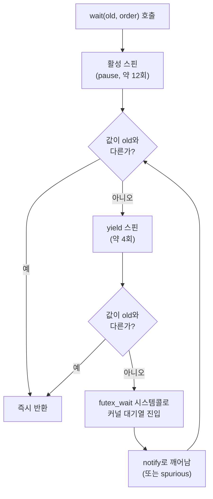

**C++20 Atomics 실전**이란 `std::atomic<T>::wait`/`notify_one`/`notify_all`을 이용해 "값이 바뀔 때까지 CPU를 태우며 도는" 스핀 폴링을 "커널이 깨워줄 때까지 잠드는" 대기로 바꾸는 실무 패턴을 말합니다. C++20 이전에는 이런 대기를 만들려면 직접 futex를 호출하거나 mutex+condition_variable을 끌어와야 했고, 둘 다 표준 라이브러리 차원에서 원자적 값 하나만 감시하기에는 무겁거나 이식성이 낮았습니다. 이 장은 `wait`/`notify`가 내부적으로 스핀과 커널 대기를 어떻게 오가는지, 이 API를 잘못 쓰면 왜 스레드가 영원히 멈추는지, 그리고 C++26에서 표준화된 `fetch_max`/`fetch_min`이 이 원자적 연산 계열에 무엇을 더하는지를 다룹니다.

## 이 장을 읽기 전에

이 장은 [동기화 비용 정량 분석](/post/concurrency-optimization/synchronization-primitive-cost-analysis/)(챕터 01)에서 다룬 futex 시스템 콜의 uncontended/contended 비용 감각과, [C++ 메모리 모델 실무 해석](/post/concurrency-optimization/cpp-memory-model-acquire-release-seqcst/)(챕터 04)에서 다룬 `memory_order`의 acquire/release 의미론을 전제로 합니다. `std::atomic`이 무엇이고 `store`/`load`/`compare_exchange`를 써 본 경험이 있으면 충분합니다. 또한 이 장은 [SPSC/MPMC 큐와 링버퍼](/post/concurrency-optimization/spsc-mpmc-ring-buffer-queues/)(챕터 08)에서 큐가 비었을 때 소비자를 어떻게 재우는지의 구현 디테일로 `wait`/`notify`를 이미 언급했던 바로 그 메커니즘을 정면으로 다룹니다.

**이 장의 깊이**는 **중급**입니다. `wait`/`notify_one`/`notify_all`의 정확한 동작 규약, libstdc++가 이를 futex 위에 구현하는 방식, 그리고 이 API를 쓸 때 실제로 발생하는 버그 패턴(notify 누락)과 그 검증법을 다룹니다. C++26 `fetch_max`/`fetch_min` 확장도 이 장에서 함께 정리합니다. **다루지 않는 것**은 다음과 같습니다. `condition_variable`의 예측(predicate) 대기·spurious wakeup 대응·성능 비교의 심화 내용은 [Condition Variable 성능 패턴](/post/concurrency-optimization/condition-variable-performance-patterns/)(챕터 19)에서, SPSC/MPMC 큐 자체의 설계와 백프레셔 처리는 챕터 08에서, `std::barrier`/`std::latch` 같은 집합 동기화 지점은 [C++20 Barrier/Latch 활용](/post/concurrency-optimization/cpp20-barrier-latch-synchronization-patterns/)(챕터 20)에서 각각 다룹니다.

## 당신의 수준에 맞는 경로

| 수준 | 읽을 부분 | 핵심 목표 |
|------|---------|---------|
| **초보자** | "배경" ~ "wait·notify의 동작 원리" | wait/notify가 무엇을 대체하는지, 기본 시그니처와 규약 이해 |
| **중급자** | "libstdc++ 내부 구현" ~ "흔한 오개념 교정" | 스핀-투-블록 전환 구조를 이해하고 notify 누락 버그를 스스로 재현·수정 |
| **전문가** | "판단 기준" ~ "비판적 시각" | wait/notify vs 스핀 vs condition_variable 선택, fetch_max/min의 실질적 이득 판단 |

## 배경: 폴링에서 표준 대기·통지로

원자적 값 하나가 바뀌기를 기다리는 코드는 오랫동안 두 극단 중 하나를 골라야 했습니다. `while (flag.load() == old) { }` 같은 순수 스핀은 지연시간은 가장 짧지만 대기가 길어지면 CPU 코어 하나를 통째로 태우고, 반대로 `std::mutex` + `std::condition_variable`은 대기 비용은 줄지만 원자값 하나 감시에 락과 조건변수 객체까지 끌어와야 했습니다. Linux 커널은 이미 2002년에 이 문제의 커널 측 해법을 냈습니다. Hubertus Franke, Matthew Kirkwood, Ingo Molnár, Rusty Russell이 Ottawa Linux Symposium 2002에서 발표한 [futex(fast userspace mutex)](https://man7.org/linux/man-pages/man2/futex.2.html)는 "경합이 없으면 유저스페이스에서 원자 연산만으로 끝내고, 경합이 있을 때만 커널 대기열을 쓰는" 설계를 제시했습니다. C++ 표준은 이 아이디어를 라이브러리 차원에서 표준화하는 데 한참 걸렸는데, Bryce Adelstein Lelbach·Olivier Giroux·JF Bastien 등이 주도한 [P1135(The C++20 Synchronization Library)](https://www.open-std.org/jtc1/sc22/wg21/docs/papers/2019/p1135r6.html)가 여러 하위 제안(효율적인 atomic 대기를 다룬 P0514 포함)을 통합해 C++20에 `atomic<T>::wait`/`notify_one`/`notify_all`과 `atomic_flag`의 대응 함수들을 추가했습니다. 요점은 "플랫폼이 futex 같은 효율적인 커널 대기 메커니즘을 제공하면 그것을 쓰고, 없으면 표준 라이브러리가 내부적으로 대체 구현을 제공한다"는 이식 가능한 계약을 표준이 직접 규정했다는 것입니다.

## wait·notify의 동작 원리

`std::atomic<T>`는 세 개의 멤버 함수로 이 계약을 구현합니다.

```cpp
void wait(T old, std::memory_order order = std::memory_order_seq_cst) const noexcept;
void notify_one() noexcept;
void notify_all() noexcept;
```

`wait(old, order)`는 "현재 값을 `order`로 읽어 `old`와 비교하고, 다르면 즉시 반환하고, 같으면 `notify_one`/`notify_all`에 의해 깨어나거나 스퓨리어스(spurious)하게 풀릴 때까지 블록한다"를 반복하는 것과 같습니다. 이 재확인 루프 덕분에 "체크하는 순간과 블록하는 순간 사이에 값이 바뀌어 통지를 놓치는" 전형적인 lost-wakeup 경쟁 조건이 API 차원에서 봉쇄됩니다. `order`에는 `memory_order_relaxed`/`consume`/`acquire`/`seq_cst`만 허용되고 `release`/`acq_rel`을 넘기면 미정의 동작인데, `wait`가 내부적으로 순수한 로드(load) 연산이라 release 계열 순서가 의미를 가질 수 없기 때문입니다. `notify_one()`은 대기 중인 스레드가 있으면 적어도 하나를 깨우고, `notify_all()`은 전부 깨우며, 대기자가 없으면 둘 다 아무 일도 하지 않습니다. `atomic_flag` 역시 C++20부터 동일한 `wait`/`notify_one`/`notify_all`을 지원하는데, `atomic_flag`의 `test`/`clear` 자체는 항상 lock-free가 보장되지만 `wait`는 다른 원자 타입과 마찬가지로 커널 대기를 수반할 수 있다는 점은 구분해서 기억할 필요가 있습니다.

### libstdc++ 내부 구현: 스핀 다음 futex

표준은 "효율적으로 대기한다"는 요구만 하고 구현 방식은 정하지 않으므로, 실제 동작은 표준 라이브러리 구현체(libstdc++/libc++/MSVC STL)마다 다른 구현 정의 사항입니다. libstdc++의 구현은 대기를 진입 즉시 커널로 넘기지 않고 여러 단계를 거칩니다. 먼저 `pause` 명령어를 곁들인 순수 스핀을 약 12회 반복하며 조건을 재확인하고, 실패하면 `sched_yield`를 곁들인 스핀을 4회 더 시도하고, 그래도 조건이 안 맞으면 정책 기반 스핀을 거친 뒤에야 비로소 `futex(FUTEX_WAIT, ...)` 시스템 콜로 진입해 커널 대기열에 들어갑니다. 값이 `int`나 `uint64_t`처럼 플랫폼의 `__platform_wait_t`와 크기·정렬이 맞지 않는 타입(예: 큰 구조체를 감싼 `atomic`)은 futex가 직접 감시할 수 없으므로, libstdc++는 원자 객체의 주소를 해시해 프록시 대기 테이블(waiter pool)에서 대리 `__platform_wait_t` 값을 찾아 그것으로 futex를 대신 걸어 줍니다. futex 자체가 없는 플랫폼에서는 표준이 요구하는 `mutex`+`condition_variable` 조합으로 완전히 폴백합니다. `notify_one`/`notify_all` 쪽도 최적화가 들어가 있어서, 실제로 시스템 콜을 걸기 전에 "대기자가 있을 가능성이 있는지"를 가벼운 원자 로드로 먼저 확인하는데, 이 최적화 덕분에 대기자가 없는 흔한 경우 통지 비용이 futex 시스템 콜 수십 나노초에서 로드 한 번 수준(수 나노초)으로 줄어든다는 사실이 [Red Hat의 libstdc++ 구현 해설](https://developers.redhat.com/articles/2022/12/06/implementing-c20-atomic-waiting-libstdc)에서 보고된 바 있습니다.



이 도표는 libstdc++ 구현의 일반적인 흐름을 보여주지만, 스핀 반복 횟수·정책·프록시 테이블 유무는 표준 라이브러리 버전과 플랫폼(libc++·MSVC STL·Darwin의 `ulock_wait` 대체 경로 등)에 따라 달라지는 구현 정의 사항이므로, 특정 수치를 코드 설계에 하드코딩해서는 안 됩니다.

### 스핀-투-블록 패턴을 사용자 코드에 적용하기

라이브러리 내부가 이미 스핀 후 블록을 해 주므로, 사용자 코드 대부분은 `wait`를 그냥 호출하면 됩니다. 다만 "아주 짧게만 기다릴 가능성이 높다"는 걸 호출자가 알고 있는 특수한 핫패스(예: 락프리 큐의 슬롯 하나가 채워지길 기다리는 경우)에서는 라이브러리의 범용 스핀 정책보다 워크로드에 맞춘 자체 스핀 한도를 먼저 두고, 그래도 안 되면 `wait`로 넘기는 하이브리드가 유리할 수 있습니다.

```cpp
#include <atomic>
#include <thread>

// 짧은 대기가 흔한 핫패스용 하이브리드: 우선 몇 번 스핀하고, 안 되면 wait로 위임
template <typename T>
void spin_then_wait(const std::atomic<T>& a, T old,
                     int spin_limit = 64,
                     std::memory_order order = std::memory_order_acquire) {
  for (int i = 0; i < spin_limit; ++i) {
    if (a.load(order) != old) return;
    if ((i & 15) == 15) std::this_thread::yield();  // 과도한 스핀은 다른 스레드 진행을 막을 수 있음
  }
  a.wait(old, order);  // 스핀 한도 초과 시 커널 대기로 위임 (재확인은 wait 내부가 처리)
}
```

이 래퍼는 라이브러리 내부 스핀과 이중으로 겹치므로, 스핀 한도를 과도하게 크게 잡으면 오히려 `wait` 자체의 스핀 단계와 낭비가 중복됩니다. 실제 적용 전에는 대기 시간 분포를 프로파일링해 스핀 한도가 실제 워크로드의 "대부분 짧은 대기" 가정과 맞는지 확인해야 합니다.

**측정**: 스핀 폴링과 `wait`/`notify` 중 어느 쪽이 특정 워크로드에서 더 빠른지는 단언할 수 없고 직접 재는 수밖에 없습니다. 아래는 생산자가 값을 갱신하고 통지한 뒤 소비자가 깨어나기까지의 왕복 지연을 재는 최소 골격입니다(x86-64, GCC 13 기준, `g++ -O2 -std=c++20 -pthread bench.cpp`로 빌드).

```cpp
#include <atomic>
#include <chrono>
#include <cstdio>
#include <thread>

int main() {
  std::atomic<int> gen{0};
  constexpr int kIters = 100000;

  std::thread consumer([&] {
    for (int i = 0; i < kIters; ++i) {
      int seen = gen.load(std::memory_order_acquire);
      gen.wait(seen, std::memory_order_acquire);  // 다음 세대로 바뀔 때까지 대기
    }
  });

  auto start = std::chrono::steady_clock::now();
  for (int i = 0; i < kIters; ++i) {
    std::this_thread::sleep_for(std::chrono::microseconds(10));  // 임의 간격으로 갱신
    gen.fetch_add(1, std::memory_order_release);
    gen.notify_one();
  }
  consumer.join();
  auto end = std::chrono::steady_clock::now();
  std::printf("total: %lld us\n",
              std::chrono::duration_cast<std::chrono::microseconds>(end - start).count());
}
```

이 골격은 절대 수치를 주장하기 위한 것이 아니라 "스핀 한도·`sleep_for` 간격·코어 배치를 바꿔가며 자신의 환경에서 직접 재현하라"는 뼈대입니다. 신뢰할 수 있는 비교를 하려면 반복 횟수를 늘리고 `perf stat`으로 컨텍스트 스위치·futex 시스템 콜 횟수를 함께 측정해, 챕터 01에서 다룬 uncontended/contended 비용 모델과 나란히 놓고 해석해야 합니다.

## 흔한 오개념 교정

**"store만 하면 대기 중인 스레드가 알아서 깨어난다"**는 가장 흔하고 위험한 오해입니다. 아래 코드는 컴파일도 되고 대부분의 실행에서도 우연히 동작할 수 있지만, `notify_one()` 호출이 빠져 있어 근본적으로 깨져 있습니다.

```cpp
// 깨진 버전: notify 호출 누락
std::atomic<bool> ready{false};
int shared_result = 0;

void producer_broken() {
  shared_result = 42;
  ready.store(true, std::memory_order_release);  // 값은 바뀌었지만 커널 대기열에는 아무 통지도 없음
}

void consumer_broken() {
  ready.wait(false, std::memory_order_acquire);  // producer가 store하기 "전"에 이미 대기에 들어갔다면 영원히 블록
  std::printf("result = %d\n", shared_result);
}
```

**원인**: `wait`의 재확인 루프는 "이미 대기에 들어간 뒤에 값이 바뀌는" 경쟁을 안전하게 처리하지만, 그 안전장치는 어디까지나 `notify`가 호출된다는 전제 위에서 작동합니다. store 자체는 사용자 공간의 메모리 값만 바꿀 뿐 futex 커널 대기열에 아무 신호도 보내지 않으므로, consumer가 이미 커널 대기 단계에 들어가 있었다면 producer의 store는 그 스레드를 깨울 방법이 없습니다. 값이 바뀌었는데도 아무도 깨워주지 않는 이 상태가 고전적인 lost wakeup입니다.

```cpp
// 올바른 버전: store 직후 notify_one으로 통지
void producer_fixed() {
  shared_result = 42;
  ready.store(true, std::memory_order_release);
  ready.notify_one();  // 대기 중인 소비자가 있다면 반드시 깨움
}
```

**검증**: 이 버그는 메모리 손상이나 데이터 레이스가 아니라 "영원히 끝나지 않는" 활성 상태(liveness) 결함이므로 ThreadSanitizer(`-fsanitize=thread`)로는 잡히지 않는 경우가 많습니다. 대신 CI에서 `timeout 5 ./consumer_test || echo "HUNG"` 처럼 시간 제한을 걸어 행(hang) 여부를 검사하고, 실제로 걸린 프로세스는 `gdb -p <pid> -batch -ex "thread apply all bt"`로 스택을 떠서 소비자 스레드가 `futex_wait`/`__atomic_wait` 안에 멈춰 있는지 직접 확인하는 방식이 현실적인 검증 절차입니다.

또 다른 흔한 오해는 **"`wait`는 순수 유저스페이스 스핀이라 대기가 길어지면 CPU를 계속 태운다"**는 것입니다. 앞서 본 것처럼 libstdc++ 구현은 짧은 스핀 이후 커널 대기로 전환하므로, 긴 대기에서는 스핀락과 달리 CPU를 점유하지 않습니다. 세 번째 오해는 **"`notify_one`은 가장 오래 기다린 스레드를 FIFO 순서로 깨운다"**는 것인데, 표준은 "적어도 하나를 깨운다"만 규정할 뿐 어떤 대기자가 선택되는지, 순서를 보장하는지는 명시하지 않는 구현 정의 사항입니다. 공정성(fairness)이 필요하면 별도의 순번 카운터나 티켓 락 패턴을 얹어야 합니다.

## 판단 기준: wait/notify vs 대안

| 상황 | 권장 | 비권장 |
|------|------|--------|
| 단일 불리언·카운터 조건, mutex 없이 신호만 필요 | `atomic::wait`/`notify` | `condition_variable`+`mutex` (불필요한 락 오버헤드) |
| 매우 짧은 임계구역, 대부분 무경합 | 순수 스핀 또는 `mutex`(챕터 01/02 판단표 참고) | `wait`의 진입·이탈 오버헤드(즉시 반환 상황에서도 함수 호출 비용 발생) |
| 여러 조건을 조합해 기다려야 함(복잡 predicate) | `condition_variable`(챕터 19에서 심화) | 여러 원자값을 각각 `wait`로 개별 폴링 |
| 다수 생산자/소비자, 큐 백프레셔까지 필요 | SPSC/MPMC 큐 설계(챕터 08) 내부에서 `wait`/`notify` 조합 | 단일 bool 플래그 반복 대기 |
| 하드 실시간, futex 시스템 콜 자체가 꼬리 지연 원인 | 정책적 스핀(+타임아웃) | 무조건 `wait()` 우선 사용 |
| 원자값의 최댓값/최솟값을 CAS 없이 갱신 | C++26 `fetch_max`/`fetch_min`(표준화만 완료, 구현 확인 필요) | 컴파일러 지원 확인 없이 그대로 배포 |

## C++26 확장: fetch_max/fetch_min

C++26에는 `std::atomic<T>::fetch_max`/`fetch_min`이 새로 추가됩니다. WG21의 P0493(*Atomic minimum/maximum*, 최신 리비전 P0493R5)이 정식으로 채택한 이 인터페이스는 정수(integral)와 포인터 타입에 대해 `T fetch_max(T val, std::memory_order order = std::memory_order_seq_cst) noexcept;` 형태로 동작하며, 반환값은 갱신 전의 이전 값입니다. `std::atomic`뿐 아니라 임의 메모리 위치를 감싸는 `std::atomic_ref`에도 동일한 멤버가 추가됩니다. 부동소수점 타입은 2023년 Varna 총회에서 NaN 비교·안전성 문제로 별도 논의가 필요하다는 이유로 P0493 본문에서 빠졌고, 이후 별도 제안(P3008, *Atomic floating-point min/max*)에서 다른 의미론으로 다뤄지고 있습니다.

C++26 이전에는 원자값의 최댓값을 락 없이 갱신하려면 아래처럼 CAS 재시도 루프를 직접 작성해야 했습니다.

```cpp
#include <atomic>

// C++17/20 방식: compare_exchange_weak 재시도 루프로 최댓값 갱신
template <typename T>
T atomic_fetch_max_cas(std::atomic<T>& a, T val,
                        std::memory_order order = std::memory_order_seq_cst) {
  T old = a.load(std::memory_order_relaxed);
  while (old < val &&
         !a.compare_exchange_weak(old, val, order, std::memory_order_relaxed)) {
    // CAS 실패 시 old가 최신값으로 자동 갱신되므로 그대로 재시도
  }
  return old;
}
```

C++26 표준 라이브러리에서는 이 루프가 멤버 함수 하나로 대체됩니다.

```cpp
#include <atomic>

std::atomic<int> high_water_mark{0};

void record(int value) {
  high_water_mark.fetch_max(value, std::memory_order_relaxed);  // 내부적으로 CAS 루프와 동등한 작업 수행
}
```

**주의할 점은 성능 기대치를 과장하지 않는 것**입니다. x86-64에는 원자적 최댓값을 한 번에 계산하는 하드웨어 명령어가 없으므로, 대부분의 구현에서 `fetch_max`는 내부적으로 위와 동일한 CAS 재시도 루프로 컴파일됩니다. 즉 이 기능이 주는 이득은 대체로 정확성과 가독성(직접 짠 CAS 루프에서 흔한 memory_order 실수를 없앰)이지, 극적인 속도 향상이 아닙니다. 아키텍처가 네이티브 원자 max/min 명령을 제공하는 경우(예: 일부 GPU 원자 연산)에는 컴파일러가 그 명령으로 직접 내릴 여지가 생긴다는 점에서 장기적 이득이 있습니다. [Meeting C++의 C++26 atomics 정리](https://meetingcpp.com/blog/items/Atomics-in-Cpp26-.html)에 따르면 이 글을 쓰는 시점(2026년 7월) 기준으로 정식 릴리스에 `fetch_max`/`fetch_min`을 포함해 배포한 컴파일러는 아직 없으며, GCC가 정수 원자 fetch min/max를 위한 컴파일러 내장 함수와 libstdc++ 통합 패치를 개발 중인 단계입니다. 프로덕션에 이 API를 바로 쓰기 전에 자신이 쓰는 컴파일러·표준 라이브러리 버전에서 실제 지원 여부를 확인해야 합니다.

## 비판적 시각: 한계와 트레이드오프

`atomic::wait`/`notify`는 스핀 폴링과 `condition_variable`의 중간 지점을 메우지만 만능은 아닙니다. `notify_all`을 여러 대기자가 있는 상황에서 남발하면, 깨어난 스레드 전부가 동시에 같은 원자값을 재확인하려 하면서 캐시 라인 경합(thundering herd)이 생길 수 있고, 이는 정확히 챕터 03에서 다룬 false sharing·캐시 코히런시 트래픽 문제와 같은 성격의 비용입니다. libstdc++의 프록시 대기 테이블처럼 원자 객체 주소를 해시해 대리 슬롯에 매핑하는 구현에서는 서로 무관한 두 원자 객체가 같은 슬롯으로 충돌하면 한쪽의 `notify`가 다른 쪽 대기자를 불필요하게 깨울 수 있는데, 이 때문에 `wait`가 반드시 값 재확인 루프를 갖도록 규격화되어 있는 것입니다(스퓨리어스 웨이크업이 표준에서 허용되는 이유이기도 합니다). 플랫폼 이식성도 실질적 제약입니다. Linux는 futex, Windows는 `WaitOnAddress`/`WakeByAddressSingle` 계열 API, Darwin 계열은 구현별로 다른 저수준 대기 원시 명령을 쓰므로 지연시간 특성이 플랫폼마다 다르며, 크로스 플랫폼 코드에서 "wait는 항상 이 정도 지연"이라고 가정하면 안 됩니다. C++26 `fetch_max`/`fetch_min`은 앞서 본 것처럼 표준화는 끝났지만 컴파일러 구현이 아직 진행형이라는 점에서 오늘 바로 쓸 수 있는 도구라기보다는 "곧 CAS 루프를 대체할 예정인 표준 인터페이스"로 다루는 편이 안전합니다. 마지막으로, `wait`/`notify`가 스핀락보다 항상 우월하다는 통념도 경계해야 합니다. 대기 시간이 극히 짧고 대부분 즉시 반환되는 워크로드에서는 챕터 01에서 측정한 것처럼 순수 스핀이나 잘 튜닝된 mutex가 여전히 더 빠를 수 있으며, 이 선택은 반드시 자신의 워크로드에서 직접 측정한 뒤 내려야 합니다.

## 마무리

- [ ] `wait(old, order)`가 "값이 old와 다르면 즉시 반환, 같으면 notify까지 블록"하는 재확인 루프임을 설명할 수 있다.
- [ ] store 후 `notify_one`/`notify_all` 호출을 빠뜨리면 lost wakeup으로 스레드가 영원히 블록될 수 있음을 알고, 이를 재현하고 timeout+백트레이스로 검증할 수 있다.
- [ ] libstdc++가 futex 앞에 다단계 스핀을 두는 이유와 프록시 대기 테이블의 존재 이유를 설명할 수 있다.
- [ ] `atomic::wait`/`notify`, 순수 스핀, `condition_variable` 중 상황에 맞는 것을 판단 기준표로 고를 수 있다.
- [ ] C++26 `fetch_max`/`fetch_min`이 표준화는 완료했지만 컴파일러 구현이 진행 중인 상태임을 알고, 필요 시 CAS 루프로 동등하게 구현할 수 있다.

**이전 장**: [SPSC/MPMC 큐와 링버퍼](/post/concurrency-optimization/spsc-mpmc-ring-buffer-queues/)(챕터 08)에서 큐가 비었을 때 소비자를 재우는 데 바로 이 `wait`/`notify` 메커니즘이 쓰였습니다. 다음 장에서는 **스레드 풀 최적화와 워크 스틸링**을 다룹니다. 유휴 워커를 재우고 깨우는 문제는 이 장의 `wait`/`notify`, 그리고 챕터 19의 `condition_variable`과 직접 이어지며, 워크 스틸링 큐 설계에서 이 선택이 꼬리 지연에 미치는 영향을 정량적으로 살펴봅니다.

→ [스레드 풀 최적화와 워크 스틸링](/post/concurrency-optimization/thread-pool-work-stealing-optimization/)(챕터 10)
