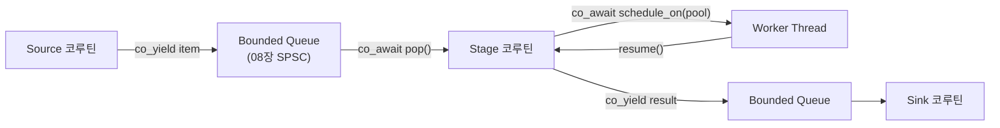

**코루틴 기반 동시성 패턴**이란 C++20 코루틴(`co_await`/`co_yield`/`co_return`)을 여러 실행 흐름을 조합하는 도구로 써서, 태스크를 체이닝하고 스레드 풀에 재개 지점을 명시적으로 옮기며, 여러 단계로 나뉜 비동기 파이프라인을 구성하는 설계 방식을 말합니다. 단일 코루틴 하나의 호출 비용이 아니라, **여러 코루틴이 서로를 호출·재개하며 어느 스레드에서 실행되는지를 통제하는 문제**가 이 장의 주제입니다. 코루틴은 그 자체로는 병렬성을 만들지 않으며, 스케줄러·스레드 풀과 어떻게 연결되는지가 실제 지연시간과 처리량을 결정합니다.

## 이 장을 읽기 전에

**전제 지식**: 이 장은 [Tr.02 10장: 코루틴 성능](/post/cpp-optimization/coroutine-performance/)에서 다룬 코루틴 프레임·suspend/resume 메커니즘과, 이 트랙 [10장: 스레드 풀 최적화와 워크 스틸링](/post/concurrency-optimization/thread-pool-work-stealing-optimization/)에서 다룬 작업 큐·워커 스레드 모델을 전제로 합니다. `co_await`가 코루틴을 중단시키고 `await_suspend`가 재개 시점을 결정한다는 큰 그림만 있으면 따라올 수 있습니다.

**이 장의 깊이**: 이 장은 **심화** 수준입니다. `co_await`로 태스크를 체이닝하는 `Task<T>` 타입의 구조부터 시작해, 전문가 구간에서는 코루틴을 스레드 풀의 특정 워커로 옮기는 스케줄러 연동과, 여러 단계로 이어지는 비동기 파이프라인에서 태스크 수명·역압(backpressure)을 다루는 판단 기준까지 갑니다. **다루지 않는 것**: 단일 코루틴의 프레임 힙 할당·suspend 비용 자체는 [Tr.02 10장](/post/cpp-optimization/coroutine-performance/)에서 이미 다뤘으므로 반복하지 않습니다. 워크 스틸링 큐의 내부 구현은 [10장](/post/concurrency-optimization/thread-pool-work-stealing-optimization/), 링버퍼·SPSC/MPMC 큐의 구현 세부는 [08장](/post/concurrency-optimization/spsc-mpmc-ring-buffer-queues/), 협력적 취소 메커니즘은 [13장: std::jthread와 stop_token](/post/concurrency-optimization/cpp20-jthread-stop-token-cooperative-cancellation/), 일반화된 sender/receiver 실행 모델은 [16장: Executors 기초](/post/concurrency-optimization/cpp-executors-fundamentals/)와 [17장: C++26 std::execution](/post/concurrency-optimization/cpp26-std-execution-senders-receivers/)로 위임합니다.

## 당신의 수준에 맞는 경로

| 수준 | 읽을 부분 | 핵심 목표 |
|------|---------|---------|
| **중급자** | "코루틴 동시성의 역사와 생태계" ~ "태스크 타입" | 코루틴이 왜 스택 증가 없이 체이닝될 수 있는지 이해 |
| **심화** | "태스크 스케줄링" ~ "비동기 파이프라인 구성" | 코루틴을 스레드 풀·큐와 연결하는 구조 파악 |
| **전문가** | "흔한 오개념" ~ "비판적 시각" | 수명 함정을 피하고 콜백 대비 코루틴 채택을 판단 |

---

## 코루틴 동시성의 역사와 생태계

C++20 표준화 과정에서 코루틴 TS의 초기 설계는 한 코루틴이 다른 코루틴을 호출하고 완료 시 되돌아가는 구조를 **상호 재귀 호출**로 구현했습니다. 이 방식은 루프 안에서 동기적으로 즉시 완료되는 태스크를 반복해서 `co_await`하면 호출 스택이 반복 횟수에 비례해 계속 쌓이는 문제가 있었고, 실전에서는 스택 오버플로로 이어질 수 있었습니다. Gor Nishanov가 제안한 P0913(symmetric transfer)이 C++20에 채택되면서, `await_suspend`가 `void`나 `bool` 대신 `std::coroutine_handle<>`를 반환하면 컴파일러가 이를 <strong>테일 콜(tail-call)</strong>로 처리해 추가 스택 프레임 없이 다음 코루틴으로 점프하도록 정의됩니다. Lewis Baker는 이 메커니즘을 두고 "allows you to suspend one coroutine and resume another coroutine without consuming any additional stack-space"라고 설명합니다 — [Lewis Baker, "Understanding symmetric transfer", 2020](https://lewissbaker.github.io/2020/05/11/understanding_symmetric_transfer). 이 장의 `Task<T>` 구현은 이 성질에 의존합니다.

표준 라이브러리는 C++20~C++23에서 `co_await`/`co_yield`/`co_return`과 promise_type·awaitable 인터페이스를 언어 차원에 두었을 뿐([cppreference: Coroutines](https://en.cppreference.com/cpp/language/coroutines)), 스케줄러와 결합해 스레드 풀에서 재개되는 범용 `Task<T>`나 sender/receiver 모델은 표준화하지 않고 라이브러리 영역으로 남겨 두었습니다. Lewis Baker 본인이 만든 **cppcoro**는 실험적 라이브러리로 오래 활발히 유지보수되지 않았고, 그는 이후 작업을 **libunifex**([facebookexperimental/libunifex](https://github.com/facebookexperimental/libunifex))와 **folly::coro**로 옮겼다고 밝혔습니다(cppcoro GitHub 이슈 트래커의 저자 코멘트 기준). libunifex가 도입한 sender/receiver 개념은 C++26에 `std::execution`(P2300)으로 표준화되었으며, 이 장에서 직접 구현하는 `Task`/스케줄러 패턴은 그 표준화된 일반 모델의 축소판이라고 볼 수 있습니다. 두 세계의 관계와 P2300 자체의 세부는 [16~17장](/post/concurrency-optimization/cpp-executors-fundamentals/)에서 다룹니다.

## 태스크 타입: symmetric transfer로 체이닝하기

<strong>태스크(Task)</strong>는 `co_await`할 수 있는 코루틴 반환 타입으로, 완료되면 자신을 기다리던 호출자 코루틴을 재개하는 역할을 합니다. 핵심은 `final_suspend`에서 호출자의 `coroutine_handle`을 직접 반환해 symmetric transfer로 넘기는 것입니다. 이렇게 하면 `task_a()`가 `task_b()`를, `task_b()`가 다시 `task_c()`를 호출하는 체인이 아무리 길어져도 반환 시점마다 스택 프레임이 쌓이지 않고 곧바로 다음 코루틴으로 점프합니다. 아래는 값을 반환하는 최소 `Task<T>`의 골격이며, `promise_type::continuation`이 "누가 이 태스크의 완료를 기다리는가"를 담습니다.

```cpp
#include <coroutine>
#include <exception>
#include <utility>

template <typename T>
class Task {
 public:
  struct promise_type {
    T value{};
    std::exception_ptr error;
    std::coroutine_handle<> continuation;  // 이 태스크를 co_await한 코루틴

    Task get_return_object() {
      return Task{std::coroutine_handle<promise_type>::from_promise(*this)};
    }
    std::suspend_always initial_suspend() noexcept { return {}; }

    struct FinalAwaiter {
      bool await_ready() noexcept { return false; }
      std::coroutine_handle<> await_suspend(std::coroutine_handle<promise_type> h) noexcept {
        auto& p = h.promise();
        return p.continuation ? p.continuation : std::noop_coroutine();  // symmetric transfer
      }
      void await_resume() noexcept {}
    };
    FinalAwaiter final_suspend() noexcept { return {}; }
    void return_value(T v) { value = std::move(v); }
    void unhandled_exception() { error = std::current_exception(); }
  };

  explicit Task(std::coroutine_handle<promise_type> h) : handle_(h) {}
  Task(Task&& o) noexcept : handle_(std::exchange(o.handle_, {})) {}
  ~Task() { if (handle_) handle_.destroy(); }

  bool await_ready() noexcept { return false; }
  std::coroutine_handle<> await_suspend(std::coroutine_handle<> awaiting) noexcept {
    handle_.promise().continuation = awaiting;
    return handle_;  // 테일 콜: 이 시점에서 추가 스택 프레임이 생기지 않음
  }
  T await_resume() {
    if (handle_.promise().error) std::rethrow_exception(handle_.promise().error);
    return std::move(handle_.promise().value);
  }

 private:
  std::coroutine_handle<promise_type> handle_;
};
```

이 구조에서 주의할 점은 두 가지입니다. `continuation`이 설정되기 전에 태스크가 먼저 완료되면(즉 아무도 `co_await`하지 않은 채로 즉시 끝나면) `noop_coroutine()`으로 안전하게 빠지도록 처리해야 하고, `Task`는 이동 전용으로 두어 handle 소유권이 한 곳에만 있도록 강제해야 합니다. GCC로 컴파일할 때는 `-std=c++20`만으로는 부족하고 `g++ -fcoroutines -std=c++20 task.cpp`처럼 `-fcoroutines`를 함께 지정해야 코루틴 지원이 활성화됩니다(GCC 14/15 기준).

## 태스크 스케줄링: 코루틴을 실행 컨텍스트로 옮기기

`Task<T>`만으로는 "누가 어느 스레드에서 재개되는가"가 정해지지 않습니다. 기본적으로 코루틴은 `resume()`을 호출한 스레드에서 그대로 이어서 실행되므로, 아무 처리도 하지 않으면 체인 전체가 최초 호출 스레드에 묶입니다. **태스크 스케줄링**은 특정 `co_await` 지점에서 코루틴의 재개를 의도적으로 다른 실행 컨텍스트(스레드 풀의 워커)로 넘기는 패턴이며, 10장에서 다룬 워크 스틸링 풀의 작업 큐가 바로 그 실행 컨텍스트가 됩니다. 아래 `ScheduleOn`은 `co_await`되는 순간 자기 자신을 재개하는 대신 스레드 풀의 큐에 `coroutine_handle`을 넘기고, 이후 실제 재개는 풀의 워커 스레드가 담당하도록 만드는 최소 어댑터입니다. 스레드 풀 자체의 워크 스틸링 로직은 여기서 다시 구현하지 않고 10장의 `submit` 인터페이스만 가정합니다.

```cpp
#include <coroutine>

// 10장의 워크 스틸링 스레드 풀이 제공한다고 가정하는 최소 인터페이스
struct ThreadPool {
  void submit(std::coroutine_handle<> h);  // 큐에 넣고, 유휴 워커가 h.resume() 호출
};

struct ScheduleOn {
  ThreadPool& pool;
  bool await_ready() noexcept { return false; }
  void await_suspend(std::coroutine_handle<> h) noexcept { pool.submit(h); }
  void await_resume() noexcept {}
};

inline ScheduleOn schedule_on(ThreadPool& pool) { return ScheduleOn{pool}; }
```

`co_await schedule_on(pool);`을 만나는 순간부터 이후 코드는 풀의 워커 스레드에서 실행됩니다. 이 지점이 바로 **호출 스레드와 실행 스레드가 갈라지는 경계**이며, 이 경계를 넘어서 지역 변수·참조를 그대로 들고 가면 다음 절에서 다루는 수명 함정으로 이어집니다. `submit` 자체가 lock-free 큐냐 뮤텍스 큐냐는 워크로드의 제출 빈도에 달려 있고, 그 선택 기준은 [02장](/post/concurrency-optimization/lock-selection-criteria-guide/)을 따릅니다.

## 비동기 파이프라인 구성

**비동기 파이프라인**은 각 단계를 코루틴으로 표현하고, 단계 사이를 유계(bounded) 큐로 연결해 앞 단계의 출력을 뒤 단계가 소비하도록 만든 구조입니다. 각 단계는 자신의 속도로 `co_yield`/`co_await`할 뿐이고, 큐가 가득 차면 생산자 쪽 코루틴이 자연스럽게 suspend되어 <strong>역압(backpressure)</strong>이 생깁니다 — 별도의 유량 제어 로직 없이 큐 용량만으로 상류 속도를 제한할 수 있다는 뜻입니다. 큐 자체의 구현(단일 생산자/단일 소비자 SPSC, 다중 생산자/다중 소비자 MPMC)은 [08장](/post/concurrency-optimization/spsc-mpmc-ring-buffer-queues/)에서 다루므로, 이 장에서는 파이프라인 단계들이 그 큐를 어떻게 조립하는지에 집중합니다. 각 단계가 `schedule_on`으로 서로 다른 풀에 배치될 수 있다는 점이 코루틴 파이프라인의 강점입니다 — IO 대기가 긴 단계는 별도의 작은 풀에, CPU 바운드 단계는 워크 스틸링 풀에 배치하는 식으로 스레드 배치를 단계별로 분리할 수 있습니다.



큐가 가득 찼을 때 생산자가 suspend되고, 소비자가 항목을 꺼내면 그 소비자 스레드가(또는 알림을 받은 별도 워커가) 생산자를 재개시키는 흐름이 이 다이어그램의 핵심입니다. 이 재개가 **어느 스레드에서 일어나는지**가 바로 앞 절의 스케줄링 문제이므로, 파이프라인 설계는 태스크 타입과 스케줄러 어댑터 위에 쌓이는 조합 문제로 볼 수 있습니다.

## 흔한 오개념 세 가지

<strong>"코루틴을 쓰면 자동으로 병렬 처리된다"</strong>는 가장 흔한 오해입니다. 코루틴은 하나의 실행 흐름을 여러 조각으로 나눠 중단·재개할 수 있게 할 뿐이고, 그 조각들이 서로 다른 스레드에서 동시에 실행되려면 앞서 본 `schedule_on` 같은 명시적 스케줄러 연동이 있어야 합니다. 스케줄러 없이 체이닝만 하면 전체가 한 스레드에서 순차적으로 실행되는 것과 다르지 않습니다.

<strong>"symmetric transfer 덕분에 스택 걱정은 끝났다"</strong>도 절반만 맞습니다. `final_suspend`에서 `continuation`으로 테일 콜을 하는 `Task<T>`를 올바르게 구현했을 때만 스택이 늘지 않습니다. 만약 태스크 구현이 `final_suspend`에서 그냥 `std::suspend_always{}`만 반환하고 별도로 `continuation.resume()`을 **일반 함수 호출**로 부른다면, 그 호출은 테일 콜이 아니므로 체인이 길어질수록 여전히 스택이 쌓입니다. symmetric transfer는 언어가 제공하는 메커니즘이지, 그 메커니즘을 실제로 쓰는지는 태스크 타입 구현자의 책임입니다.

<strong>"코루틴 파라미터는 함수처럼 안전하게 참조로 받으면 된다"</strong>는 세 번째 오해이며, 다음 절에서 실제 코드로 다룹니다. 일반 함수라면 인자가 함수 실행 동안만 살아 있으면 되지만, 코루틴은 `co_await`로 suspend된 채 원래 호출식이 끝난 뒤에도 실행을 이어가므로 참조·포인터 인자의 수명 가정이 깨지기 쉽습니다.

## 코루틴 파라미터 수명 함정: 깨진 코드와 올바른 구현

**원인**: 코루틴은 첫 `co_await`에서 suspend되면 호출자에게 제어를 돌려줍니다. 호출자가 임시 객체를 인자로 넘기고 그 결과 `Task`를 받는 시점에서, 그 표현식(full-expression)이 끝나면 임시 객체는 파괴됩니다. 코루틴이 참조로 받은 인자가 바로 그 임시 객체를 가리키고 있었다면, 이후 스레드 풀 워커에서 재개되어 그 참조에 접근하는 순간 이미 해제된 메모리를 읽는 use-after-free가 됩니다. 아래 `process_bad`는 `const std::vector<int>&`로 데이터를 받고 스케줄링 이후에 그 참조를 사용합니다.

```cpp
Task<int> process_bad(ThreadPool& pool, const std::vector<int>& data) {
  co_await schedule_on(pool);          // 재개 지점을 워커 스레드로 이동
  int sum = 0;
  for (int v : data) sum += v;         // data가 호출자의 임시였다면 이미 소멸된 뒤
  co_return sum;
}

void caller_bad(ThreadPool& pool) {
  auto t = process_bad(pool, std::vector<int>{1, 2, 3});  // 임시 vector
  // 이 표현식이 끝나는 즉시 임시 vector가 파괴됨.
  // t가 나중에 co_await되어 워커에서 재개되면 data는 이미 댕글링 참조.
}
```

**올바른 구현**은 코루틴이 suspend 경계를 넘어 계속 접근할 데이터를 참조가 아니라 **값으로 소유**하게 만드는 것입니다. 코루틴 파라미터는 코루틴 프레임 안에 복사되어 저장되므로, 값으로 받으면 프레임이 살아 있는 한 데이터도 함께 살아 있습니다.

```cpp
Task<int> process_good(ThreadPool& pool, std::vector<int> data) {  // 값으로 받아 프레임이 소유
  co_await schedule_on(pool);
  int sum = 0;
  for (int v : data) sum += v;
  co_return sum;
}
```

**검증**: 이런 use-after-free는 AddressSanitizer로 잡을 수 있습니다. `g++ -fcoroutines -std=c++20 -fsanitize=address -g pipeline.cpp -o pipeline && ./pipeline`으로 실행하면 `process_bad` 경로에서 heap-use-after-free 리포트가 스택 트레이스와 함께 나옵니다. 파이프라인의 큐 자체가 여러 스레드에서 동시에 push/pop되는 경로라면, 그 동시성 정확성(예: 생산자의 쓰기가 소비자의 읽기보다 happens-before 관계에 있는지)은 별도로 `-fsanitize=thread`로 검증해야 하며, 이는 큐 구현 자체의 메모리 순서 문제이므로 [08장](/post/concurrency-optimization/spsc-mpmc-ring-buffer-queues/)과 [04장](/post/concurrency-optimization/cpp-memory-model-acquire-release-seqcst/)의 검증 절차를 그대로 적용합니다.

## 오버헤드 측정: 콜백 제출 vs 코루틴 스케줄링

코루틴 기반 스케줄링이 콜백을 스레드 풀 큐에 직접 넣는 방식보다 얼마나 더 비싼지(또는 비슷한지)는 플랫폼·컴파일러·최적화 수준에 따라 달라지므로 단정하지 않고 직접 격리 측정해야 합니다. 아래는 "빈 콜백을 풀에 제출"과 "빈 코루틴을 `schedule_on`으로 제출"을 같은 풀 구현 위에서 비교하는 Google Benchmark 골격이며, 실제 수치는 반드시 대상 환경에서 재현해야 합니다.

```cpp
#include <benchmark/benchmark.h>
#include <coroutine>
#include <functional>

// ThreadPool, ScheduleOn, Task<T>는 위에서 정의한 것을 그대로 사용한다고 가정

static void BM_SubmitCallback(benchmark::State& state) {
  ThreadPool pool;
  for (auto _ : state) {
    // 콜백 큐 제출 경로: std::function 할당 비용 포함 여부를 함께 측정
    std::function<void()> job = [] {};
    benchmark::DoNotOptimize(job);
  }
}
BENCHMARK(BM_SubmitCallback);

static void BM_SubmitCoroutine(benchmark::State& state) {
  ThreadPool pool;
  for (auto _ : state) {
    auto t = schedule_on(pool);  // 코루틴 어댑터 생성 비용만 격리 측정
    benchmark::DoNotOptimize(t);
  }
}
BENCHMARK(BM_SubmitCoroutine);

BENCHMARK_MAIN();
```

`g++ -fcoroutines -std=c++20 -O2 bench.cpp -lbenchmark -lpthread`(x86-64, GCC 14, `-O2` 기준)로 빌드해 실행합니다. 이 골격은 어댑터 생성 비용만 격리한 것이므로, 실제 제출→재개까지의 종단 지연을 재려면 풀 구현을 채워 넣고 p50/p99까지 함께 측정해야 의미가 있습니다. `std::function`을 콜백에 쓰면 타입 소거 비용이 코루틴 경로와의 비교를 왜곡할 수 있으므로, 콜백 경로도 함수 포인터나 소형 콜러블로 맞춰 비교하는 것이 공정합니다.

## 판단 기준

| 상황 | 권장 | 비권장 |
|------|------|--------|
| 여러 단계가 순차·비동기로 이어지는 흐름을 읽기 쉽게 표현 | `Task<T>` 체이닝 + symmetric transfer | 콜백 지옥으로 중첩된 람다 체인 |
| 단계별로 실행 스레드를 분리(IO 대기 vs CPU 바운드) | `schedule_on`으로 명시적 이동 | 암묵적으로 첫 호출 스레드에 고정 |
| 생산자·소비자 속도 차를 자연스럽게 제어 | 유계 큐 + suspend 기반 backpressure | 무제한 큐·수동 유량 제어 |
| µs 단위·고빈도 단일 호출 경로 | 동기 코드 또는 콜백 (Tr.02 10장 판단 기준 참고) | 매 호출마다 코루틴 프레임 생성 |
| 코루틴 인자가 suspend 경계를 넘어 쓰임 | 값으로 소유(복사/이동) | 참조·포인터로 임시 객체 전달 |

## 비판적 시각: 한계와 트레이드오프

코루틴 기반 파이프라인은 콜백 중첩을 줄여 코드를 선형적으로 읽히게 하지만, 그 대가로 **디버깅 난이도**가 올라갑니다. 스택 트레이스가 코루틴 프레임 경계에서 끊기거나 재구성되어 보이므로, 어느 스레드에서 어떤 순서로 재개되었는지를 로그나 트레이서 없이 파악하기 어렵습니다. 생태계도 아직 정착 단계입니다 — cppcoro는 사실상 유지보수가 정체되어 있고, libunifex·folly::coro·stdexec 같은 후속 구현들은 프로덕션에서 검증되고 있지만 API가 라이브러리마다 다르며, 이 장에서 만든 `Task<T>`/`ScheduleOn` 같은 손수 구현은 프로덕션에 그대로 쓰기보다 개념을 보여주는 축소판으로 보는 것이 안전합니다. 마지막으로, symmetric transfer가 스택 오버플로 문제를 해결했다고 해서 코루틴이 "공짜"가 된 것은 아닙니다 — 프레임 힙 할당과 suspend/resume 비용은 여전히 존재하며([Tr.02 10장](/post/cpp-optimization/coroutine-performance/) 참고), 이 장에서 다룬 스케줄링·파이프라인 패턴은 그 비용을 감수할 가치가 있는 워크로드(비동기 IO, 여러 단계 파이프라인)에 한해 유효한 선택입니다.

## 마무리

- symmetric transfer가 무엇을 해결하는지(스택 프레임 누적 방지)와 `final_suspend`가 continuation으로 테일 콜해야 하는 이유를 설명할 수 있다.
- `Task<T>`가 `co_await`될 때와 완료될 때 각각 어떤 `coroutine_handle`이 오가는지 코드로 추적할 수 있다.
- `schedule_on` 같은 어댑터로 코루틴 재개를 특정 스레드 풀로 옮기는 패턴을 구현하고, 그 경계에서 참조 수명을 값 소유로 바꿔 안전하게 만들 수 있다.
- 비동기 파이프라인에서 유계 큐가 어떻게 backpressure를 자연스럽게 만드는지 설명할 수 있다.
- 코루틴 파라미터의 수명 함정을 AddressSanitizer로 재현·검증할 수 있다.
- 콜백 기반 스케줄링과 코루틴 기반 스케줄링 중 언제 무엇을 택할지 판단 기준으로 고를 수 있다.

**이전 장**: [스레드 풀 최적화와 워크 스틸링](/post/concurrency-optimization/thread-pool-work-stealing-optimization/) (10장)

**다음 장에서는** 잠금 없이도 진행이 보장되는 **wait-free 프로그래밍의 기초**를 다룹니다. lock-free가 "누군가는 언젠가 진행한다"는 보장에 그치는 것과 달리, wait-free는 모든 스레드가 유한 스텝 안에 완료됨을 보장해야 하며, 이 장에서 본 태스크 스케줄링이 어느 스레드에서 실행되는지를 통제하는 문제였다면 다음 장은 그 실행 자체가 다른 스레드에 의해 무한정 지연되지 않는다는 것을 증명하는 문제로 이어집니다.

→ Wait-free 프로그래밍 기초 (12장, 작성 예정)
