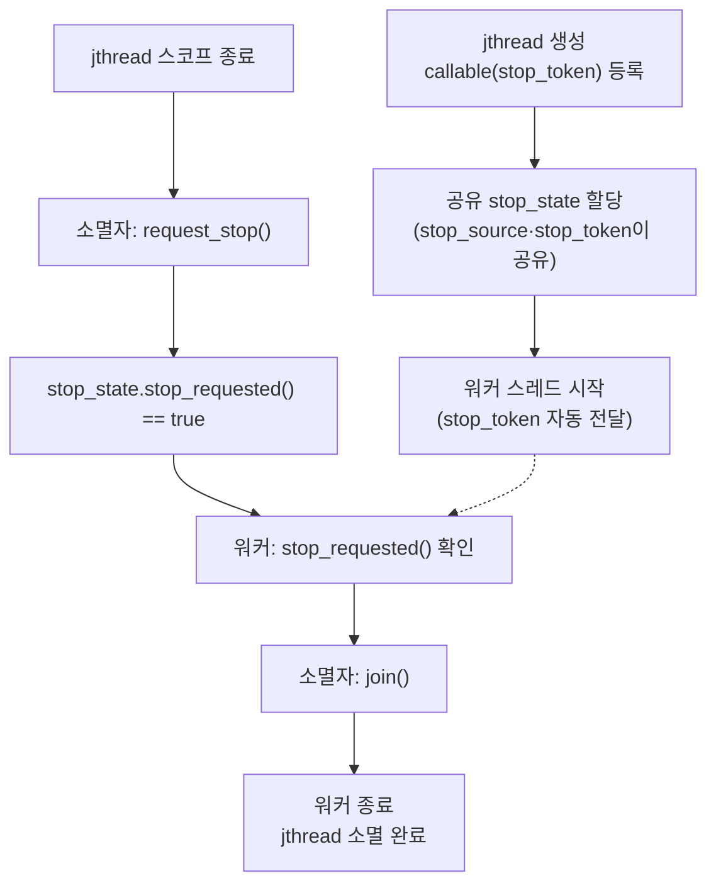

**std::jthread와 stop_token**은 C++20이 표준화한 협력적 스레드 취소(cooperative cancellation) 메커니즘으로, 스레드에 "중단 요청"을 안전하게 전달하고 소멸자에서 자동으로 정리하는 방법을 정의합니다. `std::thread`는 join되지 않은 채로 소멸되면 `std::terminate`를 호출해 프로그램을 즉시 죽이는데, 실무에서는 예외 경로나 조기 반환 때문에 이 join 누락이 반복적으로 발생하는 버그의 원인이었습니다. 이 장에서는 `stop_source`·`stop_token`·`stop_callback`이 내부에서 어떻게 상태를 공유하는지, `jthread` 소멸자가 왜 `terminate` 대신 `request_stop()`과 `join()`을 자동 호출하는지, 그리고 이 자동화가 만드는 새로운 함정(크래시 대신 행)을 다룹니다.

## 이 장을 읽기 전에

**전제 지식**: `std::thread`의 기본 사용법(생성·`join`·`detach`)과 [01장: 동기화 비용 분석](/post/concurrency-optimization/synchronization-primitive-cost-analysis/)에서 다룬 "동기화에는 비용이 있다"는 감각을 전제로 합니다. `std::atomic`을 한 번이라도 써봤다면 충분하고, [12장: Wait-free 프로그래밍 기초](/post/concurrency-optimization/wait-free-programming-fundamentals/)의 내용을 몰라도 이 장을 읽는 데는 지장이 없습니다.

**이 장의 깊이**: **중급**입니다. `jthread`/`stop_token`의 내부 동작 원리와 `std::thread` 대비 안전성 이점, 실무에서 자주 틀리는 지점을 다룹니다. **다루지 않는 것**: C++26 `std::execution`(senders/receivers)이 `stop_token`을 어떻게 조합하는지는 [17장](/post/concurrency-optimization/cpp26-std-execution-senders-receivers/)에서, 코루틴 기반 취소 패턴은 [11장: 코루틴 기반 동시성 패턴](/post/concurrency-optimization/coroutine-based-concurrency-patterns/)에서, `condition_variable`/`barrier`/`latch` 자체의 사용법은 [19장](/post/concurrency-optimization/condition-variable-performance-patterns/)·[20장](/post/concurrency-optimization/cpp20-barrier-latch-synchronization-patterns/)에서 다루므로 이 장은 `stop_token`과의 접점만 짧게 언급합니다.

## 당신의 수준에 맞는 경로

| 수준 | 읽을 부분 | 핵심 목표 |
|------|---------|---------|
| **초보자** | "협력적 취소의 등장 배경" ~ "stop_source·stop_token·stop_callback의 내부 동작" | `jthread`가 `thread`와 다른 점과 세 타입의 역할을 이해 |
| **중급자** | "jthread 소멸자" ~ "흔한 오개념 세 가지" | 소멸자 자동 동작과 콜백 실행 스레드를 정확히 알고 데이터 레이스를 피함 |
| **전문가** | "판단 기준" ~ "비판적 시각" | 도입 여부와 `thread`→`jthread` 마이그레이션 위험을 판단 |

## 협력적 취소의 등장 배경

C++11의 `std::thread`는 취소(cancellation) 개념이 아예 없습니다. 실행 중인 스레드를 강제로 멈출 방법이 없고, `joinable()`인 채로 소멸되면 `std::terminate`가 호출되어 프로그램이 즉시 종료됩니다. 이 문제를 해결하기 위한 제안이 [P0660: Stop Token and Joining Thread](https://www.open-std.org/jtc1/sc22/wg21/docs/papers/2019/p0660r10.pdf)이며, Nicolai Josuttis, Lewis Baker, Billy O'Neal, Herb Sutter, Anthony Williams가 공동 저술해 2019년 R10 개정을 거쳐 C++20에 채택되었습니다. Josuttis가 먼저 만든 `jthread` 참조 구현(GitHub `josuttis/jthread`)이 표준화 논의의 출발점이었고, 초기 콜백 설계는 별도 제안(P1287)이었다가 이후 P0660에 병합되었습니다. 제안의 핵심 동기는 "조인 가능한 스레드가 안전하게 소멸되게 하려면, 그 전에 스레드가 스스로 멈출 기회를 줘야 한다"는 것이었고, 그 결과가 지금의 `stop_source`/`stop_token`/`stop_callback` 3분할 설계입니다.

컴파일러 지원은 표준화 시점보다 상당히 늦게 갖춰졌습니다. libstdc++는 2020년(GCC 10)부터 지원했고 MSVC STL도 비슷한 시기에 초안을 반영했지만, libc++는 오랫동안 `jthread`를 구현하지 않았습니다. [libc++의 공식 C++20 구현 현황 문서](https://libcxx.llvm.org/Status/Cxx20.html)에 따르면 libc++는 LLVM 18부터 `-fexperimental-library` 플래그 뒤에 실험적으로 구현되었고, **LLVM 20**에 이르러서야 실험 플래그 없이 기본으로 사용할 수 있게 되었습니다. 즉 2026년 현재에도 오래된 libc++ 배포본을 타깃으로 한다면 `jthread`를 못 쓸 수 있으므로, 크로스 플랫폼 코드베이스에서는 컴파일러·표준 라이브러리 버전을 먼저 확인해야 합니다.

## stop_source·stop_token·stop_callback의 내부 동작

`jthread`를 생성하면 내부적으로 **공유·참조 카운트되는 stop_state**가 하나 할당됩니다. [cppreference의 stop_token 문서](https://en.cppreference.com/w/cpp/thread/stop_token)가 정의하듯, `stop_source`는 이 상태에 `request_stop()`으로 "멈춰라"라는 신호를 쓸 수 있는 쓰기 핸들이고, `stop_token`은 `stop_requested()`로 그 신호를 읽기만 하는 핸들입니다. 두 타입 모두 값 타입으로 복사·전달이 자유로운 것은, 실제 데이터가 힙에 있는 공유 상태에 대한 참조일 뿐이기 때문입니다 — `shared_ptr`의 제어 블록과 비슷한 모델입니다. [jthread의 멤버 함수 목록](https://en.cppreference.com/w/cpp/thread/jthread)이 보여주듯 `jthread`는 생성 시 이 `stop_source`를 하나 만들어 보관하고, 콜러블의 첫 인자 타입이 `stop_token`(또는 그로 변환 가능한 타입)이면 `get_stop_token()`으로 얻은 토큰을 자동으로 첫 인자로 넘겨 줍니다. 그래서 아래처럼 콜러블 시그니처만 맞추면 별도로 토큰을 손으로 캡처해 전달할 필요가 없습니다.

아래 흐름도는 `jthread`가 생성부터 소멸까지 `stop_state`를 어떻게 거쳐 가는지를 정리한 것입니다. 소멸자가 스코프를 벗어나며 `request_stop()`을 호출하면, 워커가 다음 `stop_requested()` 확인 시점에 이를 감지하고 루프를 빠져나와야 `join()`이 끝난다는 점이 이 그림의 핵심입니다.



이 자동 전달 규칙을 코드로 보면 다음과 같습니다. 워커 함수의 첫 인자를 `std::stop_token`으로 선언해 두기만 하면, `jthread` 생성자가 별도 인자 없이도 내부 토큰을 그 자리에 채워 넣습니다.

```cpp
#include <thread>
#include <stop_token>
#include <chrono>

void worker(std::stop_token stoken) {
  // jthread가 stop_token을 자동으로 첫 인자에 전달
  while (!stoken.stop_requested()) {
    std::this_thread::sleep_for(std::chrono::milliseconds(10));
  }
}

int main() {
  std::jthread t(worker);   // worker(stoken) 형태로 자동 호출
}
```

`stop_callback`은 세 번째 축입니다. 특정 `stop_token`에 콜백 함수를 등록해 두면, 그 토큰의 `stop_source`에서 `request_stop()`이 처음 성공적으로 호출되는 시점에 등록된 모든 콜백이 실행됩니다. 콜백은 대개 스레드 풀 작업처럼 폴링이 어려운 대상(예: 블로킹 I/O 핸들, 조건 변수)을 깨우는 용도로 씁니다. 중요한 점은 콜백이 항상 새 스레드에서 비동기로 실행되는 게 아니라는 것입니다 — `request_stop()`을 실제로 호출한 스레드에서 **동기적으로** 실행되며, 이미 정지가 요청된 뒤에 `stop_callback`을 등록하면 그 등록을 수행하는 스레드에서 즉시 실행됩니다. 콜백이 예외를 던지면 `std::terminate`가 호출되므로, 콜백 안에서는 예외를 던지지 않도록 설계해야 합니다.

### jthread 소멸자: 자동 request_stop과 join

`std::jthread`의 소멸자는 "조인 가능하면 `request_stop()`을 호출한 뒤 `join()`한다"로 정의됩니다. `std::thread`의 소멸자가 조인 가능한 채로 호출되면 `std::terminate`로 프로그램을 끝내는 것과 대조적입니다. 이 차이가 `jthread`가 주는 가장 실질적인 안전성 이점입니다 — 예외가 스코프를 빠져나가거나 조기 `return`이 실행되어도, `jthread` 멤버·지역 변수는 스코프를 벗어나며 스스로 정지 요청과 조인을 처리합니다. 다만 이 소멸자는 "요청"만 보낼 뿐 강제로 멈추지 않으므로, 워커 함수가 `stop_token`을 실제로 확인하지 않으면 `join()`은 워커가 끝날 때까지 계속 블록됩니다.

### 데이터 레이스에서 협력적 취소로

`jthread` 이전에는 흔히 평범한 `bool` 플래그로 취소 신호를 흉내 냈습니다. 아래 코드는 그 전형적인 실수를 보여줍니다.

```cpp
// 깨진 코드: 동기화 없는 bool 플래그로 취소를 흉내 냄
#include <thread>
#include <chrono>

bool g_stop = false;   // atomic이 아님: 스레드 간 가시성·재정렬 보장이 없음

void worker() {
  while (!g_stop) {                        // 다른 스레드가 쓰는 값을 동기화 없이 읽음
    std::this_thread::sleep_for(std::chrono::milliseconds(5));
  }
}

int main() {
  std::thread t(worker);
  std::this_thread::sleep_for(std::chrono::milliseconds(50));
  g_stop = true;                            // 다른 스레드에서 동기화 없이 씀: 데이터 레이스
  t.join();
}
```

**원인**: `g_stop`은 원자적이지 않고 어떤 메모리 순서 보장도 없습니다. 컴파일러가 루프 안에서 `g_stop`을 레지스터에 캐시해 갱신을 영원히 못 볼 수도 있고(실무에서는 최적화 수준에 따라 무한 루프로 관측됨), 표준 관점에서는 애초에 이것이 **데이터 레이스**이므로 프로그램 동작 자체가 미정의입니다. 아래처럼 `jthread`와 `stop_token`으로 바꾸면 취소 신호 전달이 내부적으로 동기화된 원자 연산으로 처리됩니다.

```cpp
// 올바른 구현: jthread + stop_token
#include <thread>
#include <stop_token>
#include <chrono>

void worker(std::stop_token stoken) {
  while (!stoken.stop_requested()) {        // stop_state 내부는 원자적으로 동기화됨
    std::this_thread::sleep_for(std::chrono::milliseconds(5));
  }
}

int main() {
  std::jthread t(worker);
  std::this_thread::sleep_for(std::chrono::milliseconds(50));
}   // t의 소멸자가 request_stop() 후 join()을 자동 호출
```

두 버전의 차이는 ThreadSanitizer로 직접 확인할 수 있습니다.

```bash
# 깨진 버전(레이스 버전)을 컴파일해 실행
g++ -std=c++20 -fsanitize=thread -g -O1 broken.cpp -o broken -lpthread
./broken
# WARNING: ThreadSanitizer: data race ... 가 출력되어야 정상

# 수정 버전(jthread 버전)을 동일하게 실행
g++ -std=c++20 -fsanitize=thread -g -O1 fixed.cpp -o fixed -lpthread
./fixed
# 경고 없이 종료되어야 정상
```

`bool` 대신 `std::atomic<bool>`을 쓰는 것으로도 이 특정 레이스는 없앨 수 있지만, `stop_callback`으로 블로킹 대기를 깨우는 기능이나 소멸자의 자동 정리는 직접 다 구현해야 합니다. `jthread`/`stop_token`은 이 패턴 전체를 표준 라이브러리 수준에서 검증된 형태로 제공하는 것에 가치가 있습니다.

## 흔한 오개념 세 가지

<strong>"jthread로 이름만 바꾸면 무조건 더 안전해진다"</strong>는 절반만 맞습니다. `std::thread`를 `std::jthread`로 바꾸기만 하고 워커 함수가 `stop_token`을 전혀 확인하지 않으면, 이전에는 조인 누락 시 `std::terminate`로 즉시 크래시하던 것이 이제는 소멸자의 `join()`에서 **영원히 블록**하는 것으로 바뀝니다. 테스트 환경에서는 크래시가 오히려 눈에 잘 띄어 빨리 고쳐졌을 버그가, `jthread`로 바꾼 뒤에는 "가끔 종료가 안 되는" 조용한 행(hang)으로 나타날 수 있습니다. 마이그레이션 시에는 반드시 워커 함수에 `stop_token` 확인 로직을 실제로 추가해야 합니다.

<strong>"stop_callback은 항상 다른 스레드에서 비동기로 실행된다"</strong>도 틀렸습니다. 앞서 설명했듯 콜백은 `request_stop()`을 호출한 바로 그 스레드에서 동기적으로 실행되며, 이미 정지 요청이 된 뒤 콜백을 등록하면 등록하는 스레드에서 즉시 실행됩니다. `request_stop()`을 호출하는 코드가 락을 쥔 상태라면, 그 락을 콜백 내부에서 다시 잡으려다 데드락이 날 수 있으므로 콜백 안에서는 어떤 락을 다시 요구하는지 항상 점검해야 합니다.

<strong>"stop_token은 워커 스레드 내부에서만 쓸 수 있다"</strong>도 사실이 아닙니다. `stop_token`은 값이므로 자유롭게 복사해 다른 스레드나 컴포넌트에 넘길 수 있고, 여러 곳에서 동시에 `stop_requested()`를 확인하거나 `stop_callback`을 등록해도 안전합니다. 다만 표준 오버로드는 `std::condition_variable_any::wait`에만 `stop_token`을 받는 버전이 추가되었고, 평범한 `std::condition_variable`에는 이 오버로드가 없습니다. 조건 변수로 블로킹 대기하며 취소 가능하게 만들고 싶다면 `condition_variable_any` 쪽을 선택해야 합니다([19장](/post/concurrency-optimization/condition-variable-performance-patterns/)에서 조건 변수 자체의 비용을 더 다룹니다).

## 판단 기준

`jthread`의 stop_state는 힙에 할당되는 참조 카운트 제어 블록이므로, 생성·소멸 비용은 `thread`보다 약간 더 들 수 있습니다(구현마다 다름). 아래는 스레드 생성·조인 자체의 비용과 이 오버헤드를 분리해서 보는 벤치마크 스켈레톤입니다.

```cpp
#include <benchmark/benchmark.h>
#include <thread>
#include <stop_token>

static void BM_ThreadCreateJoin(benchmark::State& state) {
  for (auto _ : state) {
    std::thread t([] {});
    t.join();
  }
}
BENCHMARK(BM_ThreadCreateJoin);

static void BM_JthreadCreateJoin(benchmark::State& state) {
  for (auto _ : state) {
    std::jthread t([](std::stop_token) {});
  }   // 스코프를 벗어나며 소멸자가 request_stop()+join() 수행
}
BENCHMARK(BM_JthreadCreateJoin);

BENCHMARK_MAIN();
```

`g++ -std=c++20 -O2 bench.cpp -lbenchmark -lpthread -o bench`(x86-64, GCC 기준 예시)로 빌드해 실행하면, `stop_state` 할당·참조 카운트 관리 때문에 `BM_JthreadCreateJoin`이 `BM_ThreadCreateJoin`보다 약간 느리게 나오는 경우가 흔하지만, 두 값 모두 스레드 생성 자체의 시스템 콜 비용(보통 수십 µs 단위) 앞에서는 상대적으로 작은 차이인 경우가 많습니다. 이 차이의 절대값과 비율은 플랫폼·표준 라이브러리 구현·컴파일러 플래그에 따라 달라지므로, 자신의 환경에서 직접 재현해 확인하는 것이 좋습니다.

| 상황 | 권장 | 비권장 |
|------|------|--------|
| 서비스 종료·재시작 시 그레이스풀 셧다운 | `jthread` + `stop_token` 폴링 | 별도 `atomic<bool>` 수동 구현 |
| 블로킹 대기 중 취소가 필요할 때 | `condition_variable_any::wait(lock, stoken, pred)` | 평범한 `condition_variable`에 취소 로직 억지로 결합 |
| 이미 존재하는 `thread` 코드 마이그레이션 | 워커 함수에 `stop_token` 확인을 실제로 추가한 뒤 전환 | 타입만 `jthread`로 바꾸고 확인 로직은 그대로 둠 |
| 초당 수천 번 이상 스레드를 생성·폐기하는 핫패스 | [10장](/post/concurrency-optimization/thread-pool-work-stealing-optimization/)의 스레드 풀 + 공유 `stop_source` 1개 | 작업마다 `jthread`를 새로 생성 |
| `stop_callback`으로 외부 리소스(소켓 등) 깨우기 | 콜백 내부에서 락 재진입 여부를 점검 | 콜백 안에서 `request_stop()` 호출자와 같은 락을 재요청 |

## 비판적 시각: 한계와 트레이드오프

`jthread`/`stop_token`이 주는 안전성은 <strong>협력적(cooperative)</strong>이라는 전제 위에서만 성립합니다. 워커 함수가 블로킹 시스템 콜(예: 소켓 `read`, 파일 I/O) 안에 들어가 있으면 `stop_token`을 아무리 자주 확인해도 그 호출에서 즉시 빠져나올 방법이 없고, 별도로 소켓을 닫거나 타임아웃을 두는 등의 인터럽션 지점을 직접 설계해야 합니다. 표준이 제공하는 인터럽션 지점은 `condition_variable_any`뿐이며, 뮤텍스 잠금 대기나 일반 블로킹 I/O에는 통합되어 있지 않습니다.

libc++의 늦은 지원은 실무 도입에 실질적 제약이었습니다. 2023년 무렵까지도 libc++는 `jthread`를 구현하지 않았고, LLVM 18–19에서는 `-fexperimental-library` 플래그가 필요했으며, 완전한 기본 지원은 LLVM 20에서야 확보되었습니다. 오래된 Clang+libc++ 조합을 지원해야 하는 코드베이스라면 여전히 `std::thread` + 수동 `atomic<bool>` 조합이나 자체 구현으로 되돌아가야 할 수 있습니다.

앞서 다룬 마이그레이션 위험도 트레이드오프의 핵심입니다. `std::thread`의 "조인 안 하면 즉시 죽는다"는 무자비하지만 **디버깅하기 쉬운** 실패 모드였습니다. `jthread`는 이 실패 모드를 "조용히 영원히 기다린다"로 바꿉니다. 어느 쪽이 더 나은지는 상황에 따라 다르며, 최소한 `jthread` 도입 시에는 워커 함수가 실제로 취소 가능하게 작성되었는지를 코드 리뷰에서 반드시 확인해야 합니다.

## 마무리

- [ ] `stop_source`가 쓰기, `stop_token`이 읽기 핸들이며 둘 다 힙에 있는 공유 상태를 참조한다는 것을 설명할 수 있다.
- [ ] `jthread` 소멸자가 `std::thread`와 달리 `terminate` 대신 `request_stop()`+`join()`을 자동 호출한다는 것을 안다.
- [ ] `stop_callback`이 `request_stop()`을 호출한 스레드에서 동기적으로 실행된다는 것과, 그로 인한 락 재진입 위험을 안다.
- [ ] `thread`→`jthread` 마이그레이션이 "크래시를 조용한 행으로 바꿀 수 있다"는 위험을 이해하고 워커 함수에 실제 취소 확인을 추가할 수 있다.
- [ ] 초당 다수의 스레드를 생성·폐기하는 핫패스에서는 `jthread`를 남발하지 않고 스레드 풀을 선택할 수 있다.

**이전 장**: [Wait-free 프로그래밍 기초](/post/concurrency-optimization/wait-free-programming-fundamentals/) (챕터 12) · 배경 지식으로 [코루틴 기반 동시성 패턴](/post/concurrency-optimization/coroutine-based-concurrency-patterns/) (챕터 11)도 참고할 수 있습니다.

**다음 장에서는** 읽기가 잦고 쓰기가 드문 상황을 위한 **Seqlock 패턴**을 다룹니다. 락 없이 버전 카운터만으로 리더·라이터를 조율하는 방식과, 이 장에서 다룬 협력적 취소와는 다른 종류의 락-프리 근사 기법이 어떻게 안전성을 확보하는지 정리합니다.

→ [Seqlock 패턴](/post/concurrency-optimization/seqlock-reader-writer-pattern/) (챕터 14)
