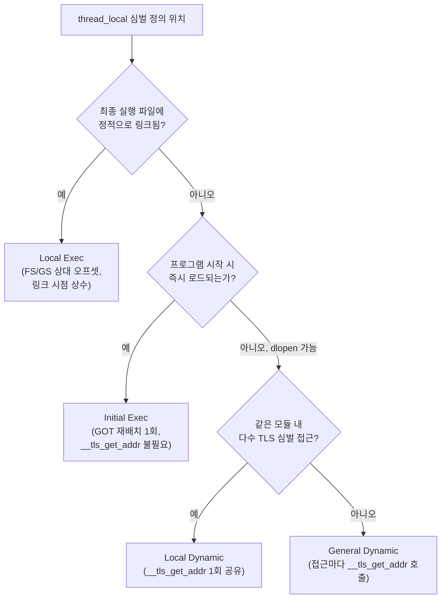

<strong>Thread-local Storage(TLS)</strong>란 같은 변수 이름과 타입을 스레드마다 독립된 메모리 복사본으로 갖게 해 주는 저장소 클래스를 말한다. C++11부터 `thread_local` 키워드로 언어 차원에서 지원되며, 전역 변수를 락 없이 스레드별로 "복제"해 경합을 원천적으로 없애는 손쉬운 방법처럼 보인다. 하지만 이 손쉬움은 공짜가 아니다. 어떤 `thread_local` 접근은 일반 전역 변수와 사실상 같은 비용이지만, 어떤 접근은 함수 호출 하나를 거쳐야 하고, 스레드 수가 늘어나면 그 변수의 메모리도 스레드 수만큼 곱해져 쌓인다. 이 장은 이 비용 차이가 어디서 오는지(정적 TLS 모델과 동적 TLS 모델), 그 비용을 감안하고도 TLS가 유리한 실전 패턴이 무엇인지(스레드별 캐시, 스레드별 카운터), 그리고 "스레드마다 독립"이라는 성질이 스레드 풀·동적 로딩 환경에서 어떻게 뒤통수를 치는지를 다룬다.

## 이 장을 읽기 전에

이 장은 [동기화 비용 정량 분석](/post/concurrency-optimization/synchronization-primitive-cost-analysis/)(챕터 01)에서 다룬 "경합이 없으면 원자 연산도 저렴하다"는 감각과, [False Sharing 탐지와 회피](/post/concurrency-optimization/false-sharing-detection-avoidance/)(챕터 03)에서 다룬 캐시 라인 단위 데이터 배치 개념을 전제로 한다. `std::atomic`의 `fetch_add`를 써 봤고, 캐시 라인 하나를 여러 스레드가 나눠 쓰면 성능이 떨어진다는 것을 알고 있으면 충분하다. **이 장의 깊이**는 **중급**이다. `thread_local`의 언어 차원 의미론, ELF/PE 바이너리가 실제로 TLS 변수를 어떻게 배치하고 찾아가는지, 그리고 그 비용 차이가 실전 코드 패턴 선택에 어떤 영향을 주는지를 다룬다. **다루지 않는 것**은 다음과 같다. 스레드 풀 워커의 생명주기·워크 스틸링 큐 설계 자체는 [스레드 풀 최적화와 워크 스틸링](/post/concurrency-optimization/thread-pool-work-stealing-optimization/)(챕터 10)에서, 진짜 스레드 간 공유 데이터를 락 없이 다루는 방법(hazard pointer·RCU)은 [Hazard Pointers·RCU](/post/concurrency-optimization/hazard-pointer-rcu-cpp26/)(챕터 07)에서, `std::jthread`의 협력적 취소는 [std::jthread와 stop_token](/post/concurrency-optimization/cpp20-jthread-stop-token-cooperative-cancellation/)(챕터 13)에서 각각 다룬다. 이 장은 그 경계 안에서 "TLS 그 자체의 비용과 활용 패턴"에만 집중한다.

## 당신의 수준에 맞는 경로

| 수준 | 읽을 부분 | 핵심 목표 |
|------|---------|---------|
| **초보자** | "배경" ~ "TLS 접근 비용: 정적 모델과 동적 모델" | `thread_local`이 무엇이고, 접근 비용이 상황마다 왜 달라지는지 이해 |
| **중급자** | "지연 초기화와 가드 변수 비용" ~ "흔한 오개념 교정" | 스레드별 캐시·카운터 패턴을 구현하고, 스레드 풀에서의 함정을 피함 |
| **전문가** | "판단 기준" ~ "비판적 시각" | TLS 채택 여부를 비용·위험 기준으로 판단하고 static TLS 고갈 같은 운영 리스크를 평가 |

## 배경: pthread_key부터 언어 키워드까지

스레드마다 독립된 저장소라는 개념은 `thread_local` 키워드보다 훨씬 오래됐다. POSIX.1c(1995)는 `pthread_key_create`/`pthread_getspecific`/`pthread_setspecific`으로 "키 하나에 스레드마다 다른 포인터 값을 연결"하는 간접 방식을 표준화했고, 스레드가 종료할 때 등록된 소멸자 콜백을 호출하는 방식으로 정리를 처리했다. Win32는 비슷한 시기에 `TlsAlloc`/`TlsGetValue`/`TlsSetValue`라는 이름으로 같은 개념을 제공했다. 두 API 모두 "인덱스(또는 키)로 슬롯을 찾고, 그 슬롯에 포인터를 직접 넣고 뺀다"는 저수준 방식이라, 사용할 때마다 할당·해제 코드를 손으로 짜야 했다.

GNU 툴체인은 이 번거로움을 없애기 위해 컴파일러 확장 `__thread`를 C에 먼저 도입했고, 이 확장이 실제로 동작하려면 컴파일러·링커·동적 로더·표준 라이브러리가 TLS 변수를 어디에 어떻게 배치할지에 대한 공통 규약이 필요했다. Red Hat의 Ulrich Drepper는 이 규약을 "ELF Handling For Thread-Local Storage"라는 문서로 공식화했고, 이 문서가 정의한 **네 가지 TLS 접근 모델**(General Dynamic, Local Dynamic, Initial Exec, Local Exec)은 지금도 x86-64 Linux/BSD 계열 툴체인이 TLS 변수의 접근 코드를 생성하는 기준으로 쓰인다. C++11은 이 컴파일러 확장들을 표준화하면서 `thread_local` 키워드를 도입했는데, `__thread`가 POD(trivial) 타입만 허용했던 것과 달리 `thread_local`은 생성자·소멸자가 있는 임의 타입을 허용한다. 이 확장이 바로 다음 절에서 다룰 "지연 초기화 가드"라는 추가 비용의 근원이다.

## TLS 접근 비용: 정적 모델과 동적 모델

`thread_local` 변수 하나에 접근하는 기계어 코드는 그 변수가 "어디서 정의되고 어떻게 로드되는가"에 따라 전혀 다르게 생성된다. 컴파일러와 링커는 심벌이 실행 파일에 있는지, 즉시 로드되는 공유 라이브러리에 있는지, 나중에 `dlopen`으로 로드될 수도 있는 라이브러리에 있는지를 근거로 네 가지 모델 중 하나를 고른다. <strong>Local Exec(LE)</strong>는 심벌이 최종 실행 파일에 있고 다른 모듈이 가로챌(preempt) 수 없을 때 쓰이는 가장 저렴한 모델로, 스레드 포인터(x86-64에서는 `%fs` 세그먼트 레지스터가 가리키는 TCB)로부터의 오프셋이 링크 시점에 상수로 확정되어, 접근 코드가 세그먼트 레지스터 상대 로드 한 줄로 끝난다. <strong>Initial Exec(IE)</strong>는 프로그램 시작 시점에 즉시 로드되는 공유 라이브러리의 TLS 심벌에 쓰이는데, 오프셋이 링크 시점 상수는 아니지만 프로그램 시작 시점에는 고정되므로 GOT를 통한 재배치 하나만 거치면 되고 `__tls_get_addr` 호출은 필요 없다. 반면 <strong>General Dynamic(GD)</strong>은 모듈 ID도 오프셋도 링크 시점에 알 수 없다고 가정하는 가장 범용적인 모델로, 접근할 때마다 `__tls_get_addr(module_id, offset)` 함수를 호출해 실제 주소를 계산해야 하며, 이 모델이 `dlopen`으로 나중에 로드되는 라이브러리의 TLS 변수를 안전하게 지원하는 유일한 방법이다. <strong>Local Dynamic(LD)</strong>은 같은 모듈 안에서 가로챌 수 없는 여러 TLS 심벌에 접근할 때 `__tls_get_addr` 호출 하나로 모듈의 TLS 블록 기준 주소만 구하고, 그 이후 개별 변수는 그 기준 주소에서 상수 오프셋만 더하는 절충안이다.



비용 차이는 결코 사소하지 않다. 일반 전역 변수 접근이 x86-64에서 1~2 사이클이라면, Local Exec TLS 접근은 세그먼트 레지스터 상대 로드 한 번이 추가되어 3~4 사이클 정도이고, 공유 라이브러리에서 General Dynamic 모델로 `__tls_get_addr`를 호출해야 하는 경우는 함수 호출 오버헤드까지 겹쳐 20~50 사이클 수준으로 뛴다(플랫폼·컴파일러·최적화 수준에 따라 다르며, 직접 재현해 확인해야 하는 근사치다). [MaskRay의 TLS 해설](https://maskray.me/blog/2021-02-14-all-about-thread-local-storage)이 정리한 것처럼, 컴파일러는 `-ftls-model` 플래그나 심벌 가시성(visibility)·링키지 규칙에 따라 이 네 모델 중 하나를 자동으로 고르며, `__attribute__((tls_model("initial-exec")))`처럼 변수 단위로 강제할 수도 있다. 실측 측면에서 [David Grosman의 TLS 벤치마크](http://david-grs.github.io/tls_performance_overhead_cost_linux/)는 정적으로 링크된 실행 파일에서는 `thread_local` 접근과 일반 static 변수 접근 사이에 "차이가 거의 없었다"고 보고했지만, 같은 코드를 공유 라이브러리로 빌드했을 때는 TLS 접근이 static 접근보다 대략 두 배 느려졌다고 보고했다 — 원인은 정확히 위에서 설명한 General Dynamic 모델로의 전환이다.

Windows는 다른 메커니즘을 쓰지만 구조는 비슷하다. 각 스레드의 TEB(Thread Environment Block)는 `ThreadLocalStoragePointer` 필드를 가지고 있고, 이 포인터가 가리키는 배열을 모듈별 `_tls_index`로 인덱싱해 해당 모듈의 TLS 블록을 찾는다. 실행 파일에 정적으로 링크된 `thread_local`/`__declspec(thread)` 변수는 이 인덱스가 로드 시점에 고정되어 저렴하지만, [Microsoft의 공식 문서](https://learn.microsoft.com/en-us/windows/win32/dlls/using-thread-local-storage-in-a-dynamic-link-library)가 명시하듯 `LoadLibrary`로 나중에 로드되는 DLL에서 `__declspec(thread)` 변수를 참조하면 프로세스 초기화 이전에 존재하던 스레드에는 그 변수를 위한 공간이 확장되지 않아 접근 시 보호 오류(protection fault)로 이어질 수 있다. 이런 DLL은 언어 키워드 대신 `TlsAlloc`/`TlsGetValue`/`TlsSetValue` API를 직접 써야 하며, 이는 Linux의 General Dynamic 모델이 `dlopen` 안전성을 위해 치르는 것과 본질적으로 같은 종류의 대가다.

## 지연 초기화와 가드 변수 비용

`thread_local`이 `__thread`보다 강력한 이유는 생성자가 있는 타입(`thread_local std::string`, `thread_local std::vector<int>` 등)을 허용하기 때문인데, 이 유연성에는 비용이 따른다. 각 스레드는 그 변수에 처음 접근하는 시점에 생성자를 호출해야 하므로, 컴파일러는 함수 지역 정적 변수의 지연 초기화와 똑같은 원리로 "가드 변수"를 하나 더 만든다. 이 변수가 이미 초기화됐는지를 매 접근마다 확인하고, 아직이라면 생성자를 실행한 뒤 Itanium C++ ABI가 정의하는 `__cxa_thread_atexit(f, p, d)`로 스레드 종료 시 호출될 소멸자를 등록한다. 이 함수는 등록된 순서의 역순으로, 등록한 바로 그 스레드가 종료할 때(`return`이나 `std::exit` 호출 시) 소멸자를 호출하도록 보장한다. 이미 초기화가 끝난 뒤에도 이 가드 검사는 접근마다 남아 있다. 함수 지역 정적 변수를 대상으로 한 벤치마크에서는 이 가드 검사 하나가 인라이닝 여부에 따라 호출당 대략 0.5~3ns 수준의 차이를 만든다고 [C++ Stories의 실측 결과](https://www.cppstories.com/2025/thread_safety_function_statics/)가 보고한 바 있다. `thread_local`의 가드도 원리가 동일하므로 같은 자릿수의 비용이 매 접근에 붙는다고 볼 수 있다. 이 오버헤드를 없애고 싶다면, 타입이 상수 초기화(constant initialization)를 지원하는 경우 C++20의 `constinit thread_local` 지정으로 가드 검사 자체를 컴파일 타임에 제거할 수 있다 — 다만 이는 초기값이 컴파일 타임에 계산 가능한 단순한 타입에만 적용 가능하다는 제약이 있다.

```cpp
// 일반 thread_local: 매 접근마다 초기화 가드 검사가 붙는다
thread_local long long hit_count = 0;  // 정수 0 초기화는 상수식이라 실제로는 가드가 최적화되어 사라지는 경우가 많음

// 생성자가 있는 타입은 가드 검사를 피하기 어렵다
struct RequestScratch {
  char buffer[256];
  RequestScratch() { buffer[0] = '\0'; }  // 비trivial 생성자 → 첫 접근 시 지연 초기화 필요
};
thread_local RequestScratch g_scratch;  // 매 접근마다 "이미 초기화됐는가" 확인 코드가 동반됨
```

가드 검사 자체는 나노초 단위로 작지만, 이 변수가 초당 수백만 번 호출되는 핫패스 안에 있다면 무시할 수 없는 누적 비용이 된다. 상수 초기화가 가능한 POD 타입은 `constinit`을 붙여 이 비용을 원천적으로 없애는 것이 좋고, 생성자가 필요한 타입은 가드 비용을 감수하되 접근 빈도를 낮추는 방향(예: 함수 진입 시 한 번만 참조를 캐싱)으로 완화한다.

## 활용 패턴: 스레드별 캐시와 스레드별 카운터

TLS가 실전에서 가장 자주 쓰이는 두 패턴은 **스레드별 캐시**와 **스레드별 카운터**다. 스레드별 캐시는 여러 스레드가 반복해서 만들고 버리는 임시 객체(난수 생성기, 포맷팅용 스크래치 버퍼, 소규모 메모리 풀 등)를 스레드마다 한 번만 만들어 재사용하는 패턴이다. `std::mt19937`처럼 생성 비용이 있는 객체를 요청마다 새로 만드는 대신 `thread_local`로 선언해 두면, 같은 스레드가 반복 호출할 때 생성 비용이 한 번으로 줄고 스레드 간 락도 필요 없다.

```cpp
#include <random>

// 스레드마다 독립된 난수 생성기를 유지: 스레드 간 락도, 매 호출 재생성 비용도 없음
int fast_random_in_range(int lo, int hi) {
  thread_local std::mt19937 rng(std::random_device{}());
  std::uniform_int_distribution<int> dist(lo, hi);
  return dist(rng);  // dist 자체는 가볍게 매번 만들어도 되는 무상태에 가까운 객체
}
```

이 패턴에서 `rng`는 오직 그것을 소유한 스레드만 읽고 쓰므로 동기화가 전혀 필요 없다. 반면 두 번째 패턴인 **스레드별 카운터 집계**는 성격이 다르다. 요청 처리 횟수 같은 통계를 여러 스레드가 각자 증가시키되, 어느 시점에 전체 합계를 다른 스레드(모니터링·리포팅 스레드)가 읽어야 한다면, "쓰기는 스레드 내부, 읽기는 스레드 경계를 넘는다"는 비대칭이 생긴다. 아래 코드는 각 스레드가 자신의 카운터를 락 없이 증가시키되, 집계 스레드가 전체 스레드의 값을 안전하게 합산할 수 있도록 레지스트리를 두는 구조다.

```cpp
#include <algorithm>
#include <atomic>
#include <mutex>
#include <vector>

class PerThreadCounter {
 public:
  PerThreadCounter() {
    std::lock_guard<std::mutex> lock(registry_mutex());
    registry().push_back(this);
  }
  ~PerThreadCounter() {
    // 스레드 종료 전 누적값을 전역 합계로 이관한 뒤 레지스트리에서 제거
    retired_sum().fetch_add(value_.load(std::memory_order_relaxed),
                             std::memory_order_relaxed);
    std::lock_guard<std::mutex> lock(registry_mutex());
    auto& reg = registry();
    reg.erase(std::remove(reg.begin(), reg.end(), this), reg.end());
  }

  void add(long long delta) {
    // 이 스레드만 쓰므로 relaxed로 충분하지만, 다른 스레드가 읽으므로 atomic은 필수
    value_.fetch_add(delta, std::memory_order_relaxed);
  }

  static long long aggregate() {
    long long total = retired_sum().load(std::memory_order_relaxed);
    std::lock_guard<std::mutex> lock(registry_mutex());
    for (auto* c : registry()) total += c->value_.load(std::memory_order_relaxed);
    return total;
  }

 private:
  std::atomic<long long> value_{0};
  static std::mutex& registry_mutex() { static std::mutex m; return m; }
  static std::vector<PerThreadCounter*>& registry() {
    static std::vector<PerThreadCounter*> r; return r;
  }
  static std::atomic<long long>& retired_sum() {
    static std::atomic<long long> s{0}; return s;
  }
};

thread_local PerThreadCounter request_counter;
void on_request() { request_counter.add(1); }  // 핫패스: relaxed atomic RMW 하나, 스레드 간 경합 없음
```

이 구조에서 `add`는 자신의 스레드 안에서만 실행되므로 다른 스레드와 캐시 라인을 다투지 않아, 모든 스레드가 하나의 전역 `std::atomic` 카운터를 공유해 증가시키는 방식(챕터 03에서 다룬 것과 같은 성격의 캐시 라인 경합을 일으킨다)보다 핫패스가 훨씬 저렴하다. 레지스트리에 대한 `std::mutex` 잠금은 스레드 생성·종료·집계처럼 드문 이벤트에서만 발생하므로 전체 비용에서 무시할 만하다. 이 설계의 정확성 — 특히 스레드 종료 도중 레지스트리 접근과 집계 스레드의 순회가 실제로 데이터 레이스 없이 안전한지 — 는 컴파일러 주장만으로 믿지 말고, 여러 스레드가 `add`를 반복하며 무작위로 생성·종료되는 동안 다른 스레드가 계속 `aggregate()`를 호출하는 스트레스 테스트를 `-fsanitize=thread`(`g++ -std=c++20 -fsanitize=thread -g counter_test.cpp -pthread`)로 실행해 검증해야 한다.

## 흔한 오개념 교정

<strong>"thread_local이면 동기화가 필요 없다"</strong>는 가장 흔한 오해다. 이는 "그 변수를 소유한 스레드가 그 변수만 다룰 때"에 한해서만 참이다. 위 `PerThreadCounter` 예제에서 보듯, 집계 스레드가 다른 스레드의 `thread_local` 인스턴스를 읽는 순간 그것은 명백한 스레드 간 공유 접근이며, `value_`를 `long long` 같은 비원자 타입으로 뒀다면 데이터 레이스가 된다. `thread_local`이 없애 주는 것은 "동시 쓰기 경합"이지 "스레드 경계를 넘는 접근에 대한 동기화 필요성" 자체가 아니다.

<strong>"모든 thread_local 접근 비용은 동일하다"</strong>도 흔한 오해다. 앞서 본 것처럼 정적으로 링크된 실행 파일 안의 Local Exec 접근과, 공유 라이브러리 안에서 `dlopen`을 고려해야 하는 General Dynamic 접근은 수 배에서 십수 배까지 비용 차이가 날 수 있다. 헤더 전용 라이브러리나 플러그인 형태로 배포되는 코드에서 `thread_local`을 남용하면, 정적 링크 환경에서 측정한 벤치마크 결과가 실제 배포 환경(공유 라이브러리 형태)에서는 재현되지 않을 수 있다.

<strong>"스레드 풀에서도 thread_local은 항상 안전하다"</strong>는 세 번째 오해이자 가장 실무에서 자주 만나는 함정이다. 스레드 풀은 OS 스레드를 재사용하며 서로 무관한 태스크를 같은 스레드에서 순차 실행한다. 그런데 "현재 처리 중인 요청의 컨텍스트"를 담는 `thread_local` 변수를 태스크 경계에서 리셋하지 않으면, 이전 태스크가 남긴 상태가 다음 태스크로 그대로 새어 들어간다.

```cpp
// 깨진 버전: 태스크 경계에서 리셋이 없어 이전 요청의 상태가 다음 요청으로 누출됨
thread_local int current_request_id = 0;

void handle_task_broken(int request_id) {
  if (current_request_id == 0) current_request_id = request_id;  // 최초 1회만 값이 들어가고 이후 갱신 누락
  process_with_context(current_request_id);  // 재사용된 스레드에서는 이전 요청 ID가 그대로 쓰일 수 있음
}
```

**원인**: 스레드 풀 워커는 프로그램 종료 전까지 실질적으로 "종료"하지 않으므로 `thread_local`의 소멸자도 호출되지 않고, 조건문이 최초 1회만 값을 설정하도록 짜여 있어 두 번째 태스크부터는 갱신 자체가 일어나지 않는다. 태스크와 스레드의 생명주기가 다르다는 사실을 놓치면 이런 "태스크 로컬"을 "스레드 로컬"로 착각하는 버그가 생긴다.

```cpp
// 올바른 버전: 태스크 시작 시 명시적으로 리셋하고, RAII로 종료 시점도 보장
thread_local int current_request_id = 0;

struct RequestScope {
  explicit RequestScope(int id) { current_request_id = id; }
  ~RequestScope() { current_request_id = 0; }  // 태스크 종료 시 반드시 정리
};

void handle_task_fixed(int request_id) {
  RequestScope scope(request_id);  // 태스크마다 새로 설정, 스코프 종료 시 정리
  process_with_context(current_request_id);
}
```

**검증**: 이 종류의 버그는 데이터 레이스가 아니라 논리 오류이므로 ThreadSanitizer로는 잡히지 않는다. 스레드 풀 워커 수를 1로 줄이고 서로 다른 `request_id`로 태스크를 연속 실행한 뒤, 각 태스크가 관측한 `current_request_id`가 자신에게 전달된 값과 일치하는지 단위 테스트로 확인하는 것이 실질적인 검증 방법이다. 스레드 풀 자체의 태스크 스케줄링·워커 생명주기는 챕터 10에서 더 다룬다.

## 판단 기준

| 상황 | 권장 | 비권장 |
|------|------|--------|
| 스레드가 반복 재사용하는 무거운 임시 객체(RNG, 포맷 버퍼) | `thread_local` 캐시 | 매 호출 재생성 또는 mutex로 공유 객체 보호 |
| 스레드별 통계를 드물게 집계 | `thread_local` + 레지스트리 + atomic 집계 | 모든 증가를 전역 `atomic`에 직접 수행(캐시 라인 경합) |
| 스레드 풀에서 태스크마다 독립 상태 필요 | 태스크 시작 시 명시적 reset(RAII 권장) | `thread_local` 값이 태스크 경계에서 자동으로 비워진다고 가정 |
| 동적 로딩(dlopen/플러그인) 모듈에서 대량의 `thread_local` 정의 | 꼭 필요한 것만, 큰 배열은 지양 | 무분별한 static TLS 사용 → 고갈·스택 잠식 위험 |
| 진짜 여러 스레드가 같은 데이터를 함께 수정해야 함 | 챕터 07의 hazard pointer·RCU 또는 원자적 공유 구조 | `thread_local`로 공유 상태를 억지로 흉내 |
| 핫패스에서 생성자 있는 타입을 자주 접근 | 상수 초기화 가능하면 `constinit thread_local` | 매 접근마다 가드 검사 비용을 방치 |

## 비판적 시각: 한계와 트레이드오프

`thread_local`은 스레드 수가 적고 고정적인 서버 프로세스에서는 훌륭한 도구지만, 몇 가지 구조적 한계가 있다. 첫째, **static TLS 고갈**이 실제 운영 사고로 이어진 사례가 있다. glibc는 프로세스 시작 시 이미 로드된 모듈들의 TLS 요구량을 계산해 "static TLS" 영역을 할당하는데, 이후 `dlopen`으로 로드되는 라이브러리가 static TLS 모델(Initial Exec 등)로 컴파일된 `thread_local` 변수를 갖고 있으면 이 영역을 벗어나 "cannot allocate memory in static TLS block" 오류로 실패할 수 있다. 이 문제는 glibc 초창기부터 알려진 오래된 이슈이고, 이후 배포판들이 static TLS 여유 공간(surplus) 계산을 개선해 왔지만 오래된 libc나 static TLS 요구량이 큰 라이브러리를 다수 `dlopen`하는 환경에서는 여전히 재현될 수 있는 구현 정의 동작이다. 둘째, [Launchpad에 보고된 사례](https://bugs.launchpad.net/bugs/1757517)처럼 큰 배열을 `thread_local`/`__thread`로 선언하면 그 크기가 스레드 스택 예산에서 차감되어, 사용자가 지정한 스택 크기 전부를 실제 실행에 쓸 수 없게 되고 극단적으로는 스레드 생성이나 실행 중 세그먼트 오류로 이어질 수 있다. 셋째, 스레드 수가 수천에 달하는 서버에서는 스레드 하나당 몇 킬로바이트의 TLS라도 스레드 수만큼 곱해지므로, "락이 없어 공짜"라는 인식과 달리 전체 메모리 발자국이 선형으로 늘어난다는 점을 감안해야 한다. 넷째, 소멸자 호출 순서는 같은 스레드 안에서는 등록의 역순으로 보장되지만, 여러 공유 라이브러리에 걸친 `thread_local` 객체 사이의 상호 참조나 Windows에서 DLL 언로드 순서와 얽히면 이미 해제된 모듈의 코드를 참조하는 오류로 이어질 수 있어, 소멸자 안에서 다른 `thread_local`/전역 상태에 의존하는 로직은 최소화하는 것이 안전하다. 마지막으로, 코루틴이 여러 OS 스레드를 오가며 재개(resume)될 수 있는 설계(챕터 11에서 다루는 코루틴 기반 동시성)에서는 "논리적 실행 흐름"과 "그 순간 실행 중인 스레드"가 일치하지 않으므로, `thread_local`을 "코루틴 로컬" 상태로 오용하면 재개될 때마다 다른 스레드의 복사본을 보게 되는 미묘한 버그가 생길 수 있다.

## 마무리

- [ ] Local Exec/Initial Exec(정적 모델)와 General Dynamic/Local Dynamic(동적 모델)의 차이와, 각 모델이 언제 선택되는지 설명할 수 있다.
- [ ] 생성자가 있는 `thread_local` 객체의 가드 변수 비용을 이해하고, `constinit`으로 이를 제거할 수 있는 조건을 판단할 수 있다.
- [ ] 스레드별 캐시(RNG 등)와 스레드별 카운터 집계 패턴을 구현하고, 후자가 왜 여전히 atomic이 필요한지 설명할 수 있다.
- [ ] "thread_local이면 동기화 불필요"라는 오해를 반박하고, 스레드 풀 재사용 시 태스크 경계 리셋이 필요한 이유를 코드로 보일 수 있다.
- [ ] static TLS 고갈·스택 잠식·소멸자 순서 문제 같은 운영 리스크를 판단 기준에 반영할 수 있다.

**이전 장**: [Seqlock 패턴](/post/concurrency-optimization/seqlock-reader-writer-pattern/)(챕터 14)에서 reader-writer 시나리오를 락 없이 다루는 방법을 봤다면, 이 장은 그와 대비되는 "애초에 공유하지 않는" 전략인 TLS를 다뤘다. 다음 장에서는 **Executors 기초**를 다룬다. 스레드별로 흩어져 있던 실행 컨텍스트를 표준화된 실행자(executor) 추상화로 통합하는 C++23/26의 시도를 살펴보고, 이 장에서 다룬 스레드별 자원 관리가 executor 설계에서 어떻게 재구성되는지를 정리한다.

→ [Executors 기초](/post/concurrency-optimization/cpp-executors-fundamentals/)(챕터 16)
