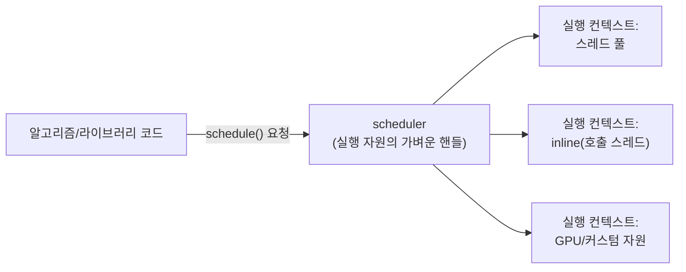

**Executors**란 "작업을 어디서, 언제, 어떤 정책으로 실행할지"를 실행 자원(스레드 풀, 인라인 호출, GPU 등)로부터 분리해 표준화하려는 C++의 추상화 노력을 말합니다. 동기는 단순합니다 — 알고리즘이나 라이브러리 코드를 작성할 때마다 "이 작업을 스레드 풀에 넣을지, 호출 스레드에서 즉시 돌릴지, GPU에 던질지"를 하드코딩하면 재사용성이 떨어지고, 실행 정책을 바꾸려면 호출부를 전부 고쳐야 합니다. 이 장은 그 추상화가 왜 필요했고, 10여 년의 표준화 과정에서 어떤 모양으로 정착했는지, 그리고 그 최소 구조가 무엇인지를 다룹니다. C++26에 확정된 `std::execution`(P2300)의 스케줄러·센더·리시버 조합을 실제로 쓰는 법은 [17장](/post/concurrency-optimization/cpp26-std-execution-senders-receivers/)에서 다루므로, 이 장은 그 이전 단계 — "왜 executor가 아니라 scheduler인가"라는 개념적 토대에 집중합니다.

## 이 장을 읽기 전에

**전제 지식**: 이 장은 이 트랙 [10장: 스레드 풀 최적화와 워크 스틸링](/post/concurrency-optimization/thread-pool-work-stealing-optimization/)에서 다룬 작업 큐·워커 스레드 모델과, [11장: 코루틴 기반 동시성 패턴](/post/concurrency-optimization/coroutine-based-concurrency-patterns/)에서 다룬 태스크 체이닝 감각을 전제로 합니다. `std::function`으로 콜백을 저장하고 스레드 풀 큐에 넣어 본 경험이 있으면 충분합니다.

**이 장의 깊이**: 이 장은 **심화** 수준입니다. P0443 executor 모델의 구조와 한계에서 시작해, 전문가 구간에서는 scheduler·sender의 최소 개념 구조와 표준화 과정에서 남은 논쟁까지 다룹니다. **다루지 않는 것**: `std::execution`의 실제 API(센더 알고리즘 조합, `then`/`when_all`/`bulk`, 완료 신호 3종의 세부 규약)는 [17장](/post/concurrency-optimization/cpp26-std-execution-senders-receivers/)으로 위임합니다. 스레드 풀·워크 스틸링 큐의 내부 구현은 [10장](/post/concurrency-optimization/thread-pool-work-stealing-optimization/), 코루틴 `Task<T>`의 symmetric transfer 구조는 [11장](/post/concurrency-optimization/coroutine-based-concurrency-patterns/), C++17/20 병렬 알고리즘 실행 정책(`std::execution::par` 등)의 실전 성능 특성은 [18장](/post/concurrency-optimization/parallel-algorithm-execution-policies/)에서 다룹니다.

## 당신의 수준에 맞는 경로

| 수준 | 읽을 부분 | 핵심 목표 |
|------|---------|---------|
| **중급자** | "Executors 표준화의 역사" ~ "초기 executor 모델" | P0443이 왜 나왔고 무엇이 부족했는지 이해 |
| **심화** | "실행 컨텍스트와 스케줄링의 분리" ~ "scheduler·sender의 최소 구조" | scheduler/sender가 executor를 대체한 이유 파악 |
| **전문가** | "자주 하는 오해" ~ "비판적 시각" | C++23/26 표준화 상태를 정확히 구분하고 도입 리스크를 판단 |

---

## Executors 표준화의 역사: P0443에서 P2300까지

실행 자원을 추상화하려는 논의는 2012년 무렵 시작되어, 2016년 Google·Nvidia·Facebook·Microsoft·Sandia National Labs 등 여러 조직이 참여한 절충안으로 <strong>P0443 "A Unified Executors Proposal for C++"</strong>이 나왔습니다. P0443의 핵심은 `executor`라는 개념으로, "실행 자원의 가벼운 핸들"이 작업을 즉시(eager) 제출받아 실행하는 `execute(exec, f)` 형태의 인터페이스였습니다. 이 모델은 "지금 당장 실행해 달라"는 요청은 잘 표현했지만, 2018년 6월 Rapperswil 회의에서 Eric Niebler와 Kirk Shoop이 **지연 실행(lazy execution)을 표현할 수단이 부족하다**는 한계를 지적했습니다. 작업 완료 후 다음 작업으로 이어지는 체이닝, 취소, 에러 전파를 executor 하나만으로 조합하기 어려웠기 때문입니다. 두 사람은 P1055에서 **sender**(아직 실행되지 않은 작업의 서술)와 **receiver**(그 작업의 완료를 통지받는 콜백)라는 대안을 제시했고, 이 아이디어는 이후 여러 논문을 거쳐 <strong>P2300 "std::execution"</strong>으로 통합되었습니다.

P1897 "Towards C++23 executors"이 보여주듯 P0443 계열은 한때 C++23 표준화를 목표로 진행되었지만, 결국 C++23에는 반영되지 못했습니다. P2300은 P0443의 executor 개념을 그대로 확장한 것이 아니라 방향을 바꾼 결과물입니다. 논문은 이 전환을 다음과 같이 명시합니다.

> "The `executor` concept has been removed and all of its proposed functionality is now based on schedulers and senders, as per SG1 direction." — [P2300R10: std::execution](https://www.open-std.org/jtc1/sc22/wg21/docs/papers/2024/p2300r10.html)

P2300은 2024년 6월 St. Louis 회의에서 **C++26 작업 초안에 채택**되었습니다. Herb Sutter의 회의 보고서는 이 채택이 여러 차례 재검토를 거친 뒤 성사되었다고 기록합니다.

> "The major feature approved to merge into the C++26 draft standard was P2300 'std::execution'... It had already been design-approved for C++26 at prior meetings, but it's a huge paper so the specification wording review by Library Wording subgroup (LWG) took extra time." — [Herb Sutter, Trip Report: Summer ISO C++ Meeting in St. Louis, 2024](https://herbsutter.com/2024/07/02/trip-report-summer-iso-c-standards-meeting-st-louis-mo-usa/)

정리하면, "executor"라는 이름의 표준 기능은 C++23에도 C++26에도 존재하지 않습니다. C++26에 들어간 것은 **scheduler·sender·receiver**로 재구성된 `std::execution`(P2300)이며, 이 장에서 "Executors"라는 제목으로 다루는 것은 그 역사적 출발점과, scheduler/sender가 무엇을 해결하려 했는지에 대한 개념적 기초입니다.

## 실행 컨텍스트와 스케줄링의 분리

<strong>실행 컨텍스트(execution context)</strong>는 작업이 실제로 실행되는 자원 — 스레드 풀, 단일 스레드, GPU 스트림, io_uring 기반 이벤트 루프 등을 가리킵니다. <strong>스케줄링(scheduling)</strong>은 "어떤 작업을 어느 실행 컨텍스트로, 언제 보낼지" 결정하는 정책입니다. Executors·scheduler 개념의 핵심 원칙은 이 둘을 분리해, 알고리즘·라이브러리 코드는 "실행 컨텍스트가 구체적으로 무엇인지" 몰라도 되고 호출자가 스케줄링 정책(핸들 하나)을 주입하도록 만드는 것입니다. 이렇게 하면 같은 병렬 알고리즘 코드를 스레드 풀에서도, 단일 스레드 inline 실행으로도, 나중에는 GPU 오프로드로도 재사용할 수 있습니다.



### 초기 executor 모델의 구조와 한계

P0443식 executor는 "작업(콜백)을 받아 즉시 제출한다"는 단일 동작(`execute`)만 정의했습니다. 아래는 그 형태를 재현한 스레드 풀 기반 executor입니다. `execute(f)`는 `f`를 타입 소거(`std::function<void()>`)해 큐에 넣고 곧바로 반환하며, 작업이 언제 끝났는지·결과가 무엇인지·에러가 났는지를 호출자에게 되돌릴 통로가 없습니다.

```cpp
#include <condition_variable>
#include <functional>
#include <mutex>
#include <queue>
#include <thread>
#include <vector>

// P0443 스타일 executor를 단순화한 재현: execute(f)만 제공하는 이르(eager) 제출 인터페이스.
class ThreadPoolExecutor {
 public:
  explicit ThreadPoolExecutor(unsigned n) {
    for (unsigned i = 0; i < n; ++i) workers_.emplace_back([this] { WorkerLoop(); });
  }
  ~ThreadPoolExecutor() {
    { std::lock_guard<std::mutex> lk(mu_); stop_ = true; }
    cv_.notify_all();
    for (auto& t : workers_) t.join();
  }

  // 완료 통지·반환값·에러 채널이 없다: "실행해 달라"는 요청만 표현 가능.
  void execute(std::function<void()> f) {
    { std::lock_guard<std::mutex> lk(mu_); queue_.push(std::move(f)); }
    cv_.notify_one();
  }

 private:
  void WorkerLoop() {
    for (;;) {
      std::function<void()> task;
      {
        std::unique_lock<std::mutex> lk(mu_);
        cv_.wait(lk, [this] { return stop_ || !queue_.empty(); });
        if (stop_ && queue_.empty()) return;
        task = std::move(queue_.front());
        queue_.pop();
      }
      task();
    }
  }

  std::vector<std::thread> workers_;
  std::queue<std::function<void()>> queue_;
  std::mutex mu_;
  std::condition_variable cv_;
  bool stop_ = false;
};
```

이 인터페이스로는 "작업 A가 끝나면 작업 B를 실행하라"는 체이닝을 표현할 수 없습니다. 호출자가 직접 A 안에서 B를 `execute`하는 콜백 중첩을 쓰거나, 별도의 동기화(조건 변수·future)를 얹어야 합니다. 게다가 `std::function`은 콜러블을 힙에 할당하고 가상 호출로 디스패치하는 경우가 많아, 마이크로초 단위 지연을 다루는 핫패스에서는 무시하기 어려운 간접 비용이 됩니다. 아래는 이 타입 소거 비용을 격리해 보는 Google Benchmark 스켈레톤입니다.

```cpp
#include <benchmark/benchmark.h>
#include <functional>

static void Increment(int& counter) { ++counter; }

// 타입 소거된 std::function 호출: executor의 execute(f)가 내부에서 흔히 이 형태로 저장·호출됨.
static void BM_ErasedCall(benchmark::State& state) {
  int counter = 0;
  std::function<void()> f = [&counter] { Increment(counter); };
  for (auto _ : state) {
    f();
    benchmark::DoNotOptimize(counter);
  }
}
BENCHMARK(BM_ErasedCall);

// 템플릿 기반 정적 디스패치: 호출 지점에서 콜러블 타입이 고정되어 컴파일러가 인라인할 여지가 있음.
template <typename F>
void CallStatic(F&& f) { f(); }

static void BM_StaticCall(benchmark::State& state) {
  int counter = 0;
  auto f = [&counter] { Increment(counter); };
  for (auto _ : state) {
    CallStatic(f);
    benchmark::DoNotOptimize(counter);
  }
}
BENCHMARK(BM_StaticCall);

BENCHMARK_MAIN();
```

`g++ -O2 -std=c++20 bench.cpp -lbenchmark -lpthread`(x86-64, GCC 13 기준)로 빌드해 실행하면, `BM_ErasedCall`이 `BM_StaticCall`보다 느리게 나오는 경우가 흔하지만 배율은 컴파일러의 인라인 결정과 최적화 수준에 따라 무시할 수준부터 몇 배까지 크게 갈립니다. 중요한 것은 특정 숫자가 아니라, **콜러블을 타입 소거해 저장·호출하는 인터페이스는 정적 디스패치보다 느릴 여지가 항상 있다**는 점이며, executor 계열 인터페이스를 핫패스에 둘 때는 자신의 컴파일러·플래그로 직접 재현해 확인해야 합니다.

### scheduler·sender의 최소 구조

P2300은 `executor` 개념을 없애고, 대신 **scheduler**(실행 자원의 가벼운 핸들)와 **sender**(아직 스케줄되지 않은 작업의 서술)로 역할을 나눴습니다. scheduler는 `schedule()` 멤버 하나만 있으면 되고, 그 반환값이 sender입니다. sender는 그 자체로는 아무 일도 하지 않으며, **receiver**(완료 시 호출될 콜백)와 `connect()`로 결합되어야 비로소 실행 가능한 상태가 됩니다. 이 구조가 eager한 `execute(f)`와 다른 점은, sender를 만드는 시점과 실제로 실행이 시작되는 시점을 분리해 그 사이에 다른 sender와 자유롭게 합성(체이닝, 취소 전파, 에러 처리)할 수 있다는 것입니다. 아래는 실제 `std::execution` API가 아니라 그 관계만 재현한 최소 예시입니다 — 실제 API의 완료 신호 3종(값/에러/취소)과 알고리즘 조합은 [17장](/post/concurrency-optimization/cpp26-std-execution-senders-receivers/)에서 다룹니다.

```cpp
#include <concepts>

// 아래 두 concept은 std::execution의 실제 정의가 아니라, "scheduler는 sender를 돌려주고
// sender는 receiver와 connect된다"는 관계만 재현한 최소 스케치다.
template <typename S, typename R>
concept ToySender = requires(S s, R r) {
  s.connect(r);
};

template <typename Sch>
concept ToyScheduler = requires(Sch sch) {
  sch.schedule();
};

struct InlineSender {
  template <typename Receiver>
  void connect(Receiver r) { r(); }  // 실제 P2300은 값/에러/취소 3채널을 구분해 통지한다(17장 참고)
};

struct InlineScheduler {
  InlineSender schedule() { return {}; }
};

static_assert(ToyScheduler<InlineScheduler>);
static_assert(ToySender<InlineSender, void (*)()>);
```

이 최소 구조만으로도 `ThreadPoolExecutor::execute`와의 차이가 드러납니다. `execute(f)`는 "지금 f를 실행해 달라"는 명령이지만, `scheduler.schedule()`이 돌려주는 sender는 "이 스케줄러 위에서 실행될 예정인 작업"이라는 **값**이므로, 다른 sender와 조합하거나 실행을 미루거나 아예 버릴 수 있습니다. NVIDIA의 **stdexec**는 이 모델의 레퍼런스 구현으로, GCC 12+·Clang 16+·MSVC 14.43+에서 C++20 기준으로 바로 사용할 수 있습니다. 다만 저장소 자체가 "APIs may change without notice"라고 명시하듯 여전히 표준 확정 이후의 세부 조정이 진행 중인 실험적 라이브러리이므로, 프로덕션 도입 전에는 해당 버전에서 직접 검증해야 합니다 — [NVIDIA/stdexec](https://github.com/NVIDIA/stdexec).

## 자주 하는 오해

<strong>"C++23에 Executors가 표준화됐다"</strong>는 정확하지 않습니다. P0443·P1897 계열은 C++23을 목표로 진행되었지만 반영되지 못했고, 표준에 들어간 것은 C++26의 `std::execution`(P2300)이며 그 설계는 executor가 아니라 scheduler/sender/receiver입니다. "Executors"라는 이름으로 자료를 검색하면 옛 P0443 문서와 새 P2300 문서가 섞여 나오므로 버전을 반드시 확인해야 합니다.

<strong>"Executors(또는 scheduler)는 스레드 풀 구현체다"</strong>도 흔한 오해입니다. scheduler는 스레드 풀 자체가 아니라 **스레드 풀 같은 실행 자원을 가리키는 핸들**입니다. 스레드 풀의 큐·워커 구현은 [10장](/post/concurrency-optimization/thread-pool-work-stealing-optimization/)의 주제이고, 이 장의 scheduler는 그 위에 얹히는 얇은 인터페이스 계층입니다. scheduler 하나를 두고 뒤에서 스레드 풀을 GPU 큐로 바꿔도 scheduler를 사용하는 코드는 바뀌지 않아야 한다는 것이 이 분리의 목적입니다.

<strong>"C++17의 `std::execution::par`와 C++26의 `std::execution`은 같은 것이다"</strong>도 짚어야 할 오해입니다. C++17은 병렬 알고리즘의 실행 정책 태그(`std::execution::seq`, `par`, `par_unseq`, `unseq`)를 `std::execution` 네임스페이스에 정의했고, P2300도 같은 네임스페이스를 씁니다. 하지만 둘은 서로 다른 추상화입니다 — 실행 정책은 알고리즘이 "어떻게"(순차/병렬/벡터화) 실행되어야 하는지를 표현하고, scheduler는 "어디서" 실행되는지를 표현합니다. P2500R0은 이 둘을 `execute_on` 같은 CPO로 엮는 방안을 논의했을 만큼 서로 보완적이지만 동일하지는 않습니다. 실행 정책 자체의 성능 특성은 [18장](/post/concurrency-optimization/parallel-algorithm-execution-policies/)에서 다룹니다.

## 판단 기준: 언제 이 추상화가 필요한가

| 상황 | 권장 | 비권장 |
|------|------|--------|
| 라이브러리 코드가 여러 실행 자원(스레드 풀/inline/GPU)을 지원해야 함 | scheduler 핸들을 매개변수로 받기 | 스레드 풀 API를 라이브러리 내부에 하드코딩 |
| 단발성 "지금 이 함수를 다른 스레드에서 실행" | 기존 스레드 풀의 `execute`/`submit` 인터페이스([10장](/post/concurrency-optimization/thread-pool-work-stealing-optimization/)) | scheduler/sender 도입으로 복잡도만 늘리기 |
| 여러 비동기 작업을 체이닝·취소·에러 전파까지 표준화된 방식으로 조합 | `std::execution`(P2300) 도입 검토 | 콜백 중첩·수작업 future 조합 유지 |
| 프로덕션 핫패스에 지금 당장 적용 | 자체 스레드 풀 + 정적 디스패치, 성숙도가 오른 뒤 재검토 | 실험적 표준 라이브러리 기능을 검증 없이 도입 |
| 실행 정책만 필요(병렬 for-each 등) | C++17/20 실행 정책([18장](/post/concurrency-optimization/parallel-algorithm-execution-policies/)) | scheduler/sender로 과설계 |

## 비판적 시각: 논쟁과 남은 리스크

executor/scheduler 논의는 100편이 넘는 논문과 10년 넘는 시간을 거쳤고, 그 과정 자체가 "경쟁하는 조직의 요구사항을 하나의 인터페이스로 묶는 일"이 얼마나 어려운지 보여줍니다. P2300이 2024년 C++26 초안에 채택된 표결도 만장일치가 아니라 반대표가 상당수 있었던 것으로 알려져 있어, 설계 방향에 대한 이견이 완전히 해소된 채택은 아니었습니다. 실무 관점에서는 두 가지 리스크가 남습니다. 첫째, GCC·Clang·MSVC의 네이티브 `std::execution` 지원은 2026년 시점에도 실험적 플래그 뒤에 있거나 부분적이므로, 표준 문서상의 기능과 실제로 컴파일되는 기능 사이에 구현체별 격차가 있습니다(구현 정의 영역이 넓습니다). 둘째, sender/receiver 모델은 executor의 단순한 `execute(f)`보다 개념적으로 무겁고, 타입이 센더 알고리즘 체인을 그대로 반영해 컴파일 에러 메시지가 길어지는 경향이 있다고 보고됩니다. 이런 이유로 이 장의 판단 기준은 "지금 당장 도입"보다 "무엇이 문제인지 이해하고, 표준 라이브러리 지원이 무르익을 때를 대비"하는 쪽에 무게를 둡니다.

## 마무리

이 장을 읽은 뒤 다음을 확인할 수 있어야 합니다.

- [ ] P0443 executor 모델의 `execute(f)` 인터페이스가 무엇을 표현하지 못했는지 설명할 수 있다.
- [ ] "C++23 Executors"와 "C++26 std::execution(P2300)"이 서로 다른 것임을 구분할 수 있다.
- [ ] scheduler(실행 자원 핸들)와 sender(아직 실행되지 않은 작업의 서술)의 역할 차이를 설명할 수 있다.
- [ ] C++17 실행 정책의 `std::execution`과 P2300의 `std::execution`이 네임스페이스만 같고 다른 추상화임을 안다.
- [ ] 타입 소거 기반 콜백 인터페이스가 핫패스에서 갖는 잠재 비용을 벤치마크로 확인할 수 있다.
- [ ] 지금 프로덕션에 scheduler/sender를 도입할지, 기존 스레드 풀 인터페이스로 충분한지 판단 기준을 적용할 수 있다.

**다음 장에서는** 이 장에서 다진 scheduler/sender 개념 위에서, C++26에 확정된 `std::execution`(P2300)의 실제 API — 스케줄러·센더·리시버를 조합하는 알고리즘(`then`, `when_all`, `bulk` 등)과 NVIDIA stdexec 레퍼런스 구현, Citadel Securities의 프로덕션 도입 사례를 다룹니다.

→ [C++26 std::execution: Senders/Receivers 실전](/post/concurrency-optimization/cpp26-std-execution-senders-receivers/) (17장)
