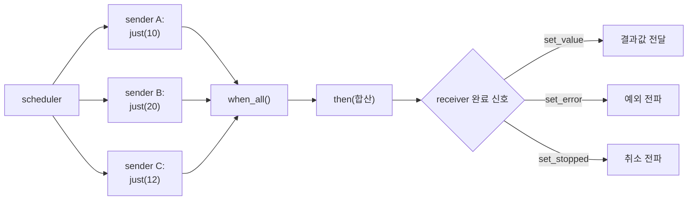

**C++26 std::execution 실전**이란 P2300에서 표준화된 스케줄러·센더·리시버 조합 모델을 실제 코드로 구성하고, 그 완료 신호·구조적 동시성·취소 전파가 어떻게 동작하는지를 다루는 것을 말합니다. [16장](/post/concurrency-optimization/cpp-executors-fundamentals/)에서 "왜 executor가 아니라 scheduler/sender인가"라는 개념적 토대를 다졌다면, 이 장의 동기는 그 다음 질문입니다 — 이 모델로 실제 비동기 파이프라인을 어떻게 짜고, 어디서 실수하기 쉬우며, 프로덕션에 지금 가져다 써도 되는가. 2024년 6월 C++26 초안에 채택된 이 기능은 2026년 3월 Croydon 회의에서 C++26 전체 기술 내용이 확정되며 함께 고정되었고, NVIDIA의 stdexec가 사실상 표준 레퍼런스 구현 역할을 하고 있습니다. Citadel Securities 같은 저지연 트레이딩 회사가 이 모델을 실무 관점에서 소개하는 글을 낼 만큼 실전 관심이 높은 주제이기도 합니다.

## 이 장을 읽기 전에

**전제 지식**: 이 장은 [16장: Executors 기초](/post/concurrency-optimization/cpp-executors-fundamentals/)에서 다룬 scheduler(실행 자원의 가벼운 핸들)·sender(아직 실행되지 않은 작업의 서술) 개념과, P0443 executor에서 P2300으로 넘어간 이유를 전제로 합니다. 그 역사와 최소 구조를 아직 안 읽었다면 먼저 16장을 읽는 것을 권장합니다. 이 트랙 [09장: C++20 Atomics](/post/concurrency-optimization/cpp20-atomic-wait-notify/)의 `wait`/`notify` 감각과 [10장: 스레드 풀 최적화](/post/concurrency-optimization/thread-pool-work-stealing-optimization/)의 작업 큐 모델도 도움이 됩니다.

**이 장의 깊이**: 이 장은 **전문** 수준입니다. 센더/리시버의 완료 신호 3채널과 `then`/`when_all`/`sync_wait` 같은 표준 알고리즘 조합에서 시작해, 전문가 구간에서는 구조적 동시성(`async_scope`)·취소 전파·표준화 과정에서 제거된 API의 이유까지 다룹니다. **다루지 않는 것**: scheduler/sender가 왜 executor를 대체했는지의 역사는 [16장](/post/concurrency-optimization/cpp-executors-fundamentals/), 코루틴과 센더의 상호운용 세부는 [11장](/post/concurrency-optimization/coroutine-based-concurrency-patterns/), C++17/20 실행 정책(`std::execution::par` 등)의 성능 특성은 [18장](/post/concurrency-optimization/parallel-algorithm-execution-policies/), 표준 스레드 풀 자체의 워크 스틸링 구현은 [10장](/post/concurrency-optimization/thread-pool-work-stealing-optimization/)으로 위임합니다.

## 당신의 수준에 맞는 경로

| 수준 | 읽을 부분 | 핵심 목표 |
|------|---------|---------|
| **중급자** | "표준화 현황과 구현 생태계" ~ "센더/리시버 계약: 완료 신호 3채널과 합성" | 완료 신호 3채널과 기본 알고리즘 조합을 읽고 이해 |
| **심화** | "구조적 동시성" ~ "흔한 오개념" | `async_scope`·취소 전파·자주 하는 실수를 구분 |
| **전문가** | "판단 기준" ~ "비판적 시각" | 프로덕션 도입 시점과 리스크를 스스로 판단 |

---

## 표준화 현황과 구현 생태계

P2300은 2024년 6월 St. Louis 회의에서 C++26 작업 초안에 채택되었고([16장](/post/concurrency-optimization/cpp-executors-fundamentals/) 참고), 2026년 3월 23–28일 영국 Croydon 회의에서 C++26의 나머지 국제 코멘트가 모두 해소되며 기술 내용 자체가 확정되었습니다. WG21 의장단의 회의 보고서는 이 시점을 다음과 같이 기록합니다.

> "We resolved the remaining international comments on the C++26 draft, and are now producing the final document to be sent out for its international approval ballot (Draft International Standard, or DIS) and final editorial work, to be published in the near future by ISO." — [Herb Sutter, "C++26 is done!" — Trip report: March 2026 ISO C++ standards meeting](https://herbsutter.com/2026/03/29/c26-is-done-trip-report-march-2026-iso-c-standards-meeting-london-croydon-uk/)

즉 기술 내용은 고정됐지만 ISO의 정식 국제표준 발간(DIS 투표·편집)은 아직 진행 중입니다. 같은 글에서 저자는 `std::execution`을 "C++의 비동기 모델"이라 부르며 자신의 회사가 이미 프로덕션에서 쓰고 있다고 언급하는 동시에, 문서화 부족과 주변 라이브러리("fingers-and-toes" 생태계, 즉 세세한 실전 도구 모음)의 미비로 다른 C++26 기능보다 도입 난이도가 높다고 지적합니다. 이 평가는 뒤에 나오는 "비판적 시각" 절의 출발점이기도 합니다.

표준 문서([P2300R10: std::execution](https://www.open-std.org/jtc1/sc22/wg21/docs/papers/2024/p2300r10.html))가 정의하는 것은 **어휘와 개념적 골격**(스케줄러·센더·리시버 개념, 완료 신호 규약, `then`/`when_all` 같은 알고리즘의 요구 조건)이지, 그 자체로 실행 가능한 단일 구현체가 아닙니다. 실제로 코드를 돌리려면 구현체가 필요하며, 2026년 시점에는 크게 세 갈래가 있습니다. NVIDIA의 <strong>[stdexec](https://github.com/NVIDIA/stdexec)</strong>는 GCC 12+·Clang 16+·MSVC 14.43+·Xcode 16+에서 C++20 이상으로 바로 쓸 수 있는 헤더 전용 레퍼런스 구현이고, `nvexec` 네임스페이스로 `nvc++` 컴파일러 기반 GPU 스케줄러도 제공합니다. Meta의 **libunifex**는 P2300 이전부터 존재해 온 실전 검증된 구현으로 P2300 설계에 큰 영향을 줬습니다. **Beman Project의 execution 라이브러리**는 표준 문서 자체를 그대로 구현하는 것을 목표로 하지만 저장소 스스로 "프로덕션 준비 안 됨"이라고 명시합니다. 반면 GCC·Clang·MSVC의 **표준 라이브러리 자체**(`libstdc++`, `libc++`, MSVC STL)에 `<execution>` 헤더로 `std::execution`이 네이티브로 들어간 상태는 2026년 중반 기준으로 아직 완료되지 않았습니다 — LLVM 프로젝트에는 이를 추적하는 이슈가 여전히 열려 있고, 정확한 지원 시점은 각 컴파일러의 릴리스 노트로 직접 확인해야 하는 **구현 정의** 영역입니다. 이 장의 예제는 실제로 지금 컴파일할 수 있는 stdexec 기준으로 작성합니다.

## 센더/리시버 계약: 완료 신호 3채널과 합성

센더/리시버 모델의 핵심은 비동기 작업의 완료를 **정확히 세 가지 채널**로만 통지하도록 강제한다는 점입니다. 작업이 성공하면 `set_value`로 결과값을, 예외나 오류가 나면 `set_error`로 에러를, 취소되면 `set_stopped`로 알립니다. 이 세 채널 중 정확히 하나만 정확히 한 번 호출된다는 규약이 있기 때문에, 콜백을 직접 짜던 시절 흔했던 "에러 콜백을 깜빡했다"거나 "성공과 실패를 동시에 통지했다" 같은 버그가 타입 시스템 수준에서 방지됩니다. **sender**는 "무엇을, 어떤 채널로 완료시킬 것인가"를 서술하는 값이고, **receiver**는 그 세 채널을 각각 처리하는 콜백 묶음입니다. sender와 receiver를 `connect()`로 묶으면 아직 시작되지 않은 **operation_state**가 만들어지고, 여기에 `start()`를 호출해야 비로소 실행이 시작됩니다. 이 3단계 분리(서술 → 연결 → 시작) 덕분에 operation_state는 스택이나 부모 객체 안에 값으로 둘 수 있어, 콜백 체인마다 힙 할당이 필요했던 `std::function` 기반 콜백 방식과 달리 **합성 경로 전체를 할당 없이 구성**할 여지가 생깁니다.

실무에서는 `connect`/`start`를 직접 손으로 쓰는 일이 드물고, 대신 `then`·`when_all`·`let_value` 같은 **알고리즘**으로 센더를 조합한 뒤 `sync_wait` 하나로 시작·대기·값 회수를 한 번에 처리합니다. `then(sender, f)`는 입력 센더가 값으로 완료되면 `f`를 호출해 그 결과를 새 값으로 감싼 센더를 돌려주고, `when_all(s1, s2, ...)`은 여러 센더를 동시에 시작해 **모두** 값으로 완료돼야 그 결과들을 튜플처럼 묶어 다음 단계로 넘깁니다(하나라도 에러·취소되면 나머지에 취소를 전파합니다). `let_value(sender, f)`는 `f`가 입력값을 받아 **또 다른 센더**를 돌려주는 패턴으로, 이전 결과에 따라 다음에 실행할 파이프라인 자체를 동적으로 고르고 싶을 때 씁니다. `on(scheduler, sender)`는 그 센더를 지정한 스케줄러 위에서 실행하도록 강제합니다. 아래는 NVIDIA stdexec로 세 개의 독립적인 계산을 병렬로 실행해 결과를 합산하는, 그대로 빌드되는 예제입니다.

```cpp
#include <stdexec/execution.hpp>
#include <cstdio>

namespace ex = stdexec;

int main() {
  auto sched = ex::get_parallel_scheduler();  // 시스템 병렬 스케줄러(스레드 풀 핸들)

  // 세 센더를 각각 sched 위에서 실행하고, 세 결과를 하나의 값으로 합성한다.
  auto pipeline =
      ex::when_all(
          ex::on(sched, ex::just(10)),
          ex::on(sched, ex::just(20)),
          ex::on(sched, ex::just(12)))
      | ex::then([](int a, int b, int c) { return a + b + c; });

  auto [total] = ex::sync_wait(std::move(pipeline)).value();
  std::printf("total = %d\n", total);  // total = 42
}
```

이 코드는 `when_all`이 만든 센더를 `sync_wait`가 `connect`·`start`까지 대신 처리해 주는 형태로, 호출자는 스레드 생성·조인·조건 변수를 직접 다루지 않습니다. `sync_wait`는 반환 타입이 `std::optional<std::tuple<...>>`이므로 `.value()`로 언랩한 뒤 구조적 바인딩으로 꺼내야 하며, 센더가 값이 아니라 에러나 취소로 끝났다면 `.value()` 호출 자체가 예외를 던지거나 `std::nullopt`가 됩니다. `stdexec/execution.hpp` 하나만 include하면 되고, 저장소를 CMake의 `CPM`이나 `add_subdirectory`로 받아 `-std=c++20` 이상으로 빌드합니다(README 기준 GCC 12+, Clang 16+, MSVC 14.43+).

## 구조적 동시성: async_scope와 취소 전파

`when_all`처럼 정적으로 몇 개의 센더를 조합할지 아는 경우와 달리, 실행 중에 동적으로 작업을 여러 개 띄우고 그 전체가 끝나기를 기다려야 하는 경우가 있습니다. 초기 P2300 초안에는 이를 위해 `ensure_started`(즉시 시작하고 나중에 결과를 받을 센더를 돌려줌)와 `start_detached`(시작만 하고 결과를 버림)가 있었지만, 이 둘은 C++26 확정 전에 표준 초안에서 제거되었습니다. 제안 논의에 따르면 두 API는 반환된 센더나 결과를 실수로 버려도 컴파일이나 실행에 아무 문제가 없어 보이는데, 실제로는 백그라운드에서 시작된 작업이 아무 데도 연결되지 않은 채 계속 돌아 리소스 정리를 보장할 수 없는 함정이 있었습니다. 대신 권장되는 대안이 **구조적 동시성**을 강제하는 `async_scope`입니다. `scope.spawn(sender)`는 결과를 신경 쓰지 않는 fire-and-forget 작업을 이 스코프에 등록하고, `scope.spawn_future(sender)`는 나중에 결과를 조회할 수 있는 센더를 돌려주며, `scope.on_empty()`는 스코프에 등록된 모든 작업이 끝났을 때 완료되는 센더입니다. 스코프가 소멸하기 전에 등록된 작업이 전부 끝나야 하므로, "백그라운드 작업을 시작해 놓고 아무도 정리하지 않는" 문제 자체가 타입 구조로 방지됩니다.



취소는 **stop_token**을 통해 전파됩니다. `when_all`로 묶인 센더 중 하나가 `set_stopped`로 끝나면 나머지에도 취소 요청이 전달되고, 각 센더는 자신의 완료 콜백에서 `get_stop_token`으로 이를 확인해 조기 종료할 수 있습니다. Citadel Securities가 정리한 [실무 설명](https://www.citadelsecurities.com/careers/career-perspectives/how-cpp26-rethinks-concurrency-and-execution/)은 이 구조를 다음과 같이 요약합니다 — 하나의 작업이 먼저 끝나면 나머지는 자동으로 취소되고, 취소 신호는 수작업 배선 없이 시스템 전체로 전파되며, 취소는 실제로 필요한 컴포넌트에서만 처리됩니다. 전통적인 스레드·뮤텍스·큐 기반 코드에서 프로덕션 장애가 흔히 "누가 어떤 작업의 생명주기를 책임지는지 불분명함", "숨겨진 의존관계", "수작업 동기화"에서 나온다는 점을 짚으며, 구조적 실행 모델이 이를 직접 제거한다고 설명합니다.

동시성이 항상 여러 스레드를 요구하지는 않는다는 점도 이 모델의 특징입니다. `sync_wait`는 별도의 `run_loop` 스케줄러를 제공해, 단일 스레드 위에서도 여러 비동기 작업을 협조적으로 조율할 수 있게 합니다. 이는 스레드 생성 비용 자체를 피해야 하는 저지연 경로에서 유용한 선택지이며, 스레드 풀 위의 병렬 실행과 단일 스레드 협조 실행을 **같은 센더 코드로 표현**할 수 있다는 것이 scheduler 추상화의 실질적 이득입니다.

## 흔한 오개념

<strong>"센더 파이프라인을 만들면 그 줄에서 바로 실행이 시작된다"</strong>는 틀렸습니다. `ex::when_all(...) | ex::then(...)`는 그 자체로는 **아직 실행되지 않은 작업의 서술**일 뿐입니다. `sync_wait`나 `async_scope::spawn` 같은 시작 지점으로 넘기지 않고 이 값을 그냥 버리면, 파괴자가 호출될 뿐 어떤 부수효과도 일어나지 않습니다. 콜백을 즉시 실행하던 `execute(f)` 스타일(16장)에 익숙하면 이 지연(lazy) 특성을 놓치기 쉬우므로, "센더를 만들었는데 결과가 왜 안 나오지?"라는 증상을 보면 먼저 시작 지점으로 연결됐는지부터 확인해야 합니다.

<strong>"sender/receiver를 쓰면 동기화가 필요 없어진다"</strong>도 과장입니다. 구조적 동시성이 없애는 것은 **작업의 생명주기 관리와 취소 전파에 관한 수작업 동기화**이지, 콜백 본문 안에서 여러 센더가 같은 가변 상태를 직접 공유하며 쓰는 것까지 막아 주지는 않습니다. 세 개의 `then()` 콜백이 각자 지역적으로 계산한 값을 반환해 `when_all`이 묶어 주는 방식은 안전하지만, 그 콜백들이 캡처한 공유 변수를 각자 잠금 없이 갱신하면 여전히 데이터 레이스입니다. 아래는 이 차이를 그대로 재현한 예제입니다.

```cpp
#include <stdexec/execution.hpp>
#include <cstdio>

namespace ex = stdexec;

// 깨진 버전: 세 콜백이 공유 변수 total을 동기화 없이 갱신한다.
// when_all이 취소·에러 전파는 대신 해 주지만, 콜백 내부의 공유 상태 경합까지 막아 주지는 않는다.
int RacyTotal() {
  auto sched = ex::get_parallel_scheduler();
  int total = 0;  // 여러 스레드가 동시에 쓰는 공유 변수, 보호 없음
  auto racy = ex::when_all(
      ex::on(sched, ex::just() | ex::then([&] { total += 10; })),
      ex::on(sched, ex::just() | ex::then([&] { total += 20; })),
      ex::on(sched, ex::just() | ex::then([&] { total += 12; })));
  ex::sync_wait(std::move(racy));
  return total;
}

// 올바른 버전: 각 콜백이 결과를 "값으로 반환"하고, 합산은 when_all 뒤 then()에서 한 번만 수행한다.
// 공유 가변 상태가 아예 없으므로 동기화 자체가 필요 없다.
int ComposedTotal() {
  auto sched = ex::get_parallel_scheduler();
  auto composed =
      ex::when_all(
          ex::on(sched, ex::just(10)),
          ex::on(sched, ex::just(20)),
          ex::on(sched, ex::just(12)))
      | ex::then([](int a, int b, int c) { return a + b + c; });
  auto [total] = ex::sync_wait(std::move(composed)).value();
  return total;
}
```

`RacyTotal`을 `-fsanitize=thread`로 빌드해 실행하면 세 `total += ...` 지점에서 데이터 레이스가 보고됩니다. `ComposedTotal`은 공유 가변 상태 자체가 없어 같은 조건에서 아무것도 보고되지 않습니다. 빌드는 `g++ -std=c++20 -Iinclude/stdexec -fsanitize=thread -g race.cpp -o race && ./race`(GCC 13 기준, `include` 경로는 stdexec 저장소의 헤더 위치)처럼 진행하며, ThreadSanitizer 진단은 컴파일러·플랫폼에 따라 세부 출력 형식이 다를 수 있으므로 직접 재현해 확인해야 합니다. 요지는 **센더 조합이 취소·에러 전파는 대신해 주지만, 공유 가변 상태를 값 전달로 바꾸는 설계 책임은 여전히 개발자에게 있다**는 것입니다.

<strong>"stdexec가 곧 컴파일러에 내장된 std::execution이다"</strong>도 흔한 착각입니다. stdexec는 헤더 전용 **레퍼런스 구현**이며 저장소 스스로 "APIs may change without notice"라고 밝히는 실험적 라이브러리입니다. 표준 문서(P2300)가 정의하는 것은 어휘와 요구 조건이고, 실제 실행 가능한 코드는 stdexec·libunifex·Beman 같은 별도 구현을 받아와야 얻을 수 있습니다. 컴파일러 벤더가 자체 표준 라이브러리에 `<execution>`을 언제 어떤 완성도로 넣을지는 각 벤더의 릴리스 노트로 개별 확인해야 하는 영역입니다.

## 판단 기준: 언제 쓰고 언제 피할지

| 상황 | 권장 | 비권장 |
|------|------|--------|
| 여러 비동기 단계를 취소·에러 전파까지 표준화된 방식으로 합성 | `then`/`when_all`/`let_value` 조합 | 콜백 중첩·수작업 future 체이닝 |
| 백그라운드 작업의 생명주기를 스코프로 묶어 관리 | `async_scope::spawn`/`spawn_future` | 제거된 `ensure_started`/`start_detached` 패턴 재현 |
| 스레드 풀과 단일 스레드 협조 실행을 같은 코드로 표현 | scheduler 핸들을 주입받는 제네릭 코드 | 실행 컨텍스트를 함수 내부에 하드코딩 |
| 여러 콜백이 같은 가변 상태를 갱신해야 함 | 값을 반환해 `when_all`/`then`으로 합성 | 콜백 안에서 공유 변수를 잠금 없이 직접 갱신 |
| 단순 병렬 for-each·정렬 등 실행 정책만 필요 | C++17/20 실행 정책([18장](/post/concurrency-optimization/parallel-algorithm-execution-policies/)) | 학습 곡선이 가파른 sender/receiver로 과설계 |
| 지금 당장 프로덕션 핫패스에 적용 | 문서화·주변 라이브러리 성숙도를 먼저 검증 | 실험적 레퍼런스 구현을 검증 없이 그대로 배포 |

## 비판적 시각: 생태계 성숙도와 트레이드오프

P2300은 100편이 넘는 논문과 10년 가까운 논의를 거쳐 C++26에 들어갔지만, 그 채택 자체가 논쟁의 종결을 뜻하지는 않습니다([16장](/post/concurrency-optimization/cpp-executors-fundamentals/)의 반대표 기록 참고). `ensure_started`/`start_detached`가 확정 직전에 제거된 사례가 보여주듯, 설계는 C++26 초안 확정 시점까지도 API 표면을 다듬는 조정을 거쳤습니다. 실무 도입 관점에서 남는 리스크는 세 가지입니다. 첫째, 표준 라이브러리 네이티브 구현이 2026년 중반 기준으로 아직 완료되지 않아, stdexec 같은 서드파티 헤더 전용 라이브러리에 의존해야 하는 과도기입니다. 둘째, Herb Sutter가 지적한 대로 문서화와 "fingers-and-toes" 수준의 주변 도구(디버깅, 프로파일링 통합, 진단 개선)가 아직 다른 성숙한 C++ 기능만큼 갖춰지지 않았습니다. 셋째, 센더 알고리즘 체인은 타입이 조합 경로를 그대로 반영하므로, 조합 단계가 길어질수록 컴파일 에러 메시지가 길어지는 경향이 있다고 보고됩니다(16장에서도 다룬 문제이며, 여기서는 알고리즘 조합이 늘수록 체감이 더 커집니다). 반대로 Citadel Securities의 정리와 Herb Sutter의 "이미 프로덕션에 쓰고 있다"는 언급은, 이 모델이 저지연·고신뢰성이 중요한 금융 시스템 같은 도메인에서 이미 실전 검증을 받고 있다는 신호이기도 합니다. 결론적으로 이 모델은 "표준에 들어갔으니 당장 전면 도입"이 아니라, "구조적 동시성이 실제로 아끼는 복잡도가 무엇인지 이해하고, 자신의 컴파일러·라이브러리 스택에서 성숙도를 직접 검증한 뒤 좁은 범위부터 적용"하는 태도로 접근하는 것이 안전합니다.

## 마무리

이 장을 읽은 뒤 다음을 확인할 수 있어야 합니다.

- [ ] 센더/리시버의 완료 신호 3채널(`set_value`/`set_error`/`set_stopped`)과 `connect`/`start`의 역할을 설명할 수 있다.
- [ ] `then`/`when_all`/`let_value`/`sync_wait`로 실제 파이프라인을 조합하고, stdexec 기준으로 빌드할 수 있다.
- [ ] `async_scope`가 `ensure_started`/`start_detached`의 어떤 함정을 막기 위해 도입됐는지 설명할 수 있다.
- [ ] 센더 조합이 취소·에러 전파는 대신하지만 공유 가변 상태의 데이터 레이스까지 막지는 않는다는 점을 예제로 구분할 수 있다.
- [ ] C++26 std::execution의 표준화 현황(기술 내용 확정 vs ISO 정식 발간)과 stdexec·libunifex·Beman 등 구현 생태계를 구분할 수 있다.
- [ ] 지금 프로덕션에 도입할지, 문서화·생태계 성숙을 더 기다릴지 판단 기준을 적용할 수 있다.

**다음 장에서는** senders/receivers가 임의의 비동기 파이프라인을 다루는 범용 모델이라면, 그보다 좁고 오래된 표준 도구인 **C++17/20 실행 정책(`std::execution::par`, `par_unseq` 등)** 기반 병렬 알고리즘을 다룹니다. 두 `std::execution` 네임스페이스가 이름만 같고 다른 추상화라는 점([16장](/post/concurrency-optimization/cpp-executors-fundamentals/)에서 짚은 오해)을 실제 성능 특성과 함께 확인합니다.

→ [실행 정책 병렬 알고리즘](/post/concurrency-optimization/parallel-algorithm-execution-policies/) (18장)
