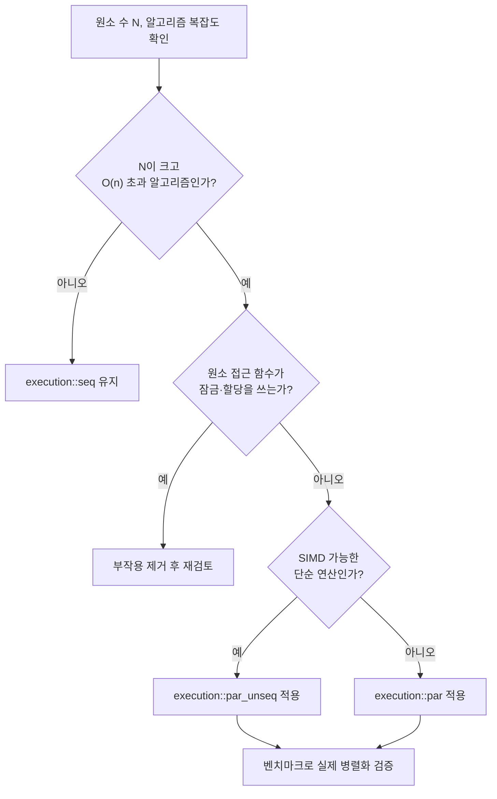

**실행 정책 병렬 알고리즘**이란 `std::sort`, `std::transform`, `std::for_each` 같은 기존 표준 알고리즘 호출에 `std::execution::seq`/`par`/`par_unseq`(C++17)나 `unseq`(C++20) 태그 하나를 얹어, 스레드를 직접 만들거나 나누지 않고도 알고리즘 내부 반복을 병렬화·벡터화하도록 요청하는 C++17 표준 라이브러리 기능을 말합니다. 이 장을 여는 동기는 단순합니다 — 이전 장에서 다룬 `std::execution`(senders/receivers, C++26)이나 [10장](/post/concurrency-optimization/thread-pool-work-stealing-optimization/)의 커스텀 스레드 풀은 설계·구현 비용이 크지만, 표준 알고리즘 호출부에 정책 인자 하나를 추가하는 것은 코드 변경 폭이 가장 작은 병렬화 수단입니다. 다만 "가장 쉬운 병렬화"라는 인상과 달리, 실제로 속도가 나는지는 구현체·데이터 크기·알고리즘 종류에 크게 좌우되며, 표준은 상당 부분을 구현 정의(implementation-defined)로 남겨 두었습니다. 이 장은 그 정책이 실제로 무엇을 보장하고 무엇을 보장하지 않는지, 그리고 언제 이득이 손해로 뒤집히는지를 다룹니다.

## 이 장을 읽기 전에

**선행 지식**: [01장: 동기화 비용 분석](/post/concurrency-optimization/synchronization-primitive-cost-analysis/)에서 다룬 "스레드 생성·분배 자체에 비용이 든다"는 감각과, 표준 알고리즘(`std::sort`, `std::transform`, `std::accumulate` 등)의 기본 사용법을 전제로 합니다. [17장: C++26 std::execution](/post/concurrency-optimization/cpp26-std-execution-senders-receivers/)을 먼저 읽었다면, 이름이 비슷한 두 기능이 서로 다른 것임을 이 장에서 구분할 수 있습니다.

**이 장의 깊이**: **중급**입니다. 네 가지 실행 정책의 의미, 표준 라이브러리 구현체(GCC libstdc++, Clang libc++, MSVC STL)별 실제 동작 차이, 언제 손익분기점을 넘는지, 표준이 예외를 어떻게 다루는지를 다룹니다.

**다루지 않는 것**: 직접 스레드 풀을 설계·구현하는 방법(→ [10장](/post/concurrency-optimization/thread-pool-work-stealing-optimization/)), lock-free 자료구조 자체의 설계(→ [05장](/post/concurrency-optimization/lock-free-design-fundamentals/), [06장](/post/concurrency-optimization/lock-free-queue-stack-hashmap/)), C++26 `std::execution`(senders/receivers)의 스케줄러·센더 조합 모델(→ [17장](/post/concurrency-optimization/cpp26-std-execution-senders-receivers/)), OpenMP·TBB를 독립된 병렬 프로그래밍 프레임워크로 직접 사용하는 방법(각각의 공식 문서를 참고)입니다.

## 당신의 수준에 맞는 경로

| 수준 | 읽을 부분 | 핵심 목표 |
|------|---------|---------|
| **입문** | "실행 정책의 등장 배경" ~ "네 가지 정책의 의미" | seq/par/par_unseq/unseq가 각각 무엇을 허용하는지 이해 |
| **중급** | "구현체별 실제 동작 차이" ~ "코드로 보는 정책 적용과 성능 측정" | GCC/Clang/MSVC 차이와 손익분기점을 벤치마크로 확인 |
| **실무 적용** | "흔한 오개념 교정" ~ "비판적 시각" | 언제 쓰고 언제 피할지 판단, 표준의 한계 인지 |

## 실행 정책의 등장 배경

병렬 알고리즘은 원래 C++ 표준이 아니라 **Parallelism TS**(Technical Specification, N4507 계열)로 별도 실험되던 기능이었고, Intel이 자사의 Parallel STL(PSTL) 구현을 GCC·LLVM에 기증하면서 실물 구현이 먼저 퍼졌습니다. 이 TS가 **P0024R2**로 C++17에 정식 채택되면서 `std::execution::seq`, `par`, `par_unseq`와 함께 알고리즘 라이브러리 전반에 실행 정책 인자를 받는 오버로드가 추가되었습니다. GCC는 9.1(2019)에서 이 구현을 libstdc++에 처음 들여왔습니다. 이후 SG1(Study Group 1, 병렬성/동시성 담당)은 "정책이 벡터 실행만 지시하고 스레드 이동은 금지"하는 네 번째 정책이 빠져 있다는 점을 지적했고, Arch Robison·Pablo Halpern 등이 제출한 논문(P0076)의 "vector/wavefront 정책" 제안 중 이견 없이 받아들여진 부분이, Pablo Halpern·Alisdair Meredith가 정리한 후속 논문 [**P1001R2**](https://www.open-std.org/jtc1/sc22/wg21/docs/papers/2019/p1001r2.html)를 통해 `std::execution::unseq`(`unsequenced_policy`)만 분리되어 C++20에 추가되는 근거가 되었습니다. 이 논문은 SG1 논의 과정에서 별다른 이견 없이 받아들여졌을 만큼, 순수하게 원래 설계의 빈틈을 메우는 성격이었습니다.

여기서 주의할 점은, 이 장의 "실행 정책(execution policy)"과 17장의 "std::execution"(senders/receivers, P2300, C++26)은 **이름만 겹칠 뿐 서로 다른 기능**이라는 것입니다. 전자는 2017년에 확정되어 이미 세 주요 구현체에 존재하는 "알고리즘 호출을 병렬화하는 태그"이고, 후자는 2024년에 표준화되어 이제 막 구현이 시작된 "비동기 실행 그래프를 조립하는 프레임워크"입니다. 두 기능은 향후 표준에서 통합될 가능성이 논의되고 있지만, 2026년 현재는 별개의 API입니다.

## 실행 정책이 실제로 하는 일

### 네 가지 정책의 의미

실행 정책은 알고리즘이 각 원소에 적용하는 **원소 접근 함수**(element access function — 람다, 함수 객체, 또는 `operator<` 같은 비교자)를 **어떤 순서·어떤 스레드·어떤 명령어**로 호출해도 되는지를 규정하는 태그입니다. `std::execution::seq`는 기존과 동일하게 단일 스레드에서 순서대로 호출하도록 요구합니다. `std::execution::par`는 여러 스레드에서 병렬로 호출할 수 있게 허용하되, 각 원소 접근 함수 호출 자체는 다른 호출과 **간섭하지 않아야**(indeterminately sequenced, 데이터 레이스 없음) 합니다. `std::execution::par_unseq`는 `par`의 허용에 더해 **단일 스레드 내에서도 SIMD처럼 호출이 인터리빙**될 수 있음을 허용합니다. `std::execution::unseq`(C++20)는 멀티스레드 이동 없이 **호출 스레드 안에서만** 벡터화를 허용하는, `par_unseq`보다 좁은 버전입니다.

`par_unseq`와 `unseq`에서 인터리빙이 허용된다는 것은 실무적으로 중요한 제약을 만듭니다. 원소 접근 함수 안에서 뮤텍스를 잠그거나, 메모리 할당처럼 내부적으로 잠금을 쓰는 "vectorization-unsafe" 연산을 호출하면 안 됩니다. 같은 스레드 안에서 실행이 인터리빙되는 상황에서 블로킹 동기화를 시도하면 그 스레드가 스스로를 기다리는 형태의 교착이 발생할 수 있기 때문입니다. 이 제약은 [03장: False Sharing](/post/concurrency-optimization/false-sharing-detection-avoidance/)에서 다룬 "캐시 라인 경합"과는 다른 차원의 문제이므로 혼동하지 않아야 합니다 — 여기서는 레이아웃이 아니라 **호출 순서 가정 자체**가 깨지는 것이 문제입니다.

표준은 원소 접근 함수에서 처리되지 않은 예외가 나가는 경우를 별도로 규정합니다. `seq`를 제외한 모든 정책에서, 원소 접근 함수가 예외를 던지고 그 알고리즘 프레임 안에서 잡히지 않으면 **`std::terminate`가 호출**됩니다. 이는 표준화 과정에서 여러 스레드에 흩어진 예외를 하나의 `exception_list`로 모아 전파하는 안이 제안되었다가(P0333, P0394 계열), 구현 복잡도와 성능 비용 대비 실익이 낮다는 이유로 기각되고 대신 `terminate` 규정이 채택된 결과입니다. 병렬 알고리즘 내부에서는 예외를 던지지 않는 것이 사실상의 전제 조건입니다.

### 구현체별 실제 동작 차이

정책 태그는 표준화되어 있지만, "실제로 몇 개의 스레드가 어떻게 나뉘어 도는가"는 표준이 규정하지 않는 구현 정의 영역입니다. 세 주요 구현체는 서로 다른 백엔드를 씁니다.

| 구현체 | 백엔드 | 추가 요구사항 | 비고 |
|--------|--------|--------------|------|
| GCC libstdc++ (9.1~) | Intel TBB (oneTBB) | `<execution>` 포함 시 `-ltbb` 링크 필수 | TBB 없이 `par` 사용 코드는 링크 실패 |
| Clang libc++ | 빌드 시 선택(`std_thread`/`openmp`/미설정) | `LIBCXX_ENABLE_PARALLEL_ALGORITHMS` CMake 옵션 필요 | 옵션 미설정 배포판에서는 `par`가 컴파일은 되지만 조용히 `seq`처럼 순차 실행될 수 있음 |
| MSVC STL (VS2017~) | Windows Thread Pool | 없음(표준 헤더만 포함) | 기본적으로 최대 500개 스레드 풀 공유, Windows 11/Server 2022부터는 프로세서 그룹 제한 완화 |

GCC의 [공식 문서](https://gcc.gnu.org/onlinedocs/libstdc++/manual/status.html)는 "The Parallel Algorithms have an external dependency on Intel TBB 2018 or later"라고 명시하며, `<execution>` 헤더를 포함하면 `-ltbb`로 링크해야 한다고 못 박습니다. 2021년경 OpenMP 백엔드로 이 의존성을 없애자는 논의가 있었지만, 2024년 말 기준으로 GCC·Intel 양쪽 모두 구체적인 추진 계획은 확인되지 않습니다 — TBB 링크는 당분간 그대로 필요하다고 보는 것이 안전합니다. Clang libc++는 빌드 설정에 따라 병렬 알고리즘 지원 자체가 꺼져 있을 수 있고, 이 경우 `std::execution::par`를 지정한 코드가 컴파일 에러 없이 그냥 `seq`와 동일하게 동작합니다 — "정책을 지정했으니 병렬로 돈다"는 가정이 배포 환경에 따라 조용히 깨질 수 있다는 뜻입니다. [MSVC STL 공식 문서](https://learn.microsoft.com/en-us/cpp/standard-library/execution?view=msvc-170)에 따르면 MSVC STL은 별도 링크 없이 Windows Thread Pool을 자동으로 씁니다.



## 코드로 보는 정책 적용과 성능 측정

정책 인자는 기존 알고리즘 시그니처 맨 앞에 추가하는 형태로 적용됩니다. 아래는 `std::sort`에 `par`를 적용하는 최소 예시와, 크기별로 `seq`/`par` 실행 시간을 직접 비교하는 벤치마크 스켈레톤입니다. GCC에서는 `g++ -std=c++17 -O2 bench.cpp -ltbb -lpthread`로, Clang(libc++가 병렬 알고리즘을 지원하도록 빌드된 경우)에서는 `-ltbb` 없이도 빌드될 수 있습니다(백엔드에 따라 다름).

```cpp
#include <algorithm>
#include <chrono>
#include <execution>
#include <iostream>
#include <random>
#include <vector>

static std::vector<double> make_data(size_t n) {
  std::mt19937 rng(42);
  std::uniform_real_distribution<double> dist(0.0, 1.0);
  std::vector<double> v(n);
  for (auto& x : v) x = dist(rng);
  return v;
}

template <typename Policy>
double time_sort(Policy policy, std::vector<double> data) {
  auto t0 = std::chrono::steady_clock::now();
  std::sort(policy, data.begin(), data.end());
  auto t1 = std::chrono::steady_clock::now();
  return std::chrono::duration<double, std::milli>(t1 - t0).count();
}

int main() {
  for (size_t n : {1'000ul, 100'000ul, 10'000'000ul}) {
    auto data = make_data(n);
    double seq_ms = time_sort(std::execution::seq, data);
    double par_ms = time_sort(std::execution::par, data);
    std::cout << "N=" << n << " seq=" << seq_ms << "ms par=" << par_ms << "ms\n";
  }
}
```

이 벤치마크를 실제로 돌려 보면 N이 작을 때(수천 이하) `par`가 `seq`보다 느리거나 비슷하게 나오는 경우가 흔합니다 — 작업 분할과 스레드 풀 제출 자체의 오버헤드가 정렬 작업량보다 커지기 때문입니다. [MSVC 팀이 공개한 벤치마크](https://devblogs.microsoft.com/cppblog/using-c17-parallel-algorithms-for-better-performance/)에서도 100만 개 `double` 정렬(18코어)에서 `par`가 릴리스 빌드 기준 약 3.9배 빨랐지만, 원소 수가 1,000 근처로 줄면 두 방식의 차이가 사실상 사라졌고, `copy`/`fill`/`reverse`처럼 원소당 작업이 극히 적은 알고리즘은 이 구현에서 순차로만 동작하도록 남겨져 있어 병렬화 이득이 없거나 오히려 손해(예: `reverse`가 순차 버전보다 약 1.6배 느림)였다고 보고되었습니다. 수치는 컴파일러·플래그·하드웨어에 따라 달라지므로(이 벤치마크는 특정 MSVC 버전·18코어 환경 기준) 이 스켈레톤을 자신의 환경에서 그대로 재현해 확인하는 것이 중요합니다.

"정책을 지정하면 무조건 병렬로 실행된다"는 가정은 앞서 본 것처럼 구현체에 따라 조용히 깨질 수 있습니다. 이를 코드로 직접 검증하려면, 원소 접근 함수 안에서 호출된 스레드 ID를 모아 실제로 여러 스레드가 관여했는지 확인하는 방법이 간단하고 실용적입니다.

```cpp
#include <algorithm>
#include <execution>
#include <mutex>
#include <set>
#include <thread>
#include <vector>
#include <iostream>

int main() {
  std::vector<int> data(1'000'000);
  std::set<std::thread::id> seen_threads;
  std::mutex m;

  std::for_each(std::execution::par, data.begin(), data.end(),
                [&](int& x) {
                  x = x * 2;  // 원소당 작업 자체는 가벼움
                  std::lock_guard<std::mutex> lock(m);  // 검증 목적의 임시 계측; 실제 병렬 코드에서는 금물
                  seen_threads.insert(std::this_thread::get_id());
                });

  std::cout << "관여한 스레드 수: " << seen_threads.size() << '\n';
  // 1이 나오면 이 환경의 par가 사실상 seq처럼 단일 스레드로 동작한다는 신호
}
```

이 검증 코드의 뮤텍스는 어디까지나 "몇 개의 스레드가 관여했는지"를 확인하기 위한 임시 계측이며, `par_unseq`/`unseq`에서는 절대 써서는 안 되는 패턴임을 다시 강조합니다. 관여한 스레드 수가 1로 나온다면, 그 배포 환경의 표준 라이브러리가 병렬 백엔드를 활성화하지 않은 상태이거나 데이터 크기가 병렬화 임계값에 못 미친다는 신호이므로, 배포 대상 플랫폼에서 이런 확인 없이 `par`의 이득을 가정하면 안 됩니다.

## 흔한 오개념 교정

<strong>"`execution::par`라고 쓰면 항상 더 빨라진다"</strong>는 사실이 아닙니다. 스레드 분배·병합 자체에 비용이 들기 때문에, 원소 수가 적거나 원소당 작업이 가벼운 알고리즘(`copy`, `fill`, `reverse` 등)에서는 오히려 순차 버전보다 느려질 수 있습니다. 반드시 자신의 데이터 크기·환경에서 벤치마크로 확인해야 합니다.

<strong>"정책을 지정하면 모든 컴파일러에서 동일하게 병렬 실행된다"</strong>는 것도 틀렸습니다. 앞서 본 것처럼 GCC는 TBB 링크가 없으면 빌드 자체가 실패하고, Clang libc++는 빌드 옵션에 따라 조용히 순차 실행으로 폴백할 수 있으며, MSVC는 Windows Thread Pool을 자동으로 씁니다. "구현 정의"라는 표현이 이 장에서 반복되는 이유입니다.

<strong>"이 장의 실행 정책과 17장의 `std::execution`(senders/receivers)은 같은 기능이다"</strong>도 흔한 혼동입니다. 전자는 2017년에 확정되어 알고리즘 호출 하나에 적용하는 좁은 범위의 태그이고, 후자는 2024년(C++26)에 확정된, 여러 비동기 작업을 그래프로 조립하는 훨씬 넓은 범위의 프레임워크입니다. 이름이 같은 네임스페이스(`std::execution`)를 공유한다는 점이 혼동을 키우지만 별개의 기능으로 다뤄야 합니다.

## 판단 기준: 언제 쓰고 언제 피할지

| 상황 | 권장 | 비권장 |
|------|------|--------|
| O(n) 초과 알고리즘(`sort`, `reduce`, `transform_reduce`)에 원소 수가 많음(수만~) | `par` 적용 후 벤치마크 | 벤치마크 없이 그냥 적용 |
| 원소당 작업이 극히 가벼움(`copy`, `fill` 등) | `seq` 유지 | `par`로 바꾸고 방치 |
| 원소 접근 함수가 순수 계산이고 잠금·할당이 없음, SIMD 이득이 명확 | `par_unseq` | 잠금이 있는 함수에 `par_unseq` |
| 원소 접근 함수가 예외를 던질 수 있음 | 함수 내부에서 예외를 잡아 처리 | 예외가 알고리즘 밖으로 나가게 방치(`terminate` 위험) |
| 이미 자체 스레드 풀([10장](/post/concurrency-optimization/thread-pool-work-stealing-optimization/))이나 senders/receivers([17장](/post/concurrency-optimization/cpp26-std-execution-senders-receivers/)) 그래프 안에서 CPU를 쓰고 있음 | 오버섭스크립션 여부 확인 후 도입 | 두 병렬화 계층을 무조건 함께 사용 |
| 배포 대상 플랫폼의 `<execution>` 백엔드 활성화 여부 불확실 | 이 장의 스레드 ID 검증 코드로 사전 확인 | "표준이니 병렬화될 것"이라고 가정 |

## 비판적 시각: 한계와 트레이드오프

실행 정책 모델의 가장 큰 실무적 한계는 **구현 정의 영역이 넓다는 것**입니다. 몇 개의 스레드를 쓸지, 작업을 어떻게 분할할지, 정책이 활성화조차 안 되어 있어 조용히 `seq`로 동작하는지까지 표준이 보장하지 않으므로, "표준 기능이니 이식성이 좋다"는 직관이 실제로는 배포 환경마다 다시 검증해야 하는 숙제로 바뀝니다. 예외를 `terminate`로만 처리하는 규정도 논쟁적이었습니다 — 여러 스레드에 흩어진 예외를 모아 전파하는 안이 검토되었지만 구현 복잡도 대비 실익이 낮다고 판단되어 기각되었고, 그 결과 병렬 알고리즘 내부는 사실상 "예외를 던지지 않는 코드"로 제한하는 셈이 되었습니다. 또한 이 정책 API는 "하나의 알고리즘 호출"이라는 고정된 단위에서만 병렬화를 표현할 수 있어, 여러 알고리즘을 파이프라인으로 엮거나 비동기로 조립하는 유연성은 없습니다. C++26의 `std::execution`(17장)이 등장한 배경에도 이런 확장성 한계에 대한 문제의식이 있으며, 장기적으로 두 모델의 관계가 표준 안에서 어떻게 정리될지는 아직 진행 중인 논의입니다. 마지막으로, MSVC의 Windows Thread Pool처럼 애플리케이션 전역에서 공유되는 백엔드를 쓰는 구현에서는, 이미 자체 스레드 풀이나 senders/receivers 스케줄러를 운영 중인 시스템이 실행 정책 알고리즘까지 함께 쓰면 CPU 코어를 두 계층이 나눠 쓰게 되어 오버섭스크립션이 발생할 수 있다는 점도 실무에서는 놓치기 쉽습니다.

## 마무리

이 장에서 다음을 확인할 수 있으면 이 장의 목표를 달성한 것입니다.

- [ ] `seq`/`par`/`par_unseq`/`unseq` 네 정책이 각각 스레드 이동과 인터리빙에 대해 무엇을 허용·금지하는지 설명할 수 있다.
- [ ] GCC(TBB 링크 필요)·Clang libc++(빌드 옵션에 따른 조용한 폴백 가능성)·MSVC STL(Windows Thread Pool 자동 사용)의 구현 차이를 구분할 수 있다.
- [ ] 원소 수·원소당 작업량에 따라 `par`가 손해로 뒤집히는 손익분기점이 있음을 벤치마크로 확인할 수 있다.
- [ ] 원소 접근 함수에서 예외가 나가면 `terminate`가 호출된다는 점과, `par_unseq`/`unseq`에서 잠금 사용이 위험한 이유를 설명할 수 있다.
- [ ] 이 장의 실행 정책과 17장의 `std::execution`(senders/receivers)이 이름만 겹치는 별개 기능임을 구분할 수 있다.

**다음 장에서는** 표준 동기화 프리미티브로 돌아가 `condition_variable`의 실제 비용과 spurious wakeup 대응, 대안 패턴을 다룹니다. 이 장에서 본 "표준 기능이라고 공짜로 빨라지지 않는다"는 감각은 `condition_variable`의 wait/notify 비용을 볼 때도 그대로 이어집니다.

→ [Condition Variable 성능 패턴](/post/concurrency-optimization/condition-variable-performance-patterns/)
