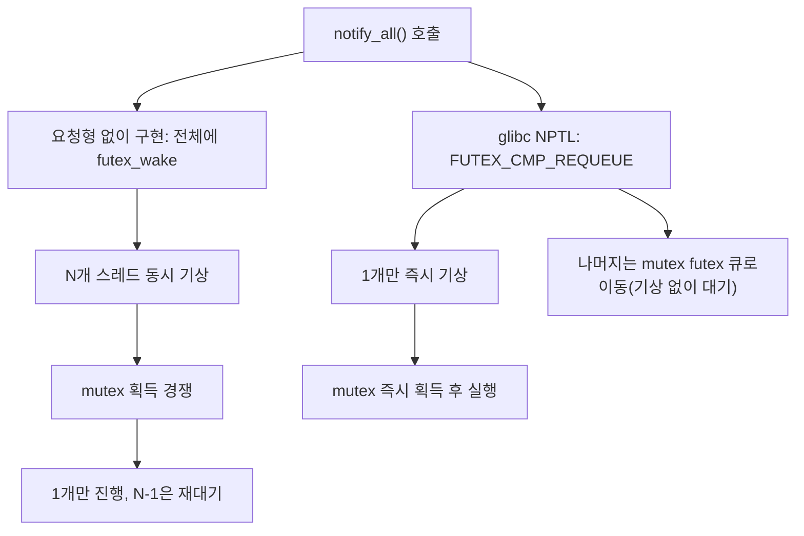

**Condition Variable 성능 패턴**이란 `std::condition_variable`이 대기·통지 지점에서 발생시키는 spurious wakeup(가짜 각성)과 thundering herd(다수 동시 기상) 비용의 근원을 이해하고, predicate 설계와 `notify_one`/`notify_all` 선택으로 불필요한 깨어남을 줄이며, 필요하면 C++20 `std::atomic::wait`/`notify` 같은 대안으로 전환할지 판단하는 것을 말합니다. 생산자-소비자 큐나 작업 대기열에서 CV는 가장 익숙한 동기화 지점이지만, 대기자가 많아질수록 notify 한 번의 비용이 커지고 p99 꼬리 지연을 흔드는 지배 요인이 되기 쉽습니다. 이 장은 그 비용이 "왜" 발생하는지를 커널·libc 구현 수준까지 짚어, 표면적인 "notify_one이 항상 낫다" 같은 규칙이 아니라 상황별 판단 근거를 세웁니다.

## 이 장을 읽기 전에

**전제 지식**: [01장: 동기화 비용 분석](/post/concurrency-optimization/synchronization-primitive-cost-analysis/)에서 다룬 mutex/atomic의 기본 비용 모델과, `std::unique_lock`·`std::mutex`의 사용법을 알고 있다고 가정합니다. C++20 `std::atomic`의 `wait`/`notify_one`/`notify_all`은 이 장에서 비교 대상으로만 다루며, 메모리 순서·ABA 문제를 포함한 전체 사용법은 [09장: C++20 Atomics 실전](/post/concurrency-optimization/cpp20-atomic-wait-notify/)에서 깊게 다룹니다.

**이 장의 깊이**: **중급**입니다. `condition_variable::wait`의 predicate 루프가 왜 필수인지부터, notify 선택이 만드는 실제 커널 동작(futex requeue) 차이, atomic wait/notify로 전환할 때의 트레이드오프까지 다룹니다. **다루지 않는 것**: `std::barrier`/`std::latch`의 고정 인원 동기화 지점 설계(→ [20장](/post/concurrency-optimization/cpp20-barrier-latch-synchronization-patterns/)), SPSC/MPMC 큐 자체의 lock-free 구현(→ [08장](/post/concurrency-optimization/spsc-mpmc-ring-buffer-queues/)), 스레드 풀의 작업 분배 정책(→ [10장](/post/concurrency-optimization/thread-pool-work-stealing-optimization/))입니다.

## 당신의 수준에 맞는 경로

| 수준 | 읽을 부분 | 핵심 목표 |
|------|---------|---------|
| **입문** | "Mesa Semantics와 spurious wakeup의 기원" ~ "wait()이 predicate 루프를 요구하는 이유" | spurious wakeup이 표준이 허용하는 정상 동작임을 이해 |
| **중급** | "안전한 wait 패턴" ~ "측정: notify 왕복 지연 벤치마킹" | 깨진 대기 패턴을 고치고 herd 비용을 직접 재현 |
| **실무 적용** | "흔한 오개념 교정" ~ "비판적 시각" | notify 선택·atomic wait 전환을 비용·위험 기준으로 판단 |

## Mesa Semantics와 spurious wakeup의 기원 (역사·배경)

조건 변수의 "신호를 받은 스레드가 즉시 실행을 이어받지 않고, 조건을 다시 검사해야 한다"는 계약은 1980년 Butler Lampson과 David Redell이 Xerox PARC의 Mesa 언어 모니터 구현 경험을 정리하며 확립한 설계 원칙에서 비롯됩니다. C.A.R. Hoare가 1974년에 제안한 모니터 모델은 신호(signal)를 받은 대기 스레드가 즉시 실행권을 넘겨받는 것을 보장했지만, 이는 구현이 까다롭고 스케줄링 유연성을 제한했습니다. Lampson과 Redell이 정리한 "Mesa semantics"는 대신 신호를 "깨어나도 좋다는 힌트"로만 취급해, 깨어난 스레드가 락을 다시 획득한 뒤 조건을 스스로 재확인하도록 요구합니다. 이 방식은 구현을 단순화하고 커널이 깨어난 순서·스케줄링을 자유롭게 최적화할 여지를 주는 대신, 호출자가 "신호 = 조건 충족"을 가정할 수 없게 만듭니다.

POSIX 스레드(pthreads, POSIX.1c, 1995)는 이 Mesa 계열 계약을 그대로 채택해 `pthread_cond_wait`가 "실제 조건이 참이 아니어도 깨어날 수 있다"는 spurious wakeup을 명시적으로 허용했고, C++11의 `std::condition_variable`은 이 POSIX 계약을 표준 라이브러리 차원에서 그대로 물려받았습니다. cppreference는 `wait`의 동작을 다음과 같이 정리합니다.

> "wait causes the current thread to block until the condition variable is notified or a spurious wakeup occurs." — [cppreference: std::condition_variable::wait](https://en.cppreference.com/w/cpp/thread/condition_variable/wait)

즉 spurious wakeup은 버그가 아니라 표준이 구현체에게 준 자유이며, 이 자유를 안전하게 쓰려면 호출자가 반드시 조건을 다시 검사하는 루프를 둬야 한다는 것이 이 장 전체의 출발점입니다.

## Condition Variable의 내부 동작과 비용

### wait()이 predicate 루프를 요구하는 이유

`cv.wait(lk)`는 개념적으로 "락을 원자적으로 풀고 블록한 뒤, 깨어나면 락을 다시 잡고 리턴"하는 세 단계로 이뤄집니다. 문제는 "깨어남"의 원인이 `notify_one`/`notify_all`만이 아니라는 점입니다. spurious wakeup 외에도, 여러 소비자가 같은 CV를 기다리는 구조에서는 notify가 도착했을 때 이미 다른 스레드가 먼저 락을 잡고 조건을 소비해버려 뒤늦게 깨어난 스레드 입장에서는 조건이 다시 거짓일 수 있습니다. 그래서 `wait`는 predicate를 받는 오버로드를 제공하며, 이는 `while (!pred()) wait(lk);`와 동일하게 동작합니다. `if`로 한 번만 검사하는 코드는 spurious wakeup이나 조건 재소비 상황에서 조건이 거짓인 채로 통과해버리는 정확성 버그를 만듭니다.

### 안전한 wait 패턴: 깨진 코드에서 검증까지

아래는 predicate 없이 상태를 락 밖에서 바꾸는 흔한 실수입니다. 두 가지 결함이 함께 있습니다: 상태 변경이 mutex 보호 밖에 있어 데이터 경쟁이 발생할 수 있고, `if`로 한 번만 검사해 spurious wakeup이나 조건 재소비를 대비하지 못합니다.

```cpp
#include <condition_variable>
#include <mutex>

std::mutex m;
std::condition_variable cv;
bool ready = false;

// 깨진 코드: mutex 밖에서 상태 변경 + if로 단발 검사
void producer_bad() {
  ready = true;              // (1) 데이터 경쟁: cv.wait의 재확인과 순서 보장 없음
  cv.notify_one();
}

void consumer_bad() {
  std::unique_lock<std::mutex> lk(m);
  if (!ready) cv.wait(lk);   // (2) spurious wakeup 시 ready 재검사 없이 통과
  // 여기 도달했을 때 ready가 false일 수 있음 → 잘못된 진행
}
```

원인은 두 가지입니다. (1) `ready = true`가 락 없이 실행되면 컴파일러·CPU의 메모리 재정렬 관점에서 `consumer_bad`가 관찰하는 시점이 보장되지 않아 lost wakeup(알림이 대기 시작 전에 도착해 유실되는 상황)이 발생할 수 있습니다. (2) `if`는 한 번만 확인하므로, spurious wakeup이나 여러 소비자가 경쟁하는 상황에서 조건이 거짓인 채 실행이 이어집니다. 올바른 구현은 상태 변경을 항상 락 아래에 두고, `wait`에 predicate를 넘겨 루프로 재확인합니다.

```cpp
#include <condition_variable>
#include <mutex>

std::mutex m;
std::condition_variable cv;
bool ready = false;

void producer_good() {
  {
    std::lock_guard<std::mutex> lk(m);   // 상태 변경은 항상 락 하에서
    ready = true;
  }
  cv.notify_one();  // notify 자체는 락 밖에서 호출해도 안전(오히려 권장되는 경우가 많음)
}

void consumer_good() {
  std::unique_lock<std::mutex> lk(m);
  cv.wait(lk, [] { return ready; });    // predicate 루프: spurious wakeup·재소비 모두 안전
  ready = false;
}
```

`producer_bad`/`consumer_bad`의 데이터 경쟁은 ThreadSanitizer로 잡아낼 수 있고, lost wakeup으로 인한 행(hang)은 짧은 타임아웃을 건 반복 스트레스 테스트로 재현할 수 있습니다.

```bash
g++ -O1 -g -fsanitize=thread -std=c++20 cv_race.cpp -lpthread -o cv_race_tsan
./cv_race_tsan
```

TSan은 `ready`에 대한 잠금 없는 읽기/쓰기를 `WARNING: ThreadSanitizer: data race` 리포트로 즉시 잡아내지만, lost wakeup 자체(신호가 유실되어 영원히 깨어나지 못하는 행)는 데이터 경쟁이 아니라 타이밍 문제이므로 TSan 리포트만으로는 드러나지 않을 수 있습니다. 행 여부는 `timeout 2 ./cv_race_tsan; echo $?`처럼 짧은 타임아웃을 걸고 수십~수백 회 반복 실행해 종료 코드 124(타임아웃)가 나오는지로 확인하는 것이 더 직접적입니다.

### Thundering Herd와 wait morphing

`notify_all`은 대기 중인 모든 스레드를 깨우지만, 다음에 진행할 수 있는 것은 mutex를 획득한 단 하나뿐입니다. 나머지는 깨어나 스케줄되고, mutex 획득에 실패해 다시 잠드는 낭비된 컨텍스트 스위치를 겪습니다 — 이것이 흔히 말하는 thundering herd입니다. 다만 이 비용은 "표준이 보장하는 동작"이 아니라 커널·libc 구현에 따라 달라지는 부분이 큽니다. 리눅스 glibc(NPTL)의 `pthread_cond_broadcast` 구현은 `FUTEX_CMP_REQUEUE`를 사용해 실제로는 단 하나의 스레드만 깨우고, 나머지 대기자는 잠든 채로 condition variable의 futex 큐에서 mutex의 futex 큐로 옮겨(requeue) 넣습니다. [futex(2) man page](https://man7.org/linux/man-pages/man2/futex.2.html)가 설명하듯, futex 자체는 경쟁이 없는 한 사용자 공간에서 원자적 명령만으로 처리되고 커널은 스레드가 실제로 블록해야 할 때만 개입합니다. 이렇게 requeue가 이뤄지면 나머지 스레드는 실제로 깨어나지 않고도 mutex 대기열에 줄을 서게 되어, 앞서 깨어난 스레드가 락을 놓을 때 커널이 다음 하나를 순서대로 깨웁니다. 이 기법을 흔히 "wait morphing"이라 부릅니다.



이 완화는 어디까지나 glibc·리눅스 커널의 구현 최적화이며, C++ 표준이나 POSIX가 요구하는 계약이 아닙니다. 다른 libc(musl 등)나 오래된 커널, Windows·macOS의 조건 변수 구현은 같은 최적화를 제공한다는 보장이 없으므로, "notify_all은 항상 이렇게 값싸다"고 이식성 있게 단정할 수 없습니다. 애플리케이션 설계 관점에서는 여전히 "정말 모든 대기자가 동시에 진행해야 하는가"를 먼저 묻고, 한 번에 하나만 처리하면 되는 생산자-소비자 큐라면 애초에 `notify_one`으로 깨울 스레드 수 자체를 줄이는 것이 커널 구현에 기대는 것보다 안전한 최적화입니다.

### 측정: notify 왕복 지연 벤치마킹

thundering herd나 notify 선택의 효과는 "느낄" 것이 아니라 직접 재현해 측정해야 합니다. 아래는 `notify_one` 왕복 지연(신호 후 대기 스레드가 predicate를 통과해 복귀하기까지)을 Google Benchmark로 감싸는 스켈레톤입니다. 벤치마크 루프 안의 busy-wait는 측정 대상이 아니라 두 스레드 간 왕복을 동기화하기 위한 간이 장치이므로, 정밀한 지연 분포(p50/p99)가 필요하면 `chrono::steady_clock` 타임스탬프를 원자적으로 교환하는 방식으로 바꿔야 합니다.

```cpp
#include <benchmark/benchmark.h>
#include <condition_variable>
#include <mutex>
#include <thread>

static void BM_CondVarNotifyOneRoundTrip(benchmark::State& state) {
  std::mutex m;
  std::condition_variable cv;
  bool ready = false, done = false;

  std::thread waiter([&] {
    std::unique_lock<std::mutex> lk(m);
    while (!done) {
      cv.wait(lk, [&] { return ready || done; });
      if (ready) ready = false;
    }
  });

  for (auto _ : state) {
    {
      std::lock_guard<std::mutex> lk(m);
      ready = true;
    }
    cv.notify_one();
    while (true) {
      std::lock_guard<std::mutex> lk(m);
      if (!ready) break;
    }
  }

  {
    std::lock_guard<std::mutex> lk(m);
    done = true;
  }
  cv.notify_one();
  waiter.join();
}
BENCHMARK(BM_CondVarNotifyOneRoundTrip)->UseRealTime();

BENCHMARK_MAIN();
```

`g++ -O2 -std=c++20 bench_cv.cpp -lbenchmark -lpthread -o bench_cv`(x86-64, GCC 13+, 리눅스 기준)로 빌드해 실행하면 한 왕복의 평균 지연을 얻을 수 있습니다. 대기자 수를 1개에서 여러 개로 늘려 `notify_all`로 바꿔 가며 같은 벤치마크를 반복하면, herd 비용이 대기자 수에 따라 어떻게 늘어나는지(또는 앞서 설명한 requeue 최적화 덕에 예상보다 완만한지)를 자신의 커널·libc 조합에서 직접 확인할 수 있습니다. 수치는 커널 버전, glibc 버전, 스레드 수, CPU 코어 배치에 따라 크게 달라지므로 "몇 배 빠르다" 같은 단정보다 이 스켈레톤으로 자신의 환경에서 재현하는 것이 중요합니다.

### atomic::wait/notify로의 이탈: 언제, 왜

C++20은 `std::atomic<T>`에 `wait`/`notify_one`/`notify_all`을 추가해, 별도의 mutex 없이 원자적 값 자체를 대기 조건으로 쓸 수 있게 했습니다. 리눅스에서는 이 연산들이 futex 위에 직접 구현되며, 32비트가 아닌 타입은 별도의 프록시 32비트 카운터를 통해 대기·통지를 중계합니다. [cppreference: std::atomic<T>::wait](https://en.cppreference.com/w/cpp/atomic/atomic/wait)는 이 형태의 변경 감지가 단순 폴링이나 순수 스핀락보다 대체로 더 효율적이라고 설명하며, `wait`는 대기 중인 값과 비교해 값이 바뀌었을 때만 리턴을 보장하도록 설계되어 있어(내부적으로 spurious 언블록이 있어도 재확인 후 리턴), 사용자 입장에서는 "거짓 반환은 없다"는 계약을 얻습니다. 다만 ABA 문제로 인해 `old`에서 다른 값으로 갔다가 다시 `old`로 돌아온 변화는 통지가 누락될 수 있다는 한계는 여전합니다.

```cpp
#include <atomic>
#include <thread>

std::atomic<int> state{0};

void producer() {
  state.store(1, std::memory_order_release);
  state.notify_one();   // mutex 없음: futex(리눅스) 또는 동등한 OS 대기 프리미티브 직접 사용
}

void consumer() {
  int seen = state.load(std::memory_order_acquire);
  while (seen == 0) {
    state.wait(seen, std::memory_order_acquire);  // seen과 다르면 즉시 리턴, 같으면 블록
    seen = state.load(std::memory_order_acquire);
  }
}
```

mutex와 lock을 아예 두지 않기 때문에 lock 경합·락 순서 문제 자체가 사라지지만, 그 대가로 여러 조건을 조합하거나("A이면서 B") 여러 소비자 중 정확히 하나만 깨워야 하는 복잡한 동기화 로직은 사용자가 직접 재구현해야 합니다. `condition_variable`은 이런 조합을 predicate 람다 하나로 표현할 수 있다는 점에서 여전히 표현력의 이점이 있습니다. atomic wait/notify의 메모리 순서·값 설계·ABA 대응은 [09장](/post/concurrency-optimization/cpp20-atomic-wait-notify/)에서 더 깊게 다룹니다.

## 흔한 오개념 교정

**"spurious wakeup은 드문 버그 상황이다"**: 표준과 POSIX 계약이 명시적으로 허용하는 정상 동작입니다. 발생 빈도가 낮다고 해서 predicate 루프를 생략해도 되는 것이 아니라, 발생하지 않는 환경에서 우연히 동작하던 코드가 다른 커널·libc 조합에서 깨질 수 있다는 뜻으로 받아들여야 합니다.

**"notify_all은 항상 notify_one보다 느리다"**: 앞서 본 것처럼 glibc의 futex requeue 최적화 덕에 실제 기상 스레드 수는 1개로 유지되는 경우가 많습니다. 반대로 "여러 대기자가 모두 진행해야 하는" 브로드캐스트 상황에서 `notify_one`을 쓰면 나머지 대기자가 영원히 깨어나지 않는 lost wakeup류의 정확성 버그가 생깁니다. notify 선택은 성능이 아니라 "몇 명이 진행해야 하는가"라는 의미론으로 먼저 결정하고, 그 다음에 비용을 측정해야 합니다.

**"notify는 반드시 락을 잡은 채로 호출해야 안전하다"**: 상태 변경 자체는 반드시 락 아래에서 해야 하지만, `notify_one`/`notify_all` 호출 자체는 락을 놓은 뒤에 해도 무방하며 오히려 권장되는 경우가 많습니다. 락을 쥔 채로 notify하면 깨어난 스레드가 즉시 같은 mutex 경합에 부딪히는 "hurry up and wait" 비용이 생길 수 있는 반면, 락을 놓은 뒤 notify하면 깨어난 스레드가 곧바로 락을 잡을 수 있습니다(단, glibc의 wait morphing처럼 요청형 재대기를 쓰는 구현에서는 이 차이가 상쇄될 수 있어 실측이 필요합니다).

## 판단 기준

| 상황 | 권장 | 비권장 |
|------|------|--------|
| 여러 대기자가 모두 진행해야 하는 브로드캐스트 | `notify_all` + predicate 루프 | `notify_one`(일부만 깨어나 lost wakeup) |
| 한 번에 한 소비자만 처리하는 생산자-소비자 큐 | `notify_one` | `notify_all`(불필요한 재대기 다수) |
| mutex 없이 단일 플래그·카운터만 대기 | `std::atomic::wait`/`notify`(09장) | mutex+cv로 감싸기(불필요한 락 왕복) |
| 여러 조건 조합·복잡한 predicate | `condition_variable` | 여러 atomic을 수작업으로 폴링 |
| 고정 인원이 동기화 지점에서 만나야 함 | `std::barrier`/`std::latch`(20장) | condition_variable로 직접 구현 |
| 수백 ns급의 매우 짧은 대기가 예상됨 | 짧은 스핀 후 블로킹 폴백(하이브리드) | 즉시 `wait()`로 블로킹(컨텍스트 전환 비용) |

## 비판적 시각: 한계와 트레이드오프

wait morphing 같은 herd 완화는 C++ 표준이나 POSIX가 보장하는 계약이 아니라 glibc·리눅스 커널의 구현 선택입니다. 다른 플랫폼·libc 조합에서 같은 최적화를 기대할 수 없으므로, "notify_all이 사실은 값싸다"는 결론을 이식성 있게 일반화하면 안 됩니다. Windows의 `SleepConditionVariableCS`/`SleepConditionVariableSRW`는 가능한 한 커널 모드 전환을 피하려 시도하지만 내부 스케줄링·우선순위 부스팅 방식이 리눅스와 다르므로, 크로스 플랫폼 서버라면 반드시 각 타깃에서 재측정해야 합니다. `std::condition_variable_any`는 임의의 Lockable을 지원하기 위해 GCC libstdc++ 구현 기준으로 내부에 `shared_ptr<mutex>`를 추가로 들고 있어, `std::unique_lock<std::mutex>` 전용인 `condition_variable`보다 오버헤드가 더 있습니다 — 커스텀 락 타입이 꼭 필요한 게 아니라면 `condition_variable`을 우선 고려할 이유입니다. 마지막으로, atomic wait/notify가 mutex+cv보다 항상 우월한 것도 아닙니다. lock 경합은 사라지지만 여러 조건의 조합, 디버거의 조건 변수 검사, 배포 중인 데드락 탐지 도구 같은 생태계 지원은 여전히 `condition_variable` 쪽이 두텁습니다. 두 프리미티브 모두 "표준적이고 검증된 것" 대 "락 없이 빠르지만 직접 검증해야 하는 것"이라는 트레이드오프 축 위에 있다고 보는 것이 정확합니다.

## 마무리

- spurious wakeup이 표준이 허용하는 정상 동작이며 predicate 루프가 왜 필수인지 설명할 수 있다.
- 상태 변경은 락 아래, notify 호출은 락 밖이라는 안전한 wait 패턴을 구현하고 ThreadSanitizer로 검증할 수 있다.
- thundering herd가 glibc의 futex requeue(wait morphing)로 부분 완화된다는 점과 그 이식성 한계를 설명할 수 있다.
- notify_one/notify_all 선택을 "몇 명이 진행해야 하는가"라는 의미론으로 먼저 결정하고, 비용은 직접 벤치마크로 재현해 확인할 수 있다.
- `condition_variable`과 `atomic::wait`/`notify` 중 무엇을 쓸지 표현력·비용·플랫폼 이식성 기준으로 판단할 수 있다.

**이전 장**: [실행 정책 병렬 알고리즘](/post/concurrency-optimization/parallel-algorithm-execution-policies/) (챕터 18)에서는 `std::execution::par`/`par_unseq` 같은 실행 정책이 표준 알고리즘 내부에서 스레드를 어떻게 나눠 쓰는지 다뤘습니다. 이 장의 `condition_variable`은 그런 병렬 실행이 끝나기를 기다리거나 작업을 넘겨주는 지점에서 가장 흔히 등장하는 동기화 지점입니다.

**다음 장에서는** 고정된 인원이 정확히 한 지점에서 만나야 하는 동기화 문제를 다룹니다. `condition_variable`로 barrier를 직접 구현하면 이 장에서 본 predicate 루프·notify_all 비용 문제가 그대로 반복되는데, C++20 `std::barrier`/`std::latch`는 이런 반복 동기화 지점 자체를 표준 프리미티브로 제공해 더 낮은 비용과 더 명확한 의미론을 얻습니다. → [C++20 Barrier/Latch 활용](/post/concurrency-optimization/cpp20-barrier-latch-synchronization-patterns/)
