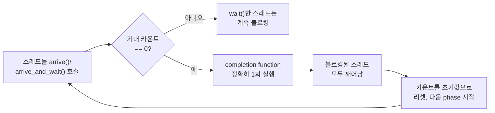

**C++20 Barrier/Latch**는 `std::barrier`와 `std::latch`라는 두 표준 동기화 프리미티브를 가리키며, 여러 스레드가 특정 지점까지 도달하기를 기다렸다가 함께 진행하는 "동기 지점(synchronization point)"을 표준 라이브러리 수준에서 제공합니다. 반복 시뮬레이션의 각 스텝마다 모든 워커가 결과를 합치고 다음 스텝으로 넘어가야 하거나, 스레드 풀을 띄운 뒤 모든 워커가 초기화를 마칠 때까지 메인 스레드가 기다려야 하는 상황은 실무에서 자주 등장하지만, 이를 매번 `mutex`와 `condition_variable`로 직접 구현하면 spurious wakeup·잘못된 락 순서·조건 재확인 누락 같은 실수가 반복되기 쉽습니다. `std::latch`는 한 번만 0으로 내려가는 카운터로 "N개가 끝날 때까지 기다림" 패턴을, `std::barrier`는 phase를 반복하는 재사용 가능한 동기 지점으로 "매 라운드마다 모두 모였다가 흩어짐" 패턴을 표준화해, 이 반복되는 동기화 로직을 검증된 구현에 위임할 수 있게 합니다.

## 이 장을 읽기 전에

**전제 지식**: [09장: C++20 Atomics 실전](/post/concurrency-optimization/cpp20-atomic-wait-notify/)에서 다룬 `atomic::wait`/`notify_one`/`notify_all`의 기본 개념과, [19장: Condition Variable 성능 패턴](/post/concurrency-optimization/condition-variable-performance-patterns/)에서 다룬 "블로킹 대기에는 커널 개입 비용이 있다"는 감각을 전제로 합니다. `std::thread`로 여러 스레드를 띄우고 `join`하는 정도의 경험이면 충분합니다.

**이 장의 깊이**: **중급**입니다. `std::barrier`와 `std::latch`의 API·내부 동작·표준 개정 이력을 다루고, 언제 `mutex`+`condition_variable` 대신 이들을 선택할지 판단 기준을 제시합니다. **다루지 않는 것**: `condition_variable` 자체의 spurious wakeup·성능 튜닝은 [19장](/post/concurrency-optimization/condition-variable-performance-patterns/)에서, `atomic::wait`/`notify`의 세부 구현과 futex 비교는 [09장](/post/concurrency-optimization/cpp20-atomic-wait-notify/)에서, 스레드 풀의 워크 스틸링 설계는 [10장](/post/concurrency-optimization/thread-pool-work-stealing-optimization/)에서 각각 다루므로 이 장은 barrier/latch 자체의 API·비용·설계 패턴에 집중합니다.

## 당신의 수준에 맞는 경로

| 수준 | 읽을 부분 | 핵심 목표 |
|------|---------|---------|
| **초보자** | "barrier·latch의 등장 배경" ~ "std::barrier: 재사용 가능한 동기 지점" | latch와 barrier가 어떤 문제를 표준화했는지, 둘의 근본적 차이를 이해 |
| **중급자** | "std::barrier: 재사용 가능한 동기 지점" ~ "비용 모델과 측정" | 내부 동작(phase, futex 기반 대기)과 완료 함수 설계·실행 스레드 규약을 이해 |
| **전문가** | "판단 기준" ~ "비판적 시각" | mutex/condition_variable 대비 선택 기준과 표준 보장의 한계·변천을 판단 |

## barrier·latch의 등장 배경

C++11은 `mutex`·`condition_variable`이라는 저수준 도구만 제공했고, "N개의 스레드가 모두 도착할 때까지 기다림" 같은 흔한 패턴은 매번 개발자가 카운터와 조건 변수를 직접 조합해 구현해야 했습니다. 이 반복 작업을 표준화하려는 시도는 David Olsen, Olivier Giroux, JF Bastien, Detlef Vollmann, Bryce Lelbach가 공동 제안한 [P1135: The C++20 Synchronization Library](https://www.open-std.org/jtc1/sc22/wg21/docs/papers/2019/p1135r6.html)로 결실을 맺었고, 2019년 7월 R6 개정판이 채택되어 `atomic::wait`/`notify`, `counting_semaphore`, `latch`, `barrier`가 한 묶음으로 C++20에 들어왔습니다. 제안서의 배경에는 HPC(고성능 컴퓨팅)·GPU 프로그래밍에서 흔히 쓰이던 fork-join 패턴이 있으며, 실제로 barrier의 완료 함수(completion function) 설계는 이후 NVIDIA의 하드웨어 barrier 가속 기능과 맞물려 다시 다뤄집니다.

barrier의 최초 명세는 "완료 함수는 반드시 barrier에 마지막으로 도착한 스레드에서 실행된다"고 강제했는데, 이는 GPU처럼 barrier 카운터를 메모리 컨트롤러 근처에서 하드웨어적으로 처리하는 구현에는 불필요한 제약이었습니다. 이를 완화한 [P2588R3: barrier's Phase Completion Guarantees](https://www.open-std.org/jtc1/sc22/wg21/docs/papers/2023/p2588r3.html)는 "NVIDIA GPU는 오랫동안 barrier 가속기를 제공해 왔다"는 점을 근거로 들며, 완료 함수가 반드시 마지막 도착 스레드가 아니라 "그 phase 동안 도착했거나 대기한 스레드 중 하나"에서 실행되도록 규약을 넓혔습니다. 이 변경은 결함 보고(DR)로 C++20에 소급 적용되었지만, 실제 컴파일러·표준 라이브러리가 이를 반영한 시점은 이후이므로(예: MSVC STL은 `__cpp_lib_barrier` 값을 `202302L`로 올리는 별도 구현을 완료한 뒤에야 지원), 크로스 플랫폼 코드에서 "완료 함수가 어느 스레드에서 실행되는가"를 가정하지 않는 것이 안전합니다.

## std::latch: 1회성 카운트다운

**`std::latch`**는 `std::ptrdiff_t` 타입의 하향 카운터로, 생성 시 지정한 값에서 시작해 `count_down()` 호출마다 감소하고 0에 도달하면 대기 중인 모든 스레드를 깨웁니다. 카운터를 늘리거나 리셋하는 방법이 없어서 "한 번 0에 도달하면 그것으로 끝"이라는 의미에서 **단일 사용(single-use) barrier**로 취급되며, 이 점이 재사용 가능한 `std::barrier`와의 가장 근본적인 차이입니다. 멤버 함수는 네 개뿐입니다: `count_down(n = 1)`은 블로킹 없이 카운터를 n만큼 줄이고, `try_wait()`은 카운터가 0인지 논블로킹으로 검사하고, `wait()`은 카운터가 0이 될 때까지 블로킹하며, `arrive_and_wait()`은 `count_down(1)`과 `wait()`을 한 번에 수행하는 편의 함수입니다.

이 인터페이스가 유용한 이유는 "카운트를 내리는 주체"와 "0이 되기를 기다리는 주체"가 반드시 같은 스레드일 필요가 없다는 데 있습니다. 예를 들어 N개의 워커 스레드가 각자 초기화를 마치고 `count_down()`만 호출한 뒤 자기 일을 계속하고, 메인 스레드 하나만 `wait()`으로 "모든 초기화 완료"를 기다리는 구조를 자연스럽게 표현할 수 있습니다. 아래 예제는 워커들이 초기화를 마쳤음을 `latch`로 알리고, 메인 스레드는 그 신호를 기다렸다가 다음 단계로 진행하는 전형적인 "시작 관문(start gate)" 패턴입니다.

```cpp
#include <latch>
#include <thread>
#include <vector>
#include <iostream>

void run_startup_gate(int worker_count) {
  std::latch init_done(worker_count);  // worker_count개가 count_down 해야 0

  std::vector<std::jthread> workers;
  for (int i = 0; i < worker_count; ++i) {
    workers.emplace_back([&init_done] {
      // 각 워커의 초기화 작업(캐시 워밍업, 연결 수립 등)
      init_done.count_down();  // 블로킹 없이 카운터만 감소
      // 이후 정상 작업 루프로 진입...
    });
  }

  init_done.wait();  // 모든 워커의 초기화가 끝날 때까지 메인만 블로킹
  std::cout << "all workers initialized, proceeding\n";
}
```

`count_down()`이 카운터를 0 미만으로 내리려 하거나, 이미 0에 도달한 `latch`에 다시 `count_down()`을 호출하는 것은 정의되지 않은 동작(UB)입니다. 실무에서는 "예상보다 많은 스레드가 참여하거나, 예외 경로에서 `count_down()`을 중복 호출하지 않는지"를 리뷰 시점에 반드시 확인해야 하며, 참여자 수가 실행 중에 변하는 워크로드라면 애초에 `latch`가 아니라 `barrier`의 `arrive_and_drop()`(뒤에서 다룸)이나 원자적 카운터 조합을 검토해야 합니다.

## std::barrier: 재사용 가능한 동기 지점

**`std::barrier`**는 `latch`와 달리 한 번 모두가 도착해 흩어진 뒤에도 같은 객체를 다시 사용할 수 있는 동기 지점입니다. 이 재사용을 가능하게 하는 핵심 개념이 **phase**입니다. barrier의 수명은 하나 이상의 phase로 나뉘고, 각 phase는 "기대 카운트가 0이 될 때까지 도착 대기 → 완료 함수 실행 → 카운트를 초기값으로 리셋하고 다음 phase 시작"이라는 세 단계를 반복합니다. `latch`가 카운트다운 한 번으로 끝나는 것과 달리, `barrier`는 이 세 단계를 계속 순환하기 때문에 "N개 스레드가 반복해서 만나는 지점"을 표현할 수 있습니다.

barrier의 생성자는 참여 스레드 수와 함께 **completion function**(선택적)을 받습니다. 이 함수는 매 phase의 기대 카운트가 0에 도달하는 순간 정확히 한 번 호출되며, phase에 참여한 스레드 중 하나에서 실행됩니다(앞서 다룬 P2588R3 완화 이전에는 "마지막으로 도착한 스레드"로 한정되었습니다). 완료 함수 안에서는 다른 스레드들이 아직 대기 중이므로 락 없이 phase 사이의 공유 상태(예: 이중 버퍼 스왑, 통계 집계)를 안전하게 갱신할 수 있다는 것이 이 설계의 실질적 이점입니다. 다만 완료 함수는 `noexcept`로 호출 가능해야 한다는 제약이 있어 예외를 던지는 로직은 barrier 바깥에서 처리해야 합니다.



아래는 barrier의 전형적인 활용인 "반복 시뮬레이션의 매 스텝마다 결과 버퍼를 스왑"하는 패턴입니다. 완료 함수가 버퍼 포인터를 교체하므로, 각 워커는 다음 phase에서 자연스럽게 갱신된 버퍼를 읽게 됩니다.

```cpp
#include <barrier>
#include <thread>
#include <stop_token>
#include <vector>
#include <atomic>

void run_simulation_steps(int worker_count, int step_count) {
  std::atomic<int> current_buffer{0};  // 완료 함수가 phase마다 뒤집음

  auto on_phase_complete = [&current_buffer]() noexcept {
    // 이 시점에는 이번 phase의 모든 워커가 쓰기를 끝낸 상태이므로
    // 락 없이 버퍼 인덱스를 스왑해도 안전함
    current_buffer.store(1 - current_buffer.load(std::memory_order_relaxed),
                          std::memory_order_relaxed);
  };

  std::barrier sync_point(worker_count, on_phase_complete);

  std::vector<std::jthread> workers;
  for (int id = 0; id < worker_count; ++id) {
    workers.emplace_back([&sync_point, step_count](std::stop_token st) {
      for (int step = 0; step < step_count && !st.stop_requested(); ++step) {
        // 이번 phase의 계산 작업 (워커 몫의 데이터 처리)...
        sync_point.arrive_and_wait();  // 모두 모일 때까지 대기 후 다음 phase로
      }
    });
  }
}
```

참여 스레드 수가 실행 중에 줄어드는 경우(예: 일부 워커가 조기 종료)를 위해 barrier는 **`arrive_and_drop()`**을 제공합니다. 이 함수는 현재 phase의 기대 카운트뿐 아니라 **다음 phase부터의 초기 기대 카운트도 함께 줄여서**, 그 스레드가 다시 참여하지 않아도 이후 phase가 영원히 그 스레드를 기다리지 않도록 합니다. 반대로 barrier는 참여자 수를 늘리는 방법을 제공하지 않으므로, 워커가 동적으로 추가되는 워크로드에는 barrier 대신 별도의 카운터·세대(generation) 설계가 필요합니다.

## 흔한 오개념

<strong>"barrier/latch는 mutex+condition_variable보다 항상 빠르다"</strong>는 사실이 아닙니다. 두 프리미티브 모두 결국 내부적으로 대기(wait)가 필요하며, libstdc++는 Linux에서 futex 기반 `atomic::wait`/`notify`([2020년 11월 GCC 패치](https://gcc.gnu.org/pipermail/gcc-patches/2020-November/560499.html)로 barrier 지원이 추가되었고 GCC 11부터 배포)를 사용해 스핀 없이 커널 대기로 전환하는 구조이지만, 이는 "잘 튜닝된 condition_variable 구현"과 근본적으로 다른 비용 구조가 아니라 **코드 작성 실수를 줄여 주는 표준화된 인터페이스**라는 데 더 큰 가치가 있습니다. 실제 이득은 참여 스레드 수·경합 패턴·플랫폼에 따라 달라지므로 아래 벤치마크 절의 방법으로 직접 재현해 확인해야 합니다.

<strong>"barrier의 completion function은 각 스레드에서 한 번씩, 즉 N번 실행된다"</strong>도 흔한 오해입니다. completion function은 phase당 **정확히 한 번**, 참여한 스레드 중 하나에서 실행됩니다. 나머지 스레드들은 그 실행이 끝나기를 블로킹 대기할 뿐 completion function 코드를 직접 실행하지 않습니다. 이를 "각 스레드가 자기 몫의 후처리를 completion function 안에서 수행한다"고 잘못 설계하면 그 로직은 한 스레드분만 실행되고 나머지 스레드의 몫은 누락됩니다.

**"latch는 barrier처럼 재사용할 수 있다"** 역시 오개념입니다. `latch`의 카운터는 0에 도달한 뒤 다시 올리거나 리셋할 방법이 표준에 없으므로, 같은 `latch` 객체로 두 번째 라운드의 동기화를 시도하면 `wait()`이 즉시 반환하거나(이미 0이므로) `count_down()`이 UB를 일으킵니다. 반복되는 라운드 동기화가 필요하면 처음부터 `barrier`를 선택하거나, 라운드마다 새 `latch`를 생성해야 합니다.

## 비용 모델과 측정

barrier/latch의 실제 비용은 "대기 중인 스레드를 어떻게 재우고 깨우는가"에 좌우됩니다. Linux의 libstdc++ 구현은 `atomic::wait`/`notify`를 통해 futex 시스템 콜로 스레드를 재우므로, 경합이 없을 때(마지막 도착 스레드가 곧바로 완료 함수를 실행하고 나머지가 이미 대기 중일 때)는 스핀 없이 필요한 만큼만 커널을 호출합니다. 반면 스레드 수가 많고 phase가 매우 짧게 반복되는 워크로드에서는 매 phase마다 반복되는 futex wake/wait 왕복 비용이 누적되어 지배적인 비용이 될 수 있으므로, "phase당 작업량이 동기화 비용보다 충분히 큰가"를 먼저 확인하는 것이 barrier 도입의 전제 조건입니다.

**"측정/정량"을 표방하려면 실행 가능한 벤치마크가 있어야 합니다.** 아래는 Google Benchmark로 `std::barrier` 기반 반복 동기화와, 동일한 역할을 하는 손수 짠 `mutex`+`condition_variable` 기반 배리어를 같은 조건(스레드 수, phase 수, phase당 no-op 작업량)에서 비교하는 스켈레톤입니다. `g++ -O2 -std=c++20 bench.cpp -lbenchmark -lpthread -lgtest`(또는 `-lbenchmark_main`)로 빌드하며, 실제 배율은 x86-64/ARM64, 커널 버전, 스레드 수에 따라 달라지므로 반드시 대상 플랫폼에서 직접 실행해 확인해야 합니다.

```cpp
#include <benchmark/benchmark.h>
#include <barrier>
#include <condition_variable>
#include <mutex>
#include <thread>
#include <vector>

static void BM_StdBarrierRounds(benchmark::State& state) {
  const int threads = static_cast<int>(state.range(0));
  for (auto _ : state) {
    std::barrier<> sync_point(threads);
    std::vector<std::thread> workers;
    for (int i = 0; i < threads; ++i) {
      workers.emplace_back([&sync_point] {
        for (int round = 0; round < 100; ++round) sync_point.arrive_and_wait();
      });
    }
    for (auto& w : workers) w.join();
  }
}
BENCHMARK(BM_StdBarrierRounds)->Arg(4)->Arg(8)->Arg(16);
// 비교 대상: 손수 짠 mutex+condition_variable 배리어 (같은 100라운드 반복)
struct CvBarrier {
  std::mutex m;
  std::condition_variable cv;
  int expected, count = 0, generation = 0;
  explicit CvBarrier(int n) : expected(n) {}
  void arrive_and_wait() {
    std::unique_lock lk(m);
    int gen = generation;
    if (++count == expected) { generation++; count = 0; cv.notify_all(); }
    else cv.wait(lk, [&] { return gen != generation; });
  }
};
static void BM_CvBarrierRounds(benchmark::State& state) {
  const int threads = static_cast<int>(state.range(0));
  for (auto _ : state) {
    CvBarrier sync_point(threads);
    std::vector<std::thread> workers;
    for (int i = 0; i < threads; ++i) {
      workers.emplace_back([&sync_point] {
        for (int round = 0; round < 100; ++round) sync_point.arrive_and_wait();
      });
    }
    for (auto& w : workers) w.join();
  }
}
BENCHMARK(BM_CvBarrierRounds)->Arg(4)->Arg(8)->Arg(16);
BENCHMARK_MAIN();
```

이 스켈레톤은 절대 수치를 주장하지 않습니다. 스레드 수를 늘려 가며 두 구현의 라운드당 비용 곡선을 비교하고, `perf stat`으로 컨텍스트 스위치·futex 호출 횟수를 함께 관찰하면 "표준 barrier가 실제로 더 적은 시스템 콜을 만드는지"를 워크로드별로 검증할 수 있습니다. 동시성 코드이므로 이 벤치마크와 별개로 `-fsanitize=thread`(ThreadSanitizer)로 실행해 데이터 레이스나 의도치 않은 동기화 누락이 없는지 반드시 별도 확인해야 합니다.

## 판단 기준

| 상황 | 권장 | 비권장 |
|------|------|--------|
| N개 스레드 초기화 완료를 한 번만 기다림 | `latch` | 매번 새 `condition_variable`+수동 카운터 |
| 반복 시뮬레이션의 매 스텝마다 전원 동기화 | `barrier` (완료 함수로 버퍼 스왑 등 처리) | 매 라운드 `latch`를 새로 생성 |
| 참여자 수가 중간에 줄어들 가능성 | `barrier` + `arrive_and_drop()` | 고정 카운트 `latch`·`barrier` |
| 타임아웃이 있는 대기가 필요 | `condition_variable::wait_for` ([19장](/post/concurrency-optimization/condition-variable-performance-patterns/)) | `latch`/`barrier` (타임아웃 오버로드 없음) |
| 완료 시 임의 조건 재검사·복잡한 predicate 필요 | `condition_variable` | `latch`/`barrier`의 단순 카운트 모델 |
| 스레드 취소(`stop_token`)와 결합 필요 | 대기 루프에서 `stop_token` 폴링 + `barrier`/`latch` 조합 | `barrier`/`latch` 단독(내장 취소 없음) |

### 자주 하는 실수

- **이미 0에 도달한 `latch`에 `count_down()`을 다시 호출**: UB. 라운드 재사용이 필요하면 `barrier`를 쓰거나 라운드마다 `latch`를 새로 만든다.
- **completion function 안에서 각 스레드별 후처리를 기대**: 완료 함수는 phase당 한 번만 실행된다. 스레드별 처리는 `arrive_and_wait()` 앞뒤의 워커 코드에 둔다.
- **완료 함수 안에서 예외를 던짐**: `CompletionFunction`은 `is_nothrow_invocable`이어야 하므로 예외를 던지면 프로그램이 종료된다. 실패는 상태 플래그로 남기고 barrier 바깥에서 처리한다.
- **동적으로 늘어나는 스레드 수를 barrier 하나로 처리하려 함**: barrier는 카운트를 늘리는 API가 없다. 참여자가 늘어나는 설계는 별도 세대 카운터나 재구성 가능한 동기화 구조로 다시 설계한다.

## 비판적 시각: 한계와 트레이드오프

`std::latch`와 `std::barrier`는 "표준화된 카운트다운/동기 지점"이라는 좁은 문제를 잘 풀지만, 그만큼 기능이 제한적입니다. 둘 다 **타임아웃이 있는 대기를 지원하지 않아서**, "일정 시간 내에 모이지 않으면 포기"하는 패턴은 이들만으로 구현할 수 없고 `condition_variable::wait_for`나 별도 워치독 스레드를 조합해야 합니다. `std::jthread`의 `stop_token`과도 자동으로 연동되지 않으므로, 취소 가능한 대기가 필요하면 barrier/latch의 블로킹 `wait()` 대신 `try_wait()`을 폴링하거나 별도의 취소 신호 경로를 설계해야 하며, 이는 순수 블로킹 대기보다 CPU 비용이 늘어나는 트레이드오프를 동반합니다.

completion function의 실행 스레드 보장이 P2588R3로 완화된 것은 하드웨어 가속을 여는 합리적인 결정이지만, 동시에 "완료 함수가 어느 스레드에서 실행될지 코드로 예측할 수 없다"는 이식성 제약을 명시적으로 드러낸 것이기도 합니다. 완료 함수에 스레드 로컬 상태를 읽고 쓰는 코드를 넣으면 구현마다 다른 스레드에서 실행되어 플랫폼 간 동작이 달라질 위험이 있으므로, 완료 함수는 어떤 스레드에서 실행되어도 안전한 순수 로직으로 한정하는 것이 안전합니다. 마지막으로 `arrival_token`(지연된 도착을 표현하는 이동 전용 객체)이나 phase 리셋 로직 자체가 무료는 아니므로, 아주 미세한 마이크로초 단위 핫패스에서는 표준 barrier보다 워크로드에 맞춰 손으로 짠 원자적 카운터가 더 나을 수 있다는 점도 도입 전 벤치마크로 확인해야 합니다.

## 마무리

- [ ] `std::latch`가 단일 사용 카운트다운이고 `std::barrier`가 phase를 반복하는 재사용 가능한 동기 지점이라는 차이를 설명할 수 있다.
- [ ] barrier의 phase 세 단계(카운트 감소 → 완료 함수 1회 실행 → 리셋)와 completion function의 실행 스레드 규약(및 P2588R3의 완화)을 설명할 수 있다.
- [ ] `arrive`/`wait`/`arrive_and_wait`/`arrive_and_drop`과 `count_down`/`try_wait`의 차이를 구분해 적절히 사용할 수 있다.
- [ ] barrier/latch가 항상 mutex+condition_variable보다 빠르다는 오해를 교정하고, 벤치마크로 실제 비용을 검증할 수 있다.
- [ ] 타임아웃·취소·동적 참여자 수처럼 barrier/latch만으로 풀 수 없는 요구사항을 식별하고 대안을 선택할 수 있다.

**이전 장**: [Condition Variable 성능 패턴](/post/concurrency-optimization/condition-variable-performance-patterns/) (19장)에서는 `condition_variable`의 spurious wakeup과 대안을 다뤘습니다. 이 장의 표준화된 phase 모델과 대비해 보면, 언제 저수준 조건 변수를 직접 다뤄야 하고 언제 barrier/latch에 위임할 수 있는지가 더 분명해집니다.

**다음 장에서는** thread-per-core 아키텍처와 io_uring 연계를 다룹니다. 스레드마다 전용 코어와 전용 이벤트 루프를 할당해 락 자체를 생략하는 설계 철학은, 지금까지 다룬 mutex·condition_variable·barrier·latch 같은 "공유 후 동기화" 전략과 대비되는 또 다른 극단입니다.

→ [Thread-per-core 아키텍처와 io_uring 연계](/post/concurrency-optimization/thread-per-core-io-uring-single-issuer/) (21장)
