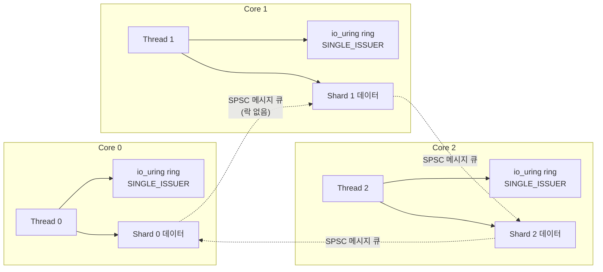

**Thread-per-core 아키텍처**란 CPU 코어 하나에 스레드 하나를 고정 배치하고, 그 스레드가 자신의 코어에 속한 데이터·연결·I/O 링을 독점적으로 소유하게 만들어 락 없이 동작시키는 서버 설계 방식을 말합니다. 이 장은 이 아키텍처와 Linux의 **io_uring**이 만나는 지점, 특히 **IORING_SETUP_SINGLE_ISSUER** 플래그가 커널 내부 락을 생략시켜 제출 경로 비용을 줄이는 원리를 다룹니다. 스레드 풀에 작업을 던지고 뮤텍스로 큐를 보호하는 전통적 설계는 코어 수가 늘어날수록 락 경합과 캐시 라인 이동이 처리량을 갉아먹는데, thread-per-core는 애초에 "공유"를 설계에서 빼버려 이 문제 자체를 회피합니다. 이 장이 이 트랙의 마지막 챕터인 이유도 여기 있습니다 — 동기화 비용 분석(01장)부터 시작해 lock-free(05–07장), 큐(08장), 스레드 풀(10장)까지 쌓아온 판단 기준을 "락을 아예 두지 않는 설계"라는 하나의 아키텍처로 수렴시켜 보는 자리이기 때문입니다.

## 이 장을 읽기 전에

이 장은 [01장: 동기화 비용 정량 분석](/post/concurrency-optimization/synchronization-primitive-cost-analysis/)에서 다룬 "락 경합이 지연시간의 지배항이 되는 이유"와, [08장: SPSC/MPMC 큐와 링버퍼](/post/concurrency-optimization/spsc-mpmc-ring-buffer-queues/)에서 다룬 "스레드 간 메시지 전달 큐"를 전제로 합니다. [10장: 스레드 풀 최적화와 워크 스틸링](/post/concurrency-optimization/thread-pool-work-stealing-optimization/)에서 다룬 공유 큐 기반 스레드 풀과 이 장의 thread-per-core를 대비해서 읽으면 설계 차이가 선명해집니다.

**이 장의 깊이**: io_uring 자체의 API 전체(SQE/CQE 타입, 등록 파일·버퍼, 링크 체인 등)나 리눅스 커널 I/O 스택 내부 구현은 다루지 않습니다. 이 장이 다루는 것은 (1) thread-per-core/shared-nothing 설계 원리, (2) `IORING_SETUP_SINGLE_ISSUER`가 락을 생략할 수 있는 이유와 전제 조건, (3) 언제 이 아키텍처를 선택하고 언제 피해야 하는가입니다. CPU affinity·NUMA 핀닝의 구체적 API는 [Tr.06: CPU Pinning/Affinity 전략](/post/os-optimization/cpu-pinning-affinity-strategy/)에 위임합니다. io_uring은 Linux 전용 인터페이스이므로 이 장의 코드와 커널 동작 설명은 Linux(커널 6.0 이상)를 전제로 합니다.

## 당신의 수준에 맞는 경로

| 수준 | 읽을 부분 | 핵심 목표 |
|------|---------|---------|
| **중급자** | "역사와 배경" ~ "thread-per-core의 핵심 원리" | 왜 공유를 없애는 설계가 락 경합보다 유리한지 이해 |
| **고급자** | "io_uring과 SINGLE_ISSUER" ~ "Apache Iggy 사례" | 커널 락 생략의 전제 조건과 실제 마이그레이션 성과 파악 |
| **전문가** | "판단 기준" ~ "비판적 시각" | 이 아키텍처를 자신의 워크로드에 도입할지 판단 |

---

## 역사와 배경

**io_uring**은 2019년 Jens Axboe가 설계해 Linux 커널 5.1에 병합된 비동기 I/O 인터페이스입니다. 이전의 Linux AIO(`libaio`)가 버퍼링되지 않은 파일 I/O 일부에만 동작하고 사용법이 까다로웠던 것과 달리, io_uring은 커널과 사용자 공간이 공유하는 두 개의 링 버퍼(제출 큐 SQ, 완료 큐 CQ)를 통해 시스템 콜 자체를 건너뛸 수 있게 설계됐습니다. 이후 io_uring은 파일 I/O뿐 아니라 소켓·네트워크 I/O까지 포괄하는 범용 비동기 계층으로 확장됐고, `IORING_SETUP_SQPOLL`(커널 폴링 스레드가 제출을 대신 처리해 `io_uring_enter` 호출 자체를 생략), `IORING_SETUP_SINGLE_ISSUER`(커널 6.0, 2022년), `IORING_SETUP_DEFER_TASKRUN`(커널 6.1)처럼 특정 사용 패턴을 가정하고 내부 동기화를 줄이는 플래그가 누적되어 왔습니다.

**Thread-per-core / shared-nothing** 설계는 io_uring보다 먼저 자리 잡은 개념입니다. ScyllaDB의 기반 프레임워크인 **Seastar**(Avi Kivity·Nadav Har'El 등이 2014년 말 개발해 2015년 2월 공개)가 이 모델을 C++로 구현해 "코어마다 애플리케이션 스레드 하나, 스레드 간에는 메모리를 공유하지 않고 메시지만 주고받는다"는 원칙을 정립했고, 이후 Redpanda·Ceph Crimson 등이 같은 원칙을 채택했습니다. io_uring의 `SINGLE_ISSUER` 계열 최적화는 이 아키텍처와 특히 잘 맞습니다 — thread-per-core 설계는 애초에 코어마다 io_uring 인스턴스 하나, 제출자 하나를 두는 구조이므로 커널이 요구하는 "단일 제출 스레드" 전제를 자연스럽게 만족시키기 때문입니다.

## thread-per-core의 핵심 원리

전통적인 서버 설계는 커넥션·요청을 스레드 풀에 무작위로 분배하고, 공유 자료구조(캐시, 커넥션 테이블, 큐)를 뮤텍스나 원자적 연산으로 보호합니다. 코어 수가 늘어나면 이 공유 자료구조에 대한 경합도 함께 늘어나고, [03장: False Sharing 탐지와 회피](/post/concurrency-optimization/false-sharing-detection-avoidance/)에서 다룬 캐시 라인 핑퐁까지 겹치면 코어를 추가해도 처리량이 기대만큼 늘지 않는 지점에 도달합니다. Thread-per-core는 이 문제를 "해결"하는 대신 "회피"합니다. 데이터(커넥션, 파티션, 캐시 엔트리)를 해시 등의 규칙으로 코어 수만큼 **샤드(shard)** 로 분할하고, 각 코어는 자신의 샤드만 단독으로 소유해 락 없이 접근합니다. 다른 샤드의 데이터가 필요하면 공유 메모리에 접근하는 대신 [08장](/post/concurrency-optimization/spsc-mpmc-ring-buffer-queues/)에서 다룬 SPSC 큐 형태의 **메시지 패싱**으로 요청을 보냅니다.

이 원칙의 핵심은 "락이 없다"가 아니라 "공유가 없어서 락이 필요 없다"는 인과 관계입니다. 스레드 풀 기반 설계에서 락을 없애려면 lock-free 자료구조([05–06장](/post/concurrency-optimization/lock-free-design-fundamentals/))처럼 정교한 동시성 알고리즘이 필요하지만, thread-per-core는 애초에 여러 스레드가 같은 메모리를 동시에 건드릴 상황 자체를 설계에서 제거합니다. 대가는 명확합니다 — 샤드 간 통신은 메시지 큐를 거치므로 지연이 생기고, 샤드 경계를 넘나드는 작업(예: 여러 파티션에 걸친 트랜잭션)은 설계가 까다로워지며, 코어 간 부하가 균등하지 않으면(하나의 샤드에 핫키가 몰리면) 그 코어만 병목이 되어도 다른 코어로 작업을 옮기기 어렵습니다.

## io_uring과 SINGLE_ISSUER: 커널 락을 생략하는 조건

io_uring 인스턴스는 기본적으로 `uring_lock`이라는 뮤텍스로 제출 큐 조작과 태스크 워크(task work) 처리 경로를 보호합니다. 여러 스레드가 하나의 링에 동시에 SQE(Submission Queue Entry)를 밀어 넣을 수 있다고 가정하기 때문에, 커널은 매 제출마다 이 락을 잡았다 풀어야 합니다. `IORING_SETUP_SINGLE_ISSUER` 플래그는 "이 링에는 오직 하나의 태스크만 제출한다"는 것을 커널에 알리는 힌트이며, [man7 io_uring_setup(2)](https://man7.org/linux/man-pages/man2/io_uring_setup.2.html) 문서는 이를 "커널 내부 최적화에 사용되는 힌트"로 설명하고 커널이 이 규칙을 강제해 위반 시 `-EEXIST`로 요청을 실패시킨다고 명시합니다. 커널 6.0에서 이 플래그가 추가된 뒤에도 초기에는 `IORING_SETUP_DEFER_TASKRUN`(커널 6.1, 태스크 워크 처리를 시스템 콜 반환 시점이 아니라 `IORING_ENTER_GETEVENTS`를 지정한 `io_uring_enter` 호출 시점까지 미루는 플래그)의 전제 조건 역할이 중심이었고, `uring_lock` 자체를 생략하는 별도의 성능 이득은 없었습니다.

2025년 말–2026년 초 커널 메일링 리스트에는 Caleb Sander Mateos가 제출한 "io_uring: avoid uring_lock for IORING_SETUP_SINGLE_ISSUER" 패치 시리즈가 논의되었습니다. [LWN.net의 요약](https://lwn.net/Articles/1050662/)에 따르면 이 패치는 제출 태스크가 이미 확정된 단일 제출자 링에서 `uring_lock` 뮤텍스 획득·해제 자체를 생략해 제출 경로의 오버헤드를 줄이는 것을 목표로 하며, `IORING_SETUP_SQPOLL`(커널 폴링 스레드가 제출을 대신하는 모드)과 `IORING_SETUP_R_DISABLED`(링 생성 후 활성화 이전 구간에서 제출 태스크가 아직 확정되지 않은 상태)가 겹치는 경계 조건을 별도로 처리합니다. 이 요약이 다룬 시점은 2025년 12월 v5였으며, 이후에도 패치는 계속 갱신되어(2025-12-17 v6, 2026-01-05 v7, 2026-01-18에는 syzbot CI 회귀 보고에 대응하는 후속 논의) 버전이 계속 바뀌었습니다. 따라서 특정 배포판의 안정 커널에 이미 포함되어 있는지는 사용 중인 커널의 변경 로그로 직접 확인해야 합니다. 이 세부사항은 커널 버전에 따라 달라지는 **구현 정의** 영역이라는 점을 유념하십시오. 다만 원리 자체는 명확합니다 — "제출자가 하나뿐"이라는 사실이 이미 참이라면, 그 사실을 커널에 알려주는 것만으로 불필요한 상호 배제 비용을 없앨 수 있다는 것이 이 최적화 계열의 공통 논리입니다.

이 원리는 thread-per-core와 직접 맞물립니다. 코어마다 io_uring 링을 하나씩 두고 그 코어의 스레드만 제출하게 만들면, `SINGLE_ISSUER` 힌트가 요구하는 조건을 아키텍처 자체가 이미 만족시킵니다. 반대로 여러 스레드가 자유롭게 같은 링에 제출하는 전통적 스레드 풀 설계에서는 이 최적화를 쓸 수 없고, 애플리케이션 계층에서 별도의 뮤텍스나 링 풀로 직접 직렬화해야 합니다.

```cpp
// per_core_ring.cpp — 코어별 io_uring 링을 SINGLE_ISSUER로 여는 골격
// Linux 6.0 이상, liburing 필요: g++ -std=c++20 per_core_ring.cpp -luring -o per_core_ring
#include <liburing.h>
#include <cstdio>
#include <cstring>
#include <stdexcept>

// 코어 하나에 바인딩된 스레드가 소유하는 io_uring 인스턴스.
// 이 스레드 외에는 어떤 스레드도 이 ring에 sqe를 제출하지 않는다는 것이
// 아키텍처(샤딩·핀닝) 수준에서 보장되어야 SINGLE_ISSUER 힌트가 유효하다.
struct PerCoreRing {
  io_uring ring{};

  explicit PerCoreRing(unsigned queue_depth) {
    io_uring_params params{};
    params.flags = IORING_SETUP_SINGLE_ISSUER | IORING_SETUP_COOP_TASKRUN;
    if (io_uring_queue_init_params(queue_depth, &ring, &params) < 0) {
      throw std::runtime_error("io_uring_queue_init_params failed");
    }
  }

  ~PerCoreRing() { io_uring_queue_exit(&ring); }

  // 복사/이동 시 소유권이 꼬이면 SINGLE_ISSUER 전제가 깨지므로 명시적으로 금지한다.
  PerCoreRing(const PerCoreRing&) = delete;
  PerCoreRing& operator=(const PerCoreRing&) = delete;
};
```

`IORING_SETUP_COOP_TASKRUN`은 태스크 워크 처리 시 불필요한 IPI(inter-processor interrupt)를 줄이는 보조 플래그로, `SINGLE_ISSUER`와 함께 쓰이는 경우가 흔합니다. 위 골격에서 중요한 점은 코드 자체가 짧다는 것이 아니라 **"이 링은 이 스레드만 건드린다"는 불변식을 프로세스 구조로 강제**해야 한다는 것입니다 — 이 불변식이 깨지면(예: 다른 스레드가 실수로 같은 `ring` 참조로 제출하면) 커널은 `-EEXIST`로 요청을 거부하거나, 애플리케이션 설계에 따라 조용히 잘못된 동작으로 이어질 수 있습니다.

**두 구조의 제출 경로 비용을 직접 격리해 비교**하려면, 코어마다 독립된 `SINGLE_ISSUER` 링을 쓰는 경우와 여러 스레드가 뮤텍스로 보호되는 링 하나를 공유하는 경우를 같은 제출 횟수로 벤치마크합니다. 아래는 그 비교의 골격입니다(Linux, `g++ -std=c++20 -O2 bench_ring_contention.cpp -luring -lpthread`로 빌드).

```cpp
// bench_ring_contention.cpp — per-core SINGLE_ISSUER vs 공유 링(mutex 보호) 제출 비용 비교 골격
#include <liburing.h>
#include <chrono>
#include <mutex>
#include <thread>
#include <vector>

// 방식 A: 스레드마다 자신만의 SINGLE_ISSUER 링을 소유 (락 없음)
void bench_per_thread_ring(int thread_count, int submits_per_thread) {
  std::vector<std::thread> workers;
  for (int i = 0; i < thread_count; ++i) {
    workers.emplace_back([submits_per_thread] {
      io_uring ring{};
      io_uring_params p{};
      p.flags = IORING_SETUP_SINGLE_ISSUER;
      io_uring_queue_init_params(256, &ring, &p);
      for (int j = 0; j < submits_per_thread; ++j) {
        io_uring_sqe* sqe = io_uring_get_sqe(&ring);
        io_uring_prep_nop(sqe);
        io_uring_submit(&ring);       // 이 스레드만 제출 → SINGLE_ISSUER 전제 충족
        io_uring_cqe* cqe;
        io_uring_wait_cqe(&ring, &cqe);
        io_uring_cqe_seen(&ring, cqe);
      }
      io_uring_queue_exit(&ring);
    });
  }
  for (auto& t : workers) t.join();
}

// 방식 B: 스레드들이 뮤텍스로 보호되는 링 하나를 공유 (SINGLE_ISSUER 불가)
void bench_shared_ring(io_uring& ring, std::mutex& m, int thread_count, int submits_per_thread) {
  std::vector<std::thread> workers;
  for (int i = 0; i < thread_count; ++i) {
    workers.emplace_back([&ring, &m, submits_per_thread] {
      for (int j = 0; j < submits_per_thread; ++j) {
        std::lock_guard<std::mutex> lock(m);   // 애플리케이션이 직접 직렬화
        io_uring_sqe* sqe = io_uring_get_sqe(&ring);
        io_uring_prep_nop(sqe);
        io_uring_submit(&ring);
        io_uring_cqe* cqe;
        io_uring_wait_cqe(&ring, &cqe);
        io_uring_cqe_seen(&ring, cqe);
      }
    });
  }
  for (auto& t : workers) t.join();
}
```

`io_uring_prep_nop`으로 커널 왕복 자체의 오버헤드만 측정하도록 페이로드를 최소화했습니다. 실행 시간은 `std::chrono::steady_clock`으로 두 함수 호출을 감싸 측정하고, 스레드 수·제출 횟수를 늘려가며 방식 A와 B의 격차가 어떻게 벌어지는지 관찰합니다. 결과는 커널 버전(특히 앞서 설명한 `uring_lock` 생략 패치의 포함 여부), CPU 코어 수, `io_uring_prep_nop`의 왕복 지연에 따라 크게 달라지므로 절대 수치를 여기 제시하지 않습니다 — 반드시 대상 커널·하드웨어에서 직접 재현해야 합니다.

## Apache Iggy 사례: Tokio에서 thread-per-core로

**Apache Iggy**는 Rust로 작성된 메시지 스트리밍 플랫폼으로, 2026년 2월 발표된 마이그레이션 후기에서 기존 `tokio` 기반 워크-스틸링 실행기를 thread-per-core 아키텍처로 교체한 과정을 공개했습니다. Iggy 팀은 `tokio`의 기본 스레드 풀(블로킹 작업용 스레드 상한)이 블록 디바이스 I/O를 대량으로 처리할 때 확장성 한계에 부딪혔다고 판단했고, io_uring 드라이버와 실행기를 분리해 제공하는 Rust 런타임 **compio**를 도입해 코어마다 독립된 샤드를 두는 구조로 옮겼습니다. 흥미로운 점은 완전한 "shared-nothing"이 아니라 "shared-something"으로 타협했다는 것입니다 — 스트림·토픽처럼 강한 일관성이 필요한 소수의 자료구조는 `left-right` 동시성 자료구조로 단일 쓰기 샤드(`shard0`)를 두어 공유하고, 파티션처럼 확장성이 중요한 대다수 자료구조는 완전히 샤드별로 분리했습니다.

성과는 파티션 32개·800억 바이트(80GB)·8천만 메시지 규모 벤치마크에서 측정됐습니다. [Apache Iggy 블로그](https://iggy.apache.org/blogs/2026/02/27/thread-per-core-io_uring/)에 따르면 p95 지연시간이 57%, p99가 60%, p9999(99.99번째 백분위)가 57% 개선됐고, `fsync`를 켠 강한 일관성 모드에서는 처리량이 931MB/s에서 1,102MB/s로 약 18% 늘었습니다. 이 수치는 Iggy의 특정 워크로드·하드웨어·v0.7.0 코드베이스 기준이므로 그대로 다른 시스템에 일반화할 수는 없지만, "공유 자료구조를 줄이고 코어당 자원을 분리했다"는 구조 변경만으로 꼬리 지연시간이 눈에 띄게 개선된 사례로서 이 장의 논지를 뒷받침합니다. 다만 이 블로그는 `IORING_SETUP_SINGLE_ISSUER` 플래그 자체를 명시적으로 언급하지는 않으며, io_uring의 완료 기반(completion-based) 모델과 `IOSQE_IO_LINK`를 통한 요청 순서 보장을 강조합니다 — 즉 Iggy의 성과는 thread-per-core 구조 전환과 완성 기반 I/O 모델 도입의 조합에서 온 것이지, `SINGLE_ISSUER` 락 생략 패치 하나의 효과로 단정할 근거는 없습니다.

앞서 설명한 코어별 소유권·메시지 패싱 구조를 도식으로 정리하면 다음과 같습니다. 각 코어는 자신의 io_uring 링과 샤드 데이터를 단독으로 소유하고, 샤드 간 통신은 공유 메모리가 아니라 락 없는 SPSC 큐를 거칩니다.



## 흔한 오개념

<strong>"io_uring을 쓰면 자동으로 락이 없어진다"</strong>는 사실이 아닙니다. 여러 스레드가 하나의 링에 동시 제출하면 `uring_lock`이 정상적으로 경합을 막아주고, 이때는 락이 있는 것이 오히려 정확성을 보장합니다. 락이 생략되는 것은 애플리케이션이 스스로 "제출자는 하나뿐"이라는 전제를 만족시키고 그것을 `SINGLE_ISSUER` 플래그로 커널에 알렸을 때뿐이며, 이 전제가 깨지면 오류가 나거나(커널이 감지하는 경우) 미묘한 버그가 됩니다(감지되지 않는 경계 조건의 경우).

<strong>"thread-per-core는 스레드 수를 코어 수로 줄이는 것뿐"</strong>이라는 생각도 불충분합니다. 스레드 풀의 워커 수를 코어 수로 맞추는 것과 thread-per-core의 차이는 스레드 개수가 아니라 **데이터 소유권의 분할**에 있습니다. 워커 수만 줄이고 자료구조를 여전히 공유한 채 뮤텍스로 보호한다면 락 경합 패턴은 그대로 남고, 스레드 수를 줄인 만큼 병렬성만 잃습니다. 진짜 thread-per-core는 "이 데이터는 이 코어만 만진다"는 소유권 규칙이 핵심입니다.

<strong>"이 아키텍처는 io_uring이 있어야만 가능하다"</strong>도 과도한 일반화입니다. Seastar·ScyllaDB의 shared-nothing 원칙은 io_uring이 리눅스 커널에 들어오기 훨씬 전인 2014년부터 `epoll` 기반으로도 구현되어 있었습니다. io_uring은 이 아키텍처에 잘 맞는 최신 I/O 계층 중 하나일 뿐, thread-per-core의 필요조건이 아닙니다.

## 판단 기준

| 상황 | 권장 | 비권장 |
|------|------|--------|
| 코어 수가 많고(수십 개) I/O 바운드 처리량이 병목 | thread-per-core + per-core io_uring | 공유 큐 + 대형 스레드 풀 |
| 파티션·샤드 경계가 자연스러운 도메인(메시지 큐, 키-값 스토어) | 샤딩 + SPSC 메시지 패싱 | 전역 락으로 보호되는 단일 자료구조 |
| 샤드 간 트랜잭션·강한 일관성이 잦은 도메인 | 공유 자료구조 최소화 + 명시적 조정(Iggy의 shard0 패턴) | 무리하게 완전 shared-nothing 강행 |
| 코어 수가 적거나(4개 이하) I/O가 병목이 아닌 CPU 바운드 워크로드 | 전통적 스레드 풀([10장](/post/concurrency-optimization/thread-pool-work-stealing-optimization/)) | 과도한 엔지니어링 비용의 thread-per-core 재작성 |
| 커널 버전·배포판을 통제할 수 없는 환경(공용 클라우드, 구버전 커널) | `SINGLE_ISSUER` 이점을 가정하지 말고 실측 | 특정 커널 패치 존재를 전제한 설계 |

### 자주 하는 실수

- **SINGLE_ISSUER를 걸어 놓고 다른 스레드에서도 제출**: 커널이 `-EEXIST`로 거부하거나, 조건에 따라 감지되지 않는 경계 상황이 생길 수 있습니다. 링 소유권을 코드 구조로 강제해야 합니다.
- **thread-per-core로 전환하면서 샤드 간 통신 비용을 과소평가**: 메시지 패싱도 공짜가 아닙니다. 샤드 경계를 넘는 요청이 잦은 워크로드라면 오히려 공유 자료구조 하나를 락으로 보호하는 편이 더 빠를 수 있습니다.
- **커널 패치 유무를 확인하지 않고 SINGLE_ISSUER의 락 생략 효과를 성능 목표에 반영**: 이 최적화는 커널 버전에 따라 존재 여부가 다릅니다. 배포 환경의 커널에서 직접 측정해야 합니다.

## 비판적 시각: 한계와 트레이드오프

Thread-per-core 아키텍처는 만능이 아닙니다. 첫째, **부하 불균형에 취약**합니다 — 샤딩 키(예: 파티션 ID의 해시)가 데이터 접근 패턴과 어긋나면 특정 코어에 핫스팟이 몰리고, 이미 소유권이 코어에 고정되어 있어 런타임에 부하를 다른 코어로 옮기기 어렵습니다. 둘째, **개발·디버깅 복잡도가 올라갑니다**. 스레드 풀 기반 코드는 뮤텍스와 임계 구역만 추적하면 되지만, thread-per-core 코드는 "이 데이터가 어느 샤드에 속하는가"를 모든 접근 지점에서 추적해야 하고, `RefCell` 같은 단일 스레드 전제의 타입을 `.await` 경계 너머로 실수로 들고 가면 런타임에야 패닉으로 드러나는 경우도 있습니다(Iggy 마이그레이션 후기에서 실제로 보고된 문제입니다). 셋째, **io_uring의 SINGLE_ISSUER 락 생략 최적화 자체가 커널 버전에 종속적**이라, 오래된 커널이나 컨테이너 환경에서는 기대한 이점을 얻지 못할 수 있습니다. 넷째, 이 아키텍처가 강력한 곳은 파티션·샤드 경계가 도메인에 자연스러운 시스템(메시지 큐, 로그 스토어, 일부 데이터베이스)이며, 임의 조인·트랜잭션이 흔한 워크로드에 억지로 적용하면 샤드 간 조정 로직이 오히려 원래의 공유-락 설계보다 복잡해질 수 있습니다.

## 마무리

- **thread-per-core/shared-nothing** 설계가 락 경합을 "해결"이 아니라 "회피"로 다루는 이유를 설명할 수 있다.
- `IORING_SETUP_SINGLE_ISSUER`가 커널에 무엇을 약속하는 힌트이고, 이 약속이 깨지면 어떤 일이 벌어지는지 말할 수 있다.
- `uring_lock` 생략 최적화가 io_uring 자체의 항상 켜진 기능이 아니라 커널 버전에 종속된 진행 중인 최적화라는 점을 구분할 수 있다.
- Apache Iggy 사례에서 "완전한 shared-nothing"이 아니라 "shared-something"으로 타협한 지점(shard0)과 그 이유를 설명할 수 있다.
- 자신의 워크로드가 thread-per-core로 전환할 가치가 있는지, 판단 기준 표를 근거로 결정할 수 있다.

이 장으로 Track 04(동시성·멀티스레드 최적화)의 커리큘럼이 끝납니다. 01장의 동기화 비용 정량 분석에서 출발해 lock 선택, false sharing, 메모리 모델, lock-free/wait-free 자료구조, 표준 동시성 프리미티브를 거쳐, 이 장에서는 그 판단들을 "공유 자체를 없애는" 아키텍처 수준의 선택으로 묶어 보았습니다. 트랙 전체의 커리큘럼 지도와 권장 진입 순서는 <strong>[Tr.07 Introduction](/post/concurrency-optimization/getting-started-concurrency-multithreading-performance-tuning/)</strong>을 다시 참고하십시오. CPU affinity·NUMA 핀닝을 더 깊이 다루려면 <strong>[Tr.06: CPU Pinning/Affinity 전략](/post/os-optimization/cpu-pinning-affinity-strategy/)</strong>으로, 캐시 계층과 코어 간 통신 비용의 하드웨어 근거를 보려면 <strong>[Tr.05: 캐시 계층 구조](/post/cpu-optimization/cache-hierarchy-l1-l2-l3/)</strong>로 이어가는 것을 권장하며, 시리즈 전체 12트랙의 로드맵은 <strong>[Low-latency 최적화 시리즈 개요](/post/low-latency-optimization-series/getting-started-low-latency-optimization-series-overview/)</strong>에 정리되어 있습니다.
