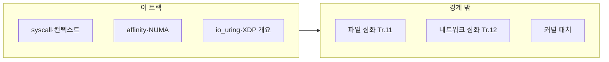

이 트랙은 "코드는 빠른데 프로세스가 느린 이유"를 운영환경에서 찾고 고칩니다. µs 단위에서는 context switch, syscall, 스케줄링 정책, 코어 배치가 지연시간의 바닥을 결정합니다.

## 이 트랙이 책임지는 범위

- context switch 비용과 회피 전략(스레드/코어 배치)
- syscall 비용과 경로 단축(가능한 범위의 사용자 공간 설계)
- CPU pinning/affinity 전략, NUMA 고려
- realtime scheduling의 개념과 적용 시 고려사항
- 타이밍/클럭/시간 측정 이슈(정확한 시간 기반 검증)

## 이 트랙이 다루지 않는 것 (경계)

- 커널/스케줄러 구현을 직접 수정하는 수준의 튜닝 (→ 필요 시 별도 심화)
- C++ 언어/컴파일러/데이터 구조 자체의 최적화 상세 (→ 각 트랙)

## 커리큘럼

**난이도 범례**: **기초**(입문) · **중급**(실무 핵심) · **심화**(깊은 분석·전문 주제) · **전문**(극한·니치). **Tr.NN**은 `optimization-NN-*` 트랙을 가리킵니다. **개요(본 트랙)** 행은 동일 주제의 **심화**가 Tr.11(I/O)·Tr.12(네트워크) 등에 있음을 뜻합니다.

운영환경 최적화가 처음이라면 **16 → 01 → 02 → 03 → 06 → 11** 순서로 읽는 것을 권장합니다. 16은 process/thread의 기본 mental model을 맞추고, 01~03과 06은 context switch·syscall·affinity·시간 측정의 바닥 비용을 먼저 이해하게 해 줍니다. 그 위에서 04~05, 10, 12~18의 심화 주제를 읽으면 훨씬 덜 가파릅니다.

이 문서에서 **표 순서를 유지하는 이유**는 참조성과 경계 설명 때문입니다. `07~09`처럼 “개요(본 트랙)” 성격의 장과 이후 심화 장을 장 번호 기준으로 찾기 쉬워야 하므로, 표는 지도 역할을 맡고 위 추천 순서는 입문자용 진입 경로를 설명합니다.

| 챕터 | 제목 | 난이도 | 핵심 내용 |
|------|------|--------|-----------|
| 01 | Context Switch 비용 | 중급 | Context switch 비용 분석과 회피 전략 |
| 02 | Syscall 최적화 | 중급 | Syscall 비용과 최소화 기법 |
| 03 | CPU Pinning/Affinity | 중급 | CPU pinning/affinity 전략 |
| 04 | NUMA CPU Affinity | 심화 | NUMA에서 CPU affinity·스레드 배치 (메모리 할당은 Tr.03과 연계) |
| 05 | Realtime 스케줄링 | 심화 | Realtime 스케줄링 적용 |
| 06 | 정밀 시간 측정 | 중급 | RDTSC, clock_gettime 등 정밀 타이밍 |
| 07 | 커널 바이패스 개요 | 중급 | 개요(본 트랙); 심화·실전은 Tr.11·Tr.12 |
| 08 | io_uring 개요 | 중급 | 개요(본 트랙); 파일 I/O 심화는 Tr.11 |
| 09 | XDP/eBPF 개요 | 중급 | 개요(본 트랙); 패킷 처리 심화는 Tr.12 |
| 10 | Huge TLB Pages | 심화 | Huge TLB Pages 활용 |
| 11 | 컨테이너 성능 | 기초 | 컨테이너/가상화 성능 고려사항 |
| 12 | IRQ 최적화 | 심화 | IRQ 처리와 인터럽트 최적화 |
| 13 | cgroups v2 | 중급 | cgroups v2 기반 리소스 제어와 성능 영향 |
| 14 | Memory Locking | 심화 | mlock/mlockall을 활용한 메모리 고정 전략 |
| 15 | Signal Handling | 중급 | Signal handling 오버헤드와 회피 전략 |
| 16 | Process vs Thread | 기초 | 프로세스 vs 스레드 아키텍처 선택 기준 |
| 17 | eBPF·커널 경계와 성능 안전 | 전문 | eBPF/XDP 운영·보안·지연 트레이드오프 (Tr.12·Tr.09 연계) |
| 18 | 클라우드 환경 꼬리 지연 | 심화 | 퍼블릭 클라우드 Noisy Neighbor, CPU Steal Time 분석과 방어 |

## 측정과 검증 (이 트랙 기준)

- 운영환경 변경(affinity/scheduler) 전후 레이턴시 분포 비교
- 동일 하드웨어에서 재현 가능한 기준선 확보(변수 최소화)
- 시스템 레벨 회귀를 자동화(환경/런타임 설정 포함)

## 추천 선행/병행 트랙

- **선행**: Low-latency 프로파일링·성능 분석 (Tr.05)
- **병행**: 동시성 (Tr.04), CPU 마이크로아키텍처 (Tr.06)

## 플랫폼별 읽기 힌트

- **Linux 중심 독자**는 01~03, 06, 07~10, 12~14를 먼저 읽으면 syscall·affinity·io_uring·IRQ·cgroups 흐름이 자연스럽습니다.
- **Windows 중심 독자**는 06, 11, 15를 먼저 읽고, 02·03을 "시스템 호출 경로와 스레드 배치" 관점에서 대응시켜 읽으면 ETW/IOCP 같은 Tr.05·Tr.11 주제와 연결하기 쉽습니다.

## 왜 이 트랙인가 (동기)

애플리케이션 코드와 빌드 설정을 다듬은 뒤에도, **스케줄링·시스템 콜·IRQ·컨테이너 오버헤드**가 바닥 지연을 지배할 수 있습니다. 특히 실시간에 가까운 목표에서는 affinity 한 줄이 평균보다 **꼬리 지연**에 더 큰 영향을 줍니다. 이 트랙은 커널 구현을 고치는 범위가 아니라, **운영 가능한 설정과 측정**으로 지연 분포를 안정화하는 데 초점을 둡니다.

## Phase별 학습 궤적

**Phase A — 컨텍스트와 syscall (챕터 01~03, 06)** 비용의 “바닥”을 이해하고 측정합니다.

**Phase B — NUMA·실시간·고정 (챕터 04~05, 10, 14)** Tr.03 메모리 할당·Tr.04 경합과 맞물립니다. 건너뛰면 NUMA 머신에서 **이상하게만 느린** 코어만 남기도 합니다.

**Phase C — 커널 바이패스·고급 주제 (챕터 07~09, 11~13, 15~18)** 챕터 07~09는 **개요(본 트랙)**이며, io_uring·XDP/eBPF·DPDK의 **심화 실전**은 Tr.11·Tr.12에서 이어집니다. 챕터 17~18은 클라우드 및 eBPF 환경의 특수 운영 주제를 다룹니다.

## 이 트랙을 마친 후 달성할 목표

- **설명**: context switch·syscall·affinity가 지연에 미치는 영향을 말로 설명할 수 있다.
- **적용**: 배포 환경에서 재현 가능한 방식으로 affinity·스케줄 정책을 시험할 수 있다.
- **연계**: Tr.11·Tr.12로 넘길 때 “개요에서 무엇을 이미 알았는지”를 정리할 수 있다.
- **경계**: 커널 소스 수정 수준의 튜닝은 범위 밖임을 팀과 합의할 수 있다.

## 평가 기준과 이 장을 읽은 후 확인

- [ ] 개요(본 트랙)와 Tr.11·Tr.12 심화의 역할 분담을 표로 설명할 수 있는가?
- [ ] 동일 바이너리에서 환경만 바꿔 레이턴시 분포를 비교할 실험 설계를 말할 수 있는가?
- [ ] Tr.04·Tr.06과 질문을 나눌 수 있는가?

## 범위와 경계

## 심화·전문가 확장 궤적

IRQ·cgroups·mlock 등은 운영 권한과 워크로드에 강하게 의존합니다. **심화** 난이도 챕터는 스테이징에서 지표·분포를 확보한 뒤 적용하세요.

## 시리즈 전체 로드맵

12개 트랙의 권장 순서·심화 진입 조건은 **[Low-latency 최적화 시리즈 개요](/post/low-latency-optimization-series/getting-started-low-latency-optimization-series-overview/)**를 참고하세요.

## 지금 바로 이어 읽을 곳

운영환경 개요를 잡은 뒤에는 병목의 성격에 따라 분기하는 편이 좋습니다. 파일·블록 경로가 문제라면 **Tr.11**, 패킷·프로토콜 경로가 문제라면 **Tr.12**로 이어 가고, 운영·보안 경계가 중요하다면 현재 공개된 **챕터 17**을 먼저 읽을 수 있습니다.

- [eBPF·커널 경계와 성능 안전](/post/os-optimization/ebpf-xdp-kernel-boundary-performance-safety-expert/)
- [Tr.11 Introduction: Low-latency I/O 최적화](/post/io-optimization/getting-started-io-performance-tuning/)
- [Tr.12 Introduction: Low-latency 네트워크 최적화](/post/network-optimization/getting-started-network-performance-tuning/)
