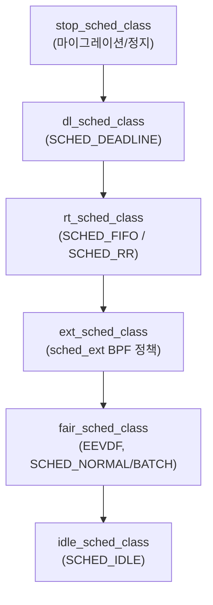

**Realtime 스케줄링**이란 일반 프로세스와 다른 정책(policy)으로 태스크를 선점·배치해, "언젠가는 실행된다"가 아니라 "정해진 시간 안에 실행된다"는 보장을 얻으려는 커널 스케줄러의 기능군을 말합니다. µs 단위 지연을 다루는 시스템에서는 기본 스케줄러가 아무리 공정해도 "가끔 몇 ms씩 늦게 깨어나는" 태스크 하나가 꼬리 지연 전체를 망칠 수 있고, 반대로 실시간 정책을 잘못 쓰면 시스템 전체가 멈추는 사고로 이어질 수 있습니다. 이 장에서는 `SCHED_FIFO`/`SCHED_RR`의 동작 원리, 리눅스 6.12에 병합된 `sched_ext` BPF 스케줄러 프레임워크, 6.12~6.13에 걸쳐 완성된 EEVDF 전환, 그리고 멀티 LLC(Last Level Cache) 서버를 겨냥한 Cache-Aware Scheduling의 최신 진행 상황을 다룹니다.

## 이 장을 읽기 전에

**전제 지식**: 이 장은 [01장: Context Switch 비용 분석과 회피](/post/os-optimization/context-switch-cost-avoidance/)에서 다룬 "선점·컨텍스트 스위치 비용" 개념과, [03장: CPU Pinning/Affinity 전략](/post/os-optimization/cpu-pinning-affinity-strategy/)·[04장: NUMA CPU Affinity·스레드 배치](/post/os-optimization/numa-cpu-affinity-thread-placement/)에서 다룬 "코어에 스레드를 고정한다"는 개념을 전제로 합니다. 이 장에서 다루는 실시간 정책은 결국 "어떤 코어에서, 어떤 순서로 실행할 것인가"를 스케줄러가 결정하는 문제이므로, affinity를 먼저 이해하지 않으면 실시간 정책의 효과를 제대로 판단하기 어렵습니다.

**이 장의 깊이**: **심화** 난이도로, `SCHED_FIFO`/`SCHED_RR`의 선점 모델, `sched_ext`의 BPF 훅 구조와 안전 장치, EEVDF의 eligibility·virtual deadline·lag 개념, Cache-Aware Scheduling의 목적과 현재 상태(2026년 기준)를 다룹니다. **다루지 않는 것**: CPU affinity·isolcpus 설정 자체([03장](/post/os-optimization/cpu-pinning-affinity-strategy/)), NUMA 노드 간 스레드 배치([04장](/post/os-optimization/numa-cpu-affinity-thread-placement/)), 시간 측정 방법론([06장](/post/os-optimization/precise-time-measurement-rdtsc-clock-gettime/)), eBPF/XDP의 네트워크 검증·보안 모델 전반([17장](/post/os-optimization/ebpf-xdp-kernel-boundary-performance-safety-expert/)), cgroup 기반 리소스 제어 세부사항([13장](/post/os-optimization/cgroups-v2-resource-control-performance/))입니다.

## 당신의 수준에 맞는 경로

| 수준 | 읽을 부분 | 핵심 목표 |
|------|---------|---------|
| **초보자** | "리눅스 스케줄러 클래스의 역사" ~ "SCHED_FIFO와 SCHED_RR" | 실시간 정책이 일반 정책과 다르게 선점되는 이유 이해 |
| **중급자** | "EEVDF" ~ "sched_ext" | 기본 스케줄러 교체 배경과 커스텀 정책 프레임워크의 안전 장치 이해 |
| **전문가** | "Cache-Aware Scheduling" ~ "비판적 시각" | 최신 커널 스케줄러 변화를 판단 기준에 반영해 정책을 선택 |

---

## 리눅스 스케줄러 클래스의 역사와 계층 구조

리눅스 스케줄러는 하나의 알고리즘이 아니라 **우선순위가 매겨진 여러 스케줄러 클래스(sched_class)의 체인**입니다. `SCHED_FIFO`/`SCHED_RR` 같은 실시간 정책은 POSIX.1b(1993년 표준화된 POSIX 실시간 확장)에서 정의되었고, 리눅스는 이를 초기 커널부터 지원해 왔습니다. 일반 태스크를 다루는 스케줄러는 여러 세대를 거쳤습니다. Ingo Molnar가 만든 **CFS(Completely Fair Scheduler)**가 2007년 리눅스 2.6.23에 병합되어 약 16년간 기본 스케줄러 자리를 지켰고, Peter Zijlstra가 구현한 **EEVDF(Earliest Eligible Virtual Deadline First)**가 2023년 리눅스 6.6에서 CFS를 대체하기 시작해 6.12(2024년 11월)에서 전환이 완료되고 6.13(2025년 초)에서 막판 lag 계산 버그가 수정되었습니다. 같은 6.12에는 Meta 주도로 수년간 아웃오브트리로 개발되어 온 **sched_ext**(BPF 확장 스케줄러 클래스)가 병합되었고, Intel 엔지니어들이 주도한 **Cache-Aware Scheduling(CAS)**은 2025~2026년 패치를 거쳐 커널 tip 트리에서 논의·개정을 거듭하고 있으며, 집필 시점 기준으로는 정식 병합 버전·시점이 확정되지 않았으므로 구체적인 커널 버전 번호는 단정하지 않습니다(`CONFIG_SCHED_CACHE`로 노출되고 기본 비활성화될 것으로 알려져 있습니다).

이 클래스들은 우선순위 순서로 태스크 선택을 위임합니다. 커널은 가장 앞의 클래스부터 "실행할 태스크가 있는지" 물어보고, 있으면 그 클래스가 고른 태스크를 실행합니다.



`SCHED_DEADLINE`(EDF 기반 정책)은 이 체인에서 실시간 정책보다도 앞서지만, 커리큘럼상 이 장은 `SCHED_FIFO`/`SCHED_RR`·`sched_ext`·EEVDF·Cache-Aware Scheduling에 집중하므로 `SCHED_DEADLINE` 자체의 파라미터(runtime/deadline/period)는 깊이 다루지 않습니다. 중요한 점은, `sched_ext`로 커스텀 BPF 정책을 넣어도 실시간 클래스(`rt_sched_class`)보다 아래에 위치한다는 것입니다. 즉 `SCHED_FIFO` 태스크가 있으면 아무리 정교한 `sched_ext` 정책도 그 태스크가 끝날 때까지 밀립니다.

## SCHED_FIFO와 SCHED_RR: 실시간 정책의 동작 원리

`SCHED_FIFO`와 `SCHED_RR`은 **1~99 범위의 정적 우선순위**를 가지며, 숫자가 높을수록 먼저 실행됩니다. 두 정책 모두 **일반 정책(SCHED_NORMAL/EEVDF) 태스크보다 항상 먼저 선택**되고, 더 높은 우선순위의 실시간 태스크가 러너블 상태가 되면 실행 중이던 낮은 우선순위 실시간 태스크를 즉시 선점합니다. 차이는 **같은 우선순위** 태스크가 여럿일 때 나타납니다. `SCHED_FIFO`는 시간 할당량이 없어 태스크가 스스로 양보하거나 블록될 때까지 계속 실행되는 반면, `SCHED_RR`은 같은 우선순위 태스크끼리 정해진 타임 퀀텀 단위로 라운드로빈 방식으로 교대합니다. 두 정책 모두 프로세스에 `CAP_SYS_NICE` 권한(또는 root)이 필요하며, 일반 사용자 권한으로는 `sched_setscheduler()`가 `EPERM`으로 실패합니다(정책·우선순위 필드의 정확한 정의는 [man7: sched(7)](https://man7.org/linux/man-pages/man7/sched.7.html) 참고).

```cpp
#include <sched.h>
#include <cstdio>
#include <cerrno>
#include <cstring>

int main() {
  sched_param param{};
  param.sched_priority = 50;  // 1(낮음)~99(높음); CAP_SYS_NICE 필요

  if (sched_setscheduler(0, SCHED_FIFO, &param) != 0) {
    std::fprintf(stderr, "sched_setscheduler 실패: %s\n", std::strerror(errno));
    return 1;  // 권한 없으면 EPERM
  }

  int policy = sched_getscheduler(0);
  std::printf("적용된 policy=%d (SCHED_FIFO=%d)\n", policy, SCHED_FIFO);
  return 0;
}
```

위 코드는 현재 프로세스를 `SCHED_FIFO` 우선순위 50으로 바꿉니다. **`sched_setscheduler`만으로는 안전하지 않습니다.** 실시간 태스크가 코어를 독점하면 같은 코어의 커널 워커·소프트IRQ가 굶어 워치독(soft lockup detector)이 개입하거나 시스템이 응답하지 않을 수 있으므로, 실무에서는 반드시 [03장](/post/os-optimization/cpu-pinning-affinity-strategy/)의 CPU affinity(전용 코어 격리, `isolcpus`)와 함께 적용하고, 페이지 폴트로 인한 지연을 없애려면 [14장: Memory Locking](/post/os-optimization/memory-locking-mlock-mlockall/)도 함께 검토합니다.

코드를 수정하지 않고 기존 바이너리에 실시간 정책을 적용·확인하려면 `chrt` 명령을 씁니다. 아래는 프로세스 실행·정책 확인, 그리고 `rt-tests` 패키지의 `cyclictest`로 스케줄링 지연을 정량 측정하는 명령입니다.

```bash
# 우선순위 50, SCHED_FIFO로 실행 (root 또는 CAP_SYS_NICE 필요)
sudo chrt -f 50 ./rt_demo

# 실행 중인 프로세스의 정책·우선순위 확인
chrt -p "$(pgrep -f rt_demo)"

# SCHED_RR의 타임 퀀텀(초 단위) 확인: sched_rr_get_interval 시스템 콜과 대응
chrt -p "$(pgrep -f rt_demo)" | grep -i "rr"
```

**타임 퀀텀 확인**이 필요하면 `sched_rr_get_interval(2)` 시스템 콜을 코드에서 직접 호출해 `SCHED_RR`의 라운드로빈 주기를 읽을 수 있습니다. 이 값은 커널·배포판에 따라 기본값이 다르므로 단정하지 말고 실제 환경에서 확인합니다.

## EEVDF: CFS를 대체한 가상 마감시간 스케줄링

**EEVDF**는 Ion Stoica와 Hussein Abdel-Wahab이 1995년 제안한 비례 공유(proportional share) 자원 할당 알고리즘을 기반으로 하며, 리눅스 6.6~6.12에 걸쳐 CFS를 대체했습니다. 핵심 아이디어는 CFS의 "최소 vruntime을 가진 태스크를 고른다"는 단순 규칙을, "적격(eligible)하면서 가상 마감시간(virtual deadline)이 가장 이른 태스크를 고른다"는 규칙으로 바꾼 것입니다. 각 태스크는 **lag**(공정하게 받아야 할 CPU 시간과 실제로 받은 시간의 차이)를 가지며, lag가 0 이상이면 "적격"으로 간주되어 실행 후보가 됩니다. 적격한 태스크들 중에서는 가상 마감시간이 가장 이른 태스크가 선택됩니다. 이 방식은 CFS 대비 **지연 민감 태스크에 유리한 스케줄링**을 목표로 하며, `PLACE_LAG`·`RUN_TO_PARITY`·`NEXT_BUDDY` 같은 내부 휴리스틱 토글로 세부 동작을 조정합니다(자세한 정의는 [커널 문서: EEVDF 스케줄러](https://docs.kernel.org/scheduler/sched-eevdf.html) 참고).

실무에서 중요한 점은, EEVDF가 CFS의 `sched_min_granularity_ns`·`sched_wakeup_granularity_ns` 같은 일부 튜닝 노브를 없애거나 의미를 바꿨다는 것입니다. CFS 시절 성능을 맞추기 위해 조정했던 `/proc/sys/kernel/sched_*` 값들을 그대로 EEVDF 커널에 적용하면 효과가 다르거나 존재하지 않는 파라미터를 건드리는 셈이 될 수 있으므로, 커널 버전을 올릴 때는 스케줄러 관련 튜닝 스크립트를 반드시 재검증해야 합니다.

## sched_ext: BPF로 스케줄링 정책을 정의하는 프레임워크

**sched_ext**는 스케줄링 정책 자체를 BPF 프로그램으로 작성해 런타임에 적재·교체할 수 있게 하는 스케줄러 클래스로, 리눅스 6.12에 병합되었습니다. 커널은 `select_cpu`(태스크를 어느 CPU에 둘지), `enqueue`(러너블 상태가 됐을 때 큐잉 방식), `dispatch`(코어가 유휴 상태일 때 다음 태스크 선택) 같은 훅을 `struct sched_ext_ops`로 노출하고, 실제 "누구를 언제 실행할지"의 판단은 로드된 BPF 프로그램이 담당합니다. 커스텀 스케줄러를 커널 재컴파일 없이 교체할 수 있다는 점이 핵심 가치이며, `scx_rusty`(멀티코어 워크 스틸링), `scx_lavd`(지연 민감 워크로드), `scx_bpfland`(인터랙티브 반응성) 같은 스케줄러가 이미 생태계에 존재합니다.

```text
// 개념 스케치: sched_ext BPF 스케줄러의 훅 구조
// (실제 컴파일에는 vmlinux.h, libbpf 스켈레톤, scx 유틸리티 빌드 체인이 필요하므로
//  여기서는 각 훅이 무엇을 담당하는지만 보여줍니다)
struct sched_ext_ops simple_ops = {
  .select_cpu = (void *)simple_select_cpu,  // 태스크를 어떤 CPU에 둘지 결정
  .enqueue    = (void *)simple_enqueue,     // 러너블 상태 진입 시 큐잉 정책
  .dispatch   = (void *)simple_dispatch,    // CPU가 놀 때 다음 태스크 선택
  .init       = (void *)simple_init,
  .exit       = (void *)simple_exit,        // 오류 발생 시 커널이 기본 스케줄러로 자동 폴백
  .name       = "simple",
};
```

**안전 장치**가 이 프레임워크의 실무 채택을 가능하게 만든 요소입니다. BPF 프로그램은 로드 시 verifier가 정적 검증하고(일반적인 BPF 검증기 제약·보안 모델은 [17장: eBPF·커널 경계와 성능·안전](/post/os-optimization/ebpf-xdp-kernel-boundary-performance-safety-expert/) 참고, 프레임워크 개요는 [커널 문서: Extensible Scheduler Class](https://docs.kernel.org/scheduler/sched-ext.html) 참고), 실행 중에는 워치독이 스케줄러 정체(stall)를 감지해 오류가 발생한 BPF 스케줄러를 자동으로 언로드하고 기본 스케줄러(EEVDF/`fair_sched_class`)로 되돌립니다. 이 덕분에 커스텀 정책 실험이 커널 패닉으로 이어질 위험이 out-of-tree 패치 방식보다 크게 낮아졌습니다.

## Cache-Aware Scheduling: LLC 지역성을 스케줄러가 챙기다

**Cache-Aware Scheduling(CAS)**은 멀티 LLC(Last Level Cache) 도메인을 가진 최신 서버 CPU에서, 데이터를 공유할 가능성이 높은 태스크(같은 프로세스의 스레드들)를 같은 LLC 도메인에 묶어 배치하려는 스케줄러 확장입니다([LWN: Cache aware scheduling](https://lwn.net/Articles/1049261/) 참고). Intel 엔지니어들이 약 1년 넘게 개발해 왔고, 커널 tip 트리의 `sched/core` 브랜치에서 패치가 개정되고 있습니다. 정식 병합 버전·시점은 집필 시점 기준 확정되지 않았으므로 구체적인 커널 버전 번호는 단정하지 않으며, 병합되면 `CONFIG_SCHED_CACHE`로 노출되고 **기본적으로 비활성화**될 것으로 알려져 있고, 커널 부팅 후 debugfs 인터페이스로 켜고 끌 수 있어 같은 환경에서 CAS 유무를 직접 비교할 수 있습니다. 초기 벤치마크에서는 워크로드에 따라 편차가 컸는데, hackbench류 지연 민감 벤치마크에서 두 자릿수 퍼센트 개선이, ChaCha20 같은 암호화 처리량 벤치마크에서는 더 큰 폭의 개선이 보고되었습니다(정확한 수치는 CPU 세대·커널 버전·워크로드에 따라 달라지므로, 이 트랙의 다른 장과 마찬가지로 자신의 환경에서 재현하는 것을 전제로 참고 수치로만 받아들여야 합니다).

CAS는 NUMA affinity와 다른 문제를 겨냥합니다. NUMA 배치([04장](/post/os-optimization/numa-cpu-affinity-thread-placement/))가 "메모리 컨트롤러에 가까운 코어"를 고르는 문제라면, CAS는 같은 NUMA 노드 안에서도 여러 LLC 도메인으로 쪼개진 최신 서버 CPU(칩렛 설계 등)에서 "같은 캐시를 공유하는 코어"를 고르는 문제입니다. 두 메커니즘은 상호 배타적이지 않고, NUMA 배치를 먼저 맞춘 뒤 그 안에서 CAS가 LLC 수준의 미세 조정을 담당하는 관계로 이해하는 것이 정확합니다.

## 흔한 오개념 바로잡기

**오개념 1: "SCHED_FIFO 우선순위 99면 무조건 가장 빠르고 안전하다."** 우선순위 99는 "가장 먼저 실행된다"는 뜻일 뿐, 안전을 보장하지 않습니다. 격리된 코어 없이 우선순위 99 태스크가 무한 루프에 빠지면 해당 코어의 커널 워커·타이머·소프트IRQ가 굶어 워치독이 시스템을 재부팅시키거나 응답 불능 상태로 만들 수 있습니다. 실시간 우선순위는 반드시 CPU 격리·워치독 설정과 함께 검토합니다.

**오개념 2: "sched_ext는 실험적이라 프로덕션에 쓰면 위험하다."** sched_ext는 워치독 기반 자동 폴백 덕분에 잘못된 BPF 스케줄러가 커널 크래시로 이어지는 것을 막고, Meta 등에서 실제 워크로드에 적용한 사례가 보고되어 있습니다. 다만 "위험하지 않다"는 것과 "성숙했다"는 것은 다른 이야기입니다. `sched_ext_ops` 인터페이스는 커널 버전에 따라 확장되고 있고, 커스텀 BPF 스케줄러의 성능·공정성은 여전히 개발자의 구현 품질에 크게 좌우됩니다.

**오개념 3: "EEVDF로 바뀌었어도 SCHED_NORMAL 튜닝 감각은 CFS 때와 같다."** CFS 시절 사용하던 일부 `sched_*_ns` 노브는 EEVDF에서 제거되거나 의미가 바뀌었습니다. 커널을 6.6 이전에서 6.12 이후로 올리면서 기존 스케줄러 튜닝 스크립트를 그대로 재사용하면, 노브가 무시되거나 다른 방식으로 작동해 기대와 다른 지연 분포가 나올 수 있습니다.

## 판단 기준: 언제 무엇을 쓸까

| 상황 | 권장 | 이유·주의 |
|------|------|-----------|
| 일반 서버 워크로드, 처리량과 공정성이 우선 | `SCHED_NORMAL`(EEVDF, 기본값) | 별도 권한·격리 없이 안전하게 동작 |
| 하드 실시간에 가까운 마감(오디오·제어 루프) | `SCHED_FIFO` + 전용 코어 격리 | 우선순위 역전·시스템 행 방지 위해 [03장](/post/os-optimization/cpu-pinning-affinity-strategy/)의 isolcpus·affinity 병행 필수 |
| 같은 우선순위의 실시간 작업을 여러 스레드가 나눠 처리 | `SCHED_RR` | 라운드로빈으로 동일 우선순위 내 기아 방지 |
| 조직 특화 스케줄링 정책을 실험·점진 적용 | `sched_ext` | BPF verifier·워치독 폴백으로 실험 위험이 out-of-tree 패치보다 낮음 |
| 멀티 LLC 서버에서 캐시 바운싱이 병목으로 확인됨 | Cache-Aware Scheduling(`CONFIG_SCHED_CACHE`, 7.2+) | 기본 비활성화·초기 기능이므로 워크로드별 벤치마크 후 도입 |
| 컨테이너·Kubernetes 환경의 CPU 자원 제어 | 실시간 정책 대신 cgroup 기반 제어 우선 검토 | 세부 사항은 [11장: 컨테이너/가상화 성능 고려사항](/post/os-optimization/container-virtualization-performance-considerations/)·[13장: cgroups v2](/post/os-optimization/cgroups-v2-resource-control-performance/) 참고 |

## 비판적 시각: 한계와 트레이드오프

**SCHED_FIFO/SCHED_RR**은 POSIX.1b 표준화 이후 30년 넘게 검증된 안정적 메커니즘이지만, 우선순위 역전(priority inversion)과 격리 실패로 인한 시스템 행이라는 오래된 위험을 그대로 가지고 있습니다. "실시간"이라는 이름이 주는 안도감과 달리, 잘못 쓰면 오히려 전체 시스템의 신뢰성을 해칠 수 있습니다. **sched_ext**는 안전 장치가 있다는 점에서 진일보했지만, 커스텀 BPF 스케줄러의 품질 검증·회귀 테스트 체계는 각 조직이 스스로 구축해야 하고, 인터페이스 자체도 아직 커널 버전에 따라 진화하고 있어 장기 유지보수 부담이 있습니다. **EEVDF**는 이론적으로 더 정교하지만 knob이 줄어든 것이 항상 "더 좋아졌다"를 뜻하지는 않습니다. 세밀한 튜닝이 필요했던 특수 워크로드에서는 오히려 제어권을 잃었다는 불만도 있습니다. **Cache-Aware Scheduling**은 이 장을 쓰는 시점 기준으로 막 병합된 신규 기능이라 프로덕션 검증 사례가 아직 두텁지 않고, 기본 비활성화라는 사실 자체가 "아직 모든 워크로드에 안전하다고 확신하지 못한다"는 커널 개발자들의 신호로 읽어야 합니다.

## 마무리

이 장을 읽은 뒤 다음을 스스로 확인할 수 있어야 합니다.

- [ ] `SCHED_FIFO`/`SCHED_RR`과 `SCHED_NORMAL`(EEVDF)의 선점 모델 차이를 설명할 수 있다.
- [ ] 실시간 우선순위를 격리 없이 적용했을 때의 위험(워치독, 시스템 행)을 설명할 수 있다.
- [ ] `sched_ext`가 BPF verifier와 워치독 폴백으로 안전성을 확보하는 방식을 설명할 수 있다.
- [ ] EEVDF의 eligibility·virtual deadline·lag 개념으로 태스크 선택 순서를 추론할 수 있다.
- [ ] Cache-Aware Scheduling이 겨냥하는 멀티 LLC 문제와 현재 상태(7.2, 기본 비활성화)를 안다.
- [ ] 워크로드 특성에 따라 판단 기준 표를 이용해 적절한 스케줄링 정책을 고를 수 있다.

**이전 장**: [NUMA CPU Affinity·스레드 배치](/post/os-optimization/numa-cpu-affinity-thread-placement/) (챕터 04)

**다음 장에서는** 정밀 시간 측정을 다룹니다. 이 장에서 언급한 스케줄링 지연을 실제로 정량화하려면 `RDTSC`·`clock_gettime` 같은 정밀 타이밍 도구와, 클럭 소스·오버헤드·정밀도의 함정을 이해해야 합니다. `cyclictest`가 보고하는 지연 수치의 신뢰도 역시 측정 방법론에 좌우되므로, 스케줄링 정책을 바꾼 뒤의 회귀 검증은 다음 장의 도구로 이어집니다.

→ [정밀 시간 측정](/post/os-optimization/precise-time-measurement-rdtsc-clock-gettime/) (챕터 06)
