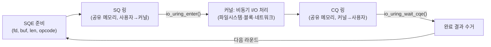

**io_uring**은 사용자 공간과 커널이 공유 메모리 링 버퍼를 통해 I/O 요청과 완료 결과를 주고받는 리눅스의 비동기 I/O 인터페이스로, 요청을 커널에 밀어 넣고 결과를 받아 오는 과정에서 syscall 진입 횟수를 최소화하도록 설계되었습니다. 앞 장에서 다룬 것처럼 `write`/`read` 같은 전통적 syscall은 호출마다 모드 전환 비용을 수반하고 배치(batching)로 이를 줄이는 데는 한계가 있는데, io_uring은 여기서 한 걸음 더 나아가 "요청을 큐에 쌓아두고 커널이 스스로 처리한 뒤 완료를 큐에 쌓아둔다"는 모델로 syscall 자체를 구조적으로 줄입니다. 이 장에서는 io_uring이 등장한 배경과 SQ(Submission Queue)/CQ(Completion Queue) 링 버퍼의 동작 원리를 다지고, 2025~2026년에 걸쳐 안정화된 epoll 통합(Linux 6.15)·NAPI busy-poll·`IORING_OP_URING_CMD` 기반 NVMe passthrough를 개관합니다.

## 이 장을 읽기 전에

**선행 챕터**: [Syscall 비용과 최소화 기법](/post/os-optimization/syscall-cost-minimization/)(챕터 02)에서 syscall 진입·탈출 비용과 `writev`/`sendmmsg` 배치를 다뤘습니다. io_uring은 그 배치 아이디어의 논리적 극단으로, 개별 요청마다 syscall을 내는 대신 다건의 요청을 한 번의 `io_uring_enter()` 호출로 제출합니다. [커널 바이패스 개요](/post/os-optimization/kernel-bypass-overview/)(챕터 07)에서 커널을 완전히 우회하는 DPDK류 접근과 "커널을 거치되 오버헤드를 줄이는" io_uring의 위치 관계를 이미 정리했다면 이 장의 맥락을 잡기 쉽습니다.

**전제 지식**: user mode/kernel mode 구분과 syscall 진입 비용(챕터 02), `mmap`으로 파일이나 익명 메모리를 프로세스 주소 공간에 매핑한다는 개념, epoll 기반 이벤트 루프(`epoll_wait`로 준비된 fd를 통지받는 모델)를 한 번이라도 다뤄 본 경험이면 충분합니다.

**이 장의 깊이**: **중급**입니다. SQ/CQ 링 버퍼의 구조, SQE(Submission Queue Entry)·CQE(Completion Queue Entry)가 오가는 방식, `io_uring_setup`/`io_uring_enter`/`io_uring_register` 세 syscall의 역할, 그리고 최근 커널에 들어온 epoll 통합·NAPI busy-poll·NVMe passthrough 기능을 "무엇을 해결하는가" 수준까지 다룹니다.

**다루지 않는 것**: 이 장은 **개요**이며, 이 트랙(Tr.07) 안에서 완결된 내용을 제공하되 다음 두 영역은 별도 트랙의 몫으로 남겨 둡니다. 파일시스템·블록 I/O 경로에서 io_uring을 실전 배포하는 세부 튜닝(큐 깊이 산정, fixed buffer/file 등록, O_DIRECT와의 상호작용, 파일시스템별 차이)은 아직 집필되지 않은 I/O 최적화 트랙(Tr.11)의 심화 챕터가 다룰 범위입니다. 소켓 기반 네트워크 서버에서 io_uring과 epoll을 함께 쓰는 아키텍처, `sendzc`(send zero-copy) 같은 네트워크 전용 옵코드의 세부 사항은 아직 집필되지 않은 네트워크 최적화 트랙(Tr.12)의 몫입니다. 이 두 트랙이 아직 없으므로 여기서는 범위와 경계만 설명하고 존재하지 않는 링크는 걸지 않습니다. 또한 io_uring의 공격 표면·verifier 유사 보안 모델 자체는 이 장의 범위가 아니며, BPF 기반 커널 확장의 보안 모델은 [17장: eBPF·커널 경계와 성능·안전](/post/os-optimization/ebpf-xdp-kernel-boundary-performance-safety-expert/)에서 다룹니다.

## 당신의 수준에 맞는 경로

| 수준 | 읽을 부분 | 핵심 목표 |
|------|---------|---------|
| **입문** | "io_uring의 등장 배경" ~ "SQ/CQ 링 버퍼와 비동기 I/O 원리" | 전통적 syscall과 io_uring의 근본적 차이(공유 링 버퍼) 이해 |
| **중급자** | "제출 모드: 인터럽트 기반과 SQPOLL" ~ "최신 기능 개관" | io_uring_enter의 배치 제출과 최신 옵코드(epoll·NAPI·uring_cmd)가 겨냥하는 문제 파악 |
| **전문가** | "판단 기준" ~ "비판적 시각" | io_uring 도입 여부와 어떤 심화 트랙으로 넘어갈지 판단 |

---

## io_uring의 등장 배경 (역사·배경)

리눅스는 2.5 커널부터 `libaio` 기반의 네이티브 비동기 I/O(AIO)를 제공해 왔지만, 오랫동안 "쓰기 어렵고 비효율적"이라는 평가를 받았습니다. `libaio`는 버퍼링된(buffered) 파일 I/O를 사실상 비동기로 처리하지 못해 특정 조건에서 블로킹으로 되돌아갔고, 소켓 I/O 지원도 일관되지 않았으며, 요청마다 별도의 syscall과 메모리 복사가 필요해 오버헤드가 컸습니다. 당시 Facebook(현 Meta) 소속이던 커널 개발자 Jens Axboe는 RocksDB 같은 고성능 스토리지 엔진이 겪는 이런 확장성 문제를 해결하기 위해 2018년 말 새로운 인터페이스를 리눅스 커널 메일링 리스트에 제안했고, 핵심 개선점은 "더 효율적"이라는 것과 특히 데이터가 페이지 캐시에 이미 있을 때 컨텍스트 스위치 없이 비동기 버퍼 I/O를 수행할 수 있다는 점이었습니다. 이 설계는 2019년 5월 5일 리눅스 5.1에 io_uring이라는 이름으로 병합되었고, 이후 커널 버전을 거치며 고정 버퍼/파일 등록(`io_uring_register`), SQPOLL(커널 스레드가 SQ를 스스로 폴링), 멀티샷(multishot) 요청, 그리고 이 장 후반에서 다룰 epoll 통합·NAPI busy-poll·`IORING_OP_URING_CMD` 같은 확장이 꾸준히 추가되어 왔습니다.

## SQ/CQ 링 버퍼와 비동기 I/O 원리 (핵심 메커니즘)

io_uring이라는 이름 자체가 사용자 공간과 커널 공간이 공유하는 **링 버퍼(ring buffer)**에서 왔습니다. 애플리케이션은 요청하려는 I/O 작업을 **SQ(Submission Queue)**에 올려두고, 커널은 그 작업들의 처리 결과를 **CQ(Completion Queue)**에 올려둡니다. 두 큐 모두 `io_uring_setup()` syscall이 만든 파일 디스크립터를 `mmap(2)`으로 사용자 프로세스 주소 공간에 매핑해 공유하므로, 큐를 오갈 때 커널·사용자 공간 사이에 별도의 데이터 복사가 필요 없습니다. 각 SQ 슬롯에 채워 넣는 구조체가 **SQE(Submission Queue Entry)**이고, 여기에는 어떤 파일 디스크립터에 어떤 연산(opcode)을 어떤 버퍼로 수행할지가 담깁니다. 커널은 처리를 마치면 그 결과를 **CQE(Completion Queue Entry)**로 CQ에 채워 넣습니다. 애플리케이션은 하나 이상의 SQE를 SQ에 채운 뒤 `io_uring_enter()` syscall로 커널에 "제출됐다"는 사실만 알리면 되므로, N개의 요청을 준비했다면 이론적으로 syscall 한 번으로 N개를 모두 커널에 넘길 수 있습니다.



[man7.org의 io_uring(7) 문서](https://man7.org/linux/man-pages/man7/io_uring.7.html)는 이 관계를 "You place I/O requests you want to make on the SQ, while the kernel places the results of those operations on the CQ."라고 설명하며, 공유 버퍼를 매핑하는 `mmap(2)` 호출이 io_uring 설정의 핵심 단계임을 명시합니다. 실제 코드에서는 이 저수준 프로토콜을 직접 다루기보다 `liburing`이 제공하는 `io_uring_get_sqe`/`io_uring_prep_read`/`io_uring_submit`/`io_uring_wait_cqe` 같은 헬퍼로 다루는 것이 일반적입니다.

```c
#include <liburing.h>
#include <fcntl.h>
#include <stdio.h>

#define QUEUE_DEPTH 32
#define BUF_SIZE 4096

int main(void) {
  struct io_uring ring;
  io_uring_queue_init(QUEUE_DEPTH, &ring, 0);  // SQ/CQ 각 32슬롯 초기화

  int fd = open("/dev/zero", O_RDONLY);
  static char bufs[QUEUE_DEPTH][BUF_SIZE];

  // 1) SQE 32개를 채워 한 번에 제출: io_uring_enter() 호출은 사실상 1회
  for (int i = 0; i < QUEUE_DEPTH; ++i) {
    struct io_uring_sqe *sqe = io_uring_get_sqe(&ring);
    io_uring_prep_read(sqe, fd, bufs[i], BUF_SIZE, 0);
  }
  io_uring_submit(&ring);

  // 2) CQE 32개를 수거 (완료 순서는 제출 순서와 다를 수 있음)
  for (int i = 0; i < QUEUE_DEPTH; ++i) {
    struct io_uring_cqe *cqe;
    io_uring_wait_cqe(&ring, &cqe);
    io_uring_cqe_seen(&ring, cqe);
  }

  io_uring_queue_exit(&ring);
  return 0;
}
```

`gcc -O2 bench_uring.c -luring -o bench_uring`으로 빌드합니다(Linux, `liburing-dev` 설치 필요). **검증**은 같은 작업을 개별 `read()` 호출 32번으로 처리하는 버전과 나란히 `strace -c -e trace=read,io_uring_enter ./binary`로 비교하는 것입니다 — io_uring 버전은 `io_uring_enter` 호출이 눈에 띄게 적게 잡히고 `read` syscall 자체는 아예 나타나지 않는 반면, 개별 `read()` 버전은 호출 횟수가 큐 깊이만큼 그대로 잡힙니다. 챕터 02에서 `strace -c`로 `writev`/`sendmmsg` 배치 효과를 확인했던 것과 같은 방법론이며, 정확한 배율은 큐 깊이·커널 버전·스토리지 종류에 따라 달라지므로 절대 수치보다 "syscall 횟수가 큐 깊이만큼 줄어든다"는 구조적 사실에 주목해야 합니다.

## 제출 모드: 인터럽트 기반과 SQPOLL

기본 모드에서는 애플리케이션이 SQE를 채운 뒤 명시적으로 `io_uring_enter()`를 호출해야 커널이 SQ를 확인합니다. 반대로 **`IORING_SETUP_SQPOLL`** 플래그로 링을 만들면 커널이 전용 커널 스레드를 띄워 SQ를 스스로 계속 폴링하므로, 애플리케이션은 SQE만 채워 넣고 별도의 `io_uring_enter()` 호출 없이도(대부분의 경우) 처리가 진행됩니다. [man7.org의 io_uring_enter(2) 문서](https://man7.org/linux/man-pages/man2/io_uring_enter.2.html)는 "If the ring has been created with IORING_SETUP_SQPOLL, then this flag asks the kernel to wakeup the SQ kernel thread"라고 밝혀, SQPOLL 모드에서도 커널 스레드가 유휴 상태로 잠들어 있을 때는 `IORING_ENTER_SQ_WAKEUP` 플래그로 깨워야 함을 명시합니다. SQPOLL은 syscall 자체를 거의 없애는 대신 전용 코어 하나를 그 폴링 스레드가 계속 점유하게 되므로, 코어 예산이 넉넉한 지연-critical 서비스에서만 고려 대상이 됩니다. 완료를 기다리는 쪽도 마찬가지로 두 방식이 있는데, `IORING_ENTER_GETEVENTS` 플래그를 준 `io_uring_enter()` 호출은 지정한 개수의 완료가 쌓일 때까지 블로킹하고, 애플리케이션이 직접 CQ 링을 폴링하면 블로킹 없이 완료 여부만 확인할 수 있습니다.

## 최신 기능 개관 (2025~2026)

io_uring은 처음에는 파일·블록 I/O 위주로 설계됐지만, 이후 네트워크 이벤트 루프와 하드웨어 직접 제어 영역까지 옵코드를 확장해 왔습니다. 아래 세 기능은 이 장을 쓰는 시점 기준으로 최근 커널에 안정화된 확장이며, 각각이 "개요" 수준에서 무엇을 해결하는지만 짚고 세부 튜닝은 앞서 밝힌 대로 별도 트랙에 남겨 둡니다.

### epoll 통합 (Linux 6.15)

많은 기존 서버는 이미 `epoll_wait` 기반 이벤트 루프로 구축되어 있어, io_uring으로 완전히 재작성하는 비용이 크거나 일부 레거시 구성 요소가 epoll에 강하게 결합돼 있는 경우가 흔합니다. **`IORING_OP_EPOLL_WAIT`**는 리눅스 6.15부터 지원되는 옵코드로, [man7.org의 io_uring_enter(2) 문서](https://man7.org/linux/man-pages/man2/io_uring_enter.2.html)는 이를 "Wait for events on an epoll instance. This is an async version of epoll_wait(2)."라고 설명합니다. `fd`에 epoll 인스턴스의 파일 디스크립터를, `addr`에 결과를 받을 `struct epoll_event` 배열을 지정하면, 이 SQE 하나가 완료될 때 마치 `epoll_wait`를 호출한 것과 같은 결과를 CQE로 돌려받습니다. 핵심 용도는 점진적 마이그레이션입니다 — 애플리케이션 전체를 한 번에 io_uring 네이티브 옵코드로 바꾸는 대신, epoll을 계속 쓰는 레거시 구성 요소를 `IORING_OP_EPOLL_WAIT`로 감싸 io_uring 이벤트 루프 하나에 합류시키고, 나머지 I/O는 io_uring 네이티브 옵코드로 점차 옮겨갈 수 있습니다.

### NAPI busy-poll

네트워크 인터페이스가 패킷을 받으면 보통 인터럽트가 발생하고, NAPI(New API) 프레임워크가 그 인터럽트를 잠시 꺼 둔 채 폴링 방식으로 패킷을 배치 처리한 뒤 다시 인터럽트를 켭니다. 이 전환 과정 자체가 지연을 더하므로, 극단적으로 지연에 민감한 네트워크 워크로드에서는 아예 인터럽트를 기다리지 않고 짧은 시간 동안 계속 폴링하는 **busy-poll**이 유리할 때가 있습니다. io_uring은 `io_uring_register_napi()`로 이 설정을 링 단위로 등록할 수 있게 하는데, [man7.org의 io_uring_register_napi(3) 문서](https://man7.org/linux/man-pages/man3/io_uring_register_napi.3.html)는 "NAPI busy poll can reduce the network roundtrip time"이라고 밝히며, 마이크로초 단위의 폴링 타임아웃을 지정하는 `busy_poll_to` 필드와 소켓 옵션 `SO_PREFER_BUSY_POLL`에 대응하는 `prefer_busy_poll` 필드로 동작을 조정한다고 설명합니다. busy-poll은 지연을 줄이는 대가로 폴링하는 동안 CPU 코어를 계속 점유하므로, 코어를 아낌없이 쓸 수 있는 지연-critical 경로에만 적용 대상이 됩니다.

### IORING_OP_URING_CMD와 NVMe passthrough

전통적인 블록 I/O 경로는 파일시스템·블록 계층·드라이버를 거치며 범용성을 확보하는 대신 그 계층들이 오버헤드를 더합니다. **`IORING_OP_URING_CMD`**는 파일별 사설(private) 명령을 `ioctl(2)`과 비슷하게 비동기로 실행할 수 있게 하는 옵코드로, [man7.org의 io_uring_enter(2) 문서](https://man7.org/linux/man-pages/man2/io_uring_enter.2.html)는 이를 "Issues an asynchronous, per-file private operation, similar to ioctl(2)."라고 설명합니다. io_uring 자체는 명령의 내용을 해석하지 않고, 대상 드라이버가 노출하는 `uring_cmd` 핸들러가 처리를 맡습니다. NVMe passthrough는 이 메커니즘의 대표적인 활용 사례로, 애플리케이션이 파일시스템을 거치지 않고 NVMe 명령을 거의 그대로 디바이스에 전달하면서도 io_uring의 배치 제출·비동기 완료 이점을 그대로 누릴 수 있게 합니다. 표준 SQE는 명령을 담을 공간이 16바이트뿐이라, NVMe 명령처럼 더 큰 페이로드가 필요하면 `IORING_SETUP_SQE128` 플래그로 128바이트 SQE(80바이트의 명령 공간 확보)를, 결과가 두 개 필요하면 `IORING_SETUP_CQE32`로 확장된 CQE를 설정해야 합니다. 이 확장은 5.19부터 커널에 들어왔고 이후 가상화·에뮬레이션 스토리지 드라이버로도 응용 범위가 넓어지고 있지만, NVMe 명령 포맷 자체를 다루는 세부 사항은 스토리지 드라이버·펌웨어 지식을 요구하므로 이 장에서는 "io_uring이 범용 블록 계층을 우회하는 통로를 제공한다"는 개념만 짚고 지나갑니다.

## 흔한 오개념 바로잡기

**오개념 1: "io_uring은 항상 완전한 논블로킹·논싱크 실행을 보장한다."** io_uring이 요청을 큐에 쌓아 비동기로 처리한다고 해서, 커널 내부 구현까지 모든 경우에 별도 워커 스레드를 거쳐 완전히 논블로킹으로 처리된다는 뜻은 아닙니다. 일부 파일시스템·연산 조합에서는 커널이 내부적으로 블로킹 경로를 타면서 io_uring의 워커 스레드 풀(io-wq)을 소비할 수 있고, 이 경우 워커 풀 크기나 경합이 다른 형태의 병목이 될 수 있습니다.

**오개념 2: "SQE를 많이 채워 넣으면 넣을수록 무조건 성능이 좋아진다."** 큐 깊이를 키우면 syscall 횟수는 줄지만, 완료를 기다리는 지연이 함께 늘어날 수 있고(배치가 커질수록 마지막 항목의 완료를 기다리는 시간도 늘어남), SQ/CQ 링 자체가 차지하는 공유 메모리와 커널 측 자료구조 크기도 커집니다. 처리량과 지연의 균형점은 워크로드마다 다르므로 큐 깊이는 실측으로 정해야 합니다.

**오개념 3: "epoll 통합·NAPI busy-poll·uring_cmd는 서로 무관한 별개 기능이다."** 세 기능 모두 "io_uring이라는 하나의 제출·완료 모델로 더 많은 I/O 유형을 흡수한다"는 같은 방향의 확장입니다. epoll 통합은 레거시 이벤트 소스를, NAPI busy-poll은 네트워크 인터럽트 지연을, uring_cmd는 범용 블록 계층 오버헤드를 각각 io_uring의 SQ/CQ 모델 안으로 끌어들이는 방식이라는 공통점을 이해하면 각 기능의 위치를 헷갈리지 않습니다.

## 판단 기준 (언제 쓰고 언제 피할지)

| 상황 | 권장 | 비권장·주의 |
|------|------|--------|
| 다건의 파일·블록 I/O를 배치로 제출하고 완료를 나중에 수거 | io_uring 네이티브 옵코드(`IORING_OP_READ` 등) | 요청마다 개별 syscall 반복 |
| 레거시 epoll 이벤트 루프를 점진적으로 io_uring으로 통합 | `IORING_OP_EPOLL_WAIT`(6.15+)로 우선 감싸기 | 검증 없이 전체를 한 번에 재작성 |
| 극단적으로 지연에 민감한 네트워크 수신 경로, 코어 여유 있음 | `io_uring_register_napi` busy-poll | 코어가 빠듯한 다중 테넌트 환경 |
| 파일시스템·블록 계층 오버헤드가 병목으로 확인된 NVMe 경로 | `IORING_OP_URING_CMD` 기반 passthrough(Tr.11 심화로 연계) | 충분한 벤치마크 없이 범용 경로부터 우회 |
| syscall 배치만으로 충분한 중간 규모 I/O 부하 | `writev`/`sendmmsg`([챕터 02](/post/os-optimization/syscall-cost-minimization/)) | io_uring 도입에 따른 코드·운영 복잡도를 감당하기 전에 먼저 시도 |
| 코어 예산이 빠듯한 일반 서버 | 기본 인터럽트 기반 제출 모드 | SQPOLL(전용 코어 상시 점유) |

## 비판적 시각: 한계와 트레이드오프

io_uring이 syscall 오버헤드를 구조적으로 줄이는 것은 사실이지만, 그 대가는 다른 곳으로 옮겨갑니다. SQPOLL과 NAPI busy-poll은 모두 "syscall·인터럽트를 없애는 대신 코어를 계속 점유한다"는 동일한 트레이드오프를 공유하며, 코어가 귀한 다중 테넌트 환경에서는 오히려 손해가 될 수 있습니다. io_uring의 공격 표면이 넓다는 지적도 꾸준히 제기되어 왔습니다 — 커널과 사용자 공간이 메모리를 공유하고 다양한 파일별 사설 명령(`uring_cmd`)까지 확장되면서, 일부 조직(예: 특정 클라우드 사업자)은 컨테이너 내부에서 io_uring 사용을 제한하는 정책을 채택한 사례가 알려져 있습니다. 정책은 조직과 커널 버전에 따라 계속 바뀌므로 배포 환경의 최신 정책을 직접 확인해야 합니다. 또한 io_uring은 API 표면이 넓고 세부 옵코드·플래그 조합에 따른 동작 차이가 커서, `liburing`의 고수준 헬퍼를 쓰더라도 완료 순서 보장 여부·부분 완료 처리·워커 풀 경합 같은 세부 사항을 잘못 이해하면 전통적 syscall 방식보다 디버깅이 더 어려워질 수 있습니다. 이 장에서 다룬 최신 기능들(epoll 통합, NAPI busy-poll, uring_cmd 확장)은 각각 특정 문제를 겨냥한 것이지 "무조건 켜면 좋은" 만능 스위치가 아니므로, 판단 기준 표의 조건에 맞는지 먼저 확인하고 도입해야 합니다.

## 마무리

이 장을 읽은 뒤 다음을 스스로 확인할 수 있어야 합니다.

- [ ] SQ/CQ 링 버퍼가 공유 메모리를 통해 커널·사용자 공간 사이의 복사와 syscall 횟수를 줄이는 원리를 설명할 수 있다.
- [ ] `io_uring_setup`/`io_uring_enter`/`io_uring_register`의 역할과 SQE/CQE의 관계를 설명할 수 있다.
- [ ] 인터럽트 기반 제출과 SQPOLL의 차이, 그리고 SQPOLL이 코어를 상시 점유하는 트레이드오프를 안다.
- [ ] epoll 통합(`IORING_OP_EPOLL_WAIT`, 6.15+)·NAPI busy-poll·`IORING_OP_URING_CMD`가 각각 어떤 문제를 겨냥하는지 구분할 수 있다.
- [ ] 이 장(개요)과 향후 I/O·네트워크 심화 트랙(Tr.11·Tr.12)의 경계를 설명할 수 있다.
- [ ] `strace -c`로 io_uring 버전과 전통적 syscall 버전의 호출 횟수 차이를 실측하는 방법을 안다.

**이전 장**: [커널 바이패스 개요](/post/os-optimization/kernel-bypass-overview/) (챕터 07)

**다음 장에서는** XDP/eBPF 개요를 다룹니다. io_uring이 "커널을 거치되 오버헤드를 줄이는" 접근이라면, XDP는 네트워크 드라이버 초입에서 패킷을 가로채 커널 스택 진입 자체를 건너뛰는 또 다른 접근입니다. 두 기법이 겨냥하는 지점(범용 I/O 제출 경로 vs 패킷 수신 초입)이 어떻게 다른지 비교하며 읽으면 이 트랙의 커널 바이패스 스펙트럼 전체를 정리할 수 있습니다.

→ [XDP/eBPF 개요](/post/os-optimization/xdp-ebpf-overview-fundamentals/) (챕터 09)
