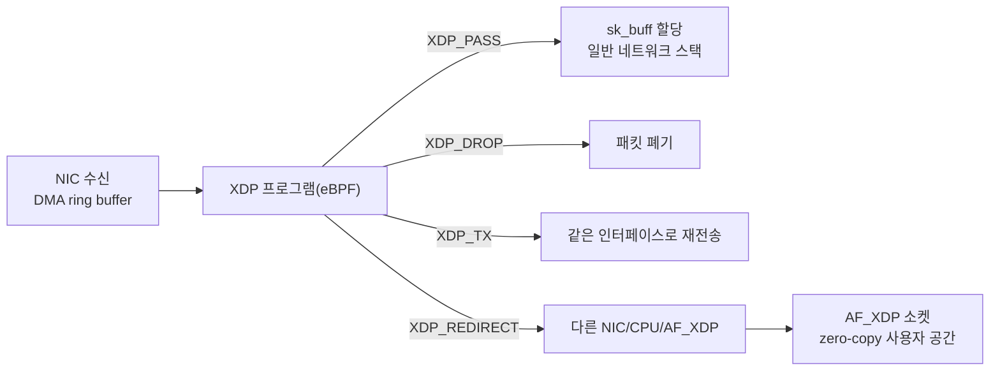

**XDP(eXpress Data Path)**와 **eBPF(extended Berkeley Packet Filter)**는 커널 소스를 고치지 않고도 네트워크 드라이버 계층에서 패킷을 조기에 검사·처리할 수 있게 해 주는 프로그래밍 인터페이스입니다. 소켓까지 패킷이 올라오기 전, 즉 `sk_buff`가 할당되기도 전에 커널이 검증한 소규모 프로그램이 실행되어 DROP·PASS·REDIRECT 같은 결정을 내리므로, DDoS 완화·로드밸런싱·패킷 필터링처럼 초당 수백만 패킷을 다뤄야 하는 워크로드에서 커널 스택 전체를 거치는 비용을 줄일 수 있습니다. 이 장은 커널 바이패스 계열 기법 중 "커널 안에 머무르면서" 패킷 경로를 단축하는 접근을 다루며, verifier가 어떻게 안전성을 보장하는지와 2025~2026년 사이 논의되는 verifier 확장(BPF Token, 동적 스택 alloca)까지 개관합니다.

## 이 장을 읽기 전에

**완전한 초보자?** 이 장은 바로 앞 장인 [08장: io_uring 개요](/post/os-optimization/io-uring-overview-fundamentals/)와 함께 "커널 바이패스 개요" 3부작(07 커널 바이패스 총론, 08 스토리지/파일 I/O, 09 네트워킹)의 마지막 편이며, [02장: Syscall 비용과 최소화 기법](/post/os-optimization/syscall-cost-minimization/)에서 다룬 "커널 진입 비용"과 [07장: 커널 바이패스 개요](/post/os-optimization/kernel-bypass-overview/)에서 소개한 "사용자 공간 vs 커널 내부 단축" 구도를 전제로 합니다. eBPF가 "커널이 검증한 뒤 커널 안에서 실행하는 프로그램"이라는 점만 알면 충분합니다.

**이 장의 깊이**: 이 장은 **중급**을 대상으로 합니다. XDP가 패킷 경로의 어디에서 실행되는지, eBPF verifier가 안전성을 어떻게 보장하는지, 그리고 BPF Token·동적 스택 alloca 같은 최신 verifier 확장 논의를 다룹니다. **다루지 않는 것**: XDP/eBPF 프로그램의 실전 구현(맵 설계, tail call, CO-RE 빌드 파이프라인)과 패킷 처리 파이프라인 심화는 아직 집필되지 않은 **Tr.12(네트워크 최적화)**의 범위이므로 여기서는 개요만 제공하고 존재하지 않는 링크는 걸지 않습니다. eBPF/XDP 운영 시 보안·권한 경계와 프로덕션 트레이드오프의 심화 논의는 이미 게시된 [17장: eBPF·커널 경계와 성능 안전](/post/os-optimization/ebpf-xdp-kernel-boundary-performance-safety-expert/)에 위임합니다. IRQ·NAPI 인터럽트 처리 자체의 최적화는 [12장: IRQ 최적화](/post/os-optimization/irq-interrupt-optimization/)를 참고하세요.

## 당신의 수준에 맞는 경로

| 수준 | 읽을 부분 | 핵심 목표 |
|------|---------|---------|
| **초보자** | "역사와 배경" ~ "핵심 개념과 동작 원리" | XDP/eBPF가 패킷 경로의 어디서, 왜 빠른지 이해 |
| **중급자** | "verifier와 안전성" ~ "흔한 오개념" | verifier가 보장하는 것과 보장하지 않는 것을 구분 |
| **전문가** | "판단 기준" ~ "비판적 시각" | XDP 도입 여부 판단과 최신 verifier 확장의 트레이드오프 평가 |

---

## 역사와 배경

**BPF(Berkeley Packet Filter)**는 1992년 Steven McCanne와 Van Jacobson이 발표한 패킷 필터링 기법에서 출발했습니다. 커널 안에 작은 가상 머신을 두고 사용자 공간에서 내려준 필터 바이트코드를 실행해, 관심 없는 패킷을 커널이 조기에 버리게 하는 것이 원래 아이디어였습니다. 이 구조는 2014년 Alexei Starovoitov가 **eBPF(extended BPF)**로 확장하면서 Linux 3.18에 병합되었고, 레지스터 수·명령어 집합·맵(map)이라는 커널-사용자 공간 공유 자료구조가 추가되어 네트워킹을 넘어 트레이싱·보안·관측성 전반의 범용 실행 환경으로 발전했습니다. **XDP**는 2016년 Jesper Dangaard Brouer, Starovoitov, David Miller 등이 제안해 Linux 4.8(2016년 10월)에 병합되었으며, eBPF 프로그램을 네트워크 드라이버의 수신 경로 가장 이른 지점에 붙이는 훅을 제공합니다. 즉 eBPF는 "커널 안에서 안전하게 실행 가능한 프로그램 모델"이고, XDP는 그 모델을 네트워크 수신 경로의 특정 지점에 적용한 것입니다.

## 핵심 개념과 동작 원리

XDP 프로그램은 NIC 드라이버가 DMA로 패킷을 링 버퍼에 받은 직후, 아직 `sk_buff`(커널 표준 패킷 구조체)를 할당하기 전에 실행됩니다. 이 지점은 일반적인 네트워크 스택(라우팅 테이블 조회, netfilter 훅, 소켓 큐잉)을 전혀 거치지 않은 가장 이른 시점이므로, 패킷을 버리거나 다른 곳으로 돌리는 결정을 캐시 친화적이고 할당 없는 경로로 처리할 수 있습니다. XDP는 세 가지 동작 모드를 지원하는데, **generic(SKB) 모드**는 드라이버 지원 없이 커널이 소프트웨어적으로 흉내 내는 방식이라 성능 이득이 제한적이고, **native(driver) 모드**는 드라이버가 직접 훅을 호출해 이른 지점의 이점을 실제로 얻으며, **offloaded 모드**는 일부 스마트 NIC이 XDP 바이트코드를 NIC 자체에서 실행해 호스트 CPU를 아예 쓰지 않습니다. XDP 프로그램은 처리 후 `XDP_PASS`(정상 스택으로 전달), `XDP_DROP`(폐기), `XDP_TX`(같은 인터페이스로 재전송), `XDP_REDIRECT`(다른 인터페이스·CPU·AF_XDP 소켓으로 전달), `XDP_ABORTED`(오류, DROP과 유사하게 처리) 중 하나를 반환합니다([eBPF Docs: BPF_PROG_TYPE_XDP](https://docs.ebpf.io/linux/program-type/BPF_PROG_TYPE_XDP/)).



**AF_XDP**는 `XDP_REDIRECT`의 특수한 대상으로, 커널 스택을 완전히 우회해 패킷을 사용자 공간 공유 메모리(UMEM)로 직접 전달하는 소켓 주소 체계입니다. RX/TX 링과 FILL/COMPLETION 링으로 버퍼 소유권을 주고받으며, 드라이버와 NIC이 zero-copy를 지원하면 데이터 복사 없이 패킷을 사용자 공간에서 바로 다룰 수 있고, 지원하지 않으면 커널이 자동으로 copy 모드로 폴백합니다([Linux Kernel Docs: AF_XDP](https://docs.kernel.org/networking/af_xdp.html)). 이 zero-copy 경로의 실전 활용(버퍼 관리, 멀티 큐 분배)은 패킷 처리 심화를 다루는 **Tr.12(네트워크 최적화)**의 범위이며, 이 장에서는 XDP 경로의 종착점 중 하나로만 소개합니다.

## verifier와 안전성 보장

eBPF 프로그램은 커널에 로드되기 전 **verifier**라는 정적 분석기를 통과해야 합니다. verifier는 프로그램의 모든 실행 경로를 시뮬레이션하면서 포인터 산술이 항상 유효한 범위 안에 있는지, 스택 접근이 초기화된 영역만 건드리는지, 루프가 유한한 상한을 갖는지(커널 5.3부터 bounded loop 지원), 맵 접근 시 타입이 일치하는지를 검사합니다. 검증을 통과한 프로그램만 JIT 컴파일러가 네이티브 기계어로 변환하며, 이 JIT 변환이 있어야 인터프리터 오버헤드 없이 드라이버 수신 경로 안에서 실행할 만한 속도가 나옵니다. verifier의 검사는 "이 프로그램이 크래시를 일으키지 않는다"는 것을 보장하는 것이지 "이 프로그램이 빠르다"거나 "이 프로그램이 의도한 정책을 올바르게 구현했다"는 것을 보장하지 않는다는 점이 중요합니다.

## eBPF verifier 확장: BPF Token과 동적 스택 alloca

**BPF Token**은 Andrii Nakryiko가 제안해 Linux 6.9(2024)에 병합된 위임(delegation) 메커니즘입니다([eBPF Docs: Token](https://docs.ebpf.io/linux/concepts/token/)). 기존에는 eBPF 프로그램을 로드하려면 `CAP_BPF`를 포함한 강력한 권한이 필요했고, 이 권한은 네임스페이스로 안전하게 격리할 수 없었습니다(eBPF 헬퍼가 임의 커널 메모리를 읽을 수 있기 때문). LWN에 공개된 패치 설명은 이를 "특권을 가진 시스템 데몬의 BPF 서브시스템 기능 일부를, userns에 묶인 BPF 파일시스템의 특수 마운트 옵션을 통해 신뢰된 비특권 애플리케이션에게" 위임하는 구조로 설명합니다([LWN: BPF token](https://lwn.net/Articles/959350/)). `BPF_TOKEN_CREATE`로 생성한 토큰을 bpffs 마운트에서 파생시켜 컨테이너 안의 비특권 프로세스에 넘기면, 커널은 `CAP_BPF`·`CAP_PERFMON`·`CAP_NET_ADMIN` 등에 대해 전역(`capable()`) 검사 대신 네임스페이스 범위(`ns_capable()`) 검사를 적용해, 컨테이너 런타임이나 systemd 같은 신뢰된 데몬이 "이 종류의 프로그램만" 로드하도록 정밀하게 위임할 수 있습니다.

**동적 스택 alloca**는 아직 병합되지 않은 커널 메일링 리스트 논의 단계의 주제입니다. 현재 eBPF 프로그램의 스택은 컴파일 시점에 고정된 크기(기본 512바이트)로 제한되어 있어, C의 `alloca`나 가변 길이 배열(VLA)처럼 실행 중에 크기가 정해지는 지역 버퍼를 표현할 수 없습니다. 논의되는 접근은 전용 레지스터 하나를 스택 포인터 확장 용도로 예약해 런타임에 스택 프레임을 늘리는 방식이며, 이 경우 해당 레지스터는 일반 레지스터 할당에서 제외되는 트레이드오프가 따릅니다. 이 기능은 **구현정의**이자 **논의 중인 제안**이므로, verifier 문서와 커널 메일링 리스트에서 실제 병합 여부와 커널 버전을 확인한 뒤 의존해야 합니다.

## 흔한 오개념 교정

**"XDP는 커널을 완전히 우회한다"는 것은 정확하지 않습니다.** XDP는 DPDK처럼 NIC을 커널에서 떼어내 사용자 공간 드라이버로 전부 넘기는 방식이 아니라, 여전히 커널 드라이버 안에서 실행되는 훅입니다. 커널이 검증하고 커널 컨텍스트에서 실행되므로 표준 드라이버·모니터링 도구와 공존할 수 있다는 것이 DPDK류 완전 바이패스와 다른 지점이며, [07장](/post/os-optimization/kernel-bypass-overview/)에서 이 스펙트럼을 다룹니다.

**"eBPF는 검증을 통과하면 항상 빠르다"는 것도 오해입니다.** verifier는 안전성만 보장하며, 프로그램이 맵을 얼마나 자주 조회하는지, 헬퍼 함수를 얼마나 무겁게 호출하는지에 따라 실측 처리량은 크게 달라집니다. generic 모드로 붙은 XDP 프로그램은 native 모드보다 이점이 훨씬 작을 수 있으므로, "XDP를 붙였다"와 "XDP의 이점을 얻었다"는 다른 이야기입니다.

**"XDP_DROP이면 netfilter/iptables를 대체할 수 있다"는 것도 과장입니다.** XDP는 상태를 스스로 관리하지 않으므로 커넥션 트래킹 같은 상태 기반 정책은 맵을 이용해 직접 구현해야 하고, 복잡한 정책일수록 verifier가 요구하는 정적 검증 제약(유한 루프, 고정 스택) 안에서 표현하기가 까다로워집니다. 단순 조기 폐기·리다이렉트에는 강력하지만 range 매칭이 많은 방화벽 규칙 전체를 그대로 옮기는 용도로는 설계되지 않았습니다.

## 판단 기준

| 상황 | 권장 | 비권장 |
|------|------|--------|
| 초당 수백만 패킷의 단순 DROP/필터(DDoS 1차 완화) | native 모드 XDP | 일반 소켓 필터·iptables만으로 처리 |
| 사용자 공간에서 직접 패킷을 다뤄야 하는 로드밸런서 | AF_XDP(zero-copy) + Tr.12 심화 | 커널 소켓 경유 후 재전송 |
| 복잡한 상태 기반 방화벽 정책 | netfilter/nftables 유지, XDP는 조기 필터링 보조 | XDP 단독으로 전체 정책 이식 |
| 컨테이너에서 비특권 프로세스에 제한된 eBPF 권한 위임 | BPF Token(커널 6.9+) | 컨테이너에 `CAP_BPF` 전체 부여 |
| 드라이버가 native XDP 미지원인 NIC | generic 모드 시험 후 이점 재측정, 필요 시 NIC 교체 검토 | native 모드 이점을 가정하고 설계 |

## 비판적 시각: 한계와 트레이드오프

verifier는 커널에서 가장 복잡한 정적 분석기 중 하나이며, 과거 발견된 다수의 eBPF 관련 CVE가 verifier의 경로 폭발·타입 혼동 취약점에서 나왔습니다. 검증 규칙이 프로그램을 지나치게 보수적으로 거부하면 실무자들이 "왜 이 안전한 코드가 거부되는가"를 파악하기 어려운 디버깅 비용이 생기고, 반대로 규칙을 완화하면 공격 표면이 늘어나는 근본적인 긴장이 있습니다. XDP_REDIRECT와 멀티 큐·RSS(수신 큐 분배)를 함께 쓰면 코어 배치([03장](/post/os-optimization/cpu-pinning-affinity-strategy/), [04장](/post/os-optimization/numa-cpu-affinity-thread-placement/))가 어긋날 때 오히려 캐시 미스가 늘 수 있으므로 도입만으로 성능이 보장되지 않습니다. 드라이버별 native 모드 지원 범위가 벤더·펌웨어 버전마다 달라 이식성이 낮고, BPF Token처럼 새로 추가되는 위임 메커니즘은 아직 배포판·컨테이너 런타임의 채택이 진행 중이라 운영 환경마다 지원 시점이 다릅니다. 동적 스택 alloca 같은 논의 중인 확장은 verifier 복잡도를 더 늘리는 방향이므로, 병합되더라도 초기에는 보수적으로 검증하며 도입하는 편이 안전합니다.

빌드·부착 골격은 다음과 같습니다. 실제 패킷 처리 로직과 맵 설계는 이 개요의 범위를 넘으므로 최소한의 PASS 골격만 보이고, 컴파일·부착 명령으로 verifier가 실제로 관여하는 지점을 확인합니다.

```c
// xdp_pass.c — 최소 XDP 프로그램 골격 (실제 정책은 Tr.12 심화에서 다룰 범위)
#include <linux/bpf.h>
#include <bpf/bpf_helpers.h>

SEC("xdp")
int xdp_pass_prog(struct xdp_md *ctx) {
  return XDP_PASS;  // 모든 패킷을 정상 스택으로 전달 (verifier 통과만 확인하는 최소 예시)
}

char _license[] SEC("license") = "GPL";
```

위 코드는 clang을 BPF 타겟으로 빌드해야 하며, 커널 버전과 libbpf 버전에 따라 헬퍼 시그니처가 달라질 수 있으므로 실제 배포 전에는 대상 커널의 vmlinux BTF와 대조해야 합니다.

```bash
# clang 18, libbpf-dev 설치 환경 기준 (배포판·커널 버전에 따라 옵션이 달라질 수 있음)
clang -O2 -target bpf -c xdp_pass.c -o xdp_pass.o
sudo ip link set dev eth0 xdp obj xdp_pass.o sec xdp   # native 모드 시도, 실패 시 xdpgeneric로 폴백
sudo bpftool prog show   # 로드된 프로그램과 JIT 여부 확인
```

verifier가 프로그램을 거부하면 로드 시 아래와 유사한 로그가 남으며, 이 로그를 읽는 능력이 실무에서 verifier 제약을 체감하는 가장 빠른 방법입니다.

```text
libbpf: prog 'xdp_pass_prog': BPF program load failed: Permission denied
libbpf: prog 'xdp_pass_prog': -- BEGIN PROG LOAD LOG --
R1 type=ctx expected=fp
invalid access to packet, off=14 size=4, R2(id=0,off=0,r=0)
```

## 마무리

이 장을 읽은 뒤 다음을 스스로 확인할 수 있어야 합니다.

- [ ] XDP 프로그램이 패킷 경로의 어느 지점(드라이버, `sk_buff` 할당 이전)에서 실행되는지 설명할 수 있는가?
- [ ] native/generic/offloaded 모드의 차이와 왜 "XDP를 붙였다"만으로 성능 이득이 보장되지 않는지 설명할 수 있는가?
- [ ] eBPF verifier가 보장하는 것(안전성)과 보장하지 않는 것(성능, 정책의 정확성)을 구분할 수 있는가?
- [ ] BPF Token이 해결하는 문제(비특권 컨테이너에 정밀한 eBPF 권한 위임)를 설명할 수 있는가?
- [ ] 동적 스택 alloca가 아직 논의 단계이며 커널 버전을 확인해야 하는 이유를 말할 수 있는가?
- [ ] XDP/AF_XDP 심화 구현과 방화벽 정책 이식의 한계를 판단 기준 표로 구분할 수 있는가?

이 트랙에서는 다음으로 메모리 접근 경로의 TLB 미스 비용을 줄이는 **Huge TLB Pages 활용**을 다룹니다. XDP/AF_XDP처럼 초당 수백만 패킷을 다루는 경로에서는 패킷 버퍼 자체의 TLB 미스도 지연에 기여하므로, 두 장을 이어서 읽으면 "패킷 경로 단축"과 "메모리 접근 단축"이 어떻게 함께 작동하는지 파악할 수 있습니다.

→ [Huge TLB Pages 활용](/post/os-optimization/huge-tlb-pages-utilization/) (챕터 10)
