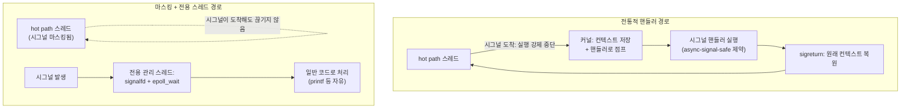

**Signal Handling 오버헤드**란 커널이 비동기 시그널을 프로세스에 전달하고, 사용자 공간 핸들러가 이를 처리한 뒤 원래 실행 흐름으로 복귀하기까지 발생하는 지연 비용을 말합니다. 시그널 하나의 전달 자체는 마이크로초 이하로 끝나는 경우가 많지만, 진짜 문제는 절대 비용이 아니라 **예측 불가능한 시점에 임의의 실행 흐름을 강제로 끼어든다**는 점입니다. 블로킹 syscall이 `EINTR`로 실패해 재시도 루프를 돌게 만들거나, 핸들러 안에서 async-signal-safe하지 않은 함수를 호출해 데드락·데이터 손상을 유발하거나, 실시간 시그널 큐가 가득 차 이벤트를 잃는 상황은 모두 꼬리 지연(tail latency)의 흔한 원인입니다. 이 장에서는 시그널이 전달되는 내부 메커니즘, `EINTR`·실시간 시그널 큐잉이 만드는 함정을 살펴본 뒤, **signalfd**로 시그널을 이벤트 루프에 편입하거나 저지연 스레드에서 시그널을 아예 마스킹해 회피하는 전략을 다룹니다.

## 이 장을 읽기 전에

**선행 챕터**: [Context Switch 비용 분석과 회피](/post/os-optimization/context-switch-cost-avoidance/)(챕터 01)에서 실행 중인 스레드가 교체되는 비용을, [Syscall 비용과 최소화 기법](/post/os-optimization/syscall-cost-minimization/)(챕터 02)에서 user/kernel 모드 전환 비용을 다뤘습니다. 시그널 전달은 이 둘과 겹치면서도 다릅니다 — 스레드 자체가 교체되지는 않지만(챕터 01과 구분), 커널이 사용자 코드의 실행을 강제로 끊고 핸들러로 점프시킨 뒤 되돌아온다는 점에서 syscall 진입·탈출(챕터 02)과 유사한 전환 비용을 수반합니다.

**전제 지식**: `signal()`/`sigaction()`으로 핸들러를 등록해 본 경험, user/kernel 모드 전환의 기본 개념, 파일 디스크립터를 `epoll`로 감시하는 기본 패턴이면 충분합니다.

**이 장의 깊이**: **중급**입니다. 시그널이 커널에서 전달되는 시점과 비용의 출처, `EINTR`과 `SA_RESTART`, 실시간 시그널(`SIGRTMIN`~`SIGRTMAX`) 큐잉과 오버플로우, `signalfd`로 핸들러를 fd 기반 이벤트로 바꾸는 방법, 저지연 스레드에서 시그널을 마스킹해 완전히 피하는 설계까지 다룹니다.

**다루지 않는 것**: 시그널을 이용한 프로세스 생존·재시작 아키텍처 설계는 [챕터 16: Process vs Thread 아키텍처 선택](/post/os-optimization/process-vs-thread-architecture-choice/)에서, 스케줄링 정책 자체는 [챕터 05: Realtime 스케줄링](/post/os-optimization/realtime-scheduling-sched-ext-eevdf/)에서 각각 다룹니다. 이 장은 POSIX 시그널 문법(`signal()` vs `sigaction()`의 차이 등) 자체는 전제 지식으로 두고, 오버헤드의 출처와 회피 전략에 집중합니다.

## 당신의 수준에 맞는 경로

| 수준 | 읽을 부분 | 핵심 목표 |
|------|---------|---------|
| **입문** | "시그널 전달 메커니즘" ~ "EINTR과 syscall 재시작" | 시그널이 왜 비용을 수반하고 `EINTR`이 왜 생기는지 이해 |
| **중급자** | "실시간 시그널과 큐 오버플로우" ~ "signalfd로 이벤트 루프에 편입하기" | 큐 오버플로우 위험과 `signalfd` 적용 |
| **전문가** | "저지연 경로에서 시그널 회피하기" ~ "비판적 시각" | 마스킹 + 전용 스레드 설계와 트레이드오프 판단 |

---

## 시그널 모델의 역사와 배경

초기 Unix의 시그널은 "unreliable signals"였습니다 — 핸들러가 호출되는 순간 disposition이 기본값(`SIG_DFL`)으로 되돌아가 버려, 핸들러 안에서 같은 시그널이 다시 오면 기본 동작(대개 종료)이 발생하는 경쟁 조건이 있었습니다. 1983~1984년 공개된 **4.2BSD**는 이 문제를 고친 "reliable signals"를 도입했습니다. 핸들러 실행 중에는 그 시그널(그리고 `sa_mask`로 지정한 다른 시그널)을 자동으로 블록해, 핸들러가 재귀적으로 자신을 인터럽트하지 않도록 만든 것입니다. 이 모델은 이후 IEEE POSIX.1 표준의 시그널 API(`sigaction()`, `sigprocmask()`)의 기반이 되었습니다. **실시간 시그널**(`SIGRTMIN`~`SIGRTMAX`)은 POSIX.1b 실시간 확장에서 정의되었고 이후 POSIX.1-2001에 통합되었으며, 표준 시그널과 달리 여러 인스턴스를 큐에 쌓고 `sigqueue()`로 정수·포인터 데이터를 함께 실어 보낼 수 있다는 점이 핵심 차이입니다.

## 시그널 전달 메커니즘 (내부 동작)

시그널은 발생 즉시 실행되지 않습니다. 커널은 대상 태스크에 대해 pending 상태로 표시해 두고, 그 태스크가 사용자 모드로 복귀하는 시점(syscall 반환 직전, 또는 스케줄러가 그 태스크를 다시 실행시키는 시점)에 마스킹되지 않은 pending 시그널이 있는지 확인합니다. 처리할 시그널이 있으면 커널은 현재 프로그램 카운터·레지스터·시그널 마스크를 사용자 스택(또는 `sigaltstack()`으로 지정한 대체 스택)에 저장하고, 프로그램 카운터를 핸들러의 시작 주소로 바꿔치기한 뒤 사용자 모드로 복귀시킵니다. 핸들러가 반환하면 실행은 커널이 미리 심어둔 signal trampoline 코드로 이어지고, 그 코드가 `sigreturn()` 계열 syscall을 호출해 저장해 둔 원래 컨텍스트를 복원합니다. 이 전체 과정 — 컨텍스트 저장, 핸들러 진입/이탈, `sigreturn` — 은 일반 함수 호출보다 훨씬 무겁고, 대상 스레드가 다른 코어에서 실행 중이면 그 코어에 인터럽트(IPI)를 보내 즉시 확인시켜야 하므로 비용이 더 커집니다.

lmbench 계열 벤치마크(`lat_sig`)로 측정한 예시 수치는 시그널 핸들러 등록에 수 마이크로초, 핸들러 호출·복귀 한 사이클에 또 몇 마이크로초가 걸리는 수준을 보여준 사례가 있습니다. 다만 이런 수치는 오래된 하드웨어·커널 버전에서 나온 예시이고 CPU 세대·커널의 시그널 처리 경로 최적화 정도에 따라 크게 달라지므로, 절대값을 그대로 인용하기보다는 "동일 코어에서의 syscall 진입·탈출(챕터 02)과 비슷한 자릿수이거나 그보다 크다"는 상대적 감각으로 받아들이고, 실제 배포 환경에서는 `lat_sig`나 직접 작성한 벤치마크로 재측정해야 합니다.

## EINTR과 syscall 재시작

블로킹 syscall(`read`, `write`, `accept`, `nanosleep` 등)이 대기하는 동안 시그널이 전달되면, 그 syscall은 작업을 완료하지 못한 채 `-1`과 `errno = EINTR`을 반환할 수 있습니다. `sigaction()`에 `SA_RESTART` 플래그를 주면 커널이 일부 syscall을 자동으로 재시작해 주지만, 이는 신뢰할 수 있는 전체 목록이 아닙니다 — 어떤 syscall이 재시작 대상인지는 커널·syscall 종류에 따라 다르며, 재시작되더라도 결국 커널 진입·탈출을 한 번 더 거친다는 사실 자체는 사라지지 않습니다. 즉 `SA_RESTART`는 "코드가 깨지지 않게" 해줄 뿐, 시그널이 잦은 환경에서 syscall이 반복적으로 중단·재시작되며 쌓이는 추가 비용을 없애 주지는 않습니다.

다음은 `EINTR`을 무시했을 때 생기는 흔한 버그입니다.

```cpp
// 깨진 코드: read()의 반환값을 검사하지 않고 buf가 항상 채워졌다고 가정
ssize_t n = read(fd, buf, len);
process(buf, n);  // 시그널에 의해 n == -1(EINTR)이면 buf는 이전 내용 그대로인데
                   // 그걸 유효한 데이터로 처리해 버린다
```

**원인**은 `read()`가 시그널에 의해 중단되면 데이터를 전혀 채우지 않고 실패로 반환한다는 사실을 무시한 것입니다. 저지연 서비스에서는 이런 코드가 시그널이 거의 오지 않는 개발 환경에서는 통과하다가, 운영 환경에서 주기적인 타이머 시그널이나 모니터링 시그널이 겹치는 순간에만 드물게 재현되는 버그가 됩니다. 올바른 구현은 `EINTR`을 명시적으로 잡아 재시도하는 것입니다.

```cpp
#include <cerrno>
#include <unistd.h>

// EINTR이면 조용히 재시도한다. 그 외 에러(EAGAIN 등)는 호출자가 처리하도록 그대로 전달.
ssize_t read_retry(int fd, void* buf, size_t len) {
  ssize_t n;
  do {
    n = read(fd, buf, len);
  } while (n < 0 && errno == EINTR);
  return n;
}
```

**검증**은 `strace -e trace=read,rt_sigaction -e signal ./binary`로 `read` 호출 중간에 시그널이 끼어드는 순간을 관찰하거나, 테스트 환경에서 `kill -USR1 $PID`를 짧은 간격으로 반복 발사하면서 재시도 루프가 실제로 `EINTR`을 흡수하는지 확인하는 스트레스 테스트로 할 수 있습니다.

## 실시간 시그널과 큐 오버플로우

표준 시그널(`SIGUSR1` 등)은 같은 종류가 이미 pending 상태일 때 추가로 발생해도 하나로 병합됩니다 — 즉 발생 횟수를 신뢰할 수 없습니다. **실시간 시그널**(`SIGRTMIN`~`SIGRTMAX`)은 이 문제를 고쳐 여러 인스턴스가 큐에 쌓이고, 같은 시그널끼리는 보낸 순서대로, 서로 다른 시그널은 번호가 낮은 것부터 전달됩니다. 하지만 큐에는 한도가 있습니다 — 리눅스 2.6.8부터는 `RLIMIT_SIGPENDING`(사용자별 큐잉 가능한 시그널 총수 한도)로 이 한도를 제어하며, 큐가 가득 찬 상태에서 `sigqueue()`를 다시 호출하면 그 호출이 실패합니다(이미 큐에 있는 인스턴스가 유실되는 것이 아니라, 새로 보내려는 시그널이 전달되지 못하는 상황입니다). 초당 수천 건 이상의 실시간 시그널을 보내는 설계에서는 수신 측 처리가 잠시라도 지연되면 이 한도에 부딪혀 이벤트가 조용히 사라질 수 있으므로, 큐 길이에 여유를 두거나 애초에 시그널 대신 다른 통지 수단을 쓰는 편이 안전합니다.

```bash
# 현재 사용자의 실시간 시그널 큐 한도(soft limit) 확인
ulimit -i
# 예: 63413 (시스템·설정에 따라 다름)
```

## async-signal-safe 제약과 핸들러 설계

시그널 핸들러는 메인 실행 흐름을 임의의 지점에서 끊고 끼어드는 코드이므로, 인터럽트당한 코드가 마침 어떤 함수 내부의 정적 버퍼나 락을 만지던 중이었을 수 있습니다. 그 상태에서 핸들러가 같은 함수를 다시 호출하면 일관성 없는 상태에 대해 동작해 예측 불가능한 결과(데드락, 데이터 손상)를 낳습니다. 이 때문에 표준은 핸들러 안에서 호출해도 안전한 **async-signal-safe** 함수 목록만을 보장하며, `printf()`나 `malloc()`처럼 내부 락·버퍼를 쓰는 대다수의 표준 라이브러리 함수는 이 목록에 없습니다.

```cpp
#include <csignal>
#include <cstdio>

// 깨진 코드: 핸들러 안에서 async-signal-safe하지 않은 printf를 호출
void handler(int) {
  printf("signal received\n");  // 위험: printf의 내부 버퍼/락이 메인 흐름과 경합할 수 있다
}
```

**원인**은 메인 스레드가 마침 다른 `printf` 호출 중에 이 핸들러로 인터럽트되면, 두 호출이 같은 내부 버퍼·락 상태를 두고 경합해 데드락(락을 다시 잡으려다 자기 자신을 기다림)이나 출력 손상이 생길 수 있다는 점입니다. 올바른 구현은 핸들러 안에서는 `volatile sig_atomic_t` 플래그만 쓰고, 실제 처리는 핸들러 밖의 안전한 지점으로 미루는 것입니다.

```cpp
#include <csignal>

volatile sig_atomic_t g_shutdown_requested = 0;

void handler(int) {
  g_shutdown_requested = 1;  // sig_atomic_t에 대한 단순 쓰기만 수행: async-signal-safe
}

// 메인 루프는 이 플래그를 폴링하거나, 뒤에서 다룰 signalfd로 아예 핸들러 자체를 없앤다.
```

**검증 도구**는 마땅치 않습니다 — 시그널 컨텍스트에서의 재진입 문제는 AddressSanitizer/ThreadSanitizer로도 안정적으로 잡히지 않으므로, `man7 signal-safety(7)`의 async-signal-safe 함수 목록을 코드 리뷰 체크리스트로 삼고, 핸들러 본문을 플래그 설정 한두 줄로 최소화하는 원칙을 지키는 것이 가장 확실한 방어입니다.

## signalfd로 이벤트 루프에 편입하기

**signalfd**는 시그널을 핸들러 콜백이 아니라 **읽을 수 있는 파일 디스크립터**로 바꿔주는 리눅스 전용 메커니즘입니다. 대상 시그널을 `sigprocmask()`로 먼저 블록해 기본 동작(예: `SIGTERM`의 종료)이 발생하지 않게 한 뒤, `signalfd()`로 만든 fd를 `epoll`에 등록하면 시그널이 다른 I/O 이벤트와 동일한 방식으로 이벤트 루프에 편입됩니다. `read()`로 받는 `signalfd_siginfo` 구조체 안에서는 async-signal-safe 제약이 전혀 적용되지 않습니다 — 이 코드는 시그널 핸들러가 아니라 평범한 `read()` 호출의 결과를 처리하는 일반 코드이기 때문입니다.

```cpp
#include <cstdio>
#include <csignal>
#include <unistd.h>
#include <sys/signalfd.h>
#include <sys/epoll.h>

int main() {
  sigset_t mask;
  sigemptyset(&mask);
  sigaddset(&mask, SIGUSR1);
  sigaddset(&mask, SIGTERM);

  // 반드시 먼저 블록해야 한다 — 블록하지 않으면 기본 동작(SIGTERM 종료 등)이 그대로 발생한다.
  if (sigprocmask(SIG_BLOCK, &mask, nullptr) == -1) return 1;

  int sfd = signalfd(-1, &mask, SFD_NONBLOCK);
  if (sfd == -1) return 1;

  int epfd = epoll_create1(0);
  epoll_event ev{};
  ev.events = EPOLLIN;
  ev.data.fd = sfd;
  epoll_ctl(epfd, EPOLL_CTL_ADD, sfd, &ev);

  epoll_event events[8];
  while (true) {
    int n = epoll_wait(epfd, events, 8, -1);
    for (int i = 0; i < n; ++i) {
      if (events[i].data.fd != sfd) continue;
      signalfd_siginfo si;
      while (read(sfd, &si, sizeof(si)) == sizeof(si)) {
        if (si.ssi_signo == SIGTERM) return 0;
        // SIGUSR1 등은 여기서 일반 코드처럼 자유롭게(printf 포함) 처리해도 안전하다
      }
    }
  }
}
```

`g++ -O2 -std=c++17 sfd_demo.cpp -o sfd_demo`로 빌드해 실행한 뒤 다른 터미널에서 `kill -USR1 <pid>`를 보내 확인할 수 있습니다. 주의할 점 두 가지가 있습니다. 첫째, `signalfd`는 `SIGSEGV`처럼 동기적으로(실행 중 오류로) 발생하는 시그널은 받을 수 없습니다 — 그런 시그널은 여전히 전통적인 핸들러가 필요합니다. 둘째, 프로세스가 `fork()`한 뒤 자식이 signalfd로 시그널을 `read()`할 수는 있지만 `epoll_wait()`는 그 fd가 준비됐다고 알려주지 않으므로, 자식 프로세스에서는 이 패턴이 그대로 동작하지 않습니다.

## 저지연 경로에서 시그널을 회피하는 전략

가장 확실한 저지연 전략은 "시그널을 아예 안 받는 것"입니다. 프로세스 시작 시 모든 스레드에서 관심 있는 시그널을 `pthread_sigmask()`로 블록해 두고, 그 시그널들을 실제로 처리할 **전용 관리 스레드** 하나만 `signalfd`(또는 `sigwaitinfo()`)로 동기적으로 기다리게 하면, 데이터 경로(hot path) 스레드는 시그널에 의해 실행이 끊기는 일 자체가 없어집니다. 시그널 마스크는 `fork()` 시 자식에게 그대로 상속되므로, 스레드 풀을 생성하는 시점에 마스크를 설정해 두면 이후 만들어지는 모든 워커 스레드에 일관되게 적용할 수 있습니다. 주기적인 작업을 `SIGALRM`/`alarm()`으로 구현해 온 코드가 있다면, 커널이 만료 시각을 알려주는 fd를 만들어 `epoll`로 감시할 수 있는 `timerfd_create()` 계열로 옮기면 시그널 경로 자체를 없앨 수 있습니다. 컨테이너 오케스트레이터가 보내는 `SIGTERM` 같이 반드시 받아야 하는 시그널도, 지정된 한 스레드만 받게 하고 hot path 스레드는 마스킹된 상태를 유지하면 종료 처리와 저지연 요구사항을 함께 만족시킬 수 있습니다.



## 흔한 오개념

- **"시그널 핸들러 안에서는 어떤 함수든 호출해도 안전하다"**: 아닙니다. 핸들러는 메인 실행 흐름을 임의의 지점에서 끊고 들어오므로, `async-signal-safe`로 명시된 함수만 안전합니다. `printf`·`malloc`처럼 내부 락·버퍼를 쓰는 함수는 재진입 시 데드락·손상을 일으킬 수 있습니다.
- **"실시간 시그널은 큐잉되니 절대 유실되지 않는다"**: 아닙니다. `RLIMIT_SIGPENDING`으로 정해진 큐 한도에 도달하면 새로 보내려는 `sigqueue()` 호출 자체가 실패합니다. 발생량이 처리 속도를 지속적으로 앞지르면 이벤트가 전달되지 못할 수 있습니다.
- **"SA_RESTART를 걸면 모든 블로킹 syscall이 자동으로 이어진다"**: 아닙니다. 어떤 syscall이 재시작 대상인지는 syscall·커널 버전에 따라 다르고, 재시작되더라도 커널 진입·탈출을 한 번 더 거치는 비용은 그대로 남습니다.

## 판단 기준 (언제 쓰고 언제 피할지)

| 상황 | 권장 | 비권장 |
|------|------|--------|
| 저지연 hot path 스레드가 시그널을 받을 이유가 없음 | `pthread_sigmask()`로 블록, 전용 스레드가 처리 | 모든 스레드가 기본 마스크로 시그널을 받게 방치 |
| 시그널을 다른 I/O 이벤트와 같은 루프에서 처리 | `signalfd` + `epoll` | 핸들러 안에서 직접 무거운 로직 실행 |
| 핸들러 안에서 상태를 남겨야 함 | `volatile sig_atomic_t` 플래그만 설정 | `printf`·`malloc` 등 비동기-시그널-불안전 함수 호출 |
| 주기적 타이머가 필요함 | `timerfd_create()` + `epoll` | `alarm()`/`SIGALRM` 반복 사용 |
| 블로킹 syscall이 시그널로 중단될 수 있음 | 반환값을 확인해 `EINTR`을 명시적으로 재시도 | 반환값 무시, 또는 `SA_RESTART`만 믿고 방치 |
| 초당 수천 건 이상의 실시간 시그널 통지가 필요함 | 큐 한도(`RLIMIT_SIGPENDING`)를 늘리거나 다른 통지 수단(공유 메모리 플래그, 락프리 큐) 검토 | 기본 한도로 무제한 통지가 가능하다고 가정 |

## 비판적 시각: 한계와 트레이드오프

`signalfd`는 리눅스 전용 API로 POSIX 표준에 없으므로, 다른 유닉스 계열이나 이식성을 요구하는 코드에서는 전통적인 핸들러나 `sigwaitinfo()`로의 폴백 경로가 필요합니다. 마스킹 + 전용 스레드 전략은 설계 복잡성을 늘립니다 — 마스크가 스레드 생성 순서·`fork()` 시점에 제대로 상속되었는지, 새로 추가되는 스레드가 실수로 기본 마스크를 쓰지는 않는지 지속적으로 점검해야 합니다. 그리고 이 전략으로도 피할 수 없는 시그널이 있습니다 — `SIGKILL`과 `SIGSTOP`은 애초에 블록·마스킹·커스텀 핸들러 등록이 불가능하도록 커널이 강제하므로, "시그널 회피"는 어디까지나 애플리케이션이 다루기로 선택한 시그널에 한정된 이야기입니다. 마지막으로, 실시간 시그널 큐 오버플로우는 애플리케이션 레벨에서 감지하기 까다롭습니다 — `sigqueue()` 실패는 보내는 쪽에서만 관찰되므로, 받는 쪽 처리 지연이 원인이라면 모니터링 지표(큐 한도 대비 사용량, 실패한 송신 횟수)를 별도로 남겨 두지 않으면 유실을 뒤늦게야 알아차리게 됩니다.

## 마무리

- [ ] 시그널이 커널에서 전달되는 시점(사용자 모드 복귀 직전)과 비용의 출처(컨텍스트 저장, 핸들러 진입/이탈, `sigreturn`)를 설명할 수 있다.
- [ ] `EINTR`이 왜 발생하고 `SA_RESTART`가 무엇을 보장하지 않는지 설명할 수 있다.
- [ ] 표준 시그널의 병합과 실시간 시그널의 큐잉·`RLIMIT_SIGPENDING` 오버플로우 위험을 구분할 수 있다.
- [ ] async-signal-safe 제약을 이해하고, 핸들러를 `sig_atomic_t` 플래그 설정으로 최소화하거나 `signalfd`로 대체할 수 있다.
- [ ] 저지연 hot path 스레드에서 시그널을 마스킹하고 전용 스레드로 위임하는 설계를 적용할 수 있다.
- [ ] `signalfd`의 한계(동기적 시그널 불가, `fork()` 이후 `epoll_wait` 미동작)를 설명할 수 있다.

**참고 문서**: [man7.org: signal(7)](https://man7.org/linux/man-pages/man7/signal.7.html), [man7.org: signalfd(2)](https://man7.org/linux/man-pages/man2/signalfd.2.html), [man7.org: signal-safety(7)](https://man7.org/linux/man-pages/man7/signal-safety.7.html), [man7.org: sigaction(2)](https://man7.org/linux/man-pages/man2/sigaction.2.html).

다음 장에서는 **Process vs Thread 아키텍처 선택**을 다룹니다. 시그널을 어느 단위(프로세스 전체, 특정 스레드)로 마스킹·전달할지는 결국 프로세스와 스레드 중 어떤 아키텍처를 선택했는지에 달려 있으므로, 이 장의 마스킹 전략을 실제로 적용하기 전에 다음 장의 아키텍처 판단 기준을 함께 읽는 것이 좋습니다.

→ [Process vs Thread 아키텍처 선택](/post/os-optimization/process-vs-thread-architecture-choice/) (챕터 16)
