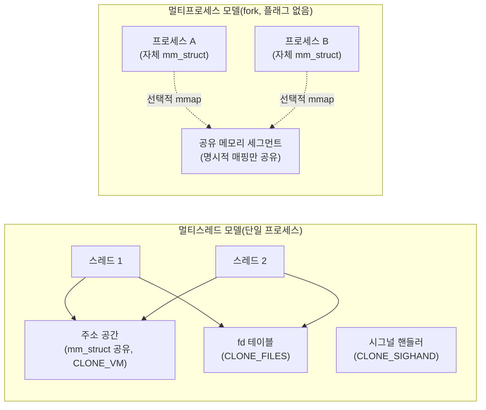

**Process vs Thread 아키텍처 선택**이란 저지연 서비스를 설계할 때 실행 단위를 프로세스(독립된 주소 공간)로 나눌지, 스레드(공유된 주소 공간)로 나눌지를 자원 격리 비용과 통신 비용의 트레이드오프로 판단하는 문제를 말합니다. 이 선택은 코드를 다 짜고 나서 리팩터링으로 손쉽게 뒤집을 수 있는 결정이 아닙니다 — 장애 하나가 서비스 전체를 무너뜨릴지, 공유 자료구조를 잠금 없이 주고받을 수 있을지, 서로 다른 언어·런타임을 조합할 수 있을지가 이 결정 하나에 걸려 있습니다. 이 장에서는 커널이 프로세스와 스레드를 실제로 어떻게 구분하는지(`clone()` 플래그 수준)부터 시작해, 생성 비용과 통신 비용의 구조적 차이, 그리고 저지연 서비스에서 이 둘을 고르는 실전 판단 기준까지 정리합니다.

## 이 장을 읽기 전에

**선행 장**: 이 트랙의 인트로([OS·런타임 Low-latency 운영환경](/post/os-optimization/getting-started-os-runtime-performance-tuning/))는 이 장을 01~03장보다 먼저 읽으라고 권장합니다. 프로세스/스레드의 기본 모델을 먼저 맞춰야 컨텍스트 스위치([01장](/post/os-optimization/context-switch-cost-avoidance/))·syscall 비용([02장](/post/os-optimization/syscall-cost-minimization/))·affinity([03장](/post/os-optimization/cpu-pinning-affinity-strategy/))·signal handling([15장](/post/os-optimization/signal-handling-overhead-avoidance/))에서 "왜 스레드 전환이 프로세스 전환보다 싼가", "왜 시그널 핸들러 공유가 문제가 되는가" 같은 설명이 자연스럽게 이어지기 때문입니다.

**전제 지식**: CPU 코어와 논리 실행 흐름(프로세스·스레드)의 구분, 커널이 가상 주소 공간을 페이지 테이블로 관리한다는 사실 정도만 알면 충분합니다.

**이 장의 깊이**: **기초**를 대상으로 하며, 프로세스와 스레드가 커널 수준에서 무엇을 공유하고 무엇을 분리하는지, 생성 비용과 통신 비용이 왜 다른지, 그리고 이 차이를 아키텍처 선택 기준으로 바꾸는 방법을 다룹니다.

**다루지 않는 것**: 컨텍스트 스위치 자체의 직접·간접 비용은 [01장](/post/os-optimization/context-switch-cost-avoidance/), 시스템 콜 경로를 줄이는 기법은 [02장](/post/os-optimization/syscall-cost-minimization/), 시그널 핸들러 등록과 오버헤드는 [15장](/post/os-optimization/signal-handling-overhead-avoidance/), NUMA 환경에서의 스레드/메모리 배치는 [04장](/post/os-optimization/numa-cpu-affinity-thread-placement/), 컨테이너 네임스페이스가 프로세스 경계를 어떻게 바꾸는지는 [11장](/post/os-optimization/container-virtualization-performance-considerations/), cgroups v2 리소스 제어는 [13장](/post/os-optimization/cgroups-v2-resource-control-performance/), 공유 메모리를 스왑 아웃되지 않게 고정하는 절차는 [14장](/post/os-optimization/memory-locking-mlock-mlockall/)에서 각각 다룹니다. 이 장은 그 챕터들이 전제로 삼는 "프로세스와 스레드는 근본적으로 무엇이 다른가"라는 공통 기반을 놓는 역할을 합니다.

## 당신의 수준에 맞는 경로

| 수준 | 읽을 부분 | 핵심 목표 |
|------|---------|---------|
| **초보자** | "프로세스와 스레드 개념의 역사" ~ "커널이 보는 프로세스와 스레드" | clone() 플래그가 프로세스/스레드 구분의 실체임을 이해 |
| **중급자** | "생성 비용" ~ "장애 격리와 통신 비용" | fork/pthread_create 비용 구조와 격리-통신 트레이드오프 파악 |
| **전문가** | "판단 기준" ~ "비판적 시각" | 저지연 서비스 아키텍처를 격리 요구·통신 패턴으로 선택 |

---

## 프로세스와 스레드 개념의 역사와 배경

프로세스라는 개념은 1960년대 시분할 시스템과 함께 등장했지만, 하나의 프로세스 안에 여러 실행 흐름(스레드)을 두는 모델은 훨씬 뒤에 자리 잡았습니다. Unix 계열 커널은 오랫동안 "프로세스 = 실행 단위"라는 단순한 모델을 유지했고, `fork(2)`로 프로세스를 복제하는 것이 새로운 실행 흐름을 만드는 유일한 방법이었습니다. 스레드 개념이 커널 밖 사용자 공간 라이브러리(그린 스레드)로 먼저 실험되다가, POSIX가 1995년 `pthreads`(IEEE Std 1003.1c)를 표준화하면서 이식 가능한 스레드 API가 자리 잡았습니다. 리눅스 커널은 스레드를 위한 별도의 자료구조를 새로 만드는 대신, 1996년 커널 2.0 전후로 `clone(2)` 시스템 콜을 도입해 "프로세스 생성과 스레드 생성을 같은 메커니즘의 서로 다른 플래그 조합"으로 통합했습니다. 이 설계 덕분에 리눅스 커널 내부에는 "프로세스"와 "스레드"라는 별개의 스케줄링 단위가 존재하지 않고, 둘 다 `task_struct`로 표현되는 하나의 태스크일 뿐이며 차이는 오직 어떤 자원을 부모와 공유하느냐로 결정됩니다. 이 역사적 선택이 지금 이 장에서 다룰 "프로세스 vs 스레드"라는 이분법이 사실은 "얼마나 많이 공유할 것인가"라는 연속적인 스펙트럼이라는 점의 근거입니다.

## 커널이 보는 프로세스와 스레드: 무엇을 공유하는가

리눅스 커널 관점에서 프로세스와 스레드를 가르는 선은 단 하나, `clone(2)`를 호출할 때 넘기는 플래그 조합입니다. `clone(2)` man 페이지는 이 시스템 콜의 목적을 다음과 같이 설명합니다.

> "By contrast with fork(2), these system calls provide more precise control over what pieces of execution context are shared between the calling process and the child process." — [man7.org: clone(2)](https://man7.org/linux/man-pages/man2/clone.2.html)

**`CLONE_VM`**이 설정되면 부모와 자식이 같은 메모리 공간(`mm_struct`)을 공유합니다. man 페이지는 이를 "memory writes performed by the calling process or by the child process are also visible in the other process"라고 정의합니다. 이 플래그가 없으면 자식은 별도의 주소 공간 사본을 받는데, 바로 이것이 전통적인 `fork()`의 동작입니다. **`CLONE_FILES`**가 설정되면 파일 디스크립터 테이블을 공유해 "any file descriptor created by the calling process or by the child process is also valid in the other process"가 되고, **`CLONE_SIGHAND`**가 설정되면 시그널 핸들러 테이블을 공유해 한쪽이 `sigaction(2)`으로 핸들러를 바꾸면 다른 쪽에도 그대로 반영됩니다. `pthread_create(3)`로 만드는 POSIX 스레드는 내부적으로 이 세 플래그(및 몇 가지 더)를 함께 설정한 `clone()` 호출이고, 전통적인 `fork(2)`는 이 플래그들을 모두 뺀 `clone()` 호출입니다. 즉 "스레드"와 "프로세스"는 커널이 별도로 정의한 두 종류의 객체가 아니라, 같은 시스템 콜에 어떤 자원-공유 플래그를 넘기느냐로 갈리는 연속선 위의 두 점입니다.



이 공유 범위의 차이는 그대로 장애 전파 범위로 이어집니다. 스레드 하나가 잘못된 포인터로 힙을 훼손하면 같은 주소 공간을 쓰는 다른 모든 스레드가 영향을 받고, 시그널 핸들러를 공유하므로 한 스레드가 등록한 핸들러가 다른 스레드에서 발생한 시그널에도 호출됩니다(시그널 처리 자체의 오버헤드와 함정은 [15장](/post/os-optimization/signal-handling-overhead-avoidance/)에서 다룹니다). 반대로 별도 프로세스는 `mm_struct`가 분리돼 있어 한쪽의 메모리 손상이 다른 쪽 주소 공간을 직접 오염시키지 않습니다.

## 생성 비용: fork()와 pthread_create()

**`fork()`의 비용**은 흔히 "무겁다"고 알려져 있지만, 리눅스에서는 그 무게의 실체가 정확히 무엇인지 짚을 필요가 있습니다. `fork(2)` man 페이지는 다음과 같이 명시합니다.

> "Under Linux, fork() is implemented using copy-on-write pages, so the only penalty that it incurs is the time and memory required to duplicate the parent's page tables, and to create a unique task structure for the child." — [man7.org: fork(2)](https://man7.org/linux/man-pages/man2/fork.2.html)

즉 `fork()`는 부모의 메모리 데이터를 즉시 복사하지 않습니다. 대신 **페이지 테이블 자체**(어떤 가상 주소가 어떤 물리 페이지에 매핑되는지 기록한 자료구조)를 복제하고, 실제 데이터 페이지는 두 프로세스 중 하나가 쓰기를 시도할 때 비로소 복사됩니다(copy-on-write, COW). 따라서 `fork()`의 비용은 자식이 실제로 얼마나 많은 메모리를 건드리느냐가 아니라, **부모 프로세스의 주소 공간이 얼마나 많은 매핑(VMA, 페이지 테이블 엔트리)을 갖고 있느냐**에 비례해 커집니다. 매핑이 적은 작은 프로세스라면 `fork()`는 매우 저렴하지만, 수백 개의 공유 라이브러리와 대용량 메모리 맵을 가진 프로세스라면 페이지 테이블 복제 자체가 눈에 띄는 비용이 됩니다.

**`pthread_create()`의 비용**은 이 구조와 다릅니다. `pthread_create(3)` man 페이지는 새 스레드가 "starts a new thread in the calling process"라고만 설명하며, 이미 존재하는 주소 공간을 그대로 재사용하므로 페이지 테이블을 복제할 필요가 없습니다([man7.org: pthread_create(3)](https://man7.org/linux/man-pages/man3/pthread_create.3.html)). 대신 커널 스택 할당, `task_struct` 생성, 시그널 마스크·CPU affinity mask·capability 집합의 복사 같은 상대적으로 고정된 비용만 지불합니다. 결과적으로 스레드 생성 비용은 프로세스 주소 공간 크기와 거의 무관하게 일정한 편이고, 프로세스 생성(`fork()`) 비용은 주소 공간이 커질수록 함께 커지는 경향을 보입니다.

이 차이를 직접 재현하려면 순수 생성 비용만 격리해 측정해야 합니다. 아래는 `fork()`+`waitpid()`와 `pthread_create()`+`pthread_join()`의 반복 비용을 비교하는 최소 벤치마크입니다.

```cpp
// create_cost_bench.cpp
// 빌드: g++ -O2 -std=c++17 -pthread create_cost_bench.cpp -o create_cost_bench
// 실행: ./create_cost_bench   (x86-64 Linux 기준; 절대 수치는 커널·glibc·주소 공간 크기에 따라 달라짐)
#include <cstdio>
#include <pthread.h>
#include <sys/wait.h>
#include <unistd.h>
#include <time.h>

constexpr int kIters = 2000;

double now_ns() {
  timespec ts;
  clock_gettime(CLOCK_MONOTONIC, &ts);
  return ts.tv_sec * 1e9 + ts.tv_nsec;
}

void* noop(void*) { return nullptr; }

int main() {
  double t0 = now_ns();
  for (int i = 0; i < kIters; ++i) {
    pid_t pid = fork();
    if (pid == 0) _exit(0);        // exec 없이 순수 fork 비용만 측정
    waitpid(pid, nullptr, 0);
  }
  double t1 = now_ns();

  for (int i = 0; i < kIters; ++i) {
    pthread_t t;
    pthread_create(&t, nullptr, noop, nullptr);
    pthread_join(t, nullptr);
  }
  double t2 = now_ns();

  printf("fork+wait 평균:           %.1f us\n", (t1 - t0) / kIters / 1000.0);
  printf("pthread_create+join 평균: %.1f us\n", (t2 - t1) / kIters / 1000.0);
  return 0;
}
```

이 벤치마크는 `exec` 없이 `fork()`만 반복하므로 실제 "새 프로그램을 띄우는" 비용(파일 로딩, 동적 링커 초기화)은 포함하지 않은 하한선입니다. 작은 테스트 바이너리에서는 두 값이 비슷하게 나오는 경우도 흔하지만, 부모 프로세스에 큰 메모리 맵이나 수많은 공유 라이브러리가 로드돼 있는 실제 서비스 바이너리에서는 `fork` 쪽이 눈에 띄게 벌어질 수 있습니다. 반드시 자신의 실제 바이너리로 재현해 확인해야 하며, `fork` 뒤에 `exec`까지 곁들이는 실제 프로세스 생성 패턴을 측정하려면 이 코드에 `execve` 호출을 추가해야 합니다.

## 장애 격리와 통신 비용

프로세스와 스레드를 가르는 진짜 설계 축은 생성 비용 하나가 아니라 **장애 격리**와 **통신 비용**이라는 두 축의 트레이드오프입니다.

**장애 격리** 측면에서 스레드는 같은 주소 공간을 공유하므로 한 스레드의 버그(널 포인터 역참조, 버퍼 오버런, 스택 오버플로)가 프로세스 전체를 죽일 수 있습니다. 커널은 스레드 단위로 장애를 격리해 주지 않습니다 — 격리는 오직 코드 품질과 정적/동적 분석 도구(AddressSanitizer, ThreadSanitizer)에 의존합니다. 반면 별도 프로세스는 `mm_struct`가 분리돼 있어 한 프로세스가 크래시해도 커널이 그 프로세스만 종료시키고 다른 프로세스는 그대로 살아 있습니다. 신뢰할 수 없는 코드(플러그인, 서드파티 파서, 스크립트 실행기)를 다뤄야 한다면 프로세스 경계가 유일하게 커널이 보장하는 격리 수단입니다.

**통신 비용** 측면에서는 반대 방향으로 기웁니다. 스레드끼리는 같은 주소 공간의 변수를 포인터 하나로 공유할 수 있어 뮤텍스나 원자적 연산 정도의 비용만으로 데이터를 주고받습니다. 프로세스끼리는 기본적으로 주소 공간이 분리돼 있으므로, 데이터를 주고받으려면 파이프·소켓처럼 커널을 거쳐 데이터를 복사하는 경로(비용은 [02장](/post/os-optimization/syscall-cost-minimization/) 참고)를 쓰거나, `mmap(MAP_SHARED)`로 같은 물리 메모리를 여러 프로세스의 가상 주소 공간에 명시적으로 매핑해 공유해야 합니다. 공유 메모리를 쓰면 데이터 자체의 복사는 피할 수 있지만, 여러 프로세스가 접근하는 공유 메모리를 스왑 아웃되지 않게 고정하려면 [14장](/post/os-optimization/memory-locking-mlock-mlockall/)에서 다루는 `mlock` 계열 기법이 필요할 수 있고, 동기화에는 `PTHREAD_PROCESS_SHARED` 속성의 프로세스 간 공유 뮤텍스처럼 별도 설정이 필요합니다. 결국 스레드는 통신이 싸지만 격리가 없고, 프로세스는 격리가 있지만 통신에 대가를 치릅니다.

## 흔한 오개념

**"스레드가 항상 프로세스보다 빠르다"**는 지나치게 단순화된 통념입니다. 앞서 확인했듯 리눅스의 `fork()`는 COW 덕분에 데이터를 즉시 복사하지 않으므로, 작은 주소 공간을 가진 프로세스라면 순수 생성 비용은 스레드와 비슷한 수준일 수 있습니다. 진짜 차이는 생성 순간의 비용이 아니라 생성 이후의 **통신 비용과 격리 특성**에서 옵니다. "스레드가 빠르다"는 문장은 정확히는 "스레드 간 통신이 프로세스 간 통신보다 싸다"로 바꿔야 합니다.

**"멀티스레드 통신은 공짜다"**도 오개념입니다. 포인터 하나로 데이터를 공유할 수 있다는 것과 그 공유가 안전하다는 것은 다른 문제입니다. 실제로는 뮤텍스·원자적 연산·메모리 배리어 같은 동기화 비용이 필요하고, 여러 코어가 같은 캐시 라인을 두고 경합하면 false sharing으로 오히려 프로세스 간 IPC보다 못한 성능이 나올 수도 있습니다. syscall 없이 메모리 접근만으로 끝난다는 뜻이지, 비용이 0이라는 뜻이 아닙니다.

**"프로세스 기반은 안전하지만 무조건 느리다"**는 것도 과장입니다. `fork()`의 COW 특성과 `mmap(MAP_SHARED)` 기반 공유 메모리를 결합하면, 프로세스 경계를 유지하면서도 대용량 데이터의 복사를 피할 수 있습니다. 반대로 스레드 기반은 "빠르지만 안전하다"는 보장이 전혀 없습니다 — 격리가 없다는 사실 자체가 스레드 모델의 근본적인 약점입니다. 안전성과 속도는 프로세스/스레드 선택 하나로 자동 결정되는 것이 아니라, 그 위에 어떤 동기화·격리 장치를 얹느냐에 따라 달라집니다.

## 판단 기준

| 상황 | 권장 | 비권장 |
|------|------|--------|
| 장애 하나가 서비스 전체를 죽이면 안 됨 | 프로세스 분리 + 워치독으로 개별 재시작 | 모놀리식 멀티스레드에 전부 통합 |
| 신뢰할 수 없는 코드(플러그인·서드파티 파서) 실행 | 별도 프로세스 + 최소 권한, 결과만 IPC로 회수 | 같은 주소 공간에 로드해 직접 호출 |
| 초당 대량의 공유 자료구조 갱신, 락 경합 최소화가 관건 | 스레드 + 락 샤딩/lock-free 구조 | 매 갱신마다 프로세스 간 메시지 직렬화 |
| 서로 다른 언어·런타임 조합 필요(예: C++ 엔진 + 스크립트 도구) | 프로세스 경계로 분리, 정의된 IPC로 연결 | 하나의 프로세스에 억지로 통합 |
| 대용량 상태를 여러 실행 흐름이 함께 참조 | 스레드 또는 `mmap(MAP_SHARED)` 기반 명시적 공유 | 요청마다 전체 상태를 복사해 전달 |
| 코어별 완전 독립 샤드(파티션) 설계 | 격리 요구가 크면 프로세스-per-core, 아니면 스레드-per-core | 격리 요구를 따지지 않고 한 모델로 단정 |

## 비판적 시각: 한계와 트레이드오프

`fork()`가 COW 덕분에 "거의 공짜"라는 통설은 주소 공간이 커질수록 무너집니다. man 페이지가 명시하듯 비용은 "페이지 테이블을 복제하는 시간과 메모리"에 비례하므로, 매핑이 수천 개에 달하는 대형 프로세스에서는 `fork()` 자체가 지연 스파이크의 원인이 될 수 있습니다. 이 비용은 CPU 세대·커널 버전·프로세스의 실제 메모리 맵 구성에 따라 달라지는 구현 의존적인 값이므로, "우리 서비스는 작으니 fork는 항상 싸다"고 가정하지 말고 실제 바이너리로 재현해야 합니다.

스레드 모델의 근본적인 약점은 **격리의 부재**입니다. 커널은 스레드 단위로 메모리 손상을 막아 주지 않으며, 이는 소프트웨어 규율(코드 리뷰, 정적 분석, sanitizer)로만 보완할 수 있는 문제입니다. 프로세스 격리가 제공하는 "하나가 죽어도 나머지는 산다"는 보장은 스레드 모델에서 원천적으로 얻을 수 없습니다.

또한 이 장이 전제하는 "프로세스 vs 스레드"라는 이분법 자체가 컨테이너·경량 가상화 환경에서는 흐려지고 있습니다. 네임스페이스로 격리된 프로세스는 여전히 커널 스케줄러 관점에서는 하나의 태스크지만 파일시스템·네트워크·PID 네임스페이스가 별도로 격리되어 전통적인 "프로세스 격리"와는 다른 층위의 경계를 만듭니다(자세한 내용은 [11장](/post/os-optimization/container-virtualization-performance-considerations/)). 그리고 Erlang의 프로세스, Go의 goroutine처럼 언어 런타임이 자체적으로 제공하는 경량 동시성 모델은 이 장이 다루는 커널 수준 프로세스/스레드 이분법과는 다른 층위에서 격리·스케줄링을 재정의하므로, 이 장의 판단 기준을 그런 런타임에 그대로 적용하려면 별도의 검증이 필요합니다.

## 마무리

이 장을 읽은 뒤 다음을 스스로 점검해 보십시오.

- [ ] `clone()`의 `CLONE_VM`/`CLONE_FILES`/`CLONE_SIGHAND` 플래그가 프로세스와 스레드를 가르는 커널 수준의 실체임을 설명할 수 있는가?
- [ ] `fork()`가 COW 기반으로 동작해 비용이 주소 공간 크기(페이지 테이블 규모)에 비례한다는 점과 `pthread_create()` 비용이 상대적으로 일정한 이유를 설명할 수 있는가?
- [ ] 장애 격리(프로세스 강점)와 통신 비용(스레드 강점)이라는 두 축으로 아키텍처를 저울질할 수 있는가?
- [ ] "스레드는 항상 빠르고 공짜"·"프로세스는 항상 느리고 안전"이라는 두 오개념을 모두 반박할 수 있는가?
- [ ] 이 트랙에서 다룬 컨텍스트 스위치·syscall·affinity·signal handling 논의가 이 선택의 어느 지점과 맞물리는지 짚을 수 있는가?

이 장은 이 트랙에서 새로 집필한 챕터 중 마지막이지만, 트랙 인트로가 권장한 읽기 순서(16 → 01 → 02 → 03 → 06 → 11)로 보면 오히려 출발점에 해당합니다. 프로세스/스레드의 기본 모델을 정리했으니, 이제 [트랙 인트로](/post/os-optimization/getting-started-os-runtime-performance-tuning/)의 커리큘럼 표를 기준으로 남은 심화 챕터를 이어 읽거나, 이미 게시된 전문 챕터인 [eBPF·커널 경계와 성능 안전](/post/os-optimization/ebpf-xdp-kernel-boundary-performance-safety-expert/)에서 프로세스 경계 바깥의 커널-사용자 공간 안전 문제를 살펴볼 수 있습니다. 시리즈 전체 지도로 돌아가려면 [Low-latency 최적화 시리즈 개요](/post/low-latency-optimization-series/getting-started-low-latency-optimization-series-overview/)를 참고하십시오.
