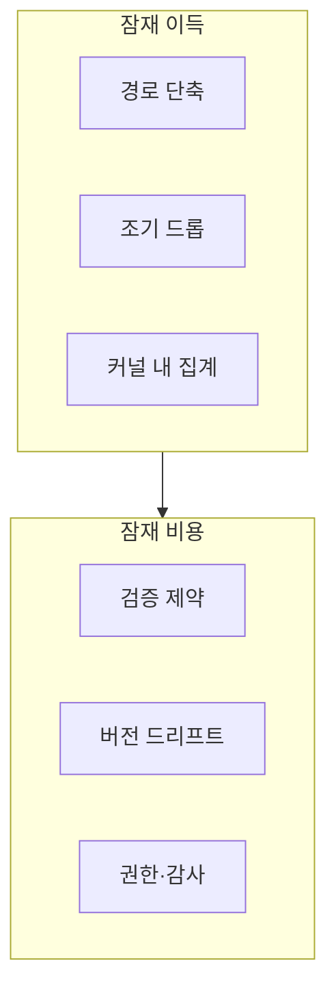

본 장은 **전문** 난이도입니다. **eBPF**는 커널 내부에 **검증된 프로그램**을 로드해 패킷 필터링·관측·성능 진단을 수행하는 기술로 널리 쓰입니다. **XDP**는 그중 **조기 패킷 경로**에 가까운 지점을 다룰 때 자주 함께 언급됩니다. 이 트랙의 챕터 09는 “개요”에 머물렀고, 본 장은 **운영 가능한 의사결정**을 위한 프레임입니다.

## 왜 커널 경계인가

유저 공간 애플리케이션만 최적화해도, **커널에서의 복사·스케줄링·소프트IRQ**가 바닥을 지배할 수 있습니다. eBPF/XDP는 **경로를 짧게** 만들거나 **불필요한 작업을 줄이는** 레버가 될 수 있지만, 동시에 **검증기 제약·커널 버전 의존·보안 모델**이라는 비용이 붙습니다.

## 성능 이득이 나올 수 있는 전형

- **고속 패킷 처리**: 특정 클래스의 패킷을 유저 공간으로 끌고 오기 전에 **조기 판정**합니다.  
- **관측 오버헤드 감소**: 기존 `tracepoint`·`kprobe` 기반 도구보다 **가벼운 훅**을 원할 때(도구·버전에 따라 다름).  
- **커스텀 집계**: 커널 안에서 **짧은 통계**만 유지하고 유저 공간으로는 요약만 보냅니다.

반대로 **복잡한 상태 기계**나 **무거운 문자열 처리**를 eBPF에 억지로 넣으면 오히려 지연이 커질 수 있습니다.

## 안전·검증·운영 리스크

- **Verifier**: 커널은 로드 시 프로그램을 정적 검증합니다. 루프·스택·접근 범위 제약 때문에 **개발 속도**가 느려질 수 있습니다.  
- **커널 업그레이드**: 마이너 버전에서도 헬퍼·동작이 달라질 수 있어 **회귀**가 애플리케이션과 별개 축으로 생깁니다.  
- **보안 사고면**: eBPF는 강력한 훅이므로 **누가 로드할 수 있는지**(capabilities, cgroup, seccomp 정책)가 Tr.09와 연결됩니다.

## 측정 관점(Tr.05와 맞물림)

- **처리량**: pps, Gbps, CPU 사용률.  
- **지연**: 드롭 전/후 경로별 p99.  
- **정확성**: 드롭·리다이렉트 규칙이 **비즈니스 로직**과 일치하는지.  
- **디버깅**: 패킷이 사라졌을 때 **관측 지점**이 충분한지.

## Tr.12·Tr.11과의 역할 나누

- **Tr.12(네트워크)**: 프로토콜·소켓·TLS·RPC 층의 성능.  
- **Tr.11(I/O)**: 스토리지·파일시스템.  
- **본 장**: **커널 훅**을 쓰는 결정 자체의 리스크·이득.

한 프로젝트에서 세 축이 동시에 움직이면, 장애 시 **어느 층에서 패킷이 증발했는지**를 분리하기 어렵습니다. 관측 포인트를 **계약**으로 적어 두는 것이 전문가적인 습관입니다.

## 도입 전 질문 14

1. 유저 공간 최적화와 **커널 병목 증거**가 있는가?  
2. 규칙이 **상태가 거의 없는** 필터인가?  
3. 커널 버전 범위는?  
4. 롤밹은 **프로그램 언로드**로 가능한가?  
5. CI에서 **검증 실패**를 재현할 수 있는가?  
6. 관측과 **데이터 프라이버시** 충돌은 없는가?  
7. 멀티 테넌트에서 **격리**는?  
8. 패킷 드롭이 **비즈니스 허용**인가?  
9. on-call이 **BPF 맵**을 읽을 수 있는가?  
10. 커널 패치 주기는?  
11. 컨테이너 런타임이 **BPF filesystem**을 허용하는가?  
12. 대안은 **DPDK·io_uring** 등 무엇인가?  
13. 보안팀 승인 절차는?  
14. 문서에 **SLO 영향**이 적혀 있는가?

## 마무리

eBPF/XDP는 “성능 카드”이자 “운영 카드”입니다. 숫자만이 아니라 **검증·권한·업그레이드**를 같은 표에 올려야 Tr.07의 나머지 챕터들과 모순 없이 이어집니다.

## 부록: 용어

- **BPF map**: 커널·유저 공간이 공유하는 키-값 저장소(개념 수준).  
- **Verifier**: 로드 시 정적 검사기.  
- **XDP**: 드라이버 근처 조기 경로(구현은 환경 의존).

## 부록: 문서 템플릿

- 로드되는 프로그램 목록과 소스 위치  
- 필요 capability 목록  
- 지원 커널 버전 매트릭스  
- 롤밹 절차와 검증 커맨드  
- SLO·에러 버짓
