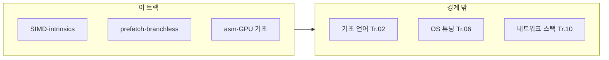

이 트랙은 "정말로 필요할 때만" 접근하는 특수 기술 묶음입니다. 잘못된 조기 진입은 복잡도만 키우고 회귀를 부르기 쉬우므로, 반드시 목표/측정/검증이 준비된 상황에서 사용합니다.

## 이 트랙이 책임지는 범위

- SIMD/인트린식 기반 최적화(벡터화 전략)
- hand-written asm의 적용 판단과 위험 관리
- prefetch/branchless 설계(조건 분기 최소화)
- 극한 수준의 핫패스 튜닝에서 "유지보수 가능성"까지 포함한 설계

## 이 트랙이 다루지 않는 것 (경계)

- 기본적인 언어/컴파일러/메모리/동시성 최적화의 기초 (→ Tr.02~Tr.07 선행 권장)
- 운영환경(스케줄링/affinity) 변경 중심의 튜닝 (→ OS/런타임 트랙)

## 커리큘럼

**난이도 범례**: **기초**(입문) · **중급**(실무 핵심) · **심화**(깊은 분석·전문 주제) · **전문**(극한·니치). **Tr.NN**은 `optimization-NN-*` 트랙을 가리킵니다. 본 트랙은 기본적으로 **심화~전문** 궤적입니다.

처음 진입할 때는 **01 → 04 → 11 → 02 → 05 → 06** 순서가 비교적 안전합니다. 01은 SIMD 감각을 만들고, 04는 자동 벡터화와의 경계를 보여 주며, 11은 유지보수 기준을 먼저 세웁니다. 그 뒤 02, 05, 06으로 들어가야 “정말 사람이 개입해야 하는가”를 덜 과격하게 판단할 수 있습니다.

표 순서는 그대로 두는 편이 좋습니다. 이 트랙은 `03`, `07`, `10`, `14`, `15`, `17`처럼 **전문 분기**를 장 번호 기준으로 다시 찾아보는 일이 많아서, 표는 참조 지도 역할을 맡고 위 추천 순서는 입문자 진입용 설명으로 두는 구성이 더 안정적입니다.

| 챕터 | 제목 | 난이도 | 핵심 내용 |
|------|------|--------|-----------|
| 01 | SIMD 기초 | 기초 | SIMD 기초 (SSE, AVX) |
| 02 | SIMD Intrinsics | 중급 | SIMD intrinsics 실전 활용 |
| 03 | AVX-512/AVX10.2 최적화 | 전문 | AVX-512 최적화 기법과 AVX10.2 통합(Nova Lake의 P/E코어 512비트 실행 통일) |
| 04 | 자동 벡터화 | 중급 | 자동 벡터화 유도와 검증 (Tr.03와 연계) |
| 05 | Prefetch 전략 | 심화 | Prefetch 전략과 적용 판단 |
| 06 | Branchless 프로그래밍 | 심화 | Branchless 프로그래밍 기법 |
| 07 | Hand-written ASM | 전문 | Hand-written 어셈블리 적용과 위험 관리 |
| 08 | Lookup Table 최적화 | 중급 | Lookup Table 최적화 |
| 09 | 비트 조작 최적화 | 중급 | 비트 조작 최적화 기법 |
| 10 | 핫패스 극한 튜닝 | 전문 | 핫패스 극한 튜닝 사례 |
| 11 | 유지보수성 균형 | 중급 | 극한 최적화와 유지보수성 균형 |
| 12 | ARM NEON 최적화 | 심화 | ARM NEON intrinsics, Apple Silicon/ARM 서버 대응 |
| 13 | SIMD 라이브러리 | 중급 | Highway 1.4.0, xsimd 14.2.0, Eigen 등 포터블 SIMD 라이브러리 활용 |
| 14 | C++26 std::simd(P1928): 표준 SIMD 추상화 | 전문 | 2026-03 확정된 표준 라이브러리 SIMD, 서드파티 라이브러리·수동 intrinsics 대비 이식성과 성숙도(GCC 부분 구현) |
| 15 | Cache-oblivious 알고리즘 | 전문 | 캐시 크기 독립적인 알고리즘 설계 기법 |
| 16 | GPU Offloading 기초 | 심화 | CUDA/OpenCL/SYCL 개념과 CPU-GPU 협업 판단 기준 |
| 17 | AI 추론 최적화 | 전문 | NPU/Tensor Core 활용, 혼합 정밀도 및 양자화 기반 지연시간 최적화 |
| 18 | SIMD 문자열 처리 | 심화 | simdjson 등 SIMD 기반 파싱 사례와 적용 판단 기준 |

## 측정과 검증 (이 트랙 기준)

- microbenchmark로 단일 변경의 효과를 재현(노이즈 통제 필수)
- p99/p999 같은 꼬리 지연시간까지 개선되는지 확인
- 회귀 방지: 특수기술은 "되돌리기 비용"이 크므로 자동화 강화

## 추천 선행/병행 트랙

- **선행**: Low-latency 프로파일링·성능 분석 (Tr.01), CPU 마이크로아키텍처 (Tr.05)
- **병행**: 메모리·할당·레이아웃 (Tr.04), 컴파일러·빌드 최적화 (Tr.03)

> **주의**: 이 트랙은 측정 기반 최적화의 **후반 단계**입니다. Tr.01~05·Tr.07에서 병목을 좁힌 뒤 진입하는 것을 권장합니다.

## 왜 이 트랙인가 (동기)

컴파일러 자동 벡터화·인라이닝으로 부족할 때, 사람이 SIMD·prefetch·branchless·어셈블리로 핫패스를 압축할 수 있습니다. 대신 **이식성·검증 비용·회귀 위험**이 급격히 올라갑니다. 이 트랙은 “할 수 있다”가 아니라 **언제 해야 하는지**를 Tr.01·Tr.05의 증거와 연결해 판단하는 것을 목표로 합니다.

## Phase별 학습 궤적

**Phase A — SIMD 파이프라인 (챕터 01~04, 12~14)** 기초 intrinsics와 자동 벡터화 검증은 Tr.03와 연계해 읽으면 빌드 플래그까지 일관됩니다. 챕터 14의 C++26 std::simd는 13의 서드파티 라이브러리 감각을 먼저 익힌 뒤 표준 라이브러리 대안으로 비교하며 읽는 편이 자연스럽습니다.

**Phase B — 메모리·제어 흐름 (챕터 05~06, 08~09)** prefetch·branchless·LUT·비트 연산은 캐시·분기 이벤트(Tr.05) 해석이 있을 때 효과가 큽니다.

**Phase C — 극한·이질 디바이스 (챕터 07, 10, 15~17)** 핸드튜닝 asm, 핫패스 사례, cache-oblivious, GPU/NPU 추론 최적화는 **전문~심화**입니다. Tr.11·Tr.12과 함께 “되돌리기 비용”을 문서화하세요.

## 이 트랙을 마친 후 달성할 목표

- **판단**: SIMD/asm이 **필요한지** 증거 기준으로 말할 수 있다.
- **검증**: Tr.01 방법으로 개선이 p99까지 전달되는지 확인할 수 있다.
- **균형**: 유지보수성(챕터 11)과 성능을 trade-off로 설명할 수 있다.

## 평가 기준과 이 장을 읽은 후 확인

- [ ] Tr.02~04만으로 해결 가능한 병목과 본 트랙이 필요한 병목을 구분할 수 있는가?
- [ ] **전문** 난이도 챕터에 들어가기 전 체크할 측정 항목을 세 가지 이상 말할 수 있는가?

## 범위와 경계

## 심화·전문가 확장 궤적

커리큘럼 표에서 **전문**으로 표시된 챕터는 팀 리뷰·회귀 게이트(Tr.12) 없이 도입하지 않는 것을 권장합니다.

## 시리즈 전체 로드맵

12개 트랙의 권장 순서·심화 진입 조건은 **[Low-latency 최적화 시리즈 개요](/post/low-latency-optimization-series/getting-started-low-latency-optimization-series-overview/)**를 참고하세요.

## 지금 바로 이어 읽을 곳

**01 → 04 → 11** 순으로 읽으면 SIMD 감각과 자동 벡터화의 경계, 유지보수성 판단 기준까지 안전하게 이어집니다.

- [SIMD 기초: SSE·AVX](/post/extreme-optimization/simd-fundamentals-sse-avx/) (챕터 01)
- [자동 벡터화 유도와 검증](/post/extreme-optimization/auto-vectorization-guidance-verification/) (챕터 04)
- [극한 최적화와 유지보수성 균형](/post/extreme-optimization/extreme-optimization-maintainability-balance/) (챕터 11)
