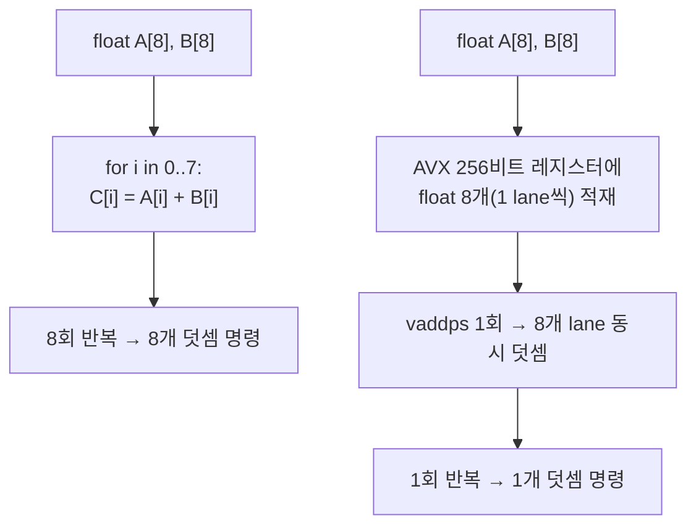

<strong>SIMD(Single Instruction, Multiple Data)</strong>란 하나의 명령으로 여러 개의 데이터를 동시에 처리하는 프로세서 실행 모델을 말합니다. 스칼라 코드가 `for` 루프를 돌며 배열 원소를 하나씩 더하는 동안, SIMD 명령 한 번은 레지스터 하나에 담긴 4개·8개·16개의 값을 한 번에 더합니다. 이 장은 그 데이터 병렬성이 왜 성능 이득으로 이어지는지, 그리고 x86 세계에서 SSE에서 AVX·AVX2로 이어진 레지스터 폭 확장이 무엇을 바꿨는지를 다룹니다. "SIMD를 쓰면 무조건 빨라진다"는 기대가 실무에서 자주 배신당하는 이유도 함께 짚습니다 — 이 장을 마치면 최소한 "지금 이 루프가 SIMD로 이득을 볼 구조인가"를 스스로 판단할 수 있어야 합니다.

## 이 장을 읽기 전에

**완전한 초보자?** 이 장은 이 트랙의 [Introduction](/post/extreme-optimization/getting-started-extreme-performance-optimization-techniques/)에서 제시한 "측정 없이 진입하지 않는다"는 전제를 공유합니다. C++로 배열과 포인터를 다뤄본 경험, 그리고 CPU가 레지스터와 ALU로 연산을 수행한다는 정도의 감각만 있으면 충분합니다. CPU 파이프라인·분기 예측 같은 마이크로아키텍처 배경지식이 있으면 이해가 빨라지는데, 필요하면 [Tr.05 CPU 마이크로아키텍처 Introduction](/post/cpu-optimization/getting-started-cpu-microarchitecture-performance-tuning/)을 먼저 훑어봐도 좋습니다. C++ 최적화 자체가 낯설다면 [Tr.02 C++ 언어 최적화 Introduction](/post/cpp-optimization/getting-started-cpp-language-performance-tuning/)을 먼저 권합니다.

**이 장의 깊이**: 이 장은 **기초** 난이도로, SIMD의 개념·역사·레지스터 폭 변화·이득 조건까지만 다룹니다. **다루지 않는 것**: intrinsics를 실전 코드 패턴으로 다루는 것은 [02장: SIMD Intrinsics 실전 활용](/post/extreme-optimization/simd-intrinsics-practical-usage/), AVX-512와 AVX10.2 세부 사항은 [03장](/post/extreme-optimization/avx512-avx10-optimization/), 컴파일러 자동 벡터화 유도·검증은 [04장](/post/extreme-optimization/auto-vectorization-guidance-verification/), ARM NEON은 [12장](/post/extreme-optimization/arm-neon-simd-optimization/), Highway·xsimd 같은 포터블 SIMD 라이브러리는 [13장](/post/extreme-optimization/portable-simd-libraries-highway-xsimd/), C++26 `std::simd`는 [14장](/post/extreme-optimization/cpp26-std-simd-p1928-standard-abstraction/)에서 각각 다룹니다. 이 장의 코드는 개념을 보여주기 위한 최소 예시이며, 실무 수준의 intrinsics 활용은 다음 장의 몫입니다.

## 당신의 수준에 맞는 경로

| 수준 | 읽을 부분 | 핵심 목표 |
|------|---------|---------|
| **초보자** | "SIMD란 무엇인가" ~ "SSE의 등장" | 데이터 병렬성과 레지스터 폭 개념 이해 |
| **중급자** | "AVX·AVX2" ~ "스칼라 대비 이득이 나는 조건" | 세대별 차이와 이득 조건을 코드로 확인 |
| **전문가** | "판단 기준" ~ "비판적 시각" | 언제 SIMD 도입을 검토할지 실무 기준 수립 |

---

## SIMD의 등장과 SSE·AVX의 발전 (역사·배경)

**SIMD**라는 개념 자체는 x86보다 오래됐지만, 범용 x86 프로세서에서 실용적으로 자리 잡은 것은 Intel이 1996년 MMX를 내놓으면서부터입니다. MMX는 기존 x87 부동소수점 레지스터를 재사용하는 정수 전용 확장이라 부동소수점 연산과 동시에 쓸 수 없다는 제약이 컸습니다. 이 한계를 넘기 위해 1999년 Pentium III에서 <strong>SSE(Streaming SIMD Extensions)</strong>가 도입되었고, MMX와 분리된 128비트 전용 레지스터를 새로 확보했습니다.

> "eight new 128-bit registers known as `XMM0` through `XMM7`" — Wikipedia, ["Streaming SIMD Extensions"](https://en.wikipedia.org/wiki/Streaming_SIMD_Extensions) 문서. SSE는 이 XMM 레지스터로 단정도(single-precision) 부동소수점 SIMD 연산과 스칼라 부동소수점 연산을 함께 쓸 수 있게 했습니다.

SSE2(2001, Pentium 4)는 같은 XMM 레지스터에 배정도(double) 부동소수점과 정수 SIMD 연산을 추가해, 이후 x86-64 컴파일러가 기본으로 가정하는 최소 SIMD 명령셋이 되었습니다. 다음 도약은 2008년 발표되고 2011년 Sandy Bridge에서 처음 지원된 <strong>AVX(Advanced Vector Extensions)</strong>로, 레지스터 폭을 128비트에서 256비트로 넓히고 이름을 YMM으로 바꾸면서 하위 128비트는 그대로 XMM으로도 접근할 수 있게 했습니다. 2013년 Haswell에서 지원된 **AVX2**는 YMM 레지스터 폭은 유지한 채 정수 연산 대부분을 256비트로 확장하고, FMA(Fused Multiply-Add) 3-피연산자 명령을 추가해 곱셈-덧셈 연쇄 연산의 반올림 오차와 지연시간을 함께 줄였습니다. 그 다음 세대인 **AVX-512**(2016년 Knights Landing, 2017년 Skylake-X부터 주류 서버/HEDT에 도입, ZMM 512비트)는 레지스터 폭과 마스크 레지스터 같은 새 기능이 얽혀 있어 이 장의 범위를 넘습니다 — 세부 내용과 최신 AVX10.2 통합은 [03장](/post/extreme-optimization/avx512-avx10-optimization/)에서 다룹니다.

## 핵심 개념: 데이터 병렬성과 레지스터 폭

SIMD 레지스터의 폭과 원소(element) 크기가 정해지면 "레인(lane)" 수가 자동으로 정해집니다. 128비트 SSE 레지스터에 32비트 `float`를 담으면 4레인, 256비트 AVX 레지스터에 같은 `float`를 담으면 8레인이 됩니다. 한 번의 `vaddps` 명령이 이 레인들을 병렬로 더하므로, 이상적인 경우(메모리 대역폭이 병목이 아니고 레인 간 의존성이 없을 때) 이론적 상한은 레인 수에 비례합니다 — 다만 이는 상한이지 보장이 아니며, 실제 이득은 뒤에서 다룰 조건에 크게 좌우됩니다.

로드/스토어에는 정렬(alignment) 요구가 따라붙습니다. SSE의 정렬 로드(`_mm_load_ps`)는 16바이트 경계를 요구하고, 비정렬 로드(`_mm_loadu_ps`)는 경계 없이 동작하되 과거 마이크로아키텍처에서는 약간의 성능 손해가 있었습니다. AVX의 정렬 로드(`_mm256_load_ps`)는 32바이트 경계를 요구합니다. Intel Haswell 이후 세대에서는 정렬·비정렬 로드의 성능 차이가 크게 줄었지만, "정렬을 신경 쓰지 않아도 된다"는 결론은 구현 세대·명령 종류에 따라 달라지므로 단정하지 않는 편이 안전합니다. 컴파일러 관점에서는 `-msse2`, `-mavx`, `-mavx2` 같은 타깃 플래그가 어떤 명령셋을 코드 생성에 허용할지를 결정하며, 이 플래그 없이 컴파일된 바이너리는 해당 세대의 명령을 아예 만들어내지 않습니다 — 배포 대상 CPU가 그 명령셋을 지원하는지 확인하는 것은 별도의 런타임 디스패치 문제로, [02장](/post/extreme-optimization/simd-intrinsics-practical-usage/)에서 이어집니다.



위 다이어그램은 원소별 덧셈처럼 레인 간 의존성이 없는 연산에서 스칼라와 SIMD의 명령 수 차이를 보여줍니다. 실제로는 로드·스토어 명령과 나머지(remainder) 처리가 더해지므로 명령 수 차이가 이 그림만큼 단순하지는 않습니다.

아래는 SSE로 배열 덧셈을 수행하고, 스칼라 참조 구현과 결과를 바이트 단위로 비교해 검증하는 최소 예시입니다. `add_scalar`가 이 장 전체에서 "정답"의 기준이 되고, `add_sse`의 출력이 이와 정확히 같아야 SIMD 경로가 올바르다고 판단합니다.

```cpp
#include <immintrin.h>  // SSE intrinsics (_mm_*)
#include <cstdio>
#include <cstring>

// 스칼라 참조 구현: SIMD 결과 검증의 기준점
void add_scalar(const float* a, const float* b, float* out, int n) {
  for (int i = 0; i < n; ++i) out[i] = a[i] + b[i];
}

// SSE: 128비트 레지스터 1개에 float 4개(lane)를 담아 한 번에 덧셈
void add_sse(const float* a, const float* b, float* out, int n) {
  int i = 0;
  for (; i + 4 <= n; i += 4) {
    __m128 va = _mm_loadu_ps(a + i);
    __m128 vb = _mm_loadu_ps(b + i);
    _mm_storeu_ps(out + i, _mm_add_ps(va, vb));
  }
  for (; i < n; ++i) out[i] = a[i] + b[i];  // 4의 배수가 아닌 나머지 처리
}

int main() {
  const int n = 17;  // 4로 나누어떨어지지 않는 크기로 나머지 경로도 검증
  float a[n], b[n], ref[n], simd_out[n];
  for (int i = 0; i < n; ++i) { a[i] = float(i); b[i] = float(i * 2); }

  add_scalar(a, b, ref, n);
  add_sse(a, b, simd_out, n);

  bool match = std::memcmp(ref, simd_out, sizeof(ref)) == 0;
  std::printf("SSE == scalar: %s\n", match ? "PASS" : "FAIL");
  return match ? 0 : 1;
}
```

`g++ -O2 -msse2 sse_add.cpp -o sse_add && ./sse_add`(x86-64, GCC/Clang 공통)로 컴파일·실행하면 `PASS`가 출력됩니다. 나머지(remainder) 루프를 빼먹으면 `n`이 레인 수의 배수가 아닐 때 배열 끝부분이 조용히 틀린 값으로 남으므로, 이 검증 습관은 SIMD 코드에서 항상 필요합니다.

AVX로 넘어가면 레지스터 폭과 레인 수만 바뀌고 구조는 동일합니다. 다음은 같은 `add_scalar`를 기준으로 검증할 수 있는 256비트 버전입니다.

```cpp
#include <immintrin.h>  // AVX intrinsics (_mm256_*)

// AVX: 256비트 레지스터 1개에 float 8개(lane)를 담아 한 번에 덧셈
void add_avx(const float* a, const float* b, float* out, int n) {
  int i = 0;
  for (; i + 8 <= n; i += 8) {
    __m256 va = _mm256_loadu_ps(a + i);
    __m256 vb = _mm256_loadu_ps(b + i);
    _mm256_storeu_ps(out + i, _mm256_add_ps(va, vb));
  }
  for (; i < n; ++i) out[i] = a[i] + b[i];  // 8의 배수가 아닌 나머지 처리
}
```

이 함수는 `-mavx` 플래그 없이는 컴파일되지 않거나 AVX 명령이 생성되지 않으므로, `g++ -O2 -mavx avx_add.cpp`처럼 명시적으로 타깃을 지정해야 합니다. `add_sse`와 마찬가지로 `add_scalar` 출력과 `memcmp`로 비교하면 검증 방법은 동일합니다.

## 흔한 오개념

<strong>"SIMD를 쓰면 레인 수만큼 항상 빨라진다"</strong>는 가장 흔한 오해입니다. 레인 수는 이론적 상한일 뿐이고, 실제로는 메모리 대역폭·데이터 의존성·수평(horizontal) 연산 오버헤드가 그 상한을 깎아 먹습니다. 배열이 캐시에 들어가지 않을 만큼 크면 연산 자체가 아니라 메모리 접근이 병목이 되어, SIMD로 바꿔도 체감 이득이 거의 없는 경우가 흔합니다.

<strong>"레지스터 폭이 넓을수록 무조건 좋다"</strong>도 정확하지 않습니다. 넓은 SIMD 유닛을 자주 쓰면 일부 마이크로아키텍처에서 코어 클럭이 낮아지는 현상이 알려져 있고(대표적으로 초기 AVX-512 세대), 이 트레이드오프는 워크로드 전체의 실행 시간으로 판단해야지 명령 하나의 처리량만으로 판단할 수 없습니다. 세대별 구체적인 수치와 완화 방향은 [03장](/post/extreme-optimization/avx512-avx10-optimization/)에서 다룹니다.

<strong>"컴파일러가 최적화 플래그만 켜면 알아서 벡터화해 준다"</strong>는 부분적으로만 맞습니다. 자동 벡터화는 별칭(aliasing) 가능성이나 복잡한 제어 흐름 앞에서 쉽게 포기하며, 포기했는지 여부를 컴파일러 리포트로 확인하지 않으면 "벡터화됐을 것"이라는 추측만 남습니다. 자동 벡터화를 유도하고 검증하는 절차는 [04장](/post/extreme-optimization/auto-vectorization-guidance-verification/)의 주제입니다.

## 스칼라 대비 이득이 나는 조건

SIMD 이득은 연산이 **compute-bound**(메모리 접근보다 연산이 병목)인지, 데이터가 **연속 메모리**에 있는지, 레인 간에 **데이터 의존성이 없는지**에 좌우됩니다. 배열 원소별 덧셈처럼 각 레인이 서로 참조하지 않는 연산은 SIMD로 옮기기 쉽지만, 이전 원소 결과가 다음 원소 계산에 필요한 누적 재귀 관계는 레인을 나누는 것 자체가 어렵거나 별도의 재구성이 필요합니다. 배열이 `struct`의 한 필드씩 흩어져 있는 AoS(Array of Structures) 레이아웃도 문제입니다 — 연속된 `float` 레인을 채우려면 매 원소마다 간격을 두고 값을 모아야 하므로, SoA(Structure of Arrays)로 데이터를 재배치하는 편이 SIMD 로드에 훨씬 유리합니다.

**실제 배율을 격리 측정**하려면 배열 크기를 바꿔가며 스칼라·SSE·AVX 버전을 비교하는 것이 안전합니다. 아래는 그 구조를 보여주는 Google Benchmark 스켈레톤입니다.

```cpp
#include <benchmark/benchmark.h>
#include <immintrin.h>
#include <vector>

static void BM_AddScalar(benchmark::State& state) {
  const int n = state.range(0);
  std::vector<float> a(n, 1.0f), b(n, 2.0f), out(n);
  for (auto _ : state) {
    for (int i = 0; i < n; ++i) out[i] = a[i] + b[i];
    benchmark::DoNotOptimize(out.data());
  }
}
BENCHMARK(BM_AddScalar)->Arg(1 << 10)->Arg(1 << 20);  // L2에 맞는 크기 vs 캐시 초과 크기

static void BM_AddAVX(benchmark::State& state) {
  const int n = state.range(0);
  std::vector<float> a(n, 1.0f), b(n, 2.0f), out(n);
  for (auto _ : state) {
    int i = 0;
    for (; i + 8 <= n; i += 8) {
      __m256 va = _mm256_loadu_ps(&a[i]);
      __m256 vb = _mm256_loadu_ps(&b[i]);
      _mm256_storeu_ps(&out[i], _mm256_add_ps(va, vb));
    }
    benchmark::DoNotOptimize(out.data());
  }
}
BENCHMARK(BM_AddAVX)->Arg(1 << 10)->Arg(1 << 20);

BENCHMARK_MAIN();
```

`g++ -O2 -mavx2 bench.cpp -lbenchmark -lpthread`(x86-64, GCC 13 기준 예시)로 빌드해 실행하면, 배열이 L2 캐시 안에 들어가는 `1 << 10` 크기에서는 AVX가 스칼라 대비 눈에 띄게 빠르고, 캐시를 크게 초과하는 `1 << 20` 크기에서는 두 버전의 차이가 좁혀지는 경향이 흔합니다 — 정확한 배율은 CPU 세대·메모리 대역폭·컴파일러·컴파일 플래그에 따라 달라지므로, 이 스켈레톤을 대상 환경에서 직접 실행해 확인해야 합니다.

## 판단 기준

| 상황 | SIMD 도입 검토 | SIMD보다 우선 확인 |
|------|---------------|-------------------|
| 연속 메모리의 원소별 독립 연산(덧셈·곱셈 등) | 적합 | - |
| compute-bound 핫패스(프로파일러로 확인됨) | 적합 | - |
| 메모리 대역폭이 이미 포화 상태 | 이득 제한적 | 데이터 레이아웃·캐시 접근 패턴 먼저 개선 |
| AoS 구조체 배열, 필드 간 간격 있음 | 재배치 후 검토 | SoA 전환 여부 먼저 판단 |
| 레인 간 강한 순차 의존(누적 재귀 등) | 재구성 필요 | 알고리즘 차원의 병렬화 가능성 검토 |
| 호출 빈도 낮은 콜드 패스 | 비권장 | 유지보수 비용 대비 이득 재확인 |

## 비판적 시각: 한계와 트레이드오프

SIMD 코드의 이득은 하드웨어 세대에 강하게 묶여 있습니다. `-mavx2`로 컴파일한 바이너리는 AVX2를 지원하지 않는 구형 CPU에서 `SIGILL`로 죽으므로, 배포 대상이 다양하다면 런타임에 CPU 기능을 감지해 여러 경로 중 하나를 고르는 디스패치가 필요합니다 — 이 판단과 구현 패턴은 [02장](/post/extreme-optimization/simd-intrinsics-practical-usage/)에서 다룹니다. 넓은 레지스터일수록 이론적 상한은 커지지만 마스킹·수평 합산·정렬 처리 같은 부가 명령이 함께 늘어나 실제 이득은 상한보다 항상 작으며, 일부 세대에서는 넓은 SIMD 유닛 사용이 코어 클럭 저하를 동반한다는 점도 무시할 수 없습니다. 손으로 쓴 intrinsics 코드는 스칼라 코드보다 읽기 어렵고 컴파일러·아키텍처에 종속적이어서 유지보수 비용이 늘어나므로, 이 비용을 성능 이득과 저울질하는 기준은 [11장: 극한 최적화와 유지보수성 균형](/post/extreme-optimization/extreme-optimization-maintainability-balance/)에서 별도로 다룹니다. 결국 이 장에서 다룬 "이론적 레인 수"는 설계 시작점이지 보장된 결과가 아니며, 모든 주장은 대상 환경에서 재현 가능한 벤치마크로 뒷받침되어야 합니다.

## 마무리

- [ ] SIMD의 데이터 병렬성 원리(레지스터 폭과 레인 수의 관계)를 설명할 수 있다.
- [ ] SSE(1999)에서 AVX(2011)·AVX2(2013)로 이어지는 레지스터 폭 변화와 그 배경을 말할 수 있다.
- [ ] 스칼라 대비 SIMD 이득이 나는 조건(연속 메모리, 데이터 독립성, compute-bound)을 판단할 수 있다.
- [ ] SIMD가 이득을 못 내거나 손해를 보는 상황(메모리 대역폭 병목, AoS 레이아웃, 강한 순차 의존)을 식별할 수 있다.
- [ ] SIMD 결과를 스칼라 참조 구현과 비교해 검증하는 습관을 코드에 반영할 수 있다.

**다음 장에서는** intrinsics를 실전 코드에 적용하는 구체적인 패턴 — 마스크 처리, 나머지(remainder) 루프 관용구, 런타임 CPU 기능 디스패치, 컴파일러 내장 함수와 어셈블리 출력 대조 — 을 다룹니다. 이 장에서 확인한 "레인 수는 상한일 뿐"이라는 원칙을 실제 코드 설계에 어떻게 반영하는지 이어서 살펴봅니다.

→ [SIMD Intrinsics 실전 활용](/post/extreme-optimization/simd-intrinsics-practical-usage/)
