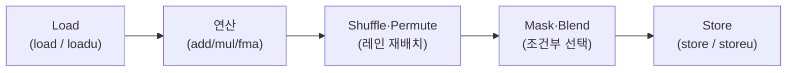

**SIMD intrinsics 실전 활용**이란 `_mm_`/`_mm256_` 계열 함수로 벡터 레지스터를 직접 다루는 코드를, 정렬 규칙과 셔플·마스크 패턴까지 포함해 실제로 컴파일·검증 가능한 수준으로 작성하는 것을 말합니다. [이전 장](/post/extreme-optimization/simd-fundamentals-sse-avx/)에서 SSE/AVX 레지스터와 명령어 개념을 익혔다면, 이 장에서는 그 지식을 실제 코드로 옮길 때 부딪히는 세 가지 실무 문제 — "정렬된 로드를 언제 써도 되는가", "레인을 어떻게 재배치하는가", "조건 분기를 어떻게 마스크로 대체하는가" — 를 다룹니다. intrinsics는 컴파일러 내장 함수이므로 인라인 어셈블리보다 이식성이 높지만, 여전히 정렬·이식성·읽기 어려움이라는 비용을 수반하며 이 장은 그 비용을 구체적인 코드로 보여줍니다.

## 이 장을 읽기 전에

**전제 지식**: [01장: SIMD 기초 — SSE·AVX](/post/extreme-optimization/simd-fundamentals-sse-avx/)에서 다룬 레지스터 폭(128/256비트), SIMD lane 개념, SSE/AVX 명령어 집합의 대략적 구분을 알고 있다고 가정합니다. `__m128`/`__m256` 타입이 "레지스터를 나타내는 불투명한 값"이라는 정도만 알면 충분합니다.

**이 장의 깊이**: **중급** 수준입니다. intrinsics 네이밍 규칙, 로드/스토어 정렬, 셔플·퍼뮤트, 마스크·블렌드까지 실전 코드 작성에 필요한 패턴을 다룹니다. AVX-512의 전용 마스크 레지스터(`k0`~`k7`)와 AVX10.2 통합은 다루지 않고 [03장](/post/extreme-optimization/avx512-avx10-optimization/)에서, 컴파일러가 자동으로 벡터화하도록 유도·검증하는 방법은 [04장](/post/extreme-optimization/auto-vectorization-guidance-verification/)에서, ARM NEON은 [12장](/post/extreme-optimization/arm-neon-simd-optimization/)에서, Highway·xsimd 같은 포터블 SIMD 추상화는 [13장](/post/extreme-optimization/portable-simd-libraries-highway-xsimd/)에서, C++26 `std::simd` 표준 추상화는 [14장](/post/extreme-optimization/cpp26-std-simd-p1928-standard-abstraction/)에서, SIMD 기반 문자열·JSON 파싱 사례는 [18장](/post/extreme-optimization/simd-string-json-parsing-simdjson/)에서 각각 별도로 다룹니다. 컴파일러별 intrinsics 목록 자체는 [Tr.03 컴파일러 intrinsics 카탈로그](/post/compiler-optimization/compiler-intrinsics-catalog/)를 참고하세요.

## 당신의 수준에 맞는 경로

| 수준 | 읽을 부분 | 핵심 목표 |
|------|---------|---------|
| **중급 입문** | "네이밍 규칙과 헤더 체계" ~ "로드/스토어와 정렬" | intrinsics 이름을 읽고 정렬 요구를 판단할 수 있다 |
| **중급 심화** | "셔플·퍼뮤트" ~ "실전 예제" | 레인 재배치·마스크 연산으로 분기를 제거할 수 있다 |
| **적용 판단** | "흔한 오개념" ~ "비판적 시각" | 언제 직접 intrinsics를 쓸지 근거를 들어 판단할 수 있다 |

---

## intrinsics의 등장 배경

CPU 벤더가 새 SIMD 명령어를 추가할 때마다 개발자가 인라인 어셈블리로 대응하는 것은 이식성과 가독성 면에서 부담이 컸습니다. 이 문제를 해결하기 위해 Intel은 SSE(1999, Pentium III)와 함께 C/C++에서 벡터 레지스터를 함수처럼 호출할 수 있는 **intrinsics**를 `xmmintrin.h`로 제공했고, 이후 SSE2(`emmintrin.h`), SSE3/SSSE3/SSE4(`pmmintrin.h`, `tmmintrin.h`, `smmintrin.h`), AVX/AVX2/FMA(`immintrin.h`)로 헤더가 계속 추가됐습니다. GCC·Clang·MSVC 세 컴파일러 모두 Intel이 정의한 함수 이름과 시그니처를 그대로 채택했기 때문에, 동일한 intrinsics 코드가 컴파일러를 바꿔도 대체로 재컴파일만으로 동작합니다 — 다만 뒤에서 다루듯 완전히 같지는 않습니다. 오늘날 이 함수 목록은 Intel이 웹으로 제공하는 [Intel® Intrinsics Guide](https://www.intel.com/content/www/us/en/docs/intrinsics-guide/index.html)가 사실상 표준 참조 역할을 합니다.

## 네이밍 규칙과 헤더 체계

intrinsics 이름은 `_mm[너비]_연산_타입` 형태를 따릅니다. 접두사가 없으면 128비트(SSE), `_mm256_`이면 256비트(AVX/AVX2), `_mm512_`이면 512비트(AVX-512, [03장](/post/extreme-optimization/avx512-avx10-optimization/) 대상)를 뜻합니다. 접미사는 원소 타입을 나타내는데 `ps`는 packed single-precision float, `pd`는 packed double-precision, `epi32`/`epi16`/`epi8`은 부호 있는 정수 폭, `epu32`는 부호 없는 정수를 가리킵니다. 예를 들어 `_mm256_add_ps`는 "256비트 레지스터에 담긴 float들을 병렬로 더하라"는 뜻이고, `_mm_add_epi32`는 "128비트 레지스터의 32비트 정수 4개를 각각 더하라"는 뜻입니다. 이 규칙만 익혀 두면 처음 보는 intrinsics 이름도 대략적인 동작을 추측할 수 있습니다.

실전에서는 이름 규칙보다 **어떤 헤더가 필요하고 어떤 컴파일 플래그가 있어야 하는지**가 더 자주 막히는 지점입니다. `immintrin.h` 하나만 포함하면 SSE부터 AVX2·FMA까지 대부분을 커버하지만, 실제로 그 명령어를 생성하려면 `-mavx2 -mfma`(GCC/Clang) 또는 `/arch:AVX2`(MSVC) 같은 타깃 플래그가 필요합니다. 플래그 없이 상위 명령어 intrinsics를 호출하면 컴파일 자체가 실패하거나(엄격한 모드), 함수별 타깃 속성(`__attribute__((target("avx2")))`)이 없는 한 컴파일러가 오류를 냅니다.

```cpp
#include <immintrin.h>  // SSE~AVX2/FMA 대부분을 포괄하는 통합 헤더

// 컴파일: g++ -O2 -mavx2 -mfma naming_demo.cpp
__m256 add8_floats(__m256 a, __m256 b) {
  return _mm256_add_ps(a, b);   // 256비트 레지스터, float 8개를 병렬 가산
}
```

이 코드는 `-mavx2` 없이 컴파일하면 실패하므로, 실전에서는 파일·함수 단위로 타깃을 명시하고 CPU 감지(`__builtin_cpu_supports`, `_mm_cpuid` 등)로 런타임 분기하는 패턴을 함께 씁니다. 이 CPU 디스패치 자체는 [04장](/post/extreme-optimization/auto-vectorization-guidance-verification/)에서 다루는 자동 벡터화 검증과 맞물리므로 여기서는 언급만 합니다.

## 로드/스토어와 정렬



위 다이어그램은 이 장에서 다루는 전형적인 intrinsics 루프의 흐름입니다. 데이터를 레지스터로 읽어 들이고(load), 연산하고, 필요하면 레인을 재배치하고(shuffle), 조건에 따라 값을 고른 뒤(mask/blend), 결과를 다시 메모리에 쓰는(store) 다섯 단계로 이뤄집니다. 이 절에서는 첫 단계와 마지막 단계인 로드·스토어를 다룹니다.

`_mm256_load_ps`처럼 `u`가 없는 로드/스토어 계열은 **주소가 레지스터 폭(AVX는 32바이트, SSE는 16바이트)에 정렬되어 있어야** 합니다. 정렬되지 않은 주소에 정렬 로드를 호출하면 일반 보호 오류(general protection fault)로 즉시 크래시하거나, 구현에 따라 미정의 동작으로 이어집니다. 반면 `_mm256_loadu_ps`처럼 `u`(unaligned)가 붙은 계열은 정렬 여부와 무관하게 항상 안전하게 동작합니다. `alignas(32)`로 선언한 배열이나 `_mm_malloc`/`std::aligned_alloc`으로 확보한 버퍼가 아니면, 정렬을 보장할 수 없으므로 `loadu`/`storeu`를 기본값으로 삼는 것이 안전합니다.

```cpp
#include <immintrin.h>

// 컴파일: g++ -O2 -mavx2 align_demo.cpp
alignas(32) float aligned_buf[8] = {0, 1, 2, 3, 4, 5, 6, 7};

void load_store_demo(const float* unaligned_src, float* unaligned_dst) {
  __m256 va = _mm256_load_ps(aligned_buf);      // aligned_buf가 32B 정렬이므로 안전
  __m256 vb = _mm256_loadu_ps(unaligned_src);   // 정렬을 보장 못 하는 포인터엔 loadu
  __m256 sum = _mm256_add_ps(va, vb);
  _mm256_storeu_ps(unaligned_dst, sum);         // 저장도 동일한 정렬 규칙 적용
}
```

정렬 로드가 반드시 더 빠른 것은 아니라는 점은 뒤의 "흔한 오개념"에서 다시 짚습니다. 여기서 기억할 것은 **정렬 요구를 어기면 성능 저하가 아니라 크래시나 미정의 동작으로 이어질 수 있다**는 점이며, 이는 자동 벡터화가 만들어내는 코드에서는 컴파일러가 알아서 처리해 주지만 수동 intrinsics에서는 작성자의 책임이라는 사실입니다.

## 셔플·퍼뮤트: 레인 재배치

<strong>셔플(shuffle)</strong>과 <strong>퍼뮤트(permute)</strong>는 레지스터 안의 원소(레인) 순서를 바꾸는 연산입니다. 두 이름의 경계는 명령어 집합마다 다소 다르지만, 실전에서 중요한 구분은 "제어값이 컴파일 타임 상수(immediate)인가, 런타임 값(변수)인가"입니다. `_mm_shuffle_ps(a, b, imm8)`과 `_mm256_permute4x64_epi64(v, imm8)`은 `imm8` 인자가 **컴파일 타임 상수**여야 하며, 이 값이 명령어 자체에 인코딩되어 CPU가 실행 시점에 매 호출마다 재해석할 필요가 없습니다. 반대로 `_mm256_permutevar8x32_ps`처럼 `var`가 붙은 계열은 제어값을 레지스터로 받아 런타임에 달라지는 순서를 표현할 수 있습니다.

```cpp
#include <immintrin.h>

// 컴파일: g++ -O2 -msse2 shuffle_demo.cpp
// _MM_SHUFFLE(3,2,0,1) → 결과 레인 순서: [v[1], v[0], v[2], v[3]]
__m128 swap_low_pair(__m128 v) {
  return _mm_shuffle_ps(v, v, _MM_SHUFFLE(3, 2, 0, 1));
}
```

`_mm_shuffle_ps(a, b, imm8)`의 `imm8`은 8비트를 2비트씩 4구간으로 나눠 결과 레인 0~1은 `a`에서, 레인 2~3은 `b`에서 고릅니다(`a == b`로 호출하면 한 레지스터 내부 재배치가 됩니다). 이 규칙을 매번 손으로 계산하기보다 `_MM_SHUFFLE(d, c, b, a)` 매크로로 표기하는 것이 실수를 줄입니다. 256비트 레지스터에서는 128비트 레인(lane) 경계를 넘는 재배치가 제한적이라는 점도 실무에서 자주 걸리는 함정입니다 — `_mm256_shuffle_ps`는 상위·하위 128비트 레인 안에서만 재배치하고, 레인을 넘나드는 순열에는 `_mm256_permute2f128_ps`나 `_mm256_permutevar8x32_ps` 같은 별도 명령이 필요합니다.

## 마스크·블렌드: 조건부 선택

**마스크·블렌드**는 조건 분기(`if`)를 분기 없는 조건부 선택으로 바꾸는 패턴입니다. 비교 intrinsics(`_mm256_cmp_ps`)가 레인별로 "참이면 전체 1비트, 거짓이면 0"인 마스크 레지스터를 만들고, `_mm256_blendv_ps`가 이 마스크를 기준으로 두 레지스터 중 한 쪽 레인을 골라 결과를 만듭니다. 이 패턴은 [06장: Branchless 프로그래밍 기법](/post/extreme-optimization/branchless-programming-techniques/)에서 다루는 분기 제거 원칙을 SIMD 레지스터 단위로 적용한 것이라 볼 수 있습니다.

```cpp
#include <immintrin.h>

// 컴파일: g++ -O2 -mavx2 blend_demo.cpp
// v의 각 float를 상한(upper) 이하로 클램프. v[i] > upper[i]인 레인만 upper로 교체
__m256 clamp_upper(__m256 v, __m256 upper) {
  __m256 mask = _mm256_cmp_ps(v, upper, _CMP_GT_OQ);  // 비교 결과: 참 레인은 전체 1비트
  return _mm256_blendv_ps(v, upper, mask);             // mask==1인 레인만 upper 선택
}
```

`_CMP_GT_OQ`의 접미사(`OQ`: ordered, quiet)는 NaN을 만났을 때의 동작을 지정합니다 — AVX의 비교 intrinsics는 SSE의 고정된 비교 연산자보다 이런 순서·예외 처리 옵션을 더 세분화해서 제공합니다. AVX-512부터는 결과가 전체 레지스터 마스크가 아니라 전용 마스크 레지스터(`__mmask8` 등)로 바뀌어 블렌드 표현이 더 간결해지는데, 이 차이는 [03장](/post/extreme-optimization/avx512-avx10-optimization/)에서 다룹니다.

## 실전 예제: AVX2 내적 계산과 검증

앞서 다룬 로드·연산·셔플·마스크 패턴을 하나의 실전 예제로 묶으면 **내적(dot product)** 계산이 좋은 사례가 됩니다. 벡터 폭만큼 로드해 FMA로 누적한 뒤, 레지스터 하나에 흩어진 부분합을 하나의 스칼라로 모으는 **수평 합(horizontal sum)** 과정에서 셔플이 필요하기 때문입니다.

```cpp
#include <immintrin.h>
#include <cstddef>

// n은 8의 배수라고 가정(나머지 원소는 스칼라 tail 루프로 별도 처리해야 하지만 여기선 생략)
float dot_avx2(const float* a, const float* b, size_t n) {
  __m256 acc = _mm256_setzero_ps();
  for (size_t i = 0; i < n; i += 8) {
    __m256 va = _mm256_loadu_ps(a + i);
    __m256 vb = _mm256_loadu_ps(b + i);
    acc = _mm256_fmadd_ps(va, vb, acc);           // acc += va * vb (FMA 1개로 곱셈+누적)
  }
  __m128 lo = _mm256_castps256_ps128(acc);        // 하위 128비트
  __m128 hi = _mm256_extractf128_ps(acc, 1);      // 상위 128비트
  __m128 sum128 = _mm_add_ps(lo, hi);             // 8개 부분합 → 4개
  __m128 shuf = _mm_movehdup_ps(sum128);          // 셔플로 홀수 레인을 복제
  __m128 sums = _mm_add_ps(sum128, shuf);         // 4개 → 2개
  shuf = _mm_movehl_ps(shuf, sums);
  sums = _mm_add_ss(sums, shuf);                  // 2개 → 1개(스칼라)
  return _mm_cvtss_f32(sums);
}
```

수평 합 부분은 이 장에서 다룬 셔플 규칙이 실제로 성능에 영향을 주는 지점입니다 — `_mm256_hadd_ps`로 더 짧게 쓸 수도 있지만, `hadd` 계열은 내부적으로 셔플+가산 두 마이크로 연산으로 분해되는 경우가 많아 위 코드처럼 `add`+`shuffle`을 직접 조합하는 편이 명령어 수가 더 적게 나오는 경우가 흔합니다(플랫폼·컴파일러에 따라 다름).

### 검증: 스칼라 참조 구현과 비교

SIMD 코드가 올바른지 확인하는 가장 확실한 방법은 **동일한 입력에 대해 스칼라 참조 구현과 결과를 비교**하는 것입니다. 부동소수점은 결합 법칙이 성립하지 않으므로(덧셈 순서가 다르면 반올림 오차도 달라짐) 완전 일치가 아니라 허용 오차 안에서 비교해야 합니다.

```cpp
#include <cmath>
#include <cstdio>

float dot_scalar(const float* a, const float* b, size_t n) {
  float sum = 0.0f;
  for (size_t i = 0; i < n; ++i) sum += a[i] * b[i];
  return sum;
}

bool verify_dot(const float* a, const float* b, size_t n) {
  float ref = dot_scalar(a, b, n);
  float simd = dot_avx2(a, b, n);
  float diff = std::fabs(ref - simd);
  bool ok = diff <= 1e-4f * std::fabs(ref) + 1e-6f;  // 누적 순서 차이에 따른 허용 오차
  if (!ok) std::printf("mismatch: ref=%f simd=%f diff=%f\n", ref, simd, diff);
  return ok;
}
```

### 벤치마크 스켈레톤

성능 차이는 주장으로 끝내지 않고 직접 측정해야 합니다. 아래는 Google Benchmark로 `dot_scalar`와 `dot_avx2`를 같은 입력 크기에서 비교하는 최소 골격입니다(x86-64, GCC 13, `-O2 -mavx2 -mfma` 기준 예시).

```cpp
#include <benchmark/benchmark.h>
#include <vector>
#include <random>

static std::vector<float> make_random(size_t n, unsigned seed) {
  std::vector<float> v(n);
  std::mt19937 rng(seed);
  std::uniform_real_distribution<float> dist(-1.0f, 1.0f);
  for (auto& x : v) x = dist(rng);
  return v;
}

static void BM_DotScalar(benchmark::State& state) {
  size_t n = static_cast<size_t>(state.range(0));
  auto a = make_random(n, 1), b = make_random(n, 2);
  for (auto _ : state) benchmark::DoNotOptimize(dot_scalar(a.data(), b.data(), n));
}
BENCHMARK(BM_DotScalar)->Arg(1024)->Arg(1 << 16);

static void BM_DotAVX2(benchmark::State& state) {
  size_t n = static_cast<size_t>(state.range(0));
  auto a = make_random(n, 1), b = make_random(n, 2);
  for (auto _ : state) benchmark::DoNotOptimize(dot_avx2(a.data(), b.data(), n));
}
BENCHMARK(BM_DotAVX2)->Arg(1024)->Arg(1 << 16);

BENCHMARK_MAIN();
```

`g++ -O2 -mavx2 -mfma bench.cpp -lbenchmark -lpthread -o bench`로 빌드해 실행하면, 데이터가 캐시에 들어가는 크기(예: 1024개)에서는 `BM_DotAVX2`가 `BM_DotScalar`보다 대략 3~6배 범위로 빠르게 나오는 경우가 흔합니다 — 다만 이 배율은 컴파일러가 스칼라 루프를 자동 벡터화했는지 여부, 메모리 대역폭, CPU 세대에 따라 크게 달라지므로 실제 배포 환경에서 재현해 확인해야 합니다.

## 흔한 오개념 세 가지

**"정렬 로드(`load`)가 비정렬 로드(`loadu`)보다 항상 빠르다"**: Nehalem(2008) 이후 세대의 x86 CPU에서는 실제 주소가 정렬돼 있기만 하면 `load`와 `loadu`의 처리량 차이가 거의 없는 경우가 많습니다. 진짜 위험은 속도가 아니라, 정렬되지 않은 포인터에 `load`를 호출했을 때의 크래시·미정의 동작입니다. 정렬을 보장할 수 없는 입력에는 `loadu`를 기본값으로 삼는 편이 안전합니다.

**"intrinsics를 쓰면 그 이름 그대로의 명령어 하나가 정확히 나온다"**: intrinsics는 컴파일러 내장 함수이므로, 최적화 단계에서 상수 폴딩·명령어 재조합·죽은 코드 제거의 대상이 됩니다. 벤치마크 루프에서 `benchmark::DoNotOptimize` 없이 결과를 버리면 컴파일러가 SIMD 연산 전체를 제거해 버릴 수 있고, 반대로 여러 intrinsics 호출이 더 적은 명령어로 합쳐질 수도 있습니다. 실제로 어떤 명령어가 나왔는지는 어셈블리 출력(`-S`, godbolt 등)으로 확인해야 확실합니다.

**"셔플·퍼뮤트의 제어값(imm8)은 런타임에 자유롭게 바꿀 수 있다"**: `_mm_shuffle_ps`나 `_mm256_permute4x64_epi64`류의 `imm8` 인자는 명령어에 인코딩되는 **컴파일 타임 상수**여야 합니다. 런타임에 달라지는 순서가 필요하면 `_mm256_permutevar8x32_ps`처럼 제어값을 레지스터로 받는 `var` 계열을 써야 하며, 두 계열은 지원 명령어 집합과 성능 특성이 다릅니다.

## 판단 기준: 언제 intrinsics를 직접 쓸까

| 상황 | 권장 | 비권장 |
|------|------|--------|
| 컴파일러 자동 벡터화로 목표 처리량 달성 | 자동 벡터화 유지, [04장](/post/extreme-optimization/auto-vectorization-guidance-verification/)으로 검증 | 이유 없이 수동 intrinsics 선도입 |
| 정렬을 보장할 수 없는 외부 버퍼 | `loadu`/`storeu` 기본값 | `load`/`store`로 크래시 위험 감수 |
| 조건 분기가 핫패스 예측 실패를 유발 | 비교+블렌드로 분기 제거 | 그대로 `if` 유지 후 재측정 없이 방치 |
| 여러 컴파일러·아키텍처 지원 필요 | Highway/xsimd 같은 추상화([13장](/post/extreme-optimization/portable-simd-libraries-highway-xsimd/)) 검토 | 컴파일러별 intrinsics 코드를 중복 유지 |
| 런타임에 바뀌는 순열이 필요 | `permutevar` 계열 | 컴파일 타임 imm8 셔플 남용 |

## 비판적 시각: 한계와 트레이드오프

intrinsics 코드는 이식성이 인라인 어셈블리보다는 낫지만 여전히 x86 전용이며, ARM으로 옮기려면 [12장](/post/extreme-optimization/arm-neon-simd-optimization/)에서 다루는 NEON으로 다시 작성해야 합니다. 같은 이름의 intrinsics라도 GCC·Clang·MSVC가 내부적으로 생성하는 명령어 시퀀스가 미묘하게 다를 수 있고, 컴파일러 버전이 올라가면서 특정 조합의 코드 생성이 바뀌는 사례도 보고됩니다 — 따라서 성능이 중요한 intrinsics 코드는 대상 컴파일러·버전에서 직접 어셈블리를 확인하는 습관이 필요합니다. 가독성 측면에서도 `_mm256_permute4x64_epi64(v, _MM_SHUFFLE(0,1,2,3))` 같은 표현은 스칼라 코드보다 리뷰 비용이 훨씬 높고, 팀 전체가 셔플 규칙을 이해하지 못하면 유지보수 위험이 커집니다. 이 트랙 도입부([00장](/post/extreme-optimization/getting-started-extreme-performance-optimization-techniques/))가 강조하듯, 자동 벡터화나 포터블 라이브러리로 충분한 상황에서 수동 intrinsics를 먼저 시도하는 것은 대체로 비용 대비 이득이 낮습니다.

## 마무리

이 장에서 다룬 내용을 평가 기준으로 정리하면 다음과 같습니다.

- [ ] `_mm`/`_mm256` 네이밍 규칙(너비·연산·타입 접미사)을 읽고 대략적인 동작을 추측할 수 있다.
- [ ] `load`/`loadu`의 정렬 요구 차이와, 정렬을 어겼을 때의 실패 양상을 설명할 수 있다.
- [ ] 셔플·퍼뮤트에서 컴파일 타임 상수(imm8) 계열과 런타임 가변(`var`) 계열을 구분할 수 있다.
- [ ] 비교+블렌드로 조건 분기를 마스크 기반 선택으로 바꿀 수 있다.
- [ ] SIMD 구현을 스칼라 참조 구현과 출력 비교로 검증하는 절차를 적용할 수 있다.
- [ ] 언제 수동 intrinsics 대신 자동 벡터화·포터블 라이브러리를 먼저 검토해야 하는지 판단할 수 있다.

**다음 장에서는** AVX-512 명령어 집합과, Nova Lake 세대에서 P코어·E코어가 512비트 실행을 통일하며 등장한 AVX10.2 통합을 다룹니다. 이 장에서 익힌 로드·셔플·마스크 패턴이 전용 마스크 레지스터(`__mmask`)와 임베디드 브로드캐스트로 어떻게 재구성되는지 이어서 살펴봅니다.

→ [AVX-512/AVX10.2 최적화](/post/extreme-optimization/avx512-avx10-optimization/)

### 더 읽을 거리

- [Intel® Intrinsics Guide](https://www.intel.com/content/www/us/en/docs/intrinsics-guide/index.html) — 명령어별 intrinsics 이름·시그니처·지연/처리량 카테고리를 찾아볼 수 있는 공식 참조
- [Microsoft Learn: x86 Intrinsics List](https://learn.microsoft.com/en-us/cpp/intrinsics/x86-intrinsics-list) — MSVC 기준 intrinsics 이름·필요 헤더·함수 시그니처 표
- [GCC: x86 Built-in Functions](https://gcc.gnu.org/onlinedocs/gcc/x86-Built-in-Functions.html) — GCC가 지원하는 x86 intrinsics와 활성화에 필요한 명령줄 옵션
- [Agner Fog: Software optimization resources](https://www.agner.org/optimize/) — 명령어별 지연·처리량 표와 인트린식 기반 최적화를 다루는 매뉴얼 모음
