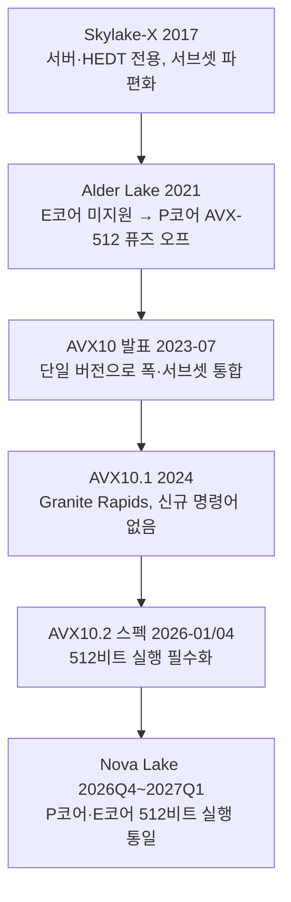

**AVX-512/AVX10.2 최적화**란 512비트 SIMD 레지스터(ZMM)와 8개의 opmask 레지스터(k0–k7)를 이용해 분기 없이 조건부 연산·나머지(tail) 처리를 수행하되, 그 대가로 따라오는 클럭 다운클럭(license-based downclocking)을 감수할 가치가 있는지 판단하고, 파편화되어 있던 AVX-512 구현을 AVX10이 어떻게 하나의 버전 체계로 수렴시키는지를 다루는 작업입니다. Intel의 AVX-512는 2017년 Skylake-X 이후 서버·HEDT에서는 꾸준히 쓰였지만 클라이언트에서는 P코어·E코어 이종 구조 때문에 한 세대 만에 퓨즈 오프(fuse off)되는 등 신뢰하기 어려운 기반이었습니다. 2026년 하반기 출시가 예정된 Nova Lake는 AVX10.2를 통해 P코어와 E코어 모두에서 네이티브 512비트 실행을 지원한다고 발표되어, 클라이언트에서도 AVX-512급 SIMD를 다시 안정적인 최적화 대상으로 고려할 근거가 생겼습니다. 이 장은 그 판단에 필요한 메커니즘과 트레이드오프를 정리합니다.

## 이 장을 읽기 전에

**선행 지식**: 이 장은 [SIMD Intrinsics 실전 활용](/post/extreme-optimization/simd-intrinsics-practical-usage/)에서 다룬 intrinsics 기본 문법(로드·스토어·산술 연산 호출 패턴)과 [SIMD 기초: SSE·AVX](/post/extreme-optimization/simd-fundamentals-sse-avx/)의 레지스터 폭 개념을 전제로 합니다. `__m512i`, `_mm512_*` 계열 함수 이름을 처음 본다면 두 장을 먼저 읽는 편이 낫습니다.

**이 장의 깊이**: 난이도는 **전문**입니다. AVX-512 고유의 opmask 레지스터 동작, 다운클럭의 원인과 세대별 변화, AVX10.2가 폭(width)을 통합하는 방식과 Nova Lake에서 이종 코어 문제를 해소하는 배경을 다룹니다. 실무에 바로 투입하기보다는 "왜 이 기술이 위험했고 무엇이 바뀌었는지"를 판단할 근거를 세우는 데 목적이 있습니다.

**다루지 않는 것**: 수기 어셈블리로 명령어를 직접 배치하는 위험 관리는 [Hand-written 어셈블리 적용과 위험 관리](/post/extreme-optimization/hand-written-assembly-risk-management/)에서, ARM 계열의 대응 기술은 [ARM NEON 최적화](/post/extreme-optimization/arm-neon-simd-optimization/)에서, Highway·xsimd 같은 포터블 SIMD 라이브러리로 AVX-512를 추상화하는 방법은 [포터블 SIMD 라이브러리](/post/extreme-optimization/portable-simd-libraries-highway-xsimd/)에서, 표준 라이브러리 SIMD로의 이식은 [C++26 std::simd(P1928)](/post/extreme-optimization/cpp26-std-simd-p1928-standard-abstraction/)에서 각각 다룹니다. 분기 자체를 없애는 일반론은 [Branchless 프로그래밍 기법](/post/extreme-optimization/branchless-programming-techniques/)을 참고하세요.

## 당신의 수준에 맞는 경로

| 수준 | 읽을 부분 | 핵심 목표 |
|------|---------|---------|
| **중급자** | "AVX-512에서 AVX10.2까지" ~ "opmask의 동작 원리" | opmask가 왜, 어떻게 분기를 대체하는지 이해 |
| **심화** | "다운클럭 트레이드오프" ~ "AVX10.2의 통합" | 성능 이득이 언제 상쇄되는지, 세대별 차이를 구분 |
| **전문가** | "흔한 오개념" ~ "비판적 시각" | 클라이언트 도입 시점과 검증 절차를 스스로 설계 |

---

## AVX-512에서 AVX10.2까지 (역사와 배경)

AVX-512는 2013년 Intel이 제안하고 2016년 Xeon Phi x200(Knights Landing)에서 처음 구현된 뒤, 2017년 Skylake-X 서버·HEDT 라인에서 범용 데스크톱에 처음 들어왔습니다([Wikipedia: AVX-512](https://en.wikipedia.org/wiki/AVX-512) 연혁 참고). 문제는 이 확장 전체가 하나의 기능이 아니라 AVX-512F/CD/VL/DQ/BW 등 수십 개의 서브셋 플래그로 쪼개져 있었고, 세대·라인업마다 지원 조합이 달라 "AVX-512를 지원한다"는 말 자체가 모호했다는 점입니다. 2021년 Alder Lake에서 P코어와 E코어 이종 설계가 도입되면서 상황은 더 나빠졌는데, E코어에는 512비트 실행 하드웨어가 없어 운영체제 스케줄러가 스레드를 P코어에서 E코어로 옮기면 그대로 죽는 문제가 생겼습니다. Intel은 이를 근본적으로 고치는 대신 P코어의 AVX-512 자체를 퓨즈로 잘라 비활성화하는 쪽을 택했고, 그 결과 클라이언트 라인에서 AVX-512는 한동안 "있다가 사라진 기능"이 되었습니다.

이 파편화를 정리하기 위해 Intel은 2023년 7월 AVX10을 발표했습니다. AVX10.1은 새 명령어를 추가하지 않고 Sapphire Rapids 시점의 AVX-512 서브셋(F, CD, VL, DQ, BW, IFMA, VBMI, VBMI2, BITALG, VNNI, GFNI, VPOPCNTDQ, VPCLMULQDQ, VAES, BF16, FP16)을 하나의 버전 번호로 묶어 재정의한 것에 가깝고, 2024년 3분기 Granite Rapids Xeon에 처음 실렸습니다. AVX10.2 아키텍처 스펙은 2026년 1월과 4월에 개정판이 공개되었으며, 여기서 512비트 실행을 P코어·E코어 모두에 강제하는 방향으로 정책이 바뀌었습니다. 초기 AVX10 로드맵은 512비트를 선택 사항으로 두고 256비트만 필수로 규정했었는데, Nova Lake를 앞두고 이 결정이 뒤집혀 512비트가 다시 의무 사항이 된 것입니다. AMD 쪽은 다른 경로를 걸었습니다. Zen4는 기존 Zen3의 256비트 실행 유닛을 재사용해 512비트 명령어를 두 사이클에 나눠 처리하는 "더블 펌핑" 방식이었고, Zen5에 와서야 대부분의 데이터패스를 512비트로 완전히 확장해 사이클당 4×512비트 처리량을 내는 첫 데스크톱 구현이 되었습니다.

## opmask 레지스터의 동작 원리

AVX-512는 k0–k7이라는 8개의 전용 마스크 레지스터를 EVEX 인코딩에 추가했습니다. 비교 명령어(`vpcmpgtd` 등)는 두 벡터를 비교한 결과를 참/거짓 벡터가 아니라 이 마스크 레지스터에 비트로 채워 넣고, 이후 연산은 이 마스크를 받아 "이 레인만 계산에 반영"하도록 동작합니다. k0은 관례상 "마스크 없음"을 뜻하는 데 예약되어 있어 실제 마스킹에는 k1–k7만 사용합니다. 이 메커니즘의 실질적 가치는 SSE/AVX2 시절 `_mm_blendv_epi8` 같은 블렌드 명령어나 조건 분기로 처리하던 "일부 레인만 갱신" 로직을 EVEX 인코딩 자체에 통합해, 별도의 블렌드 명령어 없이 산술 연산 자체가 마스크를 받게 만든 것입니다.

마스크가 0인 레인을 어떻게 처리하느냐에 따라 병합 마스킹(merge-masking)과 제로 마스킹(zero-masking) 두 가지가 있습니다. 병합 마스킹은 첫 번째 인자로 준 값(destination-as-source)을 마스크가 0인 레인에 그대로 유지하고, 제로 마스킹은 해당 레인을 무조건 0으로 만듭니다. 어느 쪽을 쓰느냐는 단순한 스타일 문제가 아니라 값의 의미와 성능 모두에 영향을 주는데, 병합 마스킹은 이전 값을 "누적"할 수 있어 반복문 안에서 상태를 이어갈 때 유용하지만 destination 레지스터에 대한 거짓 의존성(false dependency)을 만들어 명령어 스케줄링을 제약할 수 있습니다.

```cpp
#include <immintrin.h>

// 병합 마스킹: k의 0비트 레인은 src(첫 인자) 값을 그대로 보존한다
__m512i add_merge(__mmask16 k, __m512i src, __m512i a, __m512i b) {
  return _mm512_mask_add_epi32(src, k, a, b);
}

// 제로 마스킹: k의 0비트 레인은 무조건 0이 된다 (src를 받지 않는다)
__m512i add_zero(__mmask16 k, __m512i a, __m512i b) {
  return _mm512_maskz_add_epi32(k, a, b);
}
```

병합 마스킹은 `src` 인자가 이전 결과 레지스터 자체일 때 그 레지스터를 계속 읽어야 하므로 아웃오브오더 실행기 입장에서는 "값이 아직 안 나왔을 수도 있는" 의존성으로 취급됩니다. 반복문 바깥에서 한 번만 쓰는 나머지 처리라면 이 비용은 무시할 만하지만, 매 반복마다 병합 마스킹을 누적한다면 제로 마스킹으로 바꿀 수 있는지부터 검토하는 것이 좋습니다.

가장 흔한 실전 용례는 배열 길이가 벡터 폭(AVX-512 정수 32비트 기준 16개)의 배수가 아닐 때 남는 나머지(tail)를 처리하는 것입니다. 기존에는 스칼라 루프로 별도 처리하거나 배열 뒤에 패딩을 붙여야 했는데, 마스크를 쓰면 나머지 개수만큼 하위 비트를 1로 채운 마스크로 로드·연산·스토어를 한 번에 끝낼 수 있습니다. 아래 코드는 이 패턴을 스칼라 참조 구현과 비교해 검증합니다.

```cpp
#include <immintrin.h>
#include <cstdint>
#include <cstdio>
#include <vector>

// 스칼라 참조 구현: 정답을 판단하는 기준
int32_t sum_scalar(const int32_t* data, size_t n) {
  int32_t acc = 0;
  for (size_t i = 0; i < n; ++i) acc += data[i];
  return acc;
}

// AVX-512: 16개씩 처리하고 나머지는 opmask로 한 번에 마무리
int32_t sum_avx512_masked(const int32_t* data, size_t n) {
  __m512i vsum = _mm512_setzero_si512();
  size_t i = 0;
  for (; i + 16 <= n; i += 16) {
    __m512i v = _mm512_loadu_si512(reinterpret_cast<const void*>(data + i));
    vsum = _mm512_add_epi32(vsum, v);
  }
  size_t remain = n - i;
  if (remain > 0) {
    __mmask16 k = static_cast<__mmask16>((1u << remain) - 1);  // 하위 remain비트만 1
    __m512i v = _mm512_maskz_loadu_epi32(k, data + i);         // 마스크 밖은 0으로 채움
    vsum = _mm512_add_epi32(vsum, v);
  }
  return _mm512_reduce_add_epi32(vsum);
}

int main() {
  std::vector<int32_t> data(37);
  for (size_t i = 0; i < data.size(); ++i) data[i] = static_cast<int32_t>(i);
  int32_t expected = sum_scalar(data.data(), data.size());
  int32_t actual = sum_avx512_masked(data.data(), data.size());
  std::printf("expected=%d actual=%d match=%d\n", expected, actual, expected == actual);
  return expected == actual ? 0 : 1;
}
```

`g++ -mavx512f -O2 masked_sum.cpp -o masked_sum && ./masked_sum`으로 빌드·실행하면 `match=1`이 출력되어야 하며, 이것이 마스크 로직이 스칼라 기준과 일치하는지를 확인하는 최소 검증입니다. 마스크 계산(`(1u << remain) - 1`)은 `remain`이 0–15 범위임을 가정하므로, 이 범위를 벗어나는 입력이 들어오지 않도록 호출부에서 보장해야 합니다.

## 다운클럭 트레이드오프: 빠른 명령어가 전체를 느리게 만드는 이유

AVX-512가 클라이언트에서 신뢰받지 못했던 또 다른 이유는 순수한 클럭 다운클럭 문제입니다. 초기 Skylake-X는 명령어를 L0(가벼움)·L1·L2(무거운 512비트 FMA 등) 세 등급의 "라이선스"로 나누고, 코어가 무거운 명령어를 실행하면 해당 코어뿐 아니라 같은 소켓의 다른 코어까지 정해진 시간 동안 낮은 주파수로 강제 전환했습니다. 보급형 Xeon Bronze/Silver 라인에서는 단 하나의 AVX-512 명령어만 실행해도 베이스 클럭이 800MHz까지 떨어지는 사례가 보고되었을 만큼 영향이 컸습니다. Ice Lake 세대에서 이 문제는 크게 개선되어, 활성 코어 1개 기준으로 512비트 명령어를 실행해도 다운클럭 폭이 100MHz 수준으로 줄었고 가벼운 명령어와 FMA 사이의 등급 구분 자체가 사라졌습니다.

> "100 MHz of license-based downclock with 1 active core" — Travis Downs, [*Ice Lake AVX-512 Downclocking*](https://travisdowns.github.io/blog/2020/08/19/icl-avx512-freq.html) (2020)

실무적으로 중요한 것은 라이선스가 전환되는 순간 발생하는 과도기입니다. 주파수가 바뀌는 동안에는 마이크로초 단위의 스로틀링·정지 구간이 끼어들 수 있다고 알려져 있는데, 정확한 지속 시간은 세대·모델에 따라 크게 다르므로 반드시 대상 하드웨어에서 재현해 확인해야 합니다. 저지연 시스템에서 이 정지 구간은 단발성 AVX-512 호출 하나가 p99 지연시간 전체를 망가뜨릴 수 있다는 뜻이며, 더 나쁜 것은 같은 소켓에서 무거운 AVX-512를 실행하는 스레드가 물리적으로 분리된 다른 스레드의 클럭까지 끌어내릴 수 있다는 점입니다. 코어 친화도(affinity)로 완전히 격리되지 않은 멀티테넌트 환경에서는 이 "이웃 효과"가 AVX-512 자체의 연산 이득보다 클 수 있습니다.

| 세대/구현 | 다운클럭 특성 | 비고 |
|---|---|---|
| Skylake-X (2017) | L0/L1/L2 3단계, 다중 코어 가동 시 낙폭 큼 | 보급형 Xeon은 800MHz까지 하락 사례 보고 |
| Ice Lake (2019~) | 활성 코어 1개 기준 약 100MHz 낙폭만 존재 | 경/중량 명령어 구분 사실상 소멸 |
| AMD Zen4 (2022) | 256비트 유닛 재사용(더블 펌핑), 별도 다운클럭 정책은 제한적으로 보고됨 | 처리량 자체가 256비트 수준으로 제한 |
| AMD Zen5 (2024) | 대부분 데이터패스 512비트로 확장, 사이클당 4×512비트 처리 | 첫 네이티브 512비트 데스크톱 구현 |
| Nova Lake AVX10.2 (2026~) | 공식 다운클럭 수치 미공개 — 구현정의 | 출시 전 정보이므로 실측 전까지 확정 불가 |

## AVX10.2의 통합: Nova Lake에서 P코어·E코어 512비트 실행 통일

AVX10이 해결하려는 문제는 명령어를 하나 더 추가하는 것이 아니라 "지원 여부를 어떻게 질의하는가"입니다. 기존 AVX-512는 CPUID로 F/CD/VL/DQ/BW 등 서브셋 플래그를 하나씩 확인해야 했고, 조합이 세대마다 달라 이식 가능한 코드가 매번 여러 조합을 방어적으로 검사해야 했습니다. AVX10은 이를 단일 버전 번호(예: AVX10.2)로 대체해, 그 버전을 지원하면 정의된 전체 서브셋과 128/256/512비트 벡터 폭을 모두 지원한다고 보장하는 방식을 택했습니다. [Intel AVX10.2 Architecture Specification](https://cdrdv2-public.intel.com/913918/361050-006-intel-avx10.2-arch-spec.pdf)은 EVEX 인코딩·32개 벡터 레지스터·8개 마스크 레지스터라는 AVX-512의 기존 자산을 그대로 계승하면서, 512비트 실행을 다시 필수 요건으로 못박았습니다.

이 결정이 실질적으로 의미하는 것은 Nova Lake에서 P코어와 E코어가 똑같이 네이티브 512비트 실행 하드웨어를 갖춘다는 점입니다. Alder Lake 이후 반복되었던 "OS가 스레드를 E코어로 옮기면 죽는다"는 문제 자체가 하드웨어 수준에서 사라지므로, 애플리케이션 코드가 코어 종류별로 다르게 분기하거나 E코어를 피해 스케줄링할 필요가 없어집니다. 다만 이 내용은 아직 [Linux 커널 패치와 Intel의 사전 스펙 문서를 근거로 보도된 출시 전 정보](https://www.tomshardware.com/pc-components/cpus/avx-512-support-is-reportedly-returning-with-intels-next-gen-nova-lake-cpus-latest-linux-kernel-patches-reveal-p-cores-and-e-cores-will-gain-native-512-bit-execution)이며, Nova Lake는 2026년 4분기에서 2027년 1분기 사이 출시가 예상되는 만큼 소매 실리콘으로 검증된 사실은 아니라는 점을 감안해야 합니다. 툴체인 쪽에서는 [LLVM/Clang 22.1이 2026년 3–4월경 AVX10.2와 APX(Advanced Performance Extensions) 지원을 병합](https://www.phoronix.com/news/LLVM-Clang-NVL-APX-AVX-10.2)했고 GCC 15도 `-mavx10.2` 플래그로 관련 intrinsics를 노출하기 시작했으므로, 이 트랙을 실제로 적용하려면 배포 환경의 컴파일러 버전부터 고정해야 합니다.



## 흔한 오개념

- **"AVX-512는 항상 AVX2나 스칼라보다 빠르다"**: 다운클럭 트레이드오프를 무시한 생각입니다. 특히 다중 코어가 동시에 무거운 512비트 명령어를 실행하는 서버 워크로드에서는 소켓 전체 주파수가 낮아져 순이득이 마이너스가 되는 사례가 실제로 보고되어 있으므로, 도입 전 all-core 시나리오에서 반드시 재현 측정해야 합니다.
- **"AVX10.2는 완전히 새로운 명령어 집합이다"**: AVX10.1은 기존 AVX-512 서브셋을 재구성한 것으로 신규 명령어가 없었고, AVX10.2도 핵심은 폭 통합과 일부 미디어·암호화 관련 명령 보강이지 AVX-512와 무관한 새 연산 모델을 만든 것이 아닙니다. "지원 여부를 질의하는 방식"이 바뀐 것이 핵심입니다.
- **"마스크 레지스터를 쓰면 분기가 사라지므로 항상 이득이다"**: 병합 마스킹은 destination 레지스터에 대한 거짓 의존성을 만들 수 있고, 마스크 값을 계산하는 비교 명령어 자체에도 비용이 있습니다. 나머지 처리처럼 마스크가 한 번만 계산되는 경우와, 반복문 내부에서 매 순회 마스크를 새로 계산하는 경우는 비용 구조가 다르므로 구분해서 측정해야 합니다.

## 판단 기준

| 상황 | 권장 | 비권장/주의 |
|------|------|------|
| 벡터 폭의 배수가 아닌 배열의 나머지(tail) 처리 | opmask로 zero-masking 로드/스토어 한 번에 처리 | 별도 스칼라 tail 루프 유지 (마스크 계산·검증 비용 대비 이득이 큰 경우만 전환) |
| 서버 전용 배치, 코어 친화도로 완전히 격리 가능 | 다운클럭을 감수하고 AVX-512 적극 활용, all-core 벤치마크로 실측 | 멀티테넌트 소켓 공유 환경에 무검증 도입 |
| 반복문 내부에서 조건부 갱신을 매 순회 반복 | zero-masking 우선 검토(거짓 의존성 회피), 필요 시 병합 마스킹과 비교 측정 | 습관적으로 병합 마스킹만 사용 |
| Nova Lake 이전 클라이언트 이종 코어 대상 배포 | AVX2/AVX10 이전 경로로 폴백, 런타임 디스패치 유지 | AVX-512를 무조건 전면 활성화 |
| Nova Lake 전용/한정 배포 확정 | AVX10.2 단일 feature test로 폭별 분기 코드 정리 | 구세대 방어 코드를 그대로 방치해 유지보수 비용만 늘림 |

## 비판적 시각: 한계와 트레이드오프

AVX-512의 파편화 역사 자체가 논쟁거리였습니다. Chips and Cheese는 초기 AVX10 로드맵이 512비트를 선택 사항으로 두고 128비트 폭을 유지한 것을 두고 사양에서 아예 빼야 한다는 강한 비판을 낸 바 있으며, 이후 Intel이 512비트를 다시 필수로 되돌린 것도 이런 커뮤니티 반발과 무관하지 않아 보입니다. 이는 표준화 기구가 아닌 단일 벤더가 주도하는 확장 사양이 시장·엔지니어링 피드백에 따라 몇 년 단위로 방향을 바꿀 수 있다는 사실을 보여줍니다. 다운클럭 문제는 Ice Lake 이후 클라이언트에서는 완화되었지만 서버·all-core 시나리오에서는 여전히 유효한 변수이며, "요즘 CPU는 다운클럭이 없다"는 식의 일반화는 위험합니다. 마지막으로 이 장에서 다룬 Nova Lake·AVX10.2 관련 사실 상당수는 아직 소매 실리콘이 아닌 사전 스펙 문서와 커널·컴파일러 패치에 근거한 출시 전 정보입니다. 실제 제품이 나온 뒤 독립적인 벤치마크로 재검증하기 전까지는 이 장의 수치·타이밍을 확정된 사실이 아니라 "현재까지 공개된 최선의 근거"로 취급하는 것이 안전합니다.

## 마무리

- [ ] opmask 레지스터(k0–k7)에서 병합 마스킹과 제로 마스킹의 차이를 설명하고, 상황에 맞게 선택할 수 있다.
- [ ] AVX-512 다운클럭이 세대(Skylake-X → Ice Lake)와 벤더(Intel/AMD)에 따라 어떻게 달랐는지 설명할 수 있다.
- [ ] AVX10.2가 무엇을 "새로 추가"하는 것이 아니라 무엇을 "통합"하는지 구분해서 말할 수 있다.
- [ ] Nova Lake의 P코어·E코어 512비트 통일이 이전 세대의 어떤 문제를 해소하는지 설명할 수 있다.
- [ ] 마스크 로직을 스칼라 참조 구현과 비교해 검증하는 최소 절차를 구성할 수 있다.
- [ ] 이 장에서 다룬 Nova Lake 관련 사실이 출시 전 정보임을 인지하고, 실측 전까지 보수적으로 판단할 수 있다.

**다음 장에서는** 사람이 마스크·인트린식을 직접 배치하는 대신, 컴파일러가 스스로 벡터화하도록 코드를 유도하고 그 결과를 검증하는 방법을 다룹니다. 이 장에서 다룬 opmask 패턴 상당수는 컴파일러가 자동으로 생성해 줄 수 있으므로, 수동 개입이 실제로 필요한 지점을 좁히는 데 다음 장의 검증 절차가 먼저 필요합니다.

→ [자동 벡터화 유도와 검증](/post/extreme-optimization/auto-vectorization-guidance-verification/)
