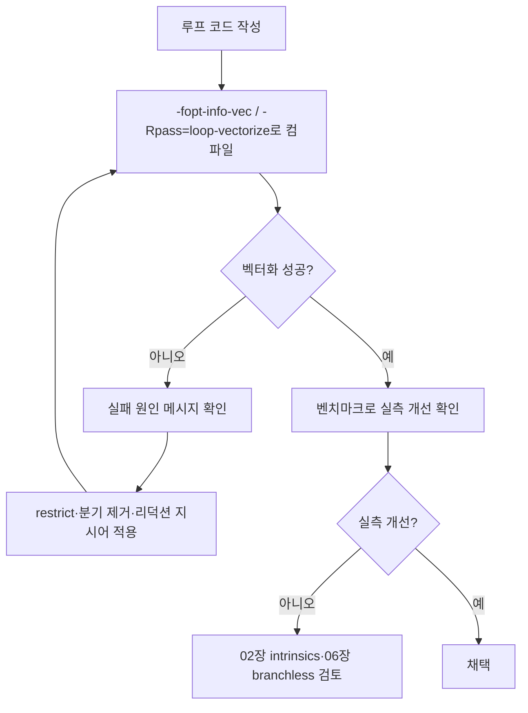

**자동 벡터화 유도와 검증**이란 SIMD 명령어를 손으로 작성하지 않고, 컴파일러의 루프 벡터화 패스(GCC tree-vectorizer, LLVM Loop Vectorizer)가 스칼라 루프를 스스로 벡터 명령으로 바꾸도록 코드 형태를 정돈하고, 그 결과를 벡터화 리포트로 확인해 실패 원인을 되돌려 고치는 작업입니다. 수기 intrinsics나 인라인 어셈블리는 이식성·유지보수 비용이 크므로, 같은 성능을 컴파일러가 자동으로 내줄 수 있는지 먼저 확인하는 것이 순서입니다. 이 장은 "코드를 어떻게 써야 벡터화되기 쉬운가"와 "벡터화되지 않았을 때 무엇을 근거로 판단하는가"라는 두 가지 실무 질문에 집중합니다.

## 이 장을 읽기 전에

**전제 지식**: [01장: SIMD 기초](/post/extreme-optimization/simd-fundamentals-sse-avx/)에서 다룬 SIMD 레지스터·레인(lane) 개념과, Tr.03 [컴파일러·빌드 최적화 인트로](/post/compiler-optimization/getting-started-compiler-build-performance-tuning/)에서 다룬 최적화 레벨(`-O2`/`-O3`)의 의미를 안다고 가정합니다. 어셈블리를 눈으로 읽을 필요는 없지만, 벡터화 리포트에 나오는 "vectorized loop" 같은 문구를 컴파일러 출력으로 다뤄 본 경험이 있으면 좋습니다.

**이 장의 깊이**: 이 장은 **중급** 난이도로, 자동 벡터화가 요구하는 루프 형태·벡터화 리포트 읽는 법·자주 하는 오해 교정까지를 다룹니다. **다루지 않는 것**: SIMD 명령어 자체의 동작 원리(→ [01장](/post/extreme-optimization/simd-fundamentals-sse-avx/)), intrinsics를 손으로 쓰는 방법(→ [02장](/post/extreme-optimization/simd-intrinsics-practical-usage/)), AVX-512 전용 마스크·임베디드 반올림 등 명령어 집합별 세부(→ [03장](/post/extreme-optimization/avx512-avx10-optimization/)), 분기 제거 기법 자체(→ [06장](/post/extreme-optimization/branchless-programming-techniques/)), 포터블 SIMD 라이브러리(→ [13장](/post/extreme-optimization/portable-simd-libraries-highway-xsimd/))입니다. 이 장은 그 앞 단계, 즉 "손대기 전에 컴파일러에게 먼저 맡겨 보는" 판단을 다룹니다.

## 당신의 수준에 맞는 경로

| 수준 | 읽을 부분 | 핵심 목표 |
|------|---------|---------|
| **입문** | "자동 벡터화의 역사와 파이프라인" ~ "벡터화 가능한 루프의 조건" | 왜 자동 벡터화가 생겼고 무엇을 요구하는지 이해 |
| **중급** | "벡터화를 유도하는 코드 패턴" ~ "벡터화 리포트로 실패 원인 검증" | 리포트를 읽고 실패 원인을 코드로 되돌려 고치기 |
| **실무 판단** | "판단 기준" ~ "비판적 시각" | 자동 벡터화로 충분한지, intrinsics로 넘어가야 하는지 결정 |

---

## 자동 벡터화의 역사와 컴파일러 파이프라인

<strong>자동 벡터화(auto-vectorization)</strong>는 컴파일러가 IR(중간 표현) 단계에서 루프를 분석해, 반복마다 하나씩 처리하던 연산을 SIMD 레지스터 폭만큼 묶어 한 번에 처리하도록 바꾸는 최적화입니다. GCC는 2004년경부터 "tree-vectorizer"라는 이름으로 트리 SSA 표현 위에서 루프 벡터화를 구현해 왔고, LLVM은 Loop Vectorizer와 SLP(Superword-Level Parallelism) Vectorizer라는 두 개의 별도 패스로 벡터화를 수행합니다 — 전자는 하나의 루프를 반복 축으로 넓히고, 후자는 서로 다른 스칼라 연산 나열을 하나의 벡터 연산으로 묶습니다. 오랫동안 두 컴파일러 모두 `-O2`에서는 벡터화를 걸지 않고 `-O3`에서만 활성화했는데, 비용 모델이 보수적이어서 `-O2`의 "안전한 속도" 철학과 맞지 않았기 때문입니다. 이 관행은 GCC 12(2022)에서 바뀌었습니다.

> "Vectorization is enabled at `-O2` which is now equivalent to what would have been `-O2 -ftree-vectorize -fvect-cost-model=very-cheap` in the past." — [GCC 12 Release Notes](https://gcc.gnu.org/gcc-12/changes.html)

즉 GCC 12 이후로는 `-O2`에서도 "매우 저렴한" 비용 모델로 벡터화를 시도하며, `-O3`는 더 공격적인(항상 이득이라 확신하지 않아도 시도하는) 비용 모델을 씁니다. Clang/LLVM은 더 이른 시점부터 `-O2`에서 Loop Vectorizer를 기본으로 켜 왔습니다. 정확한 활성화 조건은 컴파일러·버전·타겟에 따라 달라지는 **구현 정의** 사항이므로, 프로젝트가 쓰는 툴체인에서 직접 `-fopt-info-vec`/`-Rpass=loop-vectorize`로 확인하는 것이 유일하게 신뢰할 수 있는 방법입니다.

## 벡터화 가능한 루프의 조건

컴파일러가 루프를 벡터화하려면 몇 가지 구조적 조건이 성립해야 합니다. 첫째, **반복 횟수를 셀 수 있어야(countable)** 합니다 — 컴파일 시점에 정확한 값을 몰라도 되지만, 런타임에 "몇 번 도는지"가 루프 진입 전에 결정되어 있어야 하며, 중간에 `break`나 조건부 `return`으로 빠져나가는 루프는 대체로 벡터화 대상에서 제외됩니다. 둘째, **반복 간 데이터 의존성이 없거나 벡터 연산으로 표현 가능한 형태**여야 합니다 — 이전 반복의 결과를 다음 반복이 그대로 읽는 순차 의존(loop-carried dependency)이 있으면 레인을 나란히 계산할 수 없습니다. 셋째, **포인터 별칭(aliasing)이 없다고 증명 가능**해야 합니다 — 두 포인터가 겹치는 메모리를 가리킬 가능성이 남아 있으면, 컴파일러는 벡터화된 코드가 스칼라 코드와 다른 결과를 낼 위험을 감수하지 않고 포기합니다. 넷째, 루프 본문이 **단순한 산술·비교로 구성**되어야 합니다 — 인라인되지 않는 함수 호출, 예외를 던질 수 있는 연산, 복잡한 분기는 벡터화 패스가 다루는 IR 패턴에서 벗어납니다.

이 네 조건은 서로 독립적이지 않습니다. 예를 들어 `for (int i = 0; i < n; ++i) a[i] = b[i] + c[i];`는 반복 횟수가 `n`으로 셀 수 있고, 각 반복이 서로 다른 인덱스만 건드리므로 의존성이 없어 보이지만, `a`, `b`, `c`가 함수 인자로 들어온 포인터라면 컴파일러는 "혹시 `a`와 `b`가 겹치지 않는가"를 증명할 수 없어 벡터화를 포기하거나, 겹치지 않는 경우와 겹치는 경우 모두를 처리하는 <strong>런타임 별칭 검사(runtime alias check)</strong>를 덧붙인 코드를 생성합니다. 런타임 검사가 붙으면 코드 크기가 늘고 짧은 배열에서는 검사 비용이 벡터화 이득을 상쇄할 수 있으므로, 별칭 여부를 컴파일 시점에 알려 주는 것이 다음 절의 핵심입니다.

## 벡터화를 유도하는 코드 패턴

### 별칭 제거: restrict

**포인터 별칭 문제**를 코드로 직접 해결하는 방법은 C99가 표준화한 `restrict` 한정자를 쓰는 것입니다. C++ 표준에는 `restrict` 키워드가 없지만, GCC·Clang·MSVC 모두 `__restrict`(또는 `__restrict__`)라는 확장으로 이를 지원합니다 — 이는 언어 표준이 아니라 **구현 정의 확장**이므로 이식성이 필요한 코드에서는 매크로로 감싸 컴파일러별 차이를 흡수하는 것이 일반적입니다.

```cpp
#include <cstddef>

// 별칭 가능성 때문에 컴파일러가 벡터화를 주저하거나 런타임 별칭 검사를 추가할 수 있음
void add_plain(float* a, const float* b, const float* c, std::size_t n) {
  for (std::size_t i = 0; i < n; ++i) {
    a[i] = b[i] + c[i];
  }
}

// __restrict로 a, b, c가 서로 겹치지 않음을 컴파일러에 명시
void add_restrict(float* __restrict a, const float* __restrict b,
                   const float* __restrict c, std::size_t n) {
  for (std::size_t i = 0; i < n; ++i) {
    a[i] = b[i] + c[i];
  }
}
```

`__restrict`는 "이 포인터가 가리키는 메모리를 다른 어떤 포인터도 가리키지 않는다"는 **약속**이며, 실제로 겹치는 포인터를 넘기면 미정의 동작입니다. 호출자가 이 계약을 지킬 수 없는 API(예: 같은 버퍼의 부분 구간을 다루는 in-place 연산)에는 함부로 붙이지 않습니다.

> "G++ understands the C99 feature of restricted pointers, specified with the `__restrict__`, or `__restrict` type qualifier." — [GCC: Restricted Pointers](https://gcc.gnu.org/onlinedocs/gcc/Restricted-Pointers.html)

### 루프 본문 단순화

루프 안에서 인라인되지 않는 함수를 호출하거나, 반복마다 다른 경로를 타는 분기가 있으면 벡터화 패스가 루프 본문을 하나의 벡터 연산 패턴으로 인식하지 못합니다. 조건에 따라 다른 값을 고르는 것 자체는 `select`류 벡터 명령으로 표현 가능하므로, `if`문을 산술·삼항 연산으로 바꾸면 벡터화 가능성이 높아집니다. 다만 분기를 없애는 구체적인 기법(마스크, 비트 트릭)과 그 트레이드오프는 [06장: Branchless 프로그래밍 기법](/post/extreme-optimization/branchless-programming-techniques/)에서 다루므로 여기서는 "벡터화 리포트가 분기를 실패 원인으로 지목했을 때 06장의 기법을 적용 대상으로 검토한다"는 연결만 짚습니다.

```cpp
#include <cstddef>

// 분기가 루프 본문에 있어 벡터화가 실패하기 쉬움
void clamp_branchy(float* __restrict a, std::size_t n, float lo, float hi) {
  for (std::size_t i = 0; i < n; ++i) {
    if (a[i] < lo) a[i] = lo;
    else if (a[i] > hi) a[i] = hi;
  }
}

// 삼항 연산으로 표현하면 컴파일러가 select 계열 벡터 명령으로 치환하기 쉬움
void clamp_branchless(float* __restrict a, std::size_t n, float lo, float hi) {
  for (std::size_t i = 0; i < n; ++i) {
    float v = a[i];
    v = (v < lo) ? lo : v;
    v = (v > hi) ? hi : v;
    a[i] = v;
  }
}
```

### 리덕션과 부동소수점 순서

**리덕션(reduction)**, 즉 배열을 순회하며 하나의 값(합·최댓값 등)으로 누적하는 패턴은 언뜻 단순해 보이지만 부동소수점 덧셈에서는 까다롭습니다. IEEE 754 부동소수점 덧셈은 결합 법칙이 성립하지 않으므로 — `(a+b)+c`와 `a+(b+c)`가 반올림 오차 때문에 정확히 같은 값이 아닐 수 있으므로 — 컴파일러는 기본적으로 반복 순서를 바꾸는 벡터화를 스칼라와 다른 결과를 낼 위험으로 간주해 보수적으로 접근합니다. 이를 허용하려면 `-ffast-math`/`-fassociative-math` 같은 재결합 허용 플래그를 켜거나, 결과의 미세한 오차를 감수한다는 것을 코드로 명시하는 `#pragma omp simd reduction(+:sum)` 같은 지시어를 씁니다.

```cpp
#include <cstddef>

float sum_reduction(const float* __restrict a, std::size_t n) {
  float sum = 0.0f;
#pragma omp simd reduction(+:sum)
  for (std::size_t i = 0; i < n; ++i) {
    sum += a[i];
  }
  return sum;
}
```

`#pragma omp simd`는 OpenMP를 링크하지 않아도 GCC(`-fopenmp-simd`)·Clang(`-fopenmp-simd`)에서 인식하는 지시어로, "이 루프의 반복 순서를 바꿔도 괜찮다"는 책임을 프로그래머가 컴파일러에 넘기는 것입니다. 재결합으로 인한 오차가 허용 범위 밖이라면(예: 금융 계산처럼 재현성이 계약인 코드) 이 경로 자체를 선택하지 않아야 합니다.

## 벡터화 리포트로 실패 원인 검증

**벡터화 리포트**는 컴파일러가 어떤 루프를 벡터화했는지, 벡터화하지 못했다면 왜 못했는지를 컴파일 시점에 출력하는 진단 메시지입니다. 코드를 고친 뒤 "빨라졌겠지"라고 추측하는 대신, 리포트로 실제 벡터화 여부를 확인하고 실패했다면 그 이유를 코드로 되돌려 고치는 것이 이 절차의 핵심입니다.

GCC는 `-fopt-info-vec`(성공·실패 모두), `-fopt-info-vec-optimized`(성공만), `-fopt-info-vec-missed`(실패만) 옵션으로 벡터화 진단을 표준 오류 출력이나 파일로 냅니다.

```bash
g++ -O2 -fopt-info-vec-missed -c loop.cpp -o /dev/null
```

> "Print information about missed optimizations. Individual passes control which information to include in the output." — [GCC: Developer Options (-fopt-info)](https://gcc.gnu.org/onlinedocs/gcc/Developer-Options.html)

Clang/LLVM은 `-Rpass=loop-vectorize`(성공), `-Rpass-missed=loop-vectorize`(실패), `-Rpass-analysis=loop-vectorize`(실패 원인이 된 구체적인 문장)를 씁니다.

```bash
clang++ -O2 -Rpass=loop-vectorize -Rpass-missed=loop-vectorize \
        -Rpass-analysis=loop-vectorize -c loop.cpp -o /dev/null
```

`add_plain`처럼 별칭 가능성이 남은 함수를 이 옵션으로 컴파일하면 "vectorized loop"가 아니라 "loop not vectorized: cannot prove pointers refer to disjoint arrays" 계열의 메시지가 나오는 것이 전형적입니다. 이 메시지가 나오면 앞 절의 `__restrict` 패턴을 적용하고 다시 컴파일해, 메시지가 "vectorized loop"로 바뀌는지 확인합니다. Tr.03의 [컴파일러 intrinsics 카탈로그](/post/compiler-optimization/compiler-intrinsics-catalog/)에는 컴파일러가 최종적으로 어떤 intrinsics로 벡터 연산을 내보내는지까지 연결되어 있어, 리포트만으로 부족할 때 생성된 어셈블리를 함께 대조하면 도움이 됩니다.

리포트가 "vectorized"라고 확인해 주는 것은 **컴파일이 벡터 명령을 냈다는 사실**이지 **실제로 더 빨라졌다는 보장**은 아닙니다. 아래는 `add_plain`과 `add_restrict`를 같은 입력으로 반복 호출해 실측하는 Google Benchmark 스켈레톤입니다(x86-64, GCC 13 이상 또는 Clang 17 이상, `-O2 -march=native` 기준 예시이며 실제 배율은 배열 크기·정렬·타겟 아키텍처에 따라 달라집니다).

```cpp
#include <benchmark/benchmark.h>
#include <vector>

void add_plain(float* a, const float* b, const float* c, std::size_t n) {
  for (std::size_t i = 0; i < n; ++i) a[i] = b[i] + c[i];
}

void add_restrict(float* __restrict a, const float* __restrict b,
                   const float* __restrict c, std::size_t n) {
  for (std::size_t i = 0; i < n; ++i) a[i] = b[i] + c[i];
}

static void BM_AddPlain(benchmark::State& state) {
  std::size_t n = state.range(0);
  std::vector<float> a(n), b(n, 1.0f), c(n, 2.0f);
  for (auto _ : state) {
    add_plain(a.data(), b.data(), c.data(), n);
    benchmark::DoNotOptimize(a.data());
  }
}
BENCHMARK(BM_AddPlain)->Arg(1 << 16);

static void BM_AddRestrict(benchmark::State& state) {
  std::size_t n = state.range(0);
  std::vector<float> a(n), b(n, 1.0f), c(n, 2.0f);
  for (auto _ : state) {
    add_restrict(a.data(), b.data(), c.data(), n);
    benchmark::DoNotOptimize(a.data());
  }
}
BENCHMARK(BM_AddRestrict)->Arg(1 << 16);

BENCHMARK_MAIN();
```

`g++ -O2 -march=native bench.cpp -lbenchmark -lpthread`로 빌드해 실행하면, `add_restrict`가 `add_plain`보다 확연히 빠르게 나오는 경우가 흔하지만(런타임 별칭 검사와 스칼라 폴백 경로가 사라지므로), 배열 크기가 SIMD 폭 대비 너무 작으면 차이가 거의 없거나 오히려 벡터화 프롤로그·에필로그 오버헤드로 역전될 수 있습니다. 리포트와 벤치마크를 함께 보는 것이 이 절차의 마지막 단계입니다.



## 자주 하는 오해

<strong>"`-O3`만 켜면 벡터화 가능한 루프는 전부 벡터화된다"</strong>는 사실이 아닙니다. `-O3`는 더 많은 시도를 하도록 비용 모델을 완화할 뿐, 포인터 별칭·복잡한 분기·비인라인 함수 호출 같은 구조적 장애물은 여전히 벡터화를 막습니다. 리포트로 실제 결과를 확인하지 않고 최적화 레벨만 올리는 것은 근거 없는 낙관입니다.

<strong>"부동소수점 합산 루프는 항상 벡터화된다"</strong>도 오해입니다. 앞서 다룬 대로 IEEE 754 덧셈은 결합 법칙이 없어, 컴파일러는 기본 설정에서 리덕션 순서를 바꾸는 벡터화를 스스로 허용하지 않습니다. `-ffast-math` 계열 플래그나 `#pragma omp simd reduction`으로 명시적으로 허가해야 하며, 이는 정밀도 트레이드오프를 코드 작성자가 떠안는 결정입니다.

<strong>"벡터화 리포트가 성공을 알리면 무조건 더 빠르다"</strong>도 틀린 가정입니다. 짧은 배열, 정렬되지 않은 메모리, gather/scatter가 필요한 불규칙 접근 패턴에서는 벡터화된 코드가 프롤로그·에필로그·런타임 검사 오버헤드 때문에 스칼라보다 느릴 수 있습니다. 리포트는 "시도했다"를 말해 줄 뿐이므로, 실측 벤치마크로 마무리해야 합니다.

## 판단 기준

| 상황 | 권장 | 비권장 |
|------|------|--------|
| 단순 산술 루프, 포인터 별칭 의심 | `__restrict` 적용 후 리포트 재확인 | 별칭 의심 상태로 방치 |
| 리포트가 "분기 때문에 실패" 지목 | 06장 branchless 기법 검토 | 분기 유지한 채 `-O3`만 상향 |
| 리포트가 "비인라인 호출 때문에 실패" 지목 | 함수를 인라인하거나 루프 밖으로 이동 | 호출을 유지하고 방치 |
| 부동소수점 리덕션, 정밀도 여유 있음 | `#pragma omp simd reduction` 명시 | 암묵적으로 `-ffast-math` 전역 적용 |
| 리포트는 성공했지만 벤치마크에서 개선 없음 | 02장 intrinsics로 세밀 제어 검토 | 리포트만 보고 채택 확정 |
| 정밀도·재현성이 계약인 코드(금융 등) | 리덕션 자동 벡터화 보류, 스칼라 유지 | 재결합 허용 플래그 무분별 적용 |

## 비판적 시각

자동 벡터화는 "공짜 성능"이 아니라 **컴파일러의 증명 능력**에 의존하는 최적화입니다. 컴파일러가 별칭 없음·의존성 없음을 증명하지 못하면 아무리 논리적으로 벡터화 가능한 루프라도 스칼라로 남습니다. 이는 결함이 아니라 보수적 설계의 결과이며, 프로그래머가 `restrict`나 단순한 루프 형태로 증명 부담을 줄여 주는 수밖에 없습니다. 또한 벡터화 리포트의 메시지 형식과 세부 진단 수준은 컴파일러·버전마다 달라 이식 가능한 자동화 스크립트를 짜기 어렵고, CI에서 "벡터화 여부"를 회귀 검사로 굳히려면 리포트 파싱 자체가 유지보수 대상이 됩니다. `-ffast-math` 계열 플래그는 리덕션 벡터화를 쉽게 열어 주지만 프로그램 전역의 부동소수점 의미론을 바꿔 버리므로, 리덕션 하나를 위해 전역 플래그를 켜는 대신 지시어 단위로 범위를 좁히는 편이 안전합니다. 마지막으로, 자동 벡터화로 얻는 이득은 AVX-512처럼 넓은 레지스터를 가진 타겟에서 커지는 경향이 있어 [03장](/post/extreme-optimization/avx512-avx10-optimization/)에서 다루는 타겟별 명령어 집합 선택과 함께 검토해야 실제 배포 환경에서의 이득을 가늠할 수 있습니다.

## 마무리

- [ ] GCC 12 이후 `-O2`에서도 벡터화가 시도된다는 사실과, 정확한 활성화 조건은 리포트로 직접 확인해야 하는 이유를 설명할 수 있다.
- [ ] 벡터화 가능한 루프의 조건(셀 수 있는 반복, 의존성 없음, 별칭 증명, 단순한 본문)을 말할 수 있다.
- [ ] `__restrict`, 분기 단순화, 리덕션 지시어로 벡터화를 유도하는 패턴을 코드로 작성할 수 있다.
- [ ] `-fopt-info-vec`/`-Rpass=loop-vectorize` 리포트를 읽고 실패 원인을 코드 수정으로 되돌릴 수 있다.
- [ ] 벡터화 성공 리포트와 실측 성능 개선이 다를 수 있다는 것을 알고 벤치마크로 검증할 수 있다.
- [ ] 자동 벡터화로 부족할 때 02장 intrinsics나 06장 branchless로 넘어갈 판단 기준을 말할 수 있다.

**이전 장**: [AVX-512/AVX10.2 최적화](/post/extreme-optimization/avx512-avx10-optimization/)

**다음 장에서는** 컴파일러 자동 벡터화만으로 해결되지 않는 **레이턴시 은닉** 문제를 다룹니다. 캐시 미스를 미리 예측해 `prefetch` 명령으로 데이터를 앞당겨 가져오는 전략과, 실제로 적용할지 판단하는 기준을 정리합니다.

→ [Prefetch 전략과 적용 판단](/post/extreme-optimization/software-prefetch-strategy/)
