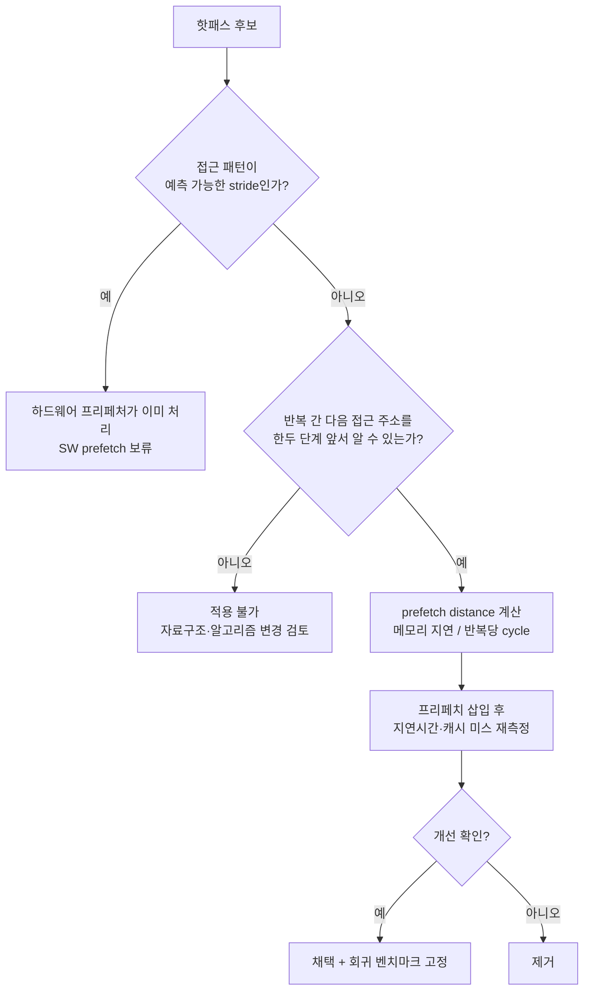

**소프트웨어 프리페치(software prefetch)**는 `_mm_prefetch`나 `__builtin_prefetch` 같은 명령으로, 실제 데이터가 필요해지기 전에 미리 캐시로 당겨와 메모리 지연시간을 다른 작업 뒤에 숨기는 기법을 말합니다. 문제는 이 명령이 CPU에 "힌트"만 줄 뿐 실행을 강제하지 않는다는 점과, 이미 하드웨어 프리페처가 상당 부분을 알아서 처리한다는 점입니다. 잘못된 자리에 넣은 프리페치는 개선은커녕 캐시를 오염시키고 명령어 디코드 대역폭만 낭비하는 역효과를 내므로, 이 장은 "언제 소프트웨어 프리페치가 실제로 이득인지"를 판단하는 근거를 정리합니다.

## 이 장을 읽기 전에

이 장은 [자동 벡터화 유도와 검증](/post/extreme-optimization/auto-vectorization-guidance-verification/)에서 다룬 "컴파일러가 이미 하는 일과 사람이 개입해야 하는 일을 구분한다"는 태도를 그대로 이어받습니다. 캐시 라인 크기, L1/L2/L3 계층 구조, 배열의 순차 접근이 왜 빠른지에 대한 기본 감각이 있다면 충분하며, 필요하면 [Tr.04 캐시 친화적 접근 패턴](/post/memory-optimization/cache-friendly-access-patterns/)을 먼저 읽는 것이 도움이 됩니다. 이 장의 깊이는 **심화**입니다: `_mm_prefetch`/`__builtin_prefetch`의 힌트 레벨, 프리페치 거리 계산, 하드웨어 프리페처와의 상호작용까지 다룹니다. **다루지 않는 것**은 하드웨어 프리페처 자체를 MSR·BIOS 설정으로 끄거나 조정하는 방법([Tr.05 CPU 마이크로아키텍처](/post/cpu-optimization/getting-started-cpu-microarchitecture-performance-tuning/) 영역), 그리고 캐시 배치 자체를 바꾸는 자료구조 재설계([Cache-oblivious 알고리즘 설계](/post/extreme-optimization/cache-oblivious-algorithm-design/))입니다.

## 당신의 수준에 맞는 경로

| 수준 | 읽을 부분 | 핵심 목표 |
|------|---------|---------|
| **중급자** | "프리페치 명령어의 등장 배경" ~ "소프트웨어 프리페치 명령어" | `_mm_prefetch`/`__builtin_prefetch`의 힌트 레벨과 기본 사용법 이해 |
| **심화 학습자** | "프리페치 거리 계산" ~ "측정" | 포인터 체이싱에서 거리를 계산하고 벤치마크로 검증 |
| **전문가** | "판단 기준" ~ "비판적 시각" | 하드웨어 프리페처와의 상호작용을 근거로 도입/철회를 결정 |

---

## 프리페치 명령어의 등장 배경

**PREFETCHh** 계열 명령(`PREFETCHT0`, `PREFETCHT1`, `PREFETCHT2`, `PREFETCHNTA`)은 1999년 Intel Pentium III의 SSE(Streaming SIMD Extensions)와 함께 x86에 추가되었습니다. 당시 목표는 명확했습니다 — 컴파일러가 접근 패턴을 정적으로 알 수 있는 루프(배열 순회, 행렬 연산)에서, 프로그래머나 컴파일러가 실제 로드보다 몇 회전 앞서 프리페치 명령을 넣어 메모리 지연시간을 계산과 겹치게 하는 것입니다. GCC는 이를 [`__builtin_prefetch`](https://gcc.gnu.org/onlinedocs/gcc/Other-Builtins.html)라는 컴파일러 내장 함수로 감싸 x86 외 타깃(ARM의 `PLD`/`PLDW` 등)에도 이식 가능하게 만들었고, MSVC와 Clang은 `<xmmintrin.h>`의 `_mm_prefetch`로 x86 인트린식을 직접 노출합니다. 두 인터페이스 모두 "힌트"이지 명령이 아니라는 점은 동일합니다 — CPU는 이를 무시할 수 있고, 실제 프리페치 여부와 깊이는 마이크로아키텍처 구현에 달려 있습니다. 컴파일러별 인트린식 대응표는 [Tr.03 컴파일러 intrinsics 카탈로그](/post/compiler-optimization/compiler-intrinsics-catalog/)에서 확인할 수 있습니다.

## 하드웨어 프리페처의 동작 원리

현대 CPU는 이미 여러 계층의 **하드웨어 프리페처**를 갖추고 있습니다. L1 인접 라인 프리페처(next-line prefetcher)는 캐시 미스가 난 라인의 다음 라인을 자동으로 가져오고, L2/L1 스트라이드 프리페처는 최근 몇 번의 접근 주소 차이(stride)를 관찰해 일정한 간격이 반복되면 그 간격만큼 앞선 주소를 미리 가져옵니다. 이런 학습 기반 동작 때문에 배열을 순차적으로 훑는 루프에서는 몇 번의 워밍업 반복만 지나면 하드웨어가 이미 다음 캐시 라인들을 대기열에 올려두고 있는 경우가 많습니다. 반대로 **포인터 체이싱**(연결 리스트, 해시 테이블 버킷, 트리 노드 순회)처럼 다음 주소가 현재 노드를 역참조해야만 드러나는 패턴에서는, 하드웨어가 관찰할 수 있는 "규칙적인 간격"이 존재하지 않으므로 스트라이드 프리페처가 개입할 여지가 거의 없습니다. 소프트웨어 프리페치가 실질적인 여지를 갖는 지점은 바로 이 틈 — 하드웨어가 예측하지 못하지만 프로그램은 다음 접근 주소를 한두 단계 앞서 알고 있는 경우입니다.

## 소프트웨어 프리페치 명령어: 힌트 레벨과 사용법

`_mm_prefetch(addr, hint)`와 `__builtin_prefetch(addr, rw, locality)`는 같은 하드웨어 명령을 서로 다른 인터페이스로 감싼 것입니다. 전자는 x86 `_MM_HINT_*` 상수로 캐시 계층을 직접 지정하고, 후자는 0~3의 정수로 "시간적 지역성 정도"를 추상적으로 표현합니다.

| `_mm_prefetch` 힌트 | 의미 | `__builtin_prefetch` locality | 대응 의미 |
|---|---|---|---|
| `_MM_HINT_T0` | 모든 캐시 계층(L1 포함)에 적재 | 3 (기본값) | 높은 시간적 지역성, 가능한 모든 계층에 유지 |
| `_MM_HINT_T1` | L1을 제외한 계층에 적재 | 2 | 중간 정도 지역성 |
| `_MM_HINT_T2` | L2 이하 계층에 적재 | 1 | 낮은 지역성 |
| `_MM_HINT_NTA` | 캐시 오염을 피하는 비임시(non-temporal) 적재 | 0 | 지역성 없음, 캐시에 남길 필요 없음 |

아래는 배열을 순차 합산하는 코드입니다. 이런 규칙적 stride 접근은 하드웨어 스트라이드 프리페처가 몇 회전 만에 학습하므로, 여기에 소프트웨어 프리페치를 추가해도 대개 이득이 없거나 명령어 오버헤드만 늘립니다.

```cpp
#include <cstddef>
#include <vector>

// 하드웨어 프리페처가 이미 이 접근 패턴을 학습하므로 별도 프리페치가 불필요하다.
double sum_sequential(const std::vector<double>& data) {
  double total = 0.0;
  for (std::size_t i = 0; i < data.size(); ++i) {
    total += data[i];
  }
  return total;
}
```

반면 다음 노드 주소를 미리 알 수 있는 포인터 체이싱에서는 `distance`만큼 앞선 노드를 별도 포인터로 따라가며 프리페치를 걸 수 있습니다. `fast` 포인터가 `slow` 포인터보다 `distance`칸 앞서 노드를 미리 캐시로 당겨오는 동안, `slow` 포인터는 이전에 당겨진 노드를 처리합니다.

```cpp
#include <cstddef>

struct Node {
  Node* next;
  long value;
};

// distance칸 앞선 노드를 미리 프리페치해 포인터 역참조 지연시간을
// 현재 노드 처리 시간과 겹치게 한다. rw=0(읽기 전용), locality=1(낮은 지역성).
long sum_linked_list_prefetch(Node* head, int distance) {
  long total = 0;
  Node* slow = head;
  Node* fast = head;
  for (int i = 0; i < distance && fast; ++i) fast = fast->next;

  while (slow) {
    if (fast) {
      __builtin_prefetch(fast, 0, 1);
      fast = fast->next;
    }
    total += slow->value;
    slow = slow->next;
  }
  return total;
}
```

`distance`가 너무 작으면 프리페치가 로드 시점에 이미 늦어 지연시간을 못 가리고, 너무 크면 아직 쓰이지 않을 데이터가 캐시를 채워 정말 필요한 라인을 밀어낼 수 있습니다. 이 균형을 계산으로 좁히는 방법이 다음 절의 주제입니다.

## 프리페치 거리 계산

**프리페치 거리(prefetch distance)**는 "몇 번의 반복 앞에서 프리페치를 걸어야 하는가"를 나타내며, 대략 다음 관계로 근사할 수 있습니다.

```text
prefetch_distance (반복 수) ≈ 메모리 접근 지연시간(cycle) / 반복당 소요 cycle 수
```

예를 들어 DRAM 접근 지연시간이 대략 200cycle이고 포인터 체이싱 루프의 반복당 처리 비용이 약 20cycle이라면, `distance ≈ 10`이 출발점이 됩니다. 이 값은 플랫폼(메모리 컨트롤러, DRAM 세대, NUMA 거리)과 컴파일러 최적화 수준에 따라 달라지므로 **고정 상수로 하드코딩하지 말고 실제 환경에서 몇 개 후보값을 스윕(sweep)해 측정**하는 것이 안전합니다. 반복당 cycle 수는 프로파일러로 측정하고, 메모리 지연시간은 `Intel MLC`나 유사 도구, 혹은 알려진 플랫폼 스펙에서 가져옵니다 — 두 값 모두 추정치이므로 거리 자체보다 "측정으로 검증했는가"가 더 중요합니다.

## 측정: 프리페치 효과 벤치마크

아래는 무작위로 섞은 메모리 위치에 노드를 배치해 캐시 지역성이 없는 포인터 체이싱을 재현하고, 프리페치 유무·거리별로 비교하는 Google Benchmark 코드입니다. 노드의 **논리적 순회 순서**(`next` 포인터 체인)는 0→1→…→n-1로 고정하되, 노드가 저장되는 **물리적 메모리 위치**는 무작위로 섞어 순차 접근의 이점을 제거합니다.

```cpp
#include <benchmark/benchmark.h>
#include <vector>
#include <numeric>
#include <algorithm>
#include <random>

struct Node { Node* next; long value; };

struct ShuffledList {
  std::vector<Node> nodes;
  Node* head;
};

static ShuffledList build_shuffled_list(std::size_t n) {
  std::vector<std::size_t> order(n);
  std::iota(order.begin(), order.end(), 0);
  std::mt19937 rng(42);
  std::shuffle(order.begin(), order.end(), rng);  // order[k]: k번째 논리 노드가 저장될 물리 슬롯

  std::vector<Node> nodes(n);
  for (std::size_t k = 0; k < n; ++k) {
    Node& cur = nodes[order[k]];
    cur.value = static_cast<long>(k);
    cur.next = (k + 1 < n) ? &nodes[order[k + 1]] : nullptr;
  }
  Node* head = &nodes[order[0]];  // move 전에 포인터를 확보(버퍼 주소는 move로 바뀌지 않음)
  return {std::move(nodes), head};
}

static void BM_NoPrefetch(benchmark::State& state) {
  auto list = build_shuffled_list(1 << 20);
  for (auto _ : state) {
    long total = 0;
    for (Node* p = list.head; p; p = p->next) total += p->value;
    benchmark::DoNotOptimize(total);
  }
}
BENCHMARK(BM_NoPrefetch);

static void BM_WithPrefetch(benchmark::State& state) {
  auto list = build_shuffled_list(1 << 20);
  const int distance = static_cast<int>(state.range(0));
  for (auto _ : state) {
    long total = 0;
    Node* slow = list.head;
    Node* fast = list.head;
    for (int i = 0; i < distance && fast; ++i) fast = fast->next;
    while (slow) {
      if (fast) { __builtin_prefetch(fast, 0, 1); fast = fast->next; }
      total += slow->value;
      slow = slow->next;
    }
    benchmark::DoNotOptimize(total);
  }
}
BENCHMARK(BM_WithPrefetch)->Arg(1)->Arg(4)->Arg(16)->Arg(64);

BENCHMARK_MAIN();
```

`g++ -O2 -march=native bench.cpp -lbenchmark -lpthread`로 빌드해 실행합니다(x86-64, GCC 13 기준 예시 환경). 노드 1M개, 8바이트 정수 `value` 기준으로는 `distance=4~16` 구간에서 `BM_NoPrefetch` 대비 개선이 나타나고, `distance`가 지나치게 커지면(예: 64 이상, 리스트 길이 대비 상대적으로) 개선 폭이 줄어들거나 역전되는 경우가 흔합니다 — 정확한 배율과 최적 거리는 메모리 컨트롤러·DRAM 세대·NUMA 구성에 따라 달라지므로 반드시 대상 플랫폼에서 재현합니다. `__builtin_prefetch`는 GCC/Clang 전용 내장 함수이므로 MSVC에서는 `_mm_prefetch`로 바꿔야 하며, 이런 컴파일러별 차이는 [Tr.03 컴파일러 intrinsics 카탈로그](/post/compiler-optimization/compiler-intrinsics-catalog/)에서 대응표로 확인할 수 있습니다.

## 하드웨어 프리페처와의 상호작용

소프트웨어 프리페치는 하드웨어 프리페처와 독립적으로 동작하지 않습니다. 규칙적인 stride 루프에 수동 프리페치를 추가하면, 하드웨어가 이미 채워 넣은 캐시 라인에 대해 같은 라인을 다시 요청하는 중복 명령이 되어 디코드·이슈 대역폭만 소모합니다. 더 나쁜 경우는 소프트웨어 프리페치 요청이 메모리 서브시스템의 미스 처리 버퍼(MSHR 등, 구현에 따라 명칭과 개수가 다름)를 점유해, 실제로 필요한 다른 로드나 하드웨어 프리페처의 요청이 지연되는 상황입니다. 이런 자원 경합은 마이크로아키텍처마다 리소스 크기와 정책이 다르므로 **구현정의**로 취급하고, "프리페치를 넣었더니 오히려 느려졌다"는 결과가 나오면 우선 의심할 원인 목록에 올려 둡니다. 반대 방향으로, 포인터 체이싱처럼 하드웨어가 패턴을 학습할 수 없는 영역에서는 소프트웨어 프리페치가 하드웨어의 공백을 메우는 유일한 수단이 됩니다 — 다만 이 경우에도 프리페치 대상 자체가 유효한 메모리인지, 리스트 끝을 넘어서지 않는지는 프로그램 로직이 보장해야 하며, [`PREFETCHh` 명령은 어디까지나 힌트](https://www.felixcloutier.com/x86/prefetchh)일 뿐이라 CPU는 이를 실행하거나 조용히 무시할 수 있습니다.

## 자주 하는 오해 교정

**"프리페치를 많이 넣을수록 더 빨라진다"**는 틀린 직관입니다. 프리페치 명령 하나하나도 디코드·이슈 슬롯을 쓰고, 목표보다 훨씬 앞서 당겨온 데이터는 실제로 쓰이기 전에 다른 라인에 밀려 캐시에서 쫓겨날 수 있습니다. 이 경우 프리페치가 오히려 유용한 라인을 캐시에서 몰아내는 **캐시 오염(cache pollution)**을 일으켜 전체 성능을 떨어뜨립니다.

**"하드웨어 프리페처가 있으니 소프트웨어 프리페치는 이제 필요 없다"**는 절반만 맞습니다. 순차·규칙적 stride 접근에는 맞는 말이지만, 포인터 체이싱처럼 하드웨어가 다음 주소를 예측할 수 없는 패턴에서는 여전히 소프트웨어 프리페치가 유일한 개입 수단입니다. 접근 패턴이 규칙적인지 불규칙적인지를 먼저 확인하지 않고 이 명제를 일반화하면 안 됩니다.

**"연결 리스트에서 다음 노드를 프리페치하면 항상 개선된다"**도 과도한 일반화입니다. 단일 연결 리스트에서 `next` 포인터는 현재 노드를 역참조해야만 알 수 있으므로, 한 번에 한 단계만 미리 볼 수 있습니다. 이 한 단계가 메모리 지연시간을 가릴 만큼의 다른 작업(반복당 처리 비용)과 겹쳐지지 않으면 개선 폭은 미미하거나 없습니다. 앞서 본 `distance` 기반 두 포인터 기법이 필요한 이유가 여기에 있습니다 — 여러 노드를 앞서 순회해 여러 프리페치를 동시에 진행 중인 상태(메모리 수준 병렬성)를 만들어야 지연시간이 실제로 겹쳐집니다.

## 판단 기준: 언제 쓰고 언제 피할지

| 상황 | 권장 | 비권장 |
|------|------|--------|
| 배열 순차 합산·행렬 연산 등 규칙적 stride 접근 | 하드웨어 프리페처에 위임(추가 조치 없음) | 수동 프리페치 삽입 |
| 포인터 체이싱(연결 리스트·해시맵·트리)이면서 반복당 작업량이 충분 | distance 스윕 후 `__builtin_prefetch`/`_mm_prefetch` 도입 | 프리페치 없이 방치 |
| 데이터셋이 이미 L1/L2에 상주(작은 작업 단위) | 프리페치 생략 | 불필요한 프리페치 명령 추가 |
| 접근 패턴이 규칙적인지 불규칙적인지 불확실 | 프로파일러로 캐시 미스율 먼저 확인 | 추측만으로 프리페치 삽입 |
| 프리페치 도입 후 회귀 벤치마크 미비 | 도입 보류, 자료구조 재설계 우선 검토 | "일단 넣고 보기" |



**적용 전 확인 사항**은 다음과 같습니다.

- 접근 패턴이 하드웨어가 학습 가능한 규칙적 stride인지, 아니면 포인터 체이싱류의 불규칙 패턴인지 프로파일러로 먼저 구분했는가.
- 프리페치 거리를 상수로 고정하지 않고 대상 플랫폼에서 스윕해 최적값을 찾았는가.
- 프리페치 대상 포인터가 리스트 끝을 넘어서지 않도록 널 체크를 넣었는가.
- 개선 여부를 캐시 미스 카운터(`perf stat -e cache-misses` 등)와 실제 지연시간 양쪽으로 확인했는가.
- 회귀 벤치마크에 프리페치 유무 비교를 고정해, 이후 컴파일러·자료구조 변경 시 이득이 사라지는지 감지할 수 있는가.

## 비판적 시각: 한계와 트레이드오프

소프트웨어 프리페치는 **이식성 비용**이 큽니다. `__builtin_prefetch`는 GCC/Clang 전용이고 `_mm_prefetch`는 x86 인트린식이라, ARM이나 다른 컴파일러로 옮기면 조건부 컴파일이나 별도 추상화가 필요합니다. 또한 **최적 거리가 마이크로아키텍처·메모리 구성에 강하게 의존**하므로, 한 세대의 CPU에서 측정한 거리가 다음 세대에서는 최적이 아니거나 오히려 역효과를 낼 수 있습니다. 프리페치는 CPU가 무시할 수 있는 힌트일 뿐이므로 "정말 실행되었는지"를 코드만 보고 확신할 수 없고, 반드시 캐시 미스 카운터로 확인해야 합니다. 마지막으로, 포인터 체이싱 자체를 프리페치로 완화하는 대신 **자료구조를 배열 기반(예: 개방 주소 해시, B-트리류 블록 배치)으로 바꿔 애초에 포인터 체이싱을 줄이는 편**이 더 근본적인 해법일 때가 많습니다. 프리페치는 자료구조를 바꾸기 어려운 상황에서의 완화책이지, 기본 해법으로 삼을 기법은 아닙니다.

## 마무리

- [ ] `_mm_prefetch`의 `_MM_HINT_T0/T1/T2/NTA`와 `__builtin_prefetch`의 locality 0~3 대응 관계를 설명할 수 있다.
- [ ] 하드웨어 프리페처가 규칙적 stride를 학습하는 원리와, 포인터 체이싱에서 왜 학습이 어려운지 설명할 수 있다.
- [ ] 프리페치 거리를 메모리 지연시간과 반복당 cycle로 근사 계산하고, 실측으로 스윕해 검증할 수 있다.
- [ ] "많을수록 좋다", "하드웨어가 다 한다", "다음 노드 프리페치는 항상 이득" 세 가지 오해를 근거를 들어 반박할 수 있다.
- [ ] 캐시 미스 카운터와 회귀 벤치마크로 프리페치 도입 여부를 판단 기준 표에 따라 결정할 수 있다.

**다음 장에서는** 조건 분기 자체를 줄이거나 예측 실패 비용을 회피하는 [Branchless 프로그래밍 기법](/post/extreme-optimization/branchless-programming-techniques/)을 다룹니다. 프리페치가 "메모리 지연시간을 숨기는" 기법이라면, branchless는 "분기 예측 실패 비용을 없애는" 기법으로 목적이 다르지만, 둘 다 하드웨어의 예측 메커니즘(프리페처·분기 예측기)과 소프트웨어 개입의 경계를 판단해야 한다는 점에서 이어집니다.
