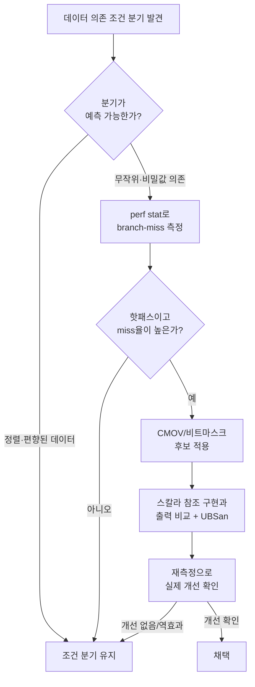

**Branchless 프로그래밍**이란 실행 경로를 조건 분기(conditional branch) 명령 대신 데이터 흐름만으로 결정하도록 코드를 재구성해, 분기 예측기(branch predictor)가 틀렸을 때 발생하는 파이프라인 플러시 비용을 원천적으로 피하는 기법을 말합니다. 데이터 의존적이고 무작위에 가까운 조건(정렬되지 않은 배열의 임계값 비교, 암호화 루틴의 비밀 값 분기 등)은 아무리 정교한 예측기도 안정적으로 맞히기 어렵고, 이런 조건이 초당 수억 번 실행되는 핫패스에 있으면 예측 실패 하나하나가 누적되어 무시할 수 없는 지연으로 번집니다. 이 장은 조건부 이동(conditional move)과 비트마스크 트릭이라는 두 축을 중심으로, "분기를 없앤다"는 발상이 실제로 어떻게 명령어 수준에서 구현되고, 언제 이득이 되며 언제 오히려 손해인지를 다룹니다.

## 이 장을 읽기 전에

**완전한 초보자?** 분기 예측이 무엇이고 예측 실패가 왜 비용을 발생시키는지는 [CPU 마이크로아키텍처 트랙의 분기 예측 메커니즘과 비용](/post/cpu-optimization/branch-prediction-mechanisms-cost/)에서 다룹니다. 이 장은 그 지식을 전제로, "예측이 어려운 분기를 어떻게 없애는가"에 집중합니다. 정수의 2의 보수 표현과 비트 연산(`&`, `|`, `^`, `~`, 시프트)의 기본 의미를 알고 있으면 충분합니다.

**이 장의 깊이**: 이 장은 **심화** 수준입니다. CMOV 조건부 이동의 동작 원리, 비트마스크 기반 selection 패턴, 컴파일러가 분기 대신 CMOV를 선택하는 기준과 그 반대가 유리한 경우까지 다룹니다. **다루지 않는 것**: SIMD 레인 단위의 마스크 연산(블렌드·마스크 로드/스토어)은 SIMD 트랙([01](/post/extreme-optimization/simd-fundamentals-sse-avx/)~[04](/post/extreme-optimization/auto-vectorization-guidance-verification/))의 몫이고, 비트 조작 일반 기법은 [비트 조작 최적화 기법](/post/extreme-optimization/bit-manipulation-optimization-techniques/)에서, 손으로 짠 어셈블리로 컴파일러의 CMOV 선택 자체를 뒤집는 방법은 [Hand-written 어셈블리 적용과 위험 관리](/post/extreme-optimization/hand-written-assembly-risk-management/)에서 다룹니다. 이 장에서는 순수 C++ 코드 수준에서 branchless 패턴을 작성하고 검증하는 것까지만 다룹니다.

## 당신의 수준에 맞는 경로

| 수준 | 읽을 부분 | 핵심 목표 |
|------|---------|---------|
| **중급자** | 도입 ~ "CMOV와 조건부 이동" | 분기 예측 실패 비용과 CMOV의 기본 동작 이해 |
| **심화 학습자** | "비트마스크 기반 selection 트릭" ~ "흔한 오개념" | 비트마스크 패턴을 안전하게 구현하고 함정을 피할 수 있다 |
| **전문가** | "판단 기준" ~ "비판적 시각" | branchless 적용 여부를 측정 근거로 판단하고 트레이드오프를 설명할 수 있다 |

---

## CMOV의 등장 (역사·배경)

1995년 출시된 Intel Pentium Pro(P6 마이크로아키텍처)는 `CMOVcc`·`FCMOVcc` 조건부 이동 명령어를 x86에 처음 도입했습니다. 목적은 명확했습니다. 짧은 `if-else` 하나 때문에 파이프라인을 통째로 플러시할 위험을 감수하느니, 조건과 무관하게 두 값을 모두 계산해 두고 조건에 따라 어느 쪽을 쓸지만 나중에 고르는 편이 나은 경우가 있다는 것입니다. 이 발상 자체는 CMOV보다 오래되었습니다. 비트 연산만으로 분기를 대체하는 트릭들은 오래전부터 프로그래머들 사이에서 공유되어 온 관용구이며, 정수의 부호 비트나 오버플로 여부를 마스크로 변환해 두 값 중 하나를 "계산으로" 골라내는 방식이 핵심입니다. 이후 암호 구현체(TLS 라이브러리, 타원곡선 연산 등)에서는 "비밀 값에 따라 실행 시간이 달라지면 안 된다"는 **상수 시간(constant-time)** 요구가 branchless 기법을 채택하는 또 다른 이유가 되었습니다. 조건 분기의 실행 시간 차이 자체가 타이밍 사이드채널로 비밀 정보를 유출할 수 있기 때문입니다. 2018년 이후 Spectre 계열 투기적 실행(speculative execution) 취약점이 널리 알려지면서, 분기 예측기의 동작 자체가 보안 논의의 대상이 된 점도 이 기법군의 배경으로 함께 이해해 둘 만합니다.

## CMOV와 조건부 이동

`CMOVcc` 계열 명령어는 [x86 CMOVcc 참조 문서](https://www.felixcloutier.com/x86/cmovcc)에 따르면 조건 코드와 무관하게 소스 피연산자를 항상 읽어 임시 위치에 올려 두고, EFLAGS의 조건이 만족될 때만 그 값을 목적지 레지스터에 실제로 쓰는 방식으로 동작합니다. 조건이 만족되지 않으면 목적지는 그대로 남습니다. 이 명령어에는 분기가 없으므로 예측기가 개입할 여지가 없고, 파이프라인 플러시도 발생하지 않습니다. C++ 코드에서는 대개 삼항 연산자로 이 패턴을 표현합니다.

```cpp
#include <algorithm>

// 컴파일러가 CMOV로 내릴 수도, 분기로 내릴 수도 있는 후보 코드
int select_larger(int a, int b) {
  return (a > b) ? a : b;  // 논리는 std::max(a, b)와 동일
}
```

컴파일러가 이 코드를 실제로 CMOV로 내릴지, 아니면 조건 분기(`jcc`)로 내릴지는 **구현 정의**에 가까운 백엔드 판단입니다. GCC·Clang 모두 두 값을 계산하는 비용, 데이터 의존 사슬 길이, 정적으로 추정한 분기 확률을 참고해 결정하며, 같은 소스 코드라도 최적화 레벨·타겟 아키텍처·주변 코드 문맥에 따라 결과가 달라질 수 있습니다. 삼항 연산자를 쓴다고 해서 branchless가 보장되는 것은 아니며, 반대로 `if`를 그대로 두어도 컴파일러가 CMOV로 변환하는 경우가 있습니다. 실제 어떤 명령어가 나왔는지는 어셈블리를 확인해야 확실합니다.

## 비트마스크 기반 selection 트릭

CMOV가 명령어 수준의 조건부 이동이라면, **비트마스크 트릭**은 순수 정수 연산만으로 같은 효과를 냅니다. 핵심 아이디어는 조건을 "전부 1인 마스크" 또는 "전부 0인 마스크"로 바꾼 뒤, `AND`/`OR`로 두 값 중 하나를 선택하는 것입니다. 부울 조건 `cond`가 `true`면 `-static_cast<int>(cond)`는 2의 보수 표현에서 모든 비트가 1인 값(`-1`)이 되고, `false`면 모든 비트가 0이 됩니다. 이 마스크를 `a`, `~mask`를 `b`에 각각 `AND`한 뒤 `OR`로 합치면 조건에 따라 `a` 또는 `b`가 그대로 살아남습니다. 아래는 이 패턴을 **잘못 구현한 버전**과 **원인**, 그리고 **올바른 구현**을 순서대로 보입니다.

```cpp
// 깨진 버전: 뺄셈-시프트 기반 min. 부호 있는 정수 오버플로가 나면 UB.
int branchless_min_broken(int a, int b) {
  int diff = a - b;        // a, b가 부호가 다르고 크기가 크면 오버플로 → 표준상 UB
  int mask = diff >> 31;   // diff<0이면 all-ones, diff>=0이면 all-zero라고 "가정"
  return b + (diff & mask);
}
```

`branchless_min_broken`은 인터넷에서 흔히 볼 수 있는 형태지만 두 가지 문제를 안고 있습니다. `a - b`는 `a`, `b`의 부호와 크기에 따라 부호 있는 정수 오버플로를 일으킬 수 있고, 이는 C++ 표준상 정의되지 않은 동작(UB)입니다. 또한 음수를 산술 오른쪽 시프트로 부호 확장하는 동작은 C++20 이전 표준에서 구현 정의였습니다(대부분의 컴파일러가 산술 시프트로 구현하긴 하지만, 표준이 보장하는 바는 아니었습니다). 두 문제 모두 `INT_MIN`, `INT_MAX` 근처 값을 넣으면 실제로 드러납니다.

```cpp
#include <cstdint>

// 올바른 버전: 비교 결과에서 직접 마스크를 만들어 뺄셈 오버플로를 피한다.
int branchless_min_fixed(int a, int b) {
  int mask = -static_cast<int>(a < b);   // a<b → 0xFFFFFFFF, 그 외 → 0x00000000
  return (a & mask) | (b & ~mask);
}
```

`branchless_min_fixed`는 뺄셈을 아예 쓰지 않고 비교 결과(`a < b`)를 곧바로 마스크로 바꾸므로 오버플로 경로가 없고, 시프트의 구현 정의 동작에도 의존하지 않습니다. 두 버전 모두 겉보기에는 "분기 없는 코드"처럼 보이지만, 실제로 신뢰할 수 있는 쪽은 후자뿐입니다.

**검증**: 두 구현을 스칼라 참조 구현(`std::min`)과 무작위·경계값(`INT_MIN`, `INT_MAX`, `0`, `-1`) 입력으로 비교하고, UBSan을 켜서 `broken` 버전이 실제로 UB를 유발하는지 확인합니다.

```bash
g++ -std=c++20 -O1 -fsanitize=undefined -fno-sanitize-recover=undefined test_branchless_min.cpp -o test_min
./test_min   # branchless_min_broken(INT_MIN, 1) 같은 입력에서 UBSan이 오버플로를 보고해야 정상
```

`test_branchless_min.cpp`에는 `branchless_min_broken`, `branchless_min_fixed`, `std::min`을 같은 입력 배열에 대해 호출하고 결과를 `assert`로 맞대어 보는 루프를 넣으면 됩니다. UBSan은 `broken` 버전에서 오버플로가 실제로 일어나는 입력을 만나면 런타임에 진단을 출력하며, `fixed` 버전은 같은 입력에서 조용히 통과해야 합니다.

## 흔한 오개념

<strong>"if를 삼항 연산자나 비트마스크로 바꾸면 무조건 branchless 코드가 된다"</strong>는 틀린 생각입니다. 앞서 보았듯 삼항 연산자의 코드 생성 결과는 컴파일러 백엔드의 판단에 달려 있고, 실제로 CMOV가 나왔는지는 어셈블리(objdump, 컴파일러 탐색기)로 확인해야 합니다. 소스 수준의 형태와 생성된 명령어는 다른 것입니다.

<strong>"branchless가 항상 더 빠르다"</strong>도 사실이 아닙니다. CMOV는 조건과 무관하게 두 값을 모두 준비해야 하므로 데이터 의존 사슬(dependency chain)이 길어지는 대가를 치릅니다. 분기가 실제로 예측하기 쉬운 데이터(정렬된 배열, 편향된 분포)를 다룬다면, 예측이 거의 항상 맞는 조건 분기가 매 순간 두 값을 다 계산하는 CMOV보다 오히려 빠를 수 있습니다. 실무 경험칙으로는 분기 예측 성공률이 충분히 높으면 조건 분기가, 예측이 자주 틀리면 CMOV/비트마스크 쪽이 유리한 경향이 있다고 보고되지만, 정확한 임계값은 마이크로아키텍처와 코드 문맥에 따라 달라지므로 실측이 필요합니다.

<strong>"`__builtin_expect`나 `[[likely]]`를 쓰면 branchless가 된다"</strong>는 것도 흔한 혼동입니다. GCC 문서는 `__builtin_expect`를 다음과 같이 설명합니다.

> "The semantics of the built-in are that it is expected that exp == c." 그리고 "the probability that a `__builtin_expect` expression is `true` is controlled by GCC's `builtin-expect-probability` parameter, which defaults to 90%." — [GCC Other Builtins 문서](https://gcc.gnu.org/onlinedocs/gcc/Other-Builtins.html)

`__builtin_expect`와 C++20의 `[[likely]]`/`[[unlikely]]`는 분기를 **없애지 않고**, 컴파일러에게 "이 분기는 이 방향으로 갈 확률이 높다"는 힌트를 주어 코드 배치(hot path를 순차 실행 경로에 두기)를 개선하는 도구입니다. 여전히 분기 명령어가 남아 있고 런타임 예측기도 그대로 작동하므로, branchless 기법과는 목적과 메커니즘이 다릅니다.

## 판단 기준

| 상황 | 권장 | 비권장 |
|------|------|--------|
| 데이터 의존적이고 예측 불가능한 분기가 핫패스에 있고 프로파일러가 branch-miss를 높게 보고함 | CMOV/비트마스크 적용 후 재측정 | 추측만으로 선제 적용 |
| 분기가 정렬·편향 등으로 예측하기 쉬움(성공률 높음) | 조건 분기 유지 | 무조건 branchless 전환 |
| 비밀 값에 따라 실행 시간이 달라지면 안 되는 보안 코드 | 비트마스크 기반 constant-time 패턴 | 값 의존 분기 |
| 두 분기 각각의 계산 비용이 크게 다름(한쪽이 훨씬 무거움) | 조건 분기 유지 | CMOV(양쪽 다 계산하는 낭비) |
| 코드 리뷰·유지보수 우선순위가 높고 이득이 불확실 | 가독성 있는 `if`/`std::min`·`std::max` | 근거 없는 비트마스크 트릭 |

### 자주 하는 실수

- **뺄셈-시프트 기반 마스크 트릭을 그대로 복사**: `a - b` 오버플로로 UB. 비교 연산 결과에서 마스크를 만드는 패턴을 우선한다.
- **삼항 연산자를 쓰고 branchless라고 단정**: 실제 생성된 명령어를 어셈블리로 확인하지 않으면 착각일 수 있다.
- **모든 조건 분기를 무차별적으로 branchless화**: 예측하기 쉬운 분기까지 바꾸면 CMOV의 데이터 의존 사슬 비용 때문에 오히려 느려질 수 있다.
- **한쪽 분기의 계산 비용을 무시**: CMOV/비트마스크는 두 값을 모두 계산하므로, 무거운 쪽 계산 비용이 상시 지불된다.

## 측정: branch-miss와 실행 시간

**branchless 전환의 효과는 데이터 분포에 따라 정반대로 나타날 수 있으므로 실측이 필수**입니다. 아래는 정렬된 배열과 무작위 배열 각각에 대해, 임계값보다 큰 원소의 합을 조건 분기 버전과 비트마스크 버전으로 계산해 비교하는 Google Benchmark 스켈레톤입니다.

```cpp
#include <benchmark/benchmark.h>
#include <vector>
#include <random>
#include <algorithm>
#include <cstdint>

static std::vector<int> make_data(size_t n, bool sorted) {
  std::mt19937 rng(42);
  std::uniform_int_distribution<int> dist(0, 1000);
  std::vector<int> v(n);
  for (auto& x : v) x = dist(rng);
  if (sorted) std::sort(v.begin(), v.end());
  return v;
}

static long sum_branchy(const std::vector<int>& v, int threshold) {
  long total = 0;
  for (int x : v) {
    if (x > threshold) total += x;   // 데이터 분포에 따라 예측 난이도가 갈림
  }
  return total;
}

static long sum_branchless(const std::vector<int>& v, int threshold) {
  long total = 0;
  for (int x : v) {
    int mask = -static_cast<int>(x > threshold);
    total += x & mask;               // 조건 불만족 시 0을 더함
  }
  return total;
}

static void BM_SumBranchy_Sorted(benchmark::State& state) {
  auto data = make_data(1'000'000, /*sorted=*/true);
  for (auto _ : state) benchmark::DoNotOptimize(sum_branchy(data, 500));
}
BENCHMARK(BM_SumBranchy_Sorted);

static void BM_SumBranchless_Sorted(benchmark::State& state) {
  auto data = make_data(1'000'000, /*sorted=*/true);
  for (auto _ : state) benchmark::DoNotOptimize(sum_branchless(data, 500));
}
BENCHMARK(BM_SumBranchless_Sorted);

static void BM_SumBranchy_Random(benchmark::State& state) {
  auto data = make_data(1'000'000, /*sorted=*/false);
  for (auto _ : state) benchmark::DoNotOptimize(sum_branchy(data, 500));
}
BENCHMARK(BM_SumBranchy_Random);

static void BM_SumBranchless_Random(benchmark::State& state) {
  auto data = make_data(1'000'000, /*sorted=*/false);
  for (auto _ : state) benchmark::DoNotOptimize(sum_branchless(data, 500));
}
BENCHMARK(BM_SumBranchless_Random);

BENCHMARK_MAIN();
```

`g++ -O2 bench.cpp -lbenchmark -lpthread`(x86-64, GCC 13 기준 예시)로 빌드해 실행하면, 정렬된 데이터에서는 `BM_SumBranchy_Sorted`가 `BM_SumBranchless_Sorted`와 비슷하거나 더 빠르게 나오는 경우가 흔하고(분기가 거의 항상 같은 방향으로 예측되므로), 무작위 데이터에서는 반대로 `BM_SumBranchless_Random`이 `BM_SumBranchy_Random`보다 뚜렷하게 빠르게 나오는 경우가 흔합니다. 정확한 배율은 CPU 세대·컴파일러·최적화 플래그에 따라 달라지므로 대상 환경에서 직접 재현해야 하며, `perf stat -e branch-misses,cycles ./bench_binary`(Linux, `perf` 설치 필요)로 실제 branch-miss 횟수를 함께 확인하면 어느 쪽이 병목의 원인이었는지 더 분명해집니다.

## 비판적 시각: 한계와 트레이드오프

**가독성**은 비트마스크 트릭의 가장 큰 대가입니다. `(a & mask) | (b & ~mask)`는 `a < b ? a : b`보다 의도를 즉시 읽어내기 어렵고, 주석 없이 남겨두면 다음 리뷰어가 버그로 오인하고 "정리"하다가 성능을 되돌릴 위험이 있습니다. **컴파일러 백엔드 의존성**도 문제입니다. 어떤 조건에서 CMOV를 내고 어떤 조건에서 분기를 내는지는 컴파일러 버전·타겟·주변 코드에 따라 달라지므로, 한 번 확인한 어셈블리가 다음 컴파일러 업그레이드에서도 유지된다는 보장은 없습니다. **예측 가능한 분기에는 역효과**라는 점도 반복해 둘 만합니다. CMOV/비트마스크는 조건과 무관하게 양쪽 값을 항상 계산하므로, 분기가 이미 높은 확률로 예측되는 상황에서는 그 계산 비용만 추가로 지불하는 셈이 됩니다. 마지막으로, 비트마스크 트릭은 정수 표현(2의 보수)과 오버플로 규칙에 깊이 의존하므로, 이식성 있는 코드를 목표로 한다면 각 타입의 폭과 부호를 명시적으로 다루고 UBSan·정적 분석으로 상시 검증하는 비용을 감수해야 합니다.



## 마무리

- [ ] 분기 예측 실패가 파이프라인 플러시를 일으키는 이유와, CMOV가 이를 어떻게 피하는지 설명할 수 있다.
- [ ] 비교 결과에서 직접 마스크를 만드는 안전한 비트마스크 패턴과, 뺄셈-시프트 기반의 UB 위험한 패턴을 구분할 수 있다.
- [ ] 삼항 연산자·비트마스크가 "항상 branchless"를 보장하지 않는다는 것과, 실제 생성 명령어를 확인하는 방법을 안다.
- [ ] `__builtin_expect`/`[[likely]]` 같은 분기 힌트와 branchless 기법의 차이를 설명할 수 있다.
- [ ] 정렬·편향 데이터에서는 예측 가능한 분기가 CMOV보다 빠를 수 있다는 트레이드오프를 실측으로 확인할 수 있다.
- [ ] branch-miss율과 실행 시간을 함께 측정해 branchless 전환의 실제 효과를 판단할 수 있다.

**이전 장**: [Prefetch 전략과 적용 판단](/post/extreme-optimization/software-prefetch-strategy/) (챕터 05)

컴파일러가 CMOV를 선택하지 않거나, 비트마스크 트릭으로도 원하는 명령어 시퀀스를 얻지 못하는 극단적인 핫패스에서는 사람이 직접 어셈블리를 작성해 개입하는 선택지가 남습니다. 다음 장에서는 **Hand-written 어셈블리**를 언제 적용하고 어떻게 위험을 관리할지, 이 장에서 다룬 "컴파일러가 실제로 무엇을 생성했는지 확인한다"는 원칙을 이어받아 다룹니다.

→ [Hand-written 어셈블리 적용과 위험 관리](/post/extreme-optimization/hand-written-assembly-risk-management/) (챕터 07)
