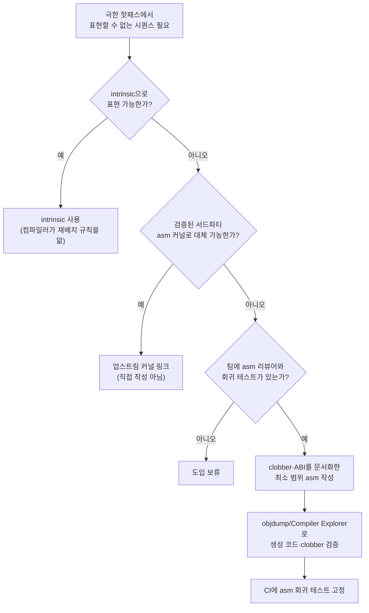

**Hand-written 어셈블리**란 컴파일러가 생성하는 코드나 intrinsic으로는 표현할 수 없는 극히 드문 상황에서, 사람이 명령어 시퀀스를 직접 지정해 C++ 코드 안(인라인 asm)이나 별도 파일(독립 asm)에 써 넣는 것을 말합니다. 이 선택지는 SIMD intrinsic·자동 벡터화·branchless 패턴 같은 상위 계층의 도구가 모두 소진된 뒤에야 검토할 만한 마지막 수단이며, 대가도 그만큼 큽니다. 어셈블리 블록은 컴파일러 최적화기 입장에서 사실상 블랙박스이고, 그 경계를 어떻게 선언하느냐(입력·출력·clobber)에 따라 주변 코드가 재배치되거나 레지스터가 덮어써지는 방식이 통째로 달라집니다. 이 장은 "언제 정말 손으로 asm을 써야 하는가"라는 판단과, 그것을 쓰기로 했을 때 컴파일러·ABI와의 상호작용에서 무엇을 명시해야 안전한지, 그리고 그 결정이 남기는 유지보수·이식성 비용을 다룹니다.

## 이 장을 읽기 전에

**완전한 초보자?** 이 장은 컴파일러가 삼항 연산자나 비트마스크를 CMOV로 내릴지 분기로 내릴지 "구현 정의"라는 감각을 다룬 [Branchless 프로그래밍 기법](/post/extreme-optimization/branchless-programming-techniques/)과, 특정 연산을 컴파일러 intrinsic으로 표현하는 방법을 정리한 [SIMD Intrinsics 실전 활용](/post/extreme-optimization/simd-intrinsics-practical-usage/)을 전제로 합니다. x86-64 레지스터 이름(rax, rdi 등)과 함수 호출 규약(호출자가 인자를 어디에 넣는지)의 기본 개념을 알고 있으면 충분합니다.

**이 장의 깊이**: 이 장은 **전문** 수준입니다. GCC/Clang의 GNU 확장 asm 문법으로 입력·출력·clobber를 선언하는 방법, 컴파일러가 그 선언만 믿고 주변 코드를 최적화하는 메커니즘, 독립 asm 함수가 지켜야 할 호출 규약, 그리고 이 모든 것이 컴파일러 버전·플랫폼이 바뀔 때 깨지는 방식까지 다룹니다. **다루지 않는 것**: 특정 명령어의 intrinsic 매핑은 [SIMD Intrinsics 실전 활용](/post/extreme-optimization/simd-intrinsics-practical-usage/)과 [컴파일러 intrinsics 카탈로그](/post/compiler-optimization/compiler-intrinsics-catalog/)에서, AVX-512 같은 특정 ISA의 세부 명령어는 [AVX-512/AVX10.2 최적화](/post/extreme-optimization/avx512-avx10-optimization/)에서, 어셈블리 수준까지 내려간 핫패스 사례 전체는 [핫패스 극한 튜닝 사례](/post/extreme-optimization/hotpath-extreme-tuning-case-studies/)에서 다룹니다. 이 장에서는 "asm을 직접 쓰는 결정 자체"와 그 위험 관리에 집중합니다.

## 당신의 수준에 맞는 경로

| 수준 | 읽을 부분 | 핵심 목표 |
|------|---------|---------|
| **중급자** | 도입 ~ "인라인 asm과 독립 asm" | asm을 직접 쓰는 상황이 왜 드물어야 하는지 이해 |
| **심화 학습자** | "컴파일러와의 상호작용 위험" ~ "흔한 오개념" | clobber·ABI 선언 누락이 실제로 어떤 버그를 만드는지 재현·검증 |
| **전문가** | "판단 기준" ~ "비판적 시각" | asm 도입 여부를 팀 차원의 비용으로 판단하고 설명 |

---

## 인라인 asm의 등장과 쇠퇴 (역사·배경)

C 컴파일러에 `asm`/`__asm` 키워드로 어셈블리를 끼워 넣는 관행은 컴파일러마다 독자적으로 발전해 왔습니다. GCC는 기본(basic) asm에서 출발해 이른 시기에 **확장(extended) asm** 문법으로 발전시켰습니다. 출력·입력 피연산자를 제약 문자열(constraint string)로 지정하고 clobber 목록으로 부작용을 선언하는 방식으로, 이 설계는 지금까지 GCC·Clang·ICX가 공유하는 사실상의 표준 방언이 되었습니다. 반면 MSVC는 x86 32비트 시절 자체 `__asm` 블록 문법을 제공했지만, x64로 넘어오면서 이를 제거했습니다. Microsoft 공식 문서는 이 사실을 다음과 같이 명시합니다.

> "Inline assembly is not supported on the ARM and x64 processors." — [Microsoft Learn: Inline Assembler](https://learn.microsoft.com/en-us/cpp/assembler/inline/inline-assembler?view=msvc-170)

x64/ARM64 타겟에서 MSVC는 intrinsic이나 별도의 MASM(`.asm`) 파일만 지원하며, 이는 "컴파일러 인라인 asm 문법 자체가 플랫폼·벤더에 따라 완전히 다르고 언제든 없어질 수 있는 방언"이라는 것을 보여주는 실례입니다. 실무에서 손으로 짠 asm이 실제로 살아남은 자리는 대개 좁습니다. OpenSSL·BoringSSL 같은 암호 라이브러리는 곱셈·타원곡선 연산 커널을 Perl 스크립트로 생성한 asm으로 유지하고, glibc의 `memcpy`·`strlen` 계열은 마이크로아키텍처별 asm 구현을 오랫동안 손으로 튜닝해 왔으며, 코루틴·그린스레드 런타임(예: Boost.Context)은 스택 전환 시 레지스터를 직접 저장·복원하는 asm 없이는 구현 자체가 불가능합니다. 검증 문화 쪽에서는 2012년 Matt Godbolt가 "GCC Explorer"라는 이름으로 시작해 2014년 4월 "Compiler Explorer"로 이름을 바꾼 웹 도구가, "asm을 짰으면 즉시 생성된 명령어를 눈으로 확인한다"는 습관을 업계 전반에 퍼뜨린 전환점으로 흔히 언급됩니다.

## 인라인 asm과 독립 asm

asm을 코드에 넣는 방법은 크게 두 갈래입니다. **인라인 asm**은 `asm volatile(...)` 문으로 C++ 함수 본문 안에 명령어를 끼워 넣는 방식이며, 컴파일러가 프롤로그·에필로그와 주변 레지스터 할당을 계속 책임집니다. 대신 asm 블록이 실제로 무엇을 읽고 쓰는지는 프로그래머가 입력·출력·clobber 목록으로 정확히 선언해야 하고, 컴파일러는 그 선언만 신뢰합니다. **독립 asm**은 함수 전체를 별도의 `.s`(GAS) 또는 `.asm`(MASM/NASM) 파일에 통째로 작성해 어셈블러로 컴파일한 뒤 `extern "C"`로 링크하는 방식입니다. 이 경우 프롤로그·에필로그도 프로그래머가 직접 써야 하므로, 호출 규약(어느 레지스터로 인자를 받는지, 어느 레지스터를 보존해야 하는지, 스택을 몇 바이트 정렬해야 하는지)을 한 글자도 틀리지 않고 재현해야 합니다. 두 방식 모두 "컴파일러가 대신 챙겨주던 것을 프로그래머가 떠맡는다"는 공통점이 있고, 그 대가로 위 두 절에서 다룰 상호작용 위험과 이식성 비용이 따라옵니다.

## 컴파일러와의 상호작용 위험

GNU 확장 asm에서 컴파일러는 asm 블록이 선언된 출력·입력·clobber 목록만 보고 그 블록 앞뒤로 코드를 재배치하거나 값을 레지스터에 캐시해 둘지 결정합니다. GCC 공식 문서는 이 경계를 다음과 같이 설명합니다.

> "While the compiler is aware of changes to entries listed in the output operands, the inline `asm` code may modify more than just the outputs." — [GCC: Extended Asm](https://gcc.gnu.org/onlinedocs/gcc/Extended-Asm.html)

즉 asm 블록이 선언되지 않은 메모리를 읽거나 쓰면, 컴파일러의 최적화 모델과 실제 동작이 어긋나기 시작합니다. 이를 막는 것이 **`"memory"` clobber**입니다. 같은 문서는 이렇게 설명합니다.

> "The `\"memory\"` clobber tells the compiler that the assembly code performs memory reads or writes to items other than those listed in the input and output operands... Using the `\"memory\"` clobber effectively forms a read/write memory barrier for the compiler." — [GCC: Extended Asm](https://gcc.gnu.org/onlinedocs/gcc/Extended-Asm.html)

아래는 CPU의 타임스탬프 카운터를 읽는 `RDTSC` 명령어를 예로, 이 clobber를 빠뜨렸을 때 실제로 무엇이 깨지는지 보입니다.

```cpp
#include <cstdint>

static uint64_t g_value = 0;

// 깨진 버전: memory clobber가 없어 컴파일러가 이 asm 블록을
// 순수 계산(출력만 있고 부작용은 없는 연산)으로 오인할 수 있음
inline uint64_t read_tsc_broken() {
  uint32_t lo, hi;
  asm("rdtsc" : "=a"(lo), "=d"(hi));
  return (static_cast<uint64_t>(hi) << 32) | lo;
}

uint64_t timed_broken() {
  uint64_t t0 = read_tsc_broken();
  g_value = 42;              // 이 저장이 두 rdtsc 사이가 아니라 앞뒤로 재배치될 수 있음
  uint64_t t1 = read_tsc_broken();
  return t1 - t0;
}
```

`read_tsc_broken`은 출력 피연산자(`lo`, `hi`)만 선언했을 뿐 "이 명령어가 실행되는 시점 자체가 중요하다"는 사실을 컴파일러에 알리지 않습니다. 최적화기 입장에서 이 asm 문은 그저 두 정수를 만들어내는 연산일 뿐이므로, `g_value = 42` 같은 주변 메모리 접근을 두 `rdtsc` 호출 사이에 그대로 둘 의무가 없습니다. 실제로 재배치가 일어나는지는 컴파일러·최적화 레벨·주변 코드에 따라 달라지는 **구현 정의** 영역이지만, 재배치가 허용된다는 사실 자체가 이미 버그입니다. 아래가 올바른 버전입니다.

```cpp
#include <cstdint>

// 올바른 버전: volatile로 asm이 사라지거나 옮겨지지 않게 하고,
// "memory" clobber로 앞뒤 메모리 접근이 이 지점을 넘어 재배치되지 않게 함
inline uint64_t read_tsc_fixed() {
  uint32_t lo, hi;
  asm volatile("rdtsc" : "=a"(lo), "=d"(hi) :: "memory");
  return (static_cast<uint64_t>(hi) << 32) | lo;
}
```

**검증**: `g++ -O2 -std=c++17 -S -masm=intel timed.cpp -o timed.s`로 두 버전을 각각 컴파일해 생성된 어셈블리를 비교합니다. `broken` 버전에서는 최적화 레벨에 따라 `mov qword ptr [g_value], 42`가 두 `rdtsc` 사이에 있다는 보장이 없고, `fixed` 버전에서는 `"memory"` clobber 때문에 순서가 유지됩니다. 다만 이 clobber는 **컴파일러 수준의 재배치만** 막을 뿐, `RDTSC` 자체가 이전 명령어의 완료를 기다리지 않는 비직렬화(non-serializing) 명령어라는 **CPU 수준의 별개 문제**는 해결하지 못합니다. Intel 매뉴얼은 이를 다음과 같이 명시합니다.

> "The RDTSC instruction is not a serializing instruction. It does not necessarily wait until all previous instructions have been executed before reading the counter." — [Felix Cloutier: x86 RDTSC 참조](https://www.felixcloutier.com/x86/rdtsc) (Intel SDM 기반)

정확한 구간 측정이 필요하면 `RDTSCP`나 `LFENCE`로 하드웨어 수준 순서까지 보장해야 하며, 이는 컴파일러 clobber와 무관한 별도의 조치입니다. 참고로 이 예시는 실전에서도 대부분 불필요한 위험입니다. GCC·Clang·MSVC 모두 `__rdtsc()` intrinsic(`<x86intrin.h>`/`<intrin.h>`)을 제공하므로, 굳이 인라인 asm으로 같은 명령어를 다시 쓸 이유가 거의 없습니다. intrinsic은 컴파일러가 직접 인식하는 노드이므로 재배치 규칙도 컴파일러가 정확히 알고 처리합니다.

독립 asm 함수에서는 이 문제가 clobber 선언이 아니라 **호출 규약(calling convention)** 그 자체로 나타납니다. System V AMD64 ABI(Linux·macOS)는 처음 여섯 개의 정수·포인터 인자를 `rdi, rsi, rdx, rcx, r8, r9` 순서로 넘기지만, Microsoft x64 호출 규약(Windows)은 처음 네 개만 `rcx, rdx, r8, r9`로 넘기고 호출자가 32바이트 "shadow space"를 스택에 미리 마련해야 합니다. 한 ABI를 가정하고 짠 독립 asm 함수를 다른 ABI 위에서 그대로 링크하면, 컴파일러가 아무 경고도 못 내는 채로 인자가 엉뚱한 레지스터에서 읽히거나 스택이 깨지는 결과로 이어집니다. 크로스 플랫폼 코드베이스가 독립 asm을 쓰려면 플랫폼별 파일을 따로 두고 빌드 시스템에서 갈라 태우는 비용을 반드시 계산에 넣어야 합니다.

## 흔한 오개념

<strong>"인라인 asm은 intrinsic보다 항상 빠르다"</strong>는 대체로 틀린 생각입니다. 위에서 본 것처럼 `__rdtsc()` intrinsic은 정확히 같은 `RDTSC` 명령어로 컴파일되며, 게다가 컴파일러가 그 명령어의 부작용을 정확히 알고 있으므로 주변 코드와 더 안전하게 스케줄링할 수 있습니다. 인라인 asm 블록은 프로그래머가 선언한 만큼만 컴파일러에 보이는 반투명한 블랙박스이고, 잘못 선언하면 오히려 최적화 기회를 막거나(과도한 clobber) 버그를 낳습니다(부족한 clobber). intrinsic이 존재하는 명령어를 굳이 asm으로 다시 쓰는 것은 위험만 늘리는 선택인 경우가 많습니다.

<strong>"clobber 목록만 정확히 쓰면 완전히 안전하다"</strong>도 과신입니다. clobber는 컴파일러의 최적화 모델을 asm의 실제 동작과 맞추는 장치일 뿐, RDTSC의 비직렬화 특성처럼 CPU 마이크로아키텍처 수준에서 벌어지는 재정렬은 다루지 못합니다. 또한 독립 asm 함수의 ABI 위반, 레드존(red zone) 가정 오류, Intel CET가 활성화된 환경에서 간접 호출 대상에 `ENDBR64` 착지 패드가 빠져 있는 경우처럼, clobber 선언 범위 바깥에 있는 위험은 여전히 남습니다. 이런 조건은 플랫폼·컴파일러·보안 완화 기능 설정에 따라 달라지므로 대상 환경에서 직접 확인해야 합니다.

<strong>"C++에는 표준 인라인 asm 문법이 있다"</strong>는 것도 흔한 오해입니다. ISO C++ 표준 문법에는 `asm-declaration`이 등장하지만, 그 의미(피연산자를 어떻게 선언하는지, clobber를 어떻게 쓰는지)는 표준이 규정하지 않고 전적으로 구현체에 위임합니다. GCC/Clang의 GNU 확장 asm과, x86 32비트 한정으로 남아 있던 MSVC의 `__asm` 블록은 서로 호환되지 않는 별개의 방언이며, 위 역사·배경 절에서 본 것처럼 MSVC는 x64/ARM64에서 이 방언 자체를 없앴습니다. "asm 코드는 컴파일러를 바꿔도 그대로 쓸 수 있다"는 가정은 성립하지 않습니다.

## 판단 기준

| 상황 | 권장 | 비권장 |
|------|------|--------|
| 필요한 연산이 intrinsic(`__rdtsc`, `__builtin_popcount`, CRC32 등)으로 노출되어 있음 | intrinsic 사용 | 같은 명령어를 asm으로 재작성 |
| 컴파일러가 어떤 최적화 레벨에서도 생성하지 않는 특정 시퀀스(컨텍스트 전환, syscall 스텁, 프리스탠딩 진입점)가 필요 | 최소 범위의 asm + clobber/ABI를 문서화하고 팀 리뷰 | 즉흥적으로 작성해 바로 병합 |
| 크로스 플랫폼·크로스 컴파일러 지원이 필수 | intrinsic·포터블 라이브러리 유지 | 단일 ISA·단일 방언 asm을 표준 경로로 채택 |
| 이미 검증된 서드파티 asm 커널(OpenSSL, 최적화된 codec 라이브러리 등)을 그대로 링크 | 업스트림 유지보수 위에서 재사용 | 같은 목적의 asm을 처음부터 새로 작성 |
| asm을 리뷰할 인원이나 회귀 테스트 인프라가 팀에 없음 | 도입 보류, C++/intrinsic 대안 재탐색 | "일단 넣고 나중에 정리" |

### 자주 하는 실수

- **clobber를 최소한만 선언**: `"memory"`를 빠뜨리면 주변 메모리 접근이 asm 블록을 넘어 재배치될 수 있다.
- **`volatile` 없이 출력 없는 asm 작성**: 출력 피연산자가 없는 asm 문은 컴파일러가 불필요하다고 판단해 통째로 제거할 수 있다(출력이 있는 asm은 암묵적으로 이 문제에서 비교적 자유롭지만, 부작용이 출력에 다 드러나지 않으면 여전히 위험하다).
- **ABI를 한 플랫폼 기준으로만 가정한 독립 asm**: System V와 Microsoft x64는 인자 레지스터·shadow space 규약이 다르므로, 다른 ABI에 그대로 링크하면 조용히 깨진다.
- **컴파일러 clobber와 CPU 재정렬을 혼동**: `"memory"` clobber는 컴파일러 수준 재배치만 막는다. `RDTSC` 같은 비직렬화 명령어의 하드웨어 순서 보장은 `LFENCE`/`RDTSCP` 같은 별도 수단이 필요하다.

## 비판적 시각: 한계와 트레이드오프

**유지보수 비용**이 가장 크고 지속적인 대가입니다. GNU 확장 asm과 MSVC 방언이 서로 다르고, 같은 GNU 방언 안에서도 AT&T 문법(GAS 기본값)과 Intel 문법(NASM·MASM 기본값, GCC/Clang은 `-masm=intel`로 출력만 바꿀 수 있음)이 갈리기 때문에, asm 블록 하나가 "이 컴파일러, 이 어셈블러, 이 플랫폼"이라는 좁은 조합에 묶입니다. 새 컴파일러 버전이 레지스터 할당 휴리스틱을 바꾸거나, Intel CET 같은 보안 완화 기능이 기본 활성화되거나, 팀에서 asm을 실제로 읽을 수 있는 사람이 이직하는 순간, 그 asm 블록은 "아무도 못 건드리는 코드"로 남습니다. **검증 도구의 사각지대**도 무시할 수 없습니다. AddressSanitizer·UndefinedBehaviorSanitizer 계열 도구는 asm 블록 내부의 메모리 접근을 계측하지 못하므로, C++ 코드에서라면 즉시 잡혔을 오버플로·미초기화 읽기가 asm 안에서는 조용히 통과할 수 있습니다. **성능 이득의 불확실성**도 짚어야 합니다. 최신 컴파일러의 레지스터 할당·명령어 스케줄링은 대부분의 핫패스에서 이미 사람이 손으로 짠 것과 비슷하거나 더 나은 코드를 만들어내며, intrinsic이 존재하는 영역에서는 asm이 성능을 더 끌어올리기보다 유지보수 비용만 추가하는 경우가 흔합니다. 실제로 asm이 여전히 살아남는 자리(암호 라이브러리의 곱셈 커널, 코루틴 스택 전환 등)는 대개 "컴파일러가 표현할 수 없는 정확한 명령어 시퀀스"가 필요한 좁은 지점이지, "컴파일러보다 내가 더 빠르게 짤 수 있다"는 일반적 낙관이 근거가 되는 자리가 아닙니다.



## 마무리

이 장을 읽은 후 다음을 스스로 확인할 수 있어야 합니다.

- [ ] 인라인 asm과 독립 asm의 차이, 그리고 각각이 컴파일러의 프롤로그/에필로그·ABI 책임을 어디까지 떠맡는지 설명할 수 있다.
- [ ] GNU 확장 asm의 출력·입력·clobber 선언이 컴파일러의 최적화 모델에 어떻게 반영되는지, `"memory"` clobber와 `volatile`의 역할 차이를 설명할 수 있다.
- [ ] clobber 누락이 실제로 재배치 버그를 만드는 사례를 재현하고, 생성된 어셈블리로 검증할 수 있다.
- [ ] 컴파일러 수준 재배치(clobber로 해결)와 CPU 수준 비직렬화(LFENCE/RDTSCP로 해결)를 구분할 수 있다.
- [ ] System V와 Microsoft x64 호출 규약의 차이가 독립 asm 함수의 이식성에 미치는 영향을 설명할 수 있다.
- [ ] asm 도입 여부를 intrinsic·라이브러리 대안, 팀의 리뷰·회귀 테스트 역량과 함께 비용으로 판단할 수 있다.

**이전 장**: [Branchless 프로그래밍 기법](/post/extreme-optimization/branchless-programming-techniques/) (챕터 06)

손으로 짠 asm까지 검토했다면, 그보다 훨씬 자주 쓰이고 위험은 낮으면서도 확실한 이득을 주는 선택지가 남아 있습니다. 다음 장에서는 반복 계산을 미리 계산된 테이블 조회로 바꾸는 **Lookup Table 최적화**를 다루며, 이 장에서 강조한 "검증 가능한 범위 안에서만 최적화를 적용한다"는 원칙을 이어받아 테이블 크기·캐시 적중률·분기 제거 효과를 판단하는 기준을 정리합니다.

→ [Lookup Table 최적화](/post/extreme-optimization/lookup-table-optimization-techniques/) (챕터 08)
